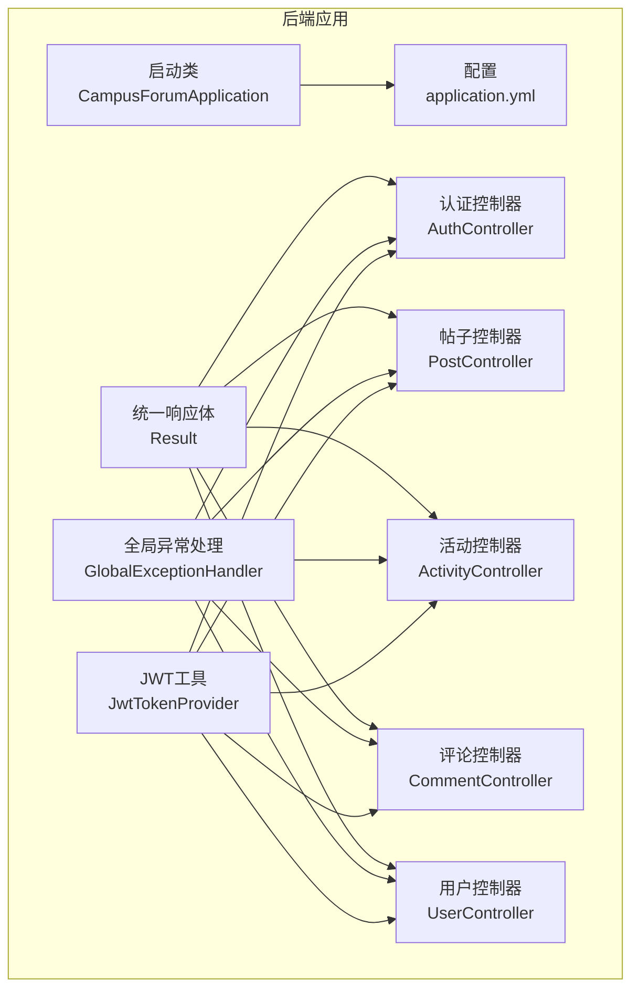
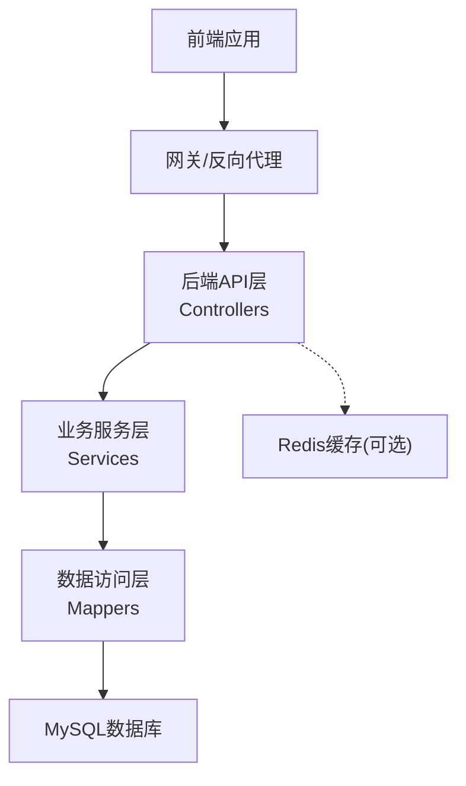
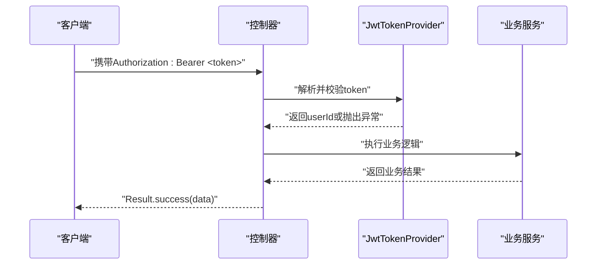
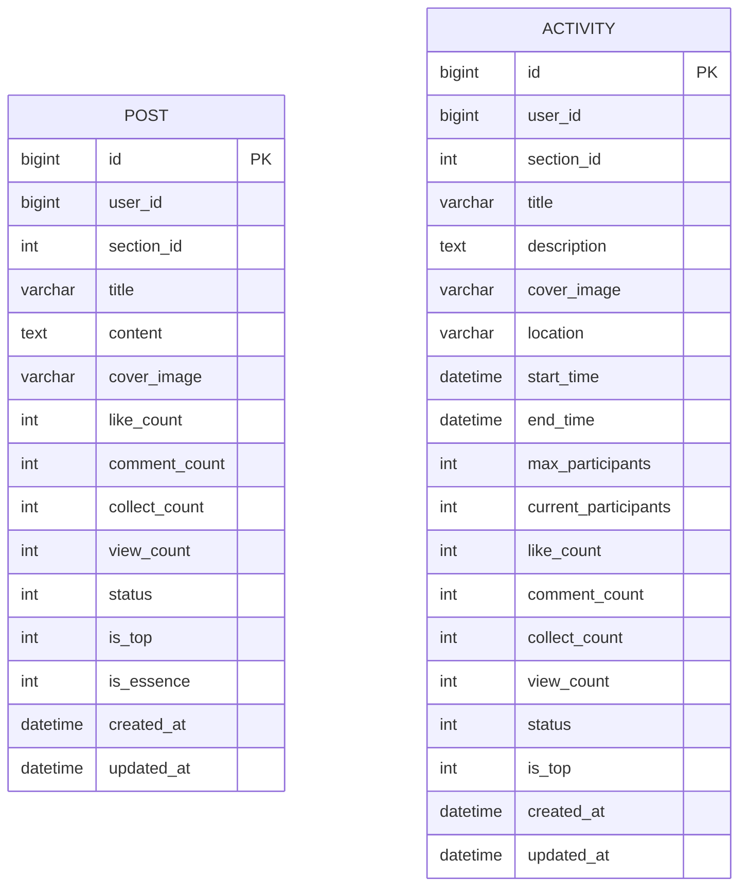
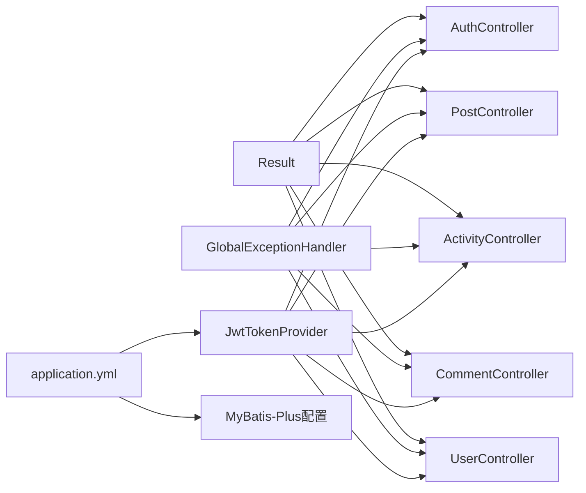

# API接口文档

<cite>
**本文引用的文件**
- [CampusForumApplication.java](file://campus-forum-backend/src/main/java/com/campus/forum/CampusForumApplication.java)
- [application.yml](file://campus-forum-backend/src/main/resources/application.yml)
- [Result.java](file://campus-forum-backend/src/main/java/com/campus/forum/common/Result.java)
- [GlobalExceptionHandler.java](file://campus-forum-backend/src/main/java/com/campus/forum/common/GlobalExceptionHandler.java)
- [JwtTokenProvider.java](file://campus-forum-backend/src/main/java/com/campus/forum/security/JwtTokenProvider.java)
- [AuthController.java](file://campus-forum-backend/src/main/java/com/campus/forum/controller/AuthController.java)
- [PostController.java](file://campus-forum-backend/src/main/java/com/campus/forum/controller/PostController.java)
- [ActivityController.java](file://campus-forum-backend/src/main/java/com/campus/forum/controller/ActivityController.java)
- [CommentController.java](file://campus-forum-backend/src/main/java/com/campus/forum/controller/CommentController.java)
- [UserController.java](file://campus-forum-backend/src/main/java/com/campus/forum/controller/UserController.java)
- [LoginRequest.java](file://campus-forum-backend/src/main/java/com/campus/forum/dto/request/LoginRequest.java)
- [RegisterRequest.java](file://campus-forum-backend/src/main/java/com/campus/forum/dto/request/RegisterRequest.java)
- [PostCreateRequest.java](file://campus-forum-backend/src/main/java/com/campus/forum/dto/request/PostCreateRequest.java)
- [Post.java](file://campus-forum-backend/src/main/java/com/campus/forum/entity/Post.java)
- [Activity.java](file://campus-forum-backend/src/main/java/com/campus/forum/entity/Activity.java)
</cite>

## 目录
1. [简介](#简介)
2. [项目结构](#项目结构)
3. [核心组件](#核心组件)
4. [架构总览](#架构总览)
5. [详细组件分析](#详细组件分析)
6. [依赖分析](#依赖分析)
7. [性能考虑](#性能考虑)
8. [故障排查指南](#故障排查指南)
9. [结论](#结论)
10. [附录](#附录)

## 简介
本项目为校园论坛平台后端服务，采用Spring Boot + MyBatis-Plus构建，提供统一的RESTful API接口，覆盖用户认证、帖子管理、活动管理、评论互动、用户资料与关注等模块。系统内置JWT认证机制，统一响应体与全局异常处理，并通过Knife4j提供在线接口文档。

## 项目结构
后端工程采用标准Maven目录结构，主要模块如下：
- common：统一响应体与全局异常处理
- config：跨域、MyBatis-Plus、安全与WebSocket配置
- controller：各业务模块API控制器
- dto：请求/响应数据传输对象
- entity/mapper/service：领域模型、数据映射与业务服务
- security：JWT工具与用户细节服务
- resources：配置文件与Mapper XML

图表来源
- [CampusForumApplication.java:1-17](file://campus-forum-backend/src/main/java/com/campus/forum/CampusForumApplication.java#L1-L17)
- [application.yml:1-53](file://campus-forum-backend/src/main/resources/application.yml#L1-L53)
- [Result.java:1-37](file://campus-forum-backend/src/main/java/com/campus/forum/common/Result.java#L1-L37)
- [GlobalExceptionHandler.java:1-57](file://campus-forum-backend/src/main/java/com/campus/forum/common/GlobalExceptionHandler.java#L1-L57)
- [JwtTokenProvider.java:1-93](file://campus-forum-backend/src/main/java/com/campus/forum/security/JwtTokenProvider.java#L1-L93)
- [AuthController.java:1-39](file://campus-forum-backend/src/main/java/com/campus/forum/controller/AuthController.java#L1-L39)
- [PostController.java:1-65](file://campus-forum-backend/src/main/java/com/campus/forum/controller/PostController.java#L1-L65)
- [ActivityController.java:1-83](file://campus-forum-backend/src/main/java/com/campus/forum/controller/ActivityController.java#L1-L83)
- [CommentController.java:1-115](file://campus-forum-backend/src/main/java/com/campus/forum/controller/CommentController.java#L1-L115)
- [UserController.java:1-83](file://campus-forum-backend/src/main/java/com/campus/forum/controller/UserController.java#L1-L83)

章节来源
- [CampusForumApplication.java:1-17](file://campus-forum-backend/src/main/java/com/campus/forum/CampusForumApplication.java#L1-L17)
- [application.yml:1-53](file://campus-forum-backend/src/main/resources/application.yml#L1-L53)

## 核心组件
- 统一响应体：所有接口返回统一结构，包含状态码、消息与数据体，便于前端一致化处理。
- 全局异常处理：对业务异常、参数校验异常、权限不足与系统异常进行分类处理，返回标准化错误信息。
- JWT认证：基于Header中的Authorization字段携带Bearer Token，支持解析用户ID与令牌校验；部分匿名接口可静默提取用户ID以记录行为。
- 配置中心：数据库连接、JWT密钥与过期时间、AI Provider、文件上传路径、Knife4j开关等集中配置。

章节来源
- [Result.java:1-37](file://campus-forum-backend/src/main/java/com/campus/forum/common/Result.java#L1-L37)
- [GlobalExceptionHandler.java:1-57](file://campus-forum-backend/src/main/java/com/campus/forum/common/GlobalExceptionHandler.java#L1-L57)
- [JwtTokenProvider.java:1-93](file://campus-forum-backend/src/main/java/com/campus/forum/security/JwtTokenProvider.java#L1-L93)
- [application.yml:30-46](file://campus-forum-backend/src/main/resources/application.yml#L30-L46)

## 架构总览
系统采用前后端分离架构，后端提供RESTful API，前端通过HTTP请求调用接口并处理响应。JWT用于用户身份认证与授权，全局异常处理器保证错误信息的一致性。

## 详细组件分析

### 认证接口
- 接口前缀：/api/auth
- 统一响应体：成功返回200，失败返回对应错误码与消息
- 请求头：Content-Type: application/json
- 错误码：400参数错误、403权限不足、500系统错误

1) 用户注册
- 方法：POST
- 路径：/api/auth/register
- 请求体字段：username、password、nickname、email
- 成功响应：空数据体
- 失败响应：错误码与错误信息

2) 用户登录
- 方法：POST
- 路径：/api/auth/login
- 请求体字段：username、password
- 成功响应：包含token与用户信息的对象
- 失败响应：错误码与错误信息

章节来源
- [AuthController.java:1-39](file://campus-forum-backend/src/main/java/com/campus/forum/controller/AuthController.java#L1-L39)
- [LoginRequest.java:1-14](file://campus-forum-backend/src/main/java/com/campus/forum/dto/request/LoginRequest.java#L1-L14)
- [RegisterRequest.java:1-22](file://campus-forum-backend/src/main/java/com/campus/forum/dto/request/RegisterRequest.java#L1-L22)

### 帖子管理接口
- 接口前缀：/api/posts
- 鉴权：除详情与列表外，其余接口需携带JWT
- 请求头：Authorization: Bearer <token>（除匿名接口）
- 分页参数：page（默认1）、size（默认10）

1) 帖子列表（分页）
- 方法：GET
- 路径：/api/posts
- 查询参数：page、size、sectionId（可选）、keyword（可选）
- 成功响应：分页结果，包含帖子列表

2) 帖子详情
- 方法：GET
- 路径：/api/posts/{id}
- 路径参数：id
- 成功响应：帖子详情（匿名接口，可静默提取用户ID记录行为）

3) 发布帖子
- 方法：POST
- 路径：/api/posts
- 请求体字段：title、content、sectionId（可选）、coverImage（可选）
- 成功响应：新发布的帖子对象

4) 删除帖子
- 方法：DELETE
- 路径：/api/posts/{id}
- 路径参数：id
- 成功响应：空数据体

5) 点赞/取消点赞
- 方法：POST
- 路径：/api/posts/{id}/like
- 路径参数：id
- 成功响应：布尔值，表示当前是否已点赞

章节来源
- [PostController.java:1-65](file://campus-forum-backend/src/main/java/com/campus/forum/controller/PostController.java#L1-L65)
- [PostCreateRequest.java:1-17](file://campus-forum-backend/src/main/java/com/campus/forum/dto/request/PostCreateRequest.java#L1-L17)
- [Post.java:1-35](file://campus-forum-backend/src/main/java/com/campus/forum/entity/Post.java#L1-L35)

### 活动管理接口
- 接口前缀：/api/activities
- 鉴权：除详情与列表外，其余接口需携带JWT
- 请求头：Authorization: Bearer <token>
- 分页参数：page（默认1）、size（默认10）

1) 活动列表（分页）
- 方法：GET
- 路径：/api/activities
- 查询参数：page、size、sectionId（可选）、status（可选）、keyword（可选）
- 成功响应：分页结果，包含活动列表

2) 活动详情
- 方法：GET
- 路径：/api/activities/{id}
- 路径参数：id
- 成功响应：活动详情（可携带用户ID）

3) 发布活动
- 方法：POST
- 路径：/api/activities
- 请求体字段：title、description、coverImage、location、startTime、endTime、maxParticipants
- 成功响应：新发布的活动对象

4) 点赞/取消点赞
- 方法：POST
- 路径：/api/activities/{id}/like
- 路径参数：id
- 成功响应：布尔值，表示当前是否已点赞

5) 收藏/取消收藏
- 方法：POST
- 路径：/api/activities/{id}/collect
- 路径参数：id
- 成功响应：布尔值，表示当前是否已收藏

6) 协同过滤推荐活动
- 方法：GET
- 路径：/api/activities/recommend
- 查询参数：size（默认10）
- 成功响应：活动列表

章节来源
- [ActivityController.java:1-83](file://campus-forum-backend/src/main/java/com/campus/forum/controller/ActivityController.java#L1-L83)
- [Activity.java:1-39](file://campus-forum-backend/src/main/java/com/campus/forum/entity/Activity.java#L1-L39)

### 评论管理接口
- 接口前缀：/api/comments
- 鉴权：除查询评论树外，其余接口需携带JWT
- 请求头：Authorization: Bearer <token>
- 通用目标类型：post、activity

1) 获取评论树
- 方法：GET
- 路径：/api/comments
- 查询参数：targetId（必填）、targetType（默认post）
- 成功响应：根评论列表，每个根评论包含replies子节点

2) 发表评论/回复
- 方法：POST
- 路径：/api/comments
- 请求体字段：targetId、targetType、parentId（回复时必填）、replyUid（被回复用户ID）、content
- 成功响应：新建评论对象（异步发送通知）

3) 删除评论
- 方法：DELETE
- 路径：/api/comments/{id}
- 路径参数：id
- 成功响应：空数据体

4) 评论点赞
- 方法：POST
- 路径：/api/comments/{id}/like
- 路径参数：id
- 成功响应：包含liked与likeCount的对象

章节来源
- [CommentController.java:1-115](file://campus-forum-backend/src/main/java/com/campus/forum/controller/CommentController.java#L1-L115)

### 用户模块接口
- 接口前缀：/api/users
- 鉴权：除查看他人信息外，其余接口需携带JWT
- 请求头：Authorization: Bearer <token>

1) 获取用户信息
- 方法：GET
- 路径：/api/users/{id}
- 路径参数：id
- 成功响应：用户对象

2) 编辑个人资料
- 方法：PUT
- 路径：/api/users/profile
- 请求体字段：nickname、avatar、bio
- 成功响应：更新后的用户对象

3) 关注/取关
- 方法：POST
- 路径：/api/users/{id}/follow
- 路径参数：id
- 成功响应：布尔值，表示当前是否已关注

4) 粉丝列表
- 方法：GET
- 路径：/api/users/{id}/followers
- 路径参数：id
- 查询参数：page（默认1）、size（默认20）
- 成功响应：分页粉丝列表

5) 关注列表
- 方法：GET
- 路径：/api/users/{id}/following
- 路径参数：id
- 查询参数：page（默认1）、size（默认20）
- 成功响应：分页关注列表

6) 用户帖子列表
- 方法：GET
- 路径：/api/users/{id}/posts
- 路径参数：id
- 查询参数：page（默认1）、size（默认10）
- 成功响应：分页帖子列表

7) 检查是否关注
- 方法：GET
- 路径：/api/users/{id}/is-following
- 路径参数：id
- 成功响应：布尔值

章节来源
- [UserController.java:1-83](file://campus-forum-backend/src/main/java/com/campus/forum/controller/UserController.java#L1-L83)

### JWT认证机制与权限验证
- 请求头配置：Authorization: Bearer <token>
- 令牌解析：从Header的Authorization中提取Bearer token，若为空则尝试从URL参数token读取（WebSocket场景）
- 用户ID提取：成功解析后返回userId，失败抛出业务异常或返回空（静默模式）
- 过期与有效性：基于配置的secret与过期时间进行签名校验

图表来源
- [JwtTokenProvider.java:64-82](file://campus-forum-backend/src/main/java/com/campus/forum/security/JwtTokenProvider.java#L64-L82)
- [PostController.java:44-54](file://campus-forum-backend/src/main/java/com/campus/forum/controller/PostController.java#L44-L54)
- [ActivityController.java:52-56](file://campus-forum-backend/src/main/java/com/campus/forum/controller/ActivityController.java#L52-L56)
- [UserController.java:35-47](file://campus-forum-backend/src/main/java/com/campus/forum/controller/UserController.java#L35-L47)

章节来源
- [JwtTokenProvider.java:1-93](file://campus-forum-backend/src/main/java/com/campus/forum/security/JwtTokenProvider.java#L1-L93)

### 数据模型与复杂度分析
- 帖子实体：包含基础字段、状态与计数字段，插入/更新自动填充时间戳
- 活动实体：包含时间范围、最大人数、当前人数与状态字段，插入/更新自动填充时间戳

图表来源
- [Post.java:1-35](file://campus-forum-backend/src/main/java/com/campus/forum/entity/Post.java#L1-L35)
- [Activity.java:1-39](file://campus-forum-backend/src/main/java/com/campus/forum/entity/Activity.java#L1-L39)

章节来源
- [Post.java:1-35](file://campus-forum-backend/src/main/java/com/campus/forum/entity/Post.java#L1-L35)
- [Activity.java:1-39](file://campus-forum-backend/src/main/java/com/campus/forum/entity/Activity.java#L1-L39)

## 依赖分析
- 控制器依赖统一响应体与异常处理，确保接口风格一致
- 安全组件依赖配置中心提供的JWT密钥与过期时间
- 业务层通过Mapper访问数据库，遵循MyBatis-Plus约定

图表来源
- [Result.java:1-37](file://campus-forum-backend/src/main/java/com/campus/forum/common/Result.java#L1-L37)
- [GlobalExceptionHandler.java:1-57](file://campus-forum-backend/src/main/java/com/campus/forum/common/GlobalExceptionHandler.java#L1-L57)
- [JwtTokenProvider.java:1-93](file://campus-forum-backend/src/main/java/com/campus/forum/security/JwtTokenProvider.java#L1-L93)
- [application.yml:19-28](file://campus-forum-backend/src/main/resources/application.yml#L19-L28)
- [AuthController.java:1-39](file://campus-forum-backend/src/main/java/com/campus/forum/controller/AuthController.java#L1-L39)
- [PostController.java:1-65](file://campus-forum-backend/src/main/java/com/campus/forum/controller/PostController.java#L1-L65)
- [ActivityController.java:1-83](file://campus-forum-backend/src/main/java/com/campus/forum/controller/ActivityController.java#L1-L83)
- [CommentController.java:1-115](file://campus-forum-backend/src/main/java/com/campus/forum/controller/CommentController.java#L1-L115)
- [UserController.java:1-83](file://campus-forum-backend/src/main/java/com/campus/forum/controller/UserController.java#L1-L83)

章节来源
- [application.yml:19-28](file://campus-forum-backend/src/main/resources/application.yml#L19-L28)

## 性能考虑
- 分页查询：列表接口均支持分页参数，建议前端按需加载，避免一次性拉取大量数据
- 评论树：根评论加载后按需递归加载回复，注意控制层级深度
- 行为记录：匿名接口可静默提取用户ID记录浏览等行为，减少鉴权开销
- 文件上传：后端限制单文件与请求大小，前端应控制附件尺寸与数量

## 故障排查指南
- 400参数错误：检查请求体字段是否符合DTO约束（非空、长度范围等）
- 403权限不足：确认是否携带有效JWT或是否越权操作
- 500系统错误：查看后端日志定位异常堆栈，通常由未捕获异常触发全局异常处理器

章节来源
- [GlobalExceptionHandler.java:1-57](file://campus-forum-backend/src/main/java/com/campus/forum/common/GlobalExceptionHandler.java#L1-L57)

## 结论
本项目提供了完善的RESTful API体系，覆盖认证、内容管理、互动与用户关系等核心功能。通过统一响应体与异常处理、JWT认证与配置中心，保障了接口的一致性与安全性。建议在生产环境中结合限流、缓存与监控进一步提升稳定性与性能。

## 附录

### 统一响应体与错误码
- 成功：code=200，message="success"
- 业务异常：code=业务定义，message=异常描述
- 参数校验失败：code=400，message=字段校验错误
- 权限不足：code=403，message="无权限访问"
- 系统错误：code=500，message="系统内部错误：..."

章节来源
- [Result.java:1-37](file://campus-forum-backend/src/main/java/com/campus/forum/common/Result.java#L1-L37)
- [GlobalExceptionHandler.java:1-57](file://campus-forum-backend/src/main/java/com/campus/forum/common/GlobalExceptionHandler.java#L1-L57)

### 配置项说明
- 服务器端口与上下文：server.port、server.servlet.context-path
- 数据源：driver-class-name、url、username、password
- 文件上传：multipart.max-file-size、multipart.max-request-size
- MyBatis-Plus：mapper-locations、逻辑删除字段、驼峰映射
- JWT：secret、expiration（毫秒）
- AI大模型：provider、api-key、secret-key、model、base-url
- 上传路径：upload.path、upload.url-prefix
- Knife4j：knife4j.enable、knife4j.setting.language

章节来源
- [application.yml:1-53](file://campus-forum-backend/src/main/resources/application.yml#L1-L53)