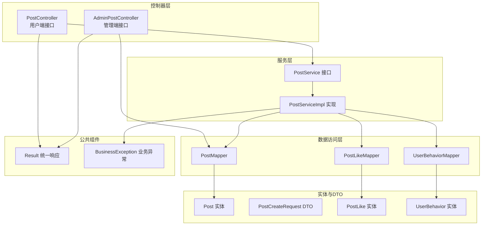
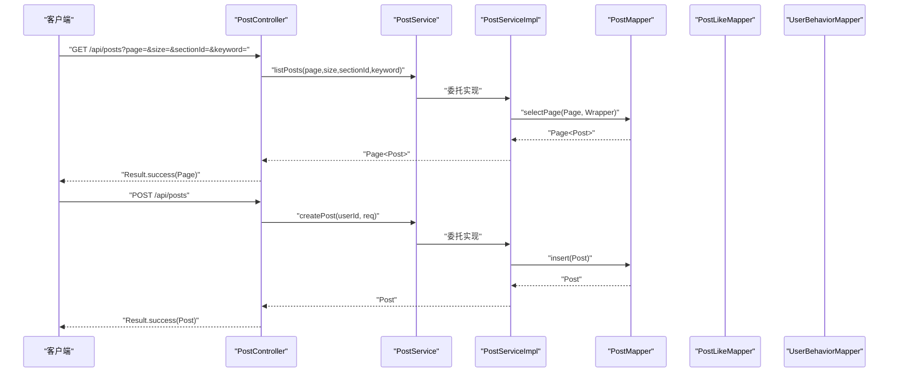
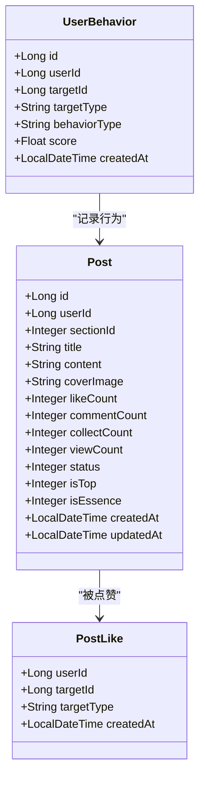
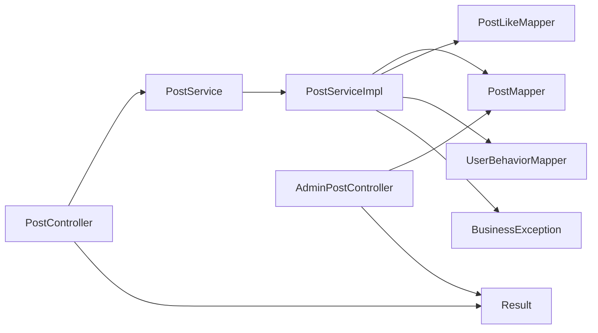

# 帖子管理API

<cite>
**本文档引用的文件**
- [PostController.java](file://campus-forum-backend/src/main/java/com/campus/forum/controller/PostController.java)
- [AdminPostController.java](file://campus-forum-backend/src/main/java/com/campus/forum/controller/admin/AdminPostController.java)
- [PostService.java](file://campus-forum-backend/src/main/java/com/campus/forum/service/PostService.java)
- [PostServiceImpl.java](file://campus-forum-backend/src/main/java/com/campus/forum/service/impl/PostServiceImpl.java)
- [Post.java](file://campus-forum-backend/src/main/java/com/campus/forum/entity/Post.java)
- [PostCreateRequest.java](file://campus-forum-backend/src/main/java/com/campus/forum/dto/request/PostCreateRequest.java)
- [PostMapper.java](file://campus-forum-backend/src/main/java/com/campus/forum/mapper/PostMapper.java)
- [PostLikeMapper.java](file://campus-forum-backend/src/main/java/com/campus/forum/mapper/PostLikeMapper.java)
- [UserBehaviorMapper.java](file://campus-forum-backend/src/main/java/com/campus/forum/mapper/UserBehaviorMapper.java)
- [PostLike.java](file://campus-forum-backend/src/main/java/com/campus/forum/entity/PostLike.java)
- [UserBehavior.java](file://campus-forum-backend/src/main/java/com/campus/forum/entity/UserBehavior.java)
- [Result.java](file://campus-forum-backend/src/main/java/com/campus/forum/common/Result.java)
- [BusinessException.java](file://campus-forum-backend/src/main/java/com/campus/forum/common/exception/BusinessException.java)
- [post.js](file://campus-forum-frontend/src/api/post.js)
</cite>

## 目录
1. [简介](#简介)
2. [项目结构](#项目结构)
3. [核心组件](#核心组件)
4. [架构总览](#架构总览)
5. [详细组件分析](#详细组件分析)
6. [依赖分析](#依赖分析)
7. [性能考虑](#性能考虑)
8. [故障排除指南](#故障排除指南)
9. [结论](#结论)

## 简介
本文件为“帖子管理模块”的完整API文档，覆盖以下能力范围：
- 帖子CRUD：创建、读取、删除
- 列表分页与筛选：按分区、关键词搜索
- 详情浏览与行为记录：浏览量统计、用户行为追踪
- 互动功能：点赞/取消点赞
- 管理后台：审核状态变更、置顶、加精、AI辅助审核、删除
- 数据模型与字段说明：状态、置顶、加精、计数字段等
- 请求参数校验、统一响应格式、权限控制机制
- 多媒体内容：封面图字段说明

本API基于Spring Boot + MyBatis-Plus实现，采用统一响应包装与业务异常处理。

## 项目结构
后端采用分层架构：
- 控制器层：对外暴露REST接口
- 服务层：封装业务逻辑
- 数据访问层：MyBatis-Plus Mapper
- 实体与DTO：数据模型与请求参数载体
- 公共组件：统一响应、业务异常

图表来源
- [PostController.java:1-65](file://campus-forum-backend/src/main/java/com/campus/forum/controller/PostController.java#L1-L65)
- [AdminPostController.java:1-91](file://campus-forum-backend/src/main/java/com/campus/forum/controller/admin/AdminPostController.java#L1-L91)
- [PostService.java:1-14](file://campus-forum-backend/src/main/java/com/campus/forum/service/PostService.java#L1-L14)
- [PostServiceImpl.java:1-114](file://campus-forum-backend/src/main/java/com/campus/forum/service/impl/PostServiceImpl.java#L1-L114)
- [PostMapper.java:1-15](file://campus-forum-backend/src/main/java/com/campus/forum/mapper/PostMapper.java#L1-L15)
- [PostLikeMapper.java:1-16](file://campus-forum-backend/src/main/java/com/campus/forum/mapper/PostLikeMapper.java#L1-L16)
- [UserBehaviorMapper.java:1-15](file://campus-forum-backend/src/main/java/com/campus/forum/mapper/UserBehaviorMapper.java#L1-L15)
- [Post.java:1-35](file://campus-forum-backend/src/main/java/com/campus/forum/entity/Post.java#L1-L35)
- [PostCreateRequest.java:1-17](file://campus-forum-backend/src/main/java/com/campus/forum/dto/request/PostCreateRequest.java#L1-L17)
- [PostLike.java:1-16](file://campus-forum-backend/src/main/java/com/campus/forum/entity/PostLike.java#L1-L16)
- [UserBehavior.java:1-22](file://campus-forum-backend/src/main/java/com/campus/forum/entity/UserBehavior.java#L1-L22)
- [Result.java:1-37](file://campus-forum-backend/src/main/java/com/campus/forum/common/Result.java#L1-L37)
- [BusinessException.java:1-22](file://campus-forum-backend/src/main/java/com/campus/forum/common/exception/BusinessException.java#L1-L22)

章节来源
- [PostController.java:1-65](file://campus-forum-backend/src/main/java/com/campus/forum/controller/PostController.java#L1-L65)
- [AdminPostController.java:1-91](file://campus-forum-backend/src/main/java/com/campus/forum/controller/admin/AdminPostController.java#L1-L91)
- [PostService.java:1-14](file://campus-forum-backend/src/main/java/com/campus/forum/service/PostService.java#L1-L14)
- [PostServiceImpl.java:1-114](file://campus-forum-backend/src/main/java/com/campus/forum/service/impl/PostServiceImpl.java#L1-L114)
- [PostMapper.java:1-15](file://campus-forum-backend/src/main/java/com/campus/forum/mapper/PostMapper.java#L1-L15)
- [PostLikeMapper.java:1-16](file://campus-forum-backend/src/main/java/com/campus/forum/mapper/PostLikeMapper.java#L1-L16)
- [UserBehaviorMapper.java:1-15](file://campus-forum-backend/src/main/java/com/campus/forum/mapper/UserBehaviorMapper.java#L1-L15)
- [Post.java:1-35](file://campus-forum-backend/src/main/java/com/campus/forum/entity/Post.java#L1-L35)
- [PostCreateRequest.java:1-17](file://campus-forum-backend/src/main/java/com/campus/forum/dto/request/PostCreateRequest.java#L1-L17)
- [PostLike.java:1-16](file://campus-forum-backend/src/main/java/com/campus/forum/entity/PostLike.java#L1-L16)
- [UserBehavior.java:1-22](file://campus-forum-backend/src/main/java/com/campus/forum/entity/UserBehavior.java#L1-L22)
- [Result.java:1-37](file://campus-forum-backend/src/main/java/com/campus/forum/common/Result.java#L1-L37)
- [BusinessException.java:1-22](file://campus-forum-backend/src/main/java/com/campus/forum/common/exception/BusinessException.java#L1-L22)

## 核心组件
- 控制器：提供REST接口，负责参数接收、鉴权提取、调用服务层并返回统一响应
- 服务接口与实现：封装业务规则，如创建、列表查询、详情浏览、删除、点赞等
- 数据访问：通过Mapper进行数据库操作，支持分页、条件查询、原生SQL
- 实体与DTO：定义数据结构与请求参数约束
- 统一响应与异常：Result统一封装返回；BusinessException用于业务错误

章节来源
- [PostController.java:1-65](file://campus-forum-backend/src/main/java/com/campus/forum/controller/PostController.java#L1-L65)
- [PostService.java:1-14](file://campus-forum-backend/src/main/java/com/campus/forum/service/PostService.java#L1-L14)
- [PostServiceImpl.java:1-114](file://campus-forum-backend/src/main/java/com/campus/forum/service/impl/PostServiceImpl.java#L1-L114)
- [Result.java:1-37](file://campus-forum-backend/src/main/java/com/campus/forum/common/Result.java#L1-L37)
- [BusinessException.java:1-22](file://campus-forum-backend/src/main/java/com/campus/forum/common/exception/BusinessException.java#L1-L22)

## 架构总览
用户端与管理端通过控制器暴露接口，服务层协调数据访问与业务规则，统一响应包装结果或错误信息。

图表来源
- [PostController.java:25-47](file://campus-forum-backend/src/main/java/com/campus/forum/controller/PostController.java#L25-L47)
- [PostService.java:7-12](file://campus-forum-backend/src/main/java/com/campus/forum/service/PostService.java#L7-L12)
- [PostServiceImpl.java:26-51](file://campus-forum-backend/src/main/java/com/campus/forum/service/impl/PostServiceImpl.java#L26-L51)
- [PostMapper.java:9-15](file://campus-forum-backend/src/main/java/com/campus/forum/mapper/PostMapper.java#L9-L15)

## 详细组件分析

### 用户端接口

#### 帖子列表（分页）
- 路径：GET /api/posts
- 权限：匿名可访问
- 查询参数：
  - page：页码，默认1
  - size：每页条数，默认10
  - sectionId：分区ID（可选）
  - keyword：标题关键词（可选）
- 返回：分页的帖子列表（仅展示已发布状态）
- 排序：按创建时间倒序
- 关键实现路径：
  - [PostController.list:25-33](file://campus-forum-backend/src/main/java/com/campus/forum/controller/PostController.java#L25-L33)
  - [PostServiceImpl.listPosts:42-51](file://campus-forum-backend/src/main/java/com/campus/forum/service/impl/PostServiceImpl.java#L42-L51)
  - [PostMapper.selectPage:9-15](file://campus-forum-backend/src/main/java/com/campus/forum/mapper/PostMapper.java#L9-L15)

章节来源
- [PostController.java:25-33](file://campus-forum-backend/src/main/java/com/campus/forum/controller/PostController.java#L25-L33)
- [PostServiceImpl.java:42-51](file://campus-forum-backend/src/main/java/com/campus/forum/service/impl/PostServiceImpl.java#L42-L51)

#### 帖子详情
- 路径：GET /api/posts/{id}
- 权限：匿名可访问
- 参数：id（路径变量）
- 行为记录：增加浏览量，并记录用户行为（若登录）
- 返回：单个帖子详情
- 关键实现路径：
  - [PostController.detail:35-40](file://campus-forum-backend/src/main/java/com/campus/forum/controller/PostController.java#L35-L40)
  - [PostServiceImpl.getPostById:53-65](file://campus-forum-backend/src/main/java/com/campus/forum/service/impl/PostServiceImpl.java#L53-L65)
  - [UserBehaviorMapper.selectByUserIdAndType:12-13](file://campus-forum-backend/src/main/java/com/campus/forum/mapper/UserBehaviorMapper.java#L12-L13)

章节来源
- [PostController.java:35-40](file://campus-forum-backend/src/main/java/com/campus/forum/controller/PostController.java#L35-L40)
- [PostServiceImpl.java:53-65](file://campus-forum-backend/src/main/java/com/campus/forum/service/impl/PostServiceImpl.java#L53-L65)
- [UserBehaviorMapper.java:12-13](file://campus-forum-backend/src/main/java/com/campus/forum/mapper/UserBehaviorMapper.java#L12-L13)

#### 发布帖子
- 路径：POST /api/posts
- 权限：需登录（从请求头解析用户ID）
- 请求体：PostCreateRequest（DTO）
  - 字段：title（必填）、content（必填）、sectionId（可选）、coverImage（可选）
- 返回：新创建的帖子
- 关键实现路径：
  - [PostController.create:42-47](file://campus-forum-backend/src/main/java/com/campus/forum/controller/PostController.java#L42-L47)
  - [PostServiceImpl.createPost:26-40](file://campus-forum-backend/src/main/java/com/campus/forum/service/impl/PostServiceImpl.java#L26-L40)
  - [PostCreateRequest:7-16](file://campus-forum-backend/src/main/java/com/campus/forum/dto/request/PostCreateRequest.java#L7-L16)

章节来源
- [PostController.java:42-47](file://campus-forum-backend/src/main/java/com/campus/forum/controller/PostController.java#L42-L47)
- [PostServiceImpl.java:26-40](file://campus-forum-backend/src/main/java/com/campus/forum/service/impl/PostServiceImpl.java#L26-L40)
- [PostCreateRequest.java:7-16](file://campus-forum-backend/src/main/java/com/campus/forum/dto/request/PostCreateRequest.java#L7-L16)

#### 删除帖子
- 路径：DELETE /api/posts/{id}
- 权限：需登录
- 规则：仅作者本人可删除；执行软删除（更新状态为已删除）
- 返回：空数据
- 关键实现路径：
  - [PostController.delete:49-55](file://campus-forum-backend/src/main/java/com/campus/forum/controller/PostController.java#L49-L55)
  - [PostServiceImpl.deletePost:67-76](file://campus-forum-backend/src/main/java/com/campus/forum/service/impl/PostServiceImpl.java#L67-L76)

章节来源
- [PostController.java:49-55](file://campus-forum-backend/src/main/java/com/campus/forum/controller/PostController.java#L49-L55)
- [PostServiceImpl.java:67-76](file://campus-forum-backend/src/main/java/com/campus/forum/service/impl/PostServiceImpl.java#L67-L76)

#### 点赞/取消点赞
- 路径：POST /api/posts/{id}/like
- 权限：需登录
- 行为：若已点赞则取消并扣减计数，否则新增点赞并累加计数；同时记录用户行为
- 返回：布尔值（当前是否已点赞）
- 关键实现路径：
  - [PostController.toggleLike:57-63](file://campus-forum-backend/src/main/java/com/campus/forum/controller/PostController.java#L57-L63)
  - [PostServiceImpl.toggleLike:78-103](file://campus-forum-backend/src/main/java/com/campus/forum/service/impl/PostServiceImpl.java#L78-L103)
  - [PostLikeMapper.checkLiked:10-11](file://campus-forum-backend/src/main/java/com/campus/forum/mapper/PostLikeMapper.java#L10-L11)

章节来源
- [PostController.java:57-63](file://campus-forum-backend/src/main/java/com/campus/forum/controller/PostController.java#L57-L63)
- [PostServiceImpl.java:78-103](file://campus-forum-backend/src/main/java/com/campus/forum/service/impl/PostServiceImpl.java#L78-L103)
- [PostLikeMapper.java:10-11](file://campus-forum-backend/src/main/java/com/campus/forum/mapper/PostLikeMapper.java#L10-L11)

### 管理端接口

#### 帖子列表（分页+筛选）
- 路径：GET /api/admin/posts
- 权限：管理员
- 查询参数：
  - page、size：分页
  - keyword：标题关键词（模糊）
  - status：状态筛选
- 返回：分页的帖子列表
- 关键实现路径：
  - [AdminPostController.list:27-40](file://campus-forum-backend/src/main/java/com/campus/forum/controller/admin/AdminPostController.java#L27-L40)
  - [PostMapper.selectPage:9-15](file://campus-forum-backend/src/main/java/com/campus/forum/mapper/PostMapper.java#L9-L15)

章节来源
- [AdminPostController.java:27-40](file://campus-forum-backend/src/main/java/com/campus/forum/controller/admin/AdminPostController.java#L27-L40)
- [PostMapper.java:9-15](file://campus-forum-backend/src/main/java/com/campus/forum/mapper/PostMapper.java#L9-L15)

#### 审核状态变更（上线/下线）
- 路径：PUT /api/admin/posts/{id}/status
- 权限：管理员
- 参数：status（目标状态）
- 返回：空数据
- 关键实现路径：
  - [AdminPostController.updateStatus:42-49](file://campus-forum-backend/src/main/java/com/campus/forum/controller/admin/AdminPostController.java#L42-L49)

章节来源
- [AdminPostController.java:42-49](file://campus-forum-backend/src/main/java/com/campus/forum/controller/admin/AdminPostController.java#L42-L49)

#### 置顶
- 路径：PUT /api/admin/posts/{id}/top
- 权限：管理员
- 参数：isTop（置顶标记）
- 返回：空数据
- 关键实现路径：
  - [AdminPostController.top:52-60](file://campus-forum-backend/src/main/java/com/campus/forum/controller/admin/AdminPostController.java#L52-L60)

章节来源
- [AdminPostController.java:52-60](file://campus-forum-backend/src/main/java/com/campus/forum/controller/admin/AdminPostController.java#L52-L60)

#### 加精
- 路径：PUT /api/admin/posts/{id}/essence
- 权限：管理员
- 参数：isEssence（加精标记）
- 返回：空数据
- 关键实现路径：
  - [AdminPostController.essence:62-70](file://campus-forum-backend/src/main/java/com/campus/forum/controller/admin/AdminPostController.java#L62-L70)

章节来源
- [AdminPostController.java:62-70](file://campus-forum-backend/src/main/java/com/campus/forum/controller/admin/AdminPostController.java#L62-L70)

#### AI辅助审核（违规检测）
- 路径：POST /api/admin/posts/{id}/ai-review
- 权限：管理员
- 返回：AI审核结果（Map）
- 关键实现路径：
  - [AdminPostController.aiReview:72-79](file://campus-forum-backend/src/main/java/com/campus/forum/controller/admin/AdminPostController.java#L72-L79)

章节来源
- [AdminPostController.java:72-79](file://campus-forum-backend/src/main/java/com/campus/forum/controller/admin/AdminPostController.java#L72-L79)

#### 删除帖子（管理端）
- 路径：DELETE /api/admin/posts/{id}
- 权限：管理员
- 返回：空数据
- 关键实现路径：
  - [AdminPostController.delete:81-89](file://campus-forum-backend/src/main/java/com/campus/forum/controller/admin/AdminPostController.java#L81-L89)

章节来源
- [AdminPostController.java:81-89](file://campus-forum-backend/src/main/java/com/campus/forum/controller/admin/AdminPostController.java#L81-L89)

### 数据模型与字段说明

图表来源
- [Post.java:12-35](file://campus-forum-backend/src/main/java/com/campus/forum/entity/Post.java#L12-L35)
- [PostLike.java:9-16](file://campus-forum-backend/src/main/java/com/campus/forum/entity/PostLike.java#L9-L16)
- [UserBehavior.java:9-22](file://campus-forum-backend/src/main/java/com/campus/forum/entity/UserBehavior.java#L9-L22)

章节来源
- [Post.java:12-35](file://campus-forum-backend/src/main/java/com/campus/forum/entity/Post.java#L12-L35)
- [PostLike.java:9-16](file://campus-forum-backend/src/main/java/com/campus/forum/entity/PostLike.java#L9-L16)
- [UserBehavior.java:9-22](file://campus-forum-backend/src/main/java/com/campus/forum/entity/UserBehavior.java#L9-L22)

### 请求参数验证与统一响应

- 请求参数验证：
  - 发布帖子时对标题与内容进行非空校验
  - 分页参数默认值在控制器层设置
- 统一响应：
  - 成功：code=200，message="success"，data为具体结果
  - 错误：code由异常决定，message为错误描述
- 异常处理：
  - 业务异常使用BusinessException，便于前端识别

章节来源
- [PostCreateRequest.java:7-16](file://campus-forum-backend/src/main/java/com/campus/forum/dto/request/PostCreateRequest.java#L7-L16)
- [Result.java:14-31](file://campus-forum-backend/src/main/java/com/campus/forum/common/Result.java#L14-L31)
- [BusinessException.java:12-20](file://campus-forum-backend/src/main/java/com/campus/forum/common/exception/BusinessException.java#L12-L20)

### 权限控制机制
- 登录态提取：通过JwtTokenProvider从请求中解析用户ID
- 用户端：
  - 发布、点赞、删除等操作均需登录
  - 删除仅允许作者本人
- 管理端：
  - 所有管理操作均需管理员权限（由安全配置提供）

章节来源
- [PostController.java:44-54](file://campus-forum-backend/src/main/java/com/campus/forum/controller/PostController.java#L44-L54)
- [PostServiceImpl.java:67-76](file://campus-forum-backend/src/main/java/com/campus/forum/service/impl/PostServiceImpl.java#L67-L76)

### 前端对接参考
- 前端API封装示例：
  - 获取列表、详情、创建、删除、点赞
- 前端页面使用示例：
  - 帖子详情页集成点赞、收藏、评论联动

章节来源
- [post.js:1-7](file://campus-forum-frontend/src/api/post.js#L1-L7)

## 依赖分析

图表来源
- [PostController.java:22-23](file://campus-forum-backend/src/main/java/com/campus/forum/controller/PostController.java#L22-L23)
- [PostServiceImpl.java:22-24](file://campus-forum-backend/src/main/java/com/campus/forum/service/impl/PostServiceImpl.java#L22-L24)
- [AdminPostController.java:24-25](file://campus-forum-backend/src/main/java/com/campus/forum/controller/admin/AdminPostController.java#L24-L25)

章节来源
- [PostController.java:22-23](file://campus-forum-backend/src/main/java/com/campus/forum/controller/PostController.java#L22-L23)
- [PostServiceImpl.java:22-24](file://campus-forum-backend/src/main/java/com/campus/forum/service/impl/PostServiceImpl.java#L22-L24)
- [AdminPostController.java:24-25](file://campus-forum-backend/src/main/java/com/campus/forum/controller/admin/AdminPostController.java#L24-L25)

## 性能考虑
- 分页查询：使用MyBatis-Plus Page对象，避免一次性加载大量数据
- 条件查询：根据传入参数动态拼接查询条件，减少无效扫描
- 浏览量统计：每次详情访问增加计数，建议结合缓存策略降低热点帖子的写压力
- 点赞/收藏：采用存在性检查与原子操作，避免重复记录

## 故障排除指南
- “帖子不存在”：常见于详情查询、点赞、管理操作前的空值检查
- “无权删除他人帖子”：删除接口对作者身份进行校验
- “请先登录”：前端未登录状态下调用需要登录的接口会失败
- 统一错误响应：查看Result中的code与message定位问题

章节来源
- [PostServiceImpl.java:56-76](file://campus-forum-backend/src/main/java/com/campus/forum/service/impl/PostServiceImpl.java#L56-L76)
- [BusinessException.java:12-20](file://campus-forum-backend/src/main/java/com/campus/forum/common/exception/BusinessException.java#L12-L20)
- [Result.java:26-31](file://campus-forum-backend/src/main/java/com/campus/forum/common/Result.java#L26-L31)

## 结论
本API围绕“帖子管理”提供完整的用户端与管理端能力，具备良好的扩展性与可维护性。通过统一响应与异常处理、严格的参数校验与权限控制，确保了接口的一致性与安全性。后续可在热点数据缓存、AI审核策略、互动计数一致性等方面持续优化。