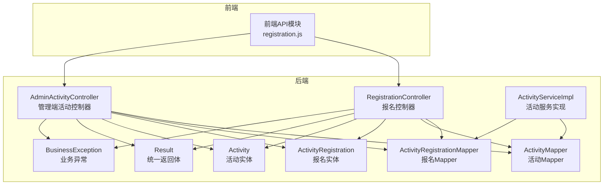
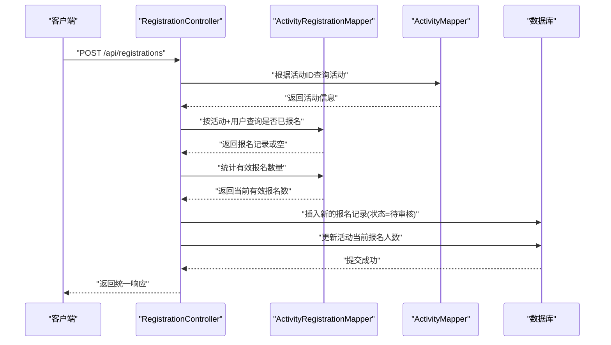
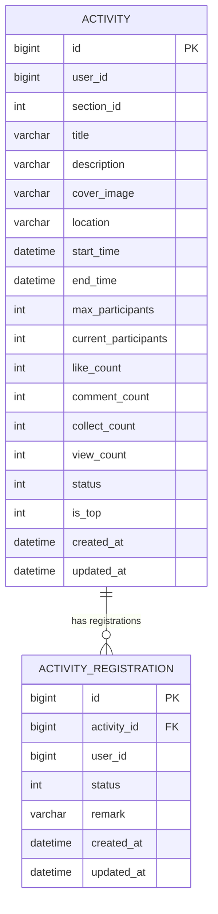
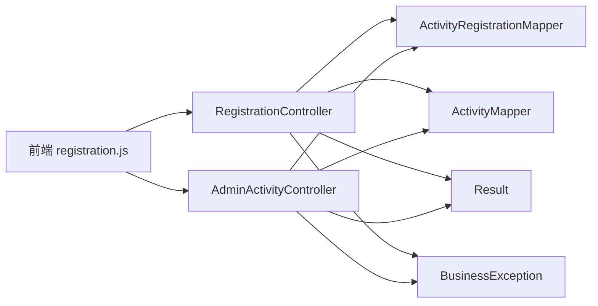

# 报名管理API

<cite>
**本文档引用的文件**
- [RegistrationController.java](file://campus-forum-backend/src/main/java/com/campus/forum/controller/RegistrationController.java)
- [ActivityRegistration.java](file://campus-forum-backend/src/main/java/com/campus/forum/entity/ActivityRegistration.java)
- [ActivityRegistrationMapper.java](file://campus-forum-backend/src/main/java/com/campus/forum/mapper/ActivityRegistrationMapper.java)
- [Activity.java](file://campus-forum-backend/src/main/java/com/campus/forum/entity/Activity.java)
- [ActivityMapper.java](file://campus-forum-backend/src/main/java/com/campus/forum/mapper/ActivityMapper.java)
- [ActivityServiceImpl.java](file://campus-forum-backend/src/main/java/com/campus/forum/service/impl/ActivityServiceImpl.java)
- [AdminActivityController.java](file://campus-forum-backend/src/main/java/com/campus/forum/controller/admin/AdminActivityController.java)
- [Result.java](file://campus-forum-backend/src/main/java/com/campus/forum/common/Result.java)
- [BusinessException.java](file://campus-forum-backend/src/main/java/com/campus/forum/common/exception/BusinessException.java)
- [registration.js](file://campus-forum-frontend/src/api/registration.js)
</cite>

## 目录
1. [简介](#简介)
2. [项目结构](#项目结构)
3. [核心组件](#核心组件)
4. [架构总览](#架构总览)
5. [详细组件分析](#详细组件分析)
6. [依赖关系分析](#依赖关系分析)
7. [性能考虑](#性能考虑)
8. [故障排除指南](#故障排除指南)
9. [结论](#结论)
10. [附录](#附录)

## 简介
本文件为“活动报名管理模块”的详细API文档，覆盖活动报名、取消报名、报名列表查询、审核流程、名额控制、状态管理等核心功能，并补充管理端的统计与报表能力。文档同时说明权限控制、重复报名检测、超员处理等业务规则在API层面的设计与实现要点。

## 项目结构
后端采用Spring Boot + MyBatis-Plus架构，报名相关功能主要由以下层次组成：
- 控制器层：用户端与管理端分别提供报名与活动管理API
- 服务层：封装业务逻辑（如报名状态流转、活动统计）
- 数据访问层：基于MyBatis-Plus的Mapper接口
- 实体层：活动与报名记录的数据模型
- 统一响应与异常：Result统一返回体与BusinessException业务异常

图表来源
- [RegistrationController.java:22-118](file://campus-forum-backend/src/main/java/com/campus/forum/controller/RegistrationController.java#L22-L118)
- [AdminActivityController.java:16-68](file://campus-forum-backend/src/main/java/com/campus/forum/controller/admin/AdminActivityController.java#L16-L68)
- [ActivityServiceImpl.java:18-147](file://campus-forum-backend/src/main/java/com/campus/forum/service/impl/ActivityServiceImpl.java#L18-L147)
- [ActivityRegistration.java:10-26](file://campus-forum-backend/src/main/java/com/campus/forum/entity/ActivityRegistration.java#L10-L26)
- [Activity.java:10-38](file://campus-forum-backend/src/main/java/com/campus/forum/entity/Activity.java#L10-L38)
- [ActivityRegistrationMapper.java:7-15](file://campus-forum-backend/src/main/java/com/campus/forum/mapper/ActivityRegistrationMapper.java#L7-L15)
- [ActivityMapper.java:10-21](file://campus-forum-backend/src/main/java/com/campus/forum/mapper/ActivityMapper.java#L10-L21)
- [Result.java:8-36](file://campus-forum-backend/src/main/java/com/campus/forum/common/Result.java#L8-L36)
- [BusinessException.java:8-21](file://campus-forum-backend/src/main/java/com/campus/forum/common/exception/BusinessException.java#L8-L21)

章节来源
- [RegistrationController.java:19-118](file://campus-forum-backend/src/main/java/com/campus/forum/controller/RegistrationController.java#L19-L118)
- [AdminActivityController.java:16-68](file://campus-forum-backend/src/main/java/com/campus/forum/controller/admin/AdminActivityController.java#L16-L68)
- [ActivityServiceImpl.java:18-147](file://campus-forum-backend/src/main/java/com/campus/forum/service/impl/ActivityServiceImpl.java#L18-L147)

## 核心组件
- 报名控制器（RegistrationController）：提供报名、取消报名、查询我的报名、查询活动报名列表、审核报名等接口
- 管理端活动控制器（AdminActivityController）：提供活动列表、审核状态变更、删除、报名人数统计等管理功能
- 活动服务实现（ActivityServiceImpl）：封装活动相关业务逻辑（如点赞、收藏、浏览量统计等），为报名流程提供配套支持
- 实体与Mapper：Activity、ActivityRegistration及其Mapper负责数据持久化与查询

章节来源
- [RegistrationController.java:22-118](file://campus-forum-backend/src/main/java/com/campus/forum/controller/RegistrationController.java#L22-L118)
- [AdminActivityController.java:16-68](file://campus-forum-backend/src/main/java/com/campus/forum/controller/admin/AdminActivityController.java#L16-L68)
- [ActivityServiceImpl.java:18-147](file://campus-forum-backend/src/main/java/com/campus/forum/service/impl/ActivityServiceImpl.java#L18-L147)
- [ActivityRegistration.java:10-26](file://campus-forum-backend/src/main/java/com/campus/forum/entity/ActivityRegistration.java#L10-L26)
- [Activity.java:10-38](file://campus-forum-backend/src/main/java/com/campus/forum/entity/Activity.java#L10-L38)
- [ActivityRegistrationMapper.java:7-15](file://campus-forum-backend/src/main/java/com/campus/forum/mapper/ActivityRegistrationMapper.java#L7-L15)
- [ActivityMapper.java:10-21](file://campus-forum-backend/src/main/java/com/campus/forum/mapper/ActivityMapper.java#L10-L21)

## 架构总览
报名模块遵循典型的MVC分层，结合事务性操作与统一异常处理，确保业务一致性与可维护性。

图表来源
- [RegistrationController.java:31-67](file://campus-forum-backend/src/main/java/com/campus/forum/controller/RegistrationController.java#L31-L67)
- [ActivityRegistrationMapper.java:10-14](file://campus-forum-backend/src/main/java/com/campus/forum/mapper/ActivityRegistrationMapper.java#L10-L14)
- [ActivityMapper.java:10-21](file://campus-forum-backend/src/main/java/com/campus/forum/mapper/ActivityMapper.java#L10-L21)

## 详细组件分析

### 报名控制器（用户端）
- 接口概览
  - 报名活动：POST /api/registrations
  - 取消报名：DELETE /api/registrations/{activityId}
  - 我的报名记录：GET /api/registrations/my
  - 查看活动报名列表：GET /api/registrations/activity/{id}
  - 审核报名（管理端）：PUT /api/registrations/{id}/status

- 关键业务规则
  - 权限控制：需要登录用户上下文（@AuthenticationPrincipal）
  - 活动状态校验：仅当活动状态为“报名中”允许报名
  - 重复报名检测：同一用户对同一活动不可重复报名
  - 名额控制：当设置最大参与人数时，需检查当前有效报名数是否已达上限
  - 审核流程：默认状态为“待审核”，管理员可通过审核接口更新为“已通过/已拒绝”
  - 超员处理：达到上限时抛出业务异常，阻止新增报名
  - 取消报名：将状态置为“已取消”，并回滚活动当前报名人数

- 请求与响应
  - 统一响应：Result<T>，包含code、message、data
  - 异常处理：BusinessException，返回HTTP 400语义错误

章节来源
- [RegistrationController.java:31-118](file://campus-forum-backend/src/main/java/com/campus/forum/controller/RegistrationController.java#L31-L118)
- [Result.java:8-36](file://campus-forum-backend/src/main/java/com/campus/forum/common/Result.java#L8-L36)
- [BusinessException.java:8-21](file://campus-forum-backend/src/main/java/com/campus/forum/common/exception/BusinessException.java#L8-L21)

### 管理端活动控制器
- 接口概览
  - 活动列表（分页+筛选）：GET /api/admin/activities
  - 审核活动状态：PUT /api/admin/activities/{id}/status
  - 删除活动：DELETE /api/admin/activities/{id}
  - 活动报名人数统计：GET /api/admin/activities/{id}/registrations/count

- 关键业务规则
  - 列表查询：支持关键词与状态过滤，按创建时间倒序
  - 状态变更：支持将活动置为“草稿/报名中/已结束/已取消/待审核”
  - 删除处理：软删除（将状态置为草稿）
  - 报名统计：统计某活动的总报名数

章节来源
- [AdminActivityController.java:25-68](file://campus-forum-backend/src/main/java/com/campus/forum/controller/admin/AdminActivityController.java#L25-L68)

### 活动服务实现（ActivityServiceImpl）
- 功能概述
  - 活动列表分页与筛选
  - 活动详情获取与浏览量统计
  - 活动创建（默认状态为“报名中”）
  - 点赞/收藏交互（与报名流程协同）

- 与报名的关系
  - 浏览量统计与行为记录为后续推荐与数据分析提供基础
  - 创建活动时初始化报名相关计数字段

章节来源
- [ActivityServiceImpl.java:29-79](file://campus-forum-backend/src/main/java/com/campus/forum/service/impl/ActivityServiceImpl.java#L29-L79)
- [ActivityServiceImpl.java:41-55](file://campus-forum-backend/src/main/java/com/campus/forum/service/impl/ActivityServiceImpl.java#L41-L55)

### 数据模型与映射

图表来源
- [Activity.java:10-38](file://campus-forum-backend/src/main/java/com/campus/forum/entity/Activity.java#L10-L38)
- [ActivityRegistration.java:10-26](file://campus-forum-backend/src/main/java/com/campus/forum/entity/ActivityRegistration.java#L10-L26)

## 依赖关系分析
- 控制器依赖Mapper进行数据访问
- 服务层协调多个Mapper完成复杂业务
- 统一响应与异常贯穿所有控制器，保证一致的错误处理风格
- 前端通过registration.js调用后端报名相关接口

图表来源
- [registration.js:1-7](file://campus-forum-frontend/src/api/registration.js#L1-L7)
- [RegistrationController.java:22-118](file://campus-forum-backend/src/main/java/com/campus/forum/controller/RegistrationController.java#L22-L118)
- [AdminActivityController.java:16-68](file://campus-forum-backend/src/main/java/com/campus/forum/controller/admin/AdminActivityController.java#L16-L68)
- [Result.java:8-36](file://campus-forum-backend/src/main/java/com/campus/forum/common/Result.java#L8-L36)
- [BusinessException.java:8-21](file://campus-forum-backend/src/main/java/com/campus/forum/common/exception/BusinessException.java#L8-L21)

## 性能考虑
- 查询优化
  - 报名列表查询使用按创建时间倒序，建议在activity_id与status上建立复合索引以提升筛选与排序效率
  - 活动报名人数统计可直接使用COUNT查询，避免全表扫描
- 写入优化
  - 报名与取消报名均涉及两条写入（插入/更新报名记录与更新活动计数），建议在数据库层面使用事务保证原子性
- 缓存策略
  - 对热门活动列表与活动详情可引入缓存，降低频繁查询带来的压力
- 分页与筛选
  - 列表接口已内置分页，建议前端传入合理页码与大小，避免一次性加载过多数据

## 故障排除指南
- 常见错误与处理
  - 活动不存在：返回业务异常，提示活动不存在
  - 非报名中状态：报名时若活动状态非“报名中”，将被拒绝
  - 重复报名：同一用户对同一活动重复报名会被拒绝
  - 达到上限：当报名人数等于最大参与人数时，报名失败
  - 未找到报名记录：取消报名时若无对应记录，将被拒绝
- 建议排查步骤
  - 确认活动状态与报名时间窗口
  - 检查用户身份与权限
  - 核对活动最大参与人数与当前有效报名数
  - 查看日志定位具体异常位置

章节来源
- [RegistrationController.java:40-86](file://campus-forum-backend/src/main/java/com/campus/forum/controller/RegistrationController.java#L40-L86)
- [BusinessException.java:8-21](file://campus-forum-backend/src/main/java/com/campus/forum/common/exception/BusinessException.java#L8-L21)

## 结论
报名管理模块通过清晰的分层设计与严格的业务规则约束，实现了从用户报名、管理员审核到统计分析的完整闭环。统一的响应与异常机制提升了系统的可维护性与用户体验。建议在后续迭代中进一步完善前端导出、批量状态修改、更细粒度的权限控制与审计日志等功能。

## 附录

### API定义与规范

- 报名活动
  - 方法：POST
  - 路径：/api/registrations
  - 参数：
    - activityId: 活动ID（必填）
    - remark: 备注（可选）
  - 返回：统一响应，data为报名记录
  - 权限：登录用户
  - 业务规则：
    - 活动状态必须为“报名中”
    - 不允许重复报名
    - 达到最大参与人数则拒绝报名
    - 默认状态为“待审核”，并增加活动当前报名人数

- 取消报名
  - 方法：DELETE
  - 路径：/api/registrations/{activityId}
  - 路径参数：activityId
  - 返回：统一响应
  - 权限：登录用户
  - 业务规则：
    - 将报名状态置为“已取消”
    - 回滚活动当前报名人数（不低于0）

- 我的报名记录
  - 方法：GET
  - 路径：/api/registrations/my
  - 返回：统一响应，data为报名记录列表（按创建时间倒序）
  - 权限：登录用户

- 查看活动报名列表
  - 方法：GET
  - 路径：/api/registrations/activity/{id}
  - 路径参数：id
  - 返回：统一响应，data为报名记录列表（按创建时间倒序）
  - 权限：登录用户

- 审核报名
  - 方法：PUT
  - 路径：/api/registrations/{id}/status
  - 路径参数：id
  - 查询参数：status（0待审核，1已通过，2已拒绝）
  - 返回：统一响应
  - 权限：管理员

- 管理端活动列表
  - 方法：GET
  - 路径：/api/admin/activities
  - 查询参数：page、size、keyword、status
  - 返回：统一响应，data为分页结果
  - 权限：管理员

- 审核活动状态
  - 方法：PUT
  - 路径：/api/admin/activities/{id}/status
  - 路径参数：id
  - 查询参数：status
  - 返回：统一响应
  - 权限：管理员

- 删除活动
  - 方法：DELETE
  - 路径：/api/admin/activities/{id}
  - 路径参数：id
  - 返回：统一响应
  - 权限：管理员

- 活动报名人数统计
  - 方法：GET
  - 路径：/api/admin/activities/{id}/registrations/count
  - 路径参数：id
  - 返回：统一响应，data为报名人数
  - 权限：管理员

章节来源
- [RegistrationController.java:31-118](file://campus-forum-backend/src/main/java/com/campus/forum/controller/RegistrationController.java#L31-L118)
- [AdminActivityController.java:25-68](file://campus-forum-backend/src/main/java/com/campus/forum/controller/admin/AdminActivityController.java#L25-L68)
- [Result.java:8-36](file://campus-forum-backend/src/main/java/com/campus/forum/common/Result.java#L8-L36)
- [BusinessException.java:8-21](file://campus-forum-backend/src/main/java/com/campus/forum/common/exception/BusinessException.java#L8-L21)