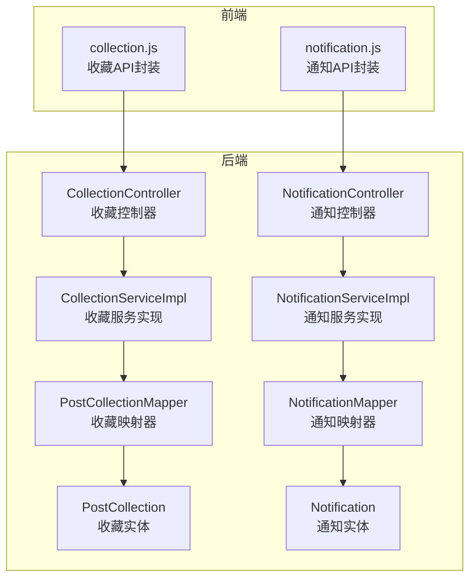
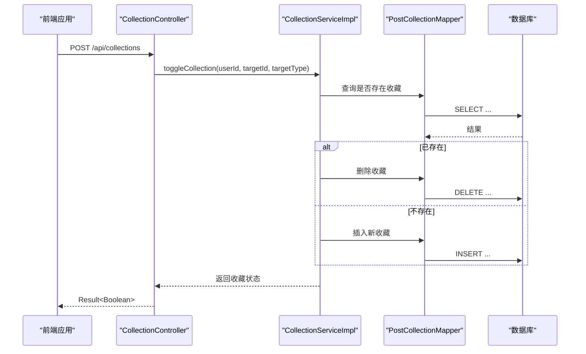
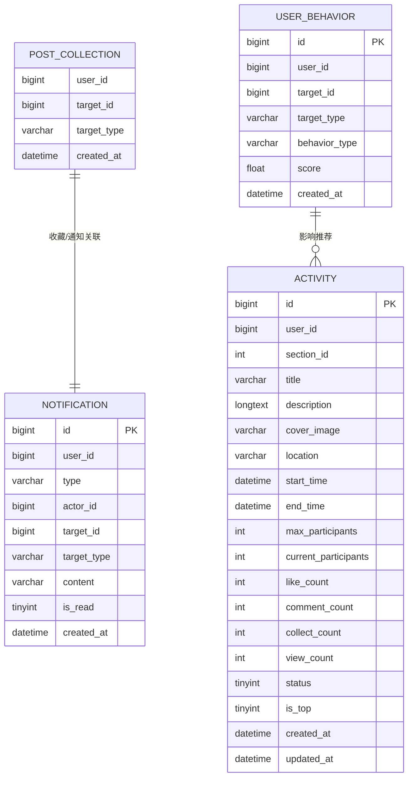
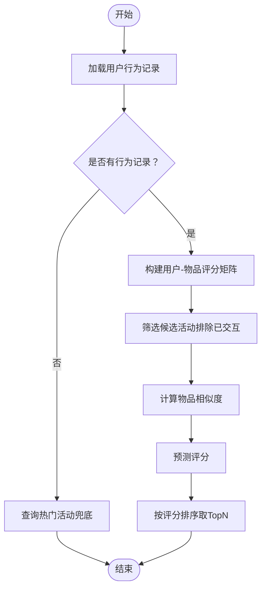
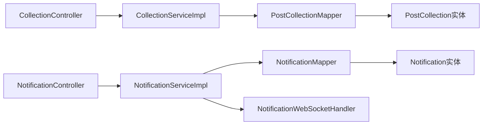

# 收藏与通知API

<cite>
**本文档引用的文件**
- [CollectionController.java](file://campus-forum-backend/src/main/java/com/campus/forum/controller/CollectionController.java)
- [NotificationController.java](file://campus-forum-backend/src/main/java/com/campus/forum/controller/NotificationController.java)
- [CollectionServiceImpl.java](file://campus-forum-backend/src/main/java/com/campus/forum/service/impl/CollectionServiceImpl.java)
- [NotificationServiceImpl.java](file://campus-forum-backend/src/main/java/com/campus/forum/service/impl/NotificationServiceImpl.java)
- [PostCollection.java](file://campus-forum-backend/src/main/java/com/campus/forum/entity/PostCollection.java)
- [Notification.java](file://campus-forum-backend/src/main/java/com/campus/forum/entity/Notification.java)
- [PostCollectionMapper.java](file://campus-forum-backend/src/main/java/com/campus/forum/mapper/PostCollectionMapper.java)
- [NotificationMapper.java](file://campus-forum-backend/src/main/java/com/campus/forum/mapper/NotificationMapper.java)
- [init.sql](file://campus-forum-backend/docs/db/init.sql)
- [collection.js](file://campus-forum-frontend/src/api/collection.js)
- [notification.js](file://campus-forum-frontend/src/api/notification.js)
- [RecommendServiceImpl.java](file://campus-forum-backend/src/main/java/com/campus/forum/service/impl/RecommendServiceImpl.java)
- [ActivityMapper.java](file://campus-forum-backend/src/main/java/com/campus/forum/mapper/ActivityMapper.java)
- [UserBehaviorMapper.java](file://campus-forum-backend/src/main/java/com/campus/forum/mapper/UserBehaviorMapper.java)
</cite>

## 目录
1. [简介](#简介)
2. [项目结构](#项目结构)
3. [核心组件](#核心组件)
4. [架构总览](#架构总览)
5. [详细组件分析](#详细组件分析)
6. [依赖分析](#依赖分析)
7. [性能考虑](#性能考虑)
8. [故障排除指南](#故障排除指南)
9. [结论](#结论)
10. [附录](#附录)

## 简介
本文件为校园论坛项目的收藏与通知模块提供完整API文档。涵盖收藏夹管理（收藏/取消收藏、我的收藏列表、检查收藏状态、取消收藏）、通知管理（通知列表、标记已读、未读计数、批量标记）、以及基于用户行为的推荐能力（热门活动、协同过滤推荐）。文档同时说明通知类型、推送渠道、阅读状态管理，并给出收藏统计、热门收藏、推荐收藏等数据分析接口的设计思路与实现路径。

## 项目结构
后端采用Spring Boot + MyBatis-Plus架构，控制器位于controller包，业务逻辑在service.impl包，数据访问层在mapper包，实体类在entity包；前端通过独立的API模块调用后端REST接口。

图表来源
- [CollectionController.java:16-66](file://campus-forum-backend/src/main/java/com/campus/forum/controller/CollectionController.java#L16-L66)
- [NotificationController.java:16-66](file://campus-forum-backend/src/main/java/com/campus/forum/controller/NotificationController.java#L16-L66)
- [CollectionServiceImpl.java:11-55](file://campus-forum-backend/src/main/java/com/campus/forum/service/impl/CollectionServiceImpl.java#L11-L55)
- [NotificationServiceImpl.java:15-57](file://campus-forum-backend/src/main/java/com/campus/forum/service/impl/NotificationServiceImpl.java#L15-L57)
- [PostCollectionMapper.java:7-15](file://campus-forum-backend/src/main/java/com/campus/forum/mapper/PostCollectionMapper.java#L7-L15)
- [NotificationMapper.java:7-15](file://campus-forum-backend/src/main/java/com/campus/forum/mapper/NotificationMapper.java#L7-L15)
- [PostCollection.java:7-15](file://campus-forum-backend/src/main/java/com/campus/forum/entity/PostCollection.java#L7-L15)
- [Notification.java:7-22](file://campus-forum-backend/src/main/java/com/campus/forum/entity/Notification.java#L7-L22)
- [collection.js:1-6](file://campus-forum-frontend/src/api/collection.js#L1-L6)
- [notification.js:1-6](file://campus-forum-frontend/src/api/notification.js#L1-L6)

章节来源
- [CollectionController.java:16-66](file://campus-forum-backend/src/main/java/com/campus/forum/controller/CollectionController.java#L16-L66)
- [NotificationController.java:16-66](file://campus-forum-backend/src/main/java/com/campus/forum/controller/NotificationController.java#L16-L66)
- [collection.js:1-6](file://campus-forum-frontend/src/api/collection.js#L1-L6)
- [notification.js:1-6](file://campus-forum-frontend/src/api/notification.js#L1-L6)

## 核心组件
- 收藏模块
  - 控制器：提供收藏/取消收藏、我的收藏列表、检查收藏状态、取消收藏等接口
  - 服务实现：封装收藏toggle、分页查询、收藏状态检查
  - 映射器：提供收藏检查与删除SQL
  - 实体：post_collection表对应的实体
- 通知模块
  - 控制器：提供通知列表、标记全部已读、标记单条已读、未读计数
  - 服务实现：持久化通知、WebSocket实时推送、批量标记已读
  - 映射器：提供未读计数与批量标记SQL
  - 实体：notification表对应的实体
- 推荐模块（用于数据分析与推荐）
  - 服务实现：基于用户行为的协同过滤推荐，冷启动兜底热门活动
  - 映射器：热门活动查询、排除已交互活动查询、按用户行为查询

章节来源
- [CollectionController.java:25-65](file://campus-forum-backend/src/main/java/com/campus/forum/controller/CollectionController.java#L25-L65)
- [CollectionServiceImpl.java:17-54](file://campus-forum-backend/src/main/java/com/campus/forum/service/impl/CollectionServiceImpl.java#L17-L54)
- [PostCollectionMapper.java:10-14](file://campus-forum-backend/src/main/java/com/campus/forum/mapper/PostCollectionMapper.java#L10-L14)
- [PostCollection.java:10-14](file://campus-forum-backend/src/main/java/com/campus/forum/entity/PostCollection.java#L10-L14)
- [NotificationController.java:26-65](file://campus-forum-backend/src/main/java/com/campus/forum/controller/NotificationController.java#L26-L65)
- [NotificationServiceImpl.java:23-56](file://campus-forum-backend/src/main/java/com/campus/forum/service/impl/NotificationServiceImpl.java#L23-L56)
- [NotificationMapper.java:10-14](file://campus-forum-backend/src/main/java/com/campus/forum/mapper/NotificationMapper.java#L10-L14)
- [Notification.java:12-19](file://campus-forum-backend/src/main/java/com/campus/forum/entity/Notification.java#L12-L19)
- [RecommendServiceImpl.java:36-84](file://campus-forum-backend/src/main/java/com/campus/forum/service/impl/RecommendServiceImpl.java#L36-L84)
- [ActivityMapper.java:13-20](file://campus-forum-backend/src/main/java/com/campus/forum/mapper/ActivityMapper.java#L13-L20)
- [UserBehaviorMapper.java:12-13](file://campus-forum-backend/src/main/java/com/campus/forum/mapper/UserBehaviorMapper.java#L12-L13)

## 架构总览
后端通过REST控制器暴露API，服务层负责业务逻辑与数据持久化，映射器执行SQL，实体类映射数据库表。通知通过WebSocket进行实时推送，前端通过HTTP调用后端接口。

图表来源
- [CollectionController.java:25-33](file://campus-forum-backend/src/main/java/com/campus/forum/controller/CollectionController.java#L25-L33)
- [CollectionServiceImpl.java:17-35](file://campus-forum-backend/src/main/java/com/campus/forum/service/impl/CollectionServiceImpl.java#L17-L35)
- [PostCollectionMapper.java:10-14](file://campus-forum-backend/src/main/java/com/campus/forum/mapper/PostCollectionMapper.java#L10-L14)

章节来源
- [CollectionController.java:25-33](file://campus-forum-backend/src/main/java/com/campus/forum/controller/CollectionController.java#L25-L33)
- [CollectionServiceImpl.java:17-35](file://campus-forum-backend/src/main/java/com/campus/forum/service/impl/CollectionServiceImpl.java#L17-L35)

## 详细组件分析

### 收藏模块API

- 收藏/取消收藏
  - 方法：POST /api/collections
  - 请求体字段：
    - targetId: 目标ID（Long）
    - targetType: 目标类型（post/activity）
  - 返回：Result<Boolean>，true表示收藏成功，false表示取消收藏
  - 处理流程：控制器解析JWT获取用户ID，调用服务toggle，内部根据是否存在记录决定插入或删除
  - 错误处理：参数缺失或类型错误由Spring统一校验，业务异常通过全局异常处理器返回

- 我的收藏列表
  - 方法：GET /api/collections/my
  - 查询参数：
    - targetType: 目标类型（可选）
    - page: 页码，默认1
    - size: 每页大小，默认10
  - 返回：分页结果，按创建时间倒序
  - 处理流程：服务构造分页与条件查询，返回Page对象

- 检查是否已收藏
  - 方法：GET /api/collections/check
  - 查询参数：
    - targetId: 目标ID
    - targetType: 目标类型
  - 返回：Result<Boolean>

- 取消收藏
  - 方法：DELETE /api/collections/{targetId}
  - 路径参数：targetId
  - 查询参数：targetType
  - 返回：Result<Void>

章节来源
- [CollectionController.java:25-65](file://campus-forum-backend/src/main/java/com/campus/forum/controller/CollectionController.java#L25-L65)
- [CollectionServiceImpl.java:37-54](file://campus-forum-backend/src/main/java/com/campus/forum/service/impl/CollectionServiceImpl.java#L37-L54)
- [PostCollectionMapper.java:10-14](file://campus-forum-backend/src/main/java/com/campus/forum/mapper/PostCollectionMapper.java#L10-L14)

### 通知模块API

- 通知列表（分页）
  - 方法：GET /api/notifications
  - 查询参数：
    - page: 页码，默认1
    - size: 每页大小，默认20
  - 返回：分页通知列表，按创建时间倒序
  - 处理流程：控制器获取用户ID，使用LambdaQueryWrapper按用户过滤并分页查询

- 标记所有为已读
  - 方法：PUT /api/notifications/read-all
  - 返回：Result<Void>
  - 处理流程：服务调用mapper批量更新is_read=1，并通过WebSocket推送实时通知

- 标记单条已读
  - 方法：PUT /api/notifications/{id}/read
  - 路径参数：id
  - 返回：Result<Void>

- 未读数量
  - 方法：GET /api/notifications/unread-count
  - 返回：Result<Long>，按用户与is_read=0统计

- 通知类型与字段
  - 类型枚举：LIKE/COMMENT/REPLY/FOLLOW/SYSTEM/REGISTER
  - 字段：userId、type、actorId、targetId、targetType、content、isRead、createdAt

- 推送渠道
  - WebSocket：服务端通过WebSocketHandler向指定用户推送通知内容

章节来源
- [NotificationController.java:26-65](file://campus-forum-backend/src/main/java/com/campus/forum/controller/NotificationController.java#L26-L65)
- [NotificationServiceImpl.java:23-56](file://campus-forum-backend/src/main/java/com/campus/forum/service/impl/NotificationServiceImpl.java#L23-L56)
- [Notification.java:12-19](file://campus-forum-backend/src/main/java/com/campus/forum/entity/Notification.java#L12-L19)

### 数据模型与表结构

图表来源
- [init.sql:155-163](file://campus-forum-backend/docs/db/init.sql#L155-L163)
- [init.sql:192-206](file://campus-forum-backend/docs/db/init.sql#L192-L206)
- [init.sql:209-221](file://campus-forum-backend/docs/db/init.sql#L209-L221)
- [init.sql:55-81](file://campus-forum-backend/docs/db/init.sql#L55-L81)

章节来源
- [init.sql:155-163](file://campus-forum-backend/docs/db/init.sql#L155-L163)
- [init.sql:192-206](file://campus-forum-backend/docs/db/init.sql#L192-L206)
- [init.sql:209-221](file://campus-forum-backend/docs/db/init.sql#L209-L221)

### 推荐与数据分析接口

- 热门收藏/活动
  - 通过活动表的浏览数、点赞数、收藏数等指标排序，返回近期热门活动作为冷启动兜底
  - SQL示例：按view_count、like_count降序取前N条

- 协同过滤推荐
  - 基于用户行为表构建用户-物品评分矩阵，计算物品相似度（余弦相似度），对目标用户预测评分并取TopN
  - 若用户无行为记录，则直接返回热门活动兜底

- 推荐流程（简化）

图表来源
- [RecommendServiceImpl.java:36-84](file://campus-forum-backend/src/main/java/com/campus/forum/service/impl/RecommendServiceImpl.java#L36-L84)
- [ActivityMapper.java:13-20](file://campus-forum-backend/src/main/java/com/campus/forum/mapper/ActivityMapper.java#L13-L20)
- [UserBehaviorMapper.java:12-13](file://campus-forum-backend/src/main/java/com/campus/forum/mapper/UserBehaviorMapper.java#L12-L13)

章节来源
- [RecommendServiceImpl.java:36-84](file://campus-forum-backend/src/main/java/com/campus/forum/service/impl/RecommendServiceImpl.java#L36-L84)
- [ActivityMapper.java:13-20](file://campus-forum-backend/src/main/java/com/campus/forum/mapper/ActivityMapper.java#L13-L20)
- [UserBehaviorMapper.java:12-13](file://campus-forum-backend/src/main/java/com/campus/forum/mapper/UserBehaviorMapper.java#L12-L13)

### 前端API对接

- 收藏API
  - toggleCollection(data): POST /collections
  - getMyCollections(params): GET /collections/my
  - checkCollection(params): GET /collections/check
  - cancelCollection(targetId, targetType): DELETE /collections/{targetId}

- 通知API
  - getNotifications(params): GET /notifications
  - getUnreadCount(): GET /notifications/unread-count
  - readAll(): PUT /notifications/read-all
  - readOne(id): PUT /notifications/{id}/read

章节来源
- [collection.js:1-6](file://campus-forum-frontend/src/api/collection.js#L1-L6)
- [notification.js:1-6](file://campus-forum-frontend/src/api/notification.js#L1-L6)

## 依赖分析

图表来源
- [CollectionController.java:22-23](file://campus-forum-backend/src/main/java/com/campus/forum/controller/CollectionController.java#L22-L23)
- [NotificationController.java:22-24](file://campus-forum-backend/src/main/java/com/campus/forum/controller/NotificationController.java#L22-L24)
- [CollectionServiceImpl.java](file://campus-forum-backend/src/main/java/com/campus/forum/service/impl/CollectionServiceImpl.java#L15)
- [NotificationServiceImpl.java:20-21](file://campus-forum-backend/src/main/java/com/campus/forum/service/impl/NotificationServiceImpl.java#L20-L21)

章节来源
- [CollectionController.java:22-23](file://campus-forum-backend/src/main/java/com/campus/forum/controller/CollectionController.java#L22-L23)
- [NotificationController.java:22-24](file://campus-forum-backend/src/main/java/com/campus/forum/controller/NotificationController.java#L22-L24)
- [CollectionServiceImpl.java](file://campus-forum-backend/src/main/java/com/campus/forum/service/impl/CollectionServiceImpl.java#L15)
- [NotificationServiceImpl.java:20-21](file://campus-forum-backend/src/main/java/com/campus/forum/service/impl/NotificationServiceImpl.java#L20-L21)

## 性能考虑
- 分页查询：收藏列表与通知列表均使用分页，建议合理设置size并限制最大值，避免超大结果集
- 索引优化：通知表按user_id建立索引，收藏表按(user_id, target_id, target_type)建立联合索引，提升查询与去重效率
- 批量操作：批量标记已读使用SQL更新，减少多次往返
- 实时推送：WebSocket推送仅在新增通知时触发，避免频繁广播
- 推荐性能：协同过滤在候选集较小的情况下表现良好，若数据量增大可考虑缓存热门活动与相似度矩阵

## 故障排除指南
- 参数校验失败
  - 现象：请求参数缺失或类型不匹配导致400错误
  - 处理：检查请求体与查询参数，确保targetId为Long，targetType为post或activity
- 权限问题
  - 现象：无法获取当前用户ID
  - 处理：确认JWT令牌有效且在请求头中正确传递
- 重复收藏/取消失败
  - 现象：toggle接口返回状态与预期不符
  - 处理：检查联合索引是否生效，确认数据库事务一致性
- 通知未显示
  - 现象：新增通知但前端未收到
  - 处理：确认WebSocket连接正常，服务端推送逻辑是否执行

章节来源
- [CollectionController.java:27-33](file://campus-forum-backend/src/main/java/com/campus/forum/controller/CollectionController.java#L27-L33)
- [NotificationController.java:40-54](file://campus-forum-backend/src/main/java/com/campus/forum/controller/NotificationController.java#L40-L54)
- [NotificationServiceImpl.java:35-36](file://campus-forum-backend/src/main/java/com/campus/forum/service/impl/NotificationServiceImpl.java#L35-L36)

## 结论
收藏与通知模块提供了完善的收藏管理与实时通知能力，结合用户行为数据实现了基础的推荐功能。通过合理的分页、索引与WebSocket推送，系统在易用性与性能之间取得平衡。后续可在推荐算法、通知模板与静音时段等方面进一步扩展。

## 附录

### API定义汇总

- 收藏模块
  - POST /api/collections
    - 请求体：{ targetId: Long, targetType: "post"|"activity" }
    - 返回：Result<Boolean>
  - GET /api/collections/my
    - 查询参数：targetType(可选), page, size
    - 返回：分页结果
  - GET /api/collections/check
    - 查询参数：targetId, targetType
    - 返回：Result<Boolean>
  - DELETE /api/collections/{targetId}?targetType=...
    - 返回：Result<Void>

- 通知模块
  - GET /api/notifications?page=&size=
    - 返回：分页通知列表
  - PUT /api/notifications/read-all
    - 返回：Result<Void>
  - PUT /api/notifications/{id}/read
    - 返回：Result<Void>
  - GET /api/notifications/unread-count
    - 返回：Result<Long>

- 推荐模块（服务端）
  - recommendActivities(userId, topN)
    - 返回：热门活动兜底或协同过滤推荐结果

章节来源
- [CollectionController.java:25-65](file://campus-forum-backend/src/main/java/com/campus/forum/controller/CollectionController.java#L25-L65)
- [NotificationController.java:26-65](file://campus-forum-backend/src/main/java/com/campus/forum/controller/NotificationController.java#L26-L65)
- [RecommendServiceImpl.java:36-84](file://campus-forum-backend/src/main/java/com/campus/forum/service/impl/RecommendServiceImpl.java#L36-L84)