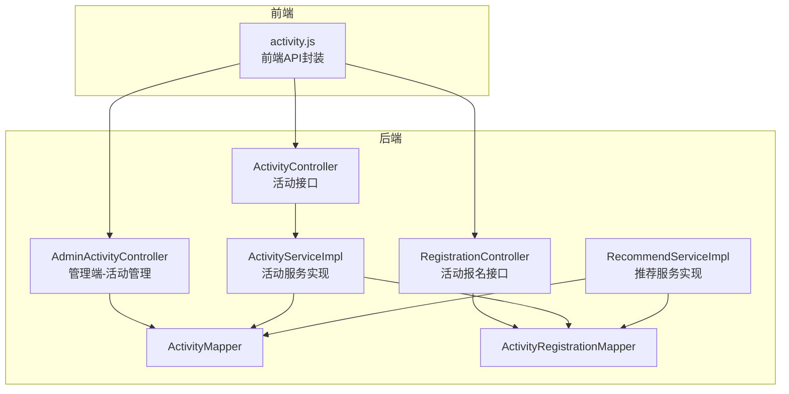
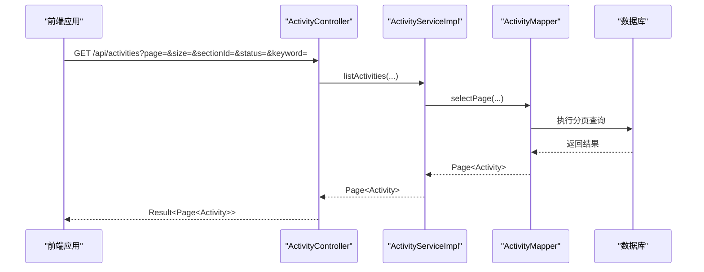
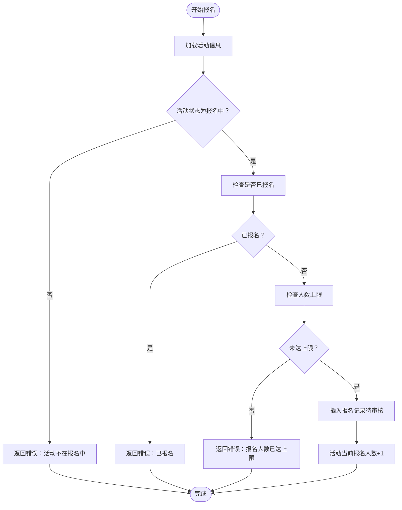
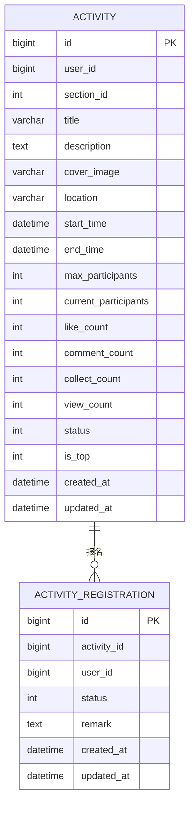
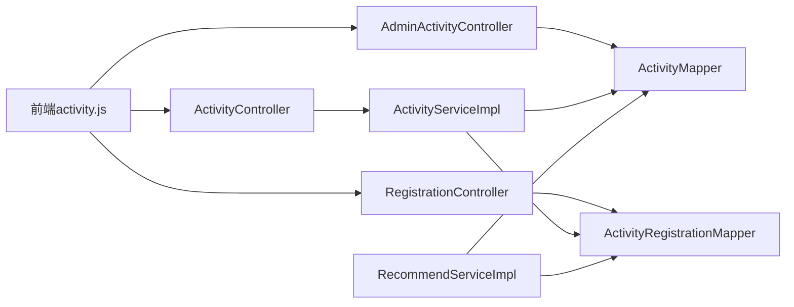

# 活动管理API

<cite>
**本文档引用的文件**
- [ActivityController.java](file://campus-forum-backend/src/main/java/com/campus/forum/controller/ActivityController.java)
- [ActivityService.java](file://campus-forum-backend/src/main/java/com/campus/forum/service/ActivityService.java)
- [ActivityServiceImpl.java](file://campus-forum-backend/src/main/java/com/campus/forum/service/impl/ActivityServiceImpl.java)
- [Activity.java](file://campus-forum-backend/src/main/java/com/campus/forum/entity/Activity.java)
- [ActivityCreateRequest.java](file://campus-forum-backend/src/main/java/com/campus/forum/dto/request/ActivityCreateRequest.java)
- [AdminActivityController.java](file://campus-forum-backend/src/main/java/com/campus/forum/controller/admin/AdminActivityController.java)
- [RegistrationController.java](file://campus-forum-backend/src/main/java/com/campus/forum/controller/RegistrationController.java)
- [ActivityRegistration.java](file://campus-forum-backend/src/main/java/com/campus/forum/entity/ActivityRegistration.java)
- [ActivityRegistrationMapper.java](file://campus-forum-backend/src/main/java/com/campus/forum/mapper/ActivityRegistrationMapper.java)
- [ActivityMapper.java](file://campus-forum-backend/src/main/java/com/campus/forum/mapper/ActivityMapper.java)
- [RecommendService.java](file://campus-forum-backend/src/main/java/com/campus/forum/service/RecommendService.java)
- [RecommendServiceImpl.java](file://campus-forum-backend/src/main/java/com/campus/forum/service/impl/RecommendServiceImpl.java)
- [application.yml](file://campus-forum-backend/src/main/resources/application.yml)
- [activity.js](file://campus-forum-frontend/src/api/activity.js)
</cite>

## 目录
1. [简介](#简介)
2. [项目结构](#项目结构)
3. [核心组件](#核心组件)
4. [架构总览](#架构总览)
5. [详细组件分析](#详细组件分析)
6. [依赖关系分析](#依赖关系分析)
7. [性能考虑](#性能考虑)
8. [故障排除指南](#故障排除指南)
9. [结论](#结论)
10. [附录](#附录)

## 简介
本文件为“活动管理模块”的详细API文档，覆盖活动发布、报名、取消报名、列表查询、详情获取、状态管理、报名人数控制、时间限制、地点筛选、推荐算法、审核流程与通知推送、统计分析与参与人员管理等核心能力。同时说明活动图片上传、富文本编辑、报名表单配置等多媒体内容处理接口的集成方式，并提供前后端对接示例与最佳实践。

## 项目结构
后端采用Spring Boot + MyBatis-Plus架构，按职责划分为控制器层、服务层、数据访问层与实体层；前端通过统一HTTP客户端封装调用后端API。

图表来源
- [ActivityController.java:1-83](file://campus-forum-backend/src/main/java/com/campus/forum/controller/ActivityController.java#L1-L83)
- [RegistrationController.java:1-120](file://campus-forum-backend/src/main/java/com/campus/forum/controller/RegistrationController.java#L1-L120)
- [AdminActivityController.java:1-70](file://campus-forum-backend/src/main/java/com/campus/forum/controller/admin/AdminActivityController.java#L1-L70)
- [ActivityServiceImpl.java:1-149](file://campus-forum-backend/src/main/java/com/campus/forum/service/impl/ActivityServiceImpl.java#L1-L149)
- [RecommendServiceImpl.java:1-112](file://campus-forum-backend/src/main/java/com/campus/forum/service/impl/RecommendServiceImpl.java#L1-L112)
- [ActivityMapper.java:1-22](file://campus-forum-backend/src/main/java/com/campus/forum/mapper/ActivityMapper.java#L1-L22)
- [ActivityRegistrationMapper.java:1-16](file://campus-forum-backend/src/main/java/com/campus/forum/mapper/ActivityRegistrationMapper.java#L1-L16)
- [activity.js:1-9](file://campus-forum-frontend/src/api/activity.js#L1-L9)

章节来源
- [ActivityController.java:1-83](file://campus-forum-backend/src/main/java/com/campus/forum/controller/ActivityController.java#L1-L83)
- [RegistrationController.java:1-120](file://campus-forum-backend/src/main/java/com/campus/forum/controller/RegistrationController.java#L1-L120)
- [AdminActivityController.java:1-70](file://campus-forum-backend/src/main/java/com/campus/forum/controller/admin/AdminActivityController.java#L1-L70)
- [activity.js:1-9](file://campus-forum-frontend/src/api/activity.js#L1-L9)

## 核心组件
- 活动控制器：提供活动列表、详情、发布、点赞/收藏、推荐等接口。
- 报名控制器：提供报名、取消报名、我的报名、活动报名人员列表、报名审核等接口。
- 管理端控制器：提供活动列表、状态更新（审核/下线）、删除、报名人数统计等接口。
- 服务层：封装业务逻辑，包括活动状态流转、报名人数校验、推荐算法、行为记录与通知发送。
- 数据访问层：MyBatis-Plus映射器，负责SQL执行与分页查询。
- 实体层：活动与报名记录的数据模型，包含状态枚举与字段定义。

章节来源
- [ActivityController.java:22-82](file://campus-forum-backend/src/main/java/com/campus/forum/controller/ActivityController.java#L22-L82)
- [RegistrationController.java:22-119](file://campus-forum-backend/src/main/java/com/campus/forum/controller/RegistrationController.java#L22-L119)
- [AdminActivityController.java:16-69](file://campus-forum-backend/src/main/java/com/campus/forum/controller/admin/AdminActivityController.java#L16-L69)
- [ActivityService.java:7-13](file://campus-forum-backend/src/main/java/com/campus/forum/service/ActivityService.java#L7-L13)
- [ActivityServiceImpl.java:18-149](file://campus-forum-backend/src/main/java/com/campus/forum/service/impl/ActivityServiceImpl.java#L18-L149)
- [RecommendServiceImpl.java:28-112](file://campus-forum-backend/src/main/java/com/campus/forum/service/impl/RecommendServiceImpl.java#L28-L112)

## 架构总览
活动管理模块遵循MVC分层架构，前后端通过REST API交互，使用JWT进行鉴权，数据库采用MySQL并通过MyBatis-Plus进行ORM操作。推荐系统基于用户行为构建协同过滤模型，支持冷启动兜底。

图表来源
- [ActivityController.java:31-40](file://campus-forum-backend/src/main/java/com/campus/forum/controller/ActivityController.java#L31-L40)
- [ActivityServiceImpl.java:29-39](file://campus-forum-backend/src/main/java/com/campus/forum/service/impl/ActivityServiceImpl.java#L29-L39)
- [ActivityMapper.java:10-22](file://campus-forum-backend/src/main/java/com/campus/forum/mapper/ActivityMapper.java#L10-L22)

## 详细组件分析

### 活动接口（用户端）
- 接口概览
  - 列表查询：GET /api/activities
  - 详情获取：GET /api/activities/{id}
  - 发布活动：POST /api/activities
  - 点赞/取消点赞：POST /api/activities/{id}/like
  - 收藏/取消收藏：POST /api/activities/{id}/collect
  - 协同过滤推荐：GET /api/activities/recommend

- 请求参数与响应
  - 列表查询：分页参数page、size；可选筛选字段sectionId、status、keyword；返回分页活动列表。
  - 详情获取：路径参数id；返回活动详情及浏览量+1；记录用户浏览行为。
  - 发布活动：请求体为活动创建DTO，包含标题、描述、分区、封面图、地点、起止时间、最大人数；默认状态为“报名中”。
  - 点赞/收藏：幂等操作，返回布尔值表示当前状态。
  - 推荐：返回TopN活动列表，冷启动时返回热门活动。

- 业务规则
  - 活动状态枚举：0草稿、1报名中、2已结束、3已取消、4待审核；详情接口对状态为3的活动进行拦截。
  - 浏览权限：非登录用户浏览时currentUserId为空，不影响浏览量与行为记录。
  - 点赞通知：点赞成功后向活动发布者推送通知。

- 错误处理
  - 活动不存在：抛出业务异常。
  - 非报名中状态不可发布或报名。

章节来源
- [ActivityController.java:31-81](file://campus-forum-backend/src/main/java/com/campus/forum/controller/ActivityController.java#L31-L81)
- [ActivityServiceImpl.java:41-79](file://campus-forum-backend/src/main/java/com/campus/forum/service/impl/ActivityServiceImpl.java#L41-L79)
- [ActivityServiceImpl.java:81-137](file://campus-forum-backend/src/main/java/com/campus/forum/service/impl/ActivityServiceImpl.java#L81-L137)
- [Activity.java:29-32](file://campus-forum-backend/src/main/java/com/campus/forum/entity/Activity.java#L29-L32)

### 报名接口（用户端）
- 接口概览
  - 报名活动：POST /api/registrations
  - 取消报名：DELETE /api/registrations/{activityId}
  - 我的报名：GET /api/registrations/my
  - 活动报名人员列表：GET /api/registrations/activity/{id}
  - 审核报名：PUT /api/registrations/{id}/status

- 请求参数与响应
  - 报名：传入activityId与可选备注；若活动状态非“报名中”则拒绝；检查是否重复报名与人数上限；默认状态为“待审核”，并更新活动当前报名人数。
  - 取消报名：根据用户与活动定位报名记录，将其状态置为“已取消”，并回退活动当前报名人数。
  - 我的报名：返回当前用户的所有报名记录，按时间倒序。
  - 活动报名人员列表：返回该活动所有报名记录，按时间倒序。
  - 审核报名：支持将报名状态更新为“已通过/已拒绝”。

- 业务规则
  - 重复报名校验：同一用户对同一活动仅允许一次有效报名。
  - 人数上限校验：当活动设置最大人数时，报名数达到上限则拒绝新报名。
  - 状态枚举：0待审核、1已通过、2已拒绝、3已取消。

- 错误处理
  - 活动不存在或状态不正确、报名记录不存在、已报名等场景抛出业务异常。

图表来源
- [RegistrationController.java:31-67](file://campus-forum-backend/src/main/java/com/campus/forum/controller/RegistrationController.java#L31-L67)
- [ActivityRegistrationMapper.java:10-14](file://campus-forum-backend/src/main/java/com/campus/forum/mapper/ActivityRegistrationMapper.java#L10-L14)

章节来源
- [RegistrationController.java:31-119](file://campus-forum-backend/src/main/java/com/campus/forum/controller/RegistrationController.java#L31-L119)
- [ActivityRegistration.java:17-20](file://campus-forum-backend/src/main/java/com/campus/forum/entity/ActivityRegistration.java#L17-L20)
- [ActivityRegistrationMapper.java:1-16](file://campus-forum-backend/src/main/java/com/campus/forum/mapper/ActivityRegistrationMapper.java#L1-L16)

### 管理端活动接口（管理员）
- 接口概览
  - 活动列表（分页+筛选）：GET /api/admin/activities
  - 审核活动（上线/下线）：PUT /api/admin/activities/{id}/status
  - 删除活动：DELETE /api/admin/activities/{id}
  - 活动报名人数统计：GET /api/admin/activities/{id}/registrations/count

- 业务规则
  - 审核状态：支持将活动状态更新为任意合法值（如1报名中、2已结束、3已取消、4待审核）。
  - 删除：将活动状态置为0（草稿），实现软删除效果。
  - 统计：基于报名表统计有效报名人数（含待审核与已通过）。

章节来源
- [AdminActivityController.java:25-69](file://campus-forum-backend/src/main/java/com/campus/forum/controller/admin/AdminActivityController.java#L25-L69)

### 推荐服务（协同过滤）
- 接口概览
  - 协同过滤推荐：GET /api/activities/recommend

- 算法说明
  - 基于用户行为（浏览、点赞、收藏等）构建评分矩阵，计算活动间的余弦相似度，预测目标用户对候选活动的兴趣度，取TopN。
  - 冷启动：当用户无行为记录时，返回近期热门活动兜底。

- 性能与优化
  - 使用候选集过滤与除零保护避免无效计算。
  - 建议在高并发场景下增加缓存与异步计算策略。

章节来源
- [RecommendServiceImpl.java:36-84](file://campus-forum-backend/src/main/java/com/campus/forum/service/impl/RecommendServiceImpl.java#L36-L84)
- [RecommendServiceImpl.java:91-110](file://campus-forum-backend/src/main/java/com/campus/forum/service/impl/RecommendServiceImpl.java#L91-L110)

### 数据模型

图表来源
- [Activity.java:10-38](file://campus-forum-backend/src/main/java/com/campus/forum/entity/Activity.java#L10-L38)
- [ActivityRegistration.java:10-26](file://campus-forum-backend/src/main/java/com/campus/forum/entity/ActivityRegistration.java#L10-L26)

## 依赖关系分析
- 控制器到服务：ActivityController、RegistrationController、AdminActivityController分别依赖对应的服务接口。
- 服务到数据访问：ActivityServiceImpl、RecommendServiceImpl通过Mapper执行数据库操作。
- 前端到后端：前端通过activity.js封装的HTTP方法调用后端REST接口。

图表来源
- [activity.js:1-9](file://campus-forum-frontend/src/api/activity.js#L1-L9)
- [ActivityController.java:22-29](file://campus-forum-backend/src/main/java/com/campus/forum/controller/ActivityController.java#L22-L29)
- [RegistrationController.java:22-29](file://campus-forum-backend/src/main/java/com/campus/forum/controller/RegistrationController.java#L22-L29)
- [AdminActivityController.java:22-23](file://campus-forum-backend/src/main/java/com/campus/forum/controller/admin/AdminActivityController.java#L22-L23)
- [ActivityServiceImpl.java:22-27](file://campus-forum-backend/src/main/java/com/campus/forum/service/impl/ActivityServiceImpl.java#L22-L27)
- [RecommendServiceImpl.java:33-34](file://campus-forum-backend/src/main/java/com/campus/forum/service/impl/RecommendServiceImpl.java#L33-L34)

章节来源
- [ActivityController.java:22-82](file://campus-forum-backend/src/main/java/com/campus/forum/controller/ActivityController.java#L22-L82)
- [RegistrationController.java:22-119](file://campus-forum-backend/src/main/java/com/campus/forum/controller/RegistrationController.java#L22-L119)
- [AdminActivityController.java:16-69](file://campus-forum-backend/src/main/java/com/campus/forum/controller/admin/AdminActivityController.java#L16-L69)
- [activity.js:1-9](file://campus-forum-frontend/src/api/activity.js#L1-L9)

## 性能考虑
- 分页查询：列表接口使用MyBatis-Plus分页插件，建议合理设置分页大小与索引优化。
- 推荐算法：候选集过滤与相似度计算需注意大数据量下的性能，建议引入缓存与批量计算。
- 并发控制：报名接口使用事务保证一致性，建议结合数据库锁或乐观锁策略防止超卖。
- 缓存策略：热门活动与推荐结果可加入Redis缓存，降低数据库压力。

## 故障排除指南
- 常见错误
  - 活动不存在：检查活动ID与状态，确认活动未被删除或处于不可见状态。
  - 报名失败：确认活动状态为“报名中”，检查是否重复报名与人数上限。
  - 权限不足：确保已登录并携带正确的JWT令牌。
- 日志与监控
  - 启用Knife4j在线文档便于调试与联调。
  - 关注推荐服务日志中的冷启动提示与相似度计算结果。

章节来源
- [ActivityServiceImpl.java:44-46](file://campus-forum-backend/src/main/java/com/campus/forum/service/impl/ActivityServiceImpl.java#L44-L46)
- [RegistrationController.java:40-53](file://campus-forum-backend/src/main/java/com/campus/forum/controller/RegistrationController.java#L40-L53)
- [application.yml:48-53](file://campus-forum-backend/src/main/resources/application.yml#L48-L53)

## 结论
活动管理模块提供了完善的活动生命周期管理能力，涵盖用户侧的浏览、报名、收藏、点赞与推荐，以及管理端的审核、统计与删除。通过严谨的状态机设计与业务规则校验，保障了系统的稳定性与用户体验。建议在高并发场景下进一步完善缓存与异步处理策略，并持续优化推荐算法与数据库索引。

## 附录

### API清单与规范

- 活动接口（用户端）
  - 列表查询
    - 方法：GET
    - 路径：/api/activities
    - 查询参数：page、size、sectionId、status、keyword
    - 返回：分页活动列表
  - 详情获取
    - 方法：GET
    - 路径：/api/activities/{id}
    - 路径参数：id
    - 返回：活动详情（浏览量+1，记录行为）
  - 发布活动
    - 方法：POST
    - 路径：/api/activities
    - 请求体：活动创建DTO（标题、描述、分区、封面图、地点、起止时间、最大人数）
    - 默认状态：报名中
  - 点赞/取消点赞
    - 方法：POST
    - 路径：/api/activities/{id}/like
    - 返回：布尔值
  - 收藏/取消收藏
    - 方法：POST
    - 路径：/api/activities/{id}/collect
    - 返回：布尔值
  - 推荐活动
    - 方法：GET
    - 路径：/api/activities/recommend
    - 查询参数：size（默认10）
    - 返回：活动列表（冷启动时返回热门）

- 报名接口（用户端）
  - 报名活动
    - 方法：POST
    - 路径：/api/registrations
    - 查询参数：activityId、remark
    - 返回：报名记录（默认状态待审核）
  - 取消报名
    - 方法：DELETE
    - 路径：/api/registrations/{activityId}
    - 返回：空
  - 我的报名
    - 方法：GET
    - 路径：/api/registrations/my
    - 返回：报名记录列表
  - 活动报名人员列表
    - 方法：GET
    - 路径：/api/registrations/activity/{id}
    - 返回：报名记录列表
  - 审核报名
    - 方法：PUT
    - 路径：/api/registrations/{id}/status
    - 查询参数：status
    - 返回：空

- 管理端活动接口（管理员）
  - 活动列表（分页+筛选）
    - 方法：GET
    - 路径：/api/admin/activities
    - 查询参数：page、size、keyword、status
    - 返回：分页活动列表
  - 审核活动（上线/下线）
    - 方法：PUT
    - 路径：/api/admin/activities/{id}/status
    - 查询参数：status
    - 返回：空
  - 删除活动
    - 方法：DELETE
    - 路径：/api/admin/activities/{id}
    - 返回：空
  - 活动报名人数统计
    - 方法：GET
    - 路径：/api/admin/activities/{id}/registrations/count
    - 返回：报名人数

- 多媒体与内容处理
  - 活动图片上传
    - 配置：文件大小限制与上传路径由后端配置决定
    - 建议：前端上传后将URL写入活动创建DTO的封面图字段
  - 富文本编辑
    - 建议：前端富文本编辑器输出HTML，后端存储富文本内容至活动描述字段
  - 报名表单配置
    - 建议：通过活动创建DTO扩展报名表单字段，后端按需解析与存储

- 审核流程与通知推送
  - 审核流程：管理员更新活动状态；报名审核通过/拒绝；取消报名状态置为已取消。
  - 通知推送：点赞成功后向活动发布者推送通知。

章节来源
- [ActivityController.java:31-81](file://campus-forum-backend/src/main/java/com/campus/forum/controller/ActivityController.java#L31-L81)
- [RegistrationController.java:31-119](file://campus-forum-backend/src/main/java/com/campus/forum/controller/RegistrationController.java#L31-L119)
- [AdminActivityController.java:25-69](file://campus-forum-backend/src/main/java/com/campus/forum/controller/admin/AdminActivityController.java#L25-L69)
- [ActivityCreateRequest.java:8-22](file://campus-forum-backend/src/main/java/com/campus/forum/dto/request/ActivityCreateRequest.java#L8-L22)
- [application.yml:43-46](file://campus-forum-backend/src/main/resources/application.yml#L43-L46)