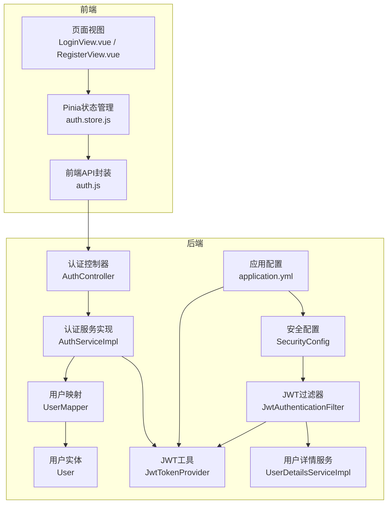
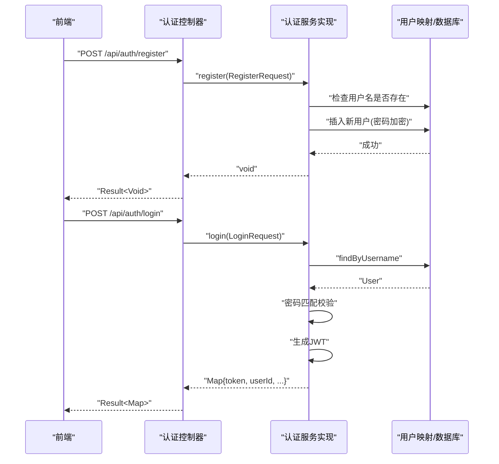
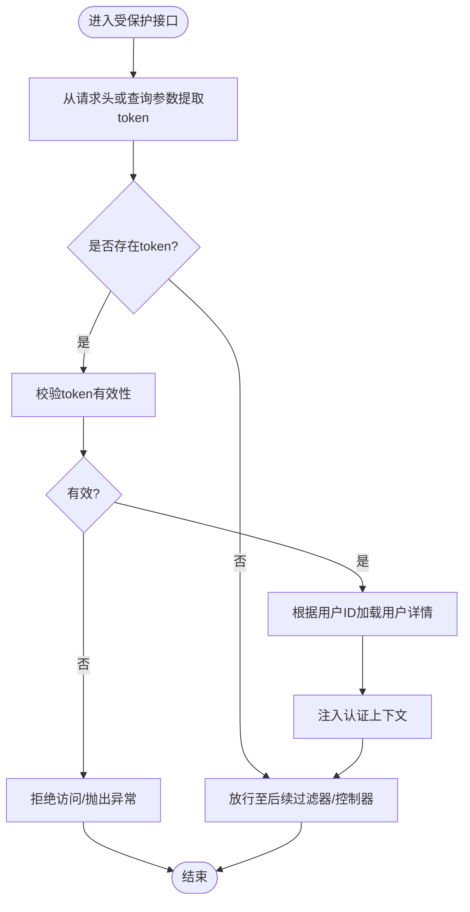
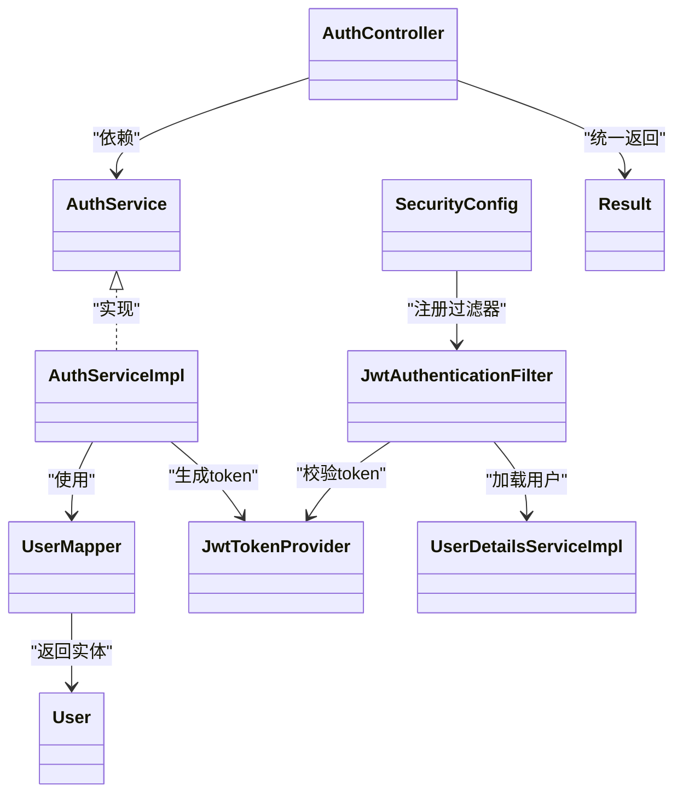

# 用户认证API

<cite>
**本文引用的文件**
- [AuthController.java](file://campus-forum-backend/src/main/java/com/campus/forum/controller/AuthController.java)
- [AuthService.java](file://campus-forum-backend/src/main/java/com/campus/forum/service/AuthService.java)
- [AuthServiceImpl.java](file://campus-forum-backend/src/main/java/com/campus/forum/service/impl/AuthServiceImpl.java)
- [LoginRequest.java](file://campus-forum-backend/src/main/java/com/campus/forum/dto/request/LoginRequest.java)
- [RegisterRequest.java](file://campus-forum-backend/src/main/java/com/campus/forum/dto/request/RegisterRequest.java)
- [JwtTokenProvider.java](file://campus-forum-backend/src/main/java/com/campus/forum/security/JwtTokenProvider.java)
- [JwtAuthenticationFilter.java](file://campus-forum-backend/src/main/java/com/campus/forum/security/JwtAuthenticationFilter.java)
- [UserDetailsServiceImpl.java](file://campus-forum-backend/src/main/java/com/campus/forum/security/UserDetailsServiceImpl.java)
- [SecurityConfig.java](file://campus-forum-backend/src/main/java/com/campus/forum/config/SecurityConfig.java)
- [application.yml](file://campus-forum-backend/src/main/resources/application.yml)
- [Result.java](file://campus-forum-backend/src/main/java/com/campus/forum/common/Result.java)
- [User.java](file://campus-forum-backend/src/main/java/com/campus/forum/entity/User.java)
- [UserMapper.java](file://campus-forum-backend/src/main/java/com/campus/forum/mapper/UserMapper.java)
- [auth.js](file://campus-forum-frontend/src/api/auth.js)
- [auth.store.js](file://campus-forum-frontend/src/stores/auth.js)
- [LoginView.vue](file://campus-forum-frontend/src/views/LoginView.vue)
- [RegisterView.vue](file://campus-forum-frontend/src/views/RegisterView.vue)
</cite>

## 目录
1. [简介](#简介)
2. [项目结构](#项目结构)
3. [核心组件](#核心组件)
4. [架构总览](#架构总览)
5. [详细组件分析](#详细组件分析)
6. [依赖分析](#依赖分析)
7. [性能考虑](#性能考虑)
8. [故障排查指南](#故障排查指南)
9. [结论](#结论)
10. [附录](#附录)

## 简介
本文件为“用户认证API”的权威技术文档，覆盖用户注册、登录等认证相关接口，以及JWT Token的生成、校验与使用机制。文档同时提供前后端对接要点、密码加密策略、会话管理与安全最佳实践，帮助开发者快速集成与安全落地。

## 项目结构
后端采用Spring Boot + Spring Security + MyBatis-Plus架构；前端采用Vue 3 + Pinia + Element Plus。认证模块位于后端controller层，业务逻辑在service层，安全过滤器负责拦截与鉴权，JWT工具负责令牌签发与解析。

图表来源
- [AuthController.java:1-39](file://campus-forum-backend/src/main/java/com/campus/forum/controller/AuthController.java#L1-L39)
- [AuthServiceImpl.java:1-69](file://campus-forum-backend/src/main/java/com/campus/forum/service/impl/AuthServiceImpl.java#L1-L69)
- [JwtTokenProvider.java:1-93](file://campus-forum-backend/src/main/java/com/campus/forum/security/JwtTokenProvider.java#L1-L93)
- [JwtAuthenticationFilter.java:1-59](file://campus-forum-backend/src/main/java/com/campus/forum/security/JwtAuthenticationFilter.java#L1-L59)
- [UserDetailsServiceImpl.java:1-35](file://campus-forum-backend/src/main/java/com/campus/forum/security/UserDetailsServiceImpl.java#L1-L35)
- [SecurityConfig.java:1-67](file://campus-forum-backend/src/main/java/com/campus/forum/config/SecurityConfig.java#L1-L67)
- [application.yml:30-34](file://campus-forum-backend/src/main/resources/application.yml#L30-L34)
- [UserMapper.java:1-39](file://campus-forum-backend/src/main/java/com/campus/forum/mapper/UserMapper.java#L1-L39)
- [User.java:1-33](file://campus-forum-backend/src/main/java/com/campus/forum/entity/User.java#L1-L33)
- [auth.js:1-4](file://campus-forum-frontend/src/api/auth.js#L1-L4)
- [auth.store.js:1-37](file://campus-forum-frontend/src/stores/auth.js#L1-L37)
- [LoginView.vue:1-72](file://campus-forum-frontend/src/views/LoginView.vue#L1-L72)
- [RegisterView.vue:1-65](file://campus-forum-frontend/src/views/RegisterView.vue#L1-L65)

章节来源
- [AuthController.java:1-39](file://campus-forum-backend/src/main/java/com/campus/forum/controller/AuthController.java#L1-L39)
- [SecurityConfig.java:1-67](file://campus-forum-backend/src/main/java/com/campus/forum/config/SecurityConfig.java#L1-L67)

## 核心组件
- 认证控制器：提供注册与登录接口，统一返回包装。
- 认证服务：处理注册与登录业务逻辑，含密码加密与令牌生成。
- JWT工具：生成与校验JWT，从请求头或查询参数解析token。
- 安全过滤器：拦截请求，基于JWT完成用户认证上下文注入。
- 用户详情服务：按用户ID加载用户信息，构建Spring Security用户对象。
- 安全配置：声明式权限控制、无状态会话策略、公开接口白名单。
- 前端API封装与状态管理：封装登录/注册请求、持久化token与用户信息。

章节来源
- [AuthService.java:1-12](file://campus-forum-backend/src/main/java/com/campus/forum/service/AuthService.java#L1-L12)
- [AuthServiceImpl.java:1-69](file://campus-forum-backend/src/main/java/com/campus/forum/service/impl/AuthServiceImpl.java#L1-L69)
- [JwtTokenProvider.java:1-93](file://campus-forum-backend/src/main/java/com/campus/forum/security/JwtTokenProvider.java#L1-L93)
- [JwtAuthenticationFilter.java:1-59](file://campus-forum-backend/src/main/java/com/campus/forum/security/JwtAuthenticationFilter.java#L1-L59)
- [UserDetailsServiceImpl.java:1-35](file://campus-forum-backend/src/main/java/com/campus/forum/security/UserDetailsServiceImpl.java#L1-L35)
- [SecurityConfig.java:1-67](file://campus-forum-backend/src/main/java/com/campus/forum/config/SecurityConfig.java#L1-L67)
- [auth.js:1-4](file://campus-forum-frontend/src/api/auth.js#L1-L4)
- [auth.store.js:1-37](file://campus-forum-frontend/src/stores/auth.js#L1-L37)

## 架构总览
认证流程概览：前端发起注册/登录请求 → 后端控制器接收 → 服务层执行业务 → 数据库读写 → 返回统一封装结果 → 前端保存token并更新状态。

图表来源
- [AuthController.java:26-37](file://campus-forum-backend/src/main/java/com/campus/forum/controller/AuthController.java#L26-L37)
- [AuthServiceImpl.java:28-67](file://campus-forum-backend/src/main/java/com/campus/forum/service/impl/AuthServiceImpl.java#L28-L67)
- [UserMapper.java:12-13](file://campus-forum-backend/src/main/java/com/campus/forum/mapper/UserMapper.java#L12-L13)

## 详细组件分析

### 接口定义与规范

- 基础信息
  - 基础路径：/api/auth
  - 统一响应体：Result<T>，包含code、message、data字段
  - 认证方式：无状态JWT，通过请求头Authorization携带

- 注册接口
  - 方法与路径：POST /api/auth/register
  - 请求体参数：
    - username：字符串，3-20位，必填
    - password：字符串，6-20位，必填
    - nickname：字符串，必填
    - email：字符串，可选
  - 成功响应：Result<Void>，code=200
  - 失败响应：Result<Void>，常见错误码400/500
  - 业务规则：
    - 用户名唯一性校验
    - 密码使用BCrypt加密存储
    - 默认角色为普通用户，状态正常

- 登录接口
  - 方法与路径：POST /api/auth/login
  - 请求体参数：
    - username：字符串，必填
    - password：字符串，必填
  - 成功响应：Result<Map>，包含token及用户信息
    - token：JWT字符串
    - userId：用户ID
    - nickname：昵称
    - avatar：头像URL
    - role：角色（0普通用户，1管理员）
  - 失败响应：Result<Void>，常见错误码400/500
  - 业务规则：
    - 用户存在且未禁用
    - 密码匹配校验
    - 登录成功后签发JWT

章节来源
- [AuthController.java:26-37](file://campus-forum-backend/src/main/java/com/campus/forum/controller/AuthController.java#L26-L37)
- [RegisterRequest.java:1-22](file://campus-forum-backend/src/main/java/com/campus/forum/dto/request/RegisterRequest.java#L1-L22)
- [LoginRequest.java:1-14](file://campus-forum-backend/src/main/java/com/campus/forum/dto/request/LoginRequest.java#L1-L14)
- [Result.java:1-37](file://campus-forum-backend/src/main/java/com/campus/forum/common/Result.java#L1-L37)
- [AuthServiceImpl.java:28-67](file://campus-forum-backend/src/main/java/com/campus/forum/service/impl/AuthServiceImpl.java#L28-L67)

### JWT Token机制
- 生成
  - 使用对称密钥（HMAC-SHA）签发，包含sub（用户ID）、username、iat、exp等声明
  - 过期时间由配置项控制，默认24小时
- 校验
  - 解析签名并验证有效期
  - 支持从请求头Authorization或WebSocket查询参数token提取
- 使用
  - 前端在后续请求头添加Authorization: Bearer <token>
  - 后端过滤器自动解析并注入认证上下文

图表来源
- [JwtAuthenticationFilter.java:30-44](file://campus-forum-backend/src/main/java/com/campus/forum/security/JwtAuthenticationFilter.java#L30-L44)
- [JwtTokenProvider.java:54-71](file://campus-forum-backend/src/main/java/com/campus/forum/security/JwtTokenProvider.java#L54-L71)
- [application.yml:30-34](file://campus-forum-backend/src/main/resources/application.yml#L30-L34)

章节来源
- [JwtTokenProvider.java:23-43](file://campus-forum-backend/src/main/java/com/campus/forum/security/JwtTokenProvider.java#L23-L43)
- [JwtTokenProvider.java:54-91](file://campus-forum-backend/src/main/java/com/campus/forum/security/JwtTokenProvider.java#L54-L91)
- [JwtAuthenticationFilter.java:30-44](file://campus-forum-backend/src/main/java/com/campus/forum/security/JwtAuthenticationFilter.java#L30-L44)
- [application.yml:30-34](file://campus-forum-backend/src/main/resources/application.yml#L30-L34)

### 密码加密策略
- 加密算法：BCrypt
- 存储：仅存储加密后的密码摘要
- 校验：登录时使用matches进行明文密码与存储摘要的比对

章节来源
- [SecurityConfig.java:32-35](file://campus-forum-backend/src/main/java/com/campus/forum/config/SecurityConfig.java#L32-L35)
- [AuthServiceImpl.java:36-54](file://campus-forum-backend/src/main/java/com/campus/forum/service/impl/AuthServiceImpl.java#L36-L54)

### 会话管理机制
- 会话策略：STATELESS（无状态）
- 权限控制：
  - /api/auth/** 对外开放
  - /api/admin/** 需要管理员角色
  - 其余接口需认证后访问
- 用户角色：
  - 0：普通用户
  - 1：管理员

章节来源
- [SecurityConfig.java:47-61](file://campus-forum-backend/src/main/java/com/campus/forum/config/SecurityConfig.java#L47-L61)
- [UserDetailsServiceImpl.java:27-32](file://campus-forum-backend/src/main/java/com/campus/forum/security/UserDetailsServiceImpl.java#L27-L32)
- [User.java:21-24](file://campus-forum-backend/src/main/java/com/campus/forum/entity/User.java#L21-L24)

### 前端调用示例与最佳实践
- 登录
  - 调用：POST /api/auth/login
  - 前端封装：auth.js中的login函数
  - 状态管理：auth.store.js保存token与用户信息到localStorage
  - 页面：LoginView.vue触发登录并跳转首页
- 注册
  - 调用：POST /api/auth/register
  - 前端封装：auth.js中的register函数
  - 页面：RegisterView.vue触发注册并跳转登录页
- 令牌携带
  - 在后续请求头添加Authorization: Bearer <token>
  - WebSocket连接可通过查询参数token传递

章节来源
- [auth.js:1-4](file://campus-forum-frontend/src/api/auth.js#L1-L4)
- [auth.store.js:11-28](file://campus-forum-frontend/src/stores/auth.js#L11-L28)
- [LoginView.vue:39-49](file://campus-forum-frontend/src/views/LoginView.vue#L39-L49)
- [RegisterView.vue:43-53](file://campus-forum-frontend/src/views/RegisterView.vue#L43-L53)

## 依赖分析
- 控制器依赖服务接口，服务实现依赖映射与JWT工具
- 安全过滤器依赖JWT工具与用户详情服务
- 安全配置依赖JWT过滤器，声明公开接口与权限规则
- 前端通过API封装与状态管理与后端交互

图表来源
- [AuthController.java:24-25](file://campus-forum-backend/src/main/java/com/campus/forum/controller/AuthController.java#L24-L25)
- [AuthService.java:8-11](file://campus-forum-backend/src/main/java/com/campus/forum/service/AuthService.java#L8-L11)
- [AuthServiceImpl.java:24-26](file://campus-forum-backend/src/main/java/com/campus/forum/service/impl/AuthServiceImpl.java#L24-L26)
- [UserMapper.java:12-13](file://campus-forum-backend/src/main/java/com/campus/forum/mapper/UserMapper.java#L12-L13)
- [JwtTokenProvider.java:33-43](file://campus-forum-backend/src/main/java/com/campus/forum/security/JwtTokenProvider.java#L33-L43)
- [JwtAuthenticationFilter.java:27-28](file://campus-forum-backend/src/main/java/com/campus/forum/security/JwtAuthenticationFilter.java#L27-L28)
- [UserDetailsServiceImpl.java:22-32](file://campus-forum-backend/src/main/java/com/campus/forum/security/UserDetailsServiceImpl.java#L22-L32)
- [SecurityConfig.java:30-31](file://campus-forum-backend/src/main/java/com/campus/forum/config/SecurityConfig.java#L30-L31)
- [Result.java:9-12](file://campus-forum-backend/src/main/java/com/campus/forum/common/Result.java#L9-L12)
- [User.java:12-32](file://campus-forum-backend/src/main/java/com/campus/forum/entity/User.java#L12-L32)

## 性能考虑
- JWT签发/校验成本低，适合高并发场景
- 密码加密使用BCrypt，建议在高负载下评估CPU占用
- 无状态设计避免服务器端会话存储，利于横向扩展
- 建议对频繁登录失败的IP增加限流策略（可在网关层实现）

## 故障排查指南
- 常见错误与定位
  - 用户名或密码错误：登录时用户名不存在或密码不匹配
  - 账号被禁用：用户状态为禁用
  - 未登录或Token已过期：请求头缺少或无效的Authorization
- 建议排查步骤
  - 检查请求头Authorization格式是否为Bearer <token>
  - 核对JWT过期时间与服务器时间同步
  - 确认用户名唯一性与密码加密一致性
  - 查看后端日志中的业务异常信息

章节来源
- [AuthServiceImpl.java:50-58](file://campus-forum-backend/src/main/java/com/campus/forum/service/impl/AuthServiceImpl.java#L50-L58)
- [JwtTokenProvider.java:64-71](file://campus-forum-backend/src/main/java/com/campus/forum/security/JwtTokenProvider.java#L64-L71)
- [SecurityConfig.java:47-61](file://campus-forum-backend/src/main/java/com/campus/forum/config/SecurityConfig.java#L47-L61)

## 结论
本认证模块以JWT为核心，结合Spring Security实现了无状态、可扩展的用户认证体系。前后端职责清晰，接口规范明确，配合BCrypt加密与严格的权限控制，满足校园论坛的安全与可用性要求。建议在生产环境补充限流、审计与更完善的邮箱验证流程。

## 附录

### 接口一览表
- 注册
  - 方法：POST
  - 路径：/api/auth/register
  - 请求体：username, password, nickname, email
  - 成功：200
  - 失败：400/500
- 登录
  - 方法：POST
  - 路径：/api/auth/login
  - 请求体：username, password
  - 成功：200，返回token与用户信息
  - 失败：400/500

章节来源
- [AuthController.java:26-37](file://campus-forum-backend/src/main/java/com/campus/forum/controller/AuthController.java#L26-L37)
- [RegisterRequest.java:8-21](file://campus-forum-backend/src/main/java/com/campus/forum/dto/request/RegisterRequest.java#L8-L21)
- [LoginRequest.java:7-12](file://campus-forum-backend/src/main/java/com/campus/forum/dto/request/LoginRequest.java#L7-L12)
- [Result.java:14-31](file://campus-forum-backend/src/main/java/com/campus/forum/common/Result.java#L14-L31)