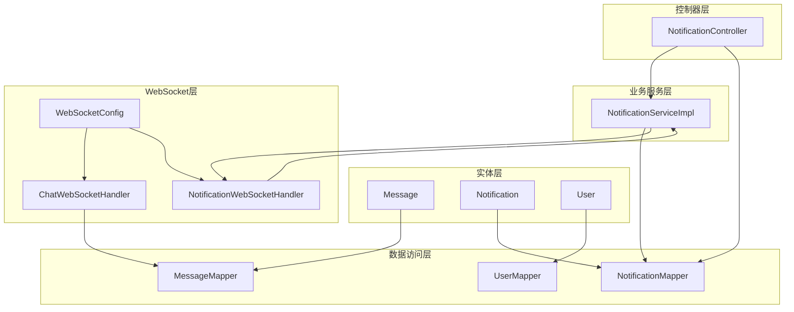
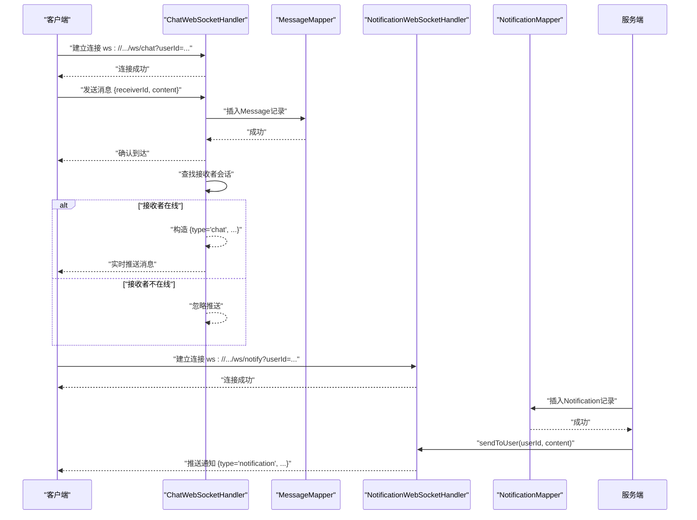
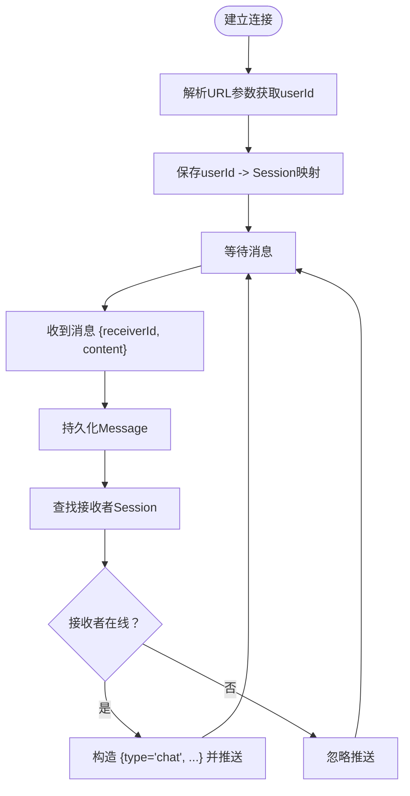
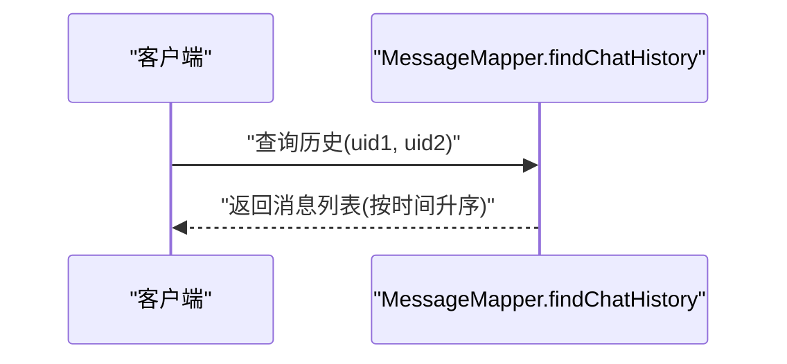
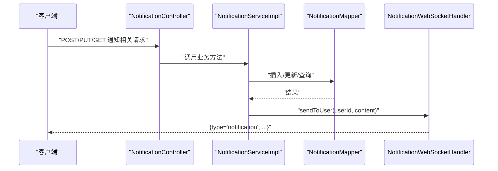
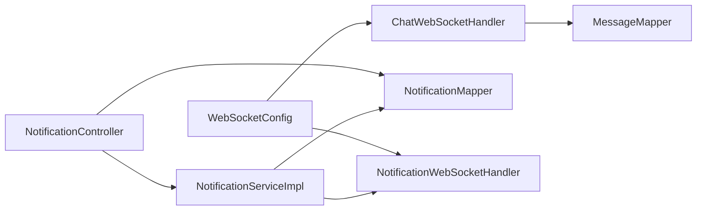

# 私信聊天API

<cite>
**本文引用的文件**
- [Message.java](file://campus-forum-backend/src/main/java/com/campus/forum/entity/Message.java)
- [MessageMapper.java](file://campus-forum-backend/src/main/java/com/campus/forum/mapper/MessageMapper.java)
- [Notification.java](file://campus-forum-backend/src/main/java/com/campus/forum/entity/Notification.java)
- [NotificationMapper.java](file://campus-forum-backend/src/main/java/com/campus/forum/mapper/NotificationMapper.java)
- [NotificationServiceImpl.java](file://campus-forum-backend/src/main/java/com/campus/forum/service/impl/NotificationServiceImpl.java)
- [NotificationController.java](file://campus-forum-backend/src/main/java/com/campus/forum/controller/NotificationController.java)
- [ChatWebSocketHandler.java](file://campus-forum-backend/src/main/java/com/campus/forum/websocket/ChatWebSocketHandler.java)
- [NotificationWebSocketHandler.java](file://campus-forum-backend/src/main/java/com/campus/forum/websocket/NotificationWebSocketHandler.java)
- [WebSocketConfig.java](file://campus-forum-backend/src/main/java/com/campus/forum/config/WebSocketConfig.java)
- [UserMapper.java](file://campus-forum-backend/src/main/java/com/campus/forum/mapper/UserMapper.java)
- [User.java](file://campus-forum-backend/src/main/java/com/campus/forum/entity/User.java)
- [application.yml](file://campus-forum-backend/src/main/resources/application.yml)
</cite>

## 目录
1. [简介](#简介)
2. [项目结构](#项目结构)
3. [核心组件](#核心组件)
4. [架构总览](#架构总览)
5. [详细组件分析](#详细组件分析)
6. [依赖分析](#依赖分析)
7. [性能考虑](#性能考虑)
8. [故障排查指南](#故障排查指南)
9. [结论](#结论)
10. [附录](#附录)

## 简介
本文件面向私信聊天模块的API与实时通信能力，覆盖以下范围：
- 私信发送、接收与历史查询接口
- WebSocket实时聊天连接、消息推送与断线重连机制
- 通知系统（与私信相关）与未读统计
- 在线状态、好友关注、黑名单等扩展能力的API现状说明
- 消息存储策略、历史记录查询与消息同步机制

说明：
- 当前后端实现以私信与通知两条主线为主，未发现群聊、消息撤回、文件/图片消息体、消息已读未读状态管理等高级特性。
- 文档在“概念性概述”部分对缺失能力进行补充说明，便于后续演进。

## 项目结构
后端采用Spring Boot + MyBatis-Plus，私信与通知相关代码主要分布在以下层次：
- 实体层：Message、Notification、User
- 数据访问层：MessageMapper、NotificationMapper、UserMapper
- 业务服务层：NotificationServiceImpl（通知），私信持久化由ChatWebSocketHandler直接调用MessageMapper
- 控制器层：NotificationController（通知）
- WebSocket层：ChatWebSocketHandler（私信）、NotificationWebSocketHandler（通知）
- 配置层：WebSocketConfig

图表来源
- [Message.java:1-19](file://campus-forum-backend/src/main/java/com/campus/forum/entity/Message.java#L1-L19)
- [Notification.java:1-23](file://campus-forum-backend/src/main/java/com/campus/forum/entity/Notification.java#L1-L23)
- [User.java:1-33](file://campus-forum-backend/src/main/java/com/campus/forum/entity/User.java#L1-L33)
- [MessageMapper.java:1-16](file://campus-forum-backend/src/main/java/com/campus/forum/mapper/MessageMapper.java#L1-L16)
- [NotificationMapper.java:1-16](file://campus-forum-backend/src/main/java/com/campus/forum/mapper/NotificationMapper.java#L1-L16)
- [UserMapper.java:1-39](file://campus-forum-backend/src/main/java/com/campus/forum/mapper/UserMapper.java#L1-L39)
- [NotificationServiceImpl.java:1-58](file://campus-forum-backend/src/main/java/com/campus/forum/service/impl/NotificationServiceImpl.java#L1-L58)
- [NotificationController.java:1-67](file://campus-forum-backend/src/main/java/com/campus/forum/controller/NotificationController.java#L1-L67)
- [ChatWebSocketHandler.java:1-89](file://campus-forum-backend/src/main/java/com/campus/forum/websocket/ChatWebSocketHandler.java#L1-L89)
- [NotificationWebSocketHandler.java:1-78](file://campus-forum-backend/src/main/java/com/campus/forum/websocket/NotificationWebSocketHandler.java#L1-L78)
- [WebSocketConfig.java:1-28](file://campus-forum-backend/src/main/java/com/campus/forum/config/WebSocketConfig.java#L1-L28)

章节来源
- [WebSocketConfig.java:1-28](file://campus-forum-backend/src/main/java/com/campus/forum/config/WebSocketConfig.java#L1-L28)
- [application.yml:1-53](file://campus-forum-backend/src/main/resources/application.yml#L1-L53)

## 核心组件
- 私信实体与持久化
  - Message实体包含发送方、接收方、内容与创建时间；isRead字段存在但当前未在私信流程中使用。
  - MessageMapper提供双向聊天历史查询SQL，按创建时间升序返回。
- 通知系统
  - Notification实体包含通知类型、目标对象、内容与是否已读。
  - NotificationMapper提供未读计数与全部标记已读SQL。
  - NotificationServiceImpl封装通知插入与通过WebSocket向用户推送逻辑。
  - NotificationController提供通知列表、标记全部已读、标记单条已读、未读数量查询。
- WebSocket实时通信
  - ChatWebSocketHandler：建立ws://.../ws/chat连接，解析URL参数userId，接收文本消息并持久化，再向接收方会话推送。
  - NotificationWebSocketHandler：建立ws://.../ws/notify连接，向指定用户推送通知消息。
  - WebSocketConfig注册两条WebSocket处理器。

章节来源
- [Message.java:1-19](file://campus-forum-backend/src/main/java/com/campus/forum/entity/Message.java#L1-L19)
- [MessageMapper.java:12-14](file://campus-forum-backend/src/main/java/com/campus/forum/mapper/MessageMapper.java#L12-L14)
- [Notification.java:1-23](file://campus-forum-backend/src/main/java/com/campus/forum/entity/Notification.java#L1-L23)
- [NotificationMapper.java:10-14](file://campus-forum-backend/src/main/java/com/campus/forum/mapper/NotificationMapper.java#L10-L14)
- [NotificationServiceImpl.java:23-56](file://campus-forum-backend/src/main/java/com/campus/forum/service/impl/NotificationServiceImpl.java#L23-L56)
- [NotificationController.java:26-65](file://campus-forum-backend/src/main/java/com/campus/forum/controller/NotificationController.java#L26-L65)
- [ChatWebSocketHandler.java:31-75](file://campus-forum-backend/src/main/java/com/campus/forum/websocket/ChatWebSocketHandler.java#L31-L75)
- [NotificationWebSocketHandler.java:26-57](file://campus-forum-backend/src/main/java/com/campus/forum/websocket/NotificationWebSocketHandler.java#L26-L57)
- [WebSocketConfig.java:20-26](file://campus-forum-backend/src/main/java/com/campus/forum/config/WebSocketConfig.java#L20-L26)

## 架构总览
私信与通知的端到端交互如下：

图表来源
- [ChatWebSocketHandler.java:31-75](file://campus-forum-backend/src/main/java/com/campus/forum/websocket/ChatWebSocketHandler.java#L31-L75)
- [MessageMapper.java:12-14](file://campus-forum-backend/src/main/java/com/campus/forum/mapper/MessageMapper.java#L12-L14)
- [NotificationWebSocketHandler.java:47-57](file://campus-forum-backend/src/main/java/com/campus/forum/websocket/NotificationWebSocketHandler.java#L47-L57)
- [NotificationMapper.java:10-14](file://campus-forum-backend/src/main/java/com/campus/forum/mapper/NotificationMapper.java#L10-L14)

## 详细组件分析

### 私信发送与接收（WebSocket）
- 连接建立
  - 路径：/ws/chat
  - 参数：userId（从URL查询参数解析）、token（当前用于通知通道，私信通道未校验）
  - 会话映射：userId -> WebSocketSession，ConcurrentHashMap维护
- 消息处理
  - 接收JSON文本消息，解析receiverId与content
  - 构造Message并插入数据库
  - 若接收者在线，构造推送消息并发送
- 断线处理
  - 连接关闭时移除会话映射

图表来源
- [ChatWebSocketHandler.java:31-75](file://campus-forum-backend/src/main/java/com/campus/forum/websocket/ChatWebSocketHandler.java#L31-L75)

章节来源
- [ChatWebSocketHandler.java:18-89](file://campus-forum-backend/src/main/java/com/campus/forum/websocket/ChatWebSocketHandler.java#L18-L89)
- [WebSocketConfig.java:20-26](file://campus-forum-backend/src/main/java/com/campus/forum/config/WebSocketConfig.java#L20-L26)

### 历史消息查询（REST）
- 接口：GET /api/messages/history
- 请求参数：uid1, uid2（双方用户ID）
- 返回：按创建时间升序排列的历史消息列表
- 注意：当前未实现分页与鉴权校验

图表来源
- [MessageMapper.java:12-14](file://campus-forum-backend/src/main/java/com/campus/forum/mapper/MessageMapper.java#L12-L14)

章节来源
- [MessageMapper.java:12-14](file://campus-forum-backend/src/main/java/com/campus/forum/mapper/MessageMapper.java#L12-L14)

### 通知系统（REST + WebSocket）
- REST接口
  - GET /api/notifications：分页列出当前用户的通知
  - PUT /api/notifications/read-all：标记全部已读
  - PUT /api/notifications/{id}/read：标记单条已读
  - GET /api/notifications/unread-count：查询未读数量
- WebSocket推送
  - 服务端生成通知后，通过NotificationWebSocketHandler向指定用户推送
  - 客户端连接路径：/ws/notify，参数：userId

图表来源
- [NotificationController.java:26-65](file://campus-forum-backend/src/main/java/com/campus/forum/controller/NotificationController.java#L26-L65)
- [NotificationServiceImpl.java:23-56](file://campus-forum-backend/src/main/java/com/campus/forum/service/impl/NotificationServiceImpl.java#L23-L56)
- [NotificationMapper.java:10-14](file://campus-forum-backend/src/main/java/com/campus/forum/mapper/NotificationMapper.java#L10-L14)
- [NotificationWebSocketHandler.java:47-57](file://campus-forum-backend/src/main/java/com/campus/forum/websocket/NotificationWebSocketHandler.java#L47-L57)

章节来源
- [NotificationController.java:16-67](file://campus-forum-backend/src/main/java/com/campus/forum/controller/NotificationController.java#L16-L67)
- [NotificationServiceImpl.java:15-58](file://campus-forum-backend/src/main/java/com/campus/forum/service/impl/NotificationServiceImpl.java#L15-L58)
- [NotificationWebSocketHandler.java:13-78](file://campus-forum-backend/src/main/java/com/campus/forum/websocket/NotificationWebSocketHandler.java#L13-L78)

### 在线状态、好友列表、黑名单（现状与建议）
- 现状
  - 在线状态：WebSocket会话映射用于判断接收者是否在线，但未暴露查询接口。
  - 好友列表：UserMapper提供关注/粉丝查询SQL，但未暴露REST接口。
  - 黑名单：未发现相关实体与接口。
- 建议
  - 对外提供：在线状态查询、关注/取消关注、粉丝/关注列表、黑名单增删查接口。
  - 私信发送前可增加黑名单拦截逻辑。

章节来源
- [UserMapper.java:18-37](file://campus-forum-backend/src/main/java/com/campus/forum/mapper/UserMapper.java#L18-L37)
- [User.java:1-33](file://campus-forum-backend/src/main/java/com/campus/forum/entity/User.java#L1-L33)

### 消息类型与已读状态（现状与建议）
- 现状
  - Message.content为纯文本，未区分文本/图片/文件等类型。
  - isRead存在但未在私信流程中使用。
- 建议
  - 引入消息类型枚举与扩展content结构（如JSON含type与payload）。
  - 引入已读回执与未读统计，WebSocket推送时携带已读状态。

章节来源
- [Message.java:12-15](file://campus-forum-backend/src/main/java/com/campus/forum/entity/Message.java#L12-L15)

## 依赖分析
- 组件耦合
  - ChatWebSocketHandler直接依赖MessageMapper进行持久化，耦合度较高；建议引入私信服务层统一入口。
  - NotificationServiceImpl依赖NotificationMapper与NotificationWebSocketHandler，职责清晰。
- 外部依赖
  - Spring WebSocket、Jackson、MyBatis-Plus、MySQL驱动
- 配置要点
  - WebSocket路径与跨域策略在WebSocketConfig中配置
  - 数据源、JWT密钥、文件上传路径在application.yml中配置

图表来源
- [ChatWebSocketHandler.java:29](file://campus-forum-backend/src/main/java/com/campus/forum/websocket/ChatWebSocketHandler.java#L29)
- [NotificationServiceImpl.java:20-21](file://campus-forum-backend/src/main/java/com/campus/forum/service/impl/NotificationServiceImpl.java#L20-L21)
- [NotificationController.java:22-24](file://campus-forum-backend/src/main/java/com/campus/forum/controller/NotificationController.java#L22-L24)
- [WebSocketConfig.java:17-26](file://campus-forum-backend/src/main/java/com/campus/forum/config/WebSocketConfig.java#L17-L26)

章节来源
- [WebSocketConfig.java:1-28](file://campus-forum-backend/src/main/java/com/campus/forum/config/WebSocketConfig.java#L1-L28)
- [application.yml:9-46](file://campus-forum-backend/src/main/resources/application.yml#L9-L46)

## 性能考虑
- WebSocket
  - 使用ConcurrentHashMap维护会话映射，适合高并发场景；注意连接数与内存占用。
  - 推送前检查会话isOpen，避免无效写入。
- 数据库
  - 历史查询按时间排序，建议在message(sender_id, receiver_id, created_at)与message(created_at)建立索引。
  - 通知未读统计使用COUNT查询，建议在notification(user_id, is_read)建立复合索引。
- 分页与限流
  - 历史查询与通知列表建议增加分页参数与速率限制，防止大流量冲击。

## 故障排查指南
- WebSocket连接失败
  - 检查URL参数userId格式与token（通知通道使用token，私信通道未校验）
  - 查看日志中“连接建立/关闭”与“获取userId失败”的告警
- 消息未送达
  - 确认接收者会话是否在线且isOpen
  - 检查Message持久化是否成功
- 通知未显示
  - 确认NotificationServiceImpl是否调用sendToUser
  - 检查NotificationWebSocketHandler的sendToUser执行情况

章节来源
- [ChatWebSocketHandler.java:32-46](file://campus-forum-backend/src/main/java/com/campus/forum/websocket/ChatWebSocketHandler.java#L32-L46)
- [NotificationWebSocketHandler.java:26-57](file://campus-forum-backend/src/main/java/com/campus/forum/websocket/NotificationWebSocketHandler.java#L26-L57)
- [NotificationServiceImpl.java:35-36](file://campus-forum-backend/src/main/java/com/campus/forum/service/impl/NotificationServiceImpl.java#L35-L36)

## 结论
- 当前私信与通知能力以WebSocket为核心，实现了点对点消息与系统通知的实时推送。
- REST接口覆盖通知模块，私信历史查询接口已具备基础能力。
- 尚未实现群聊、消息类型区分、消息已读未读状态、黑名单等高级特性，建议在后续版本中逐步完善。

## 附录

### API清单与规范

- 私信
  - WebSocket
    - 路径：/ws/chat
    - 连接参数：userId（必填）
    - 发送消息格式：{receiverId: number, content: string}
    - 推送消息格式：{type: "chat", senderId: number, content: string, time: string}
  - REST（建议）
    - GET /api/messages/history?uid1=number&uid2=number
    - 返回：按created_at升序的消息列表

- 通知
  - REST
    - GET /api/notifications?page=1&size=20
    - PUT /api/notifications/read-all
    - PUT /api/notifications/{id}/read
    - GET /api/notifications/unread-count
  - WebSocket
    - 路径：/ws/notify
    - 推送消息格式：{type: "notification", content: string}

- 在线状态、好友列表、黑名单（建议新增）
  - GET /api/users/{id}/status
  - POST /api/friendships/follow
  - DELETE /api/friendships/unfollow
  - GET /api/users/{id}/followers
  - GET /api/users/{id}/following
  - GET /api/users/{id}/blacklist
  - POST /api/users/{id}/block
  - DELETE /api/users/{id}/unblock

- 配置参考
  - WebSocket跨域：WebSocketConfig中设置允许所有来源
  - 数据源与JWT：application.yml中配置

章节来源
- [WebSocketConfig.java:20-26](file://campus-forum-backend/src/main/java/com/campus/forum/config/WebSocketConfig.java#L20-L26)
- [application.yml:9-46](file://campus-forum-backend/src/main/resources/application.yml#L9-L46)