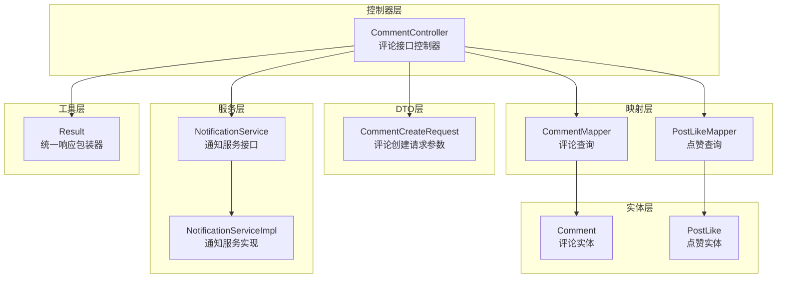
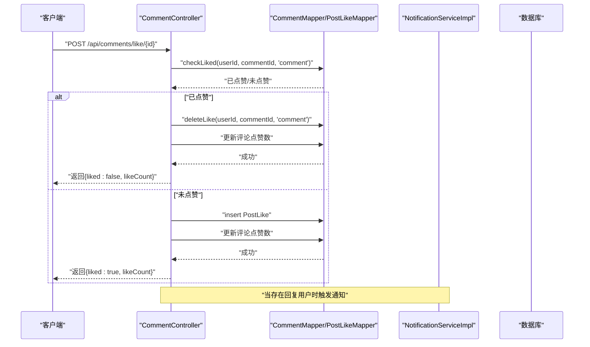
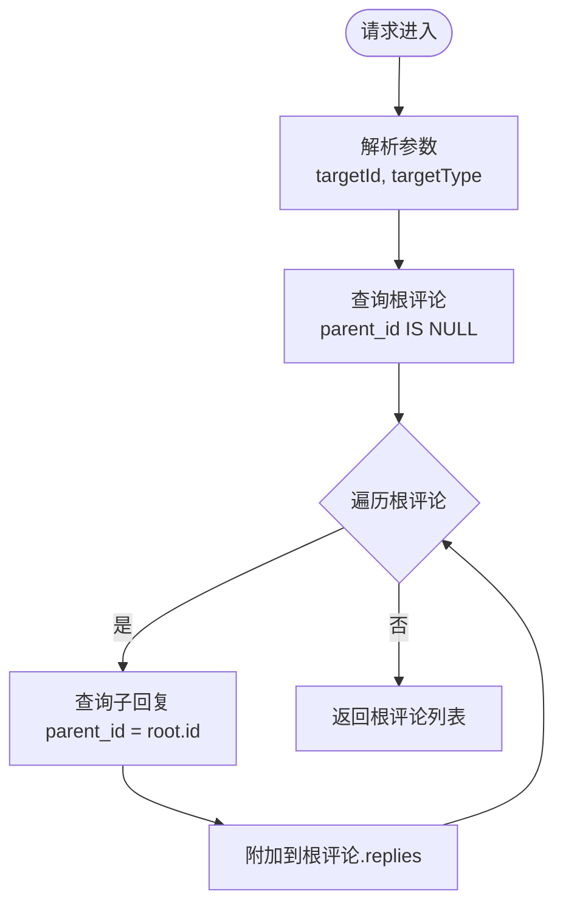
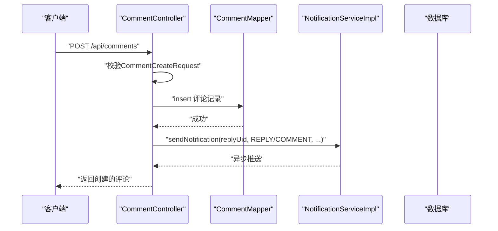
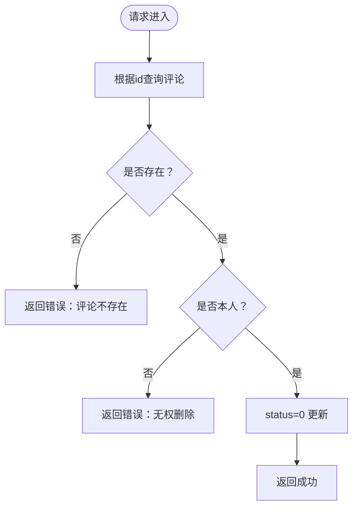
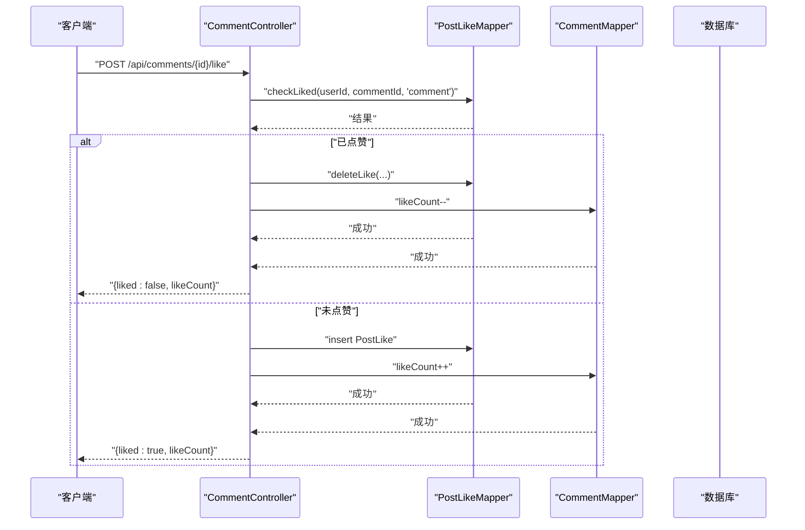
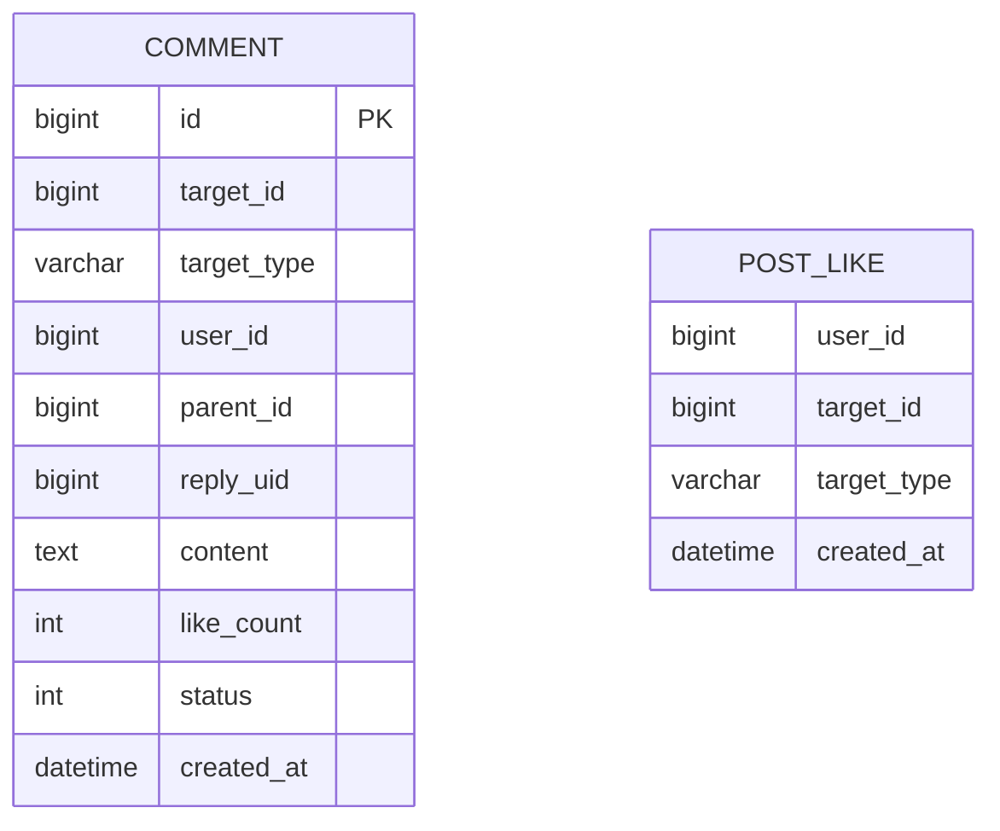
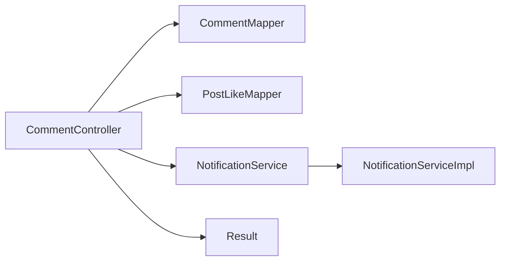

# 评论管理API

<cite>
**本文档引用的文件**
- [CommentController.java](file://campus-forum-backend/src/main/java/com/campus/forum/controller/CommentController.java)
- [CommentCreateRequest.java](file://campus-forum-backend/src/main/java/com/campus/forum/dto/request/CommentCreateRequest.java)
- [Comment.java](file://campus-forum-backend/src/main/java/com/campus/forum/entity/Comment.java)
- [CommentMapper.java](file://campus-forum-backend/src/main/java/com/campus/forum/mapper/CommentMapper.java)
- [PostLikeMapper.java](file://campus-forum-backend/src/main/java/com/campus/forum/mapper/PostLikeMapper.java)
- [PostLike.java](file://campus-forum-backend/src/main/java/com/campus/forum/entity/PostLike.java)
- [NotificationService.java](file://campus-forum-backend/src/main/java/com/campus/forum/service/NotificationService.java)
- [NotificationServiceImpl.java](file://campus-forum-backend/src/main/java/com/campus/forum/service/impl/NotificationServiceImpl.java)
- [Result.java](file://campus-forum-backend/src/main/java/com/campus/forum/common/Result.java)
</cite>

## 目录
1. [简介](#简介)
2. [项目结构](#项目结构)
3. [核心组件](#核心组件)
4. [架构概览](#架构概览)
5. [详细组件分析](#详细组件分析)
6. [依赖分析](#依赖分析)
7. [性能考虑](#性能考虑)
8. [故障排除指南](#故障排除指南)
9. [结论](#结论)

## 简介
本文件为校园论坛系统的评论管理模块提供完整的API文档。该模块支持评论的基础操作（创建、读取、删除）、树形结构查询与嵌套回复展示、评论互动（点赞/取消点赞）、以及评论状态管理等功能。系统采用统一响应包装器，并通过通知服务实现实时消息推送。

## 项目结构
评论管理模块位于后端工程的控制器、数据传输对象、实体类、持久层映射及服务层之间，形成清晰的分层架构：

- 控制器层：负责HTTP请求处理与响应封装
- DTO层：定义请求参数校验规则
- 实体层：描述数据库表结构及业务属性
- 映射层：提供SQL查询方法
- 服务层：处理业务逻辑与外部集成

**图表来源**
- [CommentController.java:25-115](file://campus-forum-backend/src/main/java/com/campus/forum/controller/CommentController.java#L25-L115)
- [CommentCreateRequest.java:8-21](file://campus-forum-backend/src/main/java/com/campus/forum/dto/request/CommentCreateRequest.java#L8-L21)
- [Comment.java:11-31](file://campus-forum-backend/src/main/java/com/campus/forum/entity/Comment.java#L11-L31)
- [PostLike.java:7-16](file://campus-forum-backend/src/main/java/com/campus/forum/entity/PostLike.java#L7-L16)
- [CommentMapper.java:9-19](file://campus-forum-backend/src/main/java/com/campus/forum/mapper/CommentMapper.java#L9-L19)
- [PostLikeMapper.java:7-16](file://campus-forum-backend/src/main/java/com/campus/forum/mapper/PostLikeMapper.java#L7-L16)
- [NotificationService.java:7-14](file://campus-forum-backend/src/main/java/com/campus/forum/service/NotificationService.java#L7-L14)
- [NotificationServiceImpl.java:16-58](file://campus-forum-backend/src/main/java/com/campus/forum/service/impl/NotificationServiceImpl.java#L16-L58)
- [Result.java:8-37](file://campus-forum-backend/src/main/java/com/campus/forum/common/Result.java#L8-L37)

**章节来源**
- [CommentController.java:25-115](file://campus-forum-backend/src/main/java/com/campus/forum/controller/CommentController.java#L25-L115)
- [CommentMapper.java:9-19](file://campus-forum-backend/src/main/java/com/campus/forum/mapper/CommentMapper.java#L9-L19)

## 核心组件
- 评论控制器：提供评论树查询、评论创建、评论删除、评论点赞等接口
- 请求参数DTO：对评论创建请求进行参数校验
- 评论实体：描述评论的数据模型，包含目标类型、父子关系、状态与计数等
- 点赞实体：记录用户对评论的点赞行为
- 通知服务：在评论或回复时向被@用户发送通知
- 统一响应包装器：标准化接口返回格式

**章节来源**
- [CommentController.java:25-115](file://campus-forum-backend/src/main/java/com/campus/forum/controller/CommentController.java#L25-L115)
- [CommentCreateRequest.java:8-21](file://campus-forum-backend/src/main/java/com/campus/forum/dto/request/CommentCreateRequest.java#L8-L21)
- [Comment.java:11-31](file://campus-forum-backend/src/main/java/com/campus/forum/entity/Comment.java#L11-L31)
- [PostLike.java:7-16](file://campus-forum-backend/src/main/java/com/campus/forum/entity/PostLike.java#L7-L16)
- [NotificationService.java:7-14](file://campus-forum-backend/src/main/java/com/campus/forum/service/NotificationService.java#L7-L14)
- [Result.java:8-37](file://campus-forum-backend/src/main/java/com/campus/forum/common/Result.java#L8-L37)

## 架构概览
评论管理模块遵循典型的MVC+分层架构，控制器接收请求后调用映射层执行数据库操作，并通过服务层完成跨模块协作（如通知）。所有接口返回统一包装结果。

**图表来源**
- [CommentController.java:88-115](file://campus-forum-backend/src/main/java/com/campus/forum/controller/CommentController.java#L88-L115)
- [PostLikeMapper.java:10-14](file://campus-forum-backend/src/main/java/com/campus/forum/mapper/PostLikeMapper.java#L10-L14)
- [NotificationServiceImpl.java:23-37](file://campus-forum-backend/src/main/java/com/campus/forum/service/impl/NotificationServiceImpl.java#L23-L37)

## 详细组件分析

### 评论树形结构查询
- 接口：GET /api/comments
- 功能：按目标ID与目标类型查询根评论，并为每个根评论加载其子回复
- 查询策略：
  - 根评论：parent_id为空且状态正常
  - 子回复：按parent_id查询并按创建时间升序排列
- 返回：根评论列表，其中每个根评论包含replies子列表

**图表来源**
- [CommentController.java:35-44](file://campus-forum-backend/src/main/java/com/campus/forum/controller/CommentController.java#L35-L44)
- [CommentMapper.java:12-17](file://campus-forum-backend/src/main/java/com/campus/forum/mapper/CommentMapper.java#L12-L17)

**章节来源**
- [CommentController.java:35-44](file://campus-forum-backend/src/main/java/com/campus/forum/controller/CommentController.java#L35-L44)
- [CommentMapper.java:12-17](file://campus-forum-backend/src/main/java/com/campus/forum/mapper/CommentMapper.java#L12-L17)

### 发表评论/回复
- 接口：POST /api/comments
- 功能：创建评论或楼中楼回复
- 参数校验：目标ID、目标类型、评论内容必填；可选parentId与replyUid
- 权限控制：需登录用户，使用当前登录用户ID作为作者
- 状态默认：创建时状态设为正常
- 通知触发：若存在replyUid且与当前用户不同，则向被回复用户发送通知

**图表来源**
- [CommentController.java:46-71](file://campus-forum-backend/src/main/java/com/campus/forum/controller/CommentController.java#L46-L71)
- [CommentCreateRequest.java:8-21](file://campus-forum-backend/src/main/java/com/campus/forum/dto/request/CommentCreateRequest.java#L8-L21)
- [NotificationServiceImpl.java:23-37](file://campus-forum-backend/src/main/java/com/campus/forum/service/impl/NotificationServiceImpl.java#L23-L37)

**章节来源**
- [CommentController.java:46-71](file://campus-forum-backend/src/main/java/com/campus/forum/controller/CommentController.java#L46-L71)
- [CommentCreateRequest.java:8-21](file://campus-forum-backend/src/main/java/com/campus/forum/dto/request/CommentCreateRequest.java#L8-L21)
- [NotificationServiceImpl.java:23-37](file://campus-forum-backend/src/main/java/com/campus/forum/service/impl/NotificationServiceImpl.java#L23-L37)

### 删除评论
- 接口：DELETE /api/comments/{id}
- 功能：软删除评论（更新状态为禁用）
- 权限控制：仅评论作者可删除
- 安全性：先查询再判断，防止越权

**图表来源**
- [CommentController.java:73-86](file://campus-forum-backend/src/main/java/com/campus/forum/controller/CommentController.java#L73-L86)

**章节来源**
- [CommentController.java:73-86](file://campus-forum-backend/src/main/java/com/campus/forum/controller/CommentController.java#L73-L86)

### 评论点赞/取消点赞
- 接口：POST /api/comments/{id}/like
- 功能：对评论进行点赞或取消点赞
- 逻辑：
  - 若已点赞则取消并扣减计数
  - 若未点赞则新增点赞并增加计数
- 返回：包含liked状态与当前点赞数

**图表来源**
- [CommentController.java:88-115](file://campus-forum-backend/src/main/java/com/campus/forum/controller/CommentController.java#L88-L115)
- [PostLikeMapper.java:10-14](file://campus-forum-backend/src/main/java/com/campus/forum/mapper/PostLikeMapper.java#L10-L14)
- [CommentMapper.java:12-17](file://campus-forum-backend/src/main/java/com/campus/forum/mapper/CommentMapper.java#L12-L17)

**章节来源**
- [CommentController.java:88-115](file://campus-forum-backend/src/main/java/com/campus/forum/controller/CommentController.java#L88-L115)
- [PostLikeMapper.java:10-14](file://campus-forum-backend/src/main/java/com/campus/forum/mapper/PostLikeMapper.java#L10-L14)

### 数据模型

**图表来源**
- [Comment.java:11-31](file://campus-forum-backend/src/main/java/com/campus/forum/entity/Comment.java#L11-L31)
- [PostLike.java:7-16](file://campus-forum-backend/src/main/java/com/campus/forum/entity/PostLike.java#L7-L16)

**章节来源**
- [Comment.java:11-31](file://campus-forum-backend/src/main/java/com/campus/forum/entity/Comment.java#L11-L31)
- [PostLike.java:7-16](file://campus-forum-backend/src/main/java/com/campus/forum/entity/PostLike.java#L7-L16)

## 依赖分析
- 控制器依赖映射层与服务层，实现业务编排
- 映射层依赖MyBatis-Plus，提供SQL查询能力
- 通知服务通过WebSocket向用户推送实时消息
- 统一响应包装器贯穿各层，保证接口一致性

**图表来源**
- [CommentController.java:31-33](file://campus-forum-backend/src/main/java/com/campus/forum/controller/CommentController.java#L31-L33)
- [CommentMapper.java:9-19](file://campus-forum-backend/src/main/java/com/campus/forum/mapper/CommentMapper.java#L9-L19)
- [PostLikeMapper.java:7-16](file://campus-forum-backend/src/main/java/com/campus/forum/mapper/PostLikeMapper.java#L7-L16)
- [NotificationService.java:7-14](file://campus-forum-backend/src/main/java/com/campus/forum/service/NotificationService.java#L7-L14)
- [NotificationServiceImpl.java:16-58](file://campus-forum-backend/src/main/java/com/campus/forum/service/impl/NotificationServiceImpl.java#L16-L58)
- [Result.java:8-37](file://campus-forum-backend/src/main/java/com/campus/forum/common/Result.java#L8-L37)

**章节来源**
- [CommentController.java:31-33](file://campus-forum-backend/src/main/java/com/campus/forum/controller/CommentController.java#L31-L33)
- [NotificationServiceImpl.java:20-37](file://campus-forum-backend/src/main/java/com/campus/forum/service/impl/NotificationServiceImpl.java#L20-L37)

## 性能考虑
- 评论树查询：根评论与子回复分别查询，建议在高并发场景下对热点目标ID添加缓存
- 点赞操作：单条记录更新，注意在高并发下可能产生竞态，可引入乐观锁或队列异步化
- 通知推送：WebSocket推送为异步，但数据库写入仍需关注写入延迟

## 故障排除指南
- 评论不存在：删除接口在查询不到评论时返回错误
- 权限不足：删除接口对非作者本人返回无权删除
- 参数校验失败：创建接口对空值参数返回校验错误
- 通知未送达：检查通知服务实现与WebSocket配置

**章节来源**
- [CommentController.java:77-82](file://campus-forum-backend/src/main/java/com/campus/forum/controller/CommentController.java#L77-L82)
- [CommentCreateRequest.java:8-21](file://campus-forum-backend/src/main/java/com/campus/forum/dto/request/CommentCreateRequest.java#L8-L21)
- [NotificationServiceImpl.java:23-37](file://campus-forum-backend/src/main/java/com/campus/forum/service/impl/NotificationServiceImpl.java#L23-L37)

## 结论
评论管理模块提供了完整的评论生命周期管理能力，包括树形结构展示、嵌套回复、点赞互动与权限控制。通过统一响应包装器与通知服务，系统实现了良好的用户体验与可维护性。后续可在热点数据缓存、点赞异步化与敏感词过滤等方面进一步优化。