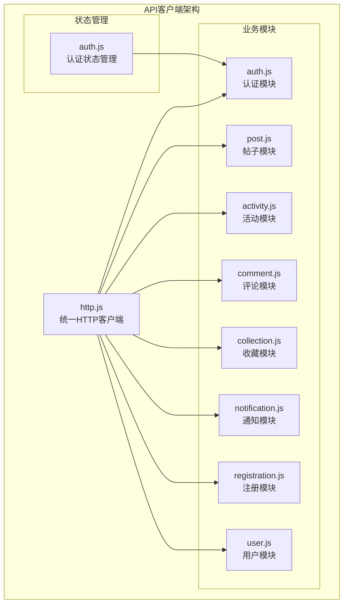
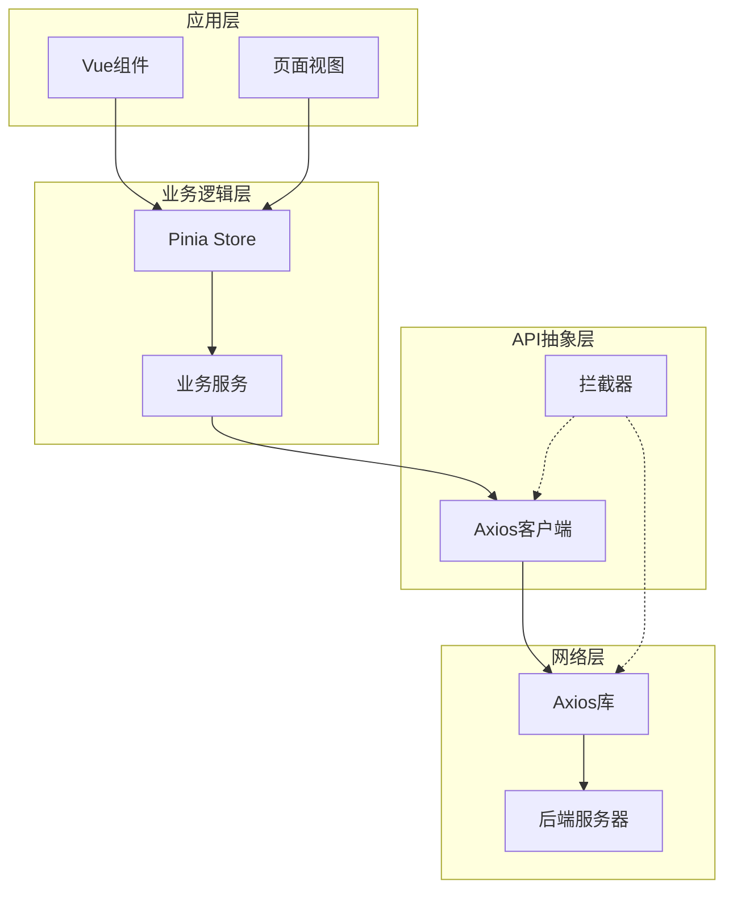
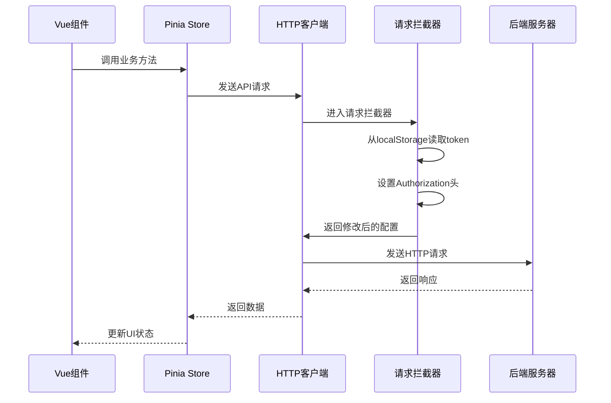
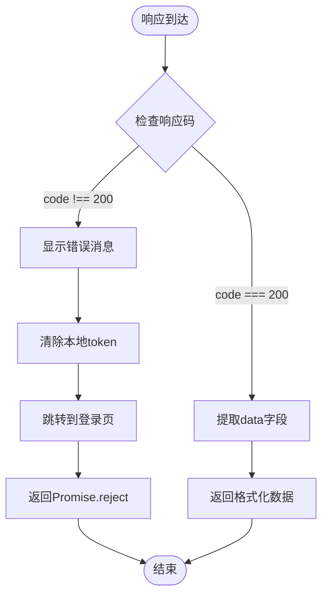
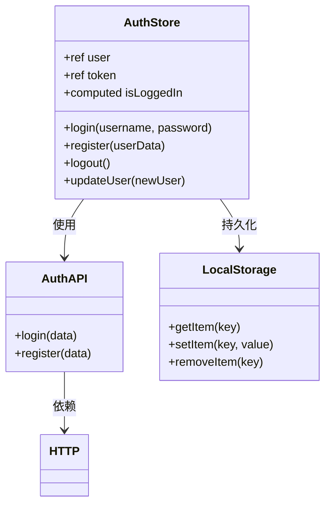
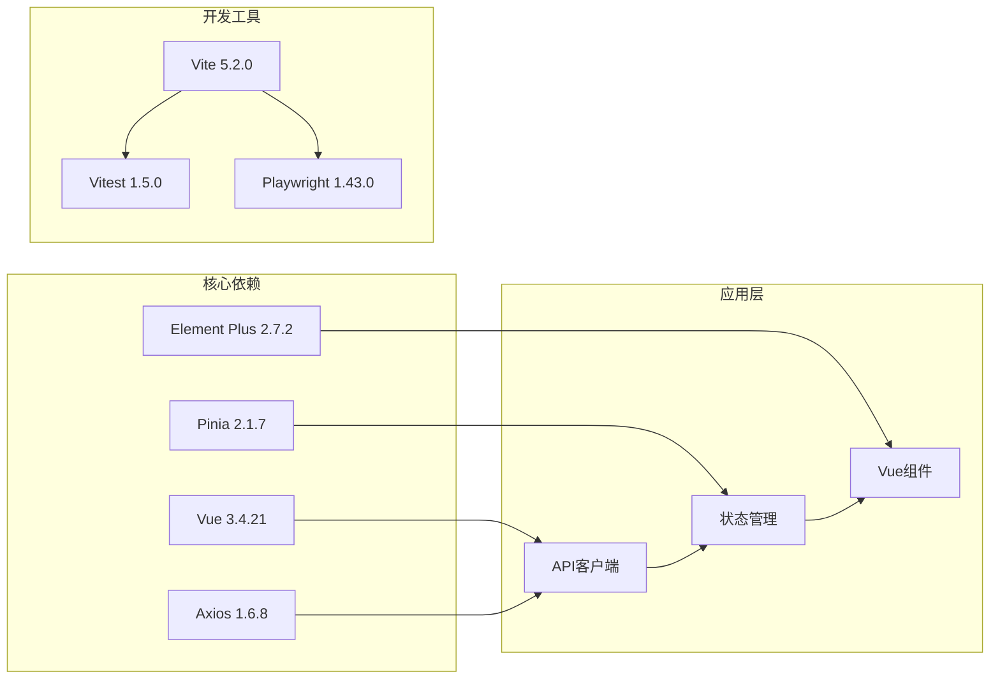
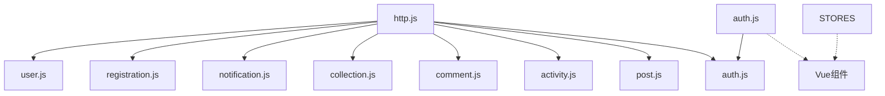
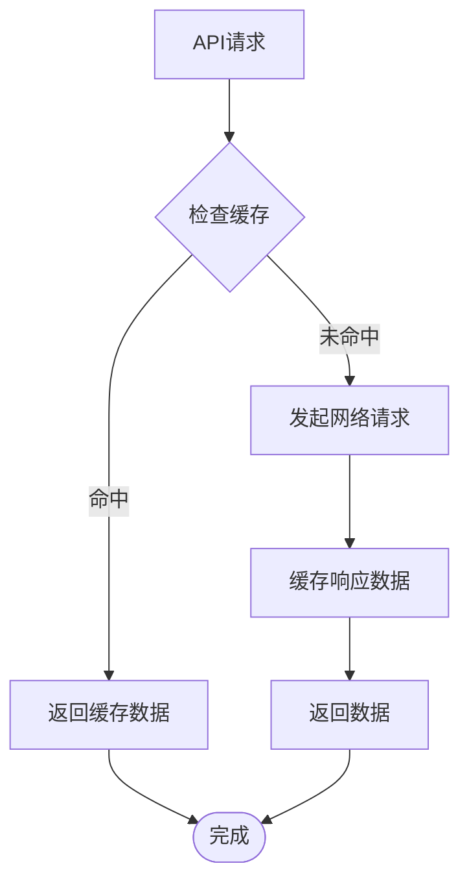

# API客户端设计

<cite>
**本文档引用的文件**
- [http.js](file://campus-forum-frontend/src/api/http.js)
- [auth.js](file://campus-forum-frontend/src/api/auth.js)
- [post.js](file://campus-forum-frontend/src/api/post.js)
- [activity.js](file://campus-forum-frontend/src/api/activity.js)
- [comment.js](file://campus-forum-frontend/src/api/comment.js)
- [collection.js](file://campus-forum-frontend/src/api/collection.js)
- [notification.js](file://campus-forum-frontend/src/api/notification.js)
- [registration.js](file://campus-forum-frontend/src/api/registration.js)
- [user.js](file://campus-forum-frontend/src/api/user.js)
- [auth.js](file://campus-forum-frontend/src/stores/auth.js)
- [package.json](file://campus-forum-frontend/package.json)
- [vitest.config.js](file://campus-forum-frontend/vitest.config.js)
- [auth.test.js](file://campus-forum-frontend/tests/unit/stores/auth.test.js)
- [playwright.config.js](file://campus-forum-frontend/playwright.config.js)
</cite>

## 目录
1. [简介](#简介)
2. [项目结构](#项目结构)
3. [核心组件](#核心组件)
4. [架构概览](#架构概览)
5. [详细组件分析](#详细组件分析)
6. [依赖分析](#依赖分析)
7. [性能考虑](#性能考虑)
8. [故障排除指南](#故障排除指南)
9. [结论](#结论)
10. [附录](#附录)

## 简介

本设计文档详细介绍了PBL项目前端API客户端的架构设计与实现策略。该API客户端基于Axios构建，采用模块化设计模式，实现了统一的HTTP请求封装、认证令牌管理、错误处理机制以及业务接口的清晰分层。

系统采用Vue 3 + Pinia的状态管理模式，通过Axios拦截器实现请求的统一处理，包括认证令牌的自动注入、响应数据的格式化以及异常情况的统一处理。所有业务接口按照功能模块进行组织，确保代码的可维护性和可扩展性。

## 项目结构

前端API客户端采用模块化文件组织方式，每个业务领域对应一个独立的API模块文件，所有模块都基于统一的HTTP客户端实例进行封装。

**图表来源**
- [http.js:1-41](file://campus-forum-frontend/src/api/http.js#L1-L41)
- [auth.js:1-4](file://campus-forum-frontend/src/api/auth.js#L1-L4)
- [post.js:1-7](file://campus-forum-frontend/src/api/post.js#L1-L7)

**章节来源**
- [http.js:1-41](file://campus-forum-frontend/src/api/http.js#L1-L41)
- [auth.js:1-4](file://campus-forum-frontend/src/api/auth.js#L1-L4)
- [post.js:1-7](file://campus-forum-frontend/src/api/post.js#L1-L7)

## 核心组件

### 统一HTTP客户端

HTTP客户端是整个API系统的基础设施，负责：
- 基础配置：设置基础URL和超时时间
- 请求拦截：自动添加认证令牌
- 响应拦截：统一错误处理和数据格式化
- 错误处理：401认证失败的自动登出机制

### 认证状态管理

使用Pinia实现响应式状态管理，包含：
- 用户信息存储（localStorage持久化）
- 登录状态追踪
- 用户操作方法（登录、注册、登出、更新用户信息）

### 业务接口模块

系统按功能域划分了8个主要业务模块：
- **认证模块**：用户登录、注册
- **帖子模块**：帖子列表、详情、创建、删除、点赞
- **活动模块**：活动管理、推荐算法
- **评论模块**：评论操作
- **收藏模块**：收藏管理
- **通知模块**：消息通知
- **注册模块**：活动报名管理
- **用户模块**：用户资料管理

**章节来源**
- [http.js:1-41](file://campus-forum-frontend/src/api/http.js#L1-L41)
- [auth.js:1-37](file://campus-forum-frontend/src/stores/auth.js#L1-L37)

## 架构概览

API客户端采用分层架构设计，确保各层职责清晰分离：

**图表来源**
- [http.js:1-41](file://campus-forum-frontend/src/api/http.js#L1-L41)
- [auth.js:1-37](file://campus-forum-frontend/src/stores/auth.js#L1-L37)

## 详细组件分析

### HTTP客户端核心实现

HTTP客户端基于Axios创建，具备以下关键特性：

#### 配置策略
- **基础URL**：设置为 `/api`，便于代理转发到后端服务
- **超时控制**：15秒超时，平衡用户体验和资源占用
- **请求头管理**：自动处理Content-Type和Authorization头

#### 请求拦截器机制

**图表来源**
- [http.js:9-16](file://campus-forum-frontend/src/api/http.js#L9-L16)

#### 响应拦截器机制

**图表来源**
- [http.js:18-38](file://campus-fororum-frontend/src/api/http.js#L18-L38)

**章节来源**
- [http.js:1-41](file://campus-forum-frontend/src/api/http.js#L1-L41)

### 认证模块设计

认证模块提供用户身份验证的核心功能：

#### 接口定义
- `login(username, password)`：用户登录
- `register(userData)`：用户注册

#### 状态管理集成

**图表来源**
- [auth.js:1-37](file://campus-forum-frontend/src/stores/auth.js#L1-L37)
- [auth.js:1-4](file://campus-forum-frontend/src/api/auth.js#L1-L4)

**章节来源**
- [auth.js:1-4](file://campus-forum-frontend/src/api/auth.js#L1-L4)
- [auth.js:1-37](file://campus-forum-frontend/src/stores/auth.js#L1-L37)

### 帖子模块设计

帖子模块提供完整的帖子管理功能：

#### 核心接口
- `getPosts(params)`：获取帖子列表
- `getPost(id)`：获取单个帖子详情
- `createPost(data)`：创建新帖子
- `deletePost(id)`：删除帖子
- `likePost(id)`：点赞帖子

#### 参数标准化处理
所有接口遵循统一的参数传递规范：
- 列表查询使用 `params` 对象传递查询条件
- 路径参数使用URL模板语法
- 请求体数据直接传递对象

**章节来源**
- [post.js:1-7](file://campus-forum-frontend/src/api/post.js#L1-L7)

### 活动模块设计

活动模块专注于校园活动的管理：

#### 核心接口
- `getActivities(params)`：获取活动列表
- `getActivity(id)`：获取活动详情
- `createActivity(data)`：创建活动
- `updateActivity(id, data)`：更新活动
- `deleteActivity(id)`：删除活动
- `likeActivity(id)`：点赞活动
- `getRecommend()`：获取推荐活动

#### 业务特色
- 支持活动推荐算法
- 完整的CRUD操作支持
- 点赞功能集成

**章节来源**
- [activity.js:1-9](file://campus-forum-frontend/src/api/activity.js#L1-L9)

### 其他业务模块

#### 评论模块
- 评论的增删查操作
- 评论点赞功能

#### 收藏模块  
- 收藏状态切换
- 我的收藏查询
- 收藏状态检查
- 取消收藏操作

#### 通知模块
- 通知列表查询
- 未读数量统计
- 批量已读标记
- 单条通知已读

#### 注册模块
- 活动报名
- 报名取消
- 我的报名查询
- 活动报名统计
- 报名审核

#### 用户模块
- 用户信息查询
- 个人资料更新
- 关注/取消关注
- 粉丝列表查询
- 关注列表查询
- 是否关注检查

**章节来源**
- [comment.js:1-6](file://campus-forum-frontend/src/api/comment.js#L1-L6)
- [collection.js:1-6](file://campus-forum-frontend/src/api/collection.js#L1-L6)
- [notification.js:1-6](file://campus-forum-frontend/src/api/notification.js#L1-L6)
- [registration.js:1-7](file://campus-forum-frontend/src/api/registration.js#L1-L7)
- [user.js:1-9](file://campus-forum-frontend/src/api/user.js#L1-L9)

## 依赖分析

### 外部依赖关系

**图表来源**
- [package.json:13-36](file://campus-forum-frontend/package.json#L13-L36)

### 内部模块依赖

**图表来源**
- [http.js:1-41](file://campus-forum-frontend/src/api/http.js#L1-L41)
- [auth.js:1-37](file://campus-forum-frontend/src/stores/auth.js#L1-L37)

**章节来源**
- [package.json:13-36](file://campus-forum-frontend/package.json#L13-L36)

## 性能考虑

### 请求优化策略

1. **超时控制**：15秒超时设置平衡了响应速度和网络稳定性
2. **请求去重**：可通过在组件中实现请求队列避免重复请求
3. **缓存策略**：对于静态数据可考虑实现简单的内存缓存
4. **批量请求**：对于相关联的数据可考虑批量获取减少请求数量

### 错误处理优化

1. **网络错误分类**：区分网络超时、连接失败、业务错误
2. **重试机制**：对临时性错误实现指数退避重试
3. **降级策略**：在网络异常时提供基本功能降级

### 缓存策略建议

## 故障排除指南

### 常见问题诊断

#### 认证相关问题
- **401错误**：检查localStorage中的token是否过期或被清除
- **自动登出**：确认后端JWT令牌的有效期设置
- **登录状态不同步**：检查Pinia store与localStorage的同步机制

#### 网络请求问题
- **超时错误**：检查网络连接和后端服务状态
- **跨域问题**：确认CORS配置正确
- **请求失败**：查看具体的错误响应码和消息

#### 数据格式问题
- **响应格式不一致**：确认后端API的统一响应格式
- **参数传递错误**：检查请求参数的类型和格式

**章节来源**
- [http.js:28-38](file://campus-forum-frontend/src/api/http.js#L28-L38)

## 结论

PBL项目前端API客户端采用了现代化的架构设计，通过模块化的方式实现了清晰的业务分离和统一的HTTP处理机制。系统具备以下优势：

1. **统一性**：所有API请求通过统一的HTTP客户端处理，确保一致的错误处理和认证机制
2. **可维护性**：按业务模块组织的API文件结构清晰，便于维护和扩展
3. **可靠性**：完善的错误处理和状态管理机制确保了系统的稳定性
4. **可测试性**：良好的模块化设计便于单元测试和集成测试

未来可以考虑的改进方向包括：实现更完善的缓存策略、增加请求重试机制、优化错误提示信息等。

## 附录

### API调用最佳实践

1. **错误处理**：始终在调用API后处理可能的错误情况
2. **状态管理**：使用Pinia store管理API相关的状态
3. **参数验证**：在发送请求前验证参数的有效性
4. **加载状态**：为长耗时的API调用提供加载指示器

### 测试策略

1. **单元测试**：使用Vitest测试API模块和store逻辑
2. **端到端测试**：使用Playwright测试完整的用户流程
3. **Mock策略**：合理使用mock模拟API响应
4. **覆盖率**：确保关键业务逻辑有足够的测试覆盖

### 接口文档生成

建议使用工具自动生成API文档，包括：
- 接口签名和参数说明
- 请求示例和响应格式
- 错误码和异常处理
- 版本变更记录