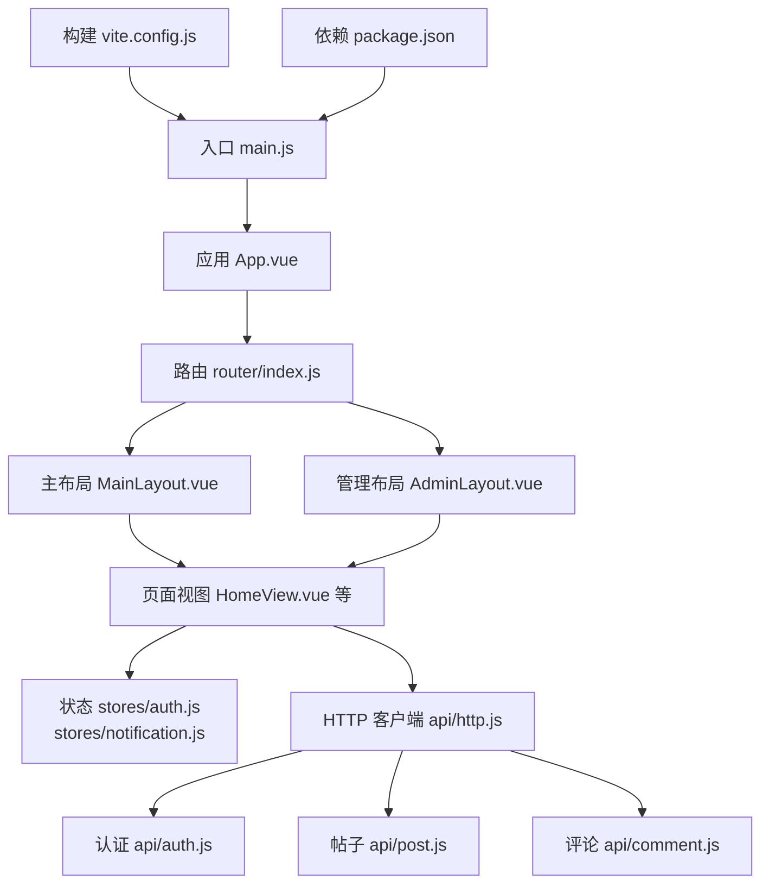
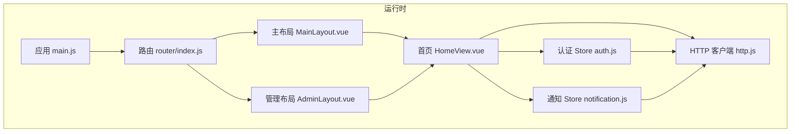
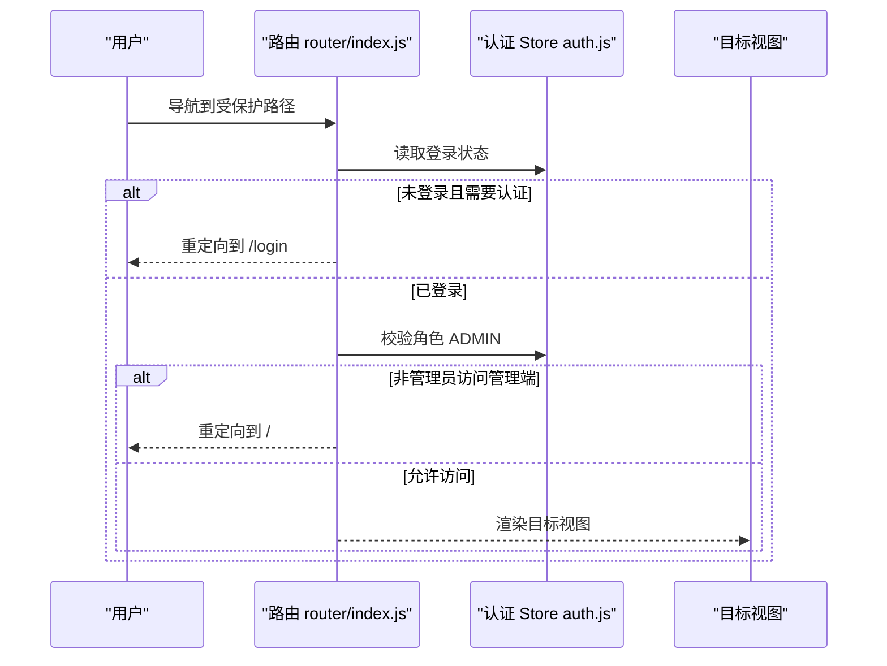
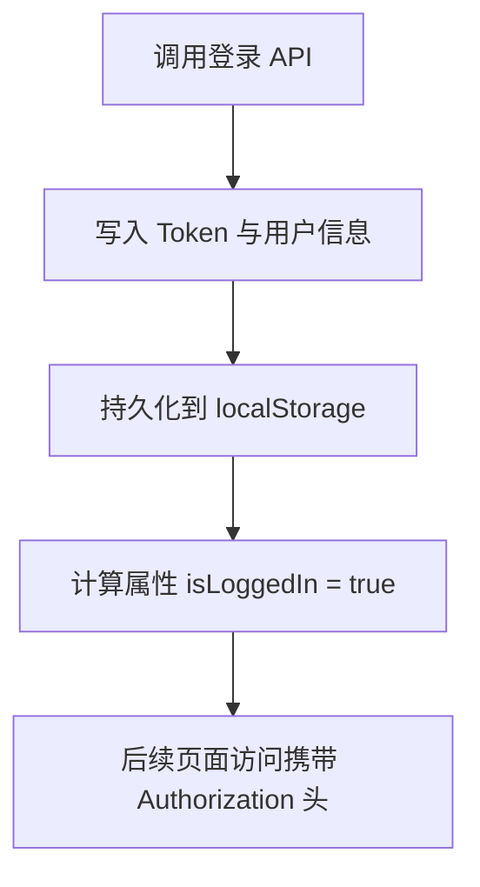
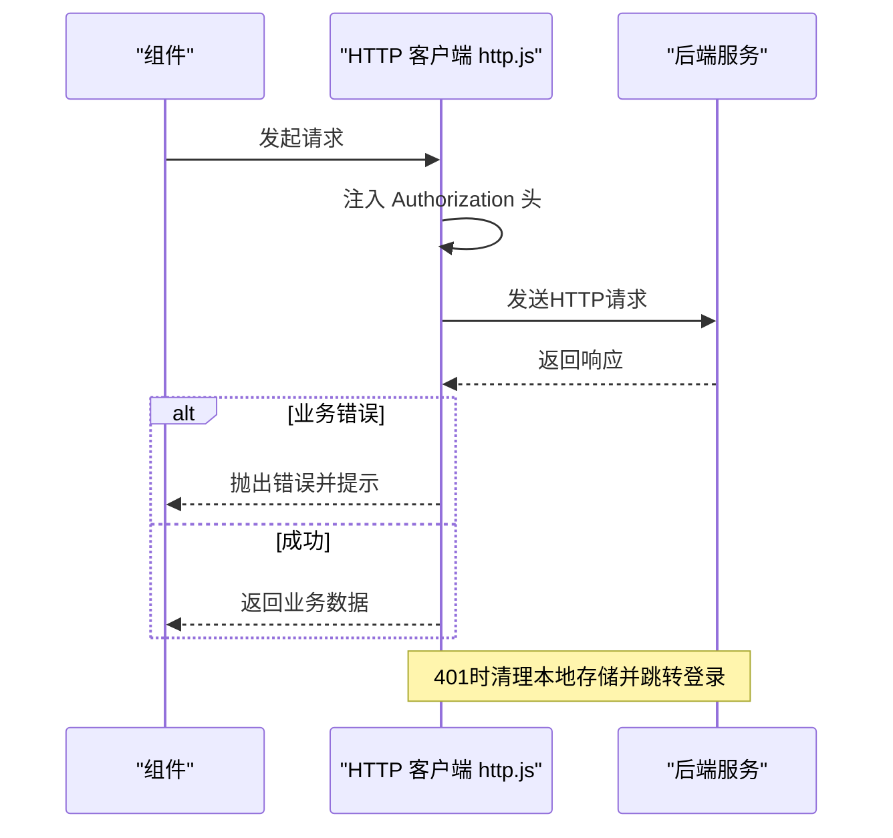
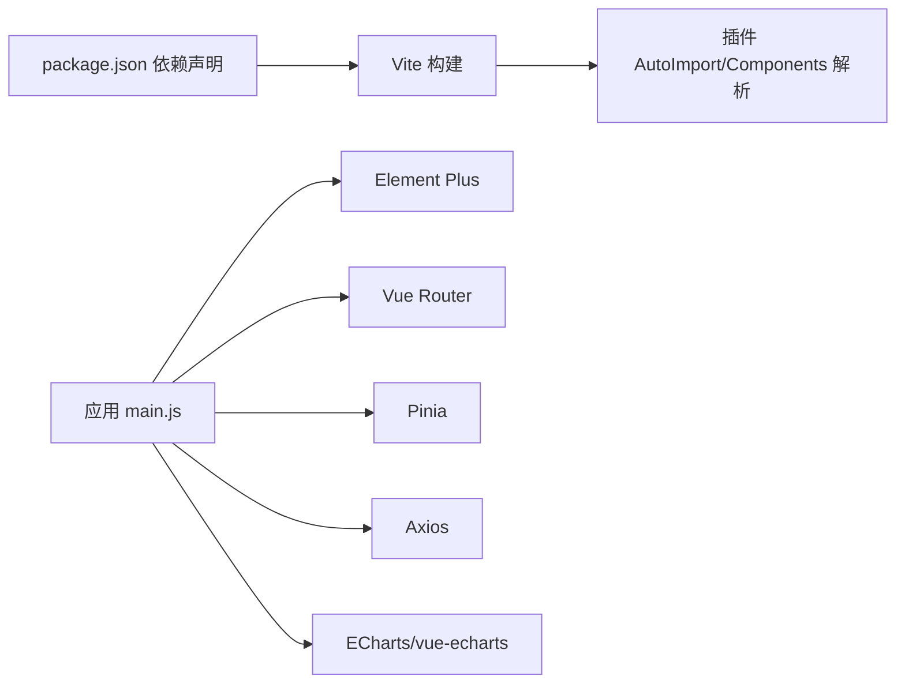

# 前端架构设计

<cite>
**本文档引用的文件**
- [package.json](file://campus-forum-frontend/package.json)
- [vite.config.js](file://campus-forum-frontend/vite.config.js)
- [main.js](file://campus-forum-frontend/src/main.js)
- [App.vue](file://campus-forum-frontend/src/App.vue)
- [router/index.js](file://campus-forum-frontend/src/router/index.js)
- [stores/auth.js](file://campus-forum-frontend/src/stores/auth.js)
- [stores/notification.js](file://campus-forum-frontend/src/stores/notification.js)
- [layouts/MainLayout.vue](file://campus-forum-frontend/src/layouts/MainLayout.vue)
- [layouts/AdminLayout.vue](file://campus-forum-frontend/src/layouts/AdminLayout.vue)
- [api/http.js](file://campus-forum-frontend/src/api/http.js)
- [api/auth.js](file://campus-forum-frontend/src/api/auth.js)
- [api/post.js](file://campus-forum-frontend/src/api/post.js)
- [api/comment.js](file://campus-forum-frontend/src/api/comment.js)
- [views/HomeView.vue](file://campus-forum-frontend/src/views/HomeView.vue)
- [components/charts/BaseChart.vue](file://campus-forum-frontend/src/components/charts/BaseChart.vue)
</cite>

## 目录
1. [引言](#引言)
2. [项目结构](#项目结构)
3. [核心组件](#核心组件)
4. [架构总览](#架构总览)
5. [详细组件分析](#详细组件分析)
6. [依赖关系分析](#依赖关系分析)
7. [性能考虑](#性能考虑)
8. [故障排查指南](#故障排查指南)
9. [结论](#结论)
10. [附录](#附录)

## 引言
本设计文档面向PBL项目的前端架构，围绕基于Vue.js 3的单页应用（SPA）进行系统化梳理。重点覆盖项目结构、组件层次、路由配置、状态管理、构建配置、HTTP客户端封装与错误处理、Element Plus组件库使用策略、前后端交互模式、响应式布局与组件通信、性能优化与代码分割、以及组件开发规范与最佳实践。

## 项目结构
前端采用Vite作为构建工具，使用Vue 3 Composition API风格，Pinia进行状态管理，Element Plus提供UI组件库，Axios封装HTTP客户端，并通过路由懒加载实现代码分割。项目目录组织遵循“功能域+分层”的混合方式：views按页面视图划分，layouts按布局划分，stores按领域状态划分，api按业务模块划分，components提供可复用组件。

图表来源
- [main.js:1-22](file://campus-forum-frontend/src/main.js#L1-L22)
- [App.vue:1-7](file://campus-forum-frontend/src/App.vue#L1-L7)
- [router/index.js:1-82](file://campus-forum-frontend/src/router/index.js#L1-L82)
- [layouts/MainLayout.vue:1-122](file://campus-forum-frontend/src/layouts/MainLayout.vue#L1-L122)
- [layouts/AdminLayout.vue:1-59](file://campus-forum-frontend/src/layouts/AdminLayout.vue#L1-L59)
- [stores/auth.js:1-37](file://campus-forum-frontend/src/stores/auth.js#L1-L37)
- [stores/notification.js:1-31](file://campus-forum-frontend/src/stores/notification.js#L1-L31)
- [api/http.js:1-41](file://campus-forum-frontend/src/api/http.js#L1-L41)
- [api/auth.js:1-4](file://campus-forum-frontend/src/api/auth.js#L1-L4)
- [api/post.js:1-7](file://campus-forum-frontend/src/api/post.js#L1-L7)
- [api/comment.js:1-6](file://campus-forum-frontend/src/api/comment.js#L1-L6)
- [vite.config.js:1-27](file://campus-forum-frontend/vite.config.js#L1-L27)
- [package.json:1-37](file://campus-forum-frontend/package.json#L1-L37)

章节来源
- [package.json:1-37](file://campus-forum-frontend/package.json#L1-L37)
- [vite.config.js:1-27](file://campus-forum-frontend/vite.config.js#L1-L27)
- [main.js:1-22](file://campus-forum-frontend/src/main.js#L1-L22)
- [App.vue:1-7](file://campus-forum-frontend/src/App.vue#L1-L7)

## 核心组件
- 应用入口与插件注册：在入口中完成Pinia、Vue Router、Element Plus的安装与全局图标注册，挂载应用。
- 路由系统：定义多级嵌套路由，支持游客/认证/管理员权限控制，结合滚动行为与懒加载。
- 状态管理：Pinia Store按领域拆分，认证状态与通知状态独立管理，持久化到localStorage。
- HTTP客户端：Axios实例封装，统一设置基础路径、超时、请求头携带Token、响应拦截统一错误处理。
- 布局系统：MainLayout提供前台通用头部与内容区；AdminLayout提供管理后台侧边菜单与头部。
- 可复用组件：BaseChart封装ECharts初始化、选项监听与销毁，适配响应式尺寸。

章节来源
- [main.js:1-22](file://campus-forum-frontend/src/main.js#L1-L22)
- [router/index.js:1-82](file://campus-forum-frontend/src/router/index.js#L1-L82)
- [stores/auth.js:1-37](file://campus-forum-frontend/src/stores/auth.js#L1-L37)
- [stores/notification.js:1-31](file://campus-forum-frontend/src/stores/notification.js#L1-L31)
- [api/http.js:1-41](file://campus-forum-frontend/src/api/http.js#L1-L41)
- [layouts/MainLayout.vue:1-122](file://campus-forum-frontend/src/layouts/MainLayout.vue#L1-L122)
- [layouts/AdminLayout.vue:1-59](file://campus-forum-frontend/src/layouts/AdminLayout.vue#L1-L59)
- [components/charts/BaseChart.vue:1-31](file://campus-forum-frontend/src/components/charts/BaseChart.vue#L1-L31)

## 架构总览
前端采用“入口应用 -> 路由 -> 布局/视图 -> 状态/服务”的分层架构。Element Plus提供UI能力，Axios负责HTTP通信，Pinia集中管理跨组件共享的状态。路由守卫在进入受保护页面前校验登录态与角色权限。

图表来源
- [main.js:1-22](file://campus-forum-frontend/src/main.js#L1-L22)
- [router/index.js:1-82](file://campus-forum-frontend/src/router/index.js#L1-L82)
- [layouts/MainLayout.vue:1-122](file://campus-forum-frontend/src/layouts/MainLayout.vue#L1-L122)
- [layouts/AdminLayout.vue:1-59](file://campus-forum-frontend/src/layouts/AdminLayout.vue#L1-L59)
- [views/HomeView.vue:1-135](file://campus-forum-frontend/src/views/HomeView.vue#L1-L135)
- [stores/auth.js:1-37](file://campus-forum-frontend/src/stores/auth.js#L1-L37)
- [stores/notification.js:1-31](file://campus-forum-frontend/src/stores/notification.js#L1-L31)
- [api/http.js:1-41](file://campus-forum-frontend/src/api/http.js#L1-L41)

## 详细组件分析

### 路由与守卫机制
- 路由结构：以MainLayout与AdminLayout为容器，内部children承载具体页面；支持首页、发现、版块、帖子、活动、用户、消息、聊天、AI助手等页面；管理端提供仪表盘、用户、帖子、活动、版块、公告等子页面。
- 权限控制：通过meta字段标记guest/auth/admin，beforeEach统一校验登录态、访客限制与管理员角色；未满足条件重定向至目标页面或根路径。
- 懒加载：页面组件通过动态导入实现按需加载，配合路由滚动行为保证切换体验。

图表来源
- [router/index.js:66-79](file://campus-forum-frontend/src/router/index.js#L66-L79)
- [stores/auth.js:6-9](file://campus-forum-frontend/src/stores/auth.js#L6-L9)

章节来源
- [router/index.js:1-82](file://campus-forum-frontend/src/router/index.js#L1-L82)

### Pinia状态管理设计
- 认证状态（auth.js）
  - 数据：用户信息、Token、登录态计算属性。
  - 行为：登录、注册、登出、更新用户信息；持久化到localStorage。
- 通知状态（notification.js）
  - 数据：未读数、通知列表。
  - 行为：拉取未读数、分页拉取通知、一键已读、未读计数自增。

图表来源
- [stores/auth.js:11-28](file://campus-forum-frontend/src/stores/auth.js#L11-L28)
- [api/http.js:10-16](file://campus-forum-frontend/src/api/http.js#L10-L16)

章节来源
- [stores/auth.js:1-37](file://campus-forum-frontend/src/stores/auth.js#L1-L37)
- [stores/notification.js:1-31](file://campus-forum-frontend/src/stores/notification.js#L1-L31)

### HTTP客户端与错误处理
- 基础配置：baseURL指向代理前缀/api，统一超时时间。
- 请求拦截：从localStorage读取Token并注入Authorization头。
- 响应拦截：对业务code非200统一提示错误；对401强制清理本地存储并跳转登录；其他错误统一提示网络错误。

图表来源
- [api/http.js:4-41](file://campus-forum-frontend/src/api/http.js#L4-L41)

章节来源
- [api/http.js:1-41](file://campus-forum-frontend/src/api/http.js#L1-L41)

### Element Plus组件库使用策略
- 全量引入样式与按需自动导入图标，减少打包体积。
- 全局注册Element Plus并设置默认尺寸与zIndex。
- 在布局组件中使用容器、菜单、按钮、头像、下拉、徽章等组件，实现导航、通知提醒与用户操作。

章节来源
- [main.js:3-19](file://campus-forum-frontend/src/main.js#L3-L19)
- [layouts/MainLayout.vue:1-122](file://campus-forum-frontend/src/layouts/MainLayout.vue#L1-L122)
- [layouts/AdminLayout.vue:1-59](file://campus-forum-frontend/src/layouts/AdminLayout.vue#L1-L59)

### 页面布局与组件通信
- MainLayout：顶部导航、通知徽章、用户下拉菜单；在挂载时根据登录态拉取未读数并建立WebSocket连接；通过路由跳转实现页面导航。
- AdminLayout：左侧菜单导航至管理端各页面，右上角显示欢迎语与退出按钮。
- 组件间通信：通过Pinia Store共享状态；通过路由参数传递如版块ID、帖子ID；通过事件与props传递简单数据。

章节来源
- [layouts/MainLayout.vue:51-82](file://campus-forum-frontend/src/layouts/MainLayout.vue#L51-L82)
- [layouts/AdminLayout.vue:34-44](file://campus-forum-frontend/src/layouts/AdminLayout.vue#L34-L44)

### 响应式设计与布局架构
- 使用Element Plus栅格系统（el-row/el-col）实现响应式布局，卡片与标签组合提升信息密度。
- 布局采用容器化设计，头部固定吸顶，主内容区背景与内边距统一风格。
- 图表组件BaseChart通过ref与window.resize事件实现自适应宽高。

章节来源
- [views/HomeView.vue:1-135](file://campus-forum-frontend/src/views/HomeView.vue#L1-L135)
- [components/charts/BaseChart.vue:1-31](file://campus-forum-frontend/src/components/charts/BaseChart.vue#L1-L31)
- [layouts/MainLayout.vue:84-121](file://campus-forum-frontend/src/layouts/MainLayout.vue#L84-L121)
- [layouts/AdminLayout.vue:46-58](file://campus-forum-frontend/src/layouts/AdminLayout.vue#L46-L58)

### 前端与后端API交互模式
- 页面在挂载阶段并发拉取推荐活动、最新帖子、版块列表与公告；使用Promise.all提升首屏性能。
- API模块按业务拆分（认证、帖子、评论），每个模块导出函数，内部统一通过http.js发起请求。
- 首页示例展示了并发请求、数据映射与空状态处理。

章节来源
- [views/HomeView.vue:98-112](file://campus-forum-frontend/src/views/HomeView.vue#L98-L112)
- [api/auth.js:1-4](file://campus-forum-frontend/src/api/auth.js#L1-L4)
- [api/post.js:1-7](file://campus-forum-frontend/src/api/post.js#L1-L7)
- [api/comment.js:1-6](file://campus-forum-frontend/src/api/comment.js#L1-L6)

## 依赖关系分析
- 构建与开发：Vite提供开发服务器与代理，自动导入Element Plus组件与图标，简化按需引入。
- 运行时依赖：Vue 3、Vue Router、Pinia、Axios、Element Plus及其图标、ECharts与编辑器相关依赖。
- 开发依赖：Vitest、Playwright、自动导入与组件解析插件。

图表来源
- [package.json:13-26](file://campus-forum-frontend/package.json#L13-L26)
- [vite.config.js:3-12](file://campus-forum-frontend/vite.config.js#L3-L12)
- [main.js:1-22](file://campus-forum-frontend/src/main.js#L1-L22)

章节来源
- [package.json:1-37](file://campus-forum-frontend/package.json#L1-L37)
- [vite.config.js:1-27](file://campus-forum-frontend/vite.config.js#L1-L27)

## 性能考虑
- 代码分割与懒加载：路由级动态导入页面组件，减少首屏包体。
- 并发请求：首页使用Promise.all并发拉取多个接口，缩短首屏等待时间。
- 组件自适应：BaseChart监听窗口resize，避免图表渲染异常。
- 构建优化：Vite默认启用Tree Shaking；Element Plus按需导入减少冗余CSS与组件。
- 缓存策略：Pinia状态与localStorage持久化，减少重复请求与登录态丢失风险。

章节来源
- [router/index.js:10-38](file://campus-forum-frontend/src/router/index.js#L10-L38)
- [views/HomeView.vue:100-104](file://campus-forum-frontend/src/views/HomeView.vue#L100-L104)
- [components/charts/BaseChart.vue:18-29](file://campus-forum-frontend/src/components/charts/BaseChart.vue#L18-L29)
- [vite.config.js:3-12](file://campus-forum-frontend/vite.config.js#L3-L12)

## 故障排查指南
- 登录态失效：401响应触发清理本地存储并跳转登录，检查Token是否正确写入与携带。
- 请求失败：响应拦截器统一提示错误信息，确认后端返回的业务码与message字段。
- 路由跳转异常：检查路由meta字段与守卫逻辑，确保auth/admin/guest标志正确。
- WebSocket连接：登录成功后建立通知WebSocket，确认后端WebSocket地址与Token拼接正确。
- 构建代理：开发环境通过Vite代理/api到后端8080端口，确认代理配置与跨域设置。

章节来源
- [api/http.js:18-38](file://campus-forum-frontend/src/api/http.js#L18-L38)
- [router/index.js:66-79](file://campus-forum-frontend/src/router/index.js#L66-L79)
- [layouts/MainLayout.vue:61-68](file://campus-forum-frontend/src/layouts/MainLayout.vue#L61-L68)
- [vite.config.js:17-25](file://campus-forum-frontend/vite.config.js#L17-L25)

## 结论
该前端架构以Vue 3为核心，结合Pinia、Element Plus与Axios形成清晰的分层与职责边界；通过路由守卫与状态持久化保障安全与体验；借助Vite与按需导入实现高效构建与良好性能。建议持续完善单元测试与端到端测试，补充TypeScript类型定义，进一步提升可维护性与可扩展性。

## 附录
- 组件开发规范与最佳实践
  - 使用Composition API与<script setup>语法，保持单一职责与可复用性。
  - 将UI与业务逻辑分离，通过Props与Events进行组件通信。
  - 对外暴露明确的Props与Emits，内部使用局部状态与计算属性。
  - 在布局组件中统一处理导航与用户态，避免在页面组件重复实现。
  - 使用Pinia集中管理跨组件共享状态，避免深层props传递。
  - API模块化拆分，统一通过http.js发送请求，便于拦截与错误处理。
  - 首屏性能优先，合理使用懒加载与并发请求，避免阻塞渲染。
  - 响应式设计遵循栅格系统，确保移动端与桌面端一致体验。
  - 测试覆盖：为store与API模块编写单元测试，为关键页面编写端到端测试。