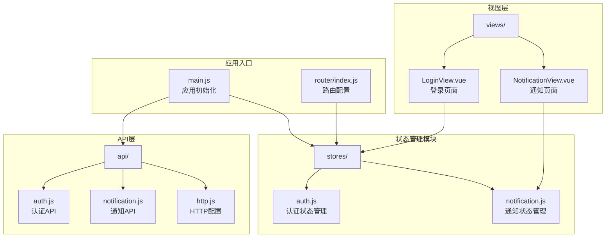
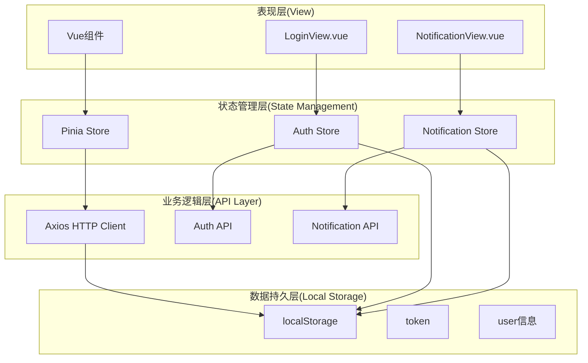
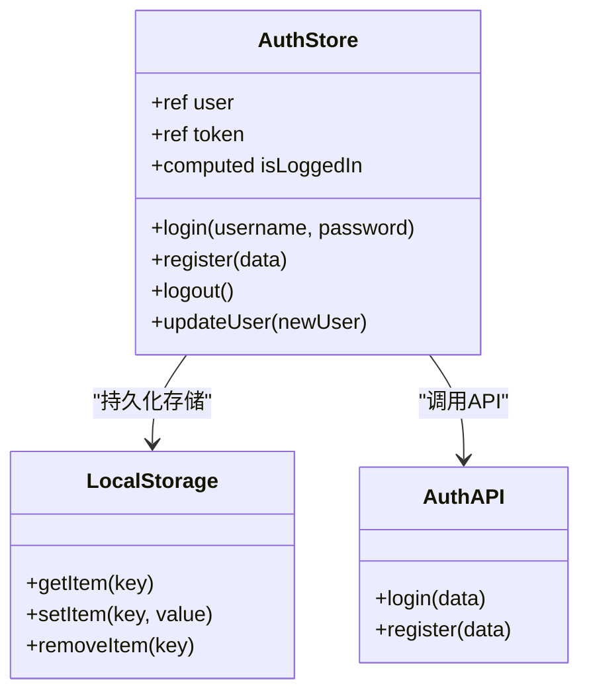
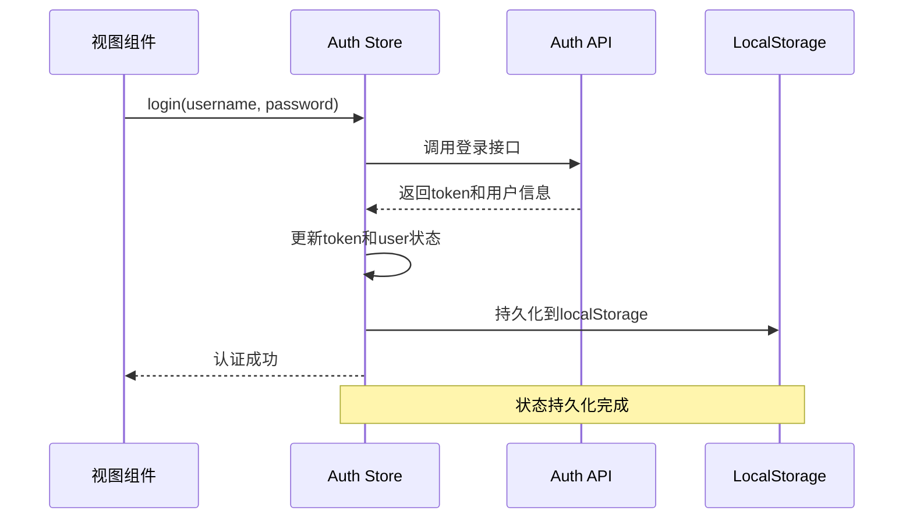
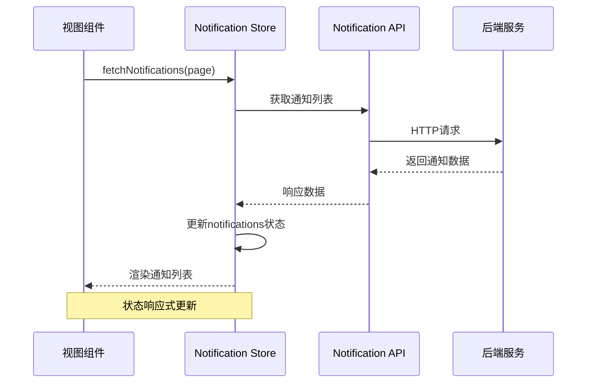
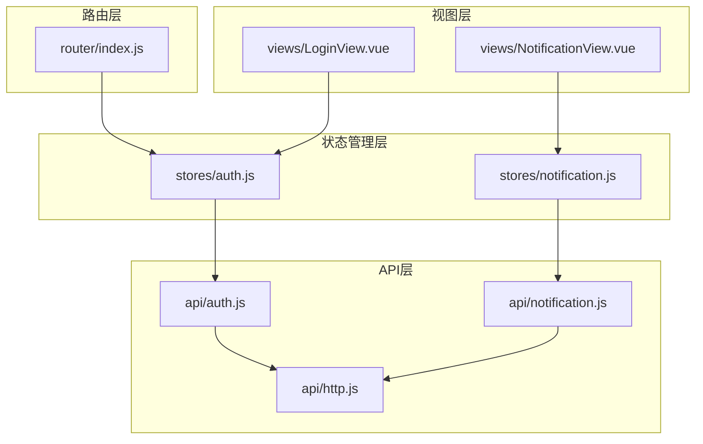

# 状态管理设计

<cite>
**本文档引用的文件**
- [auth.js](file://campus-forum-frontend/src/stores/auth.js)
- [notification.js](file://campus-forum-frontend/src/stores/notification.js)
- [main.js](file://campus-forum-frontend/src/main.js)
- [index.js](file://campus-forum-frontend/src/router/index.js)
- [auth.js](file://campus-forum-frontend/src/api/auth.js)
- [notification.js](file://campus-forum-frontend/src/api/notification.js)
- [http.js](file://campus-forum-frontend/src/api/http.js)
- [auth.test.js](file://campus-forum-frontend/tests/unit/stores/auth.test.js)
- [notification.test.js](file://campus-forum-frontend/tests/unit/stores/notification.test.js)
- [LoginView.vue](file://campus-forum-frontend/src/views/LoginView.vue)
- [NotificationView.vue](file://campus-forum-frontend/src/views/NotificationView.vue)
</cite>

## 目录
1. [引言](#引言)
2. [项目结构](#项目结构)
3. [核心组件](#核心组件)
4. [架构概览](#架构概览)
5. [详细组件分析](#详细组件分析)
6. [依赖关系分析](#依赖关系分析)
7. [性能考虑](#性能考虑)
8. [故障排除指南](#故障排除指南)
9. [结论](#结论)

## 引言

本设计文档针对PBL项目前端的状态管理系统进行全面分析，重点阐述基于Pinia的状态管理模式和架构原则。系统采用现代化的组合式API设计，实现了store的模块化组织和响应式状态管理。本文档详细解析了认证状态管理、通知状态管理以及相关的最佳实践、性能优化和调试技巧。

## 项目结构

前端状态管理采用模块化架构，主要包含以下核心文件：



**图表来源**
- [main.js:1-22](file://campus-forum-frontend/src/main.js#L1-L22)
- [auth.js:1-37](file://campus-forum-frontend/src/stores/auth.js#L1-L37)
- [notification.js:1-31](file://campus-forum-frontend/src/stores/notification.js#L1-L31)

**章节来源**
- [main.js:1-22](file://campus-forum-frontend/src/main.js#L1-L22)
- [auth.js:1-37](file://campus-forum-frontend/src/stores/auth.js#L1-L37)
- [notification.js:1-31](file://campus-forum-frontend/src/stores/notification.js#L1-L31)

## 核心组件

### Pinia集成与初始化

应用通过全局配置启用Pinia状态管理，确保所有组件都能访问状态管理功能：

- 在应用启动时创建Pinia实例
- 提供全局状态访问能力
- 支持组合式API和选项式API两种模式

### Store模块化设计

系统采用模块化store设计，每个store负责特定领域的状态管理：

- **认证store**: 管理用户认证状态、token存储和用户信息维护
- **通知store**: 处理通知状态管理和消息队列处理策略

**章节来源**
- [main.js:17](file://campus-forum-frontend/src/main.js#L17)
- [auth.js:5-36](file://campus-forum-frontend/src/stores/auth.js#L5-L36)
- [notification.js:5-30](file://campus-forum-frontend/src/stores/notification.js#L5-L30)

## 架构概览

系统采用分层架构设计，各层职责明确，耦合度低：



**图表来源**
- [auth.js:1-37](file://campus-forum-frontend/src/stores/auth.js#L1-L37)
- [notification.js:1-31](file://campus-forum-frontend/src/stores/notification.js#L1-L31)
- [http.js:1-41](file://campus-forum-frontend/src/api/http.js#L1-L41)

## 详细组件分析

### 认证状态管理(Auth Store)

#### 设计模式与架构

认证store采用组合式API设计，结合响应式ref和computed实现状态管理：



**图表来源**
- [auth.js:5-36](file://campus-forum-frontend/src/stores/auth.js#L5-L36)

#### 状态结构与生命周期

认证状态包含三个核心属性：
- `user`: 当前登录用户信息（JSON格式）
- `token`: JWT认证令牌
- `isLoggedIn`: 认证状态计算属性

状态持久化策略：
- 自动从localStorage恢复状态
- 操作后实时同步到localStorage
- 登出时清除本地存储

#### 异步操作流程



**图表来源**
- [auth.js:11-17](file://campus-forum-frontend/src/stores/auth.js#L11-L17)
- [auth.js:6-7](file://campus-forum-frontend/src/stores/auth.js#L6-L7)

**章节来源**
- [auth.js:5-36](file://campus-forum-frontend/src/stores/auth.js#L5-L36)
- [auth.test.js:17-35](file://campus-forum-frontend/tests/unit/stores/auth.test.js#L17-L35)

### 通知状态管理(Notification Store)

#### 数据模型与状态管理

通知store专注于通知系统的状态管理：

```mermaid
flowchart TD
A[通知状态初始化] --> B[unreadCount: 0]
A --> C[notifications: []]
D[获取未读数量] --> E[API调用]
E --> F[更新unreadCount]
G[获取通知列表] --> H[API调用]
H --> I[更新notifications数组]
J[标记全部已读] --> K[API调用]
K --> L[unreadCount置零]
L --> M[批量更新isRead状态]
N[增量更新] --> O[unreadCount+1]
```

**图表来源**
- [notification.js:5-30](file://campus-forum-frontend/src/stores/notification.js#L5-L30)

#### 消息队列处理策略

通知系统采用事件驱动的消息队列模式：

- **实时更新**: 通过increment方法实现增量计数
- **批量处理**: markAllRead方法支持批量标记已读
- **分页加载**: fetchNotifications支持分页参数
- **状态同步**: 本地状态与服务器状态保持一致

#### 异步数据流



**图表来源**
- [notification.js:14-17](file://campus-forum-frontend/src/stores/notification.js#L14-L17)
- [notification.js:15](file://campus-forum-frontend/src/stores/notification.js#L15)

**章节来源**
- [notification.js:5-30](file://campus-forum-frontend/src/stores/notification.js#L5-L30)
- [notification.test.js:19-43](file://campus-forum-frontend/tests/unit/stores/notification.test.js#L19-L43)

### HTTP客户端与拦截器

#### 请求拦截器

HTTP客户端配置了智能的请求拦截器，自动处理认证令牌：

- **自动注入**: 从localStorage读取token并添加到Authorization头
- **条件处理**: 仅对需要认证的请求添加令牌
- **统一配置**: 集中管理API基础URL和超时设置

#### 响应拦截器

响应拦截器提供完整的错误处理机制：

- **业务错误**: 检测响应码并显示友好错误信息
- **认证失效**: 自动处理401未授权错误
- **网络异常**: 统一处理各种网络错误情况

**章节来源**
- [http.js:9-38](file://campus-forum-frontend/src/api/http.js#L9-L38)

## 依赖关系分析

### 组件间依赖关系



**图表来源**
- [index.js:2](file://campus-forum-frontend/src/router/index.js#L2)
- [auth.js:3](file://campus-forum-frontend/src/stores/auth.js#L3)
- [notification.js:3](file://campus-forum-frontend/src/stores/notification.js#L3)

### 关键依赖链路

系统的关键依赖关系包括：

1. **路由守卫依赖**: 路由在导航前检查认证状态
2. **组件依赖**: 视图组件直接依赖对应的store
3. **API依赖**: store依赖API模块进行数据交互
4. **HTTP依赖**: API模块依赖HTTP客户端进行网络请求

**章节来源**
- [index.js:67-79](file://campus-forum-frontend/src/router/index.js#L67-L79)
- [LoginView.vue:27](file://campus-forum-frontend/src/views/LoginView.vue#L27)
- [NotificationView.vue:17](file://campus-forum-frontend/src/views/NotificationView.vue#L17)

## 性能考虑

### 状态更新优化

1. **响应式更新**: 使用Vue的响应式系统确保最小化DOM更新
2. **计算属性缓存**: isLoggedIn使用computed避免重复计算
3. **批量更新**: 批量操作时减少不必要的状态变更

### 内存管理

1. **及时清理**: 登出时清除localStorage中的敏感信息
2. **对象冻结**: 用户信息更新时使用展开运算符避免意外修改
3. **内存泄漏防护**: 组件卸载时自动清理相关状态

### 网络性能

1. **请求去重**: 避免重复发起相同的API请求
2. **超时控制**: 设置合理的请求超时时间
3. **错误重试**: 对临时性错误提供重试机制

## 故障排除指南

### 常见问题诊断

#### 认证状态异常

**症状**: 登录后无法访问受保护页面
**排查步骤**:
1. 检查localStorage中token是否正确存储
2. 验证HTTP请求头是否包含Authorization字段
3. 确认后端JWT令牌验证是否正常

#### 通知状态不同步

**症状**: 通知未读数不准确或显示异常
**排查步骤**:
1. 检查API响应数据格式
2. 验证状态更新逻辑
3. 确认本地存储同步机制

#### 路由守卫问题

**症状**: 认证路由无法正确跳转
**排查步骤**:
1. 检查store状态初始化
2. 验证路由元信息配置
3. 确认守卫执行顺序

### 调试技巧

1. **Vue DevTools**: 使用浏览器扩展监控状态变化
2. **日志记录**: 在关键位置添加console.log输出
3. **单元测试**: 编写完整的测试用例覆盖边界情况
4. **断点调试**: 利用浏览器调试器跟踪异步操作

**章节来源**
- [auth.test.js:1-54](file://campus-forum-frontend/tests/unit/stores/auth.test.js#L1-L54)
- [notification.test.js:1-52](file://campus-forum-frontend/tests/unit/stores/notification.test.js#L1-L52)

## 结论

PBL项目的前端状态管理系统展现了现代Vue应用的最佳实践。通过Pinia的模块化设计和组合式API，系统实现了清晰的状态分离和高效的响应式更新。

### 主要优势

1. **模块化架构**: store按功能域划分，职责单一且易于维护
2. **响应式设计**: 利用Vue响应式系统实现自动状态更新
3. **持久化策略**: localStorage提供跨会话状态保持
4. **错误处理**: 完善的错误处理和用户体验保障
5. **测试友好**: 清晰的接口设计便于单元测试

### 改进建议

1. **状态快照**: 考虑实现状态快照功能用于调试
2. **状态迁移**: 添加版本兼容的状态迁移机制
3. **性能监控**: 集成性能指标监控工具
4. **类型安全**: 引入TypeScript增强类型安全性

该状态管理系统为PBL项目提供了坚实的技术基础，支持未来的功能扩展和性能优化需求。