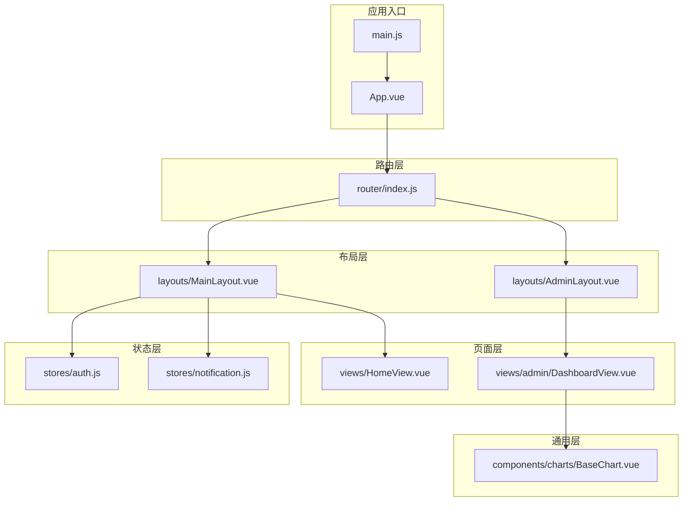
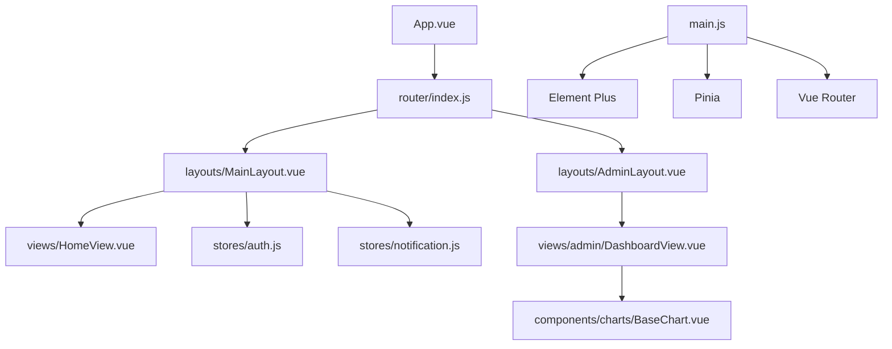
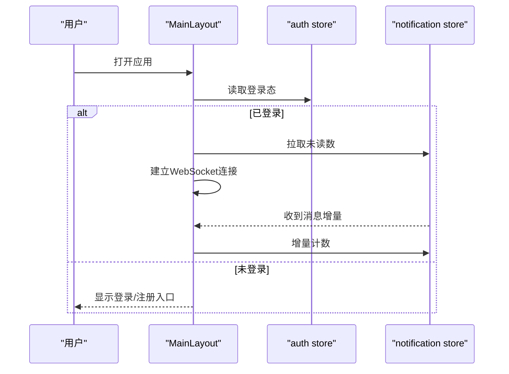
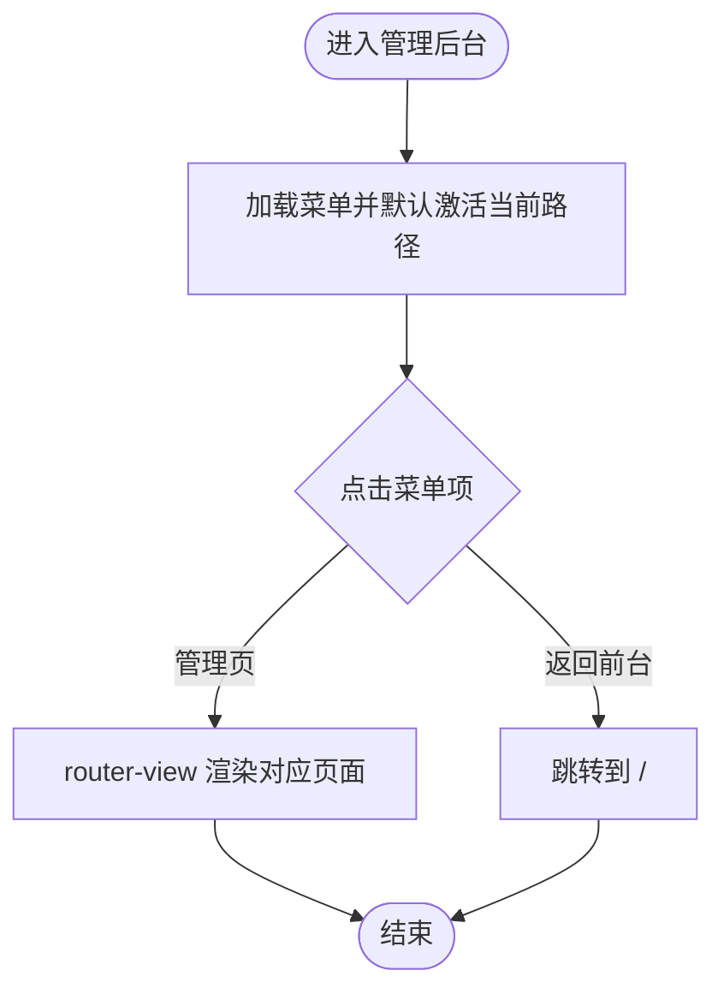
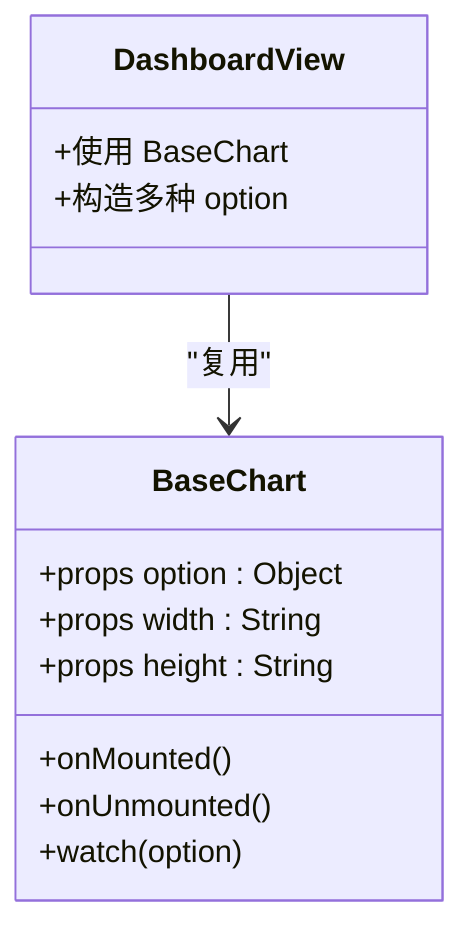
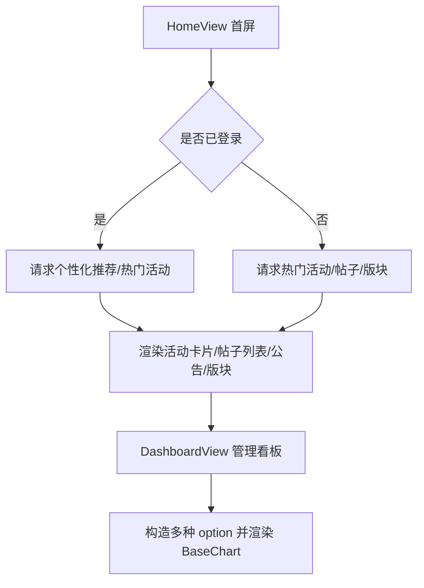
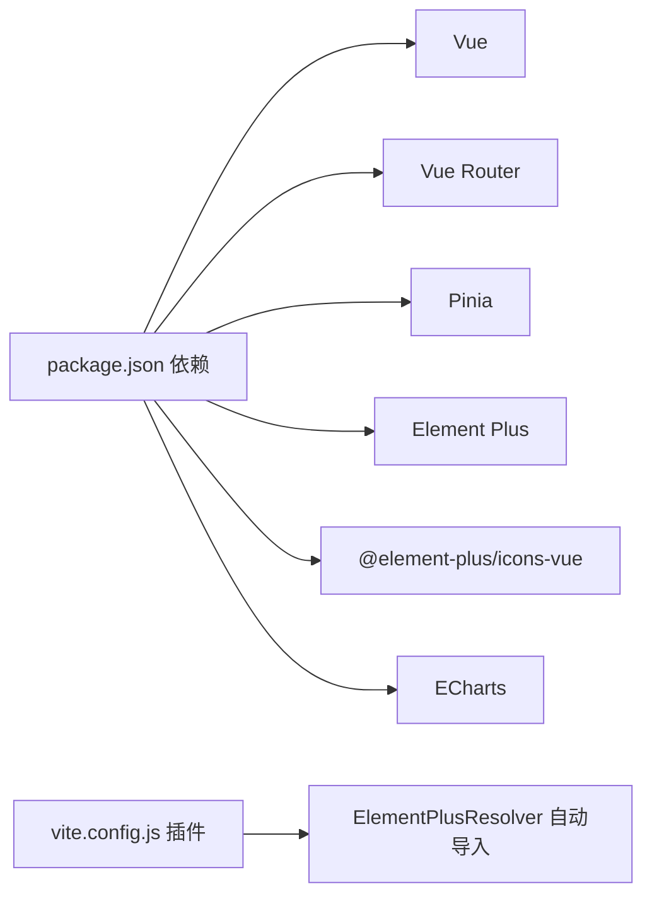

# 组件架构设计

<cite>
**本文引用的文件**
- [App.vue](file://campus-forum-frontend/src/App.vue)
- [main.js](file://campus-forum-frontend/src/main.js)
- [MainLayout.vue](file://campus-forum-frontend/src/layouts/MainLayout.vue)
- [AdminLayout.vue](file://campus-forum-frontend/src/layouts/AdminLayout.vue)
- [BaseChart.vue](file://campus-forum-frontend/src/components/charts/BaseChart.vue)
- [index.js](file://campus-forum-frontend/src/router/index.js)
- [auth.js](file://campus-forum-frontend/src/stores/auth.js)
- [notification.js](file://campus-forum-frontend/src/stores/notification.js)
- [HomeView.vue](file://campus-forum-frontend/src/views/HomeView.vue)
- [DashboardView.vue](file://campus-forum-frontend/src/views/admin/DashboardView.vue)
- [auth.js](file://campus-forum-frontend/src/api/auth.js)
- [notification.js](file://campus-forum-frontend/src/api/notification.js)
- [package.json](file://campus-forum-frontend/package.json)
- [vite.config.js](file://campus-forum-frontend/vite.config.js)
</cite>

## 目录
1. [引言](#引言)
2. [项目结构](#项目结构)
3. [核心组件](#核心组件)
4. [架构总览](#架构总览)
5. [详细组件分析](#详细组件分析)
6. [依赖分析](#依赖分析)
7. [性能考虑](#性能考虑)
8. [故障排查指南](#故障排查指南)
9. [结论](#结论)
10. [附录：开发规范与命名约定](#附录开发规范与命名约定)

## 引言
本设计文档面向PBL项目前端，系统化梳理Vue.js组件架构，明确布局组件、页面组件与通用组件的职责边界；深入解析MainLayout与AdminLayout两种布局的设计模式、props传递与插槽使用；总结BaseChart等通用组件的抽象与复用策略；阐述组件间通信机制、事件传递与状态共享模式；给出生命周期管理、性能优化与可维护性设计原则，并提供组件开发规范与命名约定。

## 项目结构
前端采用“布局层-页面层-通用层”分层组织：
- 布局层：MainLayout与AdminLayout，负责全局导航、面包屑与容器骨架
- 页面层：各功能视图（如HomeView、DashboardView），承载业务逻辑与UI
- 通用层：BaseChart等可复用组件，封装通用能力
- 状态层：Pinia Store（auth、notification）
- 路由层：基于vue-router的路由配置与守卫
- 应用入口：main.js挂载应用、注册Element Plus图标、启用Pinia与路由

图表来源
- [main.js:1-22](file://campus-forum-frontend/src/main.js#L1-L22)
- [App.vue:1-7](file://campus-forum-frontend/src/App.vue#L1-L7)
- [index.js:1-82](file://campus-forum-frontend/src/router/index.js#L1-L82)
- [MainLayout.vue:1-122](file://campus-forum-frontend/src/layouts/MainLayout.vue#L1-L122)
- [AdminLayout.vue:1-59](file://campus-forum-frontend/src/layouts/AdminLayout.vue#L1-L59)
- [HomeView.vue:1-135](file://campus-forum-frontend/src/views/HomeView.vue#L1-L135)
- [DashboardView.vue:1-128](file://campus-forum-frontend/src/views/admin/DashboardView.vue#L1-L128)
- [BaseChart.vue:1-31](file://campus-forum-frontend/src/components/charts/BaseChart.vue#L1-L31)
- [auth.js:1-37](file://campus-forum-frontend/src/stores/auth.js#L1-L37)
- [notification.js:1-31](file://campus-forum-frontend/src/stores/notification.js#L1-L31)

章节来源
- [main.js:1-22](file://campus-forum-frontend/src/main.js#L1-L22)
- [App.vue:1-7](file://campus-forum-frontend/src/App.vue#L1-L7)
- [index.js:1-82](file://campus-forum-frontend/src/router/index.js#L1-L82)

## 核心组件
- 布局组件
  - MainLayout：前台主布局，包含顶部导航、菜单、通知徽标、用户下拉菜单；通过router-view承载子路由页面；在挂载时根据登录态初始化通知未读数与WebSocket连接
  - AdminLayout：管理后台布局，左侧菜单导航、顶部欢迎信息与退出按钮；通过router-view承载管理端页面
- 通用组件
  - BaseChart：基于ECharts的通用图表组件，接收option、width、height等props，内部完成初始化、响应式尺寸与销毁清理
- 页面组件
  - HomeView：首页聚合展示，包含推荐活动、最新帖子、公告与版块导航等区域
  - DashboardView：管理后台数据看板，组合多个BaseChart实例渲染折线、饼图、柱状图与热力图
- 状态管理
  - auth store：用户信息、token、登录态、登录/注册/登出、更新用户信息
  - notification store：未读数、消息列表、拉取未读数、标记已读、增量计数

章节来源
- [MainLayout.vue:1-122](file://campus-forum-frontend/src/layouts/MainLayout.vue#L1-L122)
- [AdminLayout.vue:1-59](file://campus-forum-frontend/src/layouts/AdminLayout.vue#L1-L59)
- [BaseChart.vue:1-31](file://campus-forum-frontend/src/components/charts/BaseChart.vue#L1-L31)
- [HomeView.vue:1-135](file://campus-forum-frontend/src/views/HomeView.vue#L1-L135)
- [DashboardView.vue:1-128](file://campus-forum-frontend/src/views/admin/DashboardView.vue#L1-L128)
- [auth.js:1-37](file://campus-forum-frontend/src/stores/auth.js#L1-L37)
- [notification.js:1-31](file://campus-forum-frontend/src/stores/notification.js#L1-L31)

## 架构总览
整体采用“布局-页面-通用组件-状态-路由”的分层架构，配合Pinia进行跨组件状态共享，Element Plus提供UI基础能力，Vite+自动导入减少样板代码。

图表来源
- [App.vue:1-7](file://campus-forum-frontend/src/App.vue#L1-L7)
- [index.js:1-82](file://campus-forum-frontend/src/router/index.js#L1-L82)
- [MainLayout.vue:1-122](file://campus-forum-frontend/src/layouts/MainLayout.vue#L1-L122)
- [AdminLayout.vue:1-59](file://campus-forum-frontend/src/layouts/AdminLayout.vue#L1-L59)
- [HomeView.vue:1-135](file://campus-forum-frontend/src/views/HomeView.vue#L1-L135)
- [DashboardView.vue:1-128](file://campus-forum-frontend/src/views/admin/DashboardView.vue#L1-L128)
- [BaseChart.vue:1-31](file://campus-forum-frontend/src/components/charts/BaseChart.vue#L1-L31)
- [auth.js:1-37](file://campus-forum-frontend/src/stores/auth.js#L1-L37)
- [notification.js:1-31](file://campus-forum-frontend/src/stores/notification.js#L1-L31)
- [main.js:1-22](file://campus-forum-frontend/src/main.js#L1-L22)

## 详细组件分析

### 布局组件：MainLayout 设计模式与交互流程
- 设计模式
  - 容器型布局：顶部Header + 中部Main，内部嵌套router-view实现子路由渲染
  - 条件渲染：根据登录态显示通知徽标与用户下拉菜单，否则显示登录/注册按钮
  - 下拉菜单命令处理：统一通过handleCommand分发跳转或登出
- Props与插槽
  - 本组件未定义外部props，通过useAuthStore/useNotificationStore注入状态
  - 使用具名插槽router-view承载子页面内容
- 生命周期与副作用
  - onMounted中根据登录态拉取未读数并建立WebSocket连接，监听消息增量
- 事件与状态
  - 登录态变化影响头部UI与通知行为
  - 通知store提供未读数与增量方法，MainLayout负责触发与展示

图表来源
- [MainLayout.vue:51-82](file://campus-forum-frontend/src/layouts/MainLayout.vue#L51-L82)
- [notification.js:1-31](file://campus-forum-frontend/src/stores/notification.js#L1-L31)
- [auth.js:1-37](file://campus-forum-frontend/src/stores/auth.js#L1-L37)

章节来源
- [MainLayout.vue:1-122](file://campus-forum-frontend/src/layouts/MainLayout.vue#L1-L122)
- [notification.js:1-31](file://campus-forum-frontend/src/stores/notification.js#L1-L31)
- [auth.js:1-37](file://campus-forum-frontend/src/stores/auth.js#L1-L37)

### 布局组件：AdminLayout 设计模式与交互流程
- 设计模式
  - 左侧Aside菜单 + 右侧Container Header/Main，内部router-view承载管理端页面
  - 默认激活项绑定当前路径，支持返回前台
- 事件与状态
  - 退出按钮调用auth store登出并跳转登录页
- 插槽
  - 使用router-view承载子页面

图表来源
- [AdminLayout.vue:1-59](file://campus-forum-frontend/src/layouts/AdminLayout.vue#L1-L59)
- [index.js:41-58](file://campus-forum-frontend/src/router/index.js#L41-L58)

章节来源
- [AdminLayout.vue:1-59](file://campus-forum-frontend/src/layouts/AdminLayout.vue#L1-L59)
- [index.js:41-58](file://campus-forum-frontend/src/router/index.js#L41-L58)

### 通用组件：BaseChart 抽象与复用策略
- 抽象设计
  - 以props驱动：接收option对象、宽度与高度
  - 生命周期内完成初始化、窗口resize响应与卸载清理
  - 通过深度watch响应option变化，按需更新图表
- 复用策略
  - DashboardView中多处复用，传入不同option生成多样化图表
  - 通过统一接口屏蔽ECharts细节，降低页面复杂度
- 性能与健壮性
  - resize事件解绑避免内存泄漏
  - 卸载时dispose释放资源

图表来源
- [BaseChart.vue:1-31](file://campus-forum-frontend/src/components/charts/BaseChart.vue#L1-L31)
- [DashboardView.vue:1-128](file://campus-forum-frontend/src/views/admin/DashboardView.vue#L1-L128)

章节来源
- [BaseChart.vue:1-31](file://campus-forum-frontend/src/components/charts/BaseChart.vue#L1-L31)
- [DashboardView.vue:1-128](file://campus-forum-frontend/src/views/admin/DashboardView.vue#L1-L128)

### 页面组件：HomeView 与 DashboardView 的职责划分
- HomeView（前台首页）
  - 职责：聚合展示推荐活动、最新帖子、公告与版块导航
  - 交互：根据登录态决定是否请求个性化推荐；点击卡片跳转详情
  - 数据：并行请求活动、帖子、版块与公告
- DashboardView（管理后台看板）
  - 职责：展示统计数据与多维度图表
  - 交互：通过BaseChart渲染折线、饼图、柱状图与热力图
  - 数据：从后端拉取统计并构造ECharts option

图表来源
- [HomeView.vue:82-113](file://campus-forum-frontend/src/views/HomeView.vue#L82-L113)
- [DashboardView.vue:49-120](file://campus-forum-frontend/src/views/admin/DashboardView.vue#L49-L120)
- [BaseChart.vue:1-31](file://campus-forum-frontend/src/components/charts/BaseChart.vue#L1-L31)

章节来源
- [HomeView.vue:1-135](file://campus-forum-frontend/src/views/HomeView.vue#L1-L135)
- [DashboardView.vue:1-128](file://campus-forum-frontend/src/views/admin/DashboardView.vue#L1-L128)

## 依赖分析
- 组件依赖
  - MainLayout依赖auth与notification store，用于头部UI与通知
  - DashboardView依赖BaseChart进行可视化
- 外部库
  - Vue生态：Vue 3、Vue Router、Pinia
  - UI框架：Element Plus及其图标
  - 图表：ECharts
  - 编辑器与工具：wangEditor、marked、nprogress
- 构建与自动导入
  - Vite配置启用自动导入Element Plus组件与图标，减少手动引入

图表来源
- [package.json:13-26](file://campus-forum-frontend/package.json#L13-L26)
- [vite.config.js:9-13](file://campus-forum-frontend/vite.config.js#L9-L13)

章节来源
- [package.json:1-37](file://campus-forum-frontend/package.json#L1-L37)
- [vite.config.js:1-27](file://campus-forum-frontend/vite.config.js#L1-L27)

## 性能考虑
- 资源释放
  - BaseChart在卸载时dispose图表与移除resize监听，避免内存泄漏
- 渲染优化
  - 列表渲染使用v-for与key，减少重排
  - 首屏并行请求（HomeView中使用Promise.all）
- 状态与缓存
  - auth与notification store持久化至localStorage，减少重复登录与重复拉取
- 图表性能
  - BaseChart仅在option变更时更新，避免全量重绘
- 路由守卫
  - 在进入受保护路由前校验登录态与角色，避免无效渲染

章节来源
- [BaseChart.vue:24-29](file://campus-forum-frontend/src/components/charts/BaseChart.vue#L24-L29)
- [HomeView.vue:98-112](file://campus-forum-frontend/src/views/HomeView.vue#L98-L112)
- [auth.js:6-8](file://campus-forum-frontend/src/stores/auth.js#L6-L8)
- [notification.js:5-7](file://campus-forum-frontend/src/stores/notification.js#L5-L7)
- [index.js:67-79](file://campus-forum-frontend/src/router/index.js#L67-L79)

## 故障排查指南
- 登录态异常
  - 现象：头部不显示用户信息或通知徽标
  - 排查：确认localStorage中token与user是否存在；检查auth store的isLoggedIn计算值
- 通知未刷新
  - 现象：点击通知或收到推送后未更新未读数
  - 排查：确认MainLayout中WebSocket连接建立与increment调用；检查notification store的increment与unreadCount
- 图表不显示或空白
  - 现象：BaseChart渲染为空白
  - 排查：确认option对象结构正确；检查容器尺寸与resize事件；确保卸载时dispose
- 路由跳转失败
  - 现象：访问受保护路由被重定向至登录页
  - 排查：检查路由meta字段与beforeEach守卫逻辑；确认用户角色是否为ADMIN

章节来源
- [auth.js:23-28](file://campus-forum-frontend/src/stores/auth.js#L23-L28)
- [notification.js:25-27](file://campus-forum-frontend/src/stores/notification.js#L25-L27)
- [MainLayout.vue:61-68](file://campus-forum-frontend/src/layouts/MainLayout.vue#L61-L68)
- [BaseChart.vue:18-22](file://campus-forum-frontend/src/components/charts/BaseChart.vue#L18-L22)
- [index.js:67-79](file://campus-forum-frontend/src/router/index.js#L67-L79)

## 结论
本项目前端采用清晰的分层架构：布局组件统一承载导航与容器骨架，页面组件聚焦业务逻辑，通用组件抽象共性能力，Pinia提供跨组件状态共享，路由守卫保障权限控制。通过MainLayout与AdminLayout的差异化设计满足前台与后台的不同需求；BaseChart等通用组件提升复用性与可维护性；结合生命周期管理与性能优化策略，整体具备良好的扩展性与稳定性。

## 附录：开发规范与命名约定
- 文件命名
  - 布局组件：MainLayout.vue、AdminLayout.vue
  - 通用组件：BaseChart.vue
  - 页面组件：HomeView.vue、DashboardView.vue等
- 目录组织
  - 布局：src/layouts
  - 通用：src/components
  - 页面：src/views
  - 状态：src/stores
  - 路由：src/router
  - API：src/api
- 组件命名
  - 布局组件以Layout结尾，页面组件以View结尾，通用组件以Base前缀
- Props与事件
  - 通用组件尽量通过props驱动，避免隐式依赖
  - 事件命名采用小驼峰，遵循“onXxx”语义
- 状态管理
  - 将跨组件共享的状态放入Pinia store，保持单一数据源
- 路由守卫
  - 在路由meta中标注auth、guest、admin等权限标识，集中处理
- 图表与可视化
  - 通过option对象传递配置，避免在组件内硬编码数据