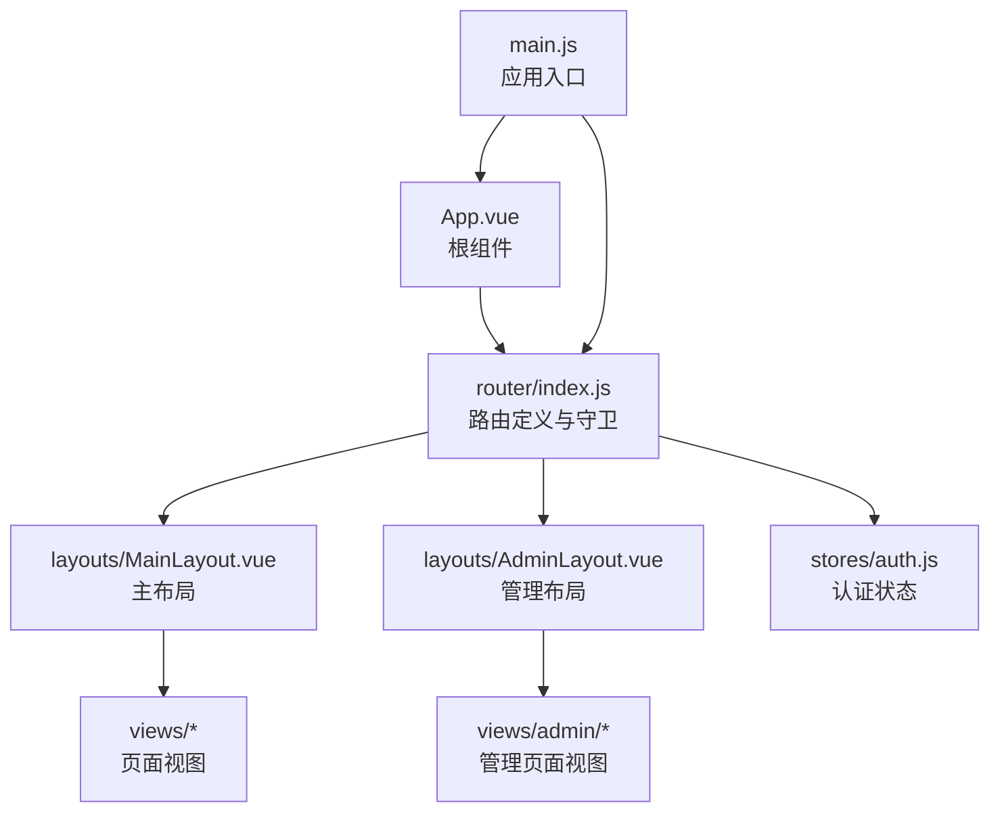
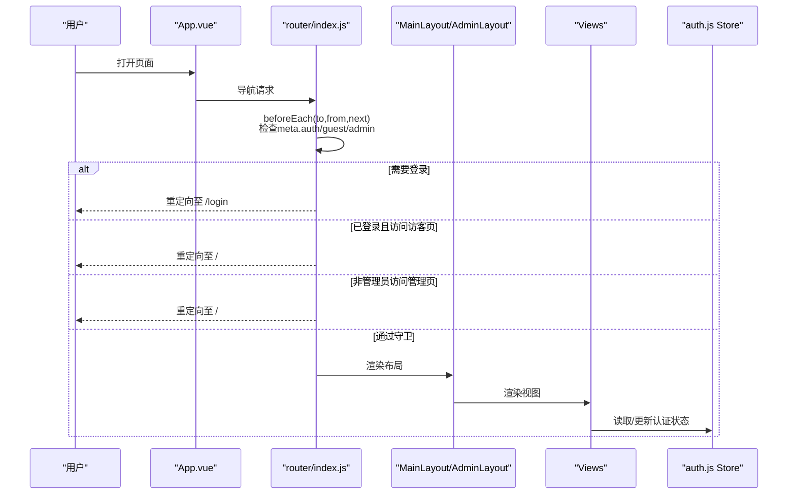
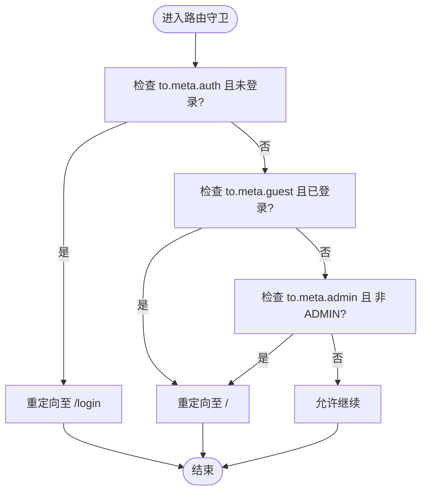
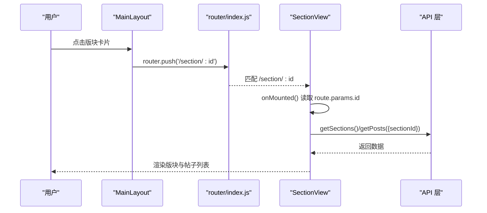
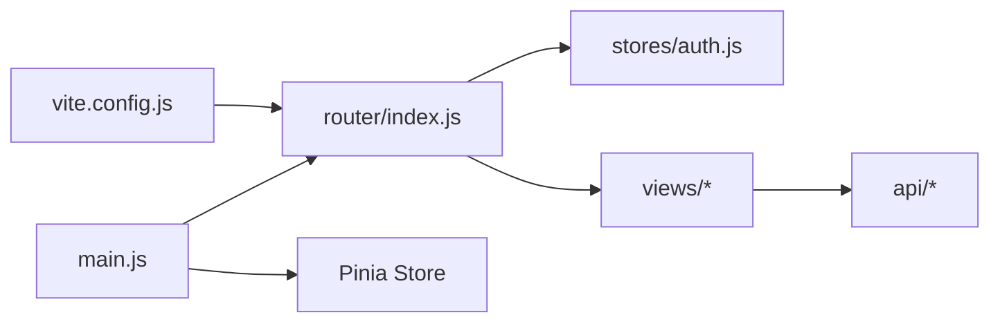

# 路由系统设计

<cite>
**本文档引用的文件**
- [src/router/index.js](file://src/router/index.js)
- [src/main.js](file://src/main.js)
- [src/App.vue](file://src/App.vue)
- [src/stores/auth.js](file://src/stores/auth.js)
- [src/layouts/MainLayout.vue](file://src/layouts/MainLayout.vue)
- [src/layouts/AdminLayout.vue](file://src/layouts/AdminLayout.vue)
- [src/views/HomeView.vue](file://src/views/HomeView.vue)
- [src/views/DiscoverView.vue](file://src/views/DiscoverView.vue)
- [src/views/SectionView.vue](file://src/views/SectionView.vue)
- [src/views/PostDetailView.vue](file://src/views/PostDetailView.vue)
- [src/views/ActivityDetailView.vue](file://src/views/ActivityDetailView.vue)
- [src/views/ProfileView.vue](file://src/views/ProfileView.vue)
- [src/api/auth.js](file://src/api/auth.js)
- [vite.config.js](file://vite.config.js)
- [package.json](file://package.json)
</cite>

## 目录
1. [引言](#引言)
2. [项目结构](#项目结构)
3. [核心组件](#核心组件)
4. [架构总览](#架构总览)
5. [详细组件分析](#详细组件分析)
6. [依赖关系分析](#依赖关系分析)
7. [性能考虑](#性能考虑)
8. [故障排除指南](#故障排除指南)
9. [结论](#结论)

## 引言
本设计文档面向PBL项目前端路由系统，基于Vue Router 4实现，覆盖路由配置、嵌套路由、路由守卫、权限控制、动态路由与参数传递、编程式导航、命名路由与元信息、懒加载与性能优化等主题。文档旨在帮助开发者理解并扩展该路由体系，确保在功能完整性与可维护性之间取得平衡。

## 项目结构
前端路由系统位于`src/router/index.js`，通过`createRouter`与`createWebHistory`创建路由器实例，并在`src/main.js`中挂载到应用。根组件`src/App.vue`通过`<router-view />`渲染当前匹配的视图。认证状态由Pinia Store管理，布局组件分别提供前台与管理后台的导航骨架。

图表来源
- [src/App.vue:1-7](file://src/App.vue#L1-L7)
- [src/router/index.js:1-82](file://src/router/index.js#L1-L82)
- [src/main.js:1-22](file://src/main.js#L1-L22)
- [src/stores/auth.js:1-37](file://src/stores/auth.js#L1-L37)
- [src/layouts/MainLayout.vue:1-122](file://src/layouts/MainLayout.vue#L1-L122)
- [src/layouts/AdminLayout.vue:1-59](file://src/layouts/AdminLayout.vue#L1-L59)

章节来源
- [src/router/index.js:1-82](file://src/router/index.js#L1-L82)
- [src/main.js:1-22](file://src/main.js#L1-L22)
- [src/App.vue:1-7](file://src/App.vue#L1-L7)

## 核心组件
- 路由器实例与历史模式：使用`createRouter`与`createWebHistory`创建，启用滚动行为回到顶部。
- 路由表组织：采用分层结构，前台主布局与管理后台布局分别作为父级路由，子路由承载具体页面。
- 路由守卫：全局前置守卫根据元信息执行权限校验（访客/登录/管理员）。
- 动态路由：使用路径参数（如`:id`）承载动态标识。
- 编程式导航：在布局与视图中广泛使用`router.push`进行命名路由跳转。
- 懒加载：视图组件通过函数形式按需导入，结合Vite自动代码分割。

章节来源
- [src/router/index.js:60-82](file://src/router/index.js#L60-L82)
- [src/router/index.js:4-58](file://src/router/index.js#L4-L58)
- [src/main.js:17-18](file://src/main.js#L17-L18)
- [src/App.vue:1-3](file://src/App.vue#L1-L3)

## 架构总览
下图展示路由系统的高层交互：应用启动后，路由器根据URL匹配路由表，解析元信息并执行守卫逻辑；随后通过布局组件渲染对应视图，视图内部通过编程式导航或菜单组件触发路由跳转。

图表来源
- [src/router/index.js:67-79](file://src/router/index.js#L67-L79)
- [src/stores/auth.js:5-36](file://src/stores/auth.js#L5-L36)
- [src/layouts/MainLayout.vue:51-81](file://src/layouts/MainLayout.vue#L51-L81)
- [src/layouts/AdminLayout.vue:34-43](file://src/layouts/AdminLayout.vue#L34-L43)

## 详细组件分析

### 路由表与嵌套路由设计
- 前台主路由：以`/`为根，子路由包含首页、发现、版块详情、发帖、帖子详情、活动列表/创建/详情、用户资料、消息通知、私信、AI助手等。
- 管理后台路由：以`/admin`为根，子路由包含仪表盘、用户管理、帖子管理、活动管理、版块管理、公告管理，并设置默认重定向。
- 通配符路由：兜底重定向至首页，避免未知路径导致白屏。
- 滚动行为：每次导航后滚动至顶部，提升用户体验。

章节来源
- [src/router/index.js:4-58](file://src/router/index.js#L4-L58)
- [src/router/index.js:60-64](file://src/router/index.js#L60-L64)

### 路由守卫与权限控制
- 元信息字段：
  - `auth: true`：要求已登录，否则重定向至登录页。
  - `guest: true`：仅未登录用户可见，已登录则重定向至首页。
  - `admin: true`：仅管理员可见，非管理员重定向至首页。
- 守卫逻辑：
  - 优先判断是否需要登录，再判断是否为访客页，最后校验管理员权限。
  - 通过Pinia Store读取登录状态与用户角色，保证一致性。

图表来源
- [src/router/index.js:67-79](file://src/router/index.js#L67-L79)
- [src/stores/auth.js:9](file://src/stores/auth.js#L9)

章节来源
- [src/router/index.js:67-79](file://src/router/index.js#L67-L79)
- [src/stores/auth.js:5-36](file://src/stores/auth.js#L5-L36)

### 动态路由与参数传递
- 版块详情：`/section/:id`，在视图中读取`route.params.id`并发起API请求获取版块与帖子列表。
- 帖子详情：`/post/:id`，在视图中读取`route.params.id`并加载详情、评论、收藏状态。
- 活动详情：`/activity/:id`，在视图中读取`route.params.id`并加载活动信息、评论、收藏与报名状态。
- 用户资料：`/user/:id`，在视图中读取`route.params.id`并加载用户信息与帖子列表。
- 参数传递方式：通过路由参数传递资源标识；查询参数可通过API层统一处理（示例中未直接使用查询参数，但支持通过HTTP客户端传参）。

图表来源
- [src/views/SectionView.vue:31-40](file://src/views/SectionView.vue#L31-L40)
- [src/views/PostDetailView.vue:62-78](file://src/views/PostDetailView.vue#L62-L78)
- [src/views/ActivityDetailView.vue:102-118](file://src/views/ActivityDetailView.vue#L102-L118)
- [src/views/ProfileView.vue:74-92](file://src/views/ProfileView.vue#L74-L92)

章节来源
- [src/views/SectionView.vue:19-40](file://src/views/SectionView.vue#L19-L40)
- [src/views/PostDetailView.vue:44-78](file://src/views/PostDetailView.vue#L44-L78)
- [src/views/ActivityDetailView.vue:82-118](file://src/views/ActivityDetailView.vue#L82-L118)
- [src/views/ProfileView.vue:54-92](file://src/views/ProfileView.vue#L54-L92)

### 编程式导航与命名路由
- 命名路由：路由表中为常用页面定义`name`，便于在代码中以名称进行跳转，降低硬编码风险。
- 编程式导航：在布局组件与视图组件中广泛使用`router.push`进行跳转，例如：
  - 主菜单跳转至首页、发现、活动、AI助手。
  - 下拉菜单跳转至个人主页、收藏、报名、私信、管理后台。
  - 视图内点击卡片跳转至帖子或活动详情。
- 菜单组件：Element Plus的菜单项开启`router`属性，可直接通过`index`值进行导航。

章节来源
- [src/router/index.js:13-37](file://src/router/index.js#L13-L37)
- [src/layouts/MainLayout.vue:7-12](file://src/layouts/MainLayout.vue#L7-L12)
- [src/layouts/MainLayout.vue:18-32](file://src/layouts/MainLayout.vue#L18-L32)
- [src/layouts/MainLayout.vue:70-81](file://src/layouts/MainLayout.vue#L70-L81)
- [src/layouts/AdminLayout.vue:5-20](file://src/layouts/AdminLayout.vue#L5-L20)
- [src/views/HomeView.vue:8,18,22,41,66,73-75](file://src/views/HomeView.vue#L8,L18,L22,L41,L66,L73,L74,L75)
- [src/views/DiscoverView.vue:10,14,28](file://src/views/DiscoverView.vue#L10,L14,L28)

### 路由懒加载与代码分割
- 懒加载实现：路由中的视图组件均通过函数形式按需导入，实现按需加载与代码分割。
- 构建工具：Vite自动对动态导入的模块进行代码分割，配合Vue Router的异步组件实现自然的懒加载效果。
- 性能收益：减少首屏包体积，提升初始加载速度；按需加载页面资源，改善用户体验。

章节来源
- [src/router/index.js:6,12,19,24,29,34,37](file://src/router/index.js#L6,L12,L19,L24,L29,L34,L37)
- [vite.config.js:9-13](file://vite.config.js#L9-L13)

### 布局与导航最佳实践
- 主布局：顶部导航菜单、用户下拉菜单、通知徽章与WebSocket连接建立，体现前台导航与用户态联动。
- 管理布局：左侧菜单与面包屑风格的导航，支持快速切换管理页面并返回前台。
- 导航最佳实践：
  - 使用命名路由与编程式导航，避免硬编码路径。
  - 在菜单组件中启用`router`属性，简化导航逻辑。
  - 对需要登录的页面在路由元信息中标注，集中处理权限校验。
  - 对管理员专属页面标注`admin`元信息，统一拦截。

章节来源
- [src/layouts/MainLayout.vue:1-122](file://src/layouts/MainLayout.vue#L1-L122)
- [src/layouts/AdminLayout.vue:1-59](file://src/layouts/AdminLayout.vue#L1-L59)
- [src/router/index.js:42-55](file://src/router/index.js#L42-L55)

## 依赖关系分析
- 应用入口依赖路由器与状态管理：
  - main.js中注册Pinia与Router，确保全局状态与路由可用。
- 路由依赖认证Store：
  - 路由守卫读取Store中的登录状态与用户角色，决定是否放行。
- 视图依赖路由与API：
  - 视图通过useRoute/useRouter读取参数与执行导航；通过API层获取数据。
- 构建与代理：
  - Vite配置提供开发代理与自动导入，简化开发体验。

图表来源
- [src/main.js:17-18](file://src/main.js#L17-L18)
- [src/router/index.js:67-79](file://src/router/index.js#L67-L79)
- [src/stores/auth.js:5-36](file://src/stores/auth.js#L5-L36)
- [vite.config.js:8-26](file://vite.config.js#L8-L26)

章节来源
- [src/main.js:1-22](file://src/main.js#L1-L22)
- [src/router/index.js:67-79](file://src/router/index.js#L67-L79)
- [src/stores/auth.js:5-36](file://src/stores/auth.js#L5-L36)
- [vite.config.js:8-26](file://vite.config.js#L8-L26)

## 性能考虑
- 代码分割：路由懒加载与Vite动态导入天然实现按需加载，建议保持现有模式，避免一次性引入过多页面。
- 首屏优化：将高频入口（首页、发现、活动）的组件保持较小体积，必要时对大型图表或富文本组件进一步拆分。
- 导航性能：路由守卫逻辑简单明确，避免在守卫中执行耗时操作；如需预取数据，可在视图生命周期中异步完成。
- 缓存策略：对于静态数据（如版块列表），可在Store中增加缓存与失效策略，减少重复请求。
- 图片与媒体：在视图中对图片占位与错误处理进行优化，避免阻塞渲染。

## 故障排除指南
- 登录后仍被重定向到登录页
  - 检查认证Store是否正确写入token与用户信息，确认守卫逻辑与元信息一致。
  - 参考：[src/stores/auth.js:11-28](file://src/stores/auth.js#L11-L28)，[src/router/index.js:69-71](file://src/router/index.js#L69-L71)
- 已登录用户访问访客页被重定向
  - 确认目标路由元信息`guest: true`是否符合预期。
  - 参考：[src/router/index.js:72-74](file://src/router/index.js#L72-L74)
- 非管理员访问管理页失败
  - 确认用户角色是否为ADMIN，守卫逻辑会拒绝非管理员访问。
  - 参考：[src/router/index.js:75-77](file://src/router/index.js#L75-L77)
- 动态路由参数无效
  - 确认路由定义中的参数名与视图读取的一致，检查视图中是否正确使用`route.params.id`。
  - 参考：[src/views/SectionView.vue:35](file://src/views/SectionView.vue#L35)，[src/views/PostDetailView.vue:66](file://src/views/PostDetailView.vue#L66)
- 编程式导航不生效
  - 确认使用的是`router.push`而非`router.replace`，并检查命名路由是否存在。
  - 参考：[src/layouts/MainLayout.vue:70-81](file://src/layouts/MainLayout.vue#L70-L81)，[src/router/index.js:13-37](file://src/router/index.js#L13-L37)

章节来源
- [src/stores/auth.js:11-28](file://src/stores/auth.js#L11-L28)
- [src/router/index.js:69-77](file://src/router/index.js#L69-L77)
- [src/views/SectionView.vue:35](file://src/views/SectionView.vue#L35)
- [src/views/PostDetailView.vue:66](file://src/views/PostDetailView.vue#L66)
- [src/layouts/MainLayout.vue:70-81](file://src/layouts/MainLayout.vue#L70-L81)

## 结论
本路由系统以Vue Router 4为核心，结合Pinia状态管理与Element Plus组件库，实现了清晰的路由表结构、完善的权限守卫与良好的导航体验。通过命名路由、编程式导航与懒加载，兼顾了可维护性与性能表现。建议在后续迭代中持续完善缓存策略与错误处理，确保在复杂业务场景下的稳定性与可扩展性。