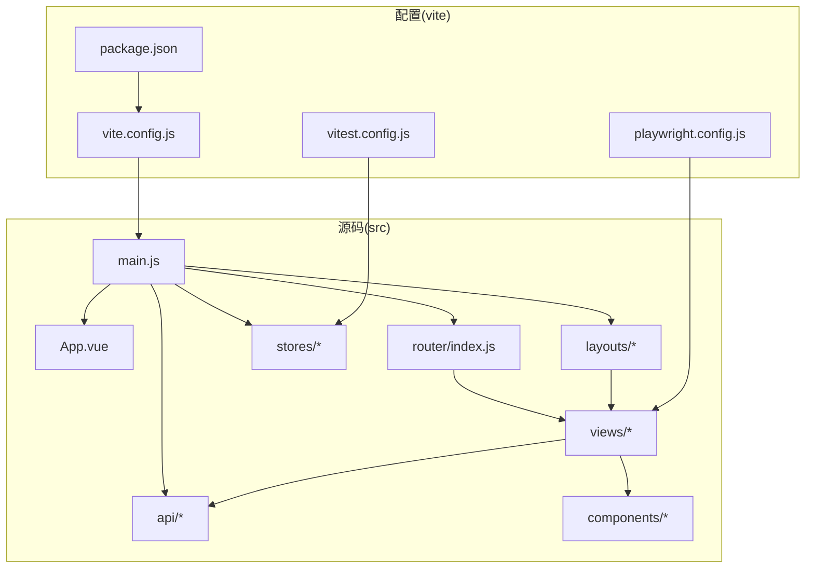
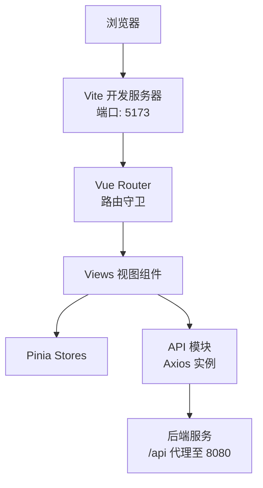
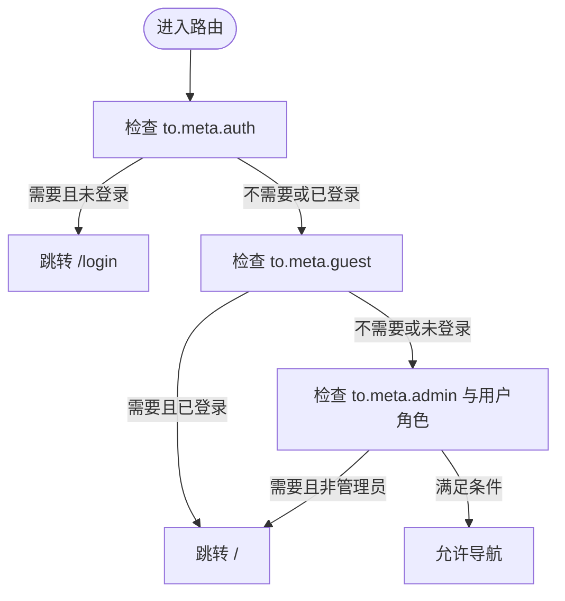
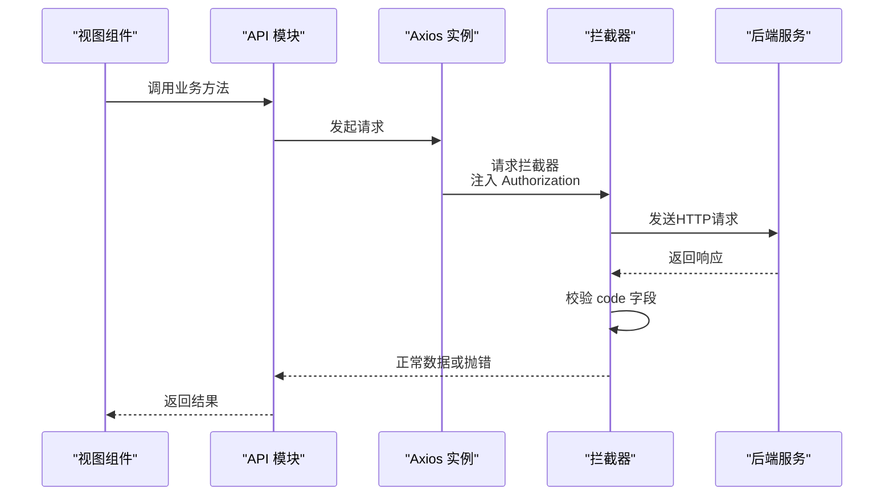
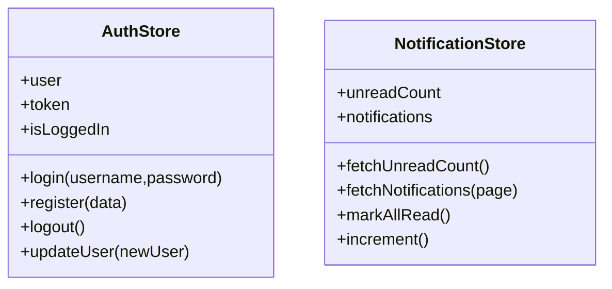
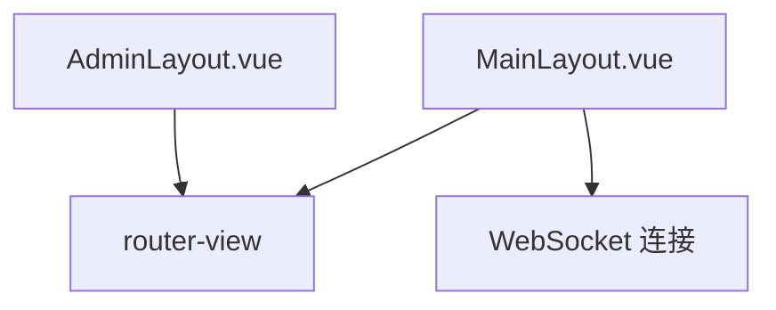
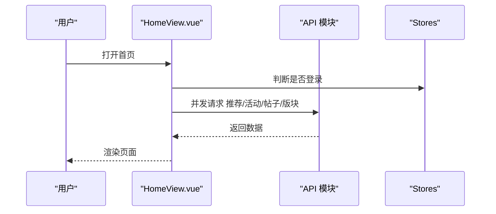
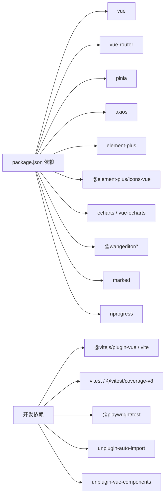

# 项目结构与配置

<cite>
**本文引用的文件**
- [package.json](file://campus-forum-frontend/package.json)
- [vite.config.js](file://campus-forum-frontend/vite.config.js)
- [main.js](file://campus-forum-frontend/src/main.js)
- [App.vue](file://campus-forum-frontend/src/App.vue)
- [router/index.js](file://campus-forum-frontend/src/router/index.js)
- [stores/auth.js](file://campus-forum-frontend/src/stores/auth.js)
- [stores/notification.js](file://campus-forum-frontend/src/stores/notification.js)
- [layouts/MainLayout.vue](file://campus-forum-frontend/src/layouts/MainLayout.vue)
- [layouts/AdminLayout.vue](file://campus-forum-frontend/src/layouts/AdminLayout.vue)
- [api/http.js](file://campus-forum-frontend/src/api/http.js)
- [api/auth.js](file://campus-forum-frontend/src/api/auth.js)
- [vitest.config.js](file://campus-forum-frontend/vitest.config.js)
- [playwright.config.js](file://campus-forum-frontend/playwright.config.js)
- [tests/unit/setup.js](file://campus-forum-frontend/tests/unit/setup.js)
- [views/HomeView.vue](file://campus-forum-frontend/src/views/HomeView.vue)
- [views/LoginView.vue](file://campus-forum-frontend/src/views/LoginView.vue)
- [components/charts/BaseChart.vue](file://campus-forum-frontend/src/components/charts/BaseChart.vue)
</cite>

## 目录
1. [引言](#引言)
2. [项目结构](#项目结构)
3. [核心组件](#核心组件)
4. [架构总览](#架构总览)
5. [详细组件分析](#详细组件分析)
6. [依赖关系分析](#依赖关系分析)
7. [性能考虑](#性能考虑)
8. [故障排查指南](#故障排查指南)
9. [结论](#结论)
10. [附录](#附录)

## 引言
本文件面向PBL项目前端（Vue.js 3 + Vite）的开发者与维护者，系统性梳理项目目录结构、核心模块职责、构建与运行配置、依赖管理与脚本命令，并总结自动导入与组件解析策略、开发与生产差异配置、初始化流程与最佳实践。目标是帮助读者快速理解并高效扩展该前端工程。

## 项目结构
前端工程位于 campus-forum-frontend 目录，采用“功能域+分层”的组织方式：
- src/api：封装HTTP客户端与各业务API模块，统一拦截器与错误处理
- src/components：通用可复用组件（如图表组件）
- src/layouts：页面布局（主站布局与管理后台布局）
- src/router：路由定义与全局前置守卫
- src/stores：状态管理（Pinia），包含认证与通知等store
- src/views：页面级视图组件
- src/assets：静态资源（如全局样式）
- src/main.js：应用入口，挂载Vue实例、注册插件与全局配置
- src/App.vue：根组件，承载路由出口
- 配置文件：package.json（依赖与脚本）、vite.config.js（Vite配置）、vitest.config.js（单元测试）、playwright.config.js（端到端测试）

**图表来源**
- [main.js:1-22](file://campus-forum-frontend/src/main.js#L1-L22)
- [router/index.js:1-82](file://campus-forum-frontend/src/router/index.js#L1-L82)
- [vite.config.js:1-27](file://campus-forum-frontend/vite.config.js#L1-L27)
- [package.json:1-37](file://campus-forum-frontend/package.json#L1-L37)
- [vitest.config.js:1-23](file://campus-forum-frontend/vitest.config.js#L1-L23)
- [playwright.config.js:1-35](file://campus-forum-frontend/playwright.config.js#L1-L35)

**章节来源**
- [package.json:1-37](file://campus-forum-frontend/package.json#L1-L37)
- [vite.config.js:1-27](file://campus-forum-frontend/vite.config.js#L1-L27)
- [main.js:1-22](file://campus-forum-frontend/src/main.js#L1-L22)
- [App.vue:1-7](file://campus-forum-frontend/src/App.vue#L1-L7)

## 核心组件
- 应用入口与插件注册：在入口中创建应用实例、注册Pinia、路由、Element Plus，并批量注册图标组件；引入全局样式。
- 根组件：仅包含路由出口，负责渲染当前匹配视图。
- 路由系统：集中定义页面路由、嵌套路由与权限守卫；支持访客/认证/管理员三类meta控制。
- 状态管理：Pinia Store封装认证与通知逻辑，持久化存储于localStorage。
- HTTP客户端：Axios实例封装基础路径、超时、请求头注入与统一错误处理。
- 布局系统：主站布局与管理后台布局，分别承载导航菜单、内容区与侧边栏。
- 视图组件：页面级组件，按功能域组织，使用API模块与Store进行数据交互。
- 通用组件：如BaseChart，封装第三方图表库初始化、响应式与销毁逻辑。

**章节来源**
- [main.js:1-22](file://campus-forum-frontend/src/main.js#L1-L22)
- [App.vue:1-7](file://campus-forum-frontend/src/App.vue#L1-L7)
- [router/index.js:1-82](file://campus-forum-frontend/src/router/index.js#L1-L82)
- [stores/auth.js:1-37](file://campus-forum-frontend/src/stores/auth.js#L1-L37)
- [stores/notification.js:1-31](file://campus-forum-frontend/src/stores/notification.js#L1-L31)
- [api/http.js:1-41](file://campus-forum-frontend/src/api/http.js#L1-L41)
- [layouts/MainLayout.vue:1-122](file://campus-forum-frontend/src/layouts/MainLayout.vue#L1-L122)
- [layouts/AdminLayout.vue:1-59](file://campus-forum-frontend/src/layouts/AdminLayout.vue#L1-L59)
- [components/charts/BaseChart.vue:1-31](file://campus-forum-frontend/src/components/charts/BaseChart.vue#L1-L31)

## 架构总览
下图展示从浏览器到后端服务的典型交互链路：前端通过Vite开发服务器提供静态资源，路由驱动视图渲染，Store与API模块协调数据流，Element Plus提供UI能力，Axios统一处理HTTP请求与鉴权。

**图表来源**
- [vite.config.js:17-25](file://campus-forum-frontend/vite.config.js#L17-L25)
- [router/index.js:66-79](file://campus-forum-frontend/src/router/index.js#L66-L79)
- [api/http.js:4-7](file://campus-forum-frontend/src/api/http.js#L4-L7)

## 详细组件分析

### 路由系统与权限守卫
- 路由定义：集中于router/index.js，包含认证页、主站布局与管理后台布局两类路由树，支持嵌套路由与动态导入。
- 权限控制：通过meta字段区分访客可用(guest)、登录可用(auth)、管理员(admin)三类路由；在前置守卫中读取Store状态进行跳转控制。
- 行为特征：未登录访问受保护路由跳转登录；已登录访问登录页跳转首页；非管理员访问管理页跳转首页。

**图表来源**
- [router/index.js:66-79](file://campus-forum-frontend/src/router/index.js#L66-L79)

**章节来源**
- [router/index.js:1-82](file://campus-forum-frontend/src/router/index.js#L1-L82)

### HTTP客户端与拦截器
- 基础配置：baseURL指向 /api，统一超时时间；请求头自动附加Authorization。
- 统一错误处理：响应拦截器校验code字段，异常时弹出消息并拒绝Promise；401时清理本地令牌并跳转登录。
- 使用方式：各业务API模块基于此实例封装具体接口。

**图表来源**
- [api/http.js:9-38](file://campus-forum-frontend/src/api/http.js#L9-L38)

**章节来源**
- [api/http.js:1-41](file://campus-forum-frontend/src/api/http.js#L1-L41)
- [api/auth.js:1-4](file://campus-forum-frontend/src/api/auth.js#L1-L4)

### 状态管理（Pinia）
- 认证Store：维护用户信息与令牌，提供登录、注册、登出、更新用户信息方法，并持久化到localStorage。
- 通知Store：维护未读数与消息列表，提供拉取未读数、分页拉取消息、一键已读、自增未读数等方法。

**图表来源**
- [stores/auth.js:5-36](file://campus-forum-frontend/src/stores/auth.js#L5-L36)
- [stores/notification.js:5-30](file://campus-forum-frontend/src/stores/notification.js#L5-L30)

**章节来源**
- [stores/auth.js:1-37](file://campus-forum-frontend/src/stores/auth.js#L1-L37)
- [stores/notification.js:1-31](file://campus-forum-frontend/src/stores/notification.js#L1-L31)

### 布局系统
- 主站布局：包含顶部导航、主导航菜单、用户下拉菜单与消息徽章；在挂载时根据登录态拉取未读消息并建立WebSocket连接。
- 管理后台布局：左侧菜单导航，右侧内容区，支持返回前台与退出登录。

**图表来源**
- [layouts/MainLayout.vue:61-68](file://campus-forum-frontend/src/layouts/MainLayout.vue#L61-L68)
- [layouts/AdminLayout.vue:34-43](file://campus-forum-frontend/src/layouts/AdminLayout.vue#L34-L43)

**章节来源**
- [layouts/MainLayout.vue:1-122](file://campus-forum-frontend/src/layouts/MainLayout.vue#L1-L122)
- [layouts/AdminLayout.vue:1-59](file://campus-forum-frontend/src/layouts/AdminLayout.vue#L1-L59)

### 视图组件示例
- 首页视图：聚合推荐活动、最新帖子、版块导航与公告，使用Promise.all并发拉取数据，提升首屏性能。
- 登录视图：表单校验、加载态、调用认证Store完成登录并提示成功。

**图表来源**
- [views/HomeView.vue:98-112](file://campus-forum-frontend/src/views/HomeView.vue#L98-L112)

**章节来源**
- [views/HomeView.vue:1-135](file://campus-forum-frontend/src/views/HomeView.vue#L1-L135)
- [views/LoginView.vue:1-72](file://campus-forum-frontend/src/views/LoginView.vue#L1-L72)

### 通用组件
- 图表组件：封装ECharts初始化、响应式调整与销毁，支持props驱动的option变更。

**章节来源**
- [components/charts/BaseChart.vue:1-31](file://campus-forum-frontend/src/components/charts/BaseChart.vue#L1-L31)

## 依赖关系分析
- 依赖管理：Vue 3、Vue Router、Pinia、Axios、Element Plus及其图标、ECharts与vue-echarts、wangEditor、marked、nprogress等。
- 开发依赖：@vitejs/plugin-vue、Vite、Vitest、Playwright、unplugin-auto-import、unplugin-vue-components。
- 自动导入与组件解析：通过unplugin-auto-import自动导入API与组合式函数；通过unplugin-vue-components配合ElementPlusResolver实现按需自动注册组件与图标解析。

**图表来源**
- [package.json:13-35](file://campus-forum-frontend/package.json#L13-L35)

**章节来源**
- [package.json:1-37](file://campus-forum-frontend/package.json#L1-L37)
- [vite.config.js:3-5](file://campus-forum-frontend/vite.config.js#L3-L5)

## 性能考虑
- 路由懒加载：通过动态导入减少首包体积，提升首屏加载速度。
- 并发请求：首页使用Promise.all并发拉取多个数据源，缩短等待时间。
- 组件懒加载：布局与视图均采用异步组件，按需加载。
- 图表性能：BaseChart在窗口resize时触发图表resize，避免布局抖动；组件卸载时释放资源。
- 构建优化：Vite默认启用ESBuild压缩与模块预构建；建议在生产构建时开启压缩与资源内联策略（可在Vite配置中扩展）。

**章节来源**
- [router/index.js:6-54](file://campus-forum-frontend/src/router/index.js#L6-L54)
- [views/HomeView.vue:100-104](file://campus-forum-frontend/src/views/HomeView.vue#L100-L104)
- [components/charts/BaseChart.vue:18-29](file://campus-forum-frontend/src/components/charts/BaseChart.vue#L18-L29)

## 故障排查指南
- 登录后仍被重定向到登录页
  - 检查路由守卫逻辑与Store中isLogin状态来源。
  - 参考：[router/index.js:66-79](file://campus-forum-frontend/src/router/index.js#L66-L79)，[stores/auth.js:9](file://campus-forum-frontend/src/stores/auth.js#L9)
- 401未授权
  - Axios拦截器会清除本地令牌并跳转登录；确认后端JWT有效与前端本地存储一致。
  - 参考：[api/http.js:29-32](file://campus-forum-frontend/src/api/http.js#L29-L32)
- 开发代理无效
  - 确认Vite代理配置与后端服务端口一致；浏览器控制台Network面板检查/api前缀转发。
  - 参考：[vite.config.js:19-24](file://campus-forum-frontend/vite.config.js#L19-L24)
- E2E测试无法启动
  - 确认本地开发服务器端口与Playwright配置一致；必要时关闭已有进程。
  - 参考：[playwright.config.js:28-33](file://campus-forum-frontend/playwright.config.js#L28-L33)
- 单元测试报错
  - 确认setup.js中对Element Plus与vue-router的mock已生效；检查覆盖率排除规则。
  - 参考：[tests/unit/setup.js:9-32](file://campus-forum-frontend/tests/unit/setup.js#L9-L32)，[vitest.config.js:12-17](file://campus-forum-frontend/vitest.config.js#L12-L17)

**章节来源**
- [router/index.js:66-79](file://campus-forum-frontend/src/router/index.js#L66-L79)
- [stores/auth.js:9](file://campus-forum-frontend/src/stores/auth.js#L9)
- [api/http.js:29-32](file://campus-forum-frontend/src/api/http.js#L29-L32)
- [vite.config.js:19-24](file://campus-forum-frontend/vite.config.js#L19-L24)
- [playwright.config.js:28-33](file://campus-forum-frontend/playwright.config.js#L28-L33)
- [tests/unit/setup.js:9-32](file://campus-forum-frontend/tests/unit/setup.js#L9-L32)
- [vitest.config.js:12-17](file://campus-forum-frontend/vitest.config.js#L12-L17)

## 结论
本项目以Vue 3为核心，结合Vite、Pinia、Element Plus与Axios构建了清晰的前端架构：路由与布局解耦、状态与API分离、组件通用化与按需加载。通过自动导入与组件解析减少样板代码，借助拦截器统一处理鉴权与错误，辅以完善的测试配置保障质量。遵循本文档的结构与最佳实践，可高效扩展功能并保持代码一致性。

## 附录

### Vite配置要点
- 插件：Vue、AutoImport（ElementPlusResolver）、Components（ElementPlusResolver）
- 路径别名：@ 指向 src
- 开发服务器：端口5173，/api代理至后端8080
- 生产构建：可通过扩展Vite配置启用压缩、资源内联与产物分析

**章节来源**
- [vite.config.js:1-27](file://campus-forum-frontend/vite.config.js#L1-L27)

### 依赖与脚本
- 依赖：Vue、Router、Pinia、Axios、Element Plus、ECharts、wangEditor、marked、nprogress
- 开发依赖：Vite、Vue插件、Vitest、Playwright、自动导入与组件解析插件
- 脚本：dev、build、preview、test:unit、test:e2e

**章节来源**
- [package.json:6-11](file://campus-forum-frontend/package.json#L6-L11)
- [package.json:13-35](file://campus-forum-frontend/package.json#L13-L35)

### 测试配置
- 单元测试：Vitest + jsdom，覆盖报告与排除规则
- 端到端测试：Playwright，自动启动开发服务器，HTML报告输出

**章节来源**
- [vitest.config.js:1-23](file://campus-forum-frontend/vitest.config.js#L1-L23)
- [playwright.config.js:1-35](file://campus-forum-frontend/playwright.config.js#L1-L35)

### 初始化流程与最佳实践
- 初始化
  - 安装依赖：使用包管理器安装依赖
  - 启动开发：执行开发脚本启动Vite
  - 运行测试：分别执行单元测试与端到端测试脚本
- 最佳实践
  - 路由懒加载与权限守卫配合使用
  - API模块统一基于Axios实例封装
  - Store持久化与拦截器联动处理登录态
  - 通用组件抽取与按需注册
  - E2E与单元测试并行推进，覆盖率持续改进