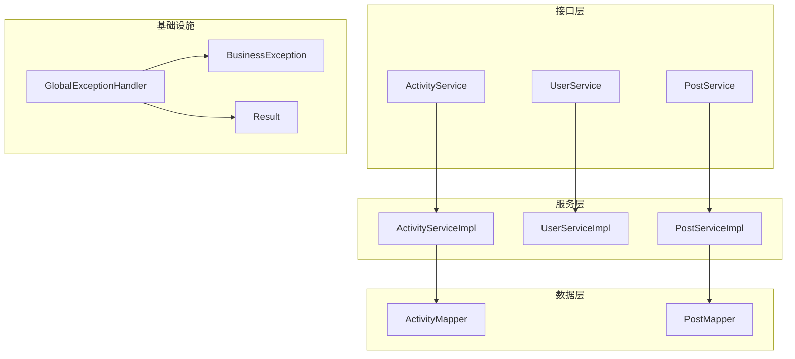
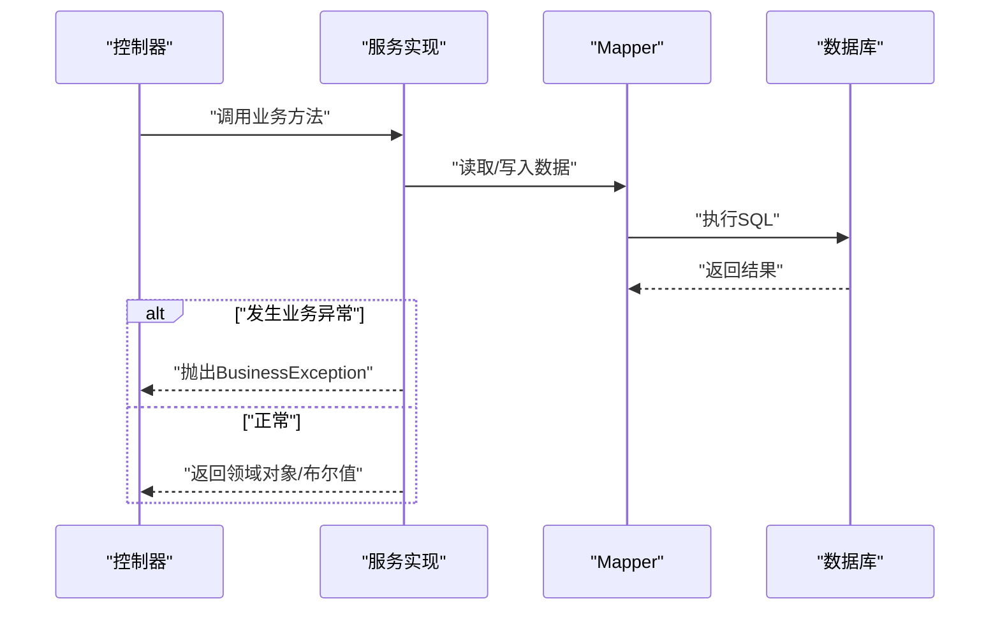
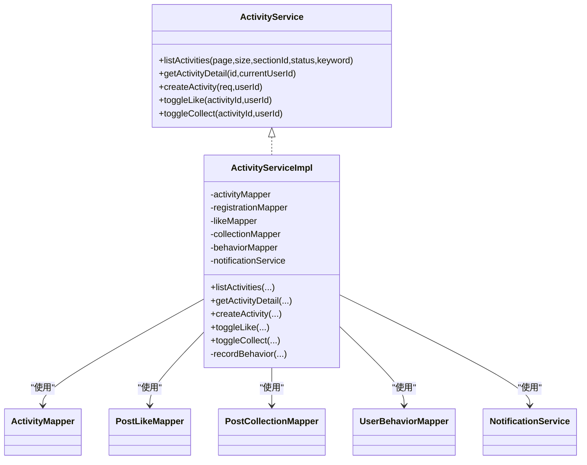
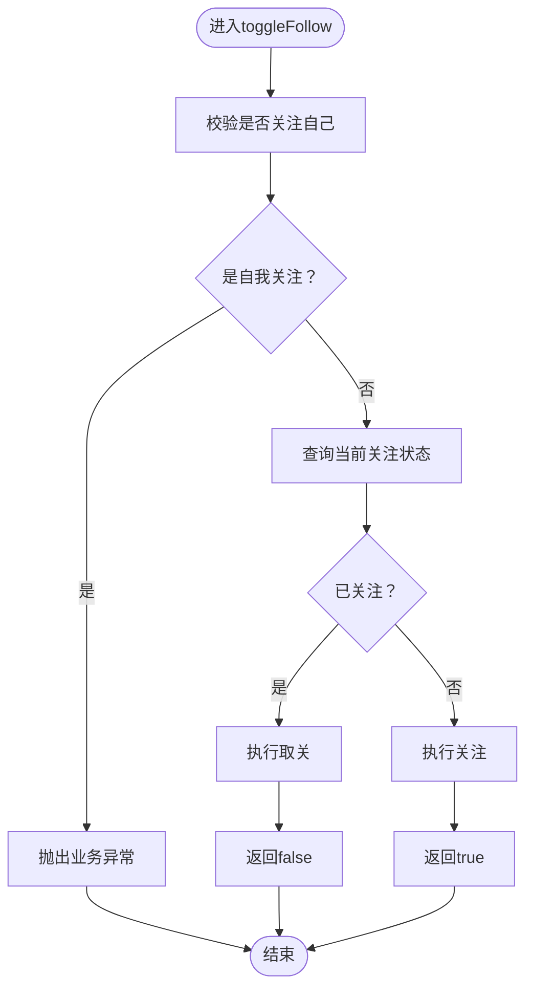
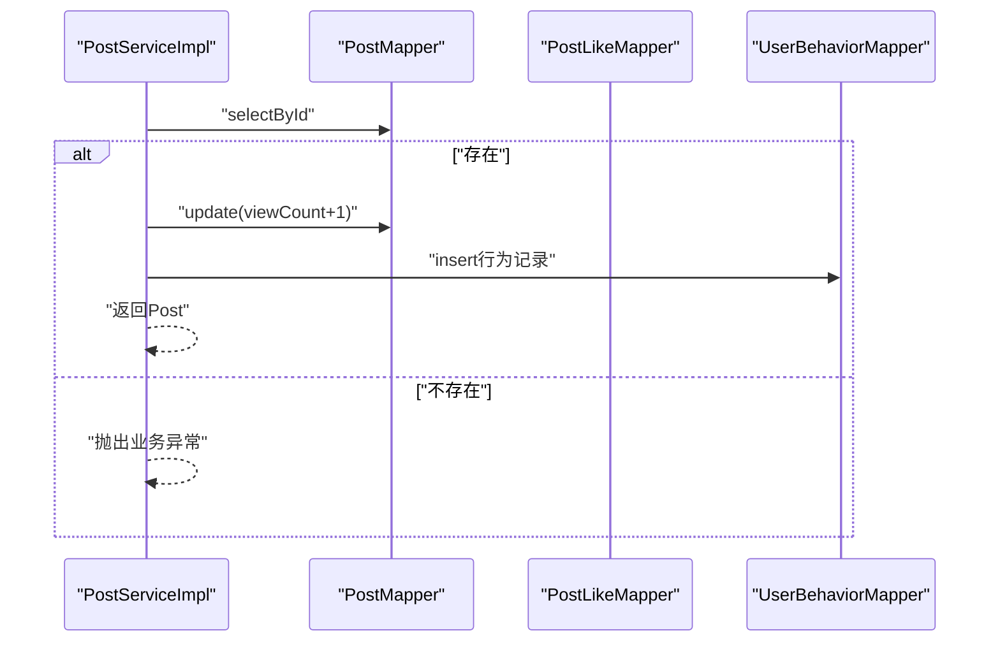
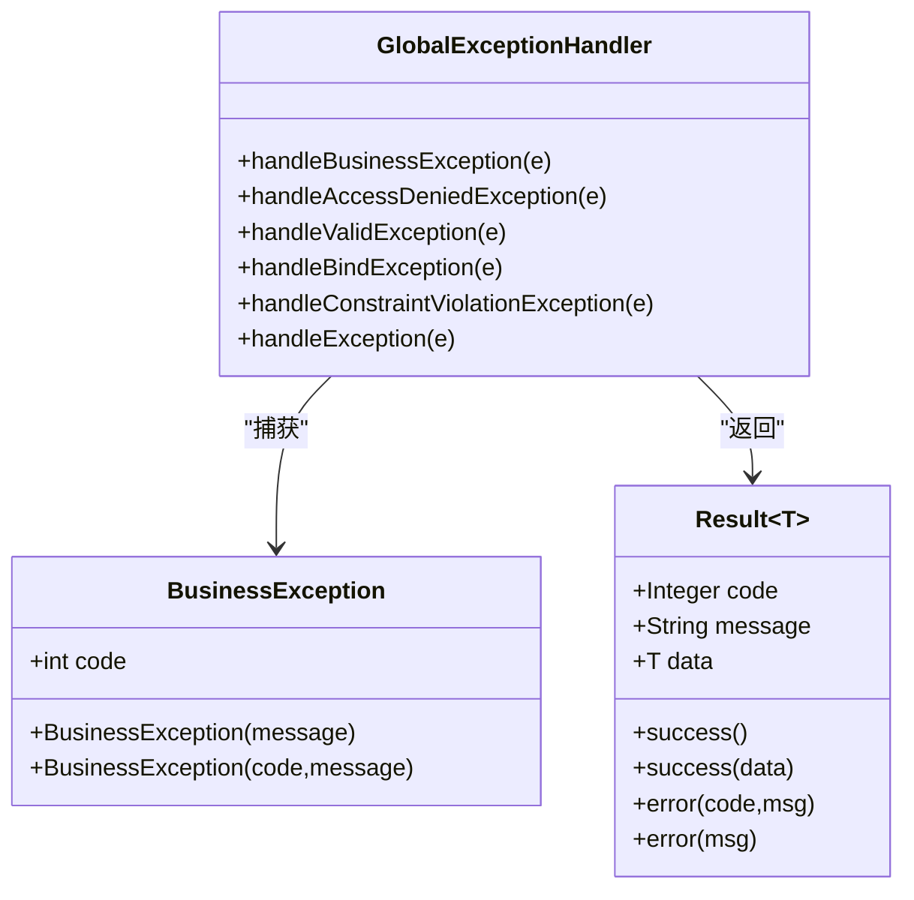
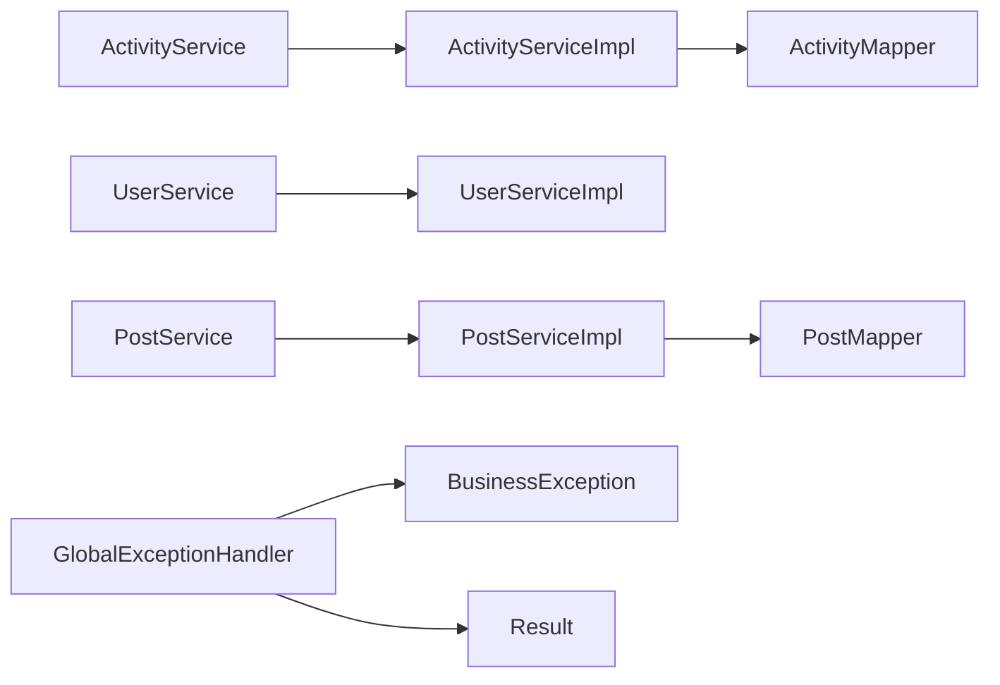

# 业务服务层架构

<cite>
**本文引用的文件**
- [ActivityService.java](file://campus-forum-backend/src/main/java/com/campus/forum/service/ActivityService.java)
- [ActivityServiceImpl.java](file://campus-forum-backend/src/main/java/com/campus/forum/service/impl/ActivityServiceImpl.java)
- [UserService.java](file://campus-forum-backend/src/main/java/com/campus/forum/service/UserService.java)
- [UserServiceImpl.java](file://campus-forum-backend/src/main/java/com/campus/forum/service/impl/UserServiceImpl.java)
- [PostService.java](file://campus-forum-backend/src/main/java/com/campus/forum/service/PostService.java)
- [PostServiceImpl.java](file://campus-forum-backend/src/main/java/com/campus/forum/service/impl/PostServiceImpl.java)
- [BusinessException.java](file://campus-forum-backend/src/main/java/com/campus/forum/common/exception/BusinessException.java)
- [GlobalExceptionHandler.java](file://campus-forum-backend/src/main/java/com/campus/forum/common/GlobalExceptionHandler.java)
- [Result.java](file://campus-forum-backend/src/main/java/com/campus/forum/common/Result.java)
- [Activity.java](file://campus-forum-backend/src/main/java/com/campus/forum/entity/Activity.java)
- [Post.java](file://campus-forum-backend/src/main/java/com/campus/forum/entity/Post.java)
- [ActivityMapper.java](file://campus-forum-backend/src/main/java/com/campus/forum/mapper/ActivityMapper.java)
- [PostMapper.java](file://campus-forum-backend/src/main/java/com/campus/forum/mapper/PostMapper.java)
</cite>

## 目录
1. [引言](#引言)
2. [项目结构](#项目结构)
3. [核心组件](#核心组件)
4. [架构总览](#架构总览)
5. [详细组件分析](#详细组件分析)
6. [依赖分析](#依赖分析)
7. [性能考虑](#性能考虑)
8. [故障排查指南](#故障排查指南)
9. [结论](#结论)
10. [附录](#附录)

## 引言
本文件聚焦于PBL校园论坛后端的业务服务层架构，系统性阐述服务层的分层设计、接口与实现组织、依赖注入策略、业务逻辑封装原则（事务管理、异常处理、业务规则验证）、枚举与状态管理策略、自定义异常设计与分类处理机制，并给出职责边界、方法设计原则与性能优化建议及开发最佳实践。

## 项目结构
服务层位于后端工程的service与service/impl包中，采用“接口+实现类”的清晰分层；配合统一返回体Result、全局异常处理器GlobalExceptionHandler、自定义业务异常BusinessException，形成从接口到实现再到异常与响应的一致性设计。实体类与Mapper位于entity与mapper包，遵循MyBatis-Plus的约定式映射。

图表来源
- [ActivityService.java:1-14](file://campus-forum-backend/src/main/java/com/campus/forum/service/ActivityService.java#L1-L14)
- [ActivityServiceImpl.java:1-149](file://campus-forum-backend/src/main/java/com/campus/forum/service/impl/ActivityServiceImpl.java#L1-L149)
- [UserService.java:1-14](file://campus-forum-backend/src/main/java/com/campus/forum/service/UserService.java#L1-L14)
- [UserServiceImpl.java:1-79](file://campus-forum-backend/src/main/java/com/campus/forum/service/impl/UserServiceImpl.java#L1-L79)
- [PostService.java:1-14](file://campus-forum-backend/src/main/java/com/campus/forum/service/PostService.java#L1-L14)
- [PostServiceImpl.java:1-114](file://campus-forum-backend/src/main/java/com/campus/forum/service/impl/PostServiceImpl.java#L1-L114)
- [GlobalExceptionHandler.java:1-57](file://campus-forum-backend/src/main/java/com/campus/forum/common/GlobalExceptionHandler.java#L1-L57)
- [BusinessException.java:1-22](file://campus-forum-backend/src/main/java/com/campus/forum/common/exception/BusinessException.java#L1-L22)
- [Result.java:1-37](file://campus-forum-backend/src/main/java/com/campus/forum/common/Result.java#L1-L37)
- [ActivityMapper.java:1-22](file://campus-forum-backend/src/main/java/com/campus/forum/mapper/ActivityMapper.java#L1-L22)
- [PostMapper.java:1-15](file://campus-forum-backend/src/main/java/com/campus/forum/mapper/PostMapper.java#L1-L15)

章节来源
- [ActivityService.java:1-14](file://campus-forum-backend/src/main/java/com/campus/forum/service/ActivityService.java#L1-L14)
- [UserService.java:1-14](file://campus-forum-backend/src/main/java/com/campus/forum/service/UserService.java#L1-L14)
- [PostService.java:1-14](file://campus-forum-backend/src/main/java/com/campus/forum/service/PostService.java#L1-L14)

## 核心组件
- 接口层：定义业务能力契约，如活动、用户、帖子服务接口，明确输入输出与约束。
- 实现层：基于Spring注解进行依赖注入与事务声明，调用Mapper执行持久化操作，封装业务规则与行为记录。
- 异常与响应：统一业务异常BusinessException与全局异常处理器GlobalExceptionHandler，结合Result统一封装响应结构。
- 数据模型：实体类Activity、Post等承载状态字段与注解，Mapper提供查询与统计能力。

章节来源
- [ActivityServiceImpl.java:18-149](file://campus-forum-backend/src/main/java/com/campus/forum/service/impl/ActivityServiceImpl.java#L18-L149)
- [UserServiceImpl.java:15-79](file://campus-forum-backend/src/main/java/com/campus/forum/service/impl/UserServiceImpl.java#L15-L79)
- [PostServiceImpl.java:18-114](file://campus-forum-backend/src/main/java/com/campus/forum/service/impl/PostServiceImpl.java#L18-L114)
- [BusinessException.java:8-22](file://campus-forum-backend/src/main/java/com/campus/forum/common/exception/BusinessException.java#L8-L22)
- [GlobalExceptionHandler.java:15-57](file://campus-forum-backend/src/main/java/com/campus/forum/common/GlobalExceptionHandler.java#L15-L57)
- [Result.java:8-37](file://campus-forum-backend/src/main/java/com/campus/forum/common/Result.java#L8-L37)
- [Activity.java:29-32](file://campus-forum-backend/src/main/java/com/campus/forum/entity/Activity.java#L29-L32)
- [Post.java:24-27](file://campus-forum-backend/src/main/java/com/campus/forum/entity/Post.java#L24-L27)

## 架构总览
服务层通过接口隔离业务能力，实现类承担具体流程编排与规则校验；事务以方法粒度声明，确保写操作的原子性；异常在服务层抛出，由全局异常处理器转换为统一响应格式。

图表来源
- [ActivityServiceImpl.java:29-79](file://campus-forum-backend/src/main/java/com/campus/forum/service/impl/ActivityServiceImpl.java#L29-L79)
- [PostServiceImpl.java:26-76](file://campus-forum-backend/src/main/java/com/campus/forum/service/impl/PostServiceImpl.java#L26-L76)
- [UserServiceImpl.java:21-52](file://campus-forum-backend/src/main/java/com/campus/forum/service/impl/UserServiceImpl.java#L21-L52)
- [ActivityMapper.java:10-22](file://campus-forum-backend/src/main/java/com/campus/forum/mapper/ActivityMapper.java#L10-L22)
- [PostMapper.java:9-15](file://campus-forum-backend/src/main/java/com/campus/forum/mapper/PostMapper.java#L9-L15)

## 详细组件分析

### 活动服务（ActivityService/ActivityServiceImpl）
- 职责边界
  - 列表检索：支持分页、按板块、状态、关键词过滤。
  - 详情获取：增加浏览计数、记录用户行为、校验可见性。
  - 创建活动：设置初始状态与默认计数，写入数据库。
  - 点赞/收藏：幂等切换、计数更新、行为记录、通知发送。
- 事务管理
  - 使用@Transactional标注写操作方法，保证点赞/收藏/创建等操作的原子性。
- 业务规则
  - 活动不存在时抛出业务异常；详情读取时对状态进行可见性判断。
- 行为追踪
  - 统一记录用户行为至UserBehavior，用于推荐与画像。
- 依赖注入
  - 通过构造器注入多个Mapper与通知服务，减少样板代码。

图表来源
- [ActivityService.java:7-13](file://campus-forum-backend/src/main/java/com/campus/forum/service/ActivityService.java#L7-L13)
- [ActivityServiceImpl.java:20-27](file://campus-forum-backend/src/main/java/com/campus/forum/service/impl/ActivityServiceImpl.java#L20-L27)
- [ActivityMapper.java:10-22](file://campus-forum-backend/src/main/java/com/campus/forum/mapper/ActivityMapper.java#L10-L22)

章节来源
- [ActivityService.java:7-13](file://campus-forum-backend/src/main/java/com/campus/forum/service/ActivityService.java#L7-L13)
- [ActivityServiceImpl.java:29-149](file://campus-forum-backend/src/main/java/com/campus/forum/service/impl/ActivityServiceImpl.java#L29-L149)
- [Activity.java:29-32](file://campus-forum-backend/src/main/java/com/campus/forum/entity/Activity.java#L29-L32)

### 用户服务（UserService/UserServiceImpl）
- 职责边界
  - 查询用户信息并脱敏返回。
  - 更新个人资料（昵称、头像、简介）。
  - 关注/取关逻辑，禁止自我关注。
  - 分页查询粉丝与关注列表。
  - 判断是否关注某人。
- 事务管理
  - 写操作方法标注@Transactional，保证关注/取关原子性。
- 业务规则
  - 用户不存在抛出业务异常；禁止关注自己。
- 方法设计原则
  - 返回布尔值表示操作结果或关注状态，便于上层判断。

图表来源
- [UserServiceImpl.java:42-52](file://campus-forum-backend/src/main/java/com/campus/forum/service/impl/UserServiceImpl.java#L42-L52)

章节来源
- [UserService.java:6-13](file://campus-forum-backend/src/main/java/com/campus/forum/service/UserService.java#L6-L13)
- [UserServiceImpl.java:17-79](file://campus-forum-backend/src/main/java/com/campus/forum/service/impl/UserServiceImpl.java#L17-L79)

### 帖子服务（PostService/PostServiceImpl）
- 职责边界
  - 创建帖子：填充基础字段与默认状态。
  - 列表检索：按板块与关键词过滤，按时间排序。
  - 获取详情：增加浏览计数、记录行为。
  - 删除帖子：仅作者可删，软删除（状态置为不可见）。
  - 点赞/取消：幂等切换、计数更新、行为记录。
- 事务管理
  - 写操作方法标注@Transactional，保证点赞/删除原子性。
- 业务规则
  - 帖子不存在与越权删除均抛出业务异常。
- 行为追踪
  - 统一记录用户行为，便于后续推荐与风控。

图表来源
- [PostServiceImpl.java:53-65](file://campus-forum-backend/src/main/java/com/campus/forum/service/impl/PostServiceImpl.java#L53-L65)
- [PostMapper.java:9-15](file://campus-forum-backend/src/main/java/com/campus/forum/mapper/PostMapper.java#L9-L15)

章节来源
- [PostService.java:7-13](file://campus-forum-backend/src/main/java/com/campus/forum/service/PostService.java#L7-L13)
- [PostServiceImpl.java:26-114](file://campus-forum-backend/src/main/java/com/campus/forum/service/impl/PostServiceImpl.java#L26-L114)
- [Post.java:24-27](file://campus-forum-backend/src/main/java/com/campus/forum/entity/Post.java#L24-L27)

### 自定义异常与统一响应
- BusinessException
  - 提供带code与message的构造函数，默认code为400，继承RuntimeException，便于在服务层快速表达业务错误。
- GlobalExceptionHandler
  - 针对BusinessException、权限不足、参数校验异常、通用异常分别处理，统一返回Result格式。
- Result
  - 统一响应载体，包含code、message与data，提供success/error静态工厂方法。

图表来源
- [BusinessException.java:8-22](file://campus-forum-backend/src/main/java/com/campus/forum/common/exception/BusinessException.java#L8-L22)
- [GlobalExceptionHandler.java:19-55](file://campus-forum-backend/src/main/java/com/campus/forum/common/GlobalExceptionHandler.java#L19-L55)
- [Result.java:9-37](file://campus-forum-backend/src/main/java/com/campus/forum/common/Result.java#L9-L37)

章节来源
- [BusinessException.java:8-22](file://campus-forum-backend/src/main/java/com/campus/forum/common/exception/BusinessException.java#L8-L22)
- [GlobalExceptionHandler.java:19-55](file://campus-forum-backend/src/main/java/com/campus/forum/common/GlobalExceptionHandler.java#L19-L55)
- [Result.java:9-37](file://campus-forum-backend/src/main/java/com/campus/forum/common/Result.java#L9-L37)

### 业务状态与枚举策略
- 实体状态字段
  - Activity：草稿、报名中、已结束、已取消、待审核等状态，便于运营与前端展示控制。
  - Post：草稿、已发布、已删除、审核中等状态，支撑内容生命周期管理。
- 策略说明
  - 采用整型状态字段与注释说明，避免魔法数；在服务层根据状态进行可见性与流程控制。
  - 若未来需要更严格的类型安全，可在服务层引入状态机或枚举类进行封装与校验。

章节来源
- [Activity.java:29-32](file://campus-forum-backend/src/main/java/com/campus/forum/entity/Activity.java#L29-L32)
- [Post.java:24-27](file://campus-forum-backend/src/main/java/com/campus/forum/entity/Post.java#L24-L27)

### 依赖注入与装配策略
- Spring注解
  - @Service标注实现类，@RequiredArgsConstructor通过构造器注入依赖，降低空指针风险与测试成本。
- Mapper装配
  - 各服务实现通过构造器注入对应Mapper，减少重复注入与耦合。
- 事务传播
  - 在写操作方法上使用@Transactional，确保多表写入的原子性与一致性。

章节来源
- [ActivityServiceImpl.java:18-27](file://campus-forum-backend/src/main/java/com/campus/forum/service/impl/ActivityServiceImpl.java#L18-L27)
- [UserServiceImpl.java:15-19](file://campus-forum-backend/src/main/java/com/campus/forum/service/impl/UserServiceImpl.java#L15-L19)
- [PostServiceImpl.java:18-24](file://campus-forum-backend/src/main/java/com/campus/forum/service/impl/PostServiceImpl.java#L18-L24)

## 依赖分析
服务层组件之间的依赖关系清晰：实现类依赖接口与Mapper；全局异常处理器依赖业务异常与统一响应；实体类承载状态字段并与Mapper映射。

图表来源
- [ActivityService.java:7-13](file://campus-forum-backend/src/main/java/com/campus/forum/service/ActivityService.java#L7-L13)
- [ActivityServiceImpl.java:20-27](file://campus-forum-backend/src/main/java/com/campus/forum/service/impl/ActivityServiceImpl.java#L20-L27)
- [UserService.java:6-13](file://campus-forum-backend/src/main/java/com/campus/forum/service/UserService.java#L6-L13)
- [UserServiceImpl.java:17-19](file://campus-forum-backend/src/main/java/com/campus/forum/service/impl/UserServiceImpl.java#L17-L19)
- [PostService.java:7-13](file://campus-forum-backend/src/main/java/com/campus/forum/service/PostService.java#L7-L13)
- [PostServiceImpl.java:20-24](file://campus-forum-backend/src/main/java/com/campus/forum/service/impl/PostServiceImpl.java#L20-L24)
- [GlobalExceptionHandler.java:19-23](file://campus-forum-backend/src/main/java/com/campus/forum/common/GlobalExceptionHandler.java#L19-L23)
- [BusinessException.java:8-22](file://campus-forum-backend/src/main/java/com/campus/forum/common/exception/BusinessException.java#L8-L22)
- [Result.java:9-37](file://campus-forum-backend/src/main/java/com/campus/forum/common/Result.java#L9-L37)

章节来源
- [ActivityMapper.java:10-22](file://campus-forum-backend/src/main/java/com/campus/forum/mapper/ActivityMapper.java#L10-L22)
- [PostMapper.java:9-15](file://campus-forum-backend/src/main/java/com/campus/forum/mapper/PostMapper.java#L9-L15)

## 性能考虑
- 查询优化
  - 列表查询使用分页与条件过滤，避免全表扫描；热门内容可通过Mapper提供的统计查询直接获取。
- 写操作优化
  - 将多步写入合并到单个事务中，减少锁竞争与回滚开销。
- 行为记录
  - 行为记录与业务主流程分离，尽量批量或异步化，避免阻塞主路径。
- 缓存与热点
  - 对热门活动/帖子可引入缓存策略，降低数据库压力；注意缓存与数据库的一致性。
- 参数校验
  - 前端与后端双重校验，减少无效请求对数据库的压力。

## 故障排查指南
- 业务异常定位
  - 通过全局异常处理器的统一日志输出，快速定位BusinessException的触发点与错误码。
- 响应一致性
  - 所有异常最终转化为Result格式，便于前端统一处理与提示。
- 常见问题
  - 无权限访问：检查权限配置与拦截链。
  - 参数校验失败：关注字段名与提示信息，修正请求体。
  - 业务规则触发：核对实体状态与业务前置条件。

章节来源
- [GlobalExceptionHandler.java:19-55](file://campus-forum-backend/src/main/java/com/campus/forum/common/GlobalExceptionHandler.java#L19-L55)
- [BusinessException.java:8-22](file://campus-forum-backend/src/main/java/com/campus/forum/common/exception/BusinessException.java#L8-L22)
- [Result.java:9-37](file://campus-forum-backend/src/main/java/com/campus/forum/common/Result.java#L9-L37)

## 结论
服务层通过清晰的接口与实现分离、统一的异常与响应机制、合理的事务与业务规则封装，构建了高内聚、低耦合且易于扩展的业务域。建议在保持现有设计原则的基础上，逐步引入状态机/枚举与缓存策略，持续提升可维护性与性能表现。

## 附录
- 开发最佳实践
  - 优先使用构造器注入，减少可变共享状态。
  - 严格区分业务异常与系统异常，前者使用BusinessException，后者交由全局处理器兜底。
  - 方法粒度的事务声明，避免过长事务占用资源。
  - 对外暴露的DTO与内部实体分离，避免跨层污染。
- 代码组织规范
  - 接口命名以动词短语或名词+Service，实现类以Impl结尾。
  - 服务方法命名体现意图，参数顺序清晰，返回值语义明确。
  - 状态字段与注释同步更新，确保团队一致理解。