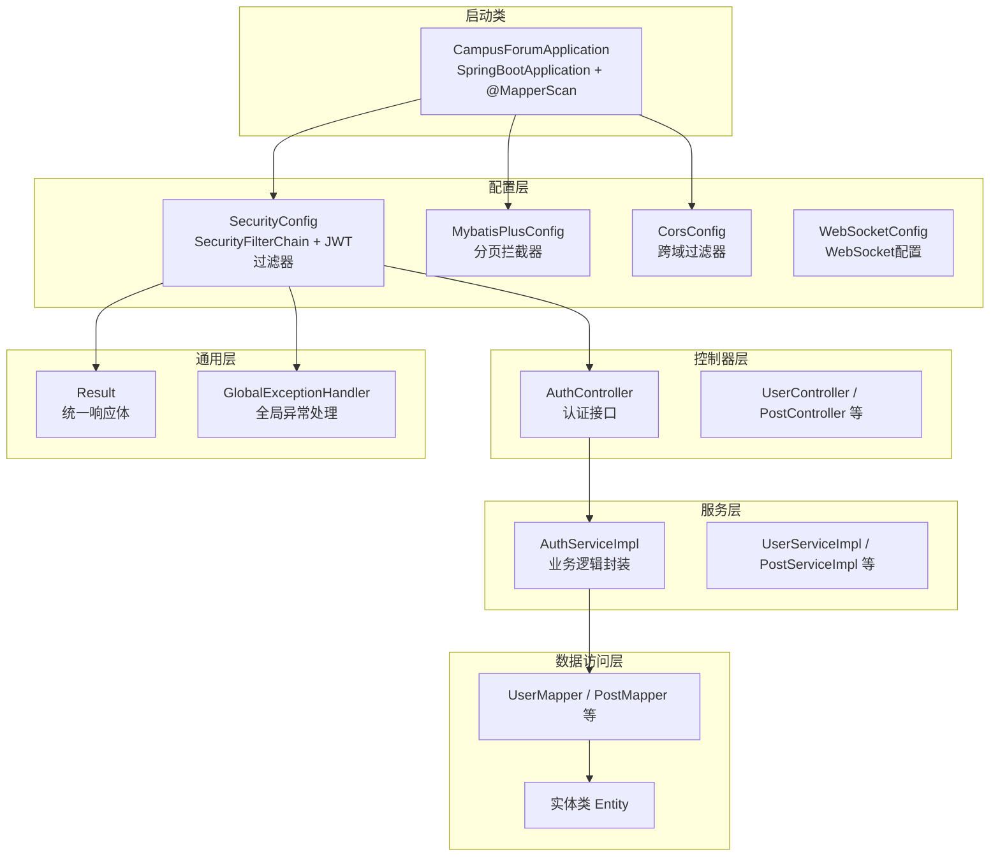
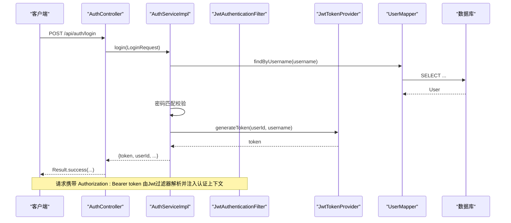
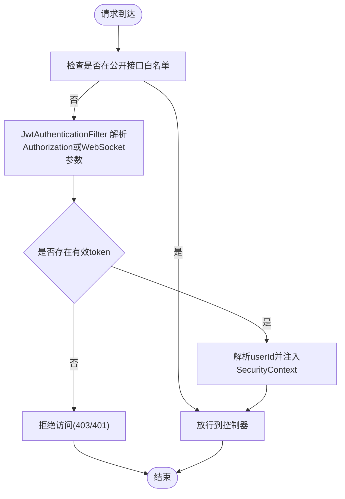
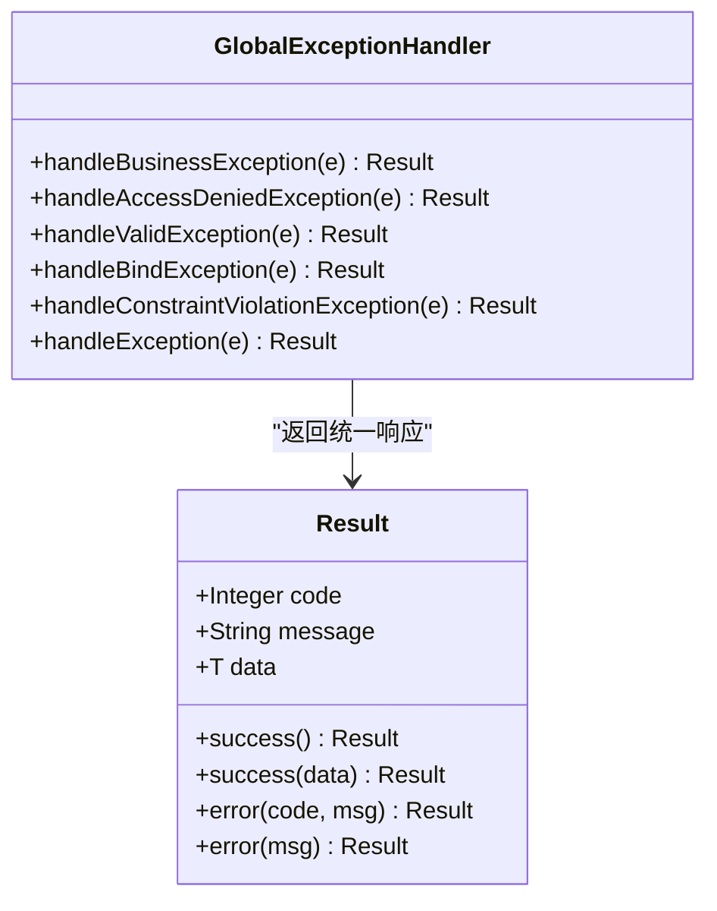
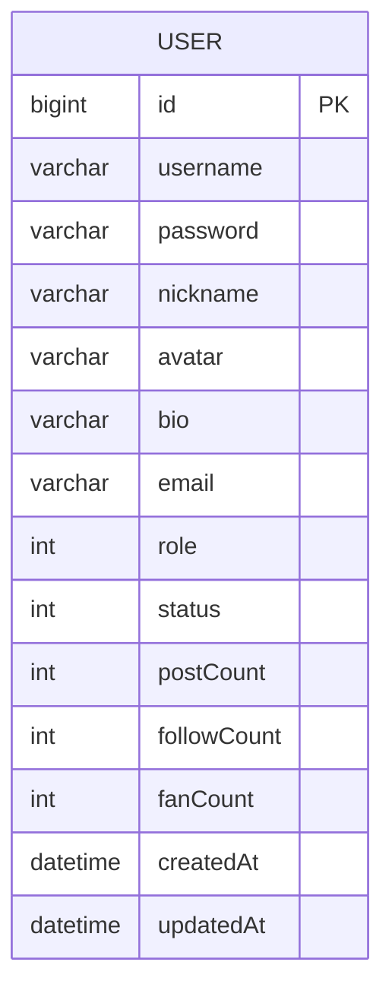
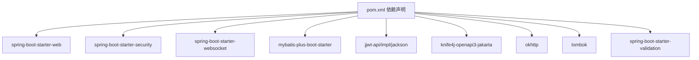

# 后端架构设计

<cite>
**本文档引用的文件**
- [CampusForumApplication.java](file://campus-forum-backend/src/main/java/com/campus/forum/CampusForumApplication.java)
- [application.yml](file://campus-forum-backend/src/main/resources/application.yml)
- [pom.xml](file://campus-forum-backend/pom.xml)
- [GlobalExceptionHandler.java](file://campus-forum-backend/src/main/java/com/campus/forum/common/GlobalExceptionHandler.java)
- [Result.java](file://campus-forum-backend/src/main/java/com/campus/forum/common/Result.java)
- [SecurityConfig.java](file://campus-forum-backend/src/main/java/com/campus/forum/config/SecurityConfig.java)
- [MybatisPlusConfig.java](file://campus-forum-backend/src/main/java/com/campus/forum/config/MybatisPlusConfig.java)
- [CorsConfig.java](file://campus-forum-backend/src/main/java/com/campus/forum/config/CorsConfig.java)
- [JwtAuthenticationFilter.java](file://campus-forum-backend/src/main/java/com/campus/forum/security/JwtAuthenticationFilter.java)
- [JwtTokenProvider.java](file://campus-forum-backend/src/main/java/com/campus/forum/security/JwtTokenProvider.java)
- [AuthController.java](file://campus-forum-backend/src/main/java/com/campus/forum/controller/AuthController.java)
- [AuthServiceImpl.java](file://campus-forum-backend/src/main/java/com/campus/forum/service/impl/AuthServiceImpl.java)
- [UserMapper.java](file://campus-forum-backend/src/main/java/com/campus/forum/mapper/UserMapper.java)
- [User.java](file://campus-forum-backend/src/main/java/com/campus/forum/entity/User.java)
- [LoginRequest.java](file://campus-forum-backend/src/main/java/com/campus/forum/dto/request/LoginRequest.java)
</cite>

## 目录
1. [引言](#引言)
2. [项目结构](#项目结构)
3. [核心组件](#核心组件)
4. [架构总览](#架构总览)
5. [详细组件分析](#详细组件分析)
6. [依赖分析](#依赖分析)
7. [性能考虑](#性能考虑)
8. [故障排除指南](#故障排除指南)
9. [结论](#结论)

## 引言
本设计文档面向PBL项目后端，系统采用Spring Boot 3.2.0 + Spring Security + MyBatis-Plus技术栈，围绕MVC分层与依赖注入进行架构设计。重点覆盖安全配置（JWT认证、密码加密、跨域）、统一响应体与全局异常处理、RESTful API设计原则、服务层业务封装与数据访问层ORM映射策略，并提供架构图与组件交互流程，帮助开发者快速理解与扩展系统。

## 项目结构
后端工程采用标准的分层目录组织：
- common：通用工具与异常处理
- config：安全、MyBatis-Plus、跨域、WebSocket等配置
- controller：REST控制器，按功能模块划分（如认证、用户、帖子、活动等）
- service：业务服务接口与实现
- mapper：MyBatis-Plus Mapper接口
- entity：实体类与表映射
- dto：请求/响应传输对象
- websocket：WebSocket处理器
- resources：配置文件与Mapper XML

图表来源
- [CampusForumApplication.java:10-16](file://campus-forum-backend/src/main/java/com/campus/forum/CampusForumApplication.java#L10-L16)
- [SecurityConfig.java:43-65](file://campus-forum-backend/src/main/java/com/campus/forum/config/SecurityConfig.java#L43-L65)
- [MybatisPlusConfig.java:16-22](file://campus-forum-backend/src/main/java/com/campus/forum/config/MybatisPlusConfig.java#L16-L22)
- [CorsConfig.java:18-30](file://campus-forum-backend/src/main/java/com/campus/forum/config/CorsConfig.java#L18-L30)
- [AuthController.java:22-38](file://campus-forum-backend/src/main/java/com/campus/forum/controller/AuthController.java#L22-L38)
- [AuthServiceImpl.java:22-68](file://campus-forum-backend/src/main/java/com/campus/forum/service/impl/AuthServiceImpl.java#L22-L68)
- [UserMapper.java:9-38](file://campus-forum-backend/src/main/java/com/campus/forum/mapper/UserMapper.java#L9-L38)
- [User.java:10-32](file://campus-forum-backend/src/main/java/com/campus/forum/entity/User.java#L10-L32)
- [Result.java:8-36](file://campus-forum-backend/src/main/java/com/campus/forum/common/Result.java#L8-L36)
- [GlobalExceptionHandler.java:15-56](file://campus-forum-backend/src/main/java/com/campus/forum/common/GlobalExceptionHandler.java#L15-L56)

章节来源
- [CampusForumApplication.java:10-16](file://campus-forum-backend/src/main/java/com/campus/forum/CampusForumApplication.java#L10-L16)
- [application.yml:1-53](file://campus-forum-backend/src/main/resources/application.yml#L1-L53)

## 核心组件
- 统一响应体：Result 提供成功/失败的标准化返回格式，便于前端统一处理。
- 全局异常处理：GlobalExceptionHandler 将业务异常、参数校验异常、鉴权异常与系统异常统一转换为Result格式。
- 安全配置：SecurityConfig 基于SecurityFilterChain定义无状态会话、公开接口白名单、管理员接口授权规则，并集成JWT过滤器。
- JWT认证：JwtTokenProvider 负责签发与校验；JwtAuthenticationFilter 在请求进入时解析并注入认证信息。
- 数据访问：MybatisPlusConfig 注册分页插件；UserMapper 等基于BaseMapper实现CRUD与自定义SQL。
- 跨域配置：CorsConfig 支持前后端分离开发的CORS策略。
- 启动与扫描：CampusForumApplication 使用@SpringBootApplication 与 @MapperScan 扫描Mapper包。

章节来源
- [Result.java:8-36](file://campus-forum-backend/src/main/java/com/campus/forum/common/Result.java#L8-L36)
- [GlobalExceptionHandler.java:15-56](file://campus-forum-backend/src/main/java/com/campus/forum/common/GlobalExceptionHandler.java#L15-L56)
- [SecurityConfig.java:28-65](file://campus-forum-backend/src/main/java/com/campus/forum/config/SecurityConfig.java#L28-L65)
- [JwtTokenProvider.java:21-92](file://campus-forum-backend/src/main/java/com/campus/forum/security/JwtTokenProvider.java#L21-92)
- [JwtAuthenticationFilter.java:25-58](file://campus-forum-backend/src/main/java/com/campus/forum/security/JwtAuthenticationFilter.java#L25-58)
- [MybatisPlusConfig.java:14-23](file://campus-forum-backend/src/main/java/com/campus/forum/config/MybatisPlusConfig.java#L14-L23)
- [CorsConfig.java:15-31](file://campus-forum-backend/src/main/java/com/campus/forum/config/CorsConfig.java#L15-L31)
- [CampusForumApplication.java:10-16](file://campus-forum-backend/src/main/java/com/campus/forum/CampusForumApplication.java#L10-L16)

## 架构总览
系统采用经典的MVC分层架构，结合Spring Security实现无状态认证，MyBatis-Plus提供高效的ORM能力。整体交互流程如下：

图表来源
- [AuthController.java:22-38](file://campus-forum-backend/src/main/java/com/campus/forum/controller/AuthController.java#L22-L38)
- [AuthServiceImpl.java:47-67](file://campus-forum-backend/src/main/java/com/campus/forum/service/impl/AuthServiceImpl.java#L47-L67)
- [JwtAuthenticationFilter.java:30-44](file://campus-forum-backend/src/main/java/com/campus/forum/security/JwtAuthenticationFilter.java#L30-L44)
- [JwtTokenProvider.java:33-43](file://campus-forum-backend/src/main/java/com/campus/forum/security/JwtTokenProvider.java#L33-L43)
- [UserMapper.java:10-13](file://campus-forum-backend/src/main/java/com/campus/forum/mapper/UserMapper.java#L10-L13)

## 详细组件分析

### 安全配置与JWT认证
- 无状态会话：通过 SessionCreationPolicy.STATELESS 禁用会话，确保可扩展性。
- 授权规则：/api/auth/** 公开放行；部分GET接口公开；/api/admin/** 需ADMIN角色；其余需认证。
- 密码加密：BCryptPasswordEncoder 提供强哈希加密策略。
- JWT过滤链：在用户名密码过滤器之前添加 JwtAuthenticationFilter，从Header或WebSocket查询参数解析token并注入认证上下文。
- Token工具：JwtTokenProvider 负责生成、解析与校验，支持从请求头与WebSocket参数两种方式提取token。

图表来源
- [SecurityConfig.java:49-62](file://campus-forum-backend/src/main/java/com/campus/forum/config/SecurityConfig.java#L49-L62)
- [JwtAuthenticationFilter.java:30-57](file://campus-forum-backend/src/main/java/com/campus/forum/security/JwtAuthenticationFilter.java#L30-L57)
- [JwtTokenProvider.java:64-91](file://campus-forum-backend/src/main/java/com/campus/forum/security/JwtTokenProvider.java#L64-L91)

章节来源
- [SecurityConfig.java:28-65](file://campus-forum-backend/src/main/java/com/campus/forum/config/SecurityConfig.java#L28-L65)
- [JwtAuthenticationFilter.java:25-58](file://campus-forum-backend/src/main/java/com/campus/forum/security/JwtAuthenticationFilter.java#L25-L58)
- [JwtTokenProvider.java:21-92](file://campus-forum-backend/src/main/java/com/campus/forum/security/JwtTokenProvider.java#L21-L92)

### 统一响应体与全局异常处理
- 统一响应体：Result 提供 success/error 静态方法，约定code/message/data三段式结构。
- 全局异常处理：针对业务异常、参数校验异常、绑定异常、约束异常与系统异常分别处理，保证对外一致的错误语义与HTTP状态码。

图表来源
- [Result.java:8-36](file://campus-forum-backend/src/main/java/com/campus/forum/common/Result.java#L8-L36)
- [GlobalExceptionHandler.java:15-56](file://campus-forum-backend/src/main/java/com/campus/forum/common/GlobalExceptionHandler.java#L15-L56)

章节来源
- [Result.java:8-36](file://campus-forum-backend/src/main/java/com/campus/forum/common/Result.java#L8-L36)
- [GlobalExceptionHandler.java:15-56](file://campus-forum-backend/src/main/java/com/campus/forum/common/GlobalExceptionHandler.java#L15-L56)

### 控制器层（RESTful API设计）
- 设计原则：资源化命名、幂等性、明确的HTTP方法与状态码、使用DTO接收请求、返回Result封装响应。
- 示例：AuthController 提供 /api/auth/register 与 /api/auth/login，使用Swagger注解标注接口语义。
- 参数校验：通过 @Valid 与 DTO 字段注解（如 @NotBlank）在入站时进行参数校验。

章节来源
- [AuthController.java:18-38](file://campus-forum-backend/src/main/java/com/campus/forum/controller/AuthController.java#L18-L38)
- [LoginRequest.java:7-13](file://campus-forum-backend/src/main/java/com/campus/forum/dto/request/LoginRequest.java#L7-L13)

### 服务层（业务逻辑封装）
- 职责边界：服务层负责编排业务流程、事务控制、与外部依赖交互（如密码编码、Token生成）。
- 示例：AuthServiceImpl 在注册时检查用户名唯一性、使用BCrypt加密密码、持久化用户；在登录时校验凭据并签发JWT。
- 依赖注入：通过构造器注入 UserMapper、PasswordEncoder、JwtTokenProvider，遵循不可变与可测试原则。

章节来源
- [AuthServiceImpl.java:22-68](file://campus-forum-backend/src/main/java/com/campus/forum/service/impl/AuthServiceImpl.java#L22-L68)

### 数据访问层（MyBatis-Plus ORM）
- 配置：MybatisPlusConfig 注册分页插件，确保分页生效。
- 映射策略：UserMapper 继承 BaseMapper，自动获得常用CRUD；同时提供自定义SQL方法（如按用户名查找、关注/取消关注、分页查询粉丝/关注列表等）。
- 实体映射：User 实体通过注解映射表字段，使用自动填充策略维护创建/更新时间。

图表来源
- [User.java:10-32](file://campus-forum-backend/src/main/java/com/campus/forum/entity/User.java#L10-L32)

章节来源
- [MybatisPlusConfig.java:14-23](file://campus-forum-backend/src/main/java/com/campus/forum/config/MybatisPlusConfig.java#L14-L23)
- [UserMapper.java:9-38](file://campus-forum-backend/src/main/java/com/campus/forum/mapper/UserMapper.java#L9-L38)
- [User.java:10-32](file://campus-forum-backend/src/main/java/com/campus/forum/entity/User.java#L10-L32)

### 跨域配置
- CORS策略：允许任意源、所有方法与头部、允许凭证、预检缓存1小时，覆盖所有路径。
- 适用场景：前后端分离开发，解决浏览器同源策略限制。

章节来源
- [CorsConfig.java:15-31](file://campus-forum-backend/src/main/java/com/campus/forum/config/CorsConfig.java#L15-L31)

### 启动与组件扫描
- 启动类：CampusForumApplication 使用 @SpringBootApplication 与 @MapperScan("com.campus.forum.mapper") 自动扫描Mapper包。
- 应用配置：application.yml 定义服务器端口、数据源、MyBatis-Plus、JWT密钥与过期时间、AI Provider、文件上传路径、Knife4j开关等。

章节来源
- [CampusForumApplication.java:10-16](file://campus-forum-backend/src/main/java/com/campus/forum/CampusForumApplication.java#L10-L16)
- [application.yml:1-53](file://campus-forum-backend/src/main/resources/application.yml#L1-L53)

## 依赖分析
- Spring Boot Starter：web、security、websocket、validation、test、security-test
- MyBatis-Plus：持久层增强、分页插件
- JWT：jjwt-api/impl/jackson
- Knife4j：OpenAPI文档增强
- OkHttp3：AI接口调用
- Lombok：简化实体与DTO代码

图表来源
- [pom.xml:27-116](file://campus-forum-backend/pom.xml#L27-L116)

章节来源
- [pom.xml:20-25](file://campus-forum-backend/pom.xml#L20-L25)
- [pom.xml:27-116](file://campus-forum-backend/pom.xml#L27-L116)

## 性能考虑
- 分页优化：启用MyBatis-Plus分页插件，避免一次性加载全量数据。
- 缓存策略：可在高频读取的接口引入Redis缓存（建议），降低数据库压力。
- 连接池与超时：合理配置数据源连接数与SQL执行超时，避免慢查询拖垮服务。
- 日志与监控：开启必要的SQL日志与接口耗时埋点，配合APM工具定位瓶颈。
- JWT负载：尽量精简token中的声明，避免过大影响网络传输与解析性能。

## 故障排除指南
- 登录失败：检查用户名是否存在、密码是否匹配、账户状态是否正常。
- 未登录或Token过期：确认请求头是否包含 Authorization: Bearer token 或WebSocket参数token是否正确传递。
- 参数校验失败：查看DTO字段注解与校验消息，修正请求体内容。
- 权限不足：确认用户角色是否具备访问 /api/admin/** 的ADMIN权限。
- 跨域问题：确认CORS配置是否允许当前域名与方法，预检请求是否通过。

章节来源
- [AuthServiceImpl.java:47-67](file://campus-forum-backend/src/main/java/com/campus/forum/service/impl/AuthServiceImpl.java#L47-L67)
- [JwtTokenProvider.java:64-91](file://campus-forum-backend/src/main/java/com/campus/forum/security/JwtTokenProvider.java#L64-L91)
- [GlobalExceptionHandler.java:19-55](file://campus-forum-backend/src/main/java/com/campus/forum/common/GlobalExceptionHandler.java#L19-L55)
- [SecurityConfig.java:49-62](file://campus-forum-backend/src/main/java/com/campus/forum/config/SecurityConfig.java#L49-L62)
- [CorsConfig.java:18-30](file://campus-forum-backend/src/main/java/com/campus/forum/config/CorsConfig.java#L18-L30)

## 结论
本项目后端以Spring Boot为核心，结合Spring Security与JWT实现无状态认证，MyBatis-Plus提供高效的数据访问能力。通过统一响应体与全局异常处理提升一致性与可观测性，MVC分层清晰、职责明确，适合在高并发与多团队协作场景下演进。后续可在缓存、限流、监控与可观测性方面进一步完善。