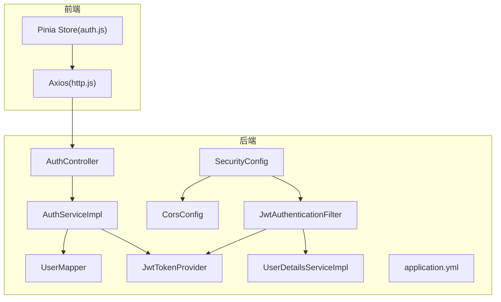
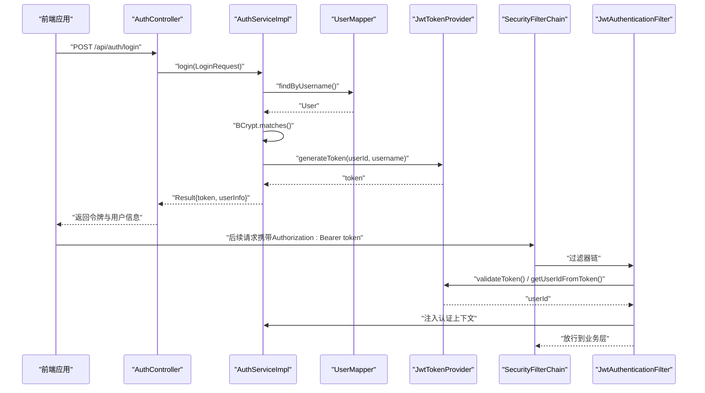
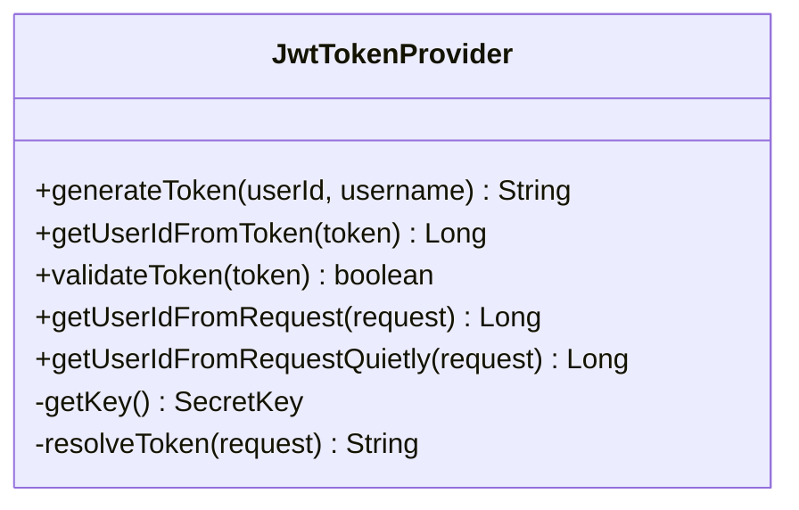
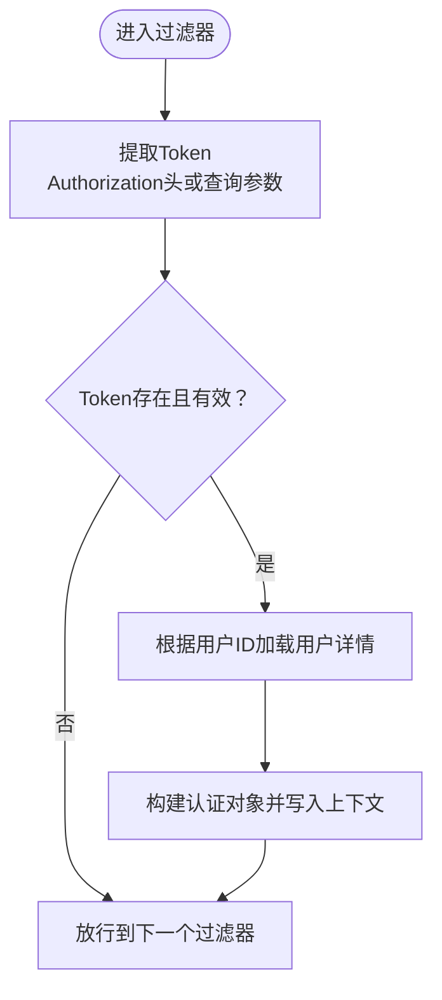
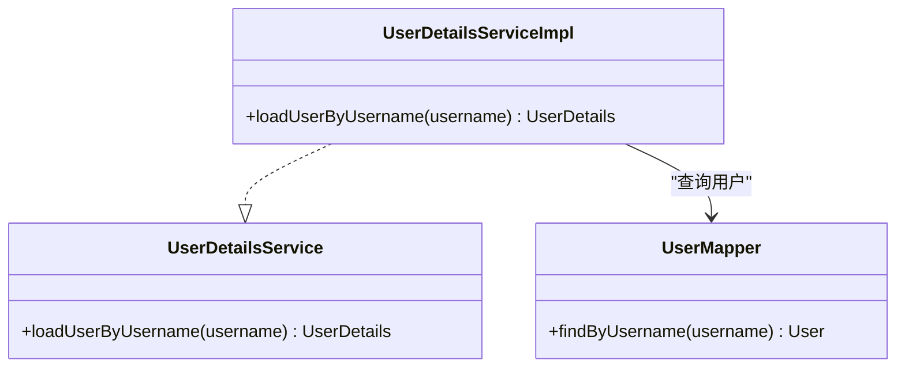
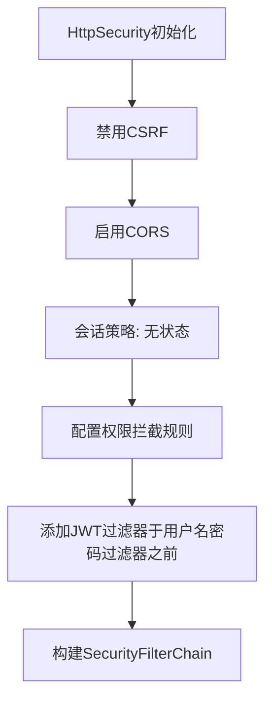
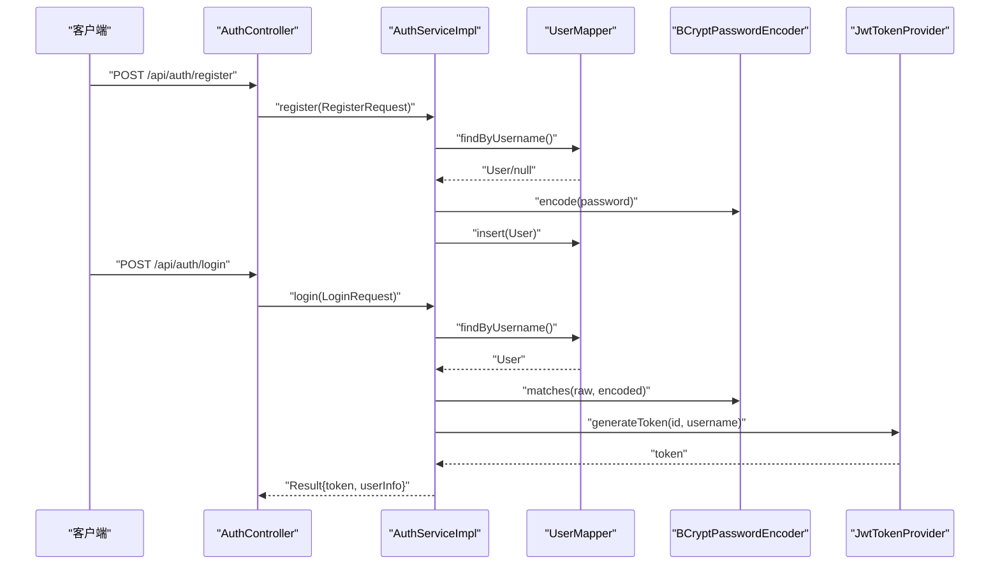
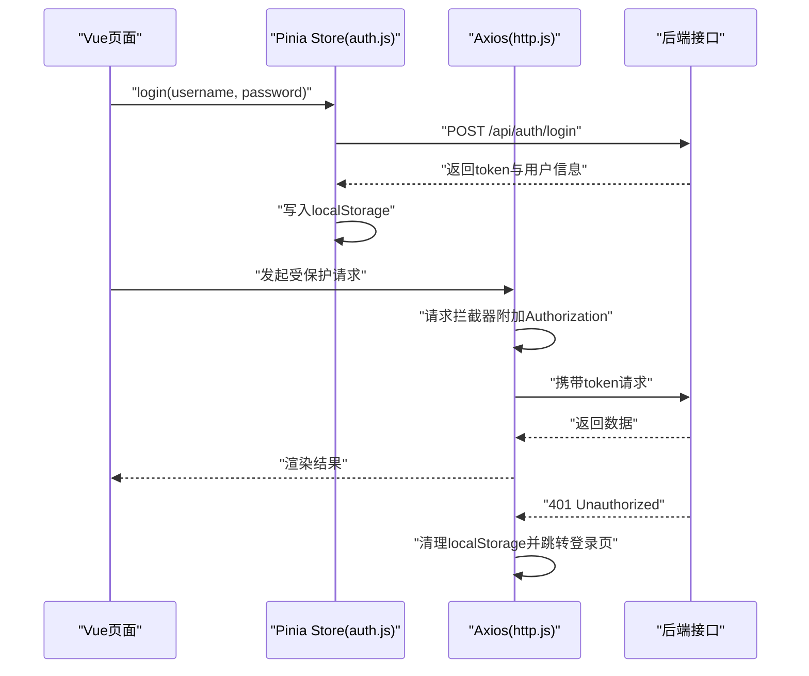
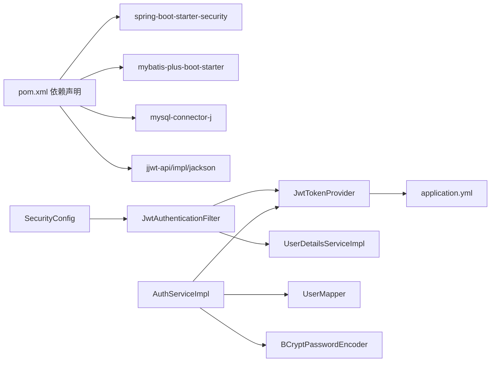
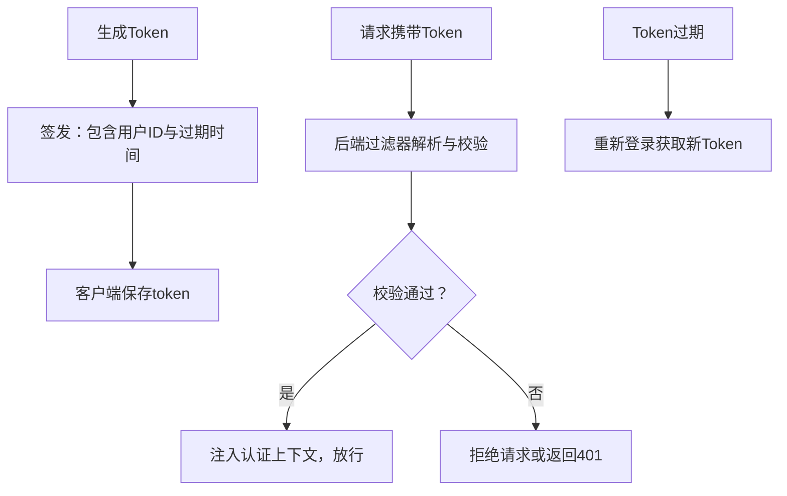

# 安全认证系统

<cite>
**本文引用的文件**
- [JwtTokenProvider.java](file://campus-forum-backend/src/main/java/com/campus/forum/security/JwtTokenProvider.java)
- [JwtAuthenticationFilter.java](file://campus-forum-backend/src/main/java/com/campus/forum/security/JwtAuthenticationFilter.java)
- [UserDetailsServiceImpl.java](file://campus-forum-backend/src/main/java/com/campus/forum/security/UserDetailsServiceImpl.java)
- [SecurityConfig.java](file://campus-forum-backend/src/main/java/com/campus/forum/config/SecurityConfig.java)
- [CorsConfig.java](file://campus-forum-backend/src/main/java/com/campus/forum/config/CorsConfig.java)
- [application.yml](file://campus-forum-backend/src/main/resources/application.yml)
- [AuthController.java](file://campus-forum-backend/src/main/java/com/campus/forum/controller/AuthController.java)
- [AuthServiceImpl.java](file://campus-forum-backend/src/main/java/com/campus/forum/service/impl/AuthServiceImpl.java)
- [UserMapper.java](file://campus-forum-backend/src/main/java/com/campus/forum/mapper/UserMapper.java)
- [BusinessException.java](file://campus-forum-backend/src/main/java/com/campus/forum/common/exception/BusinessException.java)
- [Result.java](file://campus-forum-backend/src/main/java/com/campus/forum/common/Result.java)
- [LoginRequest.java](file://campus-forum-backend/src/main/java/com/campus/forum/dto/request/LoginRequest.java)
- [RegisterRequest.java](file://campus-forum-backend/src/main/java/com/campus/forum/dto/request/RegisterRequest.java)
- [auth.js](file://campus-forum-frontend/src/stores/auth.js)
- [http.js](file://campus-forum-frontend/src/api/http.js)
- [auth.js](file://campus-forum-frontend/src/api/auth.js)
- [pom.xml](file://campus-forum-backend/pom.xml)
</cite>

## 目录
1. [简介](#简介)
2. [项目结构](#项目结构)
3. [核心组件](#核心组件)
4. [架构总览](#架构总览)
5. [详细组件分析](#详细组件分析)
6. [依赖分析](#依赖分析)
7. [性能考虑](#性能考虑)
8. [故障排查指南](#故障排查指南)
9. [结论](#结论)
10. [附录](#附录)

## 简介
本文件面向PBL项目的“安全认证系统”，围绕JWT认证机制与Spring Security安全配置进行系统化技术说明。内容涵盖：
- JWT Token生成、验证与提取流程
- Spring Security配置策略（HTTP安全、权限拦截、CORS）
- 密码加密策略（BCrypt）与用户详情服务实现
- 认证流程图与时序图
- 前后端Token传递最佳实践与安全注意事项
- 常见安全问题与解决方案

## 项目结构
后端采用分层架构，安全相关代码集中在以下模块：
- 安全工具与过滤器：JwtTokenProvider、JwtAuthenticationFilter
- 用户认证与授权：UserDetailsServiceImpl、SecurityConfig
- 认证接口与服务：AuthController、AuthServiceImpl
- 配置与基础设施：CorsConfig、application.yml
- 数据访问：UserMapper
- 统一响应与异常：Result、BusinessException
- 前端认证状态与HTTP拦截器：Pinia Store、Axios拦截器

图表来源
- [AuthController.java:1-39](file://campus-forum-backend/src/main/java/com/campus/forum/controller/AuthController.java#L1-L39)
- [AuthServiceImpl.java:1-69](file://campus-forum-backend/src/main/java/com/campus/forum/service/impl/AuthServiceImpl.java#L1-L69)
- [UserDetailsServiceImpl.java:1-35](file://campus-forum-backend/src/main/java/com/campus/forum/security/UserDetailsServiceImpl.java#L1-L35)
- [JwtTokenProvider.java:1-93](file://campus-forum-backend/src/main/java/com/campus/forum/security/JwtTokenProvider.java#L1-L93)
- [JwtAuthenticationFilter.java:1-59](file://campus-forum-backend/src/main/java/com/campus/forum/security/JwtAuthenticationFilter.java#L1-L59)
- [SecurityConfig.java:1-67](file://campus-forum-backend/src/main/java/com/campus/forum/config/SecurityConfig.java#L1-L67)
- [CorsConfig.java:1-32](file://campus-forum-backend/src/main/java/com/campus/forum/config/CorsConfig.java#L1-L32)
- [UserMapper.java:1-39](file://campus-forum-backend/src/main/java/com/campus/forum/mapper/UserMapper.java#L1-L39)
- [application.yml:1-53](file://campus-forum-backend/src/main/resources/application.yml#L1-L53)
- [auth.js:1-37](file://campus-forum-frontend/src/stores/auth.js#L1-L37)
- [http.js:1-41](file://campus-forum-frontend/src/api/http.js#L1-L41)

章节来源
- [SecurityConfig.java:1-67](file://campus-forum-backend/src/main/java/com/campus/forum/config/SecurityConfig.java#L1-L67)
- [CorsConfig.java:1-32](file://campus-forum-backend/src/main/java/com/campus/forum/config/CorsConfig.java#L1-L32)
- [application.yml:1-53](file://campus-forum-backend/src/main/resources/application.yml#L1-L53)

## 核心组件
- JWT工具：负责密钥构建、Token生成、解析与校验，并从请求头或URL参数中提取Token。
- 认证过滤器：在请求进入业务逻辑前，从Authorization头或WebSocket查询参数中提取Token，校验后将认证信息写入SecurityContext。
- 用户详情服务：根据用户ID加载用户实体及角色，供认证与授权使用。
- 安全配置：禁用CSRF、启用方法级安全、配置会话策略为无状态、定义公开与受保护接口、注入JWT过滤器。
- 认证服务：注册时使用BCrypt加密密码；登录时校验凭据并签发JWT。
- 前端拦截器：请求自动附加Authorization头，响应统一错误处理与401跳转。

章节来源
- [JwtTokenProvider.java:1-93](file://campus-forum-backend/src/main/java/com/campus/forum/security/JwtTokenProvider.java#L1-L93)
- [JwtAuthenticationFilter.java:1-59](file://campus-forum-backend/src/main/java/com/campus/forum/security/JwtAuthenticationFilter.java#L1-L59)
- [UserDetailsServiceImpl.java:1-35](file://campus-forum-backend/src/main/java/com/campus/forum/security/UserDetailsServiceImpl.java#L1-L35)
- [SecurityConfig.java:1-67](file://campus-forum-backend/src/main/java/com/campus/forum/config/SecurityConfig.java#L1-L67)
- [AuthServiceImpl.java:1-69](file://campus-forum-backend/src/main/java/com/campus/forum/service/impl/AuthServiceImpl.java#L1-L69)
- [http.js:1-41](file://campus-forum-frontend/src/api/http.js#L1-L41)

## 架构总览
下图展示认证系统的整体交互：前端发起登录/注册请求，后端完成凭据校验与密码加密，签发JWT；后续请求由前端自动携带Token，后端通过过滤器解析并注入认证上下文。

图表来源
- [AuthController.java:1-39](file://campus-forum-backend/src/main/java/com/campus/forum/controller/AuthController.java#L1-L39)
- [AuthServiceImpl.java:1-69](file://campus-forum-backend/src/main/java/com/campus/forum/service/impl/AuthServiceImpl.java#L1-L69)
- [UserMapper.java:1-39](file://campus-forum-backend/src/main/java/com/campus/forum/mapper/UserMapper.java#L1-L39)
- [JwtTokenProvider.java:1-93](file://campus-forum-backend/src/main/java/com/campus/forum/security/JwtTokenProvider.java#L1-L93)
- [JwtAuthenticationFilter.java:1-59](file://campus-forum-backend/src/main/java/com/campus/forum/security/JwtAuthenticationFilter.java#L1-L59)
- [SecurityConfig.java:1-67](file://campus-forum-backend/src/main/java/com/campus/forum/config/SecurityConfig.java#L1-L67)

## 详细组件分析

### JWT工具类（JwtTokenProvider）
- 密钥管理：基于配置文件中的密钥字符串生成对称密钥。
- Token生成：包含用户ID与用户名声明、签发时间与过期时间，并使用HMAC签名。
- Token解析与校验：解析签名载荷，校验签名有效性；提供从请求中提取Token的方法（支持Authorization头与WebSocket查询参数）。
- 异常处理：当请求中Token缺失或无效时，可抛出业务异常或静默返回空ID（用于匿名行为记录）。

图表来源
- [JwtTokenProvider.java:1-93](file://campus-forum-backend/src/main/java/com/campus/forum/security/JwtTokenProvider.java#L1-L93)

章节来源
- [JwtTokenProvider.java:1-93](file://campus-forum-backend/src/main/java/com/campus/forum/security/JwtTokenProvider.java#L1-L93)
- [application.yml:30-34](file://campus-forum-backend/src/main/resources/application.yml#L30-L34)

### 认证过滤器（JwtAuthenticationFilter）
- 在每个请求进入业务层之前执行，从Authorization头或WebSocket查询参数中提取Token。
- 校验通过后，根据用户ID加载用户详情，构造认证对象并写入SecurityContext。
- 放行至后续过滤器与控制器。

图表来源
- [JwtAuthenticationFilter.java:1-59](file://campus-forum-backend/src/main/java/com/campus/forum/security/JwtAuthenticationFilter.java#L1-L59)
- [JwtTokenProvider.java:1-93](file://campus-forum-backend/src/main/java/com/campus/forum/security/JwtTokenProvider.java#L1-L93)
- [UserDetailsServiceImpl.java:1-35](file://campus-forum-backend/src/main/java/com/campus/forum/security/UserDetailsServiceImpl.java#L1-L35)

章节来源
- [JwtAuthenticationFilter.java:1-59](file://campus-forum-backend/src/main/java/com/campus/forum/security/JwtAuthenticationFilter.java#L1-L59)

### 用户详情服务（UserDetailsServiceImpl）
- 根据用户ID加载用户实体，映射角色（管理员/普通用户），返回Spring Security标准用户对象。
- 若用户不存在则抛出认证异常。

图表来源
- [UserDetailsServiceImpl.java:1-35](file://campus-forum-backend/src/main/java/com/campus/forum/security/UserDetailsServiceImpl.java#L1-L35)
- [UserMapper.java:1-39](file://campus-forum-backend/src/main/java/com/campus/forum/mapper/UserMapper.java#L1-L39)

章节来源
- [UserDetailsServiceImpl.java:1-35](file://campus-forum-backend/src/main/java/com/campus/forum/security/UserDetailsServiceImpl.java#L1-L35)
- [UserMapper.java:1-39](file://campus-forum-backend/src/main/java/com/campus/forum/mapper/UserMapper.java#L1-L39)

### Spring Security配置（SecurityConfig）
- 禁用CSRF与跨域预检（通过CorsFilter或HttpSecurity CORS配置），会话策略设为STATELESS。
- 权限规则：
  - 公开接口：认证、部分查询接口、Swagger等。
  - 管理员接口：仅ADMIN角色。
  - 其余接口均需认证。
- 注入JWT过滤器，确保在用户名密码过滤器之前执行。

图表来源
- [SecurityConfig.java:1-67](file://campus-forum-backend/src/main/java/com/campus/forum/config/SecurityConfig.java#L1-L67)
- [CorsConfig.java:1-32](file://campus-forum-backend/src/main/java/com/campus/forum/config/CorsConfig.java#L1-L32)

章节来源
- [SecurityConfig.java:1-67](file://campus-forum-backend/src/main/java/com/campus/forum/config/SecurityConfig.java#L1-L67)
- [CorsConfig.java:1-32](file://campus-forum-backend/src/main/java/com/campus/forum/config/CorsConfig.java#L1-L32)

### 认证服务（AuthServiceImpl）
- 注册：检查用户名唯一性，使用BCrypt加密密码后入库。
- 登录：校验用户存在性与密码，检查账户状态，签发JWT并返回用户信息。

图表来源
- [AuthController.java:1-39](file://campus-forum-backend/src/main/java/com/campus/forum/controller/AuthController.java#L1-L39)
- [AuthServiceImpl.java:1-69](file://campus-forum-backend/src/main/java/com/campus/forum/service/impl/AuthServiceImpl.java#L1-L69)
- [UserMapper.java:1-39](file://campus-forum-backend/src/main/java/com/campus/forum/mapper/UserMapper.java#L1-L39)
- [SecurityConfig.java:1-67](file://campus-forum-backend/src/main/java/com/campus/forum/config/SecurityConfig.java#L1-L67)

章节来源
- [AuthServiceImpl.java:1-69](file://campus-forum-backend/src/main/java/com/campus/forum/service/impl/AuthServiceImpl.java#L1-L69)
- [LoginRequest.java:1-14](file://campus-forum-backend/src/main/java/com/campus/forum/dto/request/LoginRequest.java#L1-L14)
- [RegisterRequest.java:1-22](file://campus-forum-backend/src/main/java/com/campus/forum/dto/request/RegisterRequest.java#L1-L22)

### 前端认证与HTTP拦截
- Pinia Store：维护token与用户信息，登录成功后持久化到localStorage。
- Axios拦截器：请求自动附加Authorization头；响应401时清理本地存储并跳转登录页。

图表来源
- [auth.js:1-37](file://campus-forum-frontend/src/stores/auth.js#L1-L37)
- [http.js:1-41](file://campus-forum-frontend/src/api/http.js#L1-L41)
- [auth.js:1-4](file://campus-forum-frontend/src/api/auth.js#L1-L4)

章节来源
- [auth.js:1-37](file://campus-forum-frontend/src/stores/auth.js#L1-L37)
- [http.js:1-41](file://campus-forum-frontend/src/api/http.js#L1-L41)

## 依赖分析
- 外部依赖：Spring Security、MyBatis-Plus、MySQL驱动、JWT库（jjwt-api/impl/jackson）、WebSocket。
- 内部依赖：SecurityConfig依赖JwtAuthenticationFilter；JwtAuthenticationFilter依赖JwtTokenProvider与UserDetailsServiceImpl；AuthServiceImpl依赖UserMapper与BCryptPasswordEncoder；JwtTokenProvider依赖application.yml中的JWT配置。

图表来源
- [pom.xml:37-78](file://campus-forum-backend/pom.xml#L37-L78)
- [SecurityConfig.java:1-67](file://campus-forum-backend/src/main/java/com/campus/forum/config/SecurityConfig.java#L1-L67)
- [JwtAuthenticationFilter.java:1-59](file://campus-forum-backend/src/main/java/com/campus/forum/security/JwtAuthenticationFilter.java#L1-L59)
- [JwtTokenProvider.java:1-93](file://campus-forum-backend/src/main/java/com/campus/forum/security/JwtTokenProvider.java#L1-L93)
- [UserDetailsServiceImpl.java:1-35](file://campus-forum-backend/src/main/java/com/campus/forum/security/UserDetailsServiceImpl.java#L1-L35)
- [AuthServiceImpl.java:1-69](file://campus-forum-backend/src/main/java/com/campus/forum/service/impl/AuthServiceImpl.java#L1-L69)
- [UserMapper.java:1-39](file://campus-forum-backend/src/main/java/com/campus/forum/mapper/UserMapper.java#L1-L39)
- [application.yml:30-34](file://campus-forum-backend/src/main/resources/application.yml#L30-L34)

章节来源
- [pom.xml:37-78](file://campus-forum-backend/pom.xml#L37-L78)

## 性能考虑
- 无状态会话：禁用会话、使用JWT，避免服务器端会话存储开销。
- 过滤器链短路：JWT校验失败直接拒绝，减少后续处理。
- 密钥与签名：HMAC-SHA对称密钥计算简单，适合高并发场景；建议定期轮换密钥并限制Token有效期。
- 查询优化：UserMapper按用户名与ID快速检索用户，避免N+1查询。

## 故障排查指南
- 401未认证
  - 检查前端是否正确在请求头附加Authorization头。
  - 检查后端过滤器是否能从请求中提取Token。
  - 检查Token是否过期或被篡改。
- 用户名或密码错误
  - 确认BCrypt匹配逻辑与数据库中加密密码一致。
  - 检查用户状态是否被禁用。
- CORS跨域问题
  - 确认CORS配置允许来源、方法与头部。
  - 后端同时配置了CorsFilter与HttpSecurity CORS，确保两者不冲突。
- WebSocket鉴权
  - 由于浏览器限制，WebSocket握手阶段无法设置自定义Header，需通过URL查询参数传递token并在后端读取。

章节来源
- [http.js:1-41](file://campus-forum-frontend/src/api/http.js#L1-L41)
- [JwtAuthenticationFilter.java:1-59](file://campus-forum-backend/src/main/java/com/campus/forum/security/JwtAuthenticationFilter.java#L1-L59)
- [AuthServiceImpl.java:1-69](file://campus-forum-backend/src/main/java/com/campus/forum/service/impl/AuthServiceImpl.java#L1-L69)
- [CorsConfig.java:1-32](file://campus-forum-backend/src/main/java/com/campus/forum/config/CorsConfig.java#L1-L32)

## 结论
该安全认证系统以JWT为核心，结合Spring Security的无状态认证与细粒度权限控制，配合前端Axios拦截器与Pinia状态管理，实现了前后端分离场景下的高效、可扩展认证方案。通过明确的权限规则、严格的密码加密策略与完善的异常处理，系统具备良好的安全性与可维护性。

## 附录

### JWT认证流程图（生成、验证、刷新）

图表来源
- [JwtTokenProvider.java:1-93](file://campus-forum-backend/src/main/java/com/campus/forum/security/JwtTokenProvider.java#L1-L93)
- [JwtAuthenticationFilter.java:1-59](file://campus-forum-backend/src/main/java/com/campus/forum/security/JwtAuthenticationFilter.java#L1-L59)
- [AuthServiceImpl.java:1-69](file://campus-forum-backend/src/main/java/com/campus/forum/service/impl/AuthServiceImpl.java#L1-L69)

### 安全配置要点清单
- 禁用CSRF，启用CORS
- 会话策略：STATELESS
- 权限规则：公开接口、管理员接口、其余接口需认证
- 注入JWT过滤器，优先于用户名密码过滤器

章节来源
- [SecurityConfig.java:1-67](file://campus-forum-backend/src/main/java/com/campus/forum/config/SecurityConfig.java#L1-L67)
- [CorsConfig.java:1-32](file://campus-forum-backend/src/main/java/com/campus/forum/config/CorsConfig.java#L1-L32)

### 前后端Token传递最佳实践
- 前端：统一在请求头添加Authorization: Bearer token；401时清理本地存储并跳转登录页。
- 后端：优先从Authorization头解析，WebSocket场景从URL查询参数解析；严格校验签名与过期时间。
- 安全建议：HTTPS传输、短Token有效期、定期轮换密钥、避免在日志中输出完整Token。

章节来源
- [http.js:1-41](file://campus-forum-frontend/src/api/http.js#L1-L41)
- [JwtTokenProvider.java:1-93](file://campus-forum-backend/src/main/java/com/campus/forum/security/JwtTokenProvider.java#L1-L93)
- [application.yml:30-34](file://campus-forum-backend/src/main/resources/application.yml#L30-L34)