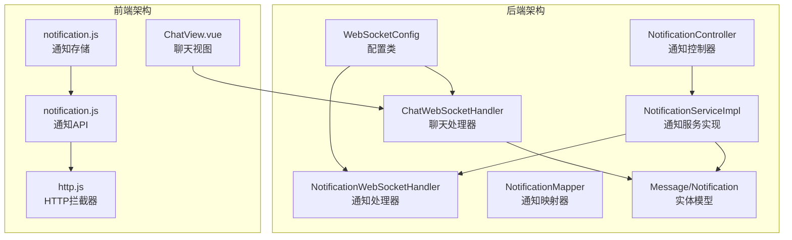
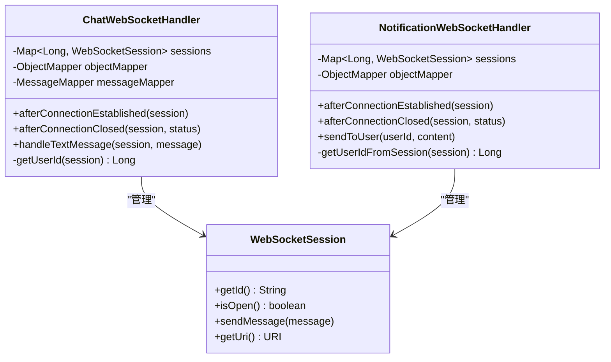
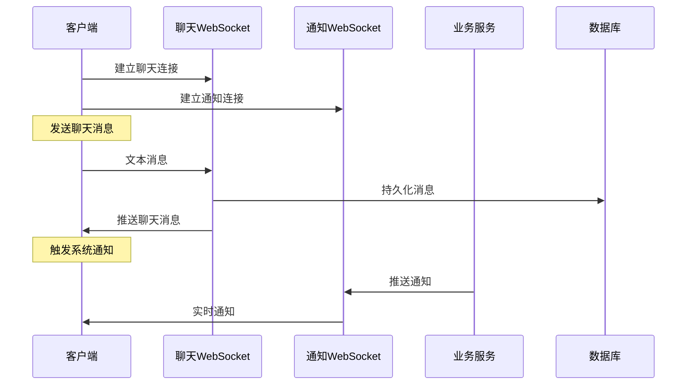
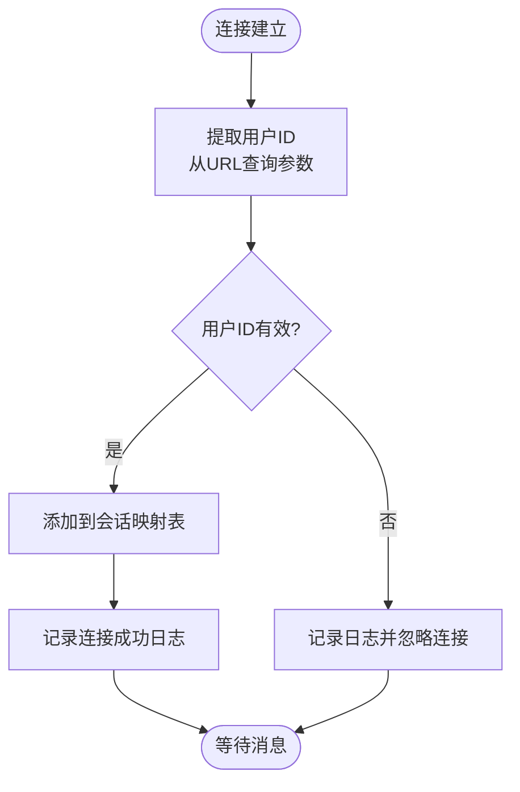
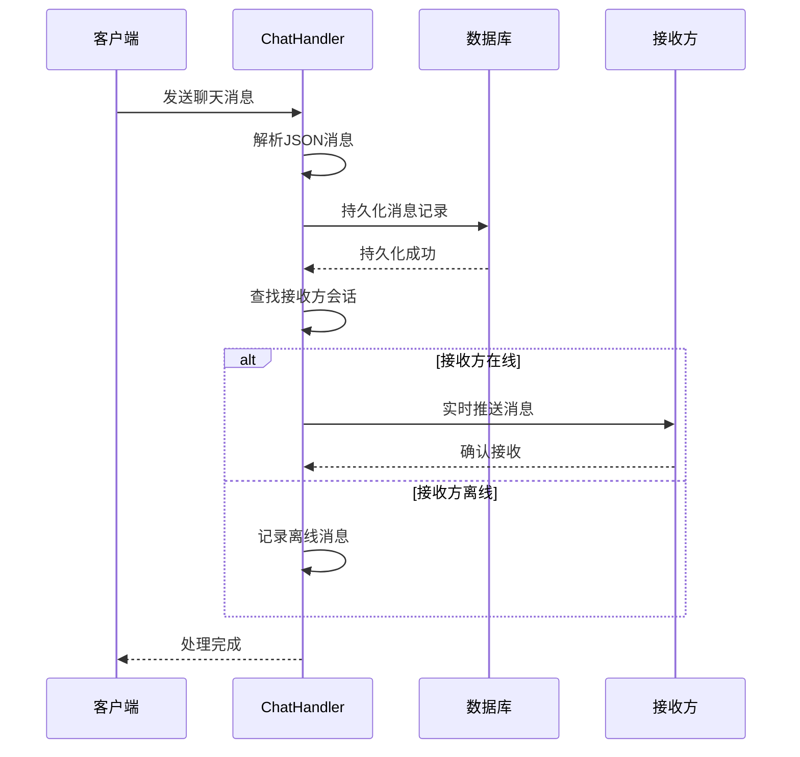
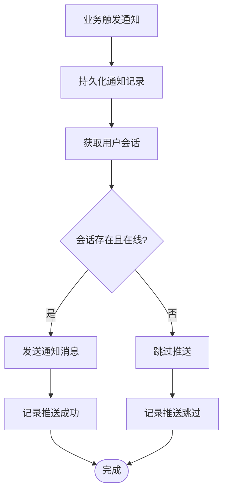
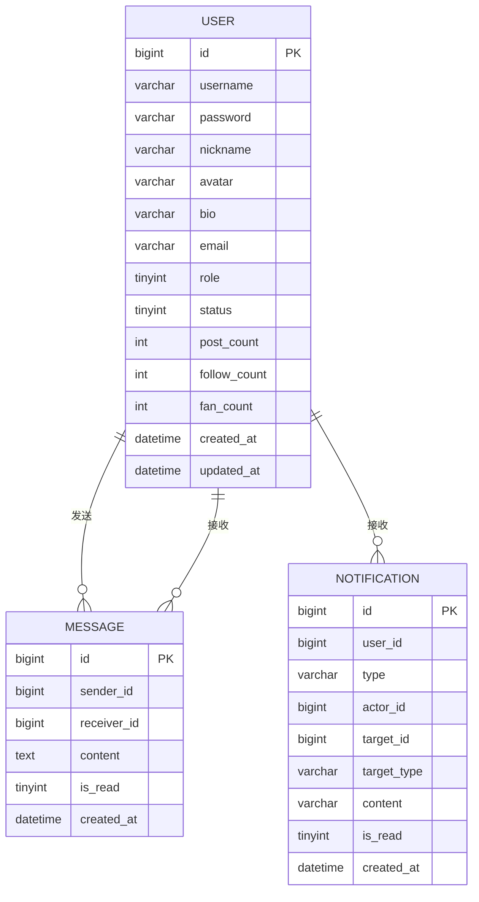
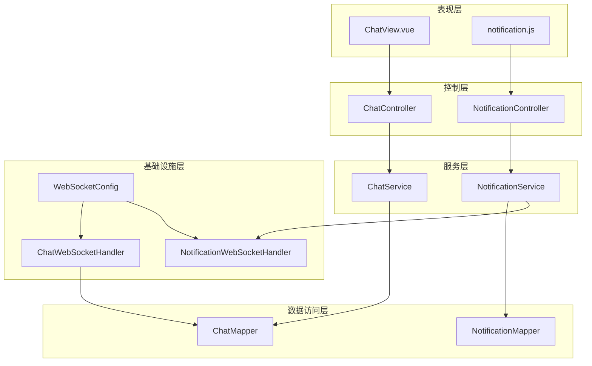
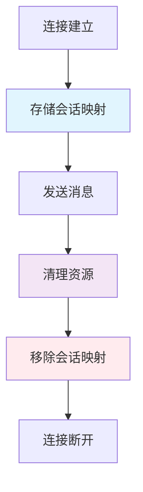

# 实时通信系统

<cite>
**本文档引用的文件**
- [WebSocketConfig.java](file://campus-forum-backend/src/main/java/com/campus/forum/config/WebSocketConfig.java)
- [ChatWebSocketHandler.java](file://campus-forum-backend/src/main/java/com/campus/forum/websocket/ChatWebSocketHandler.java)
- [NotificationWebSocketHandler.java](file://campus-forum-backend/src/main/java/com/campus/forum/websocket/NotificationWebSocketHandler.java)
- [NotificationServiceImpl.java](file://campus-forum-backend/src/main/java/com/campus/forum/service/impl/NotificationServiceImpl.java)
- [NotificationController.java](file://campus-forum-backend/src/main/java/com/campus/forum/controller/NotificationController.java)
- [NotificationMapper.java](file://campus-forum-backend/src/main/java/com/campus/forum/mapper/NotificationMapper.java)
- [Message.java](file://campus-forum-backend/src/main/java/com/campus/forum/entity/Message.java)
- [Notification.java](file://campus-forum-backend/src/main/java/com/campus/forum/entity/Notification.java)
- [ChatView.vue](file://campus-forum-frontend/src/views/ChatView.vue)
- [notification.js](file://campus-forum-frontend/src/stores/notification.js)
- [notification.js](file://campus-forum-frontend/src/api/notification.js)
- [http.js](file://campus-forum-frontend/src/api/http.js)
- [init.sql](file://campus-forum-backend/docs/db/init.sql)
</cite>

## 目录
1. [引言](#引言)
2. [项目结构](#项目结构)
3. [核心组件](#核心组件)
4. [架构概览](#架构概览)
5. [详细组件分析](#详细组件分析)
6. [依赖关系分析](#依赖关系分析)
7. [性能考虑](#性能考虑)
8. [故障排除指南](#故障排除指南)
9. [结论](#结论)
10. [附录](#附录)

## 引言

本文件为PBL项目实时通信系统的全面技术文档，专注于WebSocket配置策略、连接管理机制以及两个核心WebSocket处理器的实现细节。系统采用Spring WebSocket框架构建，提供私信聊天和系统通知两大实时通信功能。本文档将深入分析消息格式设计、事件处理流程、连接生命周期管理、并发处理策略以及错误恢复机制，并提供开发指南和最佳实践建议。

## 项目结构

实时通信系统在后端采用分层架构，在前端采用Vue.js单页应用架构。整体结构如下：



**图表来源**
- [WebSocketConfig.java:1-28](file://campus-forum-backend/src/main/java/com/campus/forum/config/WebSocketConfig.java#L1-L28)
- [ChatWebSocketHandler.java:1-89](file://campus-forum-backend/src/main/java/com/campus/forum/websocket/ChatWebSocketHandler.java#L1-L89)
- [NotificationWebSocketHandler.java:1-78](file://campus-forum-backend/src/main/java/com/campus/forum/websocket/NotificationWebSocketHandler.java#L1-L78)

**章节来源**
- [WebSocketConfig.java:1-28](file://campus-forum-backend/src/main/java/com/campus/forum/config/WebSocketConfig.java#L1-L28)
- [ChatWebSocketHandler.java:1-89](file://campus-forum-backend/src/main/java/com/campus/forum/websocket/ChatWebSocketHandler.java#L1-L89)
- [NotificationWebSocketHandler.java:1-78](file://campus-forum-backend/src/main/java/com/campus/forum/websocket/NotificationWebSocketHandler.java#L1-L78)

## 核心组件

### WebSocket配置管理

系统通过WebSocketConfig类统一管理WebSocket处理器的注册和配置。该配置类实现了WebSocketConfigurer接口，提供了两个WebSocket端点：

- `/ws/chat` - 私信聊天WebSocket端点
- `/ws/notify` - 系统通知WebSocket端点

配置特点：
- 使用通配符允许所有域名访问（setAllowedOriginPatterns("*")）
- 通过构造函数注入处理器实例，确保依赖注入正确性
- 支持Spring WebSocket标准配置选项

### 连接管理机制

系统采用基于用户ID的连接映射机制，使用ConcurrentHashMap实现线程安全的会话管理：



**图表来源**
- [ChatWebSocketHandler.java:25-89](file://campus-forum-backend/src/main/java/com/campus/forum/websocket/ChatWebSocketHandler.java#L25-L89)
- [NotificationWebSocketHandler.java:20-78](file://campus-forum-backend/src/main/java/com/campus/forum/websocket/NotificationWebSocketHandler.java#L20-L78)

**章节来源**
- [WebSocketConfig.java:20-26](file://campus-forum-backend/src/main/java/com/campus/forum/config/WebSocketConfig.java#L20-L26)
- [ChatWebSocketHandler.java:27-38](file://campus-forum-backend/src/main/java/com/campus/forum/websocket/ChatWebSocketHandler.java#L27-L38)
- [NotificationWebSocketHandler.java:22-42](file://campus-forum-backend/src/main/java/com/campus/forum/websocket/NotificationWebSocketHandler.java#L22-L42)

## 架构概览

系统采用双通道架构，分别处理不同类型的实时通信需求：



**图表来源**
- [ChatWebSocketHandler.java:48-75](file://campus-forum-backend/src/main/java/com/campus/forum/websocket/ChatWebSocketHandler.java#L48-L75)
- [NotificationWebSocketHandler.java:47-57](file://campus-forum-backend/src/main/java/com/campus/forum/websocket/NotificationWebSocketHandler.java#L47-L57)

### 消息格式设计

系统采用统一的JSON消息格式，确保前后端兼容性和扩展性：

**聊天消息格式**：
```json
{
  "type": "chat",
  "senderId": 1,
  "content": "Hello World",
  "time": "2024-01-01T12:00:00"
}
```

**通知消息格式**：
```json
{
  "type": "notification",
  "content": "您有新的系统通知"
}
```

**章节来源**
- [ChatWebSocketHandler.java:67-73](file://campus-forum-backend/src/main/java/com/campus/forum/websocket/ChatWebSocketHandler.java#L67-L73)
- [NotificationWebSocketHandler.java:51](file://campus-forum-backend/src/main/java/com/campus/forum/websocket/NotificationWebSocketHandler.java#L51)

## 详细组件分析

### 聊天WebSocket处理器

ChatWebSocketHandler负责处理私信聊天功能，实现完整的消息生命周期管理：

#### 连接建立与管理

处理器通过URL查询参数提取用户ID，建立用户与WebSocket会话的映射关系：



**图表来源**
- [ChatWebSocketHandler.java:32-38](file://campus-forum-backend/src/main/java/com/campus/forum/websocket/ChatWebSocketHandler.java#L32-L38)
- [ChatWebSocketHandler.java:77-87](file://campus-forum-backend/src/main/java/com/campus/forum/websocket/ChatWebSocketHandler.java#L77-L87)

#### 消息处理流程

聊天消息处理包含持久化和实时推送两个核心步骤：



**图表来源**
- [ChatWebSocketHandler.java:48-75](file://campus-forum-backend/src/main/java/com/campus/forum/websocket/ChatWebSocketHandler.java#L48-L75)

#### 断线重连处理

系统通过会话映射表实现断线检测和重连处理：

**章节来源**
- [ChatWebSocketHandler.java:31-46](file://campus-forum-backend/src/main/java/com/campus/forum/websocket/ChatWebSocketHandler.java#L31-L46)
- [ChatWebSocketHandler.java:48-75](file://campus-forum-backend/src/main/java/com/campus/forum/websocket/ChatWebSocketHandler.java#L48-L75)

### 通知WebSocket处理器

NotificationWebSocketHandler专门处理系统通知推送，提供用户级的通知路由功能：

#### 通知推送机制

处理器提供sendToUser方法实现精准的通知推送：



**图表来源**
- [NotificationServiceImpl.java:24-37](file://campus-forum-backend/src/main/java/com/campus/forum/service/impl/NotificationServiceImpl.java#L24-L37)
- [NotificationWebSocketHandler.java:47-57](file://campus-forum-backend/src/main/java/com/campus/forum/websocket/NotificationWebSocketHandler.java#L47-L57)

#### 心跳处理

处理器支持简单的消息接收处理，可用于心跳检测和连接保持：

**章节来源**
- [NotificationWebSocketHandler.java:47-57](file://campus-forum-backend/src/main/java/com/campus/forum/websocket/NotificationWebSocketHandler.java#L47-L57)
- [NotificationWebSocketHandler.java:72-76](file://campus-forum-backend/src/main/java/com/campus/forum/websocket/NotificationWebSocketHandler.java#L72-L76)

### 数据模型设计

系统采用简洁高效的数据模型支持实时通信功能：



**图表来源**
- [Message.java:1-19](file://campus-forum-backend/src/main/java/com/campus/forum/entity/Message.java#L1-L19)
- [Notification.java:1-23](file://campus-forum-backend/src/main/java/com/campus/forum/entity/Notification.java#L1-L23)

**章节来源**
- [Message.java:7-18](file://campus-forum-backend/src/main/java/com/campus/forum/entity/Message.java#L7-L18)
- [Notification.java:7-22](file://campus-forum-backend/src/main/java/com/campus/forum/entity/Notification.java#L7-L22)

## 依赖关系分析

系统采用清晰的分层依赖结构，确保各组件职责明确：



**图表来源**
- [WebSocketConfig.java:15-26](file://campus-forum-backend/src/main/java/com/campus/forum/config/WebSocketConfig.java#L15-L26)
- [ChatWebSocketHandler.java:27-29](file://campus-forum-backend/src/main/java/com/campus/forum/websocket/ChatWebSocketHandler.java#L27-L29)
- [NotificationServiceImpl.java:20-21](file://campus-forum-backend/src/main/java/com/campus/forum/service/impl/NotificationServiceImpl.java#L20-L21)

**章节来源**
- [WebSocketConfig.java:15-26](file://campus-forum-backend/src/main/java/com/campus/forum/config/WebSocketConfig.java#L15-L26)
- [NotificationServiceImpl.java:20-21](file://campus-forum-backend/src/main/java/com/campus/forum/service/impl/NotificationServiceImpl.java#L20-L21)

## 性能考虑

### 并发处理策略

系统采用以下并发处理策略确保高性能：

1. **线程安全的数据结构**：使用ConcurrentHashMap替代Hashtable，提供更好的并发性能
2. **异步消息处理**：WebSocket消息处理采用异步方式，避免阻塞主线程
3. **连接池管理**：合理管理WebSocket连接，避免内存泄漏

### 内存管理



**图表来源**
- [ChatWebSocketHandler.java:32-46](file://campus-forum-backend/src/main/java/com/campus/forum/websocket/ChatWebSocketHandler.java#L32-L46)
- [NotificationWebSocketHandler.java:27-42](file://campus-forum-backend/src/main/java/com/campus/forum/websocket/NotificationWebSocketHandler.java#L27-L42)

### 错误恢复机制

系统实现多层次的错误处理和恢复机制：

1. **连接异常处理**：捕获WebSocket连接异常，记录日志并清理资源
2. **消息发送失败处理**：当消息发送失败时，记录错误但不中断其他处理流程
3. **数据库操作回滚**：消息持久化失败时，确保事务正确回滚

**章节来源**
- [ChatWebSocketHandler.java:32-46](file://campus-forum-backend/src/main/java/com/campus/forum/websocket/ChatWebSocketHandler.java#L32-L46)
- [NotificationWebSocketHandler.java:47-57](file://campus-forum-backend/src/main/java/com/campus/forum/websocket/NotificationWebSocketHandler.java#L47-L57)

## 故障排除指南

### 常见问题诊断

#### 连接建立失败

**症状**：客户端无法建立WebSocket连接
**可能原因**：
1. CORS配置问题
2. URL路径不正确
3. 用户认证失败

**解决方案**：
- 检查WebSocketConfig中的端点配置
- 验证客户端连接URL格式
- 确认用户身份验证流程

#### 消息接收延迟

**症状**：消息发送后接收延迟
**可能原因**：
1. 网络延迟
2. 服务器负载过高
3. 客户端处理速度慢

**解决方案**：
- 优化服务器资源配置
- 实现消息队列异步处理
- 减少客户端DOM操作频率

#### 通知推送失败

**症状**：系统通知无法及时送达
**可能原因**：
1. 用户会话不存在
2. 会话已关闭
3. 消息格式错误

**解决方案**：
- 实现通知持久化机制
- 添加重试逻辑
- 增强错误日志记录

**章节来源**
- [ChatWebSocketHandler.java:77-87](file://campus-forum-backend/src/main/java/com/campus/forum/websocket/ChatWebSocketHandler.java#L77-L87)
- [NotificationWebSocketHandler.java:59-70](file://campus-forum-backend/src/main/java/com/campus/forum/websocket/NotificationWebSocketHandler.java#L59-L70)

## 结论

PBL项目的实时通信系统采用简洁高效的架构设计，成功实现了私信聊天和系统通知两大核心功能。系统通过合理的分层架构、线程安全的并发处理和完善的错误恢复机制，确保了实时通信的稳定性和可靠性。

主要优势包括：
- 清晰的架构分层和职责分离
- 高效的并发处理机制
- 完善的错误处理和恢复策略
- 友好的扩展性设计

未来可以考虑的改进方向：
- 实现消息持久化队列
- 添加连接池管理
- 增强监控和日志系统
- 优化消息压缩和传输效率

## 附录

### 开发指南

#### WebSocket连接建立

1. **聊天连接**：`ws://localhost:8080/ws/chat?token={jwt}`
2. **通知连接**：`ws://localhost:8080/ws/notify?token={jwt}`

#### 消息格式规范

**聊天消息发送**：
```json
{
  "receiverId": 1,
  "content": "Hello"
}
```

**聊天消息接收**：
```json
{
  "type": "chat",
  "senderId": 1,
  "content": "Hello",
  "time": "2024-01-01T12:00:00"
}
```

**通知消息接收**：
```json
{
  "type": "notification",
  "content": "系统通知内容"
}
```

#### 最佳实践

1. **连接管理**：始终检查会话状态，避免向已关闭的会话发送消息
2. **错误处理**：实现完善的异常捕获和日志记录机制
3. **资源清理**：及时清理断开连接的会话映射，防止内存泄漏
4. **性能优化**：避免在WebSocket处理中执行耗时操作
5. **安全性**：验证用户身份，防止未授权访问

**章节来源**
- [ChatView.vue:32-41](file://campus-forum-frontend/src/views/ChatView.vue#L32-L41)
- [notification.js:1-31](file://campus-forum-frontend/src/stores/notification.js#L1-L31)