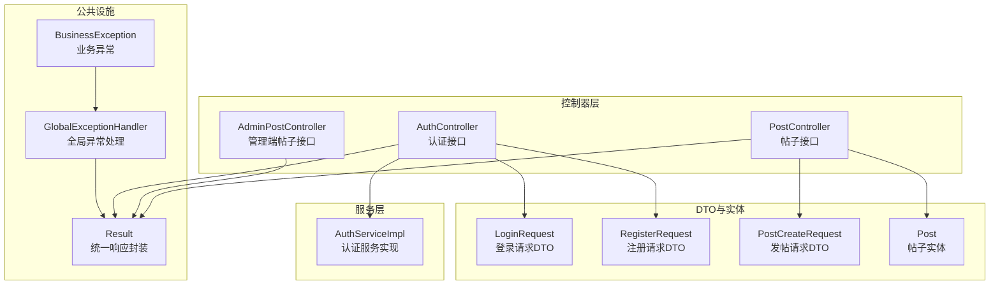
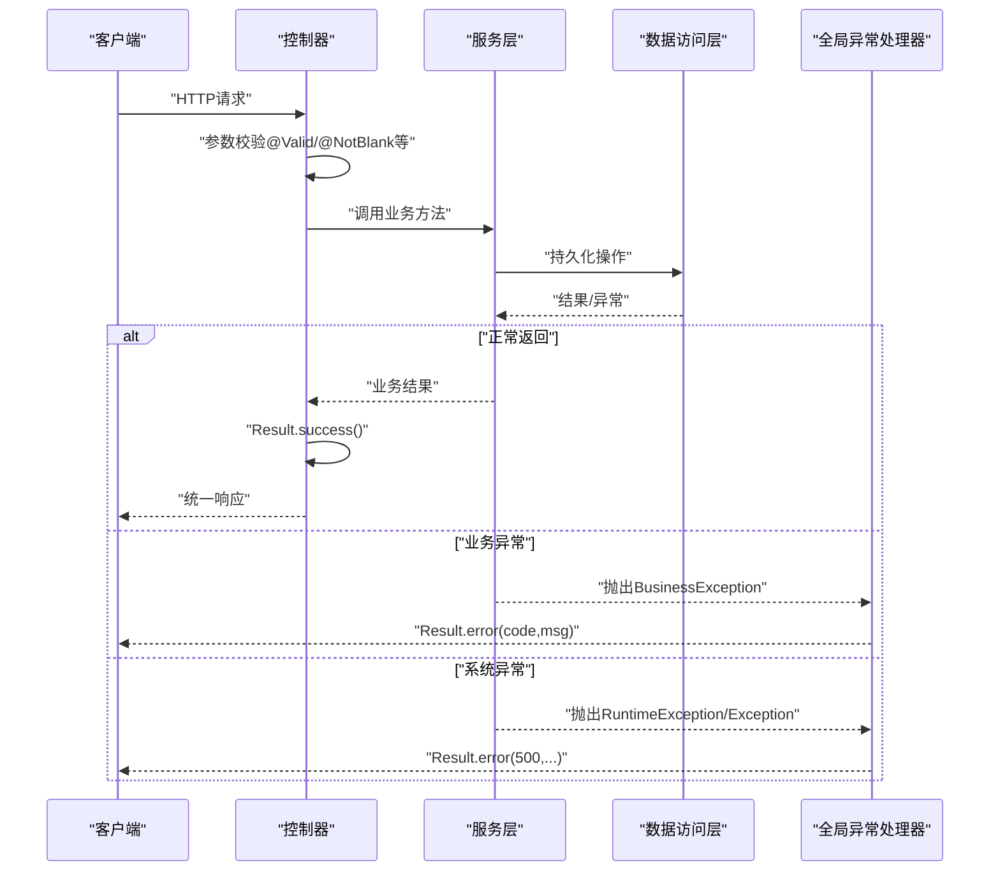
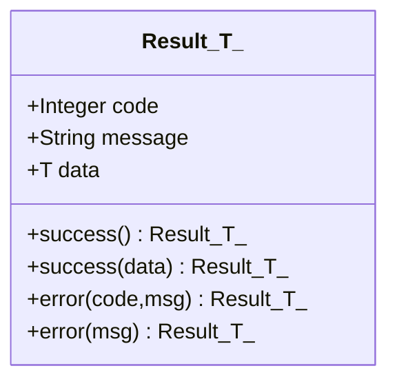
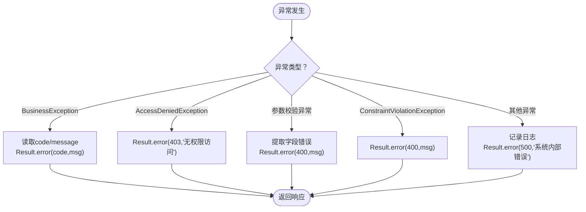
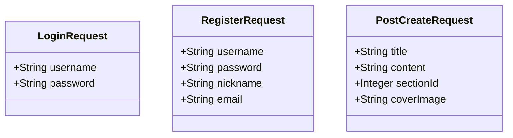
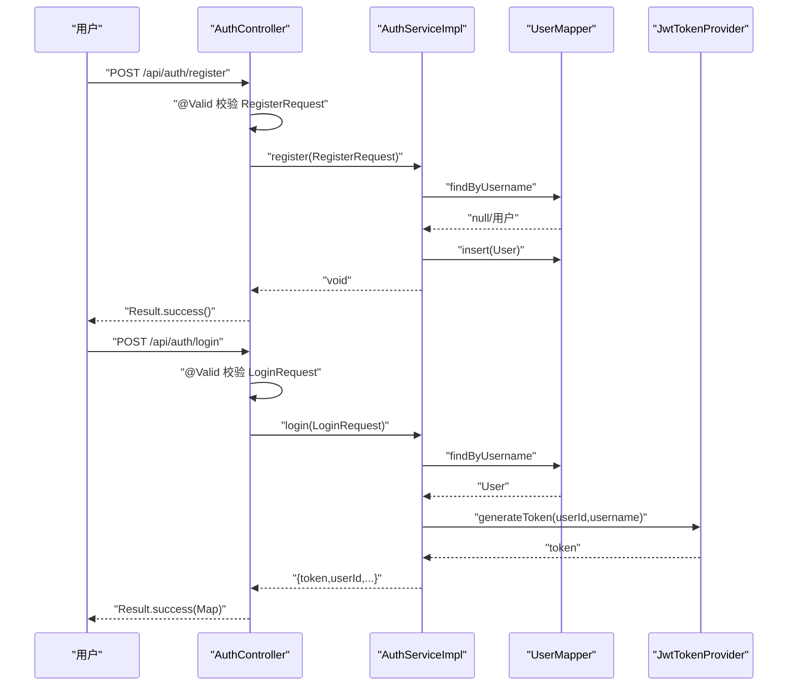
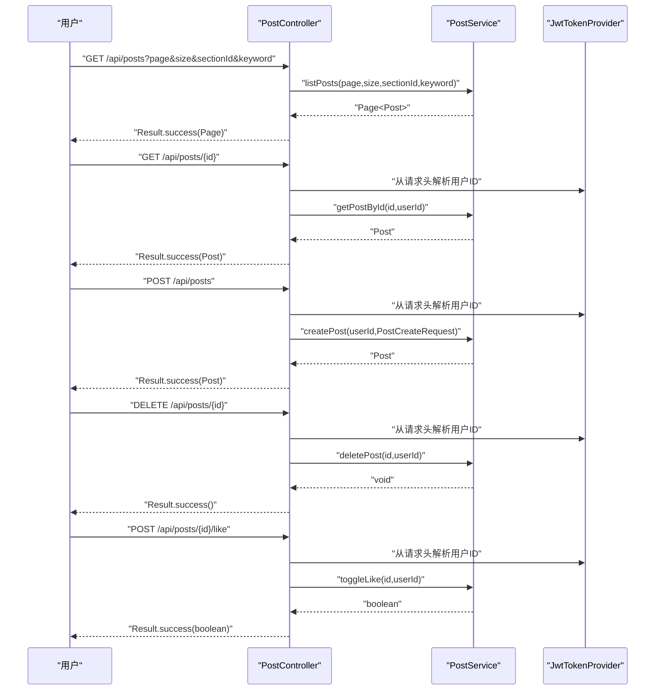
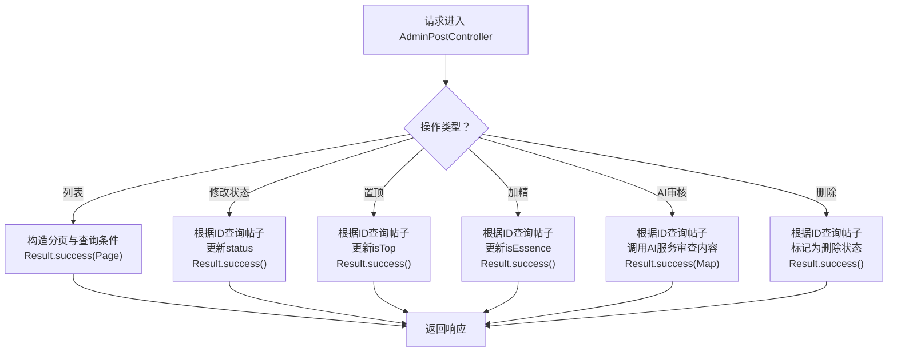
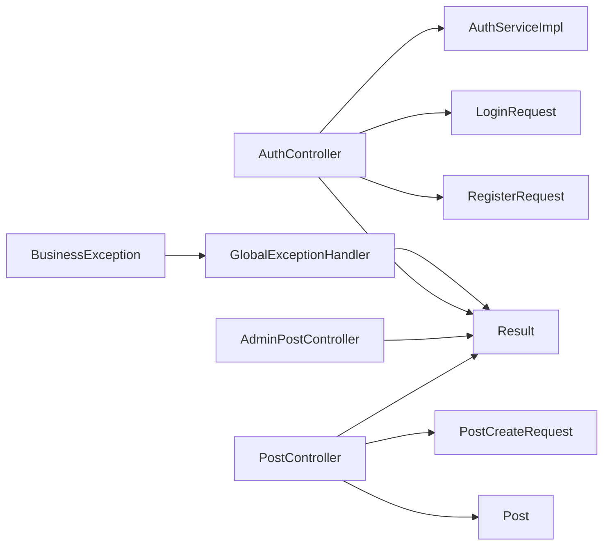

# 控制器层设计

<cite>
**本文引用的文件**
- [Result.java](file://campus-forum-backend/src/main/java/com/campus/forum/common/Result.java)
- [GlobalExceptionHandler.java](file://campus-forum-backend/src/main/java/com/campus/forum/common/GlobalExceptionHandler.java)
- [BusinessException.java](file://campus-forum-backend/src/main/java/com/campus/forum/common/exception/BusinessException.java)
- [AuthController.java](file://campus-forum-backend/src/main/java/com/campus/forum/controller/AuthController.java)
- [PostController.java](file://campus-forum-backend/src/main/java/com/campus/forum/controller/PostController.java)
- [AdminPostController.java](file://campus-forum-backend/src/main/java/com/campus/forum/controller/admin/AdminPostController.java)
- [AuthService.java](file://campus-forum-backend/src/main/java/com/campus/forum/service/AuthService.java)
- [AuthServiceImpl.java](file://campus-forum-backend/src/main/java/com/campus/forum/service/impl/AuthServiceImpl.java)
- [LoginRequest.java](file://campus-forum-backend/src/main/java/com/campus/forum/dto/request/LoginRequest.java)
- [RegisterRequest.java](file://campus-forum-backend/src/main/java/com/campus/forum/dto/request/RegisterRequest.java)
- [PostCreateRequest.java](file://campus-forum-backend/src/main/java/com/campus/forum/dto/request/PostCreateRequest.java)
- [Post.java](file://campus-forum-backend/src/main/java/com/campus/forum/entity/Post.java)
</cite>

## 目录
1. [引言](#引言)
2. [项目结构](#项目结构)
3. [核心组件](#核心组件)
4. [架构总览](#架构总览)
5. [详细组件分析](#详细组件分析)
6. [依赖分析](#依赖分析)
7. [性能考虑](#性能考虑)
8. [故障排查指南](#故障排查指南)
9. [结论](#结论)
10. [附录](#附录)

## 引言
本文件面向PBL项目的后端控制器层，系统性阐述RESTful API设计原则与控制器分层架构模式；深入解析统一响应结果封装机制（Result类）的设计理念与使用方法；明确全局异常处理策略（业务异常、参数异常、系统异常）；解释DTO（请求DTO）的设计模式与使用场景；给出控制器层职责边界、参数验证机制与错误处理最佳实践，并提供API设计规范与控制器开发指南。

## 项目结构
控制器层位于后端工程的controller包内，采用按功能域分层组织：
- 标准业务控制器：如认证、帖子、评论等
- 管理端控制器：如后台管理的帖子管理等
- 公共基础设施：统一响应封装、全局异常处理、业务异常类型
- DTO与实体：请求DTO用于参数校验，实体用于数据库映射

图表来源
- [AuthController.java:1-39](file://campus-forum-backend/src/main/java/com/campus/forum/controller/AuthController.java#L1-L39)
- [PostController.java:1-65](file://campus-forum-backend/src/main/java/com/campus/forum/controller/PostController.java#L1-L65)
- [AdminPostController.java:1-91](file://campus-forum-backend/src/main/java/com/campus/forum/controller/admin/AdminPostController.java#L1-L91)
- [Result.java:1-37](file://campus-forum-backend/src/main/java/com/campus/forum/common/Result.java#L1-L37)
- [GlobalExceptionHandler.java:1-57](file://campus-forum-backend/src/main/java/com/campus/forum/common/GlobalExceptionHandler.java#L1-L57)
- [BusinessException.java:1-22](file://campus-forum-backend/src/main/java/com/campus/forum/common/exception/BusinessException.java#L1-L22)
- [LoginRequest.java:1-14](file://campus-forum-backend/src/main/java/com/campus/forum/dto/request/LoginRequest.java#L1-L14)
- [RegisterRequest.java:1-22](file://campus-forum-backend/src/main/java/com/campus/forum/dto/request/RegisterRequest.java#L1-L22)
- [PostCreateRequest.java:1-17](file://campus-forum-backend/src/main/java/com/campus/forum/dto/request/PostCreateRequest.java#L1-L17)
- [Post.java:1-35](file://campus-forum-backend/src/main/java/com/campus/forum/entity/Post.java#L1-L35)

章节来源
- [AuthController.java:1-39](file://campus-forum-backend/src/main/java/com/campus/forum/controller/AuthController.java#L1-L39)
- [PostController.java:1-65](file://campus-forum-backend/src/main/java/com/campus/forum/controller/PostController.java#L1-L65)
- [AdminPostController.java:1-91](file://campus-forum-backend/src/main/java/com/campus/forum/controller/admin/AdminPostController.java#L1-L91)
- [Result.java:1-37](file://campus-forum-backend/src/main/java/com/campus/forum/common/Result.java#L1-L37)
- [GlobalExceptionHandler.java:1-57](file://campus-forum-backend/src/main/java/com/campus/forum/common/GlobalExceptionHandler.java#L1-L57)
- [BusinessException.java:1-22](file://campus-forum-backend/src/main/java/com/campus/forum/common/exception/BusinessException.java#L1-L22)
- [LoginRequest.java:1-14](file://campus-forum-backend/src/main/java/com/campus/forum/dto/request/LoginRequest.java#L1-L14)
- [RegisterRequest.java:1-22](file://campus-forum-backend/src/main/java/com/campus/forum/dto/request/RegisterRequest.java#L1-L22)
- [PostCreateRequest.java:1-17](file://campus-forum-backend/src/main/java/com/campus/forum/dto/request/PostCreateRequest.java#L1-L17)
- [Post.java:1-35](file://campus-forum-backend/src/main/java/com/campus/forum/entity/Post.java#L1-L35)

## 核心组件
- 统一响应封装（Result<T>）
  - 设计目标：统一HTTP响应格式，便于前端一致化处理
  - 关键字段：状态码、消息、数据载体
  - 工厂方法：success(data)、success()、error(code,msg)、error(msg)
  - 使用建议：所有控制器方法返回值均通过Result封装，避免直接返回原始对象
- 全局异常处理（GlobalExceptionHandler）
  - 覆盖范围：业务异常、鉴权异常、参数校验异常、通用异常
  - 处理策略：将异常转换为标准Result响应，保留语义化的code/message
- 业务异常（BusinessException）
  - 自定义运行时异常，携带业务态code
  - 用于表达“可预期”的业务错误（如参数非法、权限不足、资源不存在等）

章节来源
- [Result.java:1-37](file://campus-forum-backend/src/main/java/com/campus/forum/common/Result.java#L1-L37)
- [GlobalExceptionHandler.java:1-57](file://campus-forum-backend/src/main/java/com/campus/forum/common/GlobalExceptionHandler.java#L1-L57)
- [BusinessException.java:1-22](file://campus-forum-backend/src/main/java/com/campus/forum/common/exception/BusinessException.java#L1-L22)

## 架构总览
控制器层遵循典型的MVC分层架构：
- 控制器（Controller）：接收HTTP请求，进行参数校验与鉴权，调用服务层，封装统一响应
- 服务层（Service）：承载业务逻辑，可能抛出业务异常
- 公共设施：统一响应、全局异常处理、业务异常类型
- DTO：请求参数的结构化与约束声明
- 实体：数据库映射模型

图表来源
- [AuthController.java:1-39](file://campus-forum-backend/src/main/java/com/campus/forum/controller/AuthController.java#L1-L39)
- [PostController.java:1-65](file://campus-forum-backend/src/main/java/com/campus/forum/controller/PostController.java#L1-L65)
- [GlobalExceptionHandler.java:1-57](file://campus-forum-backend/src/main/java/com/campus/forum/common/GlobalExceptionHandler.java#L1-L57)
- [BusinessException.java:1-22](file://campus-forum-backend/src/main/java/com/campus/forum/common/exception/BusinessException.java#L1-L22)

## 详细组件分析

### 统一响应封装（Result<T>）
- 设计理念
  - 固化响应契约：code、message、data三段式结构
  - 泛型支持：data可承载任意业务对象，便于强类型传递
  - 静态工厂：提供success/error便捷方法，减少样板代码
- 使用方法
  - 成功场景：Result.success(data) 或 Result.success()
  - 错误场景：Result.error(code,msg) 或 Result.error(msg)
- 最佳实践
  - 控制器层禁止直接返回业务对象，必须通过Result封装
  - 对于分页查询，data传入Page<T>实例
  - 对于布尔型操作反馈，data传入Boolean

图表来源
- [Result.java:1-37](file://campus-forum-backend/src/main/java/com/campus/forum/common/Result.java#L1-L37)

章节来源
- [Result.java:1-37](file://campus-forum-backend/src/main/java/com/campus/forum/common/Result.java#L1-L37)

### 全局异常处理（GlobalExceptionHandler）
- 分类处理
  - 业务异常（BusinessException）：读取异常中的code与message，返回对应错误响应
  - 权限异常（AccessDeniedException）：统一返回403无权限
  - 参数校验异常（MethodArgumentNotValidException/BindException）：提取首个字段错误提示，返回400
  - Bean约束异常（ConstraintViolationException）：返回400及异常消息
  - 通用异常（Exception）：记录错误日志，返回500系统内部错误
- 设计要点
  - 使用@RestControllerAdvice集中拦截异常
  - 将异常转换为Result格式，保持前后端交互一致性
  - 对敏感信息进行脱敏处理（如系统异常仅返回简要描述）

图表来源
- [GlobalExceptionHandler.java:1-57](file://campus-forum-backend/src/main/java/com/campus/forum/common/GlobalExceptionHandler.java#L1-L57)
- [BusinessException.java:1-22](file://campus-forum-backend/src/main/java/com/campus/forum/common/exception/BusinessException.java#L1-L22)

章节来源
- [GlobalExceptionHandler.java:1-57](file://campus-forum-backend/src/main/java/com/campus/forum/common/GlobalExceptionHandler.java#L1-L57)
- [BusinessException.java:1-22](file://campus-forum-backend/src/main/java/com/campus/forum/common/exception/BusinessException.java#L1-L22)

### DTO设计模式与使用场景
- 请求DTO（Request DTO）
  - 作用：承载HTTP请求参数，声明校验规则（如@NotBlank、@Size），并与控制器方法参数绑定
  - 示例：
    - 登录请求：LoginRequest（用户名、密码非空）
    - 注册请求：RegisterRequest（用户名长度、密码长度、昵称非空等）
    - 发帖请求：PostCreateRequest（标题、内容非空，可选板块、封面）
- 响应DTO（Response DTO）
  - 当前仓库未发现独立的响应DTO文件；通常推荐在需要裁剪字段、聚合跨表数据或隐藏敏感信息时引入
  - 若无特殊需求，可直接复用实体作为响应载体（注意控制暴露字段）

图表来源
- [LoginRequest.java:1-14](file://campus-forum-backend/src/main/java/com/campus/forum/dto/request/LoginRequest.java#L1-L14)
- [RegisterRequest.java:1-22](file://campus-forum-backend/src/main/java/com/campus/forum/dto/request/RegisterRequest.java#L1-L22)
- [PostCreateRequest.java:1-17](file://campus-forum-backend/src/main/java/com/campus/forum/dto/request/PostCreateRequest.java#L1-L17)

章节来源
- [LoginRequest.java:1-14](file://campus-forum-backend/src/main/java/com/campus/forum/dto/request/LoginRequest.java#L1-L14)
- [RegisterRequest.java:1-22](file://campus-forum-backend/src/main/java/com/campus/forum/dto/request/RegisterRequest.java#L1-L22)
- [PostCreateRequest.java:1-17](file://campus-forum-backend/src/main/java/com/campus/forum/dto/request/PostCreateRequest.java#L1-L17)

### 控制器层职责边界与参数验证
- 职责边界
  - 接收与路由：基于@RequestMapping与@Operation标注REST接口
  - 参数校验：使用@Valid与Jakarta Validation注解（如@NotBlank、@Size）确保输入有效
  - 安全与鉴权：从请求中提取用户身份（如JWT），对敏感操作进行权限校验
  - 协调服务：调用服务层执行业务，组装Result响应
- 参数验证机制
  - 方法级校验：@Valid配合DTO字段注解
  - 绑定校验：自动捕获并交由全局异常处理器处理
- 错误处理最佳实践
  - 明确区分业务异常与系统异常，前者使用BusinessException，后者让框架兜底
  - 返回统一Result，避免泄露内部异常细节
  - 对于鉴权失败与权限不足，使用403语义化响应

章节来源
- [AuthController.java:1-39](file://campus-forum-backend/src/main/java/com/campus/forum/controller/AuthController.java#L1-L39)
- [PostController.java:1-65](file://campus-forum-backend/src/main/java/com/campus/forum/controller/PostController.java#L1-L65)
- [AdminPostController.java:1-91](file://campus-forum-backend/src/main/java/com/campus/forum/controller/admin/AdminPostController.java#L1-L91)
- [GlobalExceptionHandler.java:1-57](file://campus-forum-backend/src/main/java/com/campus/forum/common/GlobalExceptionHandler.java#L1-L57)

### 典型控制器流程示例

#### 认证控制器（注册/登录）

图表来源
- [AuthController.java:1-39](file://campus-forum-backend/src/main/java/com/campus/forum/controller/AuthController.java#L1-L39)
- [AuthServiceImpl.java:1-69](file://campus-forum-backend/src/main/java/com/campus/forum/service/impl/AuthServiceImpl.java#L1-L69)
- [AuthService.java:1-12](file://campus-forum-backend/src/main/java/com/campus/forum/service/AuthService.java#L1-L12)
- [RegisterRequest.java:1-22](file://campus-forum-backend/src/main/java/com/campus/forum/dto/request/RegisterRequest.java#L1-L22)
- [LoginRequest.java:1-14](file://campus-forum-backend/src/main/java/com/campus/forum/dto/request/LoginRequest.java#L1-L14)

章节来源
- [AuthController.java:1-39](file://campus-forum-backend/src/main/java/com/campus/forum/controller/AuthController.java#L1-L39)
- [AuthServiceImpl.java:1-69](file://campus-forum-backend/src/main/java/com/campus/forum/service/impl/AuthServiceImpl.java#L1-L69)
- [AuthService.java:1-12](file://campus-forum-backend/src/main/java/com/campus/forum/service/AuthService.java#L1-L12)
- [RegisterRequest.java:1-22](file://campus-forum-backend/src/main/java/com/campus/forum/dto/request/RegisterRequest.java#L1-L22)
- [LoginRequest.java:1-14](file://campus-forum-backend/src/main/java/com/campus/forum/dto/request/LoginRequest.java#L1-L14)

#### 帖子控制器（列表/详情/发布/删除/点赞）

图表来源
- [PostController.java:1-65](file://campus-forum-backend/src/main/java/com/campus/forum/controller/PostController.java#L1-L65)
- [PostCreateRequest.java:1-17](file://campus-forum-backend/src/main/java/com/campus/forum/dto/request/PostCreateRequest.java#L1-L17)
- [Post.java:1-35](file://campus-forum-backend/src/main/java/com/campus/forum/entity/Post.java#L1-L35)

章节来源
- [PostController.java:1-65](file://campus-forum-backend/src/main/java/com/campus/forum/controller/PostController.java#L1-L65)
- [PostCreateRequest.java:1-17](file://campus-forum-backend/src/main/java/com/campus/forum/dto/request/PostCreateRequest.java#L1-L17)
- [Post.java:1-35](file://campus-forum-backend/src/main/java/com/campus/forum/entity/Post.java#L1-L35)

#### 管理端帖子控制器（审核/置顶/加精/AI审核/删除）

图表来源
- [AdminPostController.java:1-91](file://campus-forum-backend/src/main/java/com/campus/forum/controller/admin/AdminPostController.java#L1-L91)
- [Post.java:1-35](file://campus-forum-backend/src/main/java/com/campus/forum/entity/Post.java#L1-L35)

章节来源
- [AdminPostController.java:1-91](file://campus-forum-backend/src/main/java/com/campus/forum/controller/admin/AdminPostController.java#L1-L91)
- [Post.java:1-35](file://campus-forum-backend/src/main/java/com/campus/forum/entity/Post.java#L1-L35)

## 依赖分析
- 控制器到服务层：控制器通过接口依赖服务层，降低耦合度
- 控制器到公共设施：统一使用Result封装响应，异常统一由GlobalExceptionHandler接管
- DTO到控制器：控制器方法参数绑定到DTO，结合@Valid完成参数校验
- 服务层到数据访问层：服务层负责业务编排与异常抛出，DAO负责数据持久化

图表来源
- [AuthController.java:1-39](file://campus-forum-backend/src/main/java/com/campus/forum/controller/AuthController.java#L1-L39)
- [PostController.java:1-65](file://campus-forum-backend/src/main/java/com/campus/forum/controller/PostController.java#L1-L65)
- [AdminPostController.java:1-91](file://campus-forum-backend/src/main/java/com/campus/forum/controller/admin/AdminPostController.java#L1-L91)
- [Result.java:1-37](file://campus-forum-backend/src/main/java/com/campus/forum/common/Result.java#L1-L37)
- [GlobalExceptionHandler.java:1-57](file://campus-forum-backend/src/main/java/com/campus/forum/common/GlobalExceptionHandler.java#L1-L57)
- [BusinessException.java:1-22](file://campus-forum-backend/src/main/java/com/campus/forum/common/exception/BusinessException.java#L1-L22)
- [LoginRequest.java:1-14](file://campus-forum-backend/src/main/java/com/campus/forum/dto/request/LoginRequest.java#L1-L14)
- [RegisterRequest.java:1-22](file://campus-forum-backend/src/main/java/com/campus/forum/dto/request/RegisterRequest.java#L1-L22)
- [PostCreateRequest.java:1-17](file://campus-forum-backend/src/main/java/com/campus/forum/dto/request/PostCreateRequest.java#L1-L17)
- [Post.java:1-35](file://campus-forum-backend/src/main/java/com/campus/forum/entity/Post.java#L1-L35)

章节来源
- [AuthController.java:1-39](file://campus-forum-backend/src/main/java/com/campus/forum/controller/AuthController.java#L1-L39)
- [PostController.java:1-65](file://campus-forum-backend/src/main/java/com/campus/forum/controller/PostController.java#L1-L65)
- [AdminPostController.java:1-91](file://campus-forum-backend/src/main/java/com/campus/forum/controller/admin/AdminPostController.java#L1-L91)
- [Result.java:1-37](file://campus-forum-backend/src/main/java/com/campus/forum/common/Result.java#L1-L37)
- [GlobalExceptionHandler.java:1-57](file://campus-forum-backend/src/main/java/com/campus/forum/common/GlobalExceptionHandler.java#L1-L57)
- [BusinessException.java:1-22](file://campus-forum-backend/src/main/java/com/campus/forum/common/exception/BusinessException.java#L1-L22)
- [LoginRequest.java:1-14](file://campus-forum-backend/src/main/java/com/campus/forum/dto/request/LoginRequest.java#L1-L14)
- [RegisterRequest.java:1-22](file://campus-forum-backend/src/main/java/com/campus/forum/dto/request/RegisterRequest.java#L1-L22)
- [PostCreateRequest.java:1-17](file://campus-forum-backend/src/main/java/com/campus/forum/dto/request/PostCreateRequest.java#L1-L17)
- [Post.java:1-35](file://campus-forum-backend/src/main/java/com/campus/forum/entity/Post.java#L1-L35)

## 性能考虑
- 响应序列化：Result封装简单对象，避免复杂嵌套导致序列化开销
- 分页查询：优先使用MyBatis-Plus Page对象，减少一次性加载大量数据
- 参数校验前置：通过@Valid在进入业务逻辑前拦截无效参数，降低后续处理成本
- 异常快速失败：业务异常尽早抛出，避免冗余计算

## 故障排查指南
- 参数校验失败
  - 现象：返回400，message包含字段名与默认错误提示
  - 排查：确认DTO字段注解配置、请求体格式与必填项
- 业务异常
  - 现象：返回400或特定code与message
  - 排查：查看服务层抛出的BusinessException原因，核对业务规则
- 权限不足
  - 现象：返回403
  - 排查：确认用户角色、JWT令牌有效性与控制器鉴权逻辑
- 系统异常
  - 现象：返回500，日志记录堆栈
  - 排查：查看服务层未捕获异常、数据库连接、外部依赖可用性

章节来源
- [GlobalExceptionHandler.java:1-57](file://campus-forum-backend/src/main/java/com/campus/forum/common/GlobalExceptionHandler.java#L1-L57)
- [BusinessException.java:1-22](file://campus-forum-backend/src/main/java/com/campus/forum/common/exception/BusinessException.java#L1-L22)

## 结论
控制器层通过统一响应封装与全局异常处理，实现了清晰的职责边界与一致的对外接口契约。结合DTO参数校验与服务层协作，既保证了开发效率，也提升了系统的可维护性与可扩展性。建议在后续迭代中补充响应DTO以进一步优化数据暴露与前后端解耦。

## 附录

### API设计规范与控制器开发指南
- 路由命名
  - 使用名词复数形式，如/api/posts
  - 管理端接口以/api/admin前缀区分
- 方法语义
  - GET：查询（支持分页与筛选）
  - POST：创建
  - PUT：更新（幂等）
  - DELETE：删除
- 参数校验
  - 所有入参DTO必须声明校验注解
  - 必填字段使用@NotBlank/@NotNull
  - 长度限制使用@Size
- 响应规范
  - 成功：Result.success(data)
  - 无数据：Result.success()
  - 错误：Result.error(code,message)
- 鉴权与安全
  - 敏感操作需从请求中提取用户ID并校验权限
  - 对外暴露的接口应避免泄露内部异常细节