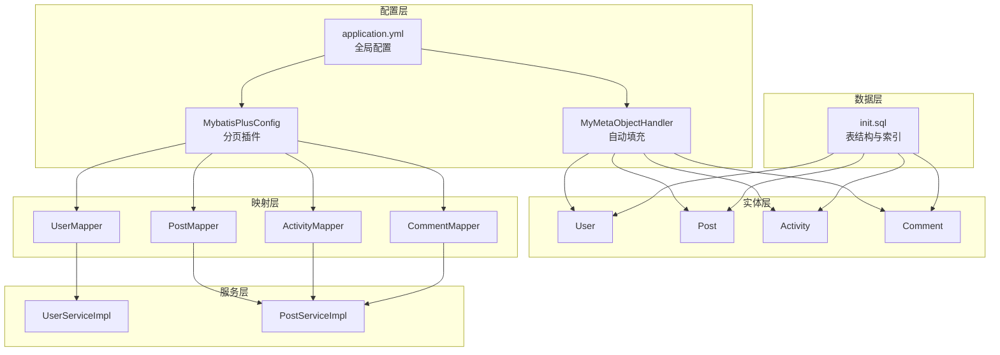
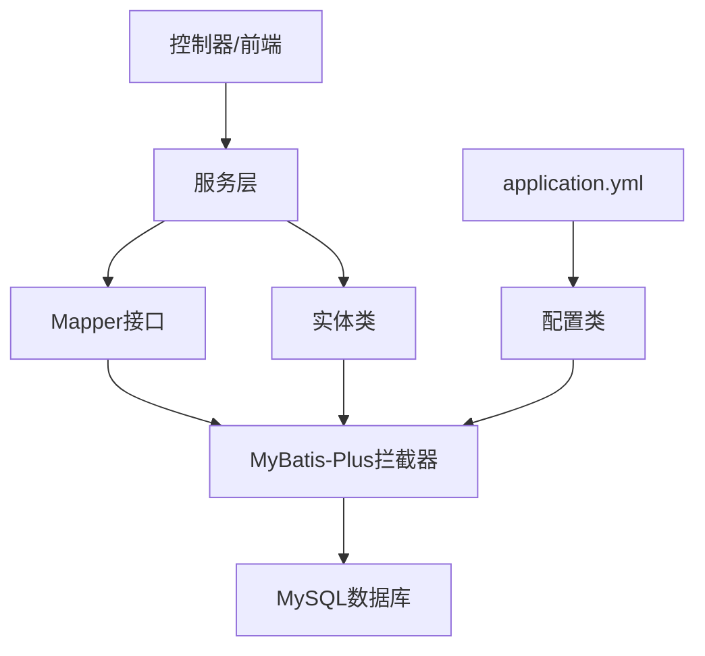
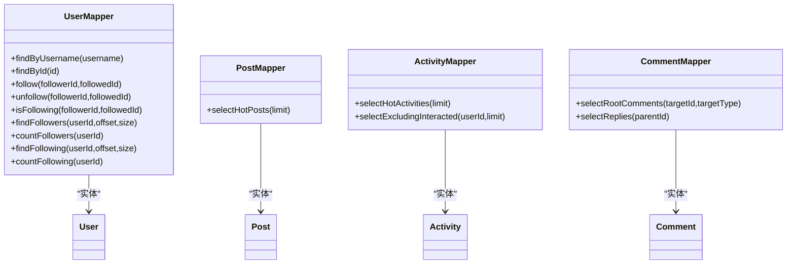
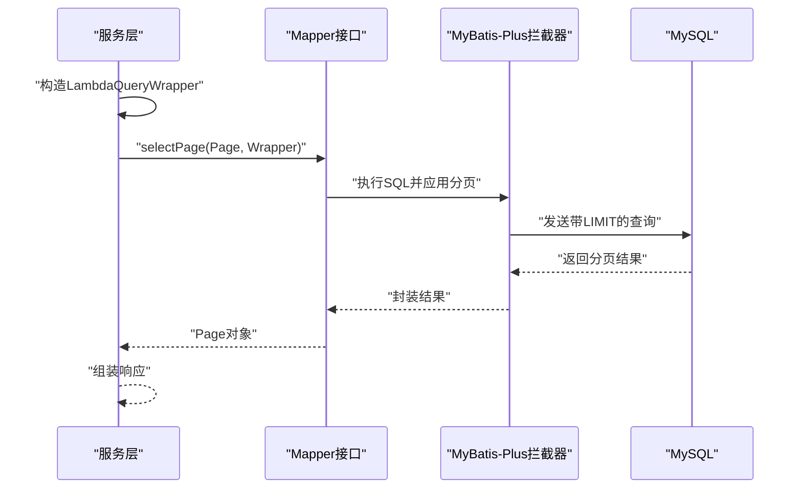
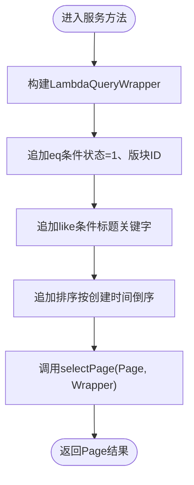
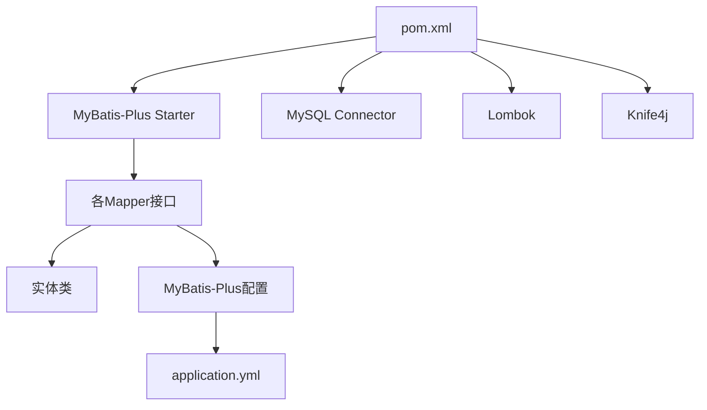
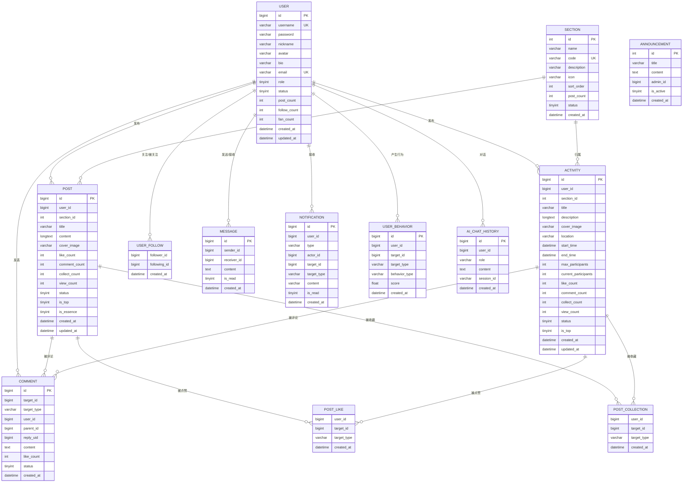

# 数据访问层设计

<cite>
**本文引用的文件**
- [MybatisPlusConfig.java](file://campus-forum-backend/src/main/java/com/campus/forum/config/MybatisPlusConfig.java)
- [MyMetaObjectHandler.java](file://campus-forum-backend/src/main/java/com/campus/forum/config/MyMetaObjectHandler.java)
- [application.yml](file://campus-forum-backend/src/main/resources/application.yml)
- [init.sql](file://campus-forum-backend/docs/db/init.sql)
- [User.java](file://campus-forum-backend/src/main/java/com/campus/forum/entity/User.java)
- [Post.java](file://campus-forum-backend/src/main/java/com/campus/forum/entity/Post.java)
- [Activity.java](file://campus-forum-backend/src/main/java/com/campus/forum/entity/Activity.java)
- [Comment.java](file://campus-forum-backend/src/main/java/com/campus/forum/entity/Comment.java)
- [UserMapper.java](file://campus-forum-backend/src/main/java/com/campus/forum/mapper/UserMapper.java)
- [PostMapper.java](file://campus-forum-backend/src/main/java/com/campus/forum/mapper/PostMapper.java)
- [ActivityMapper.java](file://campus-forum-backend/src/main/java/com/campus/forum/mapper/ActivityMapper.java)
- [CommentMapper.java](file://campus-forum-backend/src/main/java/com/campus/forum/mapper/CommentMapper.java)
- [UserServiceImpl.java](file://campus-forum-backend/src/main/java/com/campus/forum/service/impl/UserServiceImpl.java)
- [PostServiceImpl.java](file://campus-forum-backend/src/main/java/com/campus/forum/service/impl/PostServiceImpl.java)
- [pom.xml](file://campus-forum-backend/pom.xml)
</cite>

## 目录
1. [引言](#引言)
2. [项目结构](#项目结构)
3. [核心组件](#核心组件)
4. [架构总览](#架构总览)
5. [详细组件分析](#详细组件分析)
6. [依赖分析](#依赖分析)
7. [性能考虑](#性能考虑)
8. [故障排查指南](#故障排查指南)
9. [结论](#结论)
10. [附录](#附录)

## 引言
本文件面向PBL项目的后端数据访问层，围绕MyBatis-Plus的配置策略（自动填充、分页插件、逻辑删除、驼峰映射等）、实体类设计原则（字段映射、注解使用、关系表达）、Mapper接口设计模式（通用CRUD、自定义SQL与动态查询）、数据库表结构与索引策略、以及查询优化技巧进行系统化梳理，并提供实体关系图与数据访问最佳实践指南，帮助开发者在保证可维护性的同时提升性能与稳定性。

## 项目结构
数据访问层主要由以下模块构成：
- 配置层：MyBatis-Plus拦截器与自动填充配置
- 实体层：基于注解的实体类与字段映射
- 映射层：Mapper接口（继承BaseMapper与自定义SQL）
- 服务层：封装业务逻辑与分页查询
- 数据层：数据库初始化脚本与索引策略

图表来源
- [MybatisPlusConfig.java:1-24](file://campus-forum-backend/src/main/java/com/campus/forum/config/MybatisPlusConfig.java#L1-L24)
- [MyMetaObjectHandler.java:1-26](file://campus-forum-backend/src/main/java/com/campus/forum/config/MyMetaObjectHandler.java#L1-L26)
- [application.yml:19-29](file://campus-forum-backend/src/main/resources/application.yml#L19-L29)
- [User.java:1-33](file://campus-forum-backend/src/main/java/com/campus/forum/entity/User.java#L1-L33)
- [Post.java:1-35](file://campus-forum-backend/src/main/java/com/campus/forum/entity/Post.java#L1-L35)
- [Activity.java:1-39](file://campus-forum-backend/src/main/java/com/campus/forum/entity/Activity.java#L1-L39)
- [Comment.java:1-31](file://campus-forum-backend/src/main/java/com/campus/forum/entity/Comment.java#L1-L31)
- [UserMapper.java:1-39](file://campus-forum-backend/src/main/java/com/campus/forum/mapper/UserMapper.java#L1-L39)
- [PostMapper.java:1-15](file://campus-forum-backend/src/main/java/com/campus/forum/mapper/PostMapper.java#L1-L15)
- [ActivityMapper.java:1-22](file://campus-forum-backend/src/main/java/com/campus/forum/mapper/ActivityMapper.java#L1-L22)
- [CommentMapper.java:1-19](file://campus-forum-backend/src/main/java/com/campus/forum/mapper/CommentMapper.java#L1-L19)
- [UserServiceImpl.java:1-79](file://campus-forum-backend/src/main/java/com/campus/forum/service/impl/UserServiceImpl.java#L1-L79)
- [PostServiceImpl.java:1-114](file://campus-forum-backend/src/main/java/com/campus/forum/service/impl/PostServiceImpl.java#L1-L114)
- [init.sql:1-257](file://campus-forum-backend/docs/db/init.sql#L1-L257)

章节来源
- [MybatisPlusConfig.java:1-24](file://campus-forum-backend/src/main/java/com/campus/forum/config/MybatisPlusConfig.java#L1-L24)
- [MyMetaObjectHandler.java:1-26](file://campus-forum-backend/src/main/java/com/campus/forum/config/MyMetaObjectHandler.java#L1-L26)
- [application.yml:19-29](file://campus-forum-backend/src/main/resources/application.yml#L19-L29)
- [init.sql:1-257](file://campus-forum-backend/docs/db/init.sql#L1-L257)

## 核心组件
- MyBatis-Plus配置
  - 分页插件：在配置类中注册拦截器，指定数据库类型为MySQL，确保分页生效。
  - 自动填充：通过元对象处理器在插入与更新时自动填充创建与更新时间。
  - 全局配置：逻辑删除字段、值与未删值；开启下划线到驼峰映射；启用日志输出。
- 实体类设计
  - 使用注解标注表名、主键策略、字段填充规则与存在性声明。
  - 统一时间戳字段命名与填充策略，减少重复代码。
- Mapper接口设计
  - 继承BaseMapper获得通用CRUD能力。
  - 自定义SQL满足复杂查询与统计场景。
- 服务层封装
  - 使用Lambda条件构造器实现动态查询。
  - 将分页参数转换为Page对象，结合Mapper完成分页查询。
- 数据库脚本
  - 完整的表结构与索引设计，覆盖用户、帖子、活动、评论、点赞、收藏、关注、消息、通知、行为记录、公告、AI对话历史等。

章节来源
- [MybatisPlusConfig.java:16-22](file://campus-forum-backend/src/main/java/com/campus/forum/config/MybatisPlusConfig.java#L16-L22)
- [MyMetaObjectHandler.java:15-24](file://campus-forum-backend/src/main/java/com/campus/forum/config/MyMetaObjectHandler.java#L15-L24)
- [application.yml:19-29](file://campus-forum-backend/src/main/resources/application.yml#L19-L29)
- [User.java:10-32](file://campus-forum-backend/src/main/java/com/campus/forum/entity/User.java#L10-L32)
- [Post.java:10-34](file://campus-forum-backend/src/main/java/com/campus/forum/entity/Post.java#L10-L34)
- [Activity.java:10-38](file://campus-forum-backend/src/main/java/com/campus/forum/entity/Activity.java#L10-L38)
- [Comment.java:11-30](file://campus-forum-backend/src/main/java/com/campus/forum/entity/Comment.java#L11-L30)
- [UserMapper.java:9-38](file://campus-forum-backend/src/main/java/com/campus/forum/mapper/UserMapper.java#L9-L38)
- [PostMapper.java:9-14](file://campus-forum-backend/src/main/java/com/campus/forum/mapper/PostMapper.java#L9-L14)
- [ActivityMapper.java:10-21](file://campus-forum-backend/src/main/java/com/campus/forum/mapper/ActivityMapper.java#L10-L21)
- [CommentMapper.java:9-18](file://campus-forum-backend/src/main/java/com/campus/forum/mapper/CommentMapper.java#L9-L18)
- [UserServiceImpl.java:43-72](file://campus-forum-backend/src/main/java/com/campus/forum/service/impl/UserServiceImpl.java#L43-L72)
- [PostServiceImpl.java:43-51](file://campus-forum-backend/src/main/java/com/campus/forum/service/impl/PostServiceImpl.java#L43-L51)

## 架构总览
数据访问层遵循“配置-实体-Mapper-服务-数据”的分层架构，MyBatis-Plus提供ORM能力与插件扩展，服务层负责业务编排与分页，实体层承载数据模型与注解驱动的映射，数据库层提供完善的表结构与索引。

图表来源
- [MybatisPlusConfig.java:14-22](file://campus-forum-backend/src/main/java/com/campus/forum/config/MybatisPlusConfig.java#L14-L22)
- [application.yml:19-29](file://campus-forum-backend/src/main/resources/application.yml#L19-L29)
- [UserServiceImpl.java:17-78](file://campus-forum-backend/src/main/java/com/campus/forum/service/impl/UserServiceImpl.java#L17-L78)
- [PostServiceImpl.java:20-113](file://campus-forum-backend/src/main/java/com/campus/forum/service/impl/PostServiceImpl.java#L20-113)

## 详细组件分析

### MyBatis-Plus配置策略
- 分页插件
  - 在配置类中注册拦截器并添加PaginationInnerInterceptor，指定数据库类型为MySQL，确保分页生效。
  - 注意：未配置分页插件会导致分页不生效，返回全量数据。
- 自动填充
  - 通过MetaObjectHandler在插入与更新时自动填充createdAt与updatedAt字段，避免重复代码。
- 全局配置
  - 逻辑删除字段与值：status字段作为逻辑删除标志，未删值与删值分别配置。
  - 下划线到驼峰映射：map-underscore-to-camel-case开启，简化命名映射。
  - 日志输出：StdOutImpl便于开发调试。

章节来源
- [MybatisPlusConfig.java:9-22](file://campus-forum-backend/src/main/java/com/campus/forum/config/MybatisPlusConfig.java#L9-L22)
- [MyMetaObjectHandler.java:9-24](file://campus-forum-backend/src/main/java/com/campus/forum/config/MyMetaObjectHandler.java#L9-L24)
- [application.yml:19-29](file://campus-forum-backend/src/main/resources/application.yml#L19-L29)

### 实体类设计原则
- 字段映射与注解使用
  - @TableName标注表名，@TableId定义主键策略，@TableField控制字段填充与存在性。
  - 时间戳字段统一使用LocalDateTime，并通过FieldFill控制插入/更新填充。
- 关系定义
  - 外键字段以“实体名小写+Id”命名，如userId、sectionId，保持一致性。
  - 对于非数据库字段（如Comment.replies），使用exist=false标注。
- 设计要点
  - 统一时间戳命名与自动填充策略，减少重复逻辑。
  - 状态字段采用语义明确的枚举值或注释说明，便于维护。

章节来源
- [User.java:10-32](file://campus-forum-backend/src/main/java/com/campus/forum/entity/User.java#L10-L32)
- [Post.java:10-34](file://campus-forum-backend/src/main/java/com/campus/forum/entity/Post.java#L10-L34)
- [Activity.java:10-38](file://campus-forum-backend/src/main/java/com/campus/forum/entity/Activity.java#L10-L38)
- [Comment.java:11-30](file://campus-forum-backend/src/main/java/com/campus/forum/entity/Comment.java#L11-L30)

### Mapper接口设计模式
- 通用CRUD
  - 所有Mapper均继承BaseMapper，天然具备insert、selectById、updateById、deleteById等方法。
- 自定义SQL
  - 使用@Select/@Insert/@Delete等注解编写特定查询与操作，如按用户名查找、关注/取关、根评论与回复查询等。
- 动态查询
  - 服务层使用LambdaQueryWrapper构建条件，支持多条件组合与排序，Mapper配合分页插件完成高效查询。

图表来源
- [UserMapper.java:9-38](file://campus-forum-backend/src/main/java/com/campus/forum/mapper/UserMapper.java#L9-L38)
- [PostMapper.java:9-14](file://campus-forum-backend/src/main/java/com/campus/forum/mapper/PostMapper.java#L9-L14)
- [ActivityMapper.java:10-21](file://campus-forum-backend/src/main/java/com/campus/forum/mapper/ActivityMapper.java#L10-L21)
- [CommentMapper.java:9-18](file://campus-forum-backend/src/main/java/com/campus/forum/mapper/CommentMapper.java#L9-L18)

章节来源
- [UserMapper.java:9-38](file://campus-forum-backend/src/main/java/com/campus/forum/mapper/UserMapper.java#L9-L38)
- [PostMapper.java:9-14](file://campus-forum-backend/src/main/java/com/campus/forum/mapper/PostMapper.java#L9-L14)
- [ActivityMapper.java:10-21](file://campus-forum-backend/src/main/java/com/campus/forum/mapper/ActivityMapper.java#L10-L21)
- [CommentMapper.java:9-18](file://campus-forum-backend/src/main/java/com/campus/forum/mapper/CommentMapper.java#L9-L18)

### 数据库表结构与索引策略
- 表与字段
  - 用户、版块、活动、帖子、评论、点赞、收藏、关注、私信、通知、用户行为、公告、AI对话历史等完整覆盖业务域。
- 索引策略
  - 用户：idx_username
  - 活动：idx_user_id、idx_section_id、idx_start_time
  - 帖子：idx_user_id、idx_section_id、idx_created_at
  - 评论：idx_target、idx_parent_id
  - 关注：idx_following_id
  - 私信：idx_sender_receiver、idx_receiver_id
  - 通知：idx_user_id
  - 用户行为：idx_user_target
  - AI对话：idx_user_id、idx_session_id
- 查询优化建议
  - 利用复合索引覆盖常见查询条件（如用户维度、目标类型、时间范围）。
  - 对高并发写入场景，注意唯一约束（如活动报名的联合唯一）带来的写入冲突与重试策略。

章节来源
- [init.sql:10-257](file://campus-forum-backend/docs/db/init.sql#L10-L257)

### 查询流程与分页序列

图表来源
- [PostServiceImpl.java:43-51](file://campus-forum-backend/src/main/java/com/campus/forum/service/impl/PostServiceImpl.java#L43-L51)
- [MybatisPlusConfig.java:16-22](file://campus-forum-backend/src/main/java/com/campus/forum/config/MybatisPlusConfig.java#L16-L22)

### 动态查询流程（示例：帖子列表）

图表来源
- [PostServiceImpl.java:43-51](file://campus-forum-backend/src/main/java/com/campus/forum/service/impl/PostServiceImpl.java#L43-L51)

## 依赖分析
- 外部依赖
  - MyBatis-Plus Starter：提供ORM与插件能力。
  - MySQL Connector：数据库驱动。
  - Lombok：简化实体类代码。
  - Knife4j：OpenAPI增强工具。
- 内部耦合
  - Mapper依赖MyBatis-Plus拦截器与实体类。
  - 服务层依赖Mapper与实体类，承担业务编排与分页。
  - 配置类与application.yml共同决定全局行为。

图表来源
- [pom.xml:27-117](file://campus-forum-backend/pom.xml#L27-L117)
- [MybatisPlusConfig.java:14-22](file://campus-forum-backend/src/main/java/com/campus/forum/config/MybatisPlusConfig.java#L14-L22)
- [application.yml:19-29](file://campus-forum-backend/src/main/resources/application.yml#L19-L29)

章节来源
- [pom.xml:27-117](file://campus-forum-backend/pom.xml#L27-L117)

## 性能考虑
- 分页优化
  - 使用分页插件与合理LIMIT，避免一次性加载全量数据。
  - 结合索引覆盖查询条件，减少回表与排序成本。
- 索引策略
  - 针对高频查询字段建立单列或复合索引，如用户维度、目标类型、时间范围。
  - 避免过度索引导致写入性能下降，平衡读写比例。
- 自动填充与逻辑删除
  - 自动填充减少业务层冗余代码，逻辑删除降低物理删除风险。
- 查询优化技巧
  - 使用exists替代count>0，减少扫描。
  - 合理使用selective更新，仅更新变更字段。
  - 对热点数据采用缓存（如热门帖子/活动），降低数据库压力。

## 故障排查指南
- 分页不生效
  - 检查是否正确注册PaginationInnerInterceptor并指定数据库类型。
  - 参考配置类中的注释提示。
- 自动填充未生效
  - 确认MetaObjectHandler已注册为组件，且字段名称与自动填充一致。
- 逻辑删除异常
  - 确认application.yml中逻辑删除字段与值配置正确，查询时注意排除已逻辑删除的数据。
- SQL性能问题
  - 使用EXPLAIN分析慢查询，检查索引使用情况与回表次数。
  - 对高频查询增加合适索引，避免全表扫描。

章节来源
- [MybatisPlusConfig.java:9-22](file://campus-forum-backend/src/main/java/com/campus/forum/config/MybatisPlusConfig.java#L9-L22)
- [MyMetaObjectHandler.java:15-24](file://campus-forum-backend/src/main/java/com/campus/forum/config/MyMetaObjectHandler.java#L15-L24)
- [application.yml:23-25](file://campus-forum-backend/src/main/resources/application.yml#L23-L25)

## 结论
本数据访问层设计以MyBatis-Plus为核心，结合自动填充、分页插件与逻辑删除等配置，形成统一的ORM规范；实体类通过注解清晰表达映射与关系；Mapper接口在通用CRUD基础上提供自定义SQL与动态查询能力；数据库脚本提供了完备的表结构与索引策略。整体架构在保证可维护性的同时兼顾性能与扩展性，适合持续演进的业务需求。

## 附录

### 实体关系图（ERD）

图表来源
- [init.sql:10-249](file://campus-forum-backend/docs/db/init.sql#L10-L249)

### 数据访问最佳实践清单
- 配置层面
  - 必须启用分页插件，否则分页无效。
  - 统一逻辑删除字段与值，查询时默认排除已删除数据。
  - 开启下划线到驼峰映射，减少命名适配成本。
- 实体层面
  - 统一时间戳字段命名与自动填充策略。
  - 明确状态字段含义，必要时添加注释说明。
- Mapper层面
  - 优先使用BaseMapper提供的通用方法。
  - 自定义SQL需配合索引与分页插件，避免全表扫描。
- 服务层面
  - 使用LambdaQueryWrapper构建动态查询，支持多条件组合。
  - 分页时先查总数再查列表，确保Page对象完整性。
- 数据层面
  - 为高频查询字段建立索引，定期评估索引使用情况。
  - 对热点数据采用缓存策略，降低数据库压力。