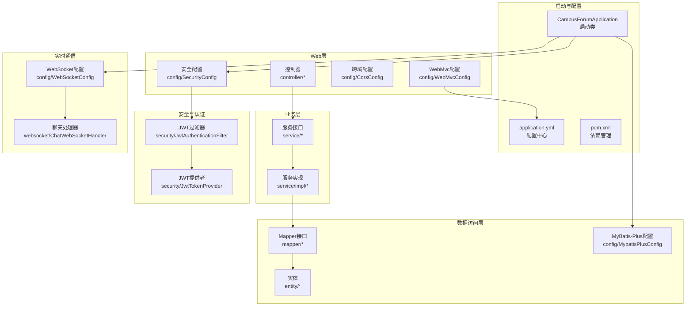
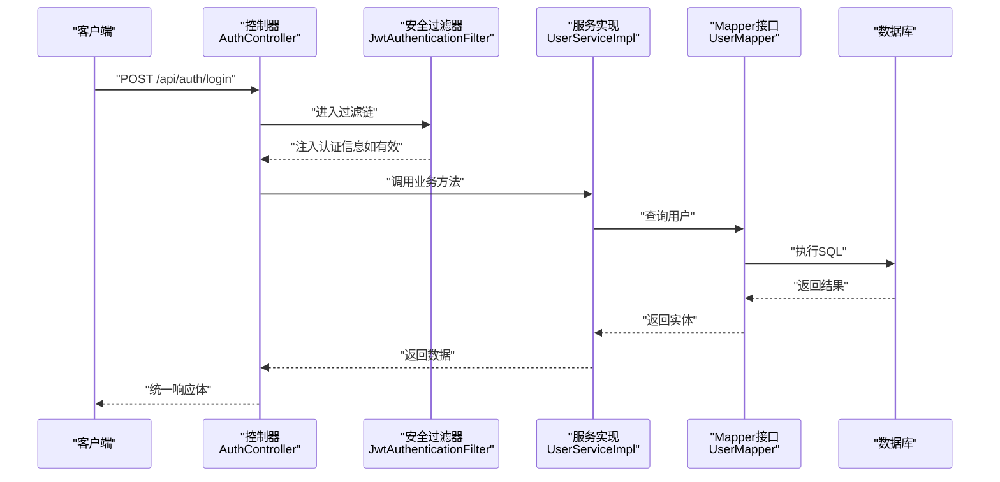
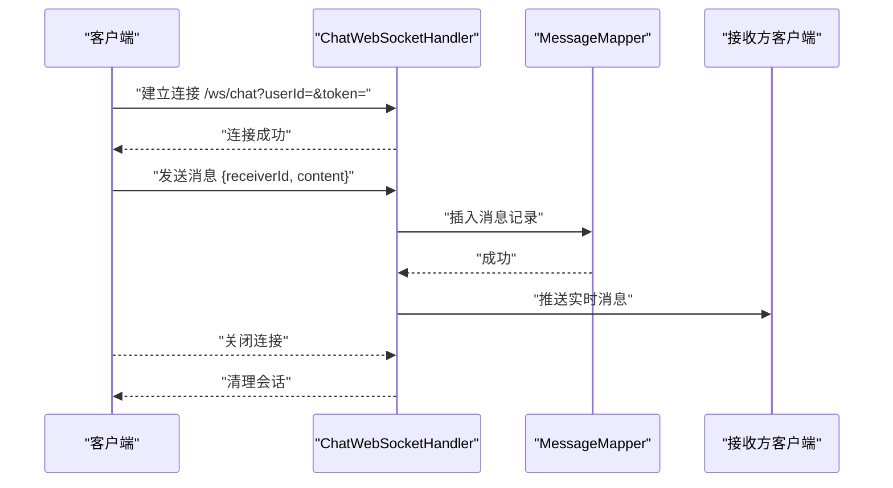
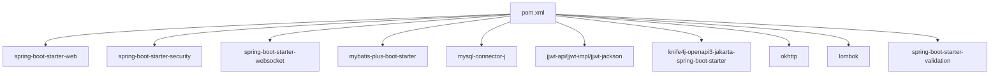

# 项目结构与配置

<cite>
**本文引用的文件**
- [CampusForumApplication.java](file://campus-forum-backend/src/main/java/com/campus/forum/CampusForumApplication.java)
- [application.yml](file://campus-forum-backend/src/main/resources/application.yml)
- [pom.xml](file://campus-forum-backend/pom.xml)
- [GlobalExceptionHandler.java](file://campus-forum-backend/src/main/java/com/campus/forum/common/GlobalExceptionHandler.java)
- [Result.java](file://campus-forum-backend/src/main/java/com/campus/forum/common/Result.java)
- [WebSocketConfig.java](file://campus-forum-backend/src/main/java/com/campus/forum/config/WebSocketConfig.java)
- [SecurityConfig.java](file://campus-forum-backend/src/main/java/com/campus/forum/config/SecurityConfig.java)
- [MybatisPlusConfig.java](file://campus-forum-backend/src/main/java/com/campus/forum/config/MybatisPlusConfig.java)
- [JwtTokenProvider.java](file://campus-forum-backend/src/main/java/com/campus/forum/security/JwtTokenProvider.java)
- [JwtAuthenticationFilter.java](file://campus-forum-backend/src/main/java/com/campus/forum/security/JwtAuthenticationFilter.java)
- [CorsConfig.java](file://campus-forum-backend/src/main/java/com/campus/forum/config/CorsConfig.java)
- [WebMvcConfig.java](file://campus-forum-backend/src/main/java/com/campus/forum/config/WebMvcConfig.java)
- [AuthController.java](file://campus-forum-backend/src/main/java/com/campus/forum/controller/AuthController.java)
- [User.java](file://campus-forum-backend/src/main/java/com/campus/forum/entity/User.java)
- [UserServiceImpl.java](file://campus-forum-backend/src/main/java/com/campus/forum/service/impl/UserServiceImpl.java)
- [ChatWebSocketHandler.java](file://campus-forum-backend/src/main/java/com/campus/forum/websocket/ChatWebSocketHandler.java)
- [LoginRequest.java](file://campus-forum-backend/src/main/java/com/campus/forum/dto/request/LoginRequest.java)
</cite>

## 目录
1. [简介](#简介)
2. [项目结构](#项目结构)
3. [核心组件](#核心组件)
4. [架构总览](#架构总览)
5. [详细组件分析](#详细组件分析)
6. [依赖分析](#依赖分析)
7. [性能考虑](#性能考虑)
8. [故障排查指南](#故障排查指南)
9. [结论](#结论)
10. [附录](#附录)

## 简介
本文件面向PBL项目后端，系统性阐述Spring Boot应用的启动类设计、包结构组织原则、Maven依赖管理策略，并深入解析application.yml中的关键配置项（数据库连接、JWT、WebSocket、文件上传、Knife4j等）。同时提供项目启动流程、配置加载机制与环境变量管理的最佳实践，帮助开发者快速理解并高效维护该后端工程。

## 项目结构
后端采用标准Spring Boot多模块布局，核心代码位于src/main/java下，按领域与层次进行清晰分层：
- 启动类：位于根包com.campus.forum，负责应用引导与Mapper扫描
- 配置层：config包集中管理跨域、安全、MyBatis-Plus、WebSocket、WebMvc等配置
- 安全层：security包封装JWT认证与授权过滤链
- 控制器层：controller包按功能域划分REST接口，含admin子包
- DTO层：dto包存放请求/响应对象
- 实体层：entity包定义持久化实体
- Mapper层：mapper包存放MyBatis映射接口
- 服务层：service包定义接口，impl包实现业务逻辑
- WebSocket层：websocket包处理实时通信
- 通用工具：common包提供统一返回体与全局异常处理
- 资源：resources目录包含application.yml与MyBatis XML映射文件



图表来源
- [CampusForumApplication.java:1-17](file://campus-forum-backend/src/main/java/com/campus/forum/CampusForumApplication.java#L1-L17)
- [SecurityConfig.java:1-67](file://campus-forum-backend/src/main/java/com/campus/forum/config/SecurityConfig.java#L1-L67)
- [MybatisPlusConfig.java:1-24](file://campus-forum-backend/src/main/java/com/campus/forum/config/MybatisPlusConfig.java#L1-L24)
- [WebSocketConfig.java:1-28](file://campus-forum-backend/src/main/java/com/campus/forum/config/WebSocketConfig.java#L1-L28)
- [WebMvcConfig.java:1-24](file://campus-forum-backend/src/main/java/com/campus/forum/config/WebMvcConfig.java#L1-L24)
- [JwtTokenProvider.java:1-93](file://campus-forum-backend/src/main/java/com/campus/forum/security/JwtTokenProvider.java#L1-L93)
- [JwtAuthenticationFilter.java:1-59](file://campus-forum-backend/src/main/java/com/campus/forum/security/JwtAuthenticationFilter.java#L1-L59)
- [ChatWebSocketHandler.java:1-89](file://campus-forum-backend/src/main/java/com/campus/forum/websocket/ChatWebSocketHandler.java#L1-L89)

章节来源
- [CampusForumApplication.java:1-17](file://campus-forum-backend/src/main/java/com/campus/forum/CampusForumApplication.java#L1-L17)
- [pom.xml:1-136](file://campus-forum-backend/pom.xml#L1-L136)

## 核心组件
- 启动类与包扫描
  - 使用@SpringBootApplication启用自动装配与组件扫描，并通过@MapperScan指定Mapper扫描基础包，确保MyBatis-Plus能发现所有Mapper接口。
- 统一返回体与全局异常
  - Result提供统一封装的响应结构；GlobalExceptionHandler对业务异常、参数校验异常、鉴权异常及未知异常进行分类处理，保证对外一致的错误语义。
- 安全与认证
  - SecurityConfig基于SecurityFilterChain构建无状态安全策略，开放公开接口，限制管理员接口，其余均需认证；集成JWT过滤器在UsernamePasswordAuthenticationFilter之前执行。
  - JwtTokenProvider负责生成、解析与校验JWT；JwtAuthenticationFilter从请求头或WebSocket查询参数中提取令牌并注入Security上下文。
- 数据访问与分页
  - MybatisPlusConfig注册分页插件，确保分页生效；实体使用注解标识主键、字段填充与逻辑删除字段。
- WebSocket与文件上传
  - WebSocketConfig注册聊天与通知处理器；WebMvcConfig将本地文件系统路径映射为可访问URL，结合application.yml中的上传路径与URL前缀。
- API文档
  - Knife4j开启OpenAPI文档，便于联调与测试。

章节来源
- [GlobalExceptionHandler.java:1-57](file://campus-forum-backend/src/main/java/com/campus/forum/common/GlobalExceptionHandler.java#L1-L57)
- [Result.java:1-37](file://campus-forum-backend/src/main/java/com/campus/forum/common/Result.java#L1-L37)
- [SecurityConfig.java:1-67](file://campus-forum-backend/src/main/java/com/campus/forum/config/SecurityConfig.java#L1-L67)
- [JwtTokenProvider.java:1-93](file://campus-forum-backend/src/main/java/com/campus/forum/security/JwtTokenProvider.java#L1-L93)
- [JwtAuthenticationFilter.java:1-59](file://campus-forum-backend/src/main/java/com/campus/forum/security/JwtAuthenticationFilter.java#L1-L59)
- [MybatisPlusConfig.java:1-24](file://campus-forum-backend/src/main/java/com/campus/forum/config/MybatisPlusConfig.java#L1-L24)
- [WebSocketConfig.java:1-28](file://campus-forum-backend/src/main/java/com/campus/forum/config/WebSocketConfig.java#L1-L28)
- [WebMvcConfig.java:1-24](file://campus-forum-backend/src/main/java/com/campus/forum/config/WebMvcConfig.java#L1-L24)

## 架构总览
下图展示从客户端到后端的关键交互路径，涵盖HTTP REST、WebSocket、数据库与AI服务调用：



图表来源
- [AuthController.java:1-39](file://campus-forum-backend/src/main/java/com/campus/forum/controller/AuthController.java#L1-L39)
- [JwtAuthenticationFilter.java:1-59](file://campus-forum-backend/src/main/java/com/campus/forum/security/JwtAuthenticationFilter.java#L1-L59)
- [UserServiceImpl.java:1-79](file://campus-forum-backend/src/main/java/com/campus/forum/service/impl/UserServiceImpl.java#L1-L79)
- [User.java:1-33](file://campus-forum-backend/src/main/java/com/campus/forum/entity/User.java#L1-L33)

## 详细组件分析

### 启动类与引导流程
- 设计要点
  - 使用@SpringBootApplication启用自动装配与组件扫描
  - 通过@MapperScan("com.campus.forum.mapper")确保MyBatis-Plus扫描到所有Mapper接口
- 引导顺序
  - Spring Boot启动后，先加载application.yml中的配置，再初始化各配置类与组件，最后暴露REST接口与WebSocket端点

章节来源
- [CampusForumApplication.java:1-17](file://campus-forum-backend/src/main/java/com/campus/forum/CampusForumApplication.java#L1-L17)

### 安全与认证体系
- 安全策略
  - 禁用CSRF，启用CORS，会话策略为STATELESS
  - 对公开接口放行（认证、部分查询、上传、Knife4j）
  - 管理员接口仅ADMIN角色可访问
  - 其余接口均需认证
- JWT工作流
  - 登录成功后由服务层返回JWT；后续请求在Header携带Authorization: Bearer {token}
  - 过滤器从Header或WebSocket查询参数解析令牌，校验后注入认证信息

```mermaid
sequenceDiagram
participant Client as "客户端"
participant Filter as "JwtAuthenticationFilter"
participant Provider as "JwtTokenProvider"
participant Details as "UserDetailsServiceImpl"
Client->>Filter : "请求带Authorization或WebSocket参数"
Filter->>Provider : "validateToken()"
alt 令牌有效
Provider-->>Filter : "true"
Filter->>Details : "loadUserByUsername(userId)"
Details-->>Filter : "UserDetails"
Filter-->>Client : "请求继续已认证"
else 无效或缺失
Provider-->>Filter : "false"
Filter-->>Client : "继续放行交由后续拦截器或业务处理"
end
```

图表来源
- [JwtAuthenticationFilter.java:1-59](file://campus-forum-backend/src/main/java/com/campus/forum/security/JwtAuthenticationFilter.java#L1-L59)
- [JwtTokenProvider.java:1-93](file://campus-forum-backend/src/main/java/com/campus/forum/security/JwtTokenProvider.java#L1-L93)

章节来源
- [SecurityConfig.java:1-67](file://campus-forum-backend/src/main/java/com/campus/forum/config/SecurityConfig.java#L1-L67)
- [JwtTokenProvider.java:1-93](file://campus-forum-backend/src/main/java/com/campus/forum/security/JwtTokenProvider.java#L1-L93)
- [JwtAuthenticationFilter.java:1-59](file://campus-forum-backend/src/main/java/com/campus/forum/security/JwtAuthenticationFilter.java#L1-L59)

### 数据访问与分页
- 分页插件
  - 注册PaginationInnerInterceptor并指定数据库类型为MySQL，确保分页生效
- 实体与字段
  - 使用@TableId、@TableName、@TableField等注解标识主键、表名与字段填充策略
  - 逻辑删除字段status映射不同值表示删除状态

章节来源
- [MybatisPlusConfig.java:1-24](file://campus-forum-backend/src/main/java/com/campus/forum/config/MybatisPlusConfig.java#L1-L24)
- [User.java:1-33](file://campus-forum-backend/src/main/java/com/campus/forum/entity/User.java#L1-L33)

### WebSocket实时通信
- 配置与端点
  - 注册两个处理器：/ws/chat（私信）、/ws/notify（通知），允许任意来源
- 连接与消息处理
  - 建立连接时按userId建立映射；断开时移除；收到文本消息后持久化并尝试推送至接收方
- 令牌传递
  - 支持Header Authorization与WebSocket查询参数token两种方式



图表来源
- [WebSocketConfig.java:1-28](file://campus-forum-backend/src/main/java/com/campus/forum/config/WebSocketConfig.java#L1-L28)
- [ChatWebSocketHandler.java:1-89](file://campus-forum-backend/src/main/java/com/campus/forum/websocket/ChatWebSocketHandler.java#L1-L89)

章节来源
- [WebSocketConfig.java:1-28](file://campus-forum-backend/src/main/java/com/campus/forum/config/WebSocketConfig.java#L1-L28)
- [ChatWebSocketHandler.java:1-89](file://campus-forum-backend/src/main/java/com/campus/forum/websocket/ChatWebSocketHandler.java#L1-L89)

### 统一返回体与异常处理
- 返回体
  - Result提供success/error静态方法，统一code/message/data结构
- 全局异常
  - 捕获业务异常、参数校验异常、绑定异常、约束异常与通用异常，分别返回对应状态码与提示

章节来源
- [Result.java:1-37](file://campus-forum-backend/src/main/java/com/campus/forum/common/Result.java#L1-L37)
- [GlobalExceptionHandler.java:1-57](file://campus-forum-backend/src/main/java/com/campus/forum/common/GlobalExceptionHandler.java#L1-L57)

### 文件上传与静态资源映射
- 上传路径与URL前缀
  - 在application.yml中配置本地上传目录与对外访问前缀
- 映射规则
  - WebMvcConfig将/uploads/**映射到本地文件系统路径，使上传文件可直接访问

章节来源
- [application.yml:43-46](file://campus-forum-backend/src/main/resources/application.yml#L43-L46)
- [WebMvcConfig.java:1-24](file://campus-forum-backend/src/main/java/com/campus/forum/config/WebMvcConfig.java#L1-L24)

### API文档与调试
- Knife4j
  - 开启OpenAPI文档，支持中文语言设置，便于前后端联调

章节来源
- [application.yml:48-53](file://campus-forum-backend/src/main/resources/application.yml#L48-L53)

### 示例：认证控制器与登录DTO
- 控制器
  - 提供注册与登录接口，返回统一Result结构
- DTO
  - LoginRequest包含用户名与密码的非空校验

章节来源
- [AuthController.java:1-39](file://campus-forum-backend/src/main/java/com/campus/forum/controller/AuthController.java#L1-L39)
- [LoginRequest.java:1-14](file://campus-forum-backend/src/main/java/com/campus/forum/dto/request/LoginRequest.java#L1-L14)

## 依赖分析
- 技术栈与版本
  - Spring Boot 3.2.0（Java 17）
  - MyBatis-Plus 3.5.5
  - jjwt 0.12.3
  - Knife4j 4.4.0
  - OkHttp3 4.12.0
- 关键依赖
  - spring-boot-starter-web：Web层
  - spring-boot-starter-security：安全
  - spring-boot-starter-websocket：WebSocket
  - mybatis-plus-boot-starter：数据访问
  - mysql-connector-j：数据库驱动
  - spring-boot-starter-validation：参数校验
  - spring-boot-starter-test/spring-security-test：测试



图表来源
- [pom.xml:1-136](file://campus-forum-backend/pom.xml#L1-L136)

章节来源
- [pom.xml:1-136](file://campus-forum-backend/pom.xml#L1-L136)

## 性能考虑
- 无状态设计
  - SessionCreationPolicy.STATELESS减少服务器状态存储，提升横向扩展能力
- 分页优化
  - MyBatis-Plus分页插件确保只返回必要数据，避免全表扫描
- 缓存建议
  - 对热点查询（如用户资料、热门内容）引入Redis缓存
- 日志与监控
  - 结合SLF4J与Spring Boot Actuator收集指标，定位慢查询与异常
- WebSocket并发
  - 使用ConcurrentHashMap维护会话，注意高并发下的锁竞争与内存占用

## 故障排查指南
- 无法连接数据库
  - 检查application.yml中的driver-class-name、url、username、password是否正确
- JWT无效或过期
  - 确认前端是否在Header中携带Authorization: Bearer {token}；检查jwt.secret与jwt.expiration配置
- WebSocket无法连接
  - 确认WebSocket端点与跨域配置；检查token参数是否随URL传入
- 文件上传失败
  - 检查upload.path是否存在且具备读写权限；确认WebMvc映射是否生效
- 参数校验失败
  - 查看GlobalExceptionHandler对MethodArgumentNotValidException的处理，核对DTO注解与请求体格式
- 权限不足
  - 确认用户角色与SecurityConfig中的放行规则匹配

章节来源
- [application.yml:1-53](file://campus-forum-backend/src/main/resources/application.yml#L1-L53)
- [SecurityConfig.java:1-67](file://campus-forum-backend/src/main/java/com/campus/forum/config/SecurityConfig.java#L1-L67)
- [GlobalExceptionHandler.java:1-57](file://campus-forum-backend/src/main/java/com/campus/forum/common/GlobalExceptionHandler.java#L1-L57)

## 结论
本项目遵循Spring Boot最佳实践，采用清晰的分层与包结构，结合JWT无状态认证、MyBatis-Plus分页、WebSocket实时通信与Knife4j文档，形成完整的后端技术栈。通过统一异常处理与返回体，提升了系统的可维护性与一致性。建议在生产环境中进一步完善缓存、监控与安全加固措施。

## 附录
- 配置项速览（来自application.yml）
  - 服务器：端口、上下文路径
  - 数据源：驱动、URL、账号、密码
  - 文件上传：本地路径与对外URL前缀
  - MyBatis-Plus：XML映射位置、逻辑删除字段与值、驼峰映射、日志输出
  - JWT：密钥与过期时间
  - AI：提供商、API Key、模型与基础URL
  - Knife4j：开关与语言设置

章节来源
- [application.yml:1-53](file://campus-forum-backend/src/main/resources/application.yml#L1-L53)