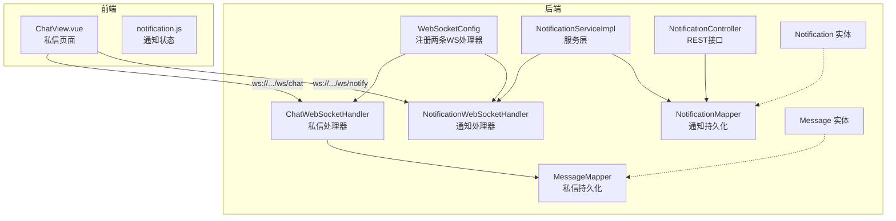
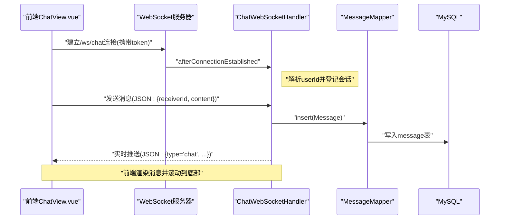
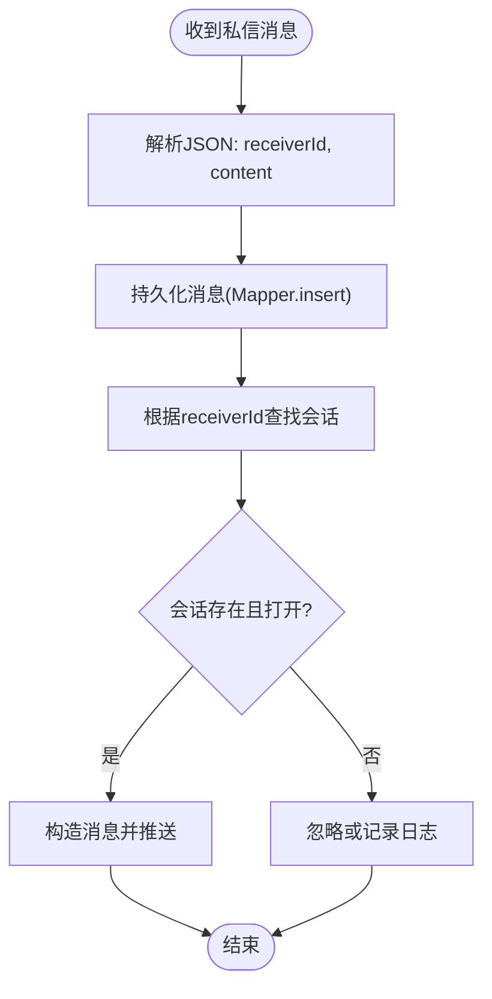
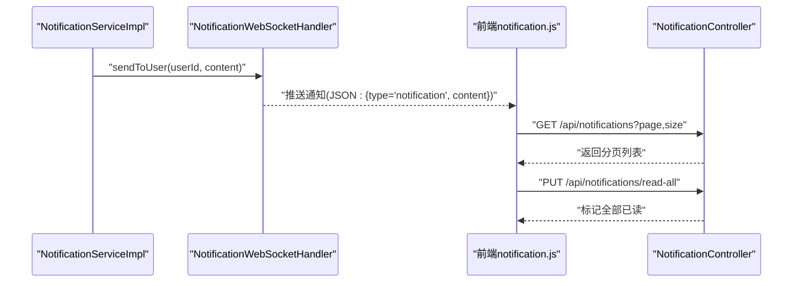
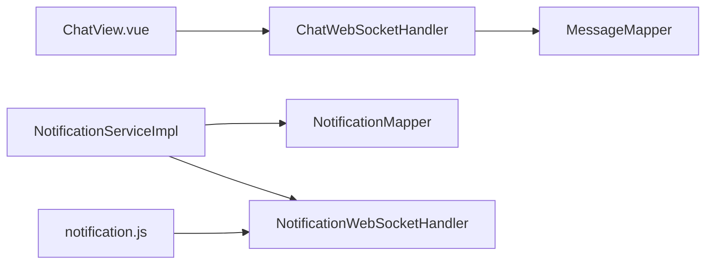
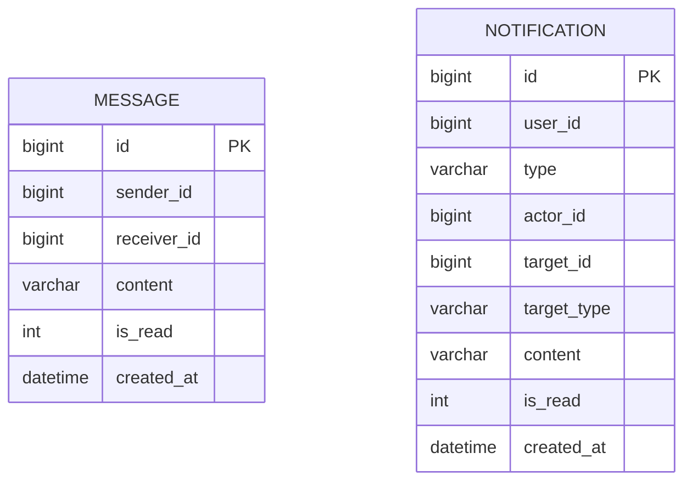

# 实时通信系统

<cite>
**本文引用的文件**
- [ChatWebSocketHandler.java](file://campus-forum-backend/src/main/java/com/campus/forum/websocket/ChatWebSocketHandler.java)
- [NotificationWebSocketHandler.java](file://campus-forum-backend/src/main/java/com/campus/forum/websocket/NotificationWebSocketHandler.java)
- [WebSocketConfig.java](file://campus-forum-backend/src/main/java/com/campus/forum/config/WebSocketConfig.java)
- [Message.java](file://campus-forum-backend/src/main/java/com/campus/forum/entity/Message.java)
- [Notification.java](file://campus-forum-backend/src/main/java/com/campus/forum/entity/Notification.java)
- [MessageMapper.java](file://campus-forum-backend/src/main/java/com/campus/forum/mapper/MessageMapper.java)
- [NotificationMapper.java](file://campus-forum-backend/src/main/java/com/campus/forum/mapper/NotificationMapper.java)
- [NotificationServiceImpl.java](file://campus-forum-backend/src/main/java/com/campus/forum/service/impl/NotificationServiceImpl.java)
- [NotificationController.java](file://campus-forum-backend/src/main/java/com/campus/forum/controller/NotificationController.java)
- [application.yml](file://campus-forum-backend/src/main/resources/application.yml)
- [GlobalExceptionHandler.java](file://campus-forum-backend/src/main/java/com/campus/forum/common/GlobalExceptionHandler.java)
- [ChatView.vue](file://campus-forum-frontend/src/views/ChatView.vue)
- [notification.js](file://campus-forum-frontend/src/stores/notification.js)
</cite>

## 目录
1. [简介](#简介)
2. [项目结构](#项目结构)
3. [核心组件](#核心组件)
4. [架构总览](#架构总览)
5. [详细组件分析](#详细组件分析)
6. [依赖分析](#依赖分析)
7. [性能考虑](#性能考虑)
8. [故障排查指南](#故障排查指南)
9. [结论](#结论)
10. [附录](#附录)

## 简介
本技术文档聚焦于PBL项目的实时通信系统，覆盖WebSocket架构设计（连接管理、消息路由、状态监控与断线重连）、私信聊天系统（消息存储策略、在线状态管理、实时推送）、通知系统（事件驱动、消息队列与用户状态同步）、WebSocket连接配置、消息格式定义、错误处理策略，以及与前端Vue.js组件的集成与消息交互模式。同时给出性能优化、并发处理与内存管理建议。

## 项目结构
后端采用Spring Boot + Spring WebSocket + MyBatis-Plus；前端使用Vue 3 + Pinia + Element Plus。实时通信由两条WebSocket通道构成：
- 私信通道：/ws/chat，用于点对点私信消息的收发与持久化
- 通知通道：/ws/notify，用于向指定用户推送系统通知

图表来源
- [WebSocketConfig.java:15-26](file://campus-forum-backend/src/main/java/com/campus/forum/config/WebSocketConfig.java#L15-L26)
- [ChatWebSocketHandler.java:25-88](file://campus-forum-backend/src/main/java/com/campus/forum/websocket/ChatWebSocketHandler.java#L25-L88)
- [NotificationWebSocketHandler.java:20-77](file://campus-forum-backend/src/main/java/com/campus/forum/websocket/NotificationWebSocketHandler.java#L20-L77)
- [NotificationServiceImpl.java:18-37](file://campus-forum-backend/src/main/java/com/campus/forum/service/impl/NotificationServiceImpl.java#L18-L37)
- [NotificationController.java:20-66](file://campus-forum-backend/src/main/java/com/campus/forum/controller/NotificationController.java#L20-L66)
- [MessageMapper.java:10-15](file://campus-forum-backend/src/main/java/com/campus/forum/mapper/MessageMapper.java#L10-L15)
- [NotificationMapper.java:7-15](file://campus-forum-backend/src/main/java/com/campus/forum/mapper/NotificationMapper.java#L7-L15)
- [Message.java:9-18](file://campus-forum-backend/src/main/java/com/campus/forum/entity/Message.java#L9-L18)
- [Notification.java:9-22](file://campus-forum-backend/src/main/java/com/campus/forum/entity/Notification.java#L9-L22)
- [ChatView.vue:32-49](file://campus-forum-frontend/src/views/ChatView.vue#L32-L49)
- [notification.js:5-30](file://campus-forum-frontend/src/stores/notification.js#L5-L30)

章节来源
- [WebSocketConfig.java:15-26](file://campus-forum-backend/src/main/java/com/campus/forum/config/WebSocketConfig.java#L15-L26)
- [application.yml:1-53](file://campus-forum-backend/src/main/resources/application.yml#L1-L53)

## 核心组件
- WebSocket配置与路由
  - 注册两条处理器：/ws/chat 与 /ws/notify
  - 允许跨域来源，便于前后端联调
- 私信处理器
  - 基于userId映射在线会话，接收消息后持久化并实时推送给对方
  - 从URL查询参数解析userId，避免浏览器不支持自定义Header的问题
- 通知处理器
  - 维护userId到会话的映射，提供按用户推送方法
  - 服务层通过该处理器进行实时通知下发
- 通知服务与控制器
  - 服务层持久化通知并调用WebSocket处理器推送
  - 控制器提供REST接口用于通知列表、标记已读、未读统计
- 数据模型与持久化
  - Message/Notification实体与对应Mapper完成数据库操作
- 前端集成
  - ChatView.vue通过WebSocket与后端私信通道交互
  - notification.js维护通知未读数与列表状态

章节来源
- [WebSocketConfig.java:15-26](file://campus-forum-backend/src/main/java/com/campus/forum/config/WebSocketConfig.java#L15-L26)
- [ChatWebSocketHandler.java:25-88](file://campus-forum-backend/src/main/java/com/campus/forum/websocket/ChatWebSocketHandler.java#L25-L88)
- [NotificationWebSocketHandler.java:20-77](file://campus-forum-backend/src/main/java/com/campus/forum/websocket/NotificationWebSocketHandler.java#L20-L77)
- [NotificationServiceImpl.java:18-37](file://campus-forum-backend/src/main/java/com/campus/forum/service/impl/NotificationServiceImpl.java#L18-L37)
- [NotificationController.java:20-66](file://campus-forum-backend/src/main/java/com/campus/forum/controller/NotificationController.java#L20-L66)
- [Message.java:9-18](file://campus-forum-backend/src/main/java/com/campus/forum/entity/Message.java#L9-L18)
- [Notification.java:9-22](file://campus-forum-backend/src/main/java/com/campus/forum/entity/Notification.java#L9-L22)
- [MessageMapper.java:10-15](file://campus-forum-backend/src/main/java/com/campus/forum/mapper/MessageMapper.java#L10-L15)
- [NotificationMapper.java:7-15](file://campus-forum-backend/src/main/java/com/campus/forum/mapper/NotificationMapper.java#L7-L15)
- [ChatView.vue:32-49](file://campus-forum-frontend/src/views/ChatView.vue#L32-L49)
- [notification.js:5-30](file://campus-forum-frontend/src/stores/notification.js#L5-L30)

## 架构总览
下图展示从浏览器到后端处理器、服务层、持久化与回推的完整链路。

图表来源
- [ChatWebSocketHandler.java:31-75](file://campus-forum-backend/src/main/java/com/campus/forum/websocket/ChatWebSocketHandler.java#L31-L75)
- [MessageMapper.java:10-15](file://campus-forum-backend/src/main/java/com/campus/forum/mapper/MessageMapper.java#L10-L15)
- [ChatView.vue:32-49](file://campus-forum-frontend/src/views/ChatView.vue#L32-L49)

## 详细组件分析

### 私信聊天系统
- 连接管理
  - 使用ConcurrentHashMap维护userId到WebSocketSession的映射
  - 在连接建立与关闭时更新映射，确保并发安全
- 消息路由与持久化
  - 解析请求JSON中的receiverId与content
  - 构造Message实体并调用MessageMapper插入数据库
- 实时推送
  - 通过receiverId查找目标会话，若会话存在且打开则发送文本消息
  - 消息格式包含type、senderId、content、time等字段
- 断线重连
  - 当前实现未内置自动重连逻辑；建议前端在连接断开时主动重试并补拉历史消息

图表来源
- [ChatWebSocketHandler.java:48-75](file://campus-forum-backend/src/main/java/com/campus/forum/websocket/ChatWebSocketHandler.java#L48-L75)
- [MessageMapper.java:10-15](file://campus-forum-backend/src/main/java/com/campus/forum/mapper/MessageMapper.java#L10-L15)

章节来源
- [ChatWebSocketHandler.java:25-88](file://campus-forum-backend/src/main/java/com/campus/forum/websocket/ChatWebSocketHandler.java#L25-L88)
- [Message.java:9-18](file://campus-forum-backend/src/main/java/com/campus/forum/entity/Message.java#L9-L18)
- [MessageMapper.java:10-15](file://campus-forum-backend/src/main/java/com/campus/forum/mapper/MessageMapper.java#L10-L15)
- [ChatView.vue:32-49](file://campus-forum-frontend/src/views/ChatView.vue#L32-L49)

### 通知系统（事件驱动与推送）
- 事件驱动与消息队列
  - 当前实现为直接持久化+实时推送，未见专用消息队列组件
  - 可扩展方向：引入RabbitMQ/Kafka，将“生成通知”与“推送通知”解耦
- 用户状态同步
  - 通过NotificationMapper提供未读计数与批量已读更新
  - 前端Pinia store维护未读数与通知列表，配合REST接口保持一致
- 实时推送
  - NotificationServiceImpl调用NotificationWebSocketHandler的sendToUser方法
  - 通知消息格式包含type与content字段

图表来源
- [NotificationServiceImpl.java:23-37](file://campus-forum-backend/src/main/java/com/campus/forum/service/impl/NotificationServiceImpl.java#L23-L37)
- [NotificationWebSocketHandler.java:47-57](file://campus-forum-backend/src/main/java/com/campus/forum/websocket/NotificationWebSocketHandler.java#L47-L57)
- [NotificationController.java:26-65](file://campus-forum-backend/src/main/java/com/campus/forum/controller/NotificationController.java#L26-L65)
- [notification.js:9-23](file://campus-forum-frontend/src/stores/notification.js#L9-L23)

章节来源
- [NotificationServiceImpl.java:18-57](file://campus-forum-backend/src/main/java/com/campus/forum/service/impl/NotificationServiceImpl.java#L18-L57)
- [NotificationWebSocketHandler.java:20-77](file://campus-forum-backend/src/main/java/com/campus/forum/websocket/NotificationWebSocketHandler.java#L20-L77)
- [NotificationController.java:20-66](file://campus-forum-backend/src/main/java/com/campus/forum/controller/NotificationController.java#L20-L66)
- [Notification.java:9-22](file://campus-forum-backend/src/main/java/com/campus/forum/entity/Notification.java#L9-L22)
- [NotificationMapper.java:7-15](file://campus-forum-backend/src/main/java/com/campus/forum/mapper/NotificationMapper.java#L7-L15)
- [notification.js:5-30](file://campus-forum-frontend/src/stores/notification.js#L5-L30)

### WebSocket连接配置与消息格式
- 连接配置
  - WebSocketConfig注册两条处理器路径与跨域策略
  - Chat/Notify处理器均继承TextWebSocketHandler，基于文本帧处理
- 连接参数
  - userId通过URL查询参数传递（浏览器限制不支持自定义Header）
  - Chat通道：ws://host:port/ws/chat?token=...
  - Notify通道：ws://host:port/ws/notify?token=...
- 消息格式
  - 私信消息：发送时需包含receiverId与content；接收时服务端返回type为chat的消息
  - 通知消息：服务端推送type为notification的消息，内容为字符串
- 断线重连
  - 当前未实现自动重连；建议前端在onclose中进行指数退避重试，并在重连成功后请求历史消息

章节来源
- [WebSocketConfig.java:15-26](file://campus-forum-backend/src/main/java/com/campus/forum/config/WebSocketConfig.java#L15-L26)
- [ChatWebSocketHandler.java:18-21](file://campus-forum-backend/src/main/java/com/campus/forum/websocket/ChatWebSocketHandler.java#L18-L21)
- [NotificationWebSocketHandler.java:13-17](file://campus-forum-backend/src/main/java/com/campus/forum/websocket/NotificationWebSocketHandler.java#L13-L17)
- [ChatView.vue:32-49](file://campus-forum-frontend/src/views/ChatView.vue#L32-L49)

### 错误处理策略
- 全局异常处理
  - 对业务异常、参数校验、绑定、权限不足等进行统一响应
- WebSocket异常
  - 通知推送过程中捕获IO异常并记录告警，避免影响其他推送
  - 私信处理器在解析userId失败时记录警告并跳过会话登记

章节来源
- [GlobalExceptionHandler.java:17-56](file://campus-forum-backend/src/main/java/com/campus/forum/common/GlobalExceptionHandler.java#L17-L56)
- [NotificationWebSocketHandler.java:53-55](file://campus-forum-backend/src/main/java/com/campus/forum/websocket/NotificationWebSocketHandler.java#L53-L55)
- [ChatWebSocketHandler.java:83-87](file://campus-forum-backend/src/main/java/com/campus/forum/websocket/ChatWebSocketHandler.java#L83-L87)

## 依赖分析
- 组件耦合
  - WebSocket处理器仅负责会话管理与消息转发，业务逻辑（如通知生成）由服务层承担，耦合度低
  - 服务层依赖WebSocket处理器与Mapper，形成清晰的分层
- 外部依赖
  - MySQL：存储Message与Notification
  - 前端：Vue生态（Composition API、Pinia、Element Plus）

图表来源
- [ChatWebSocketHandler.java:25-29](file://campus-forum-backend/src/main/java/com/campus/forum/websocket/ChatWebSocketHandler.java#L25-L29)
- [NotificationServiceImpl.java:20-21](file://campus-forum-backend/src/main/java/com/campus/forum/service/impl/NotificationServiceImpl.java#L20-L21)
- [NotificationWebSocketHandler.java:23-24](file://campus-forum-backend/src/main/java/com/campus/forum/websocket/NotificationWebSocketHandler.java#L23-L24)
- [MessageMapper.java:10-15](file://campus-forum-backend/src/main/java/com/campus/forum/mapper/MessageMapper.java#L10-L15)
- [NotificationMapper.java:7-15](file://campus-forum-backend/src/main/java/com/campus/forum/mapper/NotificationMapper.java#L7-L15)
- [ChatView.vue:32-49](file://campus-forum-frontend/src/views/ChatView.vue#L32-L49)
- [notification.js:5-30](file://campus-forum-frontend/src/stores/notification.js#L5-L30)

## 性能考虑
- 并发与内存
  - 使用ConcurrentHashMap管理会话映射，保证高并发下的线程安全
  - 建议限制单个用户的最大会话数，避免内存膨胀
- 序列化与网络
  - 使用Jackson进行JSON序列化，建议复用ObjectMapper实例（当前已注入）
  - 尽量压缩消息体，避免超长文本频繁推送
- 数据库
  - 私信历史查询使用索引字段组合，建议在sender_id/receiver_id/created_at上建立复合索引
  - 通知未读统计与批量已读更新使用原生SQL，减少ORM开销
- 缓存
  - 可引入Redis缓存活跃会话与未读计数，降低数据库压力
- 背压与限流
  - 建议在处理器中增加每用户消息速率限制，防止刷屏
- 断线重连与历史同步
  - 前端应实现指数退避重连；首次连接后请求最近N条历史消息，避免丢失

## 故障排查指南
- 连接失败
  - 检查WebSocketConfig是否正确注册路径与跨域设置
  - 确认前端连接URL包含正确的token与userId参数
- 推送失败
  - 查看通知处理器的日志，确认userId解析与会话是否存在
  - 若出现IO异常，检查网络稳定性与会话状态
- 私信未显示
  - 确认发送消息时包含receiverId与content
  - 检查数据库是否成功插入message记录
  - 前端控制台是否有JSON解析错误
- 通知未刷新
  - 确认REST接口返回的分页数据结构
  - 检查Pinia store中未读数与列表更新逻辑

章节来源
- [WebSocketConfig.java:15-26](file://campus-forum-backend/src/main/java/com/campus/forum/config/WebSocketConfig.java#L15-L26)
- [NotificationWebSocketHandler.java:53-57](file://campus-forum-backend/src/main/java/com/campus/forum/websocket/NotificationWebSocketHandler.java#L53-L57)
- [ChatWebSocketHandler.java:48-75](file://campus-forum-backend/src/main/java/com/campus/forum/websocket/ChatWebSocketHandler.java#L48-L75)
- [NotificationController.java:26-65](file://campus-forum-backend/src/main/java/com/campus/forum/controller/NotificationController.java#L26-L65)
- [notification.js:9-23](file://campus-forum-frontend/src/stores/notification.js#L9-L23)
- [ChatView.vue:32-49](file://campus-forum-frontend/src/views/ChatView.vue#L32-L49)

## 结论
本系统以两条WebSocket通道为核心，结合服务层与持久化层，实现了私信与通知的实时通信能力。当前实现简洁可靠，具备良好的扩展性。建议后续引入消息队列、Redis缓存与更完善的断线重连策略，进一步提升可靠性与性能。

## 附录
- 数据模型概览

图表来源
- [Message.java:9-18](file://campus-forum-backend/src/main/java/com/campus/forum/entity/Message.java#L9-L18)
- [Notification.java:9-22](file://campus-forum-backend/src/main/java/com/campus/forum/entity/Notification.java#L9-L22)

- 前端集成要点
  - ChatView.vue通过WebSocket与后端私信通道交互，消息格式需包含receiverId与content
  - notification.js维护未读数与列表，配合REST接口进行状态同步

章节来源
- [ChatView.vue:32-49](file://campus-forum-frontend/src/views/ChatView.vue#L32-L49)
- [notification.js:5-30](file://campus-forum-frontend/src/stores/notification.js#L5-L30)