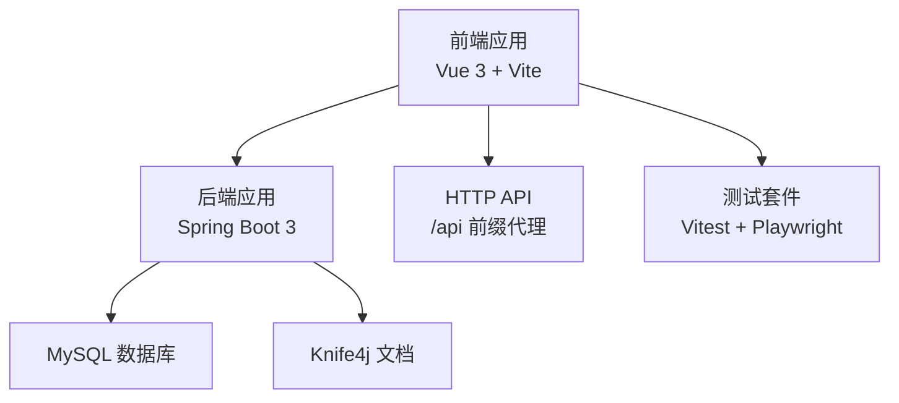
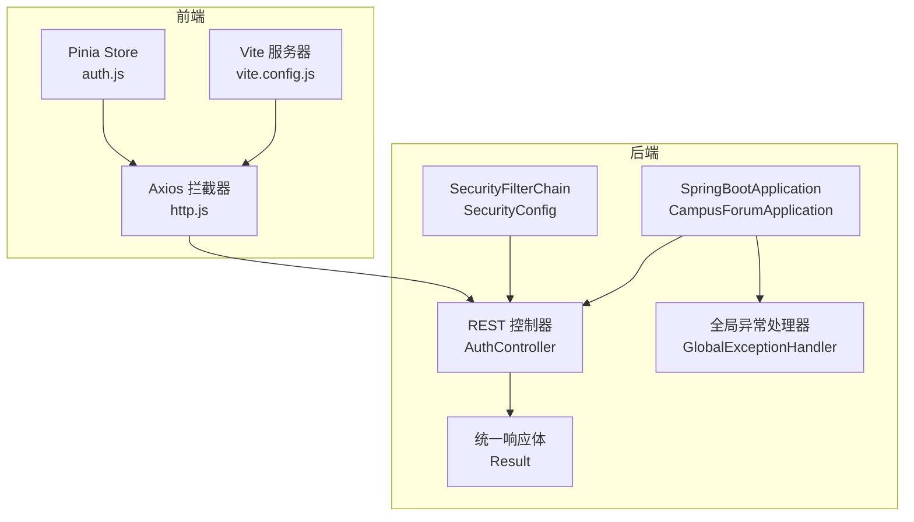
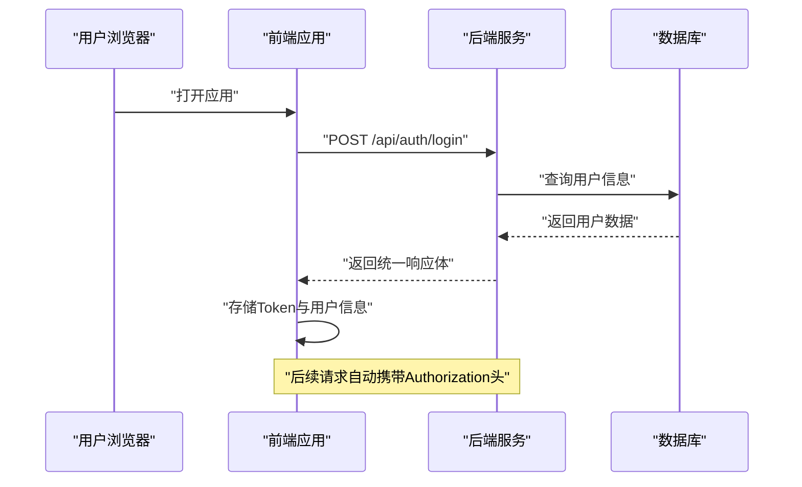
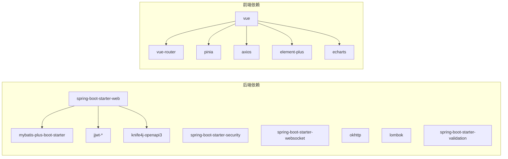

# 开发指南

<cite>
**本文引用的文件**
- [CampusForumApplication.java](file://campus-forum-backend/src/main/java/com/campus/forum/CampusForumApplication.java)
- [pom.xml](file://campus-forum-backend/pom.xml)
- [application.yml](file://campus-forum-backend/src/main/resources/application.yml)
- [Result.java](file://campus-forum-backend/src/main/java/com/campus/forum/common/Result.java)
- [GlobalExceptionHandler.java](file://campus-forum-backend/src/main/java/com/campus/forum/common/GlobalExceptionHandler.java)
- [SecurityConfig.java](file://campus-forum-backend/src/main/java/com/campus/forum/config/SecurityConfig.java)
- [AuthController.java](file://campus-forum-backend/src/main/java/com/campus/forum/controller/AuthController.java)
- [package.json](file://campus-forum-frontend/package.json)
- [vite.config.js](file://campus-forum-frontend/vite.config.js)
- [http.js](file://campus-forum-frontend/src/api/http.js)
- [auth.js](file://campus-forum-frontend/src/stores/auth.js)
- [auth.test.js](file://campus-forum-frontend/tests/unit/stores/auth.test.js)
- [playwright.config.js](file://campus-forum-frontend/playwright.config.js)
- [contribution.md](file://docs/contribution.md)
- [git-issues.md](file://docs/git-issues.md)
</cite>

## 目录
1. [引言](#引言)
2. [项目结构](#项目结构)
3. [核心组件](#核心组件)
4. [架构总览](#架构总览)
5. [详细组件分析](#详细组件分析)
6. [依赖分析](#依赖分析)
7. [性能考虑](#性能考虑)
8. [故障排查指南](#故障排查指南)
9. [结论](#结论)
10. [附录](#附录)

## 引言
本开发指南面向PBL项目团队成员，旨在提供从代码规范、开发流程到工具配置与测试策略的完整指引。文档结合后端Spring Boot与前端Vue3的实际实现，总结可复用的最佳实践，并给出新功能开发、性能优化、安全编码与技术债务管理的方法论。

## 项目结构
项目采用前后端分离架构：
- 后端：Spring Boot 3 + MyBatis-Plus + Spring Security + Knife4j（OpenAPI）
- 前端：Vue 3 + Vite + Pinia + Element Plus + ECharts + Playwright/Vitest

章节来源
- [pom.xml:1-136](file://campus-forum-backend/pom.xml#L1-L136)
- [package.json:1-37](file://campus-forum-frontend/package.json#L1-L37)
- [vite.config.js:1-27](file://campus-forum-frontend/vite.config.js#L1-L27)
- [application.yml:1-53](file://campus-forum-backend/src/main/resources/application.yml#L1-L53)

## 核心组件
- 统一响应体与异常处理：后端通过统一响应体与全局异常处理器，确保接口一致性与错误可追踪性。
- 安全与认证：基于Spring Security的无状态JWT认证，白名单与权限控制清晰。
- 前后端通信：前端通过Axios拦截器统一注入Token与错误处理；后端通过CORS与WebSocket支持。
- 测试体系：后端使用JUnit5，前端使用Vitest与Playwright，覆盖单元与端到端场景。

章节来源
- [Result.java:1-37](file://campus-forum-backend/src/main/java/com/campus/forum/common/Result.java#L1-L37)
- [GlobalExceptionHandler.java:1-57](file://campus-forum-backend/src/main/java/com/campus/forum/common/GlobalExceptionHandler.java#L1-L57)
- [SecurityConfig.java:1-67](file://campus-forum-backend/src/main/java/com/campus/forum/config/SecurityConfig.java#L1-L67)
- [http.js:1-41](file://campus-forum-frontend/src/api/http.js#L1-L41)
- [auth.js:1-37](file://campus-forum-frontend/src/stores/auth.js#L1-L37)

## 架构总览
后端启动入口扫描Mapper包，启用MyBatis-Plus与Knife4j；前端通过Vite代理将/api转发至后端，Axios拦截器统一处理鉴权与错误。

图示来源
- [CampusForumApplication.java:1-17](file://campus-forum-backend/src/main/java/com/campus/forum/CampusForumApplication.java#L1-L17)
- [SecurityConfig.java:1-67](file://campus-forum-backend/src/main/java/com/campus/forum/config/SecurityConfig.java#L1-L67)
- [AuthController.java:1-39](file://campus-forum-backend/src/main/java/com/campus/forum/controller/AuthController.java#L1-L39)
- [GlobalExceptionHandler.java:1-57](file://campus-forum-backend/src/main/java/com/campus/forum/common/GlobalExceptionHandler.java#L1-L57)
- [Result.java:1-37](file://campus-forum-backend/src/main/java/com/campus/forum/common/Result.java#L1-L37)
- [vite.config.js:1-27](file://campus-forum-frontend/vite.config.js#L1-L27)
- [http.js:1-41](file://campus-forum-frontend/src/api/http.js#L1-L41)
- [auth.js:1-37](file://campus-forum-frontend/src/stores/auth.js#L1-L37)

## 详细组件分析

### Java 后端规范与最佳实践
- 项目版本与依赖
  - 使用Java 17与Spring Boot 3，引入Web、Security、WebSocket、MyBatis-Plus、JWT、Knife4j、OkHttp3、Lombok、Validation等依赖。
- 配置要点
  - 数据源与MyBatis-Plus：逻辑删除字段、驼峰映射、Mapper XML路径。
  - JWT：密钥与过期时间配置。
  - AI Provider：文心一言接入参数。
  - 文件上传：大小限制与URL前缀。
- 控制器与统一响应
  - 控制器使用Swagger注解标注接口，返回统一响应体。
  - 全局异常处理覆盖业务异常、参数校验异常、访问拒绝与通用异常。
- 安全配置
  - 禁用CSRF，无状态会话，公开接口白名单，管理员接口受角色保护，其他接口均需认证。
  - JWT过滤器在用户名密码过滤器之前执行。

章节来源
- [pom.xml:1-136](file://campus-forum-backend/pom.xml#L1-L136)
- [application.yml:1-53](file://campus-forum-backend/src/main/resources/application.yml#L1-L53)
- [AuthController.java:1-39](file://campus-forum-backend/src/main/java/com/campus/forum/controller/AuthController.java#L1-L39)
- [Result.java:1-37](file://campus-forum-backend/src/main/java/com/campus/forum/common/Result.java#L1-L37)
- [GlobalExceptionHandler.java:1-57](file://campus-forum-backend/src/main/java/com/campus/forum/common/GlobalExceptionHandler.java#L1-L57)
- [SecurityConfig.java:1-67](file://campus-forum-backend/src/main/java/com/campus/forum/config/SecurityConfig.java#L1-L67)

### Vue.js 前端规范与最佳实践
- 项目脚本与依赖
  - 使用Vite构建，依赖Vue3、Vue Router、Pinia、Axios、Element Plus、ECharts等。
- Axios封装
  - 自动注入Authorization头，统一错误提示与401跳转。
- 状态管理
  - Pinia Store集中管理用户态与Token，持久化到localStorage。
- 组件与路由
  - 采用组合式API与自动导入组件/解析器，提升开发效率。
- 测试
  - Vitest用于Store单元测试，Playwright用于E2E测试，配置报告与重试策略。

章节来源
- [package.json:1-37](file://campus-forum-frontend/package.json#L1-L37)
- [vite.config.js:1-27](file://campus-forum-frontend/vite.config.js#L1-L27)
- [http.js:1-41](file://campus-forum-frontend/src/api/http.js#L1-L41)
- [auth.js:1-37](file://campus-forum-frontend/src/stores/auth.js#L1-L37)
- [auth.test.js:1-54](file://campus-forum-frontend/tests/unit/stores/auth.test.js#L1-L54)
- [playwright.config.js:1-35](file://campus-forum-frontend/playwright.config.js#L1-L35)

### Git 提交与贡献流程
- 贡献值量化
  - 代码提交（40%）、Issue完成质量（30%）、设计与架构贡献（20%）、协作与文档（10%）。
- 敏捷迭代
  - 四个Sprint，每周回顾，Issue类型分布以功能为主，Bug与测试占比合理。
- 贡献值分配
  - 以Git提交历史为依据，Issue难度系数由负责人与导师确认，形成最终贡献值。

章节来源
- [contribution.md:1-168](file://docs/contribution.md#L1-L168)
- [git-issues.md:1-144](file://docs/git-issues.md#L1-L144)

### API 设计与调用流程
- 认证接口
  - 注册与登录接口返回统一响应体，登录成功返回用户与令牌信息。
- 前后端交互
  - 前端通过Axios拦截器自动携带Token；后端通过SecurityFilterChain进行鉴权与放行规则控制。

图示来源
- [AuthController.java:1-39](file://campus-forum-backend/src/main/java/com/campus/forum/controller/AuthController.java#L1-L39)
- [http.js:1-41](file://campus-forum-frontend/src/api/http.js#L1-L41)
- [auth.js:1-37](file://campus-forum-frontend/src/stores/auth.js#L1-L37)

### 测试策略与编写指导
- 单元测试（后端）
  - 使用JUnit5对核心Service进行测试，建议覆盖边界条件与异常分支。
- 单元测试（前端）
  - 使用Vitest对Pinia Store进行快照与行为测试，Mock API函数，验证状态变更与本地存储。
- 端到端测试（前端）
  - 使用Playwright配置项目与报告，设置超时与重试策略，确保跨浏览器稳定性。

章节来源
- [auth.test.js:1-54](file://campus-forum-frontend/tests/unit/stores/auth.test.js#L1-L54)
- [playwright.config.js:1-35](file://campus-forum-frontend/playwright.config.js#L1-L35)

### 开发工具配置与调试技巧
- 后端
  - 使用Spring Boot DevTools（如需）提升热更新体验；IDE中配置JVM参数与日志级别；利用Knife4j快速验证接口。
- 前端
  - Vite默认端口5173，配置代理指向后端8080；使用ESLint/Prettier保持代码风格一致；在浏览器开发者工具中观察Axios拦截器与Token持久化。
- 调试
  - 后端：在SecurityFilterChain与JwtAuthenticationFilter处设置断点；前端：在Pinia Store与Axios拦截器设置断点定位问题。

章节来源
- [vite.config.js:1-27](file://campus-forum-frontend/vite.config.js#L1-L27)
- [http.js:1-41](file://campus-forum-frontend/src/api/http.js#L1-L41)
- [auth.js:1-37](file://campus-forum-frontend/src/stores/auth.js#L1-L37)
- [application.yml:1-53](file://campus-forum-backend/src/main/resources/application.yml#L1-L53)

### 新功能开发指导
- 模块创建
  - 后端：新增Controller/Service/Impl/Mapper/Entity，完善MyBatis-Plus配置与Knife4j注解；在SecurityFilterChain中补充权限规则。
  - 前端：新建页面组件与路由，按需引入Element Plus与ECharts；在Pinia中新增Store模块并持久化状态。
- API设计
  - 遵循REST风格命名，使用统一响应体；对输入参数进行显式校验与异常处理；对敏感操作进行权限控制。
- 测试编写
  - 先写Vitest单元测试，再写Playwright端到端测试；对关键流程（登录、发布、收藏、通知）建立回归用例。

章节来源
- [SecurityConfig.java:1-67](file://campus-forum-backend/src/main/java/com/campus/forum/config/SecurityConfig.java#L1-L67)
- [Result.java:1-37](file://campus-forum-backend/src/main/java/com/campus/forum/common/Result.java#L1-L37)
- [auth.js:1-37](file://campus-forum-frontend/src/stores/auth.js#L1-L37)

### 性能优化技巧
- 后端
  - 使用MyBatis-Plus分页与逻辑删除；对热点数据引入Redis缓存；对大模型调用增加限流与熔断。
- 前端
  - 路由与组件懒加载；图片懒加载；减少不必要的响应体体积；合理使用Pinia状态缓存。

章节来源
- [application.yml:19-28](file://campus-forum-backend/src/main/resources/application.yml#L19-L28)
- [pom.xml:86-91](file://campus-forum-backend/pom.xml#L86-L91)

### 安全编码实践
- 认证与授权
  - 使用BCrypt加密密码；JWT令牌短期有效；对公开接口与管理员接口分别放行与鉴权。
- 输入校验
  - 使用Bean Validation与全局异常处理，避免SQL注入与XSS风险。
- 文件上传
  - 限制文件大小与类型，存储于受控目录并提供安全URL前缀。

章节来源
- [SecurityConfig.java:1-67](file://campus-forum-backend/src/main/java/com/campus/forum/config/SecurityConfig.java#L1-L67)
- [GlobalExceptionHandler.java:1-57](file://campus-forum-backend/src/main/java/com/campus/forum/common/GlobalExceptionHandler.java#L1-L57)
- [application.yml:14-17](file://campus-forum-backend/src/main/resources/application.yml#L14-L17)

### 重构策略与技术债务管理
- 代码质量度量
  - 通过JUnit5与Vitest覆盖率评估核心逻辑；对高风险模块（认证、支付、AI调用）重点加固。
- 技术债务识别
  - 明确Sprint回顾中的问题项（如SSE代理断流、WebSocket Token传递），形成待办清单并跟踪解决。
- 持续改进
  - 建立Code Review清单，定期进行架构评审与性能回看；沉淀最佳实践文档。

章节来源
- [git-issues.md:42-46](file://docs/git-issues.md#L42-L46)
- [git-issues.md:98-102](file://docs/git-issues.md#L98-L102)

## 依赖分析
后端依赖以Spring Boot生态为核心，前端依赖以Vue3全家桶为主，两者通过Vite代理与Axios拦截器连接。

图示来源
- [pom.xml:27-117](file://campus-forum-backend/pom.xml#L27-L117)
- [package.json:13-35](file://campus-forum-frontend/package.json#L13-L35)

章节来源
- [pom.xml:1-136](file://campus-forum-backend/pom.xml#L1-L136)
- [package.json:1-37](file://campus-forum-frontend/package.json#L1-L37)

## 性能考虑
- 后端
  - 启用MyBatis-Plus逻辑删除与驼峰映射，减少SQL与映射成本；对热点数据引入缓存；对AI调用增加限流与降级。
- 前端
  - 路由懒加载与图片懒加载降低首屏压力；Axios统一超时与错误处理提升健壮性。

章节来源
- [application.yml:19-28](file://campus-forum-backend/src/main/resources/application.yml#L19-L28)
- [vite.config.js:17-25](file://campus-forum-frontend/vite.config.js#L17-L25)
- [http.js:4-7](file://campus-forum-frontend/src/api/http.js#L4-L7)

## 故障排查指南
- 认证失败
  - 检查Token是否正确存储与注入；确认后端SecurityFilterChain放行规则与JWT过滤器顺序。
- 参数校验失败
  - 查看全局异常处理器对MethodArgumentNotValidException与BindException的映射。
- 文件上传异常
  - 检查application.yml中的文件大小限制与上传路径配置。
- SSE/WS 断流或认证问题
  - 参考Issue回顾中的代理断流与WebSocket Token传递方案。

章节来源
- [GlobalExceptionHandler.java:30-49](file://campus-forum-backend/src/main/java/com/campus/forum/common/GlobalExceptionHandler.java#L30-L49)
- [application.yml:14-17](file://campus-forum-backend/src/main/resources/application.yml#L14-L17)
- [git-issues.md:98-102](file://docs/git-issues.md#L98-L102)

## 结论
本指南基于实际代码与配置，总结了PBL项目的开发规范、流程与最佳实践。建议团队在日常开发中坚持统一响应体、严格参数校验、完善的异常处理与测试覆盖，持续优化性能与安全性，并通过Code Review与技术债务跟踪机制推动长期演进。

## 附录
- 快速检查清单
  - 后端：控制器注解齐全、异常处理完备、权限规则明确、Knife4j文档更新。
  - 前端：拦截器生效、状态持久化、组件按需加载、测试用例覆盖关键路径。
- 常用命令
  - 后端：mvn spring-boot:run；前端：npm run dev/build/test:unit/test:e2e。