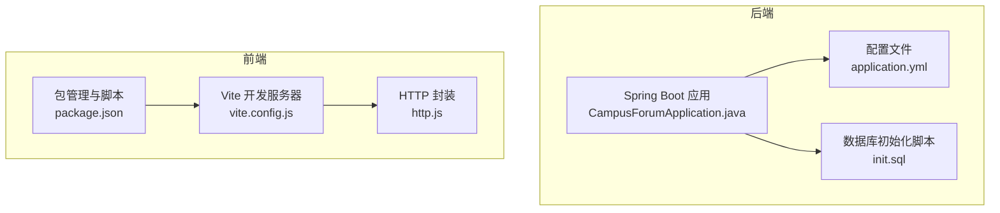
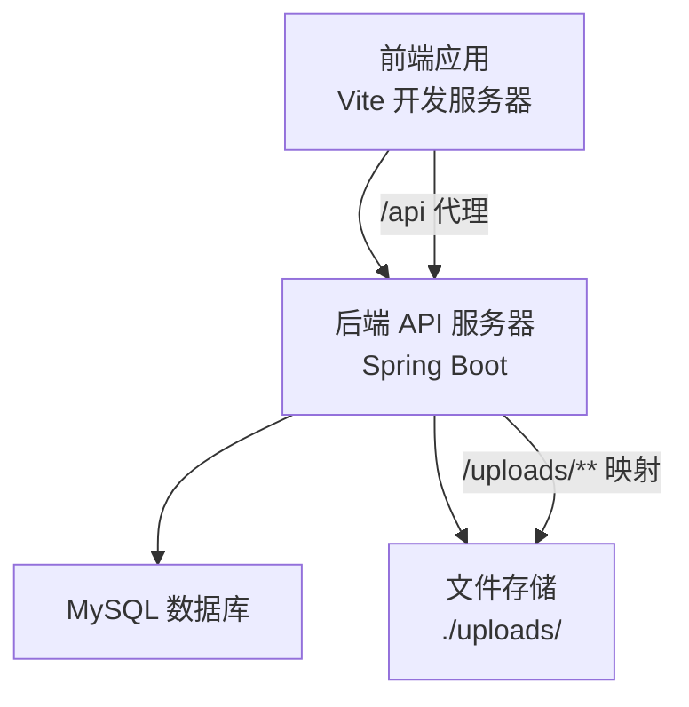
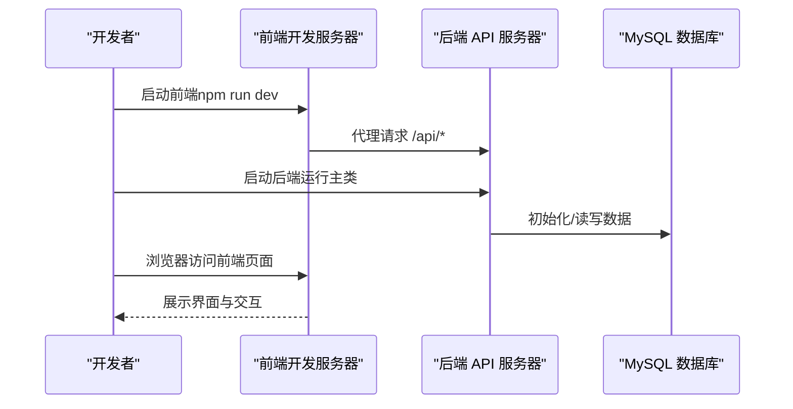
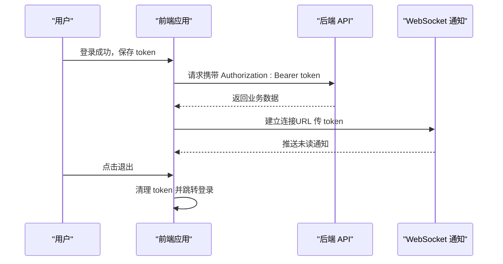
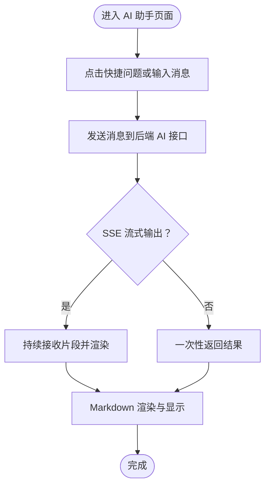
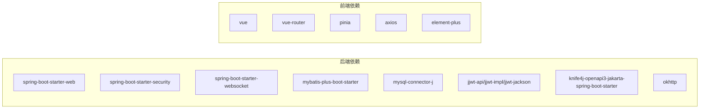

# 快速开始

<cite>
**本文引用的文件**
- [application.yml](file://campus-forum-backend/src/main/resources/application.yml)
- [pom.xml](file://campus-forum-backend/pom.xml)
- [CampusForumApplication.java](file://campus-forum-backend/src/main/java/com/campus/forum/CampusForumApplication.java)
- [init.sql](file://campus-forum-backend/docs/db/init.sql)
- [vite.config.js](file://campus-forum-frontend/vite.config.js)
- [package.json](file://campus-forum-frontend/package.json)
- [http.js](file://campus-forum-frontend/src/api/http.js)
- [WebMvcConfig.java](file://campus-forum-backend/src/main/java/com/campus/forum/config/WebMvcConfig.java)
- [AdminLayout.vue](file://campus-forum-frontend/src/layouts/AdminLayout.vue)
- [MainLayout.vue](file://campus-forum-frontend/src/layouts/MainLayout.vue)
- [AiAssistantView.vue](file://campus-forum-frontend/src/views/AiAssistantView.vue)
</cite>

## 目录
1. [引言](#引言)
2. [项目结构](#项目结构)
3. [核心组件](#核心组件)
4. [架构总览](#架构总览)
5. [详细组件分析](#详细组件分析)
6. [依赖分析](#依赖分析)
7. [性能考虑](#性能考虑)
8. [故障排查指南](#故障排查指南)
9. [结论](#结论)
10. [附录](#附录)

## 引言
本指南面向首次接触 PBL 项目的开发者，帮助你在本地快速完成环境准备、项目克隆、依赖安装、数据库初始化与启动调试。你将获得：
- 环境要求与安装步骤（JDK 17、Node.js、MySQL）
- 项目克隆与依赖安装命令
- 数据库初始化脚本与关键配置项说明（application.yml）
- 后端与前端启动流程与注意事项
- 常见问题排查与多操作系统配置建议

## 项目结构
项目采用前后端分离架构，后端为 Spring Boot 3 应用，前端为 Vue 3 + Vite 应用。关键目录与职责如下：
- 后端模块 campus-forum-backend：Spring Boot 应用，包含配置、控制器、服务、持久层、实体与资源文件
- 前端模块 campus-forum-frontend：Vue 3 应用，包含 API 封装、路由、状态管理、视图与构建配置
- docs/db/init.sql：数据库初始化脚本，包含用户、版块、活动、帖子、评论、通知、AI 历史等表与预置数据

**图表来源**
- [CampusForumApplication.java:10-16](file://campus-forum-backend/src/main/java/com/campus/forum/CampusForumApplication.java#L10-L16)
- [application.yml:1-53](file://campus-forum-backend/src/main/resources/application.yml#L1-L53)
- [init.sql:1-257](file://campus-forum-backend/docs/db/init.sql#L1-L257)
- [vite.config.js:1-27](file://campus-forum-frontend/vite.config.js#L1-L27)
- [package.json:1-37](file://campus-forum-frontend/package.json#L1-L37)
- [http.js:1-41](file://campus-forum-frontend/src/api/http.js#L1-L41)

**章节来源**
- [pom.xml:20-25](file://campus-forum-backend/pom.xml#L20-L25)
- [application.yml:1-53](file://campus-forum-backend/src/main/resources/application.yml#L1-L53)
- [init.sql:1-257](file://campus-forum-backend/docs/db/init.sql#L1-L257)
- [vite.config.js:1-27](file://campus-forum-frontend/vite.config.js#L1-L27)
- [package.json:1-37](file://campus-forum-frontend/package.json#L1-L37)
- [http.js:1-41](file://campus-forum-frontend/src/api/http.js#L1-L41)

## 核心组件
- 后端启动类：负责应用引导与 Mapper 扫描
- 配置文件：定义服务器端口、数据库连接、MyBatis-Plus、JWT、AI 大模型、文件上传、Knife4j 等
- 数据库脚本：初始化数据库、表结构与预置数据
- 前端开发服务器：Vite 代理后端 API，本地开发调试
- HTTP 封装：统一请求与响应拦截、鉴权与错误处理

**章节来源**
- [CampusForumApplication.java:10-16](file://campus-forum-backend/src/main/java/com/campus/forum/CampusForumApplication.java#L10-L16)
- [application.yml:1-53](file://campus-forum-backend/src/main/resources/application.yml#L1-L53)
- [init.sql:1-257](file://campus-forum-backend/docs/db/init.sql#L1-L257)
- [vite.config.js:17-25](file://campus-forum-frontend/vite.config.js#L17-L25)
- [http.js:4-7](file://campus-forum-frontend/src/api/http.js#L4-L7)

## 架构总览
后端通过 Spring Boot 提供 REST API，前端通过 Vite 开发服务器代理到后端。文件上传通过后端资源映射暴露访问。

**图表来源**
- [vite.config.js:17-25](file://campus-forum-frontend/vite.config.js#L17-L25)
- [application.yml:43-47](file://campus-forum-backend/src/main/resources/application.yml#L43-L47)
- [WebMvcConfig.java:18-22](file://campus-forum-backend/src/main/java/com/campus/forum/config/WebMvcConfig.java#L18-L22)

**章节来源**
- [vite.config.js:17-25](file://campus-forum-frontend/vite.config.js#L17-L25)
- [application.yml:43-47](file://campus-forum-backend/src/main/resources/application.yml#L43-L47)
- [WebMvcConfig.java:18-22](file://campus-forum-backend/src/main/java/com/campus/forum/config/WebMvcConfig.java#L18-L22)

## 详细组件分析

### 环境准备与安装
- JDK 17
  - 下载与安装：从官方 JDK 17 发布站点下载对应操作系统的安装包并完成安装
  - 验证：打开终端输入 java -version 与 javac -version，确保版本为 17.x
- Node.js
  - 下载与安装：从 Node.js 官网下载 LTS 版本并完成安装
  - 验证：打开终端输入 node -v 与 npm -v
- MySQL
  - 下载与安装：根据操作系统选择合适的安装方式（二进制包、包管理器或官方 Installer）
  - 初始化：创建数据库与用户，设置字符集与时区（参考数据库初始化脚本）

**章节来源**
- [pom.xml:20-25](file://campus-forum-backend/pom.xml#L20-L25)
- [application.yml:9-13](file://campus-forum-backend/src/main/resources/application.yml#L9-L13)
- [init.sql:4-4](file://campus-forum-backend/docs/db/init.sql#L4-L4)

### 项目克隆与依赖安装
- 克隆后端
  - 进入后端目录，使用 Maven 构建项目，下载依赖并打包
  - 构建命令示例：mvn clean install
- 克隆前端
  - 进入前端目录，使用 npm 安装依赖
  - 安装命令示例：npm install

**章节来源**
- [pom.xml:119-134](file://campus-forum-backend/pom.xml#L119-L134)
- [package.json:6-12](file://campus-forum-frontend/package.json#L6-L12)

### 数据库初始化
- 创建数据库与用户
  - 使用 MySQL 客户端登录，执行数据库初始化脚本
  - 脚本包含：数据库创建、表结构创建、预置版块与管理员账户
- 初始化管理员账号
  - 默认管理员用户名与密码已在脚本中插入（请在上线前修改）

**章节来源**
- [init.sql:4-4](file://campus-forum-backend/docs/db/init.sql#L4-L4)
- [init.sql:251-257](file://campus-forum-backend/docs/db/init.sql#L251-L257)

### 关键配置项说明（application.yml）
- 服务器与静态资源
  - server.port：后端监听端口
  - multipart.max-file-size / max-request-size：文件上传大小限制
- 数据源与 MyBatis-Plus
  - spring.datasource.*：驱动、URL、用户名、密码
  - mybatis-plus.mapper-locations：XML 映射文件位置
  - mybatis-plus.global-config.db-config：逻辑删除字段与值
  - mybatis-plus.configuration.map-underscore-to-camel-case：命名转换
- JWT
  - jwt.secret：签名密钥
  - jwt.expiration：过期时间（毫秒）
- AI 大模型
  - ai.provider：提供商（qianfan/tongyi/openai）
  - ai.api-key / ai.secret-key：外部服务密钥（通过环境变量注入）
  - ai.model / ai.base-url：模型与接入地址
- 文件上传
  - upload.path：本地上传目录
  - upload.url-prefix：访问前缀
- Knife4j
  - knife4j.enable / knife4j.setting.language：接口文档开关与语言

**章节来源**
- [application.yml:1-53](file://campus-forum-backend/src/main/resources/application.yml#L1-L53)

### 启动流程
- 启动后端
  - 运行后端主类，Spring Boot 应用启动并监听指定端口
  - 访问接口文档：http://localhost:8080/doc.html
- 启动前端
  - 启动 Vite 开发服务器，浏览器访问前端页面
  - 开发服务器默认端口为 5173，代理将 /api 前缀转发至后端
- 文件上传访问
  - 上传文件可通过后端映射路径访问（例如 http://localhost:8080/uploads/...）

**图表来源**
- [vite.config.js:17-25](file://campus-forum-frontend/vite.config.js#L17-L25)
- [CampusForumApplication.java:13-15](file://campus-forum-backend/src/main/java/com/campus/forum/CampusForumApplication.java#L13-L15)
- [application.yml:43-47](file://campus-forum-backend/src/main/resources/application.yml#L43-L47)

**章节来源**
- [CampusForumApplication.java:10-16](file://campus-forum-backend/src/main/java/com/campus/forum/CampusForumApplication.java#L10-L16)
- [vite.config.js:17-25](file://campus-forum-frontend/vite.config.js#L17-L25)
- [WebMvcConfig.java:18-22](file://campus-forum-backend/src/main/java/com/campus/forum/config/WebMvcConfig.java#L18-L22)

### 前后端交互与认证
- 前端 HTTP 封装
  - baseURL 设置为 /api，统一拦截器自动携带 Authorization: Bearer token
  - 401 时清理本地 token 并跳转登录
- WebSocket 通知
  - 主布局在登录状态下建立 WebSocket 连接，参数通过 URL 传递 token
- 管理后台
  - 管理布局提供退出登录入口，跳转到登录页

**图表来源**
- [http.js:9-16](file://campus-forum-frontend/src/api/http.js#L9-L16)
- [http.js:28-37](file://campus-forum-frontend/src/api/http.js#L28-L37)
- [MainLayout.vue:64-67](file://campus-forum-frontend/src/layouts/MainLayout.vue#L64-L67)
- [AdminLayout.vue:40-43](file://campus-forum-frontend/src/layouts/AdminLayout.vue#L40-L43)

**章节来源**
- [http.js:4-7](file://campus-forum-frontend/src/api/http.js#L4-L7)
- [http.js:9-16](file://campus-forum-frontend/src/api/http.js#L9-L16)
- [http.js:28-37](file://campus-forum-frontend/src/api/http.js#L28-L37)
- [MainLayout.vue:64-67](file://campus-forum-frontend/src/layouts/MainLayout.vue#L64-L67)
- [AdminLayout.vue:40-43](file://campus-forum-frontend/src/layouts/AdminLayout.vue#L40-L43)

### AI 功能与 SSE 流式输出
- 前端 AI 助手页面通过快捷问题与输入框发起对话
- 后端提供 AI 对话接口，支持 SSE 流式输出（需注意代理环境下的缓冲配置）

**图表来源**
- [AiAssistantView.vue:1-42](file://campus-forum-frontend/src/views/AiAssistantView.vue#L1-L42)
- [application.yml:35-42](file://campus-forum-backend/src/main/resources/application.yml#L35-L42)

**章节来源**
- [AiAssistantView.vue:1-42](file://campus-forum-frontend/src/views/AiAssistantView.vue#L1-L42)
- [application.yml:35-42](file://campus-forum-backend/src/main/resources/application.yml#L35-L42)

## 依赖分析
后端使用 Spring Boot 3、MyBatis-Plus、MySQL Connector、JWT、Knife4j、OkHttp3 等依赖；前端使用 Vue 3、Vue Router、Pinia、Axios、Element Plus 等依赖。

**图表来源**
- [pom.xml:27-117](file://campus-forum-backend/pom.xml#L27-L117)
- [package.json:13-35](file://campus-forum-frontend/package.json#L13-L35)

**章节来源**
- [pom.xml:27-117](file://campus-forum-backend/pom.xml#L27-L117)
- [package.json:13-35](file://campus-forum-frontend/package.json#L13-L35)

## 性能考虑
- 文件上传大小限制：根据实际场景调整 multipart 配置
- 逻辑删除与命名转换：减少 SQL 映射复杂度，提升可维护性
- SSE 与 WebSocket：在代理环境下注意缓冲与认证参数传递方式
- 前端懒加载与缓存：结合路由懒加载与图片懒加载优化首屏性能

## 故障排查指南
- 启动后端报端口占用
  - 修改 server.port 或释放占用端口
- 数据库连接失败
  - 检查 spring.datasource.url、username、password 是否正确
  - 确认 MySQL 已启动且网络可达
- 前端无法访问后端接口
  - 确认 Vite 代理配置指向后端端口
  - 检查跨域与白名单配置
- 401 未授权频繁出现
  - 检查本地 token 是否存在与过期
  - 确认请求拦截器是否正确附加 Authorization
- 文件上传访问 404
  - 确认 upload.path 与 WebMvcConfig 中的资源映射一致
- WebSocket 认证失败
  - 确认通过 URL 参数传递 token
- AI 接口返回异常
  - 检查 AI provider、api-key、secret-key 与 base-url 配置
  - 确认外部服务可用与配额充足

**章节来源**
- [application.yml:1-53](file://campus-forum-backend/src/main/resources/application.yml#L1-L53)
- [vite.config.js:17-25](file://campus-forum-frontend/vite.config.js#L17-L25)
- [http.js:9-16](file://campus-forum-frontend/src/api/http.js#L9-L16)
- [http.js:28-37](file://campus-forum-frontend/src/api/http.js#L28-L37)
- [WebMvcConfig.java:18-22](file://campus-forum-backend/src/main/java/com/campus/forum/config/WebMvcConfig.java#L18-L22)
- [MainLayout.vue:64-67](file://campus-forum-frontend/src/layouts/MainLayout.vue#L64-L67)

## 结论
按照本指南完成环境准备、依赖安装与数据库初始化后，即可同时启动后端与前端进行本地开发调试。遇到问题时，可依据“故障排查指南”逐项检查配置与网络连通性。上线前请务必修改默认管理员密码与安全相关配置，并按生产环境要求优化代理与缓存策略。

## 附录
- 多操作系统配置建议
  - Windows：使用 PowerShell 或 CMD，注意路径分隔符与大小写敏感性
  - macOS/Linux：使用终端，注意权限与防火墙设置
- 生产部署提示
  - 使用环境变量覆盖敏感配置（如 AI 密钥）
  - 配置反向代理（Nginx/Traefik）与 SSL 证书
  - 使用容器编排（Docker Compose）简化部署