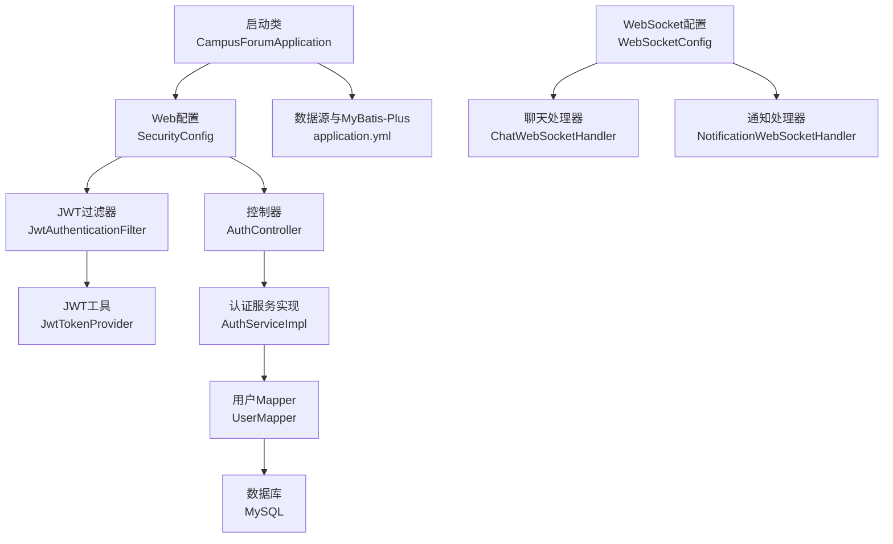
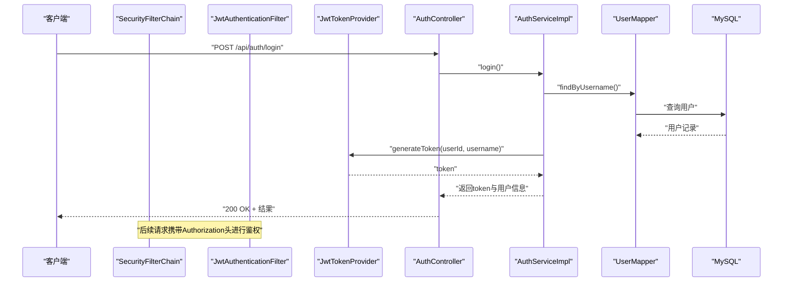
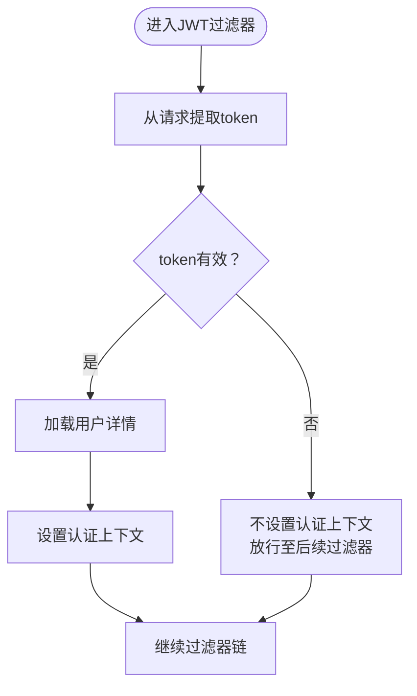
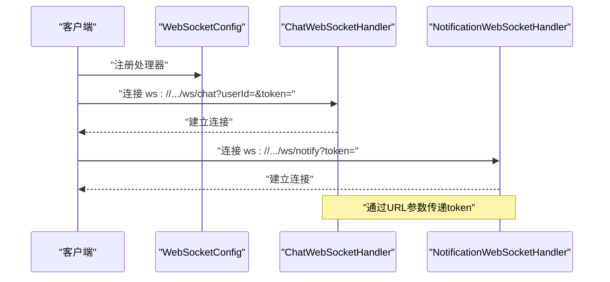
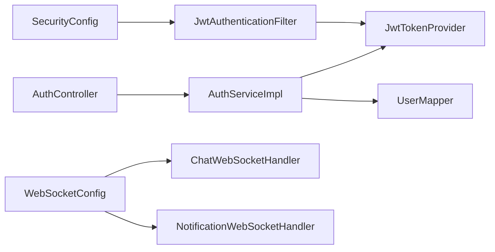

# 故障排查

<cite>
**本文引用的文件**
- [CampusForumApplication.java](file://campus-forum-backend/src/main/java/com/campus/forum/CampusForumApplication.java)
- [application.yml](file://campus-forum-backend/src/main/resources/application.yml)
- [GlobalExceptionHandler.java](file://campus-forum-backend/src/main/java/com/campus/forum/common/GlobalExceptionHandler.java)
- [BusinessException.java](file://campus-forum-backend/src/main/java/com/campus/forum/common/exception/BusinessException.java)
- [SecurityConfig.java](file://campus-forum-backend/src/main/java/com/campus/forum/config/SecurityConfig.java)
- [JwtAuthenticationFilter.java](file://campus-forum-backend/src/main/java/com/campus/forum/security/JwtAuthenticationFilter.java)
- [JwtTokenProvider.java](file://campus-forum-backend/src/main/java/com/campus/forum/security/JwtTokenProvider.java)
- [WebSocketConfig.java](file://campus-forum-backend/src/main/java/com/campus/forum/config/WebSocketConfig.java)
- [ChatWebSocketHandler.java](file://campus-forum-backend/src/main/java/com/campus/forum/websocket/ChatWebSocketHandler.java)
- [NotificationWebSocketHandler.java](file://campus-forum-backend/src/main/java/com/campus/forum/websocket/NotificationWebSocketHandler.java)
- [AuthController.java](file://campus-forum-backend/src/main/java/com/campus/forum/controller/AuthController.java)
- [AuthServiceImpl.java](file://campus-forum-backend/src/main/java/com/campus/forum/service/impl/AuthServiceImpl.java)
- [UserMapper.java](file://campus-forum-backend/src/main/java/com/campus/forum/mapper/UserMapper.java)
- [User.java](file://campus-forum-backend/src/main/java/com/campus/forum/entity/User.java)
- [pom.xml](file://campus-forum-backend/pom.xml)
</cite>

## 目录
1. [简介](#简介)
2. [项目结构](#项目结构)
3. [核心组件](#核心组件)
4. [架构总览](#架构总览)
5. [详细组件分析](#详细组件分析)
6. [依赖关系分析](#依赖关系分析)
7. [性能问题诊断](#性能问题诊断)
8. [环境与配置排查](#环境与配置排查)
9. [日志与监控](#日志与监控)
10. [紧急预案与回滚策略](#紧急预案与回滚策略)
11. [结论](#结论)

## 简介
本指南面向PBL项目的运维与开发人员，聚焦于后端服务在启动、认证、数据库、WebSocket等关键环节的常见故障排查与优化建议。内容覆盖启动失败、数据库连接问题、JWT认证异常、WebSocket连接问题、性能瓶颈、环境配置问题、日志分析方法、错误码含义、监控指标与告警流程，并提供紧急处置与回滚策略。

## 项目结构
后端采用Spring Boot 3 + Spring Security + MyBatis-Plus + WebSocket + Knife4j（OpenAPI/Swagger）技术栈，核心模块划分如下：
- 启动入口与扫描：启动类负责扫描Mapper与组件
- 安全与认证：基于JWT的无状态认证链路，拦截器与过滤器配合
- 数据访问：MyBatis-Plus + MySQL驱动
- 接口文档：Knife4j启用，便于联调与排错
- WebSocket：聊天与通知通道，支持通过URL参数传递token
- 全局异常：统一捕获业务异常与系统异常，输出标准化响应

图表来源
- [CampusForumApplication.java:1-17](file://campus-forum-backend/src/main/java/com/campus/forum/CampusForumApplication.java#L1-L17)
- [SecurityConfig.java:1-67](file://campus-forum-backend/src/main/java/com/campus/forum/config/SecurityConfig.java#L1-L67)
- [JwtAuthenticationFilter.java:1-59](file://campus-forum-backend/src/main/java/com/campus/forum/security/JwtAuthenticationFilter.java#L1-L59)
- [JwtTokenProvider.java:1-93](file://campus-forum-backend/src/main/java/com/campus/forum/security/JwtTokenProvider.java#L1-L93)
- [AuthController.java:1-39](file://campus-forum-backend/src/main/java/com/campus/forum/controller/AuthController.java#L1-L39)
- [AuthServiceImpl.java:1-69](file://campus-forum-backend/src/main/java/com/campus/forum/service/impl/AuthServiceImpl.java#L1-L69)
- [UserMapper.java:1-39](file://campus-forum-backend/src/main/java/com/campus/forum/mapper/UserMapper.java#L1-L39)
- [WebSocketConfig.java:1-28](file://campus-forum-backend/src/main/java/com/campus/forum/config/WebSocketConfig.java#L1-L28)
- [ChatWebSocketHandler.java:1-89](file://campus-forum-backend/src/main/java/com/campus/forum/websocket/ChatWebSocketHandler.java#L1-L89)
- [NotificationWebSocketHandler.java:1-78](file://campus-forum-backend/src/main/java/com/campus/forum/websocket/NotificationWebSocketHandler.java#L1-L78)

章节来源
- [CampusForumApplication.java:1-17](file://campus-forum-backend/src/main/java/com/campus/forum/CampusForumApplication.java#L1-L17)
- [application.yml:1-53](file://campus-forum-backend/src/main/resources/application.yml#L1-L53)
- [pom.xml:1-136](file://campus-forum-backend/pom.xml#L1-L136)

## 核心组件
- 启动类与扫描：负责扫描Mapper与组件，确保服务正常启动
- 安全配置：禁用CSRF，开启跨域，无状态会话，公开接口白名单，添加JWT过滤器
- JWT工具：生成、解析、校验token；支持从Header或URL参数解析
- 认证服务：注册/登录，密码编码与校验，token下发
- WebSocket：聊天与通知通道，支持通过URL参数传token
- 全局异常：业务异常、参数校验异常、权限不足、系统异常的统一处理

章节来源
- [SecurityConfig.java:1-67](file://campus-forum-backend/src/main/java/com/campus/forum/config/SecurityConfig.java#L1-L67)
- [JwtTokenProvider.java:1-93](file://campus-forum-backend/src/main/java/com/campus/forum/security/JwtTokenProvider.java#L1-L93)
- [AuthServiceImpl.java:1-69](file://campus-forum-backend/src/main/java/com/campus/forum/service/impl/AuthServiceImpl.java#L1-L69)
- [WebSocketConfig.java:1-28](file://campus-forum-backend/src/main/java/com/campus/forum/config/WebSocketConfig.java#L1-L28)
- [GlobalExceptionHandler.java:1-57](file://campus-forum-backend/src/main/java/com/campus/forum/common/GlobalExceptionHandler.java#L1-L57)

## 架构总览
下图展示从客户端到后端的关键交互路径，包括HTTP REST与WebSocket两条主线。

图表来源
- [SecurityConfig.java:42-62](file://campus-forum-backend/src/main/java/com/campus/forum/config/SecurityConfig.java#L42-L62)
- [JwtAuthenticationFilter.java:30-44](file://campus-forum-backend/src/main/java/com/campus/forum/security/JwtAuthenticationFilter.java#L30-L44)
- [JwtTokenProvider.java:33-43](file://campus-forum-backend/src/main/java/com/campus/forum/security/JwtTokenProvider.java#L33-L43)
- [AuthController.java:33-37](file://campus-forum-backend/src/main/java/com/campus/forum/controller/AuthController.java#L33-L37)
- [AuthServiceImpl.java:48-67](file://campus-forum-backend/src/main/java/com/campus/forum/service/impl/AuthServiceImpl.java#L48-L67)
- [UserMapper.java:12-13](file://campus-forum-backend/src/main/java/com/campus/forum/mapper/UserMapper.java#L12-L13)

## 详细组件分析

### 应用启动失败
- 常见原因
  - 端口被占用（默认8080）
  - 数据库连接失败（URL、凭据、网络）
  - 依赖缺失或版本不兼容
  - 启动类扫描范围不正确
- 排查步骤
  - 检查端口占用：netstat/lsof查看8080
  - 检查数据库连通性：本地MySQL服务、账号密码、库名
  - 检查依赖：确认Maven依赖与版本匹配
  - 确认启动类注解与Mapper扫描路径一致
- 关键配置参考
  - 服务器端口与上下文路径
  - 数据源URL、用户名、密码
  - MyBatis-Plus映射与日志
  - Knife4j开关
- 参考文件
  - [application.yml:1-53](file://campus-forum-backend/src/main/resources/application.yml#L1-L53)
  - [pom.xml:27-117](file://campus-forum-backend/pom.xml#L27-L117)
  - [CampusForumApplication.java:10-16](file://campus-forum-backend/src/main/java/com/campus/forum/CampusForumApplication.java#L10-L16)

章节来源
- [application.yml:1-53](file://campus-forum-backend/src/main/resources/application.yml#L1-L53)
- [pom.xml:1-136](file://campus-forum-backend/pom.xml#L1-L136)
- [CampusForumApplication.java:1-17](file://campus-forum-backend/src/main/java/com/campus/forum/CampusForumApplication.java#L1-L17)

### 数据库连接问题
- 常见症状
  - 启动时报连接超时或拒绝
  - 登录/注册接口报SQL异常
- 排查要点
  - 数据库服务状态与防火墙
  - JDBC URL、用户名、密码正确性
  - 字符集与时区配置
  - MyBatis-Plus逻辑删除字段与映射
- 关键配置参考
  - 数据源driver、url、username、password
  - MyBatis-Plus mapper位置、逻辑删除字段
- 参考文件
  - [application.yml:9-28](file://campus-forum-backend/src/main/resources/application.yml#L9-L28)
  - [UserMapper.java:12-16](file://campus-forum-backend/src/main/java/com/campus/forum/mapper/UserMapper.java#L12-L16)
  - [User.java:10-32](file://campus-forum-backend/src/main/java/com/campus/forum/entity/User.java#L10-L32)

章节来源
- [application.yml:9-28](file://campus-forum-backend/src/main/resources/application.yml#L9-L28)
- [UserMapper.java:1-39](file://campus-forum-backend/src/main/java/com/campus/forum/mapper/UserMapper.java#L1-L39)
- [User.java:1-33](file://campus-forum-backend/src/main/java/com/campus/forum/entity/User.java#L1-L33)

### JWT认证异常
- 错误类型与含义
  - 未登录或Token已过期：由JWT工具在解析失败时抛出业务异常
  - Header缺少Authorization或格式不正确
  - WebSocket场景使用URL参数token
- 诊断流程
  - 检查请求头Authorization是否以Bearer开头
  - 检查token签名与有效期
  - 对于WebSocket，确认URL参数token有效
  - 查看全局异常处理器对业务异常的统一返回
- 关键实现参考
  - JWT工具：生成、解析、校验、从请求解析token
  - JWT过滤器：从请求抽取token并设置认证上下文
  - 全局异常：业务异常转为标准错误响应
- 参考文件
  - [JwtTokenProvider.java:54-71](file://campus-forum-backend/src/main/java/com/campus/forum/security/JwtTokenProvider.java#L54-L71)
  - [JwtTokenProvider.java:84-91](file://campus-forum-backend/src/main/java/com/campus/forum/security/JwtTokenProvider.java#L84-L91)
  - [JwtAuthenticationFilter.java:30-57](file://campus-forum-backend/src/main/java/com/campus/forum/security/JwtAuthenticationFilter.java#L30-L57)
  - [GlobalExceptionHandler.java:19-23](file://campus-forum-backend/src/main/java/com/campus/forum/common/GlobalExceptionHandler.java#L19-L23)
  - [BusinessException.java:8-21](file://campus-forum-backend/src/main/java/com/campus/forum/common/exception/BusinessException.java#L8-L21)

图表来源
- [JwtAuthenticationFilter.java:30-44](file://campus-forum-backend/src/main/java/com/campus/forum/security/JwtAuthenticationFilter.java#L30-L44)
- [JwtTokenProvider.java:54-62](file://campus-forum-backend/src/main/java/com/campus/forum/security/JwtTokenProvider.java#L54-L62)

章节来源
- [JwtTokenProvider.java:1-93](file://campus-forum-backend/src/main/java/com/campus/forum/security/JwtTokenProvider.java#L1-L93)
- [JwtAuthenticationFilter.java:1-59](file://campus-forum-backend/src/main/java/com/campus/forum/security/JwtAuthenticationFilter.java#L1-L59)
- [GlobalExceptionHandler.java:1-57](file://campus-forum-backend/src/main/java/com/campus/forum/common/GlobalExceptionHandler.java#L1-L57)
- [BusinessException.java:1-22](file://campus-forum-backend/src/main/java/com/campus/forum/common/exception/BusinessException.java#L1-L22)

### WebSocket连接问题
- 场景与路径
  - 私信通道：/ws/chat，需携带userId与token
  - 通知通道：/ws/notify，需携带token
- 常见问题
  - 浏览器不支持在WebSocket中设置自定义Header，需通过URL参数传递token
  - token无效或过期
  - userId解析失败或非法
  - 连接建立后无法推送消息
- 诊断步骤
  - 确认URL参数token有效且未过期
  - 确认userId参数存在且可解析
  - 检查处理器是否成功加入会话映射
  - 检查目标会话是否仍处于open状态
- 参考文件
  - [WebSocketConfig.java:20-26](file://campus-forum-backend/src/main/java/com/campus/forum/config/WebSocketConfig.java#L20-L26)
  - [ChatWebSocketHandler.java:31-38](file://campus-forum-backend/src/main/java/com/campus/forum/websocket/ChatWebSocketHandler.java#L31-L38)
  - [NotificationWebSocketHandler.java:26-33](file://campus-forum-backend/src/main/java/com/campus/forum/websocket/NotificationWebSocketHandler.java#L26-L33)
  - [ChatWebSocketHandler.java:77-87](file://campus-forum-backend/src/main/java/com/campus/forum/websocket/ChatWebSocketHandler.java#L77-L87)
  - [NotificationWebSocketHandler.java:59-70](file://campus-forum-backend/src/main/java/com/campus/forum/websocket/NotificationWebSocketHandler.java#L59-L70)

图表来源
- [WebSocketConfig.java:20-26](file://campus-forum-backend/src/main/java/com/campus/forum/config/WebSocketConfig.java#L20-L26)
- [ChatWebSocketHandler.java:20-21](file://campus-forum-backend/src/main/java/com/campus/forum/websocket/ChatWebSocketHandler.java#L20-L21)
- [NotificationWebSocketHandler.java:13-17](file://campus-forum-backend/src/main/java/com/campus/forum/websocket/NotificationWebSocketHandler.java#L13-L17)

章节来源
- [WebSocketConfig.java:1-28](file://campus-forum-backend/src/main/java/com/campus/forum/config/WebSocketConfig.java#L1-L28)
- [ChatWebSocketHandler.java:1-89](file://campus-forum-backend/src/main/java/com/campus/forum/websocket/ChatWebSocketHandler.java#L1-L89)
- [NotificationWebSocketHandler.java:1-78](file://campus-forum-backend/src/main/java/com/campus/forum/websocket/NotificationWebSocketHandler.java#L1-L78)

### 认证与授权流程
- 登录流程
  - 控制器接收用户名/密码
  - 服务层查询用户并校验密码
  - 校验通过生成JWT并返回
- 授权流程
  - 安全链路放行公开接口
  - 其余接口需认证
  - JWT过滤器解析token并注入认证上下文
- 参考文件
  - [AuthController.java:26-37](file://campus-forum-backend/src/main/java/com/campus/forum/controller/AuthController.java#L26-L37)
  - [AuthServiceImpl.java:48-67](file://campus-forum-backend/src/main/java/com/campus/forum/service/impl/AuthServiceImpl.java#L48-L67)
  - [SecurityConfig.java:49-62](file://campus-forum-backend/src/main/java/com/campus/forum/config/SecurityConfig.java#L49-L62)
  - [JwtAuthenticationFilter.java:30-44](file://campus-forum-backend/src/main/java/com/campus/forum/security/JwtAuthenticationFilter.java#L30-L44)

章节来源
- [AuthController.java:1-39](file://campus-forum-backend/src/main/java/com/campus/forum/controller/AuthController.java#L1-L39)
- [AuthServiceImpl.java:1-69](file://campus-forum-backend/src/main/java/com/campus/forum/service/impl/AuthServiceImpl.java#L1-L69)
- [SecurityConfig.java:1-67](file://campus-forum-backend/src/main/java/com/campus/forum/config/SecurityConfig.java#L1-L67)
- [JwtAuthenticationFilter.java:1-59](file://campus-forum-backend/src/main/java/com/campus/forum/security/JwtAuthenticationFilter.java#L1-L59)

## 依赖关系分析
- 组件耦合
  - SecurityConfig依赖JwtAuthenticationFilter
  - JwtAuthenticationFilter依赖JwtTokenProvider与UserDetailsService
  - AuthController依赖AuthService，AuthServiceImpl依赖UserMapper与JwtTokenProvider
  - WebSocketConfig依赖两个WebSocketHandler
- 外部依赖
  - Spring Web、Security、WebSocket、MyBatis-Plus、MySQL Connector、JWT、Knife4j、OkHttp3
- 可能的循环依赖
  - 当前结构未见显式循环依赖，注意避免在过滤器中直接调用业务服务执行敏感操作

图表来源
- [SecurityConfig.java:30-31](file://campus-forum-backend/src/main/java/com/campus/forum/config/SecurityConfig.java#L30-L31)
- [JwtAuthenticationFilter.java:27-28](file://campus-forum-backend/src/main/java/com/campus/forum/security/JwtAuthenticationFilter.java#L27-L28)
- [JwtTokenProvider.java:23-27](file://campus-forum-backend/src/main/java/com/campus/forum/security/JwtTokenProvider.java#L23-L27)
- [AuthController.java:24](file://campus-forum-backend/src/main/java/com/campus/forum/controller/AuthController.java#L24)
- [AuthServiceImpl.java:24-26](file://campus-forum-backend/src/main/java/com/campus/forum/service/impl/AuthServiceImpl.java#L24-L26)
- [UserMapper.java:10](file://campus-forum-backend/src/main/java/com/campus/forum/mapper/UserMapper.java#L10)
- [WebSocketConfig.java:17-18](file://campus-forum-backend/src/main/java/com/campus/forum/config/WebSocketConfig.java#L17-L18)
- [ChatWebSocketHandler.java:27](file://campus-forum-backend/src/main/java/com/campus/forum/websocket/ChatWebSocketHandler.java#L27)
- [NotificationWebSocketHandler.java:23](file://campus-forum-backend/src/main/java/com/campus/forum/websocket/NotificationWebSocketHandler.java#L23)

章节来源
- [pom.xml:27-117](file://campus-forum-backend/pom.xml#L27-L117)
- [SecurityConfig.java:1-67](file://campus-forum-backend/src/main/java/com/campus/forum/config/SecurityConfig.java#L1-L67)
- [JwtAuthenticationFilter.java:1-59](file://campus-forum-backend/src/main/java/com/campus/forum/security/JwtAuthenticationFilter.java#L1-L59)
- [JwtTokenProvider.java:1-93](file://campus-forum-backend/src/main/java/com/campus/forum/security/JwtTokenProvider.java#L1-L93)
- [AuthController.java:1-39](file://campus-forum-backend/src/main/java/com/campus/forum/controller/AuthController.java#L1-L39)
- [AuthServiceImpl.java:1-69](file://campus-forum-backend/src/main/java/com/campus/forum/service/impl/AuthServiceImpl.java#L1-L69)
- [UserMapper.java:1-39](file://campus-forum-backend/src/main/java/com/campus/forum/mapper/UserMapper.java#L1-L39)
- [WebSocketConfig.java:1-28](file://campus-forum-backend/src/main/java/com/campus/forum/config/WebSocketConfig.java#L1-L28)
- [ChatWebSocketHandler.java:1-89](file://campus-forum-backend/src/main/java/com/campus/forum/websocket/ChatWebSocketHandler.java#L1-L89)
- [NotificationWebSocketHandler.java:1-78](file://campus-forum-backend/src/main/java/com/campus/forum/websocket/NotificationWebSocketHandler.java#L1-L78)

## 性能问题诊断
- 数据库查询优化
  - 使用MyBatis-Plus分页与索引设计，避免N+1查询
  - 关注高频接口的Mapper SQL与实体映射
  - 开启MyBatis日志定位慢查询
- 内存使用分析
  - 关注WebSocket处理器中的会话Map增长与清理
  - 避免在处理器中持有大对象引用
- 并发处理问题
  - WebSocket会话并发读写需保证线程安全
  - 控制台日志中关注高并发下的异常堆栈
- 参考文件
  - [application.yml:26-28](file://campus-forum-backend/src/main/resources/application.yml#L26-L28)
  - [ChatWebSocketHandler.java:27](file://campus-forum-backend/src/main/java/com/campus/forum/websocket/ChatWebSocketHandler.java#L27)
  - [NotificationWebSocketHandler.java:23](file://campus-forum-backend/src/main/java/com/campus/forum/websocket/NotificationWebSocketHandler.java#L23)

章节来源
- [application.yml:19-28](file://campus-forum-backend/src/main/resources/application.yml#L19-L28)
- [ChatWebSocketHandler.java:1-89](file://campus-forum-backend/src/main/java/com/campus/forum/websocket/ChatWebSocketHandler.java#L1-L89)
- [NotificationWebSocketHandler.java:1-78](file://campus-forum-backend/src/main/java/com/campus/forum/websocket/NotificationWebSocketHandler.java#L1-L78)

## 环境与配置排查
- 端口冲突
  - 默认8080，检查并修改application.yml或更换端口
- 权限问题
  - 文件上传目录权限与路径
  - 日志目录写入权限
- 依赖缺失
  - Java版本要求与依赖版本
  - MySQL驱动与数据库服务可用性
- 参考文件
  - [application.yml:1-53](file://campus-forum-backend/src/main/resources/application.yml#L1-L53)
  - [pom.xml:20-25](file://campus-forum-backend/pom.xml#L20-L25)

章节来源
- [application.yml:1-53](file://campus-forum-backend/src/main/resources/application.yml#L1-L53)
- [pom.xml:1-136](file://campus-forum-backend/pom.xml#L1-L136)

## 日志与监控
- 日志分析方法
  - 关注全局异常处理器的日志级别与输出
  - 认证失败、参数校验失败、权限不足均有明确日志
  - WebSocket连接建立/关闭、消息收发与推送失败日志
- 错误码含义
  - 业务异常：由业务层抛出，统一返回400或特定code
  - 参数校验失败：400
  - 权限不足：403
  - 系统内部错误：500
- 参考文件
  - [GlobalExceptionHandler.java:19-55](file://campus-forum-backend/src/main/java/com/campus/forum/common/GlobalExceptionHandler.java#L19-L55)
  - [BusinessException.java:10-20](file://campus-forum-backend/src/main/java/com/campus/forum/common/exception/BusinessException.java#L10-L20)
  - [ChatWebSocketHandler.java:36](file://campus-forum-backend/src/main/java/com/campus/forum/websocket/ChatWebSocketHandler.java#L36)
  - [NotificationWebSocketHandler.java:31](file://campus-forum-backend/src/main/java/com/campus/forum/websocket/NotificationWebSocketHandler.java#L31)

章节来源
- [GlobalExceptionHandler.java:1-57](file://campus-forum-backend/src/main/java/com/campus/forum/common/GlobalExceptionHandler.java#L1-L57)
- [BusinessException.java:1-22](file://campus-forum-backend/src/main/java/com/campus/forum/common/exception/BusinessException.java#L1-L22)
- [ChatWebSocketHandler.java:1-89](file://campus-forum-backend/src/main/java/com/campus/forum/websocket/ChatWebSocketHandler.java#L1-L89)
- [NotificationWebSocketHandler.java:1-78](file://campus-forum-backend/src/main/java/com/campus/forum/websocket/NotificationWebSocketHandler.java#L1-L78)

## 紧急预案与回滚策略
- 紧急处置
  - 快速降级：临时关闭非关键功能（如AI相关），优先保障核心REST与WebSocket
  - 限流与熔断：在网关或应用层增加限流策略
  - 重启与切换：必要时快速重启，检查端口与依赖
- 回滚策略
  - 版本管理：保留上一个稳定版本镜像或构建产物
  - 配置回滚：将application.yml恢复到上一稳定配置
  - 数据库回滚：在具备备份的前提下回滚DDL与DML
- 参考文件
  - [application.yml:1-53](file://campus-forum-backend/src/main/resources/application.yml#L1-L53)
  - [pom.xml:119-134](file://campus-forum-backend/pom.xml#L119-L134)

章节来源
- [application.yml:1-53](file://campus-forum-backend/src/main/resources/application.yml#L1-L53)
- [pom.xml:1-136](file://campus-forum-backend/pom.xml#L1-L136)

## 结论
本指南围绕启动、数据库、JWT认证、WebSocket、性能、环境配置、日志与监控以及紧急回滚等方面提供了系统化的排查思路与实操建议。建议在生产环境中结合日志与监控指标持续观察，并定期演练回滚流程，确保问题发生时能够快速定位与恢复。