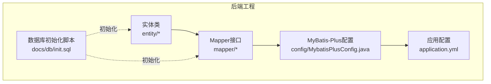
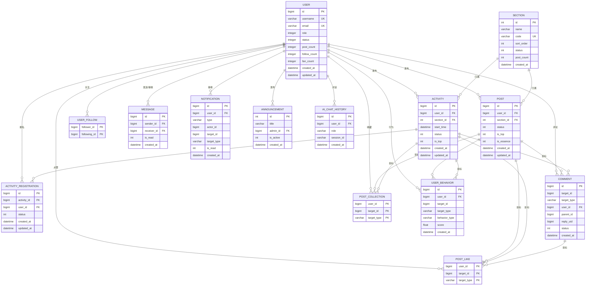
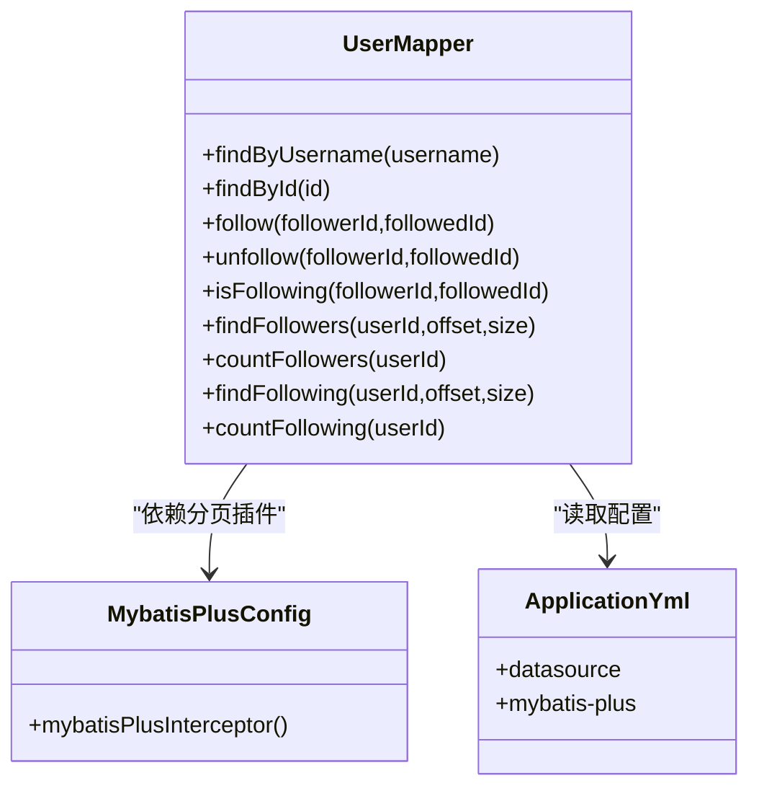
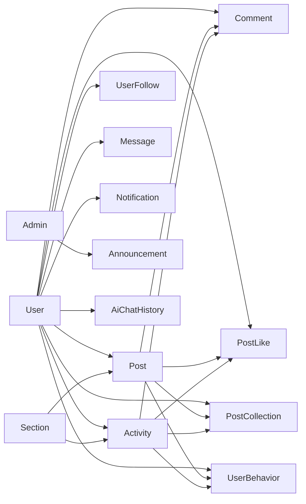

# 数据库设计

<cite>
**本文引用的文件**
- [init.sql](file://campus-forum-backend/docs/db/init.sql)
- [User.java](file://campus-forum-backend/src/main/java/com/campus/forum/entity/User.java)
- [Post.java](file://campus-forum-backend/src/main/java/com/campus/forum/entity/Post.java)
- [Activity.java](file://campus-forum-backend/src/main/java/com/campus/forum/entity/Activity.java)
- [Comment.java](file://campus-forum-backend/src/main/java/com/campus/forum/entity/Comment.java)
- [Message.java](file://campus-forum-backend/src/main/java/com/campus/forum/entity/Message.java)
- [Section.java](file://campus-forum-backend/src/main/java/com/campus/forum/entity/Section.java)
- [ActivityRegistration.java](file://campus-forum-backend/src/main/java/com/campus/forum/entity/ActivityRegistration.java)
- [PostLike.java](file://campus-forum-backend/src/main/java/com/campus/forum/entity/PostLike.java)
- [PostCollection.java](file://campus-forum-backend/src/main/java/com/campus/forum/entity/PostCollection.java)
- [Notification.java](file://campus-forum-backend/src/main/java/com/campus/forum/entity/Notification.java)
- [UserBehavior.java](file://campus-forum-backend/src/main/java/com/campus/forum/entity/UserBehavior.java)
- [UserMapper.java](file://campus-forum-backend/src/main/java/com/campus/forum/mapper/UserMapper.java)
- [MybatisPlusConfig.java](file://campus-forum-backend/src/main/java/com/campus/forum/config/MybatisPlusConfig.java)
- [application.yml](file://campus-forum-backend/src/main/resources/application.yml)
</cite>

## 目录
1. [引言](#引言)
2. [项目结构](#项目结构)
3. [核心组件](#核心组件)
4. [架构总览](#架构总览)
5. [详细组件分析](#详细组件分析)
6. [依赖分析](#依赖分析)
7. [性能考虑](#性能考虑)
8. [故障排查指南](#故障排查指南)
9. [结论](#结论)
10. [附录](#附录)

## 引言
本文件面向PBL项目“校园活动发布平台”的数据库设计，围绕后端Java工程中的实体模型、数据库初始化脚本与MyBatis-Plus配置进行系统化梳理。重点覆盖以下方面：
- 数据库表结构与字段设计、主键/外键约束、索引策略与数据类型选择
- 实体类与数据库表的映射关系及MyBatis-Plus配置要点
- 查询与分页优化、逻辑删除策略与SQL调优建议
- 数据库初始化脚本说明、迁移与版本管理思路
- ER图与实体关系图，明确表间关联与数据完整性约束
- 数据访问层设计模式与最佳实践

## 项目结构
后端采用Spring Boot + MyBatis-Plus架构，数据库初始化脚本位于docs/db目录；实体类位于entity包，Mapper接口位于mapper包，MyBatis-Plus全局配置位于config包，数据源与MyBatis-Plus配置在application.yml。

图表来源
- [init.sql:1-257](file://campus-forum-backend/docs/db/init.sql#L1-L257)
- [MybatisPlusConfig.java:1-24](file://campus-forum-backend/src/main/java/com/campus/forum/config/MybatisPlusConfig.java#L1-L24)
- [application.yml:1-53](file://campus-forum-backend/src/main/resources/application.yml#L1-L53)

章节来源
- [init.sql:1-257](file://campus-forum-backend/docs/db/init.sql#L1-L257)
- [MybatisPlusConfig.java:1-24](file://campus-forum-backend/src/main/java/com/campus/forum/config/MybatisPlusConfig.java#L1-L24)
- [application.yml:1-53](file://campus-forum-backend/src/main/resources/application.yml#L1-L53)

## 核心组件
本节从数据库层面梳理核心实体与表结构，结合实体类映射关系，说明字段、索引与约束的设计考量。

- 用户表 user
  - 字段要点：用户名唯一、邮箱唯一、角色与状态枚举、计数字段（发帖数、关注数、粉丝数）、时间戳自动填充
  - 主键：自增BIGINT
  - 索引：用户名单列索引
  - 设计考量：用户名与邮箱的唯一性保障登录与联系唯一性；计数字段用于减少统计查询成本

- 版块表 section
  - 字段要点：名称、标识码唯一、排序、状态、计数字段、创建时间
  - 主键：自增INT
  - 设计考量：标识码唯一用于URL友好路由与前端展示；排序字段支持版块展示顺序

- 活动表 activity
  - 字段要点：发布用户、关联版块、标题、描述（富文本）、封面、地点、起止时间、人数限制、统计字段、状态、置顶标记、时间戳
  - 主键：自增BIGINT
  - 索引：用户ID、版块ID、开始时间
  - 设计考量：活动筛选与时间排序依赖索引；人数上限与当前报名人数用于并发控制与展示

- 活动报名表 activity_registration
  - 字段要点：活动ID、用户ID、报名状态、备注、时间戳
  - 主键：自增BIGINT
  - 约束：活动ID+用户ID唯一，避免重复报名
  - 索引：用户ID
  - 设计考量：唯一组合键保证业务一致性；用户维度查询频繁

- 帖子表 post
  - 字段要点：用户ID、版块ID、标题、内容（富文本）、封面、统计字段、状态、置顶/加精标记、时间戳
  - 主键：自增BIGINT
  - 索引：用户ID、版块ID、创建时间
  - 设计考量：版块聚合与时间倒序分页依赖索引；状态字段支持草稿/删除/审核流程

- 评论表 comment
  - 字段要点：目标ID（帖子或活动）、目标类型、评论者、父评论ID（支持楼中楼）、被回复用户ID、内容、点赞数、状态、时间戳
  - 主键：自增BIGINT
  - 索引：目标ID+目标类型、父评论ID
  - 设计考量：目标维度查询与树形回复结构；状态字段支持软删除

- 点赞表 post_like
  - 字段要点：用户ID、目标ID、目标类型（post/activity/comment）
  - 主键：联合主键（用户ID、目标ID、目标类型）
  - 设计考量：统一处理三类目标的点赞，避免重复点赞；联合主键天然去重

- 收藏表 post_collection
  - 字段要点：用户ID、目标ID、目标类型（post/activity）
  - 主键：联合主键（用户ID、目标ID、目标类型）
  - 设计考量：统一处理两类目标的收藏；联合主键确保唯一性

- 关注关系表 user_follow
  - 字段要点：关注者ID、被关注者ID、创建时间
  - 主键：联合主键（关注者ID、被关注者ID）
  - 索引：被关注者ID
  - 设计考量：关注关系去重；按被关注者查询粉丝列表

- 私信表 message
  - 字段要点：发送者ID、接收者ID、内容、已读标记、时间戳
  - 主键：自增BIGINT
  - 索引：发送者+接收者、接收者ID
  - 设计考量：消息会话查询与接收方检索效率

- 系统通知表 notification
  - 字段要点：接收用户、通知类型、触发者、目标对象、摘要、已读标记、时间戳
  - 主键：自增BIGINT
  - 索引：接收用户
  - 设计考量：按用户拉取通知；类型字段支持多场景扩展

- 用户行为表 user_behavior
  - 字段要点：用户ID、目标ID、目标类型（post/activity）、行为类型（VIEW/LIKE/COLLECT/COMMENT）、权重分、时间戳
  - 主键：自增BIGINT
  - 索引：用户ID+目标ID+目标类型
  - 设计考量：推荐系统输入特征；行为权重可量化

- 公告表 announcement
  - 字段要点：标题、内容、发布管理员ID、有效标记、时间戳
  - 主键：自增INT
  - 设计考量：管理员发布、有效标记控制展示

- AI对话历史表 ai_chat_history
  - 字段要点：用户ID、角色（user/assistant）、内容、会话ID、时间戳
  - 主键：自增BIGINT
  - 索引：用户ID、会话ID
  - 设计考量：按用户与会话检索对话历史

章节来源
- [init.sql:10-27](file://campus-forum-backend/docs/db/init.sql#L10-L27)
- [init.sql:32-43](file://campus-forum-backend/docs/db/init.sql#L32-L43)
- [init.sql:57-81](file://campus-forum-backend/docs/db/init.sql#L57-L81)
- [init.sql:86-97](file://campus-forum-backend/docs/db/init.sql#L86-L97)
- [init.sql:102-122](file://campus-forum-backend/docs/db/init.sql#L102-L122)
- [init.sql:127-141](file://campus-forum-backend/docs/db/init.sql#L127-L141)
- [init.sql:146-152](file://campus-forum-backend/docs/db/init.sql#L146-L152)
- [init.sql:157-163](file://campus-forum-backend/docs/db/init.sql#L157-L163)
- [init.sql:168-174](file://campus-forum-backend/docs/db/init.sql#L168-L174)
- [init.sql:179-189](file://campus-forum-backend/docs/db/init.sql#L179-L189)
- [init.sql:194-206](file://campus-forum-backend/docs/db/init.sql#L194-L206)
- [init.sql:211-221](file://campus-forum-backend/docs/db/init.sql#L211-L221)
- [init.sql:226-234](file://campus-forum-backend/docs/db/init.sql#L226-L234)
- [init.sql:239-249](file://campus-forum-backend/docs/db/init.sql#L239-L249)

## 架构总览
下图展示数据库层与实体类之间的映射关系，以及主要表间的外键约束与典型查询路径。

图表来源
- [init.sql:10-27](file://campus-forum-backend/docs/db/init.sql#L10-L27)
- [init.sql:32-43](file://campus-forum-backend/docs/db/init.sql#L32-L43)
- [init.sql:57-81](file://campus-forum-backend/docs/db/init.sql#L57-L81)
- [init.sql:86-97](file://campus-forum-backend/docs/db/init.sql#L86-L97)
- [init.sql:102-122](file://campus-forum-backend/docs/db/init.sql#L102-L122)
- [init.sql:127-141](file://campus-forum-backend/docs/db/init.sql#L127-L141)
- [init.sql:146-152](file://campus-forum-backend/docs/db/init.sql#L146-L152)
- [init.sql:157-163](file://campus-forum-backend/docs/db/init.sql#L157-L163)
- [init.sql:168-174](file://campus-forum-backend/docs/db/init.sql#L168-L174)
- [init.sql:179-189](file://campus-forum-backend/docs/db/init.sql#L179-L189)
- [init.sql:194-206](file://campus-forum-backend/docs/db/init.sql#L194-L206)
- [init.sql:211-221](file://campus-forum-backend/docs/db/init.sql#L211-L221)
- [init.sql:226-234](file://campus-forum-backend/docs/db/init.sql#L226-L234)
- [init.sql:239-249](file://campus-forum-backend/docs/db/init.sql#L239-L249)

## 详细组件分析

### 用户表 user
- 映射关系：实体类使用表注解绑定到user表，字段与数据库一致，时间字段通过自动填充策略设置。
- 关键点：用户名与邮箱唯一约束；角色与状态枚举；计数字段用于前台展示与统计。
- 索引：用户名单列索引，满足登录与查询需求。

章节来源
- [User.java:1-33](file://campus-forum-backend/src/main/java/com/campus/forum/entity/User.java#L1-L33)
- [init.sql:10-27](file://campus-forum-backend/docs/db/init.sql#L10-L27)

### 版块表 section
- 映射关系：实体类绑定到section表，标识码唯一，支持排序与状态控制。
- 关键点：预置6个版块，便于快速上线；排序字段支持灵活展示。

章节来源
- [Section.java:1-22](file://campus-forum-backend/src/main/java/com/campus/forum/entity/Section.java#L1-L22)
- [init.sql:32-52](file://campus-forum-backend/docs/db/init.sql#L32-L52)

### 活动表 activity
- 映射关系：实体类绑定到activity表，时间字段与统计字段完整映射。
- 关键点：活动状态枚举覆盖草稿、报名中、已结束、已取消、待审核；置顶标记支持首页优先级。
- 索引：用户ID、版块ID、开始时间，支撑活动列表、版块聚合与时间筛选。

章节来源
- [Activity.java:1-39](file://campus-forum-backend/src/main/java/com/campus/forum/entity/Activity.java#L1-L39)
- [init.sql:57-81](file://campus-forum-backend/docs/db/init.sql#L57-L81)

### 活动报名表 activity_registration
- 映射关系：实体类绑定到activity_registration表，报名状态枚举与唯一约束。
- 关键点：唯一组合键（活动ID+用户ID）防止重复报名；用户维度索引支持我的报名查询。

章节来源
- [ActivityRegistration.java:1-27](file://campus-forum-backend/src/main/java/com/campus/forum/entity/ActivityRegistration.java#L1-L27)
- [init.sql:86-97](file://campus-forum-backend/docs/db/init.sql#L86-L97)

### 帖子表 post
- 映射关系：实体类绑定到post表，状态与置顶/加精标记完整映射。
- 关键点：状态枚举支持草稿/发布/删除/审核流程；时间索引支持分页与排序。

章节来源
- [Post.java:1-35](file://campus-forum-backend/src/main/java/com/campus/forum/entity/Post.java#L1-L35)
- [init.sql:102-122](file://campus-forum-backend/docs/db/init.sql#L102-L122)

### 评论表 comment
- 映射关系：实体类绑定到comment表，支持目标类型泛化（post/activity），树形回复通过父ID实现。
- 关键点：目标维度索引与父ID索引，支撑按目标查询与楼中楼结构；状态字段软删除。

章节来源
- [Comment.java:1-31](file://campus-forum-backend/src/main/java/com/campus/forum/entity/Comment.java#L1-L31)
- [init.sql:127-141](file://campus-forum-backend/docs/db/init.sql#L127-L141)

### 点赞表 post_like
- 映射关系：实体类绑定到post_like表，联合主键确保同一用户对同一目标类型的唯一点赞。
- 关键点：目标类型字段统一处理三类目标；联合主键天然去重。

章节来源
- [PostLike.java:1-16](file://campus-forum-backend/src/main/java/com/campus/forum/entity/PostLike.java#L1-L16)
- [init.sql:146-152](file://campus-forum-backend/docs/db/init.sql#L146-L152)

### 收藏表 post_collection
- 映射关系：实体类绑定到post_collection表，联合主键确保收藏唯一性。
- 关键点：目标类型字段统一处理两类目标；联合主键去重。

章节来源
- [PostCollection.java:1-16](file://campus-forum-backend/src/main/java/com/campus/forum/entity/PostCollection.java#L1-L16)
- [init.sql:157-163](file://campus-forum-backend/docs/db/init.sql#L157-L163)

### 关注关系表 user_follow
- 映射关系：实体类绑定到user_follow表，联合主键去重关注关系。
- 关键点：被关注者维度索引支持粉丝列表查询。

章节来源
- [User.java:1-33](file://campus-forum-backend/src/main/java/com/campus/forum/entity/User.java#L1-L33)
- [init.sql:168-174](file://campus-forum-backend/docs/db/init.sql#L168-L174)

### 私信表 message
- 映射关系：实体类绑定到message表，已读标记与时间戳完整映射。
- 关键点：发送者+接收者组合索引与接收者索引，支撑会话查询与收件箱检索。

章节来源
- [Message.java:1-19](file://campus-forum-backend/src/main/java/com/campus/forum/entity/Message.java#L1-L19)
- [init.sql:179-189](file://campus-forum-backend/docs/db/init.sql#L179-L189)

### 系统通知表 notification
- 映射关系：实体类绑定到notification表，类型字段支持多种通知场景。
- 关键点：接收用户索引支撑按用户拉取通知。

章节来源
- [Notification.java:1-23](file://campus-forum-backend/src/main/java/com/campus/forum/entity/Notification.java#L1-L23)
- [init.sql:194-206](file://campus-forum-backend/docs/db/init.sql#L194-L206)

### 用户行为表 user_behavior
- 映射关系：实体类绑定到user_behavior表，行为类型与权重分完整映射。
- 关键点：用户+目标+类型复合索引，支撑推荐特征提取。

章节来源
- [UserBehavior.java:1-22](file://campus-forum-backend/src/main/java/com/campus/forum/entity/UserBehavior.java#L1-L22)
- [init.sql:211-221](file://campus-forum-backend/docs/db/init.sql#L211-L221)

### 公告表 announcement
- 映射关系：实体类绑定到announcement表，有效标记控制展示。
- 关键点：管理员ID外键约束公告发布权限。

章节来源
- [init.sql:226-234](file://campus-forum-backend/docs/db/init.sql#L226-L234)

### AI对话历史表 ai_chat_history
- 映射关系：实体类绑定到ai_chat_history表，会话ID索引支撑会话检索。
- 关键点：用户维度索引与会话ID索引，支撑历史查询。

章节来源
- [init.sql:239-249](file://campus-forum-backend/docs/db/init.sql#L239-L249)

### 数据访问层与MyBatis-Plus配置
- 分页插件：配置PaginationInnerInterceptor并指定MySQL类型，确保分页生效。
- 逻辑删除：全局配置逻辑删除字段为status，删除值与未删值分别设置。
- 自动填充：实体类通过字段填充策略自动维护创建与更新时间。
- SQL优化：UserMapper中针对关注关系与用户查询使用了显式SQL，避免ORM默认生成的复杂条件；同时保留BaseMapper的通用能力。

图表来源
- [UserMapper.java:1-39](file://campus-forum-backend/src/main/java/com/campus/forum/mapper/UserMapper.java#L1-L39)
- [MybatisPlusConfig.java:1-24](file://campus-forum-backend/src/main/java/com/campus/forum/config/MybatisPlusConfig.java#L1-L24)
- [application.yml:1-53](file://campus-forum-backend/src/main/resources/application.yml#L1-L53)

章节来源
- [UserMapper.java:1-39](file://campus-forum-backend/src/main/java/com/campus/forum/mapper/UserMapper.java#L1-L39)
- [MybatisPlusConfig.java:1-24](file://campus-forum-backend/src/main/java/com/campus/forum/config/MybatisPlusConfig.java#L1-L24)
- [application.yml:1-53](file://campus-forum-backend/src/main/resources/application.yml#L1-L53)

## 依赖分析
- 外键关系
  - 用户与活动：一对多（用户发布活动）
  - 版块与活动：一对多（版块归属活动）
  - 用户与帖子：一对多（用户发布帖子）
  - 版块与帖子：一对多（版块归属帖子）
  - 用户与评论：一对多（用户发表评论）
  - 帖子与评论：一对多（帖子承载评论）
  - 活动与评论：一对多（活动承载评论）
  - 用户与点赞：一对多（用户点赞多目标）
  - 目标与点赞：一对多（目标被点赞）
  - 用户与收藏：一对多（用户收藏多目标）
  - 目标与收藏：一对多（目标被收藏）
  - 用户与关注：多对多（关注关系表）
  - 用户与私信：一对多（发送/接收）
  - 用户与通知：一对多（接收通知）
  - 用户与行为：一对多（用户产生行为）
  - 目标与行为：一对多（目标被行为）
  - 管理员与公告：一对多（管理员发布）
  - 用户与AI对话：一对多（用户对话）

- 内聚与耦合
  - 实体类与表一一对应，内聚度高
  - Mapper接口通过注解与XML配合，职责清晰
  - MyBatis-Plus全局配置集中管理分页与逻辑删除，降低重复配置

图表来源
- [init.sql:10-27](file://campus-forum-backend/docs/db/init.sql#L10-L27)
- [init.sql:32-43](file://campus-forum-backend/docs/db/init.sql#L32-L43)
- [init.sql:57-81](file://campus-forum-backend/docs/db/init.sql#L57-L81)
- [init.sql:86-97](file://campus-forum-backend/docs/db/init.sql#L86-L97)
- [init.sql:102-122](file://campus-forum-backend/docs/db/init.sql#L102-L122)
- [init.sql:127-141](file://campus-forum-backend/docs/db/init.sql#L127-L141)
- [init.sql:146-152](file://campus-forum-backend/docs/db/init.sql#L146-L152)
- [init.sql:157-163](file://campus-forum-backend/docs/db/init.sql#L157-L163)
- [init.sql:168-174](file://campus-forum-backend/docs/db/init.sql#L168-L174)
- [init.sql:179-189](file://campus-forum-backend/docs/db/init.sql#L179-L189)
- [init.sql:194-206](file://campus-forum-backend/docs/db/init.sql#L194-L206)
- [init.sql:211-221](file://campus-forum-backend/docs/db/init.sql#L211-L221)
- [init.sql:226-234](file://campus-forum-backend/docs/db/init.sql#L226-L234)
- [init.sql:239-249](file://campus-forum-backend/docs/db/init.sql#L239-L249)

## 性能考虑
- 索引策略
  - 用户维度：用户ID索引用于帖子、活动、评论、报名、关注等高频查询
  - 时间维度：活动开始时间、帖子创建时间、通知与消息创建时间索引，支撑分页与排序
  - 组合索引：活动报名（活动ID+用户ID）唯一，避免重复；消息（发送者+接收者）组合索引提升会话查询效率
  - 复合维度：用户行为（用户ID+目标ID+目标类型）索引，支撑推荐特征提取

- 查询优化
  - 使用明确的WHERE条件与LIMIT/OFFSET进行分页，避免全表扫描
  - 对于关注关系与用户查询，采用显式SQL以减少ORM复杂度
  - 利用逻辑删除字段避免物理删除带来的维护成本

- 分页与拦截器
  - 启用PaginationInnerInterceptor并指定MySQL类型，确保分页生效
  - 在Service层合理传入分页参数，避免一次性加载大量数据

- 数据类型选择
  - ID采用BIGINT（活动、帖子、评论、消息、AI对话历史）与INT（版块、公告）区分体量与范围
  - 富文本字段使用LONGTEXT/TEXT，兼顾内容长度与存储成本
  - 时间字段统一使用DATETIME，配合自动填充策略

- 并发与一致性
  - 活动报名唯一约束与状态枚举，保障报名流程一致性
  - 点赞/收藏联合主键天然去重，避免重复操作

章节来源
- [init.sql:57-81](file://campus-forum-backend/docs/db/init.sql#L57-L81)
- [init.sql:86-97](file://campus-forum-backend/docs/db/init.sql#L86-L97)
- [init.sql:102-122](file://campus-forum-backend/docs/db/init.sql#L102-L122)
- [init.sql:127-141](file://campus-forum-backend/docs/db/init.sql#L127-L141)
- [init.sql:146-152](file://campus-forum-backend/docs/db/init.sql#L146-L152)
- [init.sql:157-163](file://campus-forum-backend/docs/db/init.sql#L157-L163)
- [init.sql:179-189](file://campus-forum-backend/docs/db/init.sql#L179-L189)
- [init.sql:211-221](file://campus-forum-backend/docs/db/init.sql#L211-L221)
- [MybatisPlusConfig.java:1-24](file://campus-forum-backend/src/main/java/com/campus/forum/config/MybatisPlusConfig.java#L1-L24)
- [UserMapper.java:1-39](file://campus-forum-backend/src/main/java/com/campus/forum/mapper/UserMapper.java#L1-L39)

## 故障排查指南
- 分页无效
  - 现象：分页请求返回全部数据
  - 排查：确认已配置PaginationInnerInterceptor且数据库类型为MySQL
  - 参考：分页插件配置

- 逻辑删除异常
  - 现象：删除后仍可见或状态不正确
  - 排查：检查全局逻辑删除字段与值配置，确保查询时使用带逻辑删除处理的查询方式

- 关注/取消关注失败
  - 现象：重复关注或无法取消
  - 排查：确认关注关系表联合主键约束与唯一索引；检查SQL中是否正确传递参数

- 报名重复
  - 现象：同一用户对同一活动重复报名
  - 排查：确认报名表唯一约束（活动ID+用户ID）是否生效

- 通知未读状态异常
  - 现象：通知已读/未读状态不更新
  - 排查：确认通知表已读字段更新逻辑与前端交互

章节来源
- [MybatisPlusConfig.java:1-24](file://campus-forum-backend/src/main/java/com/campus/forum/config/MybatisPlusConfig.java#L1-L24)
- [application.yml:19-28](file://campus-forum-backend/src/main/resources/application.yml#L19-L28)
- [UserMapper.java:1-39](file://campus-forum-backend/src/main/java/com/campus/forum/mapper/UserMapper.java#L1-L39)
- [init.sql:86-97](file://campus-forum-backend/docs/db/init.sql#L86-L97)
- [init.sql:194-206](file://campus-forum-backend/docs/db/init.sql#L194-L206)

## 结论
本数据库设计方案以实体-表映射为核心，结合MyBatis-Plus的分页与逻辑删除配置，形成清晰的数据访问层。通过合理的索引策略与数据类型选择，满足活动、帖子、评论、消息、通知等核心业务的查询与写入需求。建议在后续迭代中持续关注查询热点与性能瓶颈，结合业务增长动态调整索引与分页策略。

## 附录
- 数据库初始化脚本说明
  - 创建数据库与字符集设置
  - 创建所有表并插入预置版块
  - 插入初始管理员与测试用户

- 迁移与版本管理建议
  - 基于init.sql的增量脚本：按模块拆分DDL变更，保留回滚脚本
  - 版本号命名：YYYYMMDD_版本号，便于追踪与回滚
  - 迁移前备份：生产环境迁移前务必备份数据库
  - 回归验证：迁移后执行关键查询与业务流程回归测试

- 最佳实践清单
  - 保持实体类与表结构同步
  - 为高频查询字段建立合适索引
  - 使用逻辑删除替代物理删除
  - 合理使用分页插件，避免全量加载
  - 对外暴露的查询接口统一参数校验与分页参数校验

章节来源
- [init.sql:1-257](file://campus-forum-backend/docs/db/init.sql#L1-L257)
- [application.yml:1-53](file://campus-forum-backend/src/main/resources/application.yml#L1-L53)