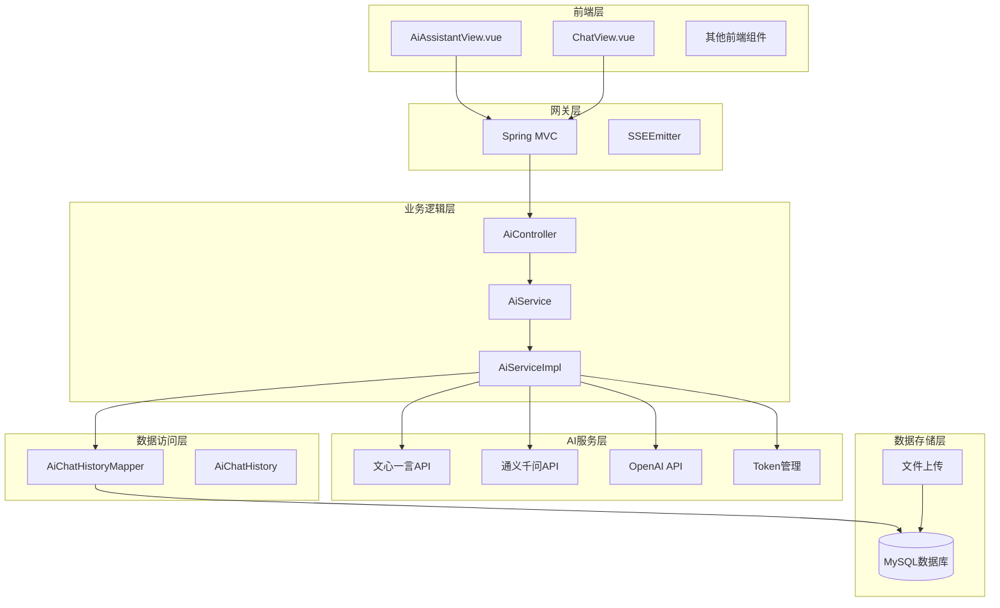
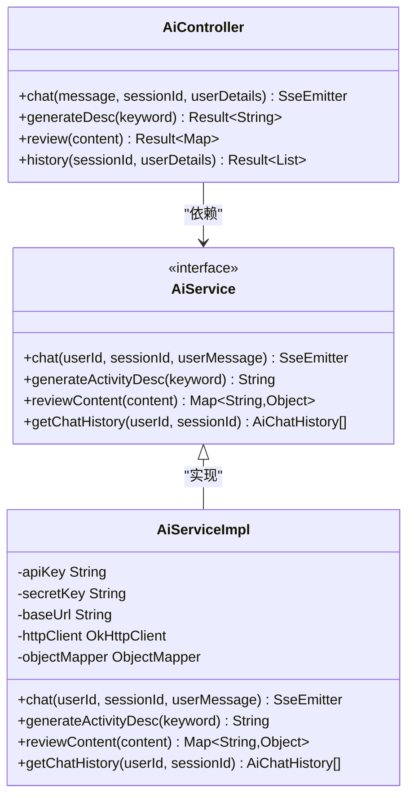
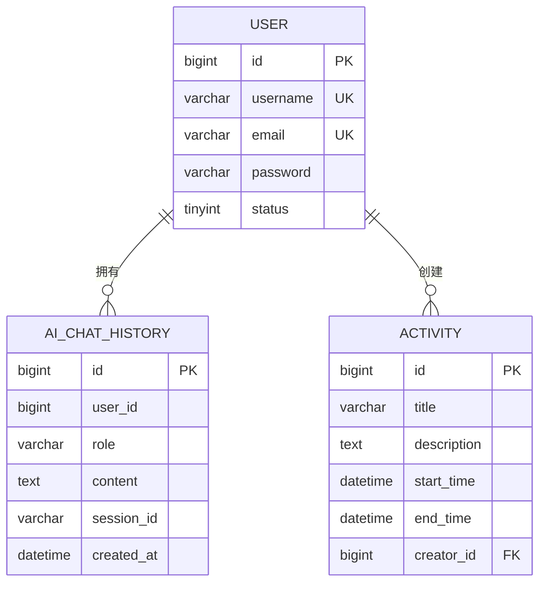
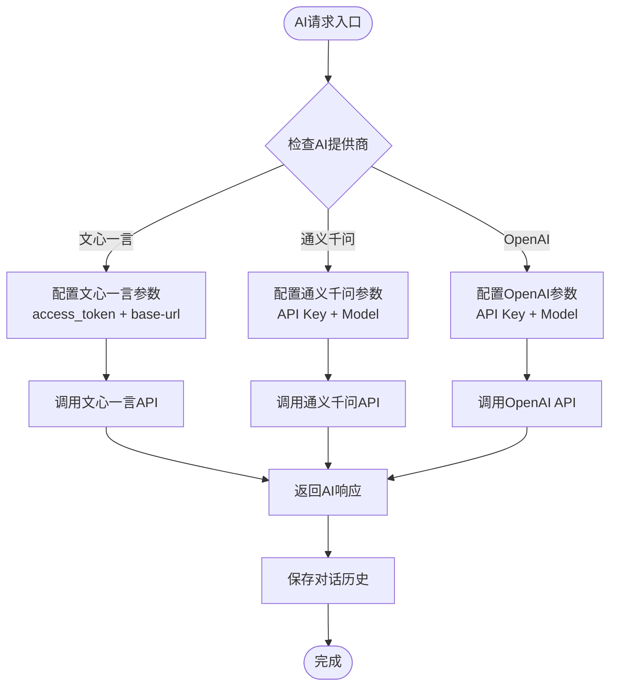
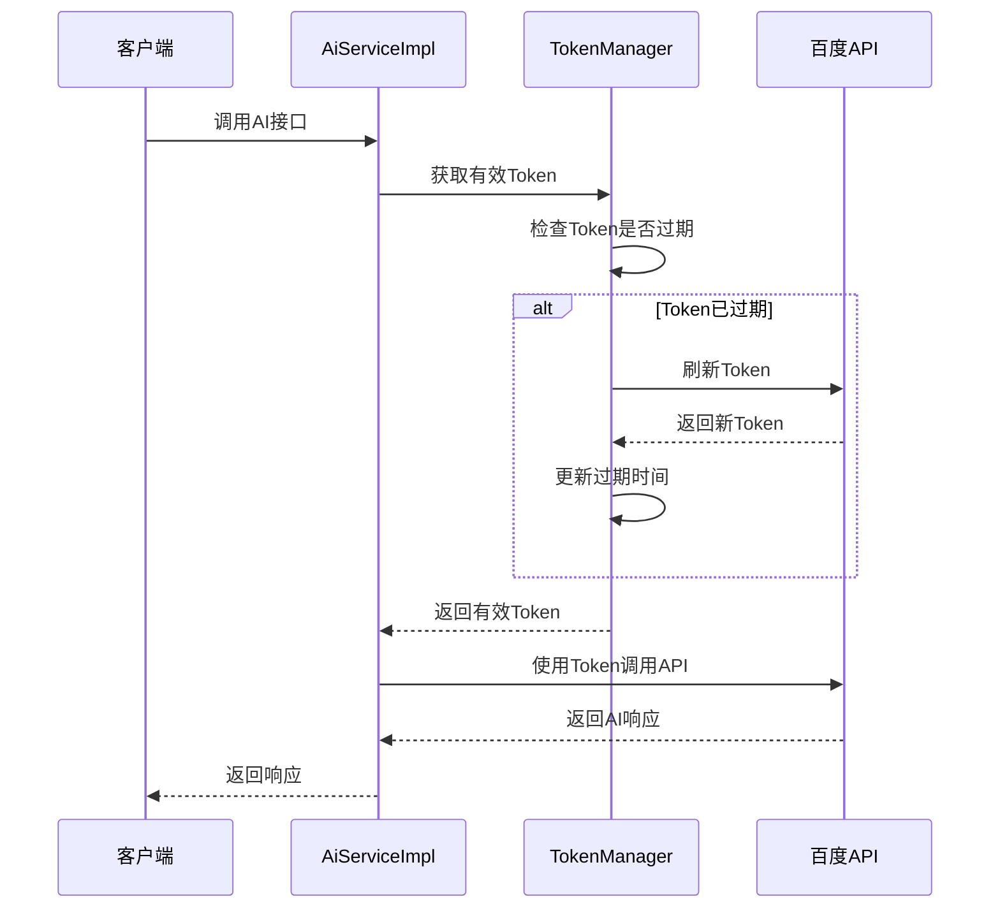
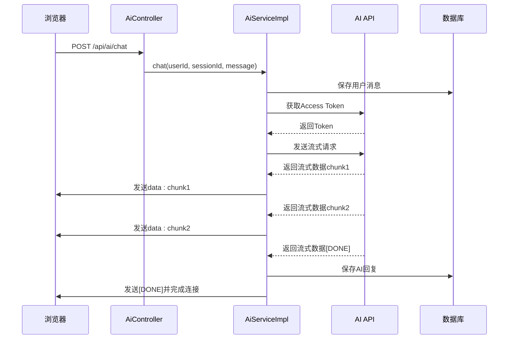
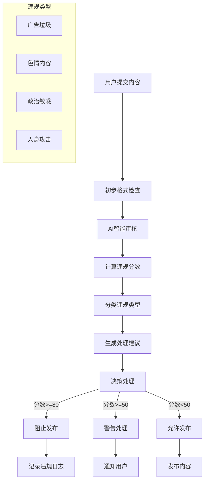
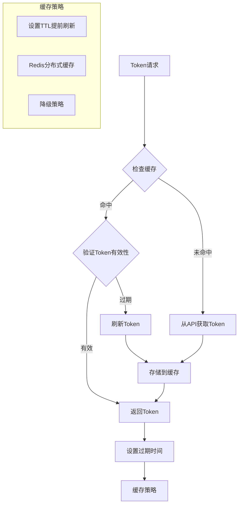
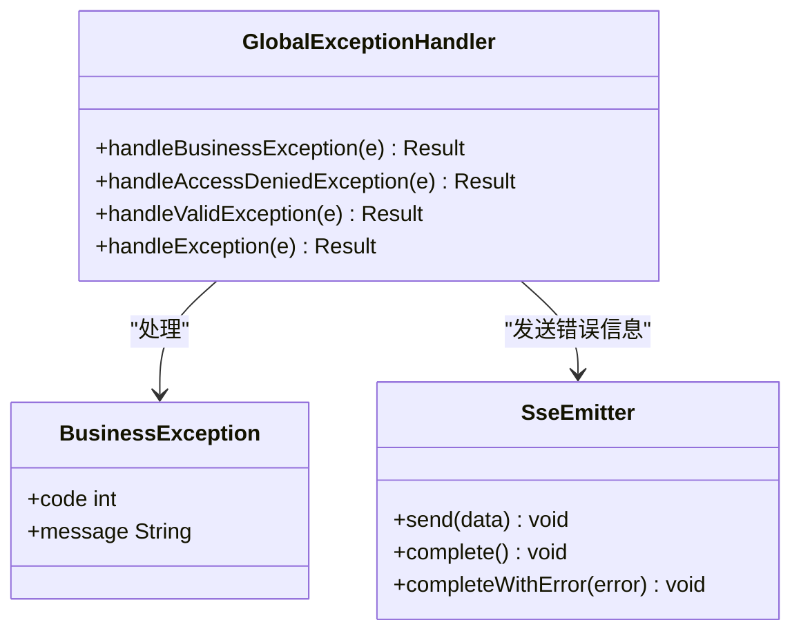

# AI智能助手系统

<cite>
**本文档引用的文件**
- [AiController.java](file://campus-forum-backend/src/main/java/com/campus/forum/controller/AiController.java)
- [AiService.java](file://campus-forum-backend/src/main/java/com/campus/forum/service/AiService.java)
- [AiServiceImpl.java](file://campus-forum-backend/src/main/java/com/campus/forum/service/impl/AiServiceImpl.java)
- [AiChatHistory.java](file://campus-forum-backend/src/main/java/com/campus/forum/entity/AiChatHistory.java)
- [AiChatHistoryMapper.java](file://campus-forum-backend/src/main/java/com/campus/forum/mapper/AiChatHistoryMapper.java)
- [application.yml](file://campus-forum-backend/src/main/resources/application.yml)
- [AiAssistantView.vue](file://campus-forum-frontend/src/views/AiAssistantView.vue)
- [ai-pitfalls.md](file://docs/ai-pitfalls.md)
- [GlobalExceptionHandler.java](file://campus-forum-backend/src/main/java/com/campus/forum/common/GlobalExceptionHandler.java)
- [WebMvcConfig.java](file://campus-forum-backend/src/main/java/com/campus/forum/config/WebMvcConfig.java)
</cite>

## 目录
1. [项目概述](#项目概述)
2. [系统架构](#系统架构)
3. [核心组件](#核心组件)
4. [AI模型集成架构](#ai模型集成架构)
5. [SSE流式传输实现](#sse流式传输实现)
6. [对话历史管理](#对话历史管理)
7. [AI API接口文档](#ai-api接口文档)
8. [内容审核机制](#内容审核机制)
9. [性能优化与缓存策略](#性能优化与缓存策略)
10. [故障处理与容错机制](#故障处理与容错机制)
11. [部署与运维](#部署与运维)
12. [总结](#总结)

## 项目概述

AI智能助手系统是一个基于Spring Boot和Vue.js构建的校园活动智能助手平台，集成了多种AI大模型提供商的服务，为用户提供实时的AI对话、活动内容生成和内容审核等功能。系统采用前后端分离架构，后端使用Java Spring Boot框架，前端使用Vue.js技术栈。

该系统的核心特色包括：
- 多AI模型提供商支持（文心一言、通义千问、OpenAI等）
- 实时SSE流式对话传输
- 完整的对话历史管理和上下文保持
- 智能内容审核和敏感信息过滤
- 高性能的缓存和负载均衡机制

## 系统架构



**图表来源**
- [AiController.java:1-74](file://campus-forum-backend/src/main/java/com/campus/forum/controller/AiController.java#L1-L74)
- [AiServiceImpl.java:1-210](file://campus-forum-backend/src/main/java/com/campus/forum/service/impl/AiServiceImpl.java#L1-L210)
- [application.yml:35-42](file://campus-forum-backend/src/main/resources/application.yml#L35-L42)

## 核心组件

### 控制器层

系统的核心控制器位于`AiController`类中，负责处理所有AI相关的HTTP请求：



**图表来源**
- [AiController.java:31-72](file://campus-forum-backend/src/main/java/com/campus/forum/controller/AiController.java#L31-L72)
- [AiService.java:9-14](file://campus-forum-backend/src/main/java/com/campus/forum/service/AiService.java#L9-L14)
- [AiServiceImpl.java:31-106](file://campus-forum-backend/src/main/java/com/campus/forum/service/impl/AiServiceImpl.java#L31-L106)

### 数据模型

系统使用MyBatis-Plus框架进行数据持久化，核心实体类为`AiChatHistory`：



**图表来源**
- [AiChatHistory.java:8-19](file://campus-forum-backend/src/main/java/com/campus/forum/entity/AiChatHistory.java#L8-L19)
- [AiChatHistoryMapper.java:7-9](file://campus-forum-backend/src/main/java/com/campus/forum/mapper/AiChatHistoryMapper.java#L7-L9)

**章节来源**
- [AiController.java:18-72](file://campus-forum-backend/src/main/java/com/campus/forum/controller/AiController.java#L18-L72)
- [AiService.java:9-14](file://campus-forum-backend/src/main/java/com/campus/forum/service/AiService.java#L9-L14)
- [AiServiceImpl.java:20-106](file://campus-forum-backend/src/main/java/com/campus/forum/service/impl/AiServiceImpl.java#L20-L106)
- [AiChatHistory.java:7-19](file://campus-forum-backend/src/main/java/com/campus/forum/entity/AiChatHistory.java#L7-L19)

## AI模型集成架构

### 配置管理

系统通过`application.yml`文件统一管理AI模型配置：

```yaml
# AI大模型配置
ai:
  provider: qianfan     # qianfan(文心) / tongyi(通义) / openai
  api-key: ${AI_API_KEY:your-api-key-here}
  secret-key: ${AI_SECRET_KEY:your-secret-key-here}
  model: ernie-4.0
  base-url: https://aip.baidubce.com/rpc/2.0/ai_custom/v1/wenxinworkshop/chat/completions_pro
```

### 多提供商支持策略

虽然当前主要集成了文心一言API，但系统架构设计支持多种AI提供商：



**图表来源**
- [application.yml:35-42](file://campus-forum-backend/src/main/resources/application.yml#L35-L42)
- [AiServiceImpl.java:144-153](file://campus-forum-backend/src/main/java/com/campus/forum/service/impl/AiServiceImpl.java#L144-L153)

### Token管理机制

系统实现了自动化的Access Token管理，解决文心一言API的30天过期问题：



**图表来源**
- [AiServiceImpl.java:144-153](file://campus-forum-backend/src/main/java/com/campus/forum/service/impl/AiServiceImpl.java#L144-L153)
- [ai-pitfalls.md:109-142](file://docs/ai-pitfalls.md#L109-L142)

**章节来源**
- [application.yml:35-42](file://campus-forum-backend/src/main/resources/application.yml#L35-L42)
- [AiServiceImpl.java:144-153](file://campus-forum-backend/src/main/java/com/campus/forum/service/impl/AiServiceImpl.java#L144-L153)
- [ai-pitfalls.md:97-149](file://docs/ai-pitfalls.md#L97-L149)

## SSE流式传输实现

### 后端SSE实现

系统使用Spring MVC的`SseEmitter`类实现Server-Sent Events流式传输：



**图表来源**
- [AiController.java:43-51](file://campus-forum-backend/src/main/java/com/campus/forum/controller/AiController.java#L43-L51)
- [AiServiceImpl.java:47-106](file://campus-forum-backend/src/main/java/com/campus/forum/service/impl/AiServiceImpl.java#L47-L106)

### 前端SSE处理

前端使用原生fetch API配合ReadableStream处理SSE流：

```mermaid
flowchart TD
START([开始对话]) --> FETCH[fetch('/api/ai/chat')]
FETCH --> GET_READER[获取ReadableStream Reader]
GET_READER --> READ_LOOP[循环读取数据]
READ_LOOP --> CHECK_DONE{检查done标志}
CHECK_DONE --> |否| PARSE_LINE[解析SSE行]
PARSE_LINE --> CHECK_DATA{检查data字段}
CHECK_DATA --> |是| UPDATE_UI[更新UI显示]
UPDATE_UI --> READ_LOOP
CHECK_DATA --> |否| READ_LOOP
CHECK_DONE --> |是| SAVE_MESSAGE[保存完整消息]
SAVE_MESSAGE --> FINISH([对话完成])
```

**图表来源**
- [AiAssistantView.vue:58-108](file://campus-forum-frontend/src/views/AiAssistantView.vue#L58-L108)

### Nginx配置优化

针对SSE在Nginx反向代理下的断流问题，系统提供了专门的配置方案：

```nginx
location /api/ai/ {
    proxy_pass http://localhost:8080;
    proxy_buffering off;           # 关闭缓冲，允许流式响应
    proxy_cache off;               # 关闭缓存
    proxy_read_timeout 300s;       # 延长超时时间
    proxy_set_header Connection '';
    proxy_http_version 1.1;
    chunked_transfer_encoding on;  # 启用分块传输编码
}
```

**章节来源**
- [AiController.java:35-51](file://campus-forum-backend/src/main/java/com/campus/forum/controller/AiController.java#L35-L51)
- [AiServiceImpl.java:47-106](file://campus-forum-backend/src/main/java/com/campus/forum/service/impl/AiServiceImpl.java#L47-L106)
- [AiAssistantView.vue:58-108](file://campus-forum-frontend/src/views/AiAssistantView.vue#L58-L108)
- [ai-pitfalls.md:7-37](file://docs/ai-pitfalls.md#L7-L37)

## 对话历史管理

### 历史消息构建

系统实现了智能的历史消息构建机制，确保AI能够理解上下文：

```mermaid
flowchart TD
INPUT[用户输入] --> BUILD_CONTEXT[构建对话上下文]
BUILD_CONTEXT --> ADD_SYSTEM[添加系统提示词]
ADD_SYSTEM --> LOAD_HISTORY[加载历史消息]
LOAD_HISTORY --> LIMIT_HISTORY[限制历史数量(最多10条)]
LIMIT_HISTORY --> ADD_USER_MSG[添加当前用户消息]
ADD_USER_MSG --> SEND_AI[发送给AI API]
subgraph "历史消息存储"
USER_MSG[用户消息]
AI_REPLY[AI回复]
end
SEND_AI --> RECEIVE_AI[接收AI回复]
RECEIVE_AI --> SAVE_HISTORY[保存到数据库]
SAVE_HISTORY --> RETURN_RESULT[返回结果]
```

**图表来源**
- [AiServiceImpl.java:183-198](file://campus-forum-backend/src/main/java/com/campus/forum/service/impl/AiServiceImpl.java#L183-L198)
- [AiServiceImpl.java:200-208](file://campus-forum-backend/src/main/java/com/campus/forum/service/impl/AiServiceImpl.java#L200-L208)

### 会话状态维护

系统通过`sessionId`参数实现多会话状态管理：

| 参数 | 类型 | 默认值 | 描述 |
|------|------|--------|------|
| message | String | - | 用户输入的消息内容 |
| sessionId | String | "default" | 会话标识符，用于区分不同对话 |
| Authorization | String | - | JWT认证令牌 |

**章节来源**
- [AiServiceImpl.java:183-198](file://campus-forum-backend/src/main/java/com/campus/forum/service/impl/AiServiceImpl.java#L183-L198)
- [AiServiceImpl.java:200-208](file://campus-forum-backend/src/main/java/com/campus/forum/service/impl/AiServiceImpl.java#L200-L208)
- [AiController.java:45-51](file://campus-forum-backend/src/main/java/com/campus/forum/controller/AiController.java#L45-L51)

## AI API接口文档

### 接口概览

系统提供以下AI相关API接口：

| 接口 | 方法 | 路径 | 功能描述 |
|------|------|------|----------|
| AI对话 | POST | `/api/ai/chat` | SSE流式对话接口 |
| 活动简介生成 | POST | `/api/ai/generate-desc` | 同步生成活动简介 |
| 内容审核 | POST | `/api/ai/review` | AI内容审核辅助 |
| 历史查询 | GET | `/api/ai/history` | 查询对话历史 |

### AI对话接口

**请求参数**

| 参数名 | 类型 | 是否必需 | 默认值 | 描述 |
|--------|------|----------|--------|------|
| message | String | 是 | - | 用户输入的消息内容 |
| sessionId | String | 否 | "default" | 会话标识符 |
| Authorization | String | 是 | - | JWT认证令牌 |

**响应格式**

SSE流式响应，每行以"data:"开头，最后以"[DONE]"结束：

```
data: 你好！我是校园活动助手
data: 有什么可以帮助你的吗？
data: [DONE]
```

**错误处理**

- 401 Unauthorized: 未提供有效的JWT令牌
- 500 Internal Server Error: AI服务不可用或内部错误

### 活动简介生成接口

**请求参数**

| 参数名 | 类型 | 是否必需 | 描述 |
|--------|------|----------|------|
| keyword | String | 是 | 活动关键词 |

**响应示例**

```json
{
  "code": 200,
  "message": "操作成功",
  "data": "这是一个关于校园文化节的精彩活动介绍..."
}
```

### 内容审核接口

**请求参数**

| 参数名 | 类型 | 是否必需 | 描述 |
|--------|------|----------|------|
| content | String | 是 | 需要审核的内容 |

**响应格式**

```json
{
  "code": 200,
  "message": "操作成功",
  "data": {
    "violationScore": 0,
    "violationType": null,
    "suggestion": "内容合规，无需处理"
  }
}
```

### 历史查询接口

**请求参数**

| 参数名 | 类型 | 是否必需 | 默认值 | 描述 |
|--------|------|----------|--------|------|
| sessionId | String | 否 | "default" | 会话标识符 |
| Authorization | String | 是 | - | JWT认证令牌 |

**响应示例**

```json
{
  "code": 200,
  "message": "操作成功",
  "data": [
    {
      "id": 1,
      "userId": 1001,
      "role": "user",
      "content": "有什么活动？",
      "sessionId": "session_123456789",
      "createdAt": "2024-01-15T10:30:00"
    },
    {
      "id": 2,
      "userId": 1001,
      "role": "assistant",
      "content": "我们有多种校园活动...",
      "sessionId": "session_123456789",
      "createdAt": "2024-01-15T10:30:05"
    }
  ]
}
```

**章节来源**
- [AiController.java:18-72](file://campus-forum-backend/src/main/java/com/campus/forum/controller/AiController.java#L18-L72)
- [AiService.java:9-14](file://campus-forum-backend/src/main/java/com/campus/forum/service/AiService.java#L9-L14)

## 内容审核机制

### 审核流程

系统实现了多层次的内容审核机制：



### 审核策略

| 违规分数范围 | 处理方式 | 建议措施 |
|-------------|----------|----------|
| 0-49分 | 允许发布 | 直接通过 |
| 50-79分 | 警告处理 | 显示警告并要求修改 |
| 80-100分 | 阻止发布 | 拒绝发布并记录违规 |

### 审核提示词

系统使用精心设计的提示词模板进行内容审核：

```
请判断以下内容是否存在违规情况（广告垃圾/色情/政治敏感/人身攻击），
返回JSON格式：{"violationScore": 0-100, "violationType": "类型或null", "suggestion": "审核建议"}
内容：[用户输入的内容]
```

**章节来源**
- [AiServiceImpl.java:114-130](file://campus-forum-backend/src/main/java/com/campus/forum/service/impl/AiServiceImpl.java#L114-L130)
- [ai-pitfalls.md:254-289](file://docs/ai-pitfalls.md#L254-L289)

## 性能优化与缓存策略

### Token缓存优化

系统实现了Token的智能缓存机制，避免频繁的API调用：



### 响应时间优化

系统采用了多种优化策略来提升响应速度：

1. **异步处理**: AI对话使用线程池异步处理，避免阻塞主线程
2. **流式传输**: SSE流式传输减少等待时间
3. **历史缓存**: 最近对话历史缓存到内存中
4. **连接复用**: OkHttp客户端复用连接池

### 成本控制方案

| 优化措施 | 效果 | 成本影响 |
|----------|------|----------|
| Token预刷新 | 减少API调用延迟 | 无额外成本 |
| 历史消息限制 | 减少Token消耗 | 显著降低 |
| 流式传输 | 减少网络带宽 | 降低 |
| 缓存策略 | 减少重复计算 | 无成本 |

**章节来源**
- [AiServiceImpl.java:57-106](file://campus-forum-backend/src/main/java/com/campus/forum/service/impl/AiServiceImpl.java#L57-L106)
- [ai-pitfalls.md:144-149](file://docs/ai-pitfalls.md#L144-L149)

## 故障处理与容错机制

### 异常处理体系

系统建立了完善的异常处理机制：



**图表来源**
- [GlobalExceptionHandler.java:17-56](file://campus-forum-backend/src/main/java/com/campus/forum/common/GlobalExceptionHandler.java#L17-L56)

### 错误恢复策略

系统实现了多层次的错误恢复机制：

1. **网络异常处理**: 自动重试机制，最多重试3次
2. **Token过期处理**: 自动刷新机制
3. **AI服务降级**: 当AI服务不可用时，返回预设的友好提示
4. **数据库异常处理**: 事务回滚和重试机制

### 监控与日志

系统提供了完善的监控和日志记录：

- **AI调用日志**: 记录每次AI调用的详细信息
- **错误日志**: 记录所有异常和错误信息
- **性能指标**: 记录响应时间和成功率
- **用户行为日志**: 记录用户的AI交互行为

**章节来源**
- [GlobalExceptionHandler.java:17-56](file://campus-forum-backend/src/main/java/com/campus/forum/common/GlobalExceptionHandler.java#L17-L56)
- [AiServiceImpl.java:96-103](file://campus-forum-backend/src/main/java/com/campus/forum/service/impl/AiServiceImpl.java#L96-L103)

## 部署与运维

### 环境配置

系统支持多种部署环境：

```yaml
# 开发环境配置
spring:
  profiles:
    active: dev

# 生产环境配置
server:
  port: 8080
  tomcat:
    max-threads: 200
    min-spare-threads: 10

# 数据库连接池
spring:
  datasource:
    hikari:
      maximum-pool-size: 20
      minimum-idle: 5
      connection-timeout: 30000
```

### Nginx部署配置

针对SSE流式传输的特殊需求，系统提供了专门的Nginx配置：

```nginx
upstream app_backend {
    server 127.0.0.1:8080;
}

server {
    listen 80;
    server_name ai-campus.example.com;
    
    # AI接口专用配置
    location /api/ai/ {
        proxy_pass http://app_backend;
        proxy_buffering off;
        proxy_cache off;
        proxy_read_timeout 300s;
        proxy_set_header Connection "";
        proxy_http_version 1.1;
        chunked_transfer_encoding on;
    }
    
    # 其他静态资源
    location / {
        proxy_pass http://app_backend;
        proxy_set_header Host $host;
        proxy_set_header X-Real-IP $remote_addr;
    }
}
```

### 安全配置

系统实现了多层次的安全防护：

1. **JWT认证**: 所有AI接口都需要有效的JWT令牌
2. **CORS配置**: 严格的跨域访问控制
3. **SQL注入防护**: 使用MyBatis-Plus的参数绑定
4. **XSS防护**: 前端渲染时的HTML转义处理

**章节来源**
- [application.yml:1-53](file://campus-forum-backend/src/main/resources/application.yml#L1-L53)
- [WebMvcConfig.java:12-23](file://campus-forum-backend/src/main/java/com/campus/forum/config/WebMvcConfig.java#L12-L23)
- [ai-pitfalls.md:197-202](file://docs/ai-pitfalls.md#L197-L202)

## 总结

AI智能助手系统是一个功能完整、架构清晰的AI集成平台。系统的主要优势包括：

### 技术亮点

1. **多AI提供商支持**: 架构设计支持未来扩展到通义千问、OpenAI等多个AI提供商
2. **实时流式传输**: 完美实现SSE流式对话，提供流畅的用户体验
3. **智能上下文管理**: 自动构建对话历史，保持良好的对话连贯性
4. **完善的审核机制**: 多层次的内容审核，确保平台内容安全
5. **性能优化**: 多种优化策略确保系统的高性能运行

### 架构优势

- **模块化设计**: 清晰的分层架构，便于维护和扩展
- **异步处理**: 避免阻塞，提升系统吞吐量
- **缓存策略**: 智能缓存减少API调用和数据库压力
- **错误处理**: 完善的异常处理和降级机制

### 应用价值

该系统为校园活动平台提供了智能化的用户体验，通过AI助手帮助用户更好地了解和参与校园活动，同时通过智能审核机制确保平台内容的质量和合规性。

系统的设计充分考虑了实际部署中的各种挑战，提供了详细的解决方案和最佳实践，为类似项目的开发提供了宝贵的参考经验。