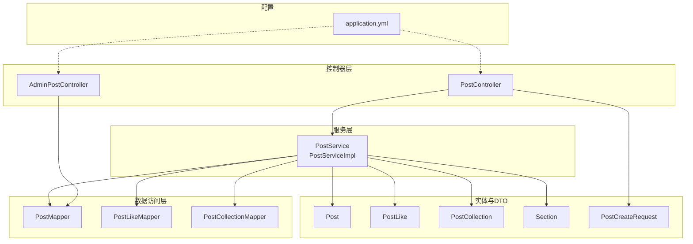
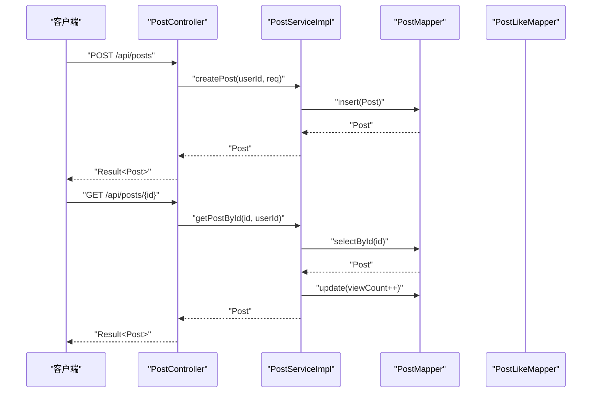
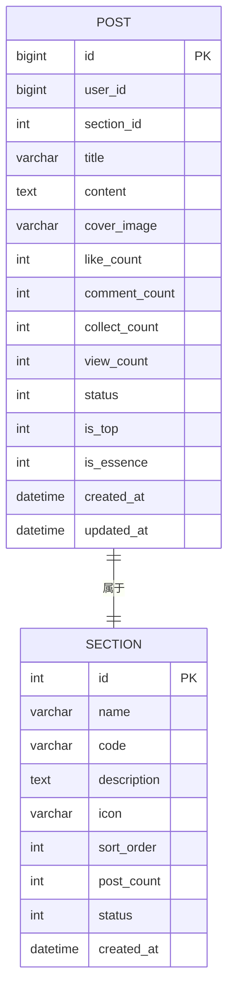
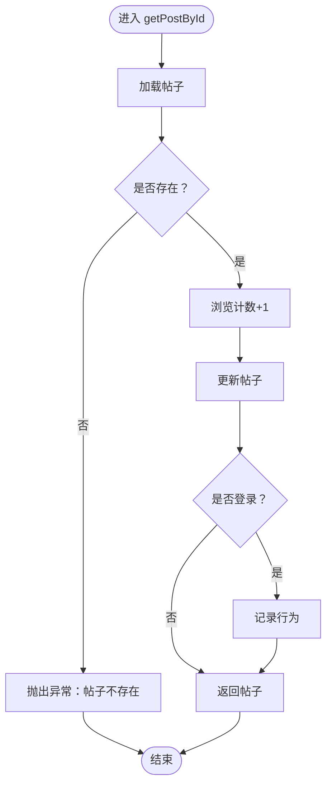
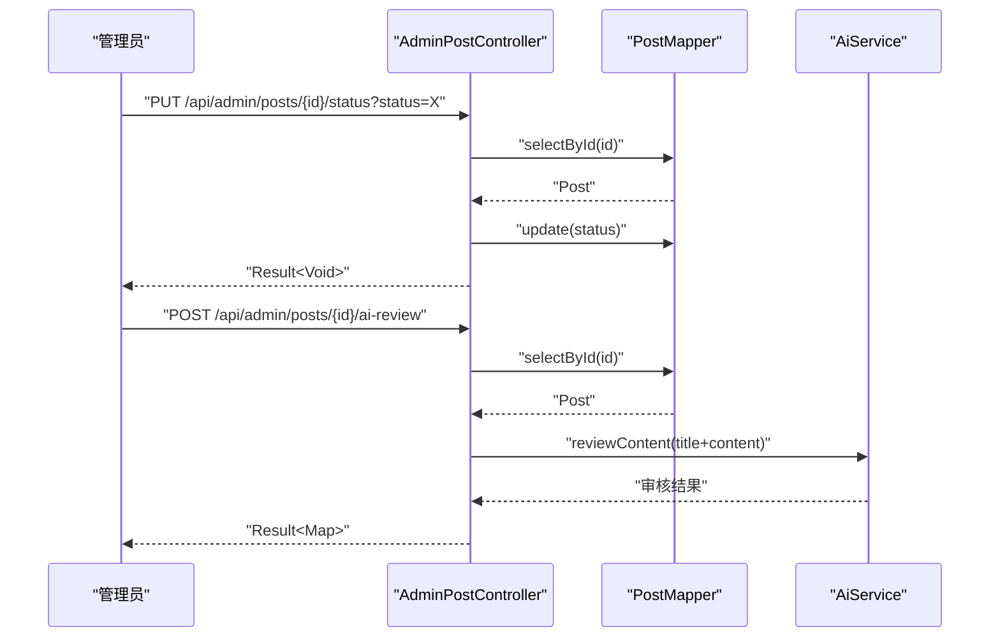
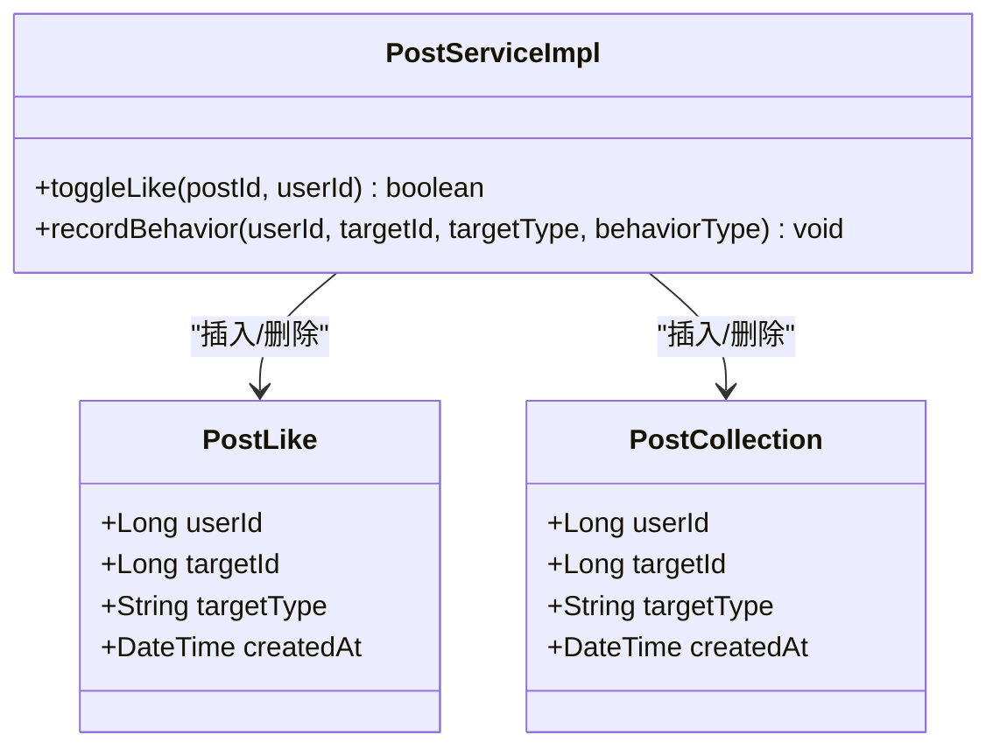
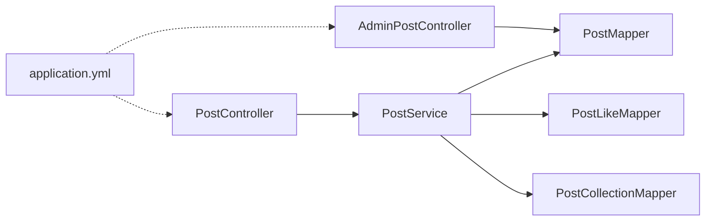

# 帖子管理系统

<cite>
**本文引用的文件**
- [Post.java](file://campus-forum-backend/src/main/java/com/campus/forum/entity/Post.java)
- [PostController.java](file://campus-forum-backend/src/main/java/com/campus/forum/controller/PostController.java)
- [PostService.java](file://campus-forum-backend/src/main/java/com/campus/forum/service/PostService.java)
- [PostServiceImpl.java](file://campus-forum-backend/src/main/java/com/campus/forum/service/impl/PostServiceImpl.java)
- [PostMapper.java](file://campus-forum-backend/src/main/java/com/campus/forum/mapper/PostMapper.java)
- [PostCreateRequest.java](file://campus-forum-backend/src/main/java/com/campus/forum/dto/request/PostCreateRequest.java)
- [PostLike.java](file://campus-forum-backend/src/main/java/com/campus/forum/entity/PostLike.java)
- [PostLikeMapper.java](file://campus-forum-backend/src/main/java/com/campus/forum/mapper/PostLikeMapper.java)
- [PostCollection.java](file://campus-forum-backend/src/main/java/com/campus/forum/entity/PostCollection.java)
- [PostCollectionMapper.java](file://campus-forum-backend/src/main/java/com/campus/forum/mapper/PostCollectionMapper.java)
- [Section.java](file://campus-forum-backend/src/main/java/com/campus/forum/entity/Section.java)
- [AdminPostController.java](file://campus-forum-backend/src/main/java/com/campus/forum/controller/admin/AdminPostController.java)
- [application.yml](file://campus-forum-backend/src/main/resources/application.yml)
</cite>

## 目录
1. [引言](#引言)
2. [项目结构](#项目结构)
3. [核心组件](#核心组件)
4. [架构总览](#架构总览)
5. [详细组件分析](#详细组件分析)
6. [依赖分析](#依赖分析)
7. [性能考虑](#性能考虑)
8. [故障排查指南](#故障排查指南)
9. [结论](#结论)
10. [附录](#附录)

## 引言
本文件为“帖子管理系统”的综合技术文档，覆盖帖子的创建、编辑、删除、浏览与搜索，版块归属与分类体系，互动行为（点赞、收藏、分享）的数据模型与业务逻辑，审核流程与内容管理，违规处理机制，以及完整的API接口定义、缓存与搜索引擎集成建议、性能优化与内容安全过滤方案。文档面向开发与产品团队，兼顾非技术读者的理解需求。

## 项目结构
后端采用Spring Boot + MyBatis-Plus架构，按领域分层组织：
- 控制器层：对外暴露REST接口，负责参数接收与响应封装
- 服务层：编排业务逻辑，协调数据访问与外部能力
- 数据访问层：基于MyBatis-Plus Mapper进行数据库操作
- 实体与DTO：定义数据模型与请求/响应载体
- 配置：数据库连接、JWT、AI能力、文件上传等

图表来源
- [PostController.java:1-65](file://campus-forum-backend/src/main/java/com/campus/forum/controller/PostController.java#L1-L65)
- [AdminPostController.java:1-91](file://campus-forum-backend/src/main/java/com/campus/forum/controller/admin/AdminPostController.java#L1-L91)
- [PostServiceImpl.java:1-114](file://campus-forum-backend/src/main/java/com/campus/forum/service/impl/PostServiceImpl.java#L1-L114)
- [PostMapper.java:1-15](file://campus-forum-backend/src/main/java/com/campus/forum/mapper/PostMapper.java#L1-L15)
- [PostLikeMapper.java:1-16](file://campus-forum-backend/src/main/java/com/campus/forum/mapper/PostLikeMapper.java#L1-L16)
- [PostCollectionMapper.java:1-16](file://campus-forum-backend/src/main/java/com/campus/forum/mapper/PostCollectionMapper.java#L1-L16)
- [Post.java:1-35](file://campus-forum-backend/src/main/java/com/campus/forum/entity/Post.java#L1-L35)
- [PostLike.java:1-16](file://campus-forum-backend/src/main/java/com/campus/forum/entity/PostLike.java#L1-L16)
- [PostCollection.java:1-16](file://campus-forum-backend/src/main/java/com/campus/forum/entity/PostCollection.java#L1-L16)
- [Section.java:1-22](file://campus-forum-backend/src/main/java/com/campus/forum/entity/Section.java#L1-L22)
- [PostCreateRequest.java:1-17](file://campus-forum-backend/src/main/java/com/campus/forum/dto/request/PostCreateRequest.java#L1-L17)
- [application.yml:1-53](file://campus-forum-backend/src/main/resources/application.yml#L1-L53)

章节来源
- [PostController.java:1-65](file://campus-forum-backend/src/main/java/com/campus/forum/controller/PostController.java#L1-L65)
- [AdminPostController.java:1-91](file://campus-forum-backend/src/main/java/com/campus/forum/controller/admin/AdminPostController.java#L1-L91)
- [PostServiceImpl.java:1-114](file://campus-forum-backend/src/main/java/com/campus/forum/service/impl/PostServiceImpl.java#L1-L114)
- [application.yml:1-53](file://campus-forum-backend/src/main/resources/application.yml#L1-L53)

## 核心组件
- 帖子实体与状态机：支持草稿、发布、删除、审核中等状态；提供置顶、加精标记
- 互动行为：点赞、收藏；行为记录用于统计与推荐
- 版块归属：通过sectionId关联版块，支持按版块筛选
- 审核与管理：管理员可上下架、置顶、加精、AI辅助审核、删除
- 搜索与分页：支持关键词与版块筛选的分页查询
- 安全与权限：基于JWT鉴权，部分操作校验作者身份

章节来源
- [Post.java:1-35](file://campus-forum-backend/src/main/java/com/campus/forum/entity/Post.java#L1-L35)
- [PostLike.java:1-16](file://campus-forum-backend/src/main/java/com/campus/forum/entity/PostLike.java#L1-L16)
- [PostCollection.java:1-16](file://campus-forum-backend/src/main/java/com/campus/forum/entity/PostCollection.java#L1-L16)
- [Section.java:1-22](file://campus-forum-backend/src/main/java/com/campus/forum/entity/Section.java#L1-L22)
- [PostServiceImpl.java:26-103](file://campus-forum-backend/src/main/java/com/campus/forum/service/impl/PostServiceImpl.java#L26-L103)
- [AdminPostController.java:27-89](file://campus-forum-backend/src/main/java/com/campus/forum/controller/admin/AdminPostController.java#L27-L89)

## 架构总览
系统遵循经典的分层架构，控制器负责HTTP协议与参数解析，服务层编排业务规则，数据访问层专注持久化。JWT用于鉴权，AI能力用于内容审核辅助，MyBatis-Plus提供分页与条件查询。

图表来源
- [PostController.java:42-47](file://campus-forum-backend/src/main/java/com/campus/forum/controller/PostController.java#L42-L47)
- [PostController.java:35-40](file://campus-forum-backend/src/main/java/com/campus/forum/controller/PostController.java#L35-L40)
- [PostServiceImpl.java:27-40](file://campus-forum-backend/src/main/java/com/campus/forum/service/impl/PostServiceImpl.java#L27-L40)
- [PostServiceImpl.java:54-65](file://campus-forum-backend/src/main/java/com/campus/forum/service/impl/PostServiceImpl.java#L54-L65)
- [PostMapper.java:1-15](file://campus-forum-backend/src/main/java/com/campus/forum/mapper/PostMapper.java#L1-L15)

## 详细组件分析

### 帖子实体与数据模型
- 字段要点：用户ID、版块ID、标题、正文、封面图、计数字段（点赞、评论、收藏、浏览）、状态、置顶、加精、时间戳
- 状态语义：草稿、已发布、已删除（逻辑删除）、审核中
- 关系：与用户、版块、互动表存在外键约束或业务关联

图表来源
- [Post.java:10-34](file://campus-forum-backend/src/main/java/com/campus/forum/entity/Post.java#L10-L34)
- [Section.java:8-21](file://campus-forum-backend/src/main/java/com/campus/forum/entity/Section.java#L8-L21)

章节来源
- [Post.java:10-34](file://campus-forum-backend/src/main/java/com/campus/forum/entity/Post.java#L10-L34)
- [Section.java:8-21](file://campus-forum-backend/src/main/java/com/campus/forum/entity/Section.java#L8-L21)

### 帖子服务与业务逻辑
- 创建：填充基础字段，设置默认状态与计数，持久化入库
- 列表：按状态=已发布、可选版块、关键词模糊匹配、按创建时间倒序分页
- 详情：读取帖子，增加浏览计数，记录用户行为，返回结果
- 删除：仅作者可删除，执行逻辑删除（状态=已删除）
- 点赞：幂等切换，维护计数与唯一索引约束，记录行为

图表来源
- [PostServiceImpl.java:54-65](file://campus-forum-backend/src/main/java/com/campus/forum/service/impl/PostServiceImpl.java#L54-L65)

章节来源
- [PostServiceImpl.java:26-103](file://campus-forum-backend/src/main/java/com/campus/forum/service/impl/PostServiceImpl.java#L26-L103)

### 管理端审核与运营功能
- 列表：支持关键词与状态筛选，分页排序
- 审核：修改状态（上线/下线），置顶、加精开关
- AI辅助审核：调用AI服务对标题+正文进行违规检测
- 删除：逻辑删除（状态=已删除）

图表来源
- [AdminPostController.java:42-79](file://campus-forum-backend/src/main/java/com/campus/forum/controller/admin/AdminPostController.java#L42-L79)
- [PostMapper.java:1-15](file://campus-forum-backend/src/main/java/com/campus/forum/mapper/PostMapper.java#L1-L15)

章节来源
- [AdminPostController.java:27-89](file://campus-forum-backend/src/main/java/com/campus/forum/controller/admin/AdminPostController.java#L27-L89)

### 互动行为：点赞与收藏
- 点赞：唯一性约束（用户+目标+类型），切换增减计数，记录行为
- 收藏：与点赞类似，目标类型扩展为帖子/活动

图表来源
- [PostLike.java:8-15](file://campus-forum-backend/src/main/java/com/campus/forum/entity/PostLike.java#L8-L15)
- [PostCollection.java:8-15](file://campus-forum-backend/src/main/java/com/campus/forum/entity/PostCollection.java#L8-L15)
- [PostServiceImpl.java:78-103](file://campus-forum-backend/src/main/java/com/campus/forum/service/impl/PostServiceImpl.java#L78-L103)

章节来源
- [PostLikeMapper.java:10-14](file://campus-forum-backend/src/main/java/com/campus/forum/mapper/PostLikeMapper.java#L10-L14)
- [PostCollectionMapper.java:10-14](file://campus-forum-backend/src/main/java/com/campus/forum/mapper/PostCollectionMapper.java#L10-L14)
- [PostServiceImpl.java:78-103](file://campus-forum-backend/src/main/java/com/campus/forum/service/impl/PostServiceImpl.java#L78-L103)

### API 接口文档
- 帖子模块
  - GET /api/posts?page=&size=&sectionId=&keyword=：分页列表（支持版块与关键词）
  - GET /api/posts/{id}：获取详情（自动增加浏览量并记录行为）
  - POST /api/posts：发布帖子（需要登录）
  - DELETE /api/posts/{id}：删除帖子（仅作者本人）
  - POST /api/posts/{id}/like：点赞/取消点赞（需要登录）
- 管理端-帖子模块
  - GET /api/admin/posts?page=&size=&keyword=&status=：分页列表（支持关键词与状态筛选）
  - PUT /api/admin/posts/{id}/status?status=：修改帖子状态
  - PUT /api/admin/posts/{id}/top?isTop=：置顶开关
  - PUT /api/admin/posts/{id}/essence?isEssence=：加精开关
  - POST /api/admin/posts/{id}/ai-review：AI辅助审核
  - DELETE /api/admin/posts/{id}：删除帖子

章节来源
- [PostController.java:25-63](file://campus-forum-backend/src/main/java/com/campus/forum/controller/PostController.java#L25-L63)
- [AdminPostController.java:27-89](file://campus-forum-backend/src/main/java/com/campus/forum/controller/admin/AdminPostController.java#L27-L89)

## 依赖分析
- 控制器依赖服务接口，服务实现依赖Mapper与行为记录
- Mapper使用MyBatis-Plus注解简化SQL，支持分页与条件查询
- 配置文件集中管理数据库、JWT、AI与文件上传参数

图表来源
- [PostController.java:22-23](file://campus-forum-backend/src/main/java/com/campus/forum/controller/PostController.java#L22-L23)
- [AdminPostController.java:24-25](file://campus-forum-backend/src/main/java/com/campus/forum/controller/admin/AdminPostController.java#L24-L25)
- [PostServiceImpl.java:22-24](file://campus-forum-backend/src/main/java/com/campus/forum/service/impl/PostServiceImpl.java#L22-L24)
- [application.yml:1-53](file://campus-forum-backend/src/main/resources/application.yml#L1-L53)

章节来源
- [PostController.java:22-23](file://campus-forum-backend/src/main/java/com/campus/forum/controller/PostController.java#L22-L23)
- [AdminPostController.java:24-25](file://campus-forum-backend/src/main/java/com/campus/forum/controller/admin/AdminPostController.java#L24-L25)
- [PostServiceImpl.java:22-24](file://campus-forum-backend/src/main/java/com/campus/forum/service/impl/PostServiceImpl.java#L22-L24)
- [application.yml:1-53](file://campus-forum-backend/src/main/resources/application.yml#L1-L53)

## 性能考虑
- 分页与排序：使用MyBatis-Plus Page对象与Lambda条件构造器，避免一次性加载全量数据
- 热帖查询：提供按浏览与点赞降序的热门贴查询接口，便于首页展示
- 缓存策略（建议）：对热点帖子详情与热门列表增加Redis缓存，设置合理TTL；写操作时采用“失效策略”保证一致性
- 搜索优化（建议）：引入Elasticsearch或数据库全文索引，支持高亮与分词检索
- 并发控制（建议）：点赞/收藏使用唯一索引与原子操作，必要时引入分布式锁或数据库级去重
- 数据库优化（建议）：为status、section_id、created_at建立复合索引；对高频查询字段添加索引

章节来源
- [PostMapper.java:12-13](file://campus-forum-backend/src/main/java/com/campus/forum/mapper/PostMapper.java#L12-L13)
- [PostServiceImpl.java:42-51](file://campus-forum-backend/src/main/java/com/campus/forum/service/impl/PostServiceImpl.java#L42-L51)

## 故障排查指南
- 业务异常：如“帖子不存在”、“无权删除他人帖子”，需在前端提示并引导正确操作
- 权限问题：未登录用户无法发布、点赞、删除；请检查JWT解析与拦截器配置
- 参数校验：创建请求的标题与内容为空会触发校验失败，需完善前端校验与错误提示
- AI审核：若AI服务不可用，应降级处理并记录日志，不影响主流程

章节来源
- [PostServiceImpl.java:56-76](file://campus-forum-backend/src/main/java/com/campus/forum/service/impl/PostServiceImpl.java#L56-L76)
- [AdminPostController.java:46-88](file://campus-forum-backend/src/main/java/com/campus/forum/controller/admin/AdminPostController.java#L46-L88)
- [PostCreateRequest.java:8-16](file://campus-forum-backend/src/main/java/com/campus/forum/dto/request/PostCreateRequest.java#L8-L16)

## 结论
系统以清晰的分层设计实现了帖子的核心生命周期管理与互动功能，结合管理员审核与AI辅助审核，形成从内容生产到治理的闭环。建议后续在缓存、搜索与并发控制方面进一步优化，以支撑更高的并发与更丰富的检索体验。

## 附录

### 数据模型与关系补充
- 用户行为记录：用于统计用户对帖子的浏览、点赞等行为，支撑推荐与风控
- 行为类型：VIEW、LIKE等，便于后续扩展

章节来源
- [PostServiceImpl.java:105-112](file://campus-forum-backend/src/main/java/com/campus/forum/service/impl/PostServiceImpl.java#L105-L112)

### 配置要点
- 数据源与MyBatis-Plus：逻辑删除字段与值、驼峰映射、Mapper扫描路径
- JWT：密钥与过期时间
- AI：提供商、模型、接口地址与凭据
- 文件上传：大小限制与URL前缀

章节来源
- [application.yml:9-28](file://campus-forum-backend/src/main/resources/application.yml#L9-L28)
- [application.yml:30-46](file://campus-forum-backend/src/main/resources/application.yml#L30-L46)