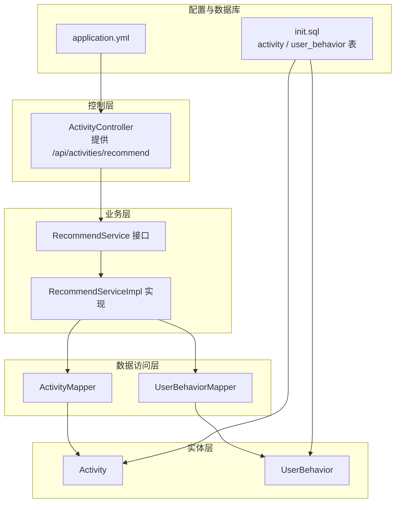
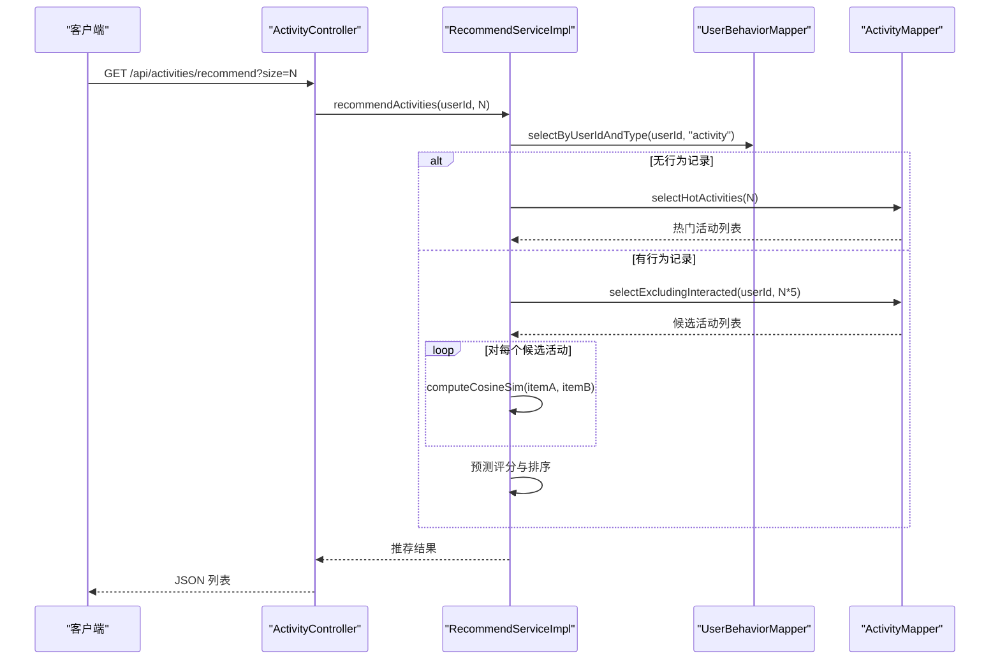
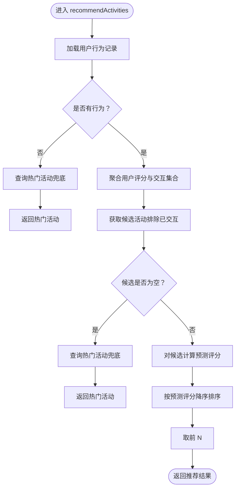
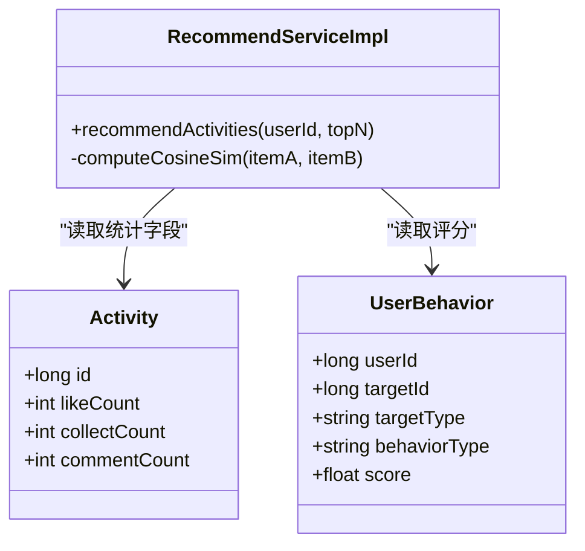
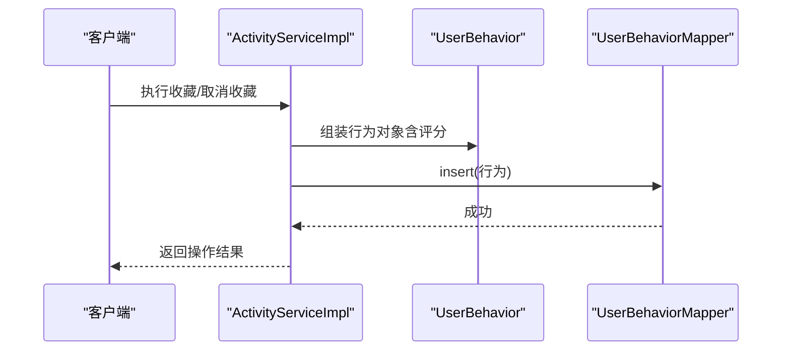
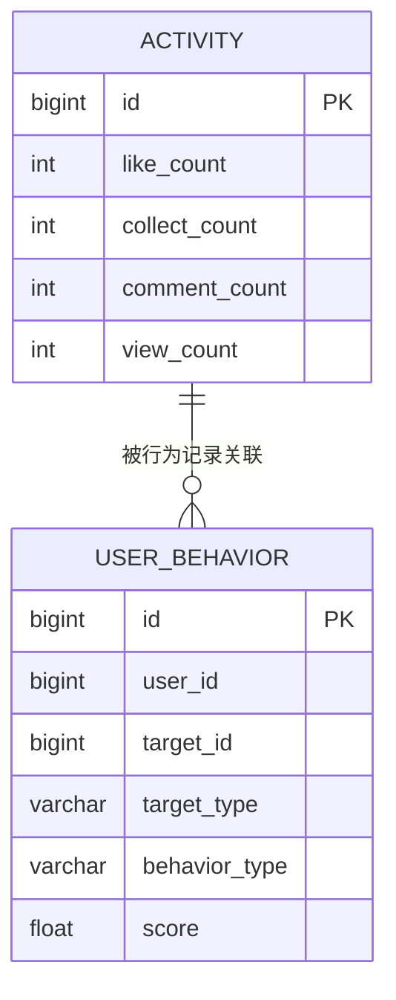
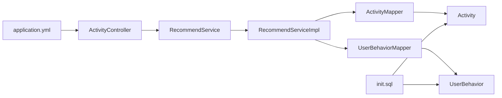

# 推荐系统

<cite>
**本文引用的文件**
- [RecommendService.java](file://campus-forum-backend/src/main/java/com/campus/forum/service/RecommendService.java)
- [RecommendServiceImpl.java](file://campus-forum-backend/src/main/java/com/campus/forum/service/impl/RecommendServiceImpl.java)
- [ActivityController.java](file://campus-forum-backend/src/main/java/com/campus/forum/controller/ActivityController.java)
- [Activity.java](file://campus-forum-backend/src/main/java/com/campus/forum/entity/Activity.java)
- [UserBehavior.java](file://campus-forum-backend/src/main/java/com/campus/forum/entity/UserBehavior.java)
- [ActivityMapper.java](file://campus-forum-backend/src/main/java/com/campus/forum/mapper/ActivityMapper.java)
- [UserBehaviorMapper.java](file://campus-forum-backend/src/main/java/com/campus/forum/mapper/UserBehaviorMapper.java)
- [ActivityServiceImpl.java](file://campus-forum-backend/src/main/java/com/campus/forum/service/impl/ActivityServiceImpl.java)
- [application.yml](file://campus-forum-backend/src/main/resources/application.yml)
- [init.sql](file://campus-forum-backend/docs/db/init.sql)
- [activity.js](file://campus-forum-backend/src/test/java/com/campus/forum/service/RecommendServiceTest.java)
</cite>

## 目录
1. [引言](#引言)
2. [项目结构](#项目结构)
3. [核心组件](#核心组件)
4. [架构总览](#架构总览)
5. [详细组件分析](#详细组件分析)
6. [依赖分析](#依赖分析)
7. [性能考虑](#性能考虑)
8. [故障排查指南](#故障排查指南)
9. [结论](#结论)
10. [附录](#附录)

## 引言
本文件面向“校园论坛”后端的推荐系统，聚焦于活动（活动）的协同过滤推荐实现，包括：
- 协同过滤算法（基于物品的 Item-based CF）原理与实现要点
- 用户行为采集与评分机制
- 相似度计算（余弦相似度）与权重分配策略
- 推荐结果排序与冷启动兜底
- 实时推荐与离线推荐的混合架构建议
- 配置参数、阈值与评估指标
- 冷启动、多样性与新颖性策略
- A/B 测试与持续优化机制

## 项目结构
推荐系统位于后端模块 campus-forum-backend 中，采用 Spring Boot + MyBatis-Plus 架构，核心文件分布如下：
- 控制层：活动控制器提供推荐接口
- 业务层：推荐服务接口与实现
- 数据访问层：活动与用户行为的 Mapper
- 实体层：活动与用户行为实体
- 配置：数据库连接、MyBatis Plus、JWT、AI 大模型等配置
- 数据库：初始化 SQL 定义了活动表与用户行为表

图表来源
- [ActivityController.java:74-81](file://campus-forum-backend/src/main/java/com/campus/forum/controller/ActivityController.java#L74-L81)
- [RecommendService.java:6-8](file://campus-forum-backend/src/main/java/com/campus/forum/service/RecommendService.java#L6-L8)
- [RecommendServiceImpl.java:36-84](file://campus-forum-backend/src/main/java/com/campus/forum/service/impl/RecommendServiceImpl.java#L36-L84)
- [ActivityMapper.java:10-21](file://campus-forum-backend/src/main/java/com/campus/forum/mapper/ActivityMapper.java#L10-L21)
- [UserBehaviorMapper.java:9-14](file://campus-forum-backend/src/main/java/com/campus/forum/mapper/UserBehaviorMapper.java#L9-L14)
- [Activity.java:10-38](file://campus-forum-backend/src/main/java/com/campus/forum/entity/Activity.java#L10-L38)
- [UserBehavior.java:7-21](file://campus-forum-backend/src/main/java/com/campus/forum/entity/UserBehavior.java#L7-L21)
- [application.yml:1-53](file://campus-forum-backend/src/main/resources/application.yml#L1-L53)
- [init.sql:55-81](file://campus-forum-backend/docs/db/init.sql#L55-L81)
- [init.sql:209-221](file://campus-forum-backend/docs/db/init.sql#L209-L221)

章节来源
- [ActivityController.java:74-81](file://campus-forum-backend/src/main/java/com/campus/forum/controller/ActivityController.java#L74-L81)
- [application.yml:1-53](file://campus-forum-backend/src/main/resources/application.yml#L1-L53)
- [init.sql:55-81](file://campus-forum-backend/docs/db/init.sql#L55-L81)
- [init.sql:209-221](file://campus-forum-backend/docs/db/init.sql#L209-L221)

## 核心组件
- 推荐服务接口与实现
  - 接口定义了对外推荐能力：根据用户 ID 返回 TopN 活动
  - 实现采用 Item-based 协同过滤，基于用户行为评分构建相似度，预测目标用户对候选活动的兴趣并排序
- 活动实体与用户行为实体
  - 活动实体包含点赞、收藏、评论、浏览等统计字段，用于相似度计算
  - 用户行为实体记录用户对活动/帖子的行为类型与评分，作为评分矩阵的基础
- Mapper 层
  - 活动 Mapper 提供热门活动查询与排除已交互活动的候选集查询
  - 用户行为 Mapper 提供按用户与目标类型筛选行为记录的能力
- 控制器
  - 活动控制器提供推荐接口，调用推荐服务并返回结果

章节来源
- [RecommendService.java:6-8](file://campus-forum-backend/src/main/java/com/campus/forum/service/RecommendService.java#L6-L8)
- [RecommendServiceImpl.java:15-31](file://campus-forum-backend/src/main/java/com/campus/forum/service/impl/RecommendServiceImpl.java#L15-L31)
- [Activity.java:10-38](file://campus-forum-backend/src/main/java/com/campus/forum/entity/Activity.java#L10-L38)
- [UserBehavior.java:7-21](file://campus-forum-backend/src/main/java/com/campus/forum/entity/UserBehavior.java#L7-L21)
- [ActivityMapper.java:10-21](file://campus-forum-backend/src/main/java/com/campus/forum/mapper/ActivityMapper.java#L10-L21)
- [UserBehaviorMapper.java:9-14](file://campus-forum-backend/src/main/java/com/campus/forum/mapper/UserBehaviorMapper.java#L9-L14)
- [ActivityController.java:74-81](file://campus-forum-backend/src/main/java/com/campus/forum/controller/ActivityController.java#L74-L81)

## 架构总览
推荐系统采用“实时推荐 + 冷启动兜底”的混合架构：
- 实时推荐：基于用户最近行为，计算活动间的相似度，预测评分并排序
- 冷启动兜底：新用户或无行为用户返回近期热门活动
- 数据来源：用户行为表与活动表，通过 MyBatis-Plus 映射

图表来源
- [ActivityController.java:74-81](file://campus-forum-backend/src/main/java/com/campus/forum/controller/ActivityController.java#L74-L81)
- [RecommendServiceImpl.java:36-84](file://campus-forum-backend/src/main/java/com/campus/forum/service/impl/RecommendServiceImpl.java#L36-L84)
- [UserBehaviorMapper.java:12-13](file://campus-forum-backend/src/main/java/com/campus/forum/mapper/UserBehaviorMapper.java#L12-L13)
- [ActivityMapper.java:13-20](file://campus-forum-backend/src/main/java/com/campus/forum/mapper/ActivityMapper.java#L13-L20)

## 详细组件分析

### 推荐服务接口与实现
- 接口职责：对外暴露 recommendActivities(userId, topN)，返回活动列表
- 实现流程：
  - 步骤1：按用户与目标类型筛选行为记录；若为空则返回热门活动兜底
  - 步骤2：聚合用户对活动的评分，得到交互集合
  - 步骤3：获取候选活动（排除已交互活动），若为空则兜底热门
  - 步骤4：对候选活动计算预测评分（基于物品相似度与用户评分加权）
  - 步骤5：按预测评分降序排序，取前 N
- 相似度计算：使用余弦相似度，向量由活动的点赞、收藏、评论计数组成
- 除零保护：当任一向量模为 0 时返回 0，避免 NaN

图表来源
- [RecommendServiceImpl.java:36-84](file://campus-forum-backend/src/main/java/com/campus/forum/service/impl/RecommendServiceImpl.java#L36-L84)

章节来源
- [RecommendService.java:6-8](file://campus-forum-backend/src/main/java/com/campus/forum/service/RecommendService.java#L6-L8)
- [RecommendServiceImpl.java:15-31](file://campus-forum-backend/src/main/java/com/campus/forum/service/impl/RecommendServiceImpl.java#L15-L31)
- [RecommendServiceImpl.java:36-84](file://campus-forum-backend/src/main/java/com/campus/forum/service/impl/RecommendServiceImpl.java#L36-L84)

### 相似度计算与权重分配
- 相似度：余弦相似度，向量维度为活动的点赞、收藏、评论计数
- 权重：用户对活动的评分作为相似度加权因子；最终预测分为加权求和与权重归一化
- 除零保护：任一向量模为 0 时相似度为 0，避免数值异常
- 评分矩阵：以用户-活动为坐标，行为类型映射到分数，形成稀疏评分矩阵

图表来源
- [RecommendServiceImpl.java:91-110](file://campus-forum-backend/src/main/java/com/campus/forum/service/impl/RecommendServiceImpl.java#L91-L110)
- [Activity.java:25-28](file://campus-forum-backend/src/main/java/com/campus/forum/entity/Activity.java#L25-L28)
- [UserBehavior.java:12-18](file://campus-forum-backend/src/main/java/com/campus/forum/entity/UserBehavior.java#L12-L18)

章节来源
- [RecommendServiceImpl.java:86-110](file://campus-forum-backend/src/main/java/com/campus/forum/service/impl/RecommendServiceImpl.java#L86-L110)
- [Activity.java:25-28](file://campus-forum-backend/src/main/java/com/campus/forum/entity/Activity.java#L25-L28)
- [UserBehavior.java:12-18](file://campus-forum-backend/src/main/java/com/campus/forum/entity/UserBehavior.java#L12-L18)

### 用户行为采集与评分机制
- 行为记录：在用户执行收藏等行为时，写入用户行为表，包含用户 ID、目标 ID、目标类型、行为类型与评分
- 评分映射：不同行为类型对应不同分数，用于构建评分矩阵
- 实时性：每次用户行为都会实时写入，确保推荐能快速响应

图表来源
- [ActivityServiceImpl.java:139-147](file://campus-forum-backend/src/main/java/com/campus/forum/service/impl/ActivityServiceImpl.java#L139-L147)
- [UserBehavior.java:12-18](file://campus-forum-backend/src/main/java/com/campus/forum/entity/UserBehavior.java#L12-L18)
- [UserBehaviorMapper.java:12-13](file://campus-forum-backend/src/main/java/com/campus/forum/mapper/UserBehaviorMapper.java#L12-L13)

章节来源
- [ActivityServiceImpl.java:139-147](file://campus-forum-backend/src/main/java/com/campus/forum/service/impl/ActivityServiceImpl.java#L139-L147)
- [UserBehavior.java:12-18](file://campus-forum-backend/src/main/java/com/campus/forum/entity/UserBehavior.java#L12-L18)
- [UserBehaviorMapper.java:12-13](file://campus-forum-backend/src/main/java/com/campus/forum/mapper/UserBehaviorMapper.java#L12-L13)

### 推荐结果排序与冷启动兜底
- 排序：按预测评分降序排列，取前 N
- 冷启动：当用户无行为记录或候选为空时，返回近期热门活动兜底

章节来源
- [RecommendServiceImpl.java:76-84](file://campus-forum-backend/src/main/java/com/campus/forum/service/impl/RecommendServiceImpl.java#L76-L84)
- [RecommendServiceImpl.java:40-44](file://campus-forum-backend/src/main/java/com/campus/forum/service/impl/RecommendServiceImpl.java#L40-L44)
- [ActivityMapper.java:13-14](file://campus-forum-backend/src/main/java/com/campus/forum/mapper/ActivityMapper.java#L13-L14)

### 数据模型与索引
- 活动表：包含点赞、收藏、评论、浏览等统计字段，用于相似度计算
- 用户行为表：记录用户对活动/帖子的行为与评分，支撑协同过滤

图表来源
- [Activity.java:25-28](file://campus-forum-backend/src/main/java/com/campus/forum/entity/Activity.java#L25-L28)
- [init.sql:55-81](file://campus-forum-backend/docs/db/init.sql#L55-L81)
- [init.sql:209-221](file://campus-forum-backend/docs/db/init.sql#L209-L221)

章节来源
- [Activity.java:25-28](file://campus-forum-backend/src/main/java/com/campus/forum/entity/Activity.java#L25-L28)
- [init.sql:55-81](file://campus-forum-backend/docs/db/init.sql#L55-L81)
- [init.sql:209-221](file://campus-forum-backend/docs/db/init.sql#L209-L221)

## 依赖分析
- 控制器依赖推荐服务接口，实现解耦
- 推荐实现依赖活动与用户行为 Mapper，进行数据查询
- 实体层提供数据结构，支撑相似度与评分计算
- 配置文件提供数据库连接与 MyBatis Plus 设置

图表来源
- [ActivityController.java:74-81](file://campus-forum-backend/src/main/java/com/campus/forum/controller/ActivityController.java#L74-L81)
- [RecommendServiceImpl.java:33-34](file://campus-forum-backend/src/main/java/com/campus/forum/service/impl/RecommendServiceImpl.java#L33-L34)
- [ActivityMapper.java:10-21](file://campus-forum-backend/src/main/java/com/campus/forum/mapper/ActivityMapper.java#L10-L21)
- [UserBehaviorMapper.java:9-14](file://campus-forum-backend/src/main/java/com/campus/forum/mapper/UserBehaviorMapper.java#L9-L14)
- [application.yml:1-53](file://campus-forum-backend/src/main/resources/application.yml#L1-L53)
- [init.sql:55-81](file://campus-forum-backend/docs/db/init.sql#L55-L81)
- [init.sql:209-221](file://campus-forum-backend/docs/db/init.sql#L209-L221)

章节来源
- [ActivityController.java:74-81](file://campus-forum-backend/src/main/java/com/campus/forum/controller/ActivityController.java#L74-L81)
- [RecommendServiceImpl.java:33-34](file://campus-forum-backend/src/main/java/com/campus/forum/service/impl/RecommendServiceImpl.java#L33-L34)
- [ActivityMapper.java:10-21](file://campus-forum-backend/src/main/java/com/campus/forum/mapper/ActivityMapper.java#L10-L21)
- [UserBehaviorMapper.java:9-14](file://campus-forum-backend/src/main/java/com/campus/forum/mapper/UserBehaviorMapper.java#L9-L14)
- [application.yml:1-53](file://campus-forum-backend/src/main/resources/application.yml#L1-L53)
- [init.sql:55-81](file://campus-forum-backend/docs/db/init.sql#L55-L81)
- [init.sql:209-221](file://campus-forum-backend/docs/db/init.sql#L209-L221)

## 性能考虑
- 相似度计算复杂度：对每个候选活动遍历用户交互过的活动，整体约为 O(N_candidates × N_interactions)
- 候选集规模：通过扩大候选倍数降低漏推荐风险，但需平衡性能
- 缓存策略（建议）：缓存热门活动列表与常用相似度，减少数据库与重复计算
- 并行化：候选评分计算可并行化，进一步提升吞吐
- 数据库索引：user_behavior 的复合索引有助于按用户与目标类型快速检索

## 故障排查指南
- 无推荐结果
  - 检查用户是否存在行为记录；若无则走热门兜底逻辑
  - 检查候选集查询是否返回空；若空则兜底热门
- 相似度异常
  - 确认活动统计字段非空且合理
  - 检查除零保护逻辑是否生效
- 单元测试验证
  - 冷启动兜底场景与有行为场景均覆盖

章节来源
- [RecommendServiceImpl.java:40-44](file://campus-forum-backend/src/main/java/com/campus/forum/service/impl/RecommendServiceImpl.java#L40-L44)
- [RecommendServiceImpl.java:54-57](file://campus-forum-backend/src/main/java/com/campus/forum/service/impl/RecommendServiceImpl.java#L54-L57)
- [RecommendServiceImpl.java:107-109](file://campus-forum-backend/src/main/java/com/campus/forum/service/impl/RecommendServiceImpl.java#L107-L109)
- [RecommendServiceTest.java:40-53](file://campus-forum-backend/src/test/java/com/campus/forum/service/RecommendServiceTest.java#L40-L53)
- [RecommendServiceTest.java:58-79](file://campus-forum-backend/src/test/java/com/campus/forum/service/RecommendServiceTest.java#L58-L79)

## 结论
该推荐系统以 Item-based 协同过滤为核心，结合用户行为评分与活动统计特征，实现了从行为到兴趣的建模，并通过热门兜底保障冷启动体验。后续可在缓存、并行化与特征工程方面进一步优化，并引入离线特征与更丰富的相似度度量以提升效果。

## 附录

### 推荐系统配置参数与阈值
- 推荐数量：接口参数 size 控制返回条数
- 热门活动阈值：按浏览与点赞排序取前 N
- 相似度阈值：当前实现未设置显式阈值，建议在生产环境增加最小相似度阈值与最小共同交互用户数约束
- 评分阈值：当前未设置显式阈值，建议在排序前增加最小评分阈值

章节来源
- [ActivityController.java:78](file://campus-forum-backend/src/main/java/com/campus/forum/controller/ActivityController.java#L78)
- [ActivityMapper.java:13](file://campus-forum-backend/src/main/java/com/campus/forum/mapper/ActivityMapper.java#L13)
- [RecommendServiceImpl.java:86-110](file://campus-forum-backend/src/main/java/com/campus/forum/service/impl/RecommendServiceImpl.java#L86-L110)

### 效果评估指标
- 离线评估（基于历史行为）
  - 准确率/召回率：通过回测历史行为，比较命中与期望集合
  - 覆盖率：推荐列表覆盖的活动比例
  - 多样性：基于相似度矩阵的群体多样性度量
  - 新颖性：基于流行度分布的推荐新颖度
- 在线评估（A/B 测试）
  - 曝光/点击转化率（CTR）、参与转化率（如收藏/报名）
  - 用户留存与活跃度变化
  - 任务完成率（如完成一次完整浏览/报名）

### 冷启动、多样性与新颖性策略
- 冷启动
  - 新用户：返回热门活动兜底
  - 新活动：基于内容特征与标签匹配，或引入热门榜
- 多样性
  - 在候选阶段引入版块/类型多样性采样
  - 在排序阶段加入多样性惩罚项
- 新颖性
  - 降低热门活动权重，提高低流行度活动曝光
  - 引入探索性采样与随机性注入

### A/B 测试框架与持续优化
- 分流策略：按用户 ID 或会话 ID 进行随机分流
- 指标收集：埋点记录曝光、点击、收藏、报名等事件
- 实验周期：设定最小实验周期与统计显著性阈值
- 持续优化：基于在线指标反馈迭代相似度计算、权重与排序策略