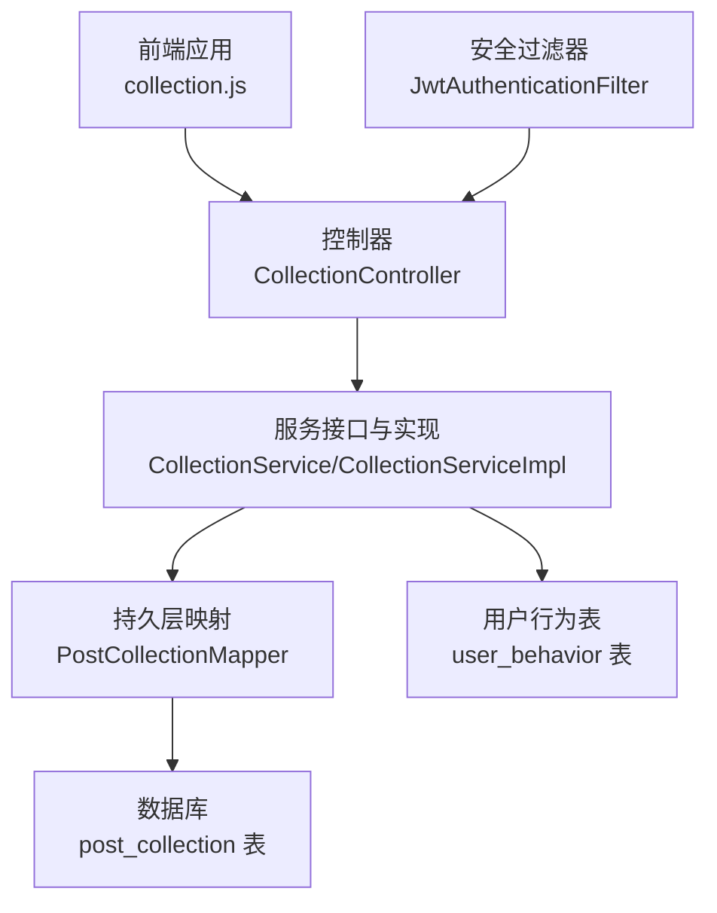
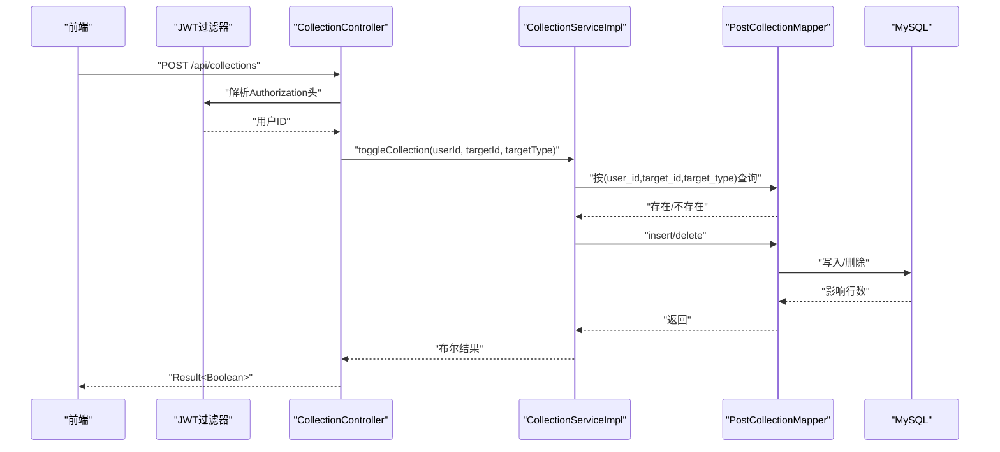
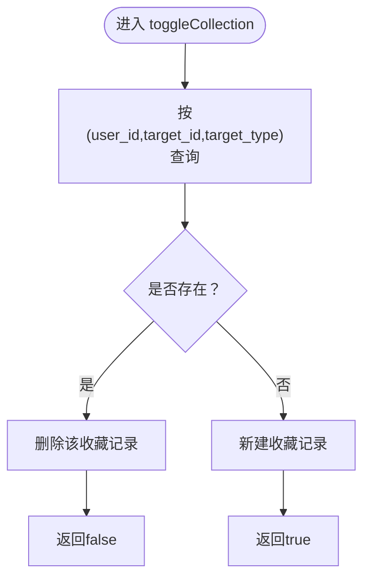
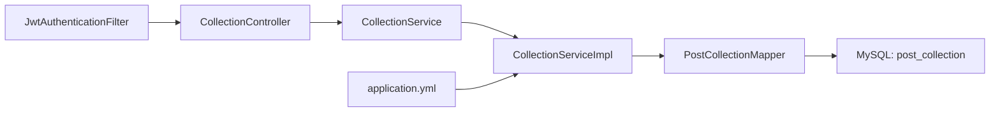

# 收藏系统

<cite>
**本文引用的文件**
- [CollectionController.java](file://campus-forum-backend/src/main/java/com/campus/forum/controller/CollectionController.java)
- [CollectionService.java](file://campus-forum-backend/src/main/java/com/campus/forum/service/CollectionService.java)
- [CollectionServiceImpl.java](file://campus-forum-backend/src/main/java/com/campus/forum/service/impl/CollectionServiceImpl.java)
- [PostCollectionMapper.java](file://campus-forum-backend/src/main/java/com/campus/forum/mapper/PostCollectionMapper.java)
- [PostCollection.java](file://campus-forum-backend/src/main/java/com/campus/forum/entity/PostCollection.java)
- [init.sql](file://campus-forum-backend/docs/db/init.sql)
- [application.yml](file://campus-forum-backend/src/main/resources/application.yml)
- [JwtAuthenticationFilter.java](file://campus-forum-backend/src/main/java/com/campus/forum/security/JwtAuthenticationFilter.java)
- [collection.js](file://campus-forum-frontend/src/api/collection.js)
- [RecommendServiceImpl.java](file://campus-forum-backend/src/main/java/com/campus/forum/service/impl/RecommendServiceImpl.java)
</cite>

## 目录
1. [引言](#引言)
2. [项目结构](#项目结构)
3. [核心组件](#核心组件)
4. [架构总览](#架构总览)
5. [详细组件分析](#详细组件分析)
6. [依赖分析](#依赖分析)
7. [性能考虑](#性能考虑)
8. [故障排查指南](#故障排查指南)
9. [结论](#结论)
10. [附录](#附录)

## 引言
本文件围绕“收藏系统”进行系统化技术文档整理，覆盖收藏夹管理、内容分类与标签体系、原子性与并发控制、数据一致性、去重策略、批量与导入导出能力现状、统计与推荐增强、API 接口定义、权限与隐私控制、以及缓存与性能优化建议。本文所有技术结论均来自仓库现有源码与数据库脚本。

## 项目结构
后端采用 Spring Boot + MyBatis-Plus 架构，收藏模块位于 controller → service → mapper → entity 的标准分层；数据库脚本中包含统一的收藏表与用户行为表，为后续统计与推荐提供基础。

图表来源
- [CollectionController.java:1-67](file://campus-forum-backend/src/main/java/com/campus/forum/controller/CollectionController.java#L1-L67)
- [CollectionServiceImpl.java:1-56](file://campus-forum-backend/src/main/java/com/campus/forum/service/impl/CollectionServiceImpl.java#L1-L56)
- [PostCollectionMapper.java:1-16](file://campus-forum-backend/src/main/java/com/campus/forum/mapper/PostCollectionMapper.java#L1-L16)
- [init.sql:155-163](file://campus-forum-backend/docs/db/init.sql#L155-L163)
- [JwtAuthenticationFilter.java:1-59](file://campus-forum-backend/src/main/java/com/campus/forum/security/JwtAuthenticationFilter.java#L1-L59)

章节来源
- [CollectionController.java:1-67](file://campus-forum-backend/src/main/java/com/campus/forum/controller/CollectionController.java#L1-L67)
- [CollectionServiceImpl.java:1-56](file://campus-forum-backend/src/main/java/com/campus/forum/service/impl/CollectionServiceImpl.java#L1-L56)
- [PostCollectionMapper.java:1-16](file://campus-forum-backend/src/main/java/com/campus/forum/mapper/PostCollectionMapper.java#L1-L16)
- [init.sql:155-163](file://campus-forum-backend/docs/db/init.sql#L155-L163)
- [JwtAuthenticationFilter.java:1-59](file://campus-forum-backend/src/main/java/com/campus/forum/security/JwtAuthenticationFilter.java#L1-L59)

## 核心组件
- 控制器层：提供收藏切换、我的收藏列表、检查是否收藏、取消收藏等接口。
- 服务层：封装收藏业务逻辑，包括收藏切换、分页查询、存在性判断。
- 持久层：基于 MyBatis-Plus 的通用 Mapper，补充自定义 SQL 用于存在性检查与删除。
- 实体层：统一的收藏实体，包含用户 ID、目标 ID、目标类型与创建时间。
- 安全层：基于 JWT 的认证过滤器，从请求中提取用户身份。
- 数据库：收藏表采用复合主键，确保同一用户对同一目标类型的收藏唯一性；用户行为表为推荐系统提供基础。

章节来源
- [CollectionController.java:25-65](file://campus-forum-backend/src/main/java/com/campus/forum/controller/CollectionController.java#L25-L65)
- [CollectionService.java:6-10](file://campus-forum-backend/src/main/java/com/campus/forum/service/CollectionService.java#L6-L10)
- [CollectionServiceImpl.java:17-54](file://campus-forum-backend/src/main/java/com/campus/forum/service/impl/CollectionServiceImpl.java#L17-L54)
- [PostCollectionMapper.java:10-14](file://campus-forum-backend/src/main/java/com/campus/forum/mapper/PostCollectionMapper.java#L10-L14)
- [PostCollection.java:9-15](file://campus-forum-backend/src/main/java/com/campus/forum/entity/PostCollection.java#L9-L15)
- [JwtAuthenticationFilter.java:34-43](file://campus-forum-backend/src/main/java/com/campus/forum/security/JwtAuthenticationFilter.java#L34-L43)
- [init.sql:155-163](file://campus-forum-backend/docs/db/init.sql#L155-L163)

## 架构总览
收藏模块遵循典型的 MVC 分层与安全过滤链路，前端通过 HTTP API 调用后端控制器，控制器解析 JWT 提取用户 ID，调用服务层执行收藏业务，服务层通过 Mapper 访问数据库，最终返回结果。

图表来源
- [CollectionController.java:27-33](file://campus-forum-backend/src/main/java/com/campus/forum/controller/CollectionController.java#L27-L33)
- [CollectionServiceImpl.java:18-35](file://campus-forum-backend/src/main/java/com/campus/forum/service/impl/CollectionServiceImpl.java#L18-L35)
- [PostCollectionMapper.java:10-14](file://campus-forum-backend/src/main/java/com/campus/forum/mapper/PostCollectionMapper.java#L10-L14)
- [JwtAuthenticationFilter.java:34-43](file://campus-forum-backend/src/main/java/com/campus/forum/security/JwtAuthenticationFilter.java#L34-L43)

## 详细组件分析

### 收藏实体与表结构
- 实体字段：用户 ID、目标 ID、目标类型（如 post/activity）、创建时间。
- 表结构：采用复合主键 (user_id, target_id, target_type)，天然保证同一用户对同一目标类型的收藏唯一性，实现去重。
- 目标类型扩展：实体注释明确支持 post/activity，便于未来扩展其他类型。

章节来源
- [PostCollection.java:9-15](file://campus-forum-backend/src/main/java/com/campus/forum/entity/PostCollection.java#L9-L15)
- [init.sql:155-163](file://campus-forum-backend/docs/db/init.sql#L155-L163)

### 收藏服务与业务流程
- 收藏切换：先查重，存在则删除，不存在则新增，返回布尔值表示本次操作后的收藏状态。
- 分页查询：支持按用户 ID 查询，并可按目标类型筛选，按创建时间倒序。
- 存在性检查：基于复合条件计数查询，快速判断是否已收藏。

图表来源
- [CollectionServiceImpl.java:18-35](file://campus-forum-backend/src/main/java/com/campus/forum/service/impl/CollectionServiceImpl.java#L18-L35)

章节来源
- [CollectionServiceImpl.java:17-54](file://campus-forum-backend/src/main/java/com/campus/forum/service/impl/CollectionServiceImpl.java#L17-L54)

### 控制器接口与权限
- 接口概览：
  - POST /api/collections：收藏/取消收藏
  - GET /api/collections/my：我的收藏列表（支持分页与类型筛选）
  - GET /api/collections/check：检查是否已收藏
  - DELETE /api/collections/{targetId}：取消收藏（需携带 targetType）
- 权限控制：控制器内部通过 JWT 过滤器解析 Authorization 头，提取用户 ID，从而实现基于令牌的身份校验。

章节来源
- [CollectionController.java:25-65](file://campus-forum-backend/src/main/java/com/campus/forum/controller/CollectionController.java#L25-L65)
- [JwtAuthenticationFilter.java:34-43](file://campus-forum-backend/src/main/java/com/campus/forum/security/JwtAuthenticationFilter.java#L34-L43)

### 前端集成
- 前端通过 collection.js 封装四个常用接口：收藏/取消收藏、查询我的收藏、检查是否收藏、取消收藏。
- 建议：前端在调用前确保已登录并携带有效令牌，后端将基于令牌解析用户身份。

章节来源
- [collection.js:1-6](file://campus-forum-frontend/src/api/collection.js#L1-L6)

### 统计与推荐增强
- 用户行为表：提供用户对内容的行为记录（含收藏），为后续统计分析与推荐算法提供数据基础。
- 推荐服务：基于用户行为的协同过滤（Item-based CF），对活动进行推荐；若用户无行为，则兜底返回热门活动。

章节来源
- [init.sql:209-221](file://campus-forum-backend/docs/db/init.sql#L209-L221)
- [RecommendServiceImpl.java:36-84](file://campus-forum-backend/src/main/java/com/campus/forum/service/impl/RecommendServiceImpl.java#L36-L84)

## 依赖分析
- 控制器依赖服务接口，服务实现依赖 Mapper，Mapper 依赖数据库表。
- 安全过滤器在控制器之前生效，确保所有收藏接口均受身份验证保护。
- 应用配置文件提供数据库连接与 MyBatis-Plus 相关参数。

图表来源
- [CollectionController.java:22-23](file://campus-forum-backend/src/main/java/com/campus/forum/controller/CollectionController.java#L22-L23)
- [CollectionServiceImpl.java:15](file://campus-forum-backend/src/main/java/com/campus/forum/service/impl/CollectionServiceImpl.java#L15)
- [PostCollectionMapper.java:8](file://campus-forum-backend/src/main/java/com/campus/forum/mapper/PostCollectionMapper.java#L8)
- [JwtAuthenticationFilter.java:27-28](file://campus-forum-backend/src/main/java/com/campus/forum/security/JwtAuthenticationFilter.java#L27-L28)
- [application.yml:9-28](file://campus-forum-backend/src/main/resources/application.yml#L9-L28)

章节来源
- [CollectionController.java:22-23](file://campus-forum-backend/src/main/java/com/campus/forum/controller/CollectionController.java#L22-L23)
- [CollectionServiceImpl.java:15](file://campus-forum-backend/src/main/java/com/campus/forum/service/impl/CollectionServiceImpl.java#L15)
- [PostCollectionMapper.java:8](file://campus-forum-backend/src/main/java/com/campus/forum/mapper/PostCollectionMapper.java#L8)
- [JwtAuthenticationFilter.java:27-28](file://campus-forum-backend/src/main/java/com/campus/forum/security/JwtAuthenticationFilter.java#L27-L28)
- [application.yml:9-28](file://campus-forum-backend/src/main/resources/application.yml#L9-L28)

## 性能考虑
- 去重与索引：收藏表使用复合主键，避免重复插入，减少存储冗余。
- 查询优化：服务层使用 LambdaQueryWrapper 构造精确条件，配合数据库索引提升命中率。
- 分页与排序：分页查询按创建时间倒序，满足“最新收藏优先”的常见需求。
- 批量与导入导出：当前未发现批量导入/导出接口或实现，建议后续引入批量写入与导出功能以提升效率。
- 缓存策略：当前未见缓存层实现，可在热点用户收藏列表与热门内容上引入 Redis 缓存，降低数据库压力。

章节来源
- [init.sql:162](file://campus-forum-backend/docs/db/init.sql#L162)
- [CollectionServiceImpl.java:38-44](file://campus-forum-backend/src/main/java/com/campus/forum/service/impl/CollectionServiceImpl.java#L38-L44)

## 故障排查指南
- 401 未授权：确认前端请求头携带有效的 Authorization Bearer 令牌，且令牌未过期。
- 404/400 参数错误：检查请求参数 targetId、targetType 是否正确传递。
- 并发冲突：当前 toggle 流程为“查询-判断-插入/删除”，非数据库级原子操作，可能出现并发竞态。建议在数据库层面使用“唯一约束+异常回滚”或“INSERT ... ON DUPLICATE KEY UPDATE”策略，确保原子性与一致性。
- 重复收藏：由于表级复合主键的存在，不会出现重复记录；若出现异常，检查是否绕过了服务层或手动插入。

章节来源
- [CollectionController.java:27-33](file://campus-forum-backend/src/main/java/com/campus/forum/controller/CollectionController.java#L27-L33)
- [CollectionServiceImpl.java:18-35](file://campus-forum-backend/src/main/java/com/campus/forum/service/impl/CollectionServiceImpl.java#L18-L35)
- [init.sql:162](file://campus-forum-backend/docs/db/init.sql#L162)

## 结论
收藏系统以简洁的实体与表结构为基础，通过服务层的“查重-插入/删除”模式实现收藏切换，并由 JWT 过滤器保障接口访问安全。当前实现具备良好的去重与分页能力，但缺少批量与导入导出接口、缓存层与数据库级原子性保障。建议后续引入数据库级原子写入、Redis 缓存与批量操作能力，并结合用户行为表完善统计与推荐。

## 附录

### 收藏 API 接口文档
- 收藏/取消收藏
  - 方法与路径：POST /api/collections
  - 请求体字段：targetId（目标ID）、targetType（目标类型，如 post/activity）
  - 返回：布尔值，表示当前是否已收藏
  - 认证：需要 Authorization Bearer 令牌
- 我的收藏列表
  - 方法与路径：GET /api/collections/my
  - 查询参数：targetType（可选，按类型筛选）、page（页码，默认1）、size（每页条数，默认10）
  - 返回：分页结果，包含收藏记录列表
  - 认证：需要 Authorization Bearer 令牌
- 检查是否已收藏
  - 方法与路径：GET /api/collections/check
  - 查询参数：targetId、targetType
  - 返回：布尔值
  - 认证：需要 Authorization Bearer 令牌
- 取消收藏
  - 方法与路径：DELETE /api/collections/{targetId}
  - 路径参数：targetId
  - 查询参数：targetType
  - 返回：成功
  - 认证：需要 Authorization Bearer 令牌

章节来源
- [CollectionController.java:25-65](file://campus-forum-backend/src/main/java/com/campus/forum/controller/CollectionController.java#L25-L65)
- [collection.js:2-5](file://campus-forum-frontend/src/api/collection.js#L2-L5)

### 权限控制、隐私与共享
- 权限控制：通过 JWT 过滤器在控制器层解析用户身份，所有收藏接口均受保护。
- 隐私设置：当前未见针对收藏可见性的细粒度隐私控制，建议在实体中增加 visibility 字段并在查询时加入可见性过滤。
- 共享机制：未发现公开分享收藏列表的能力，建议后续提供“公开书签”或“导出清单”等能力。

章节来源
- [JwtAuthenticationFilter.java:34-43](file://campus-forum-backend/src/main/java/com/campus/forum/security/JwtAuthenticationFilter.java#L34-L43)

### 统计分析与推荐增强
- 统计分析：可基于 user_behavior 表统计用户收藏行为分布、热门内容特征等。
- 推荐增强：结合收藏、点赞、评论等多维行为，完善 Item-based CF 或引入基于内容的混合推荐。

章节来源
- [init.sql:209-221](file://campus-forum-backend/docs/db/init.sql#L209-L221)
- [RecommendServiceImpl.java:36-84](file://campus-forum-backend/src/main/java/com/campus/forum/service/impl/RecommendServiceImpl.java#L36-L84)