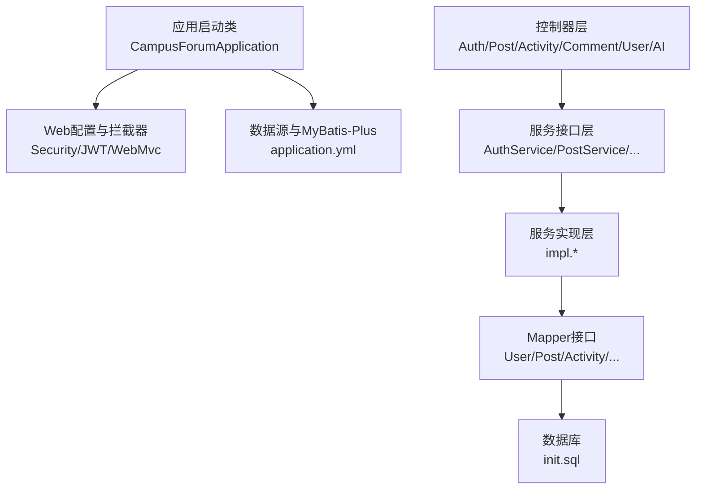
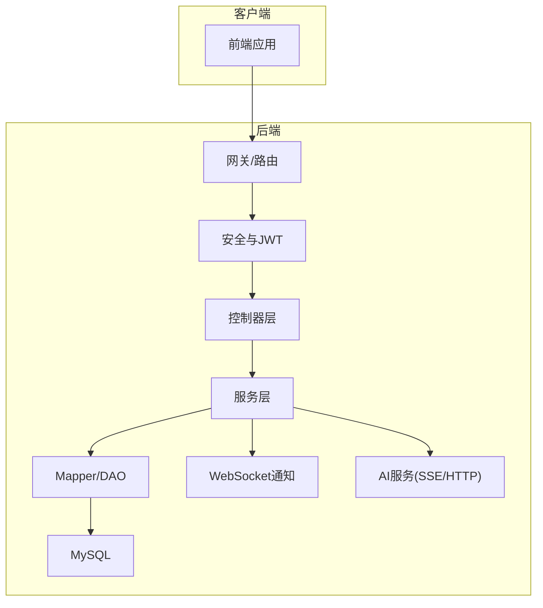
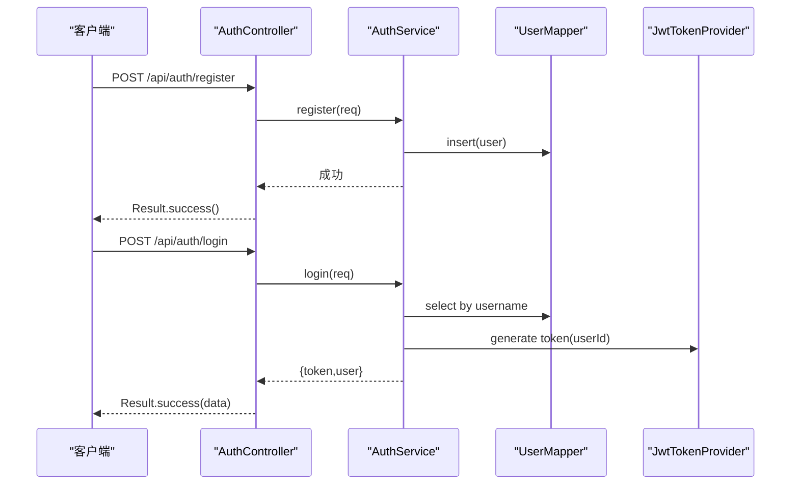
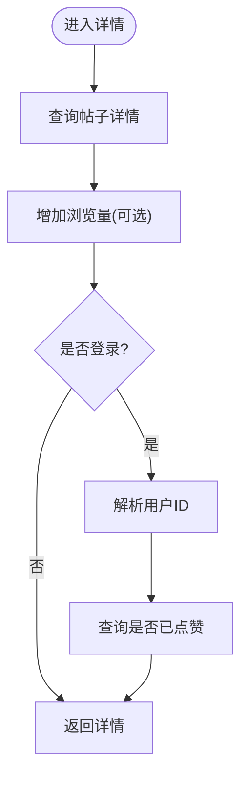
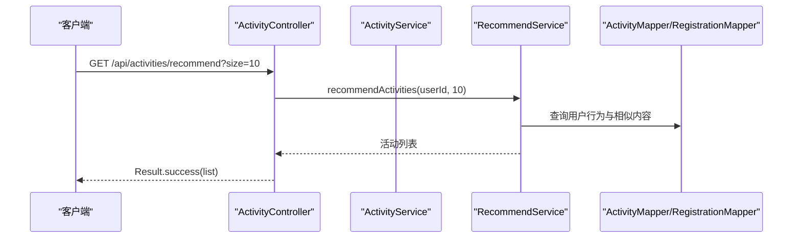
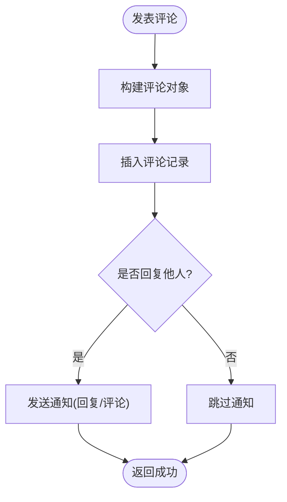
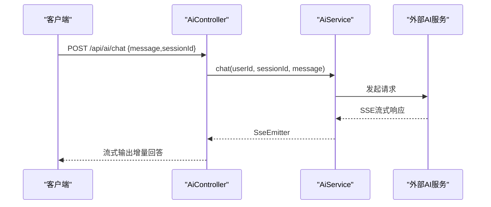
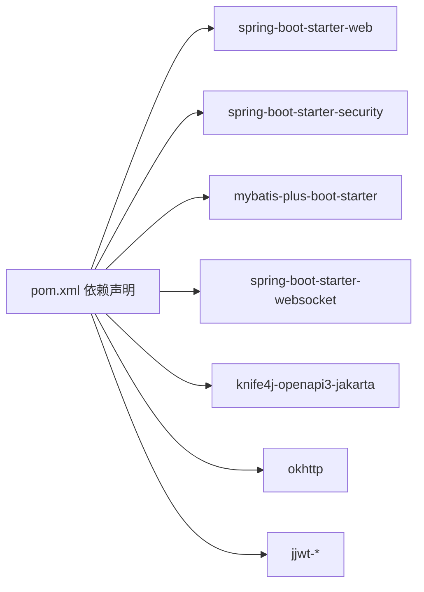
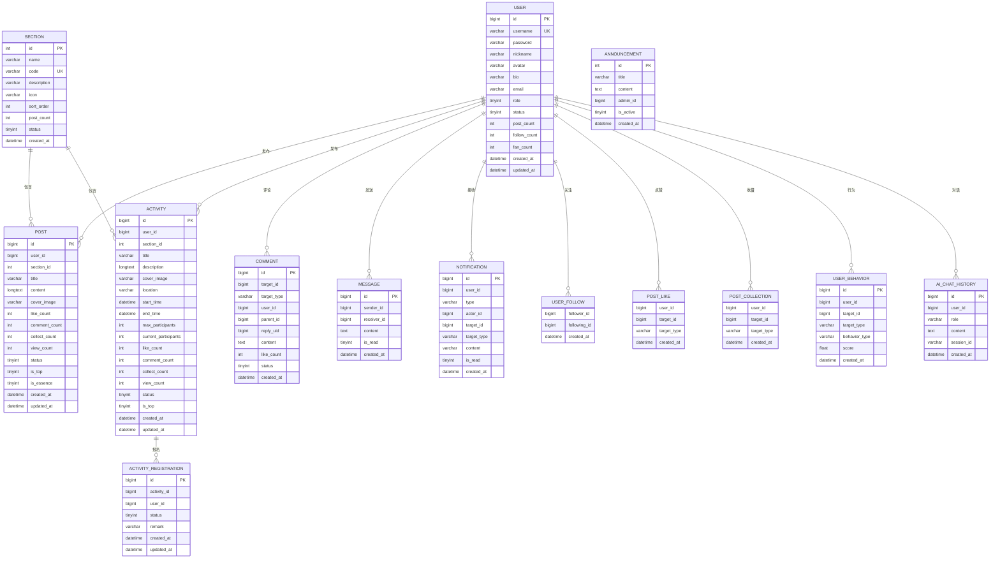

# 核心功能模块

<cite>
**本文引用的文件**
- [CampusForumApplication.java](file://campus-forum-backend/src/main/java/com/campus/forum/CampusForumApplication.java)
- [application.yml](file://campus-forum-backend/src/main/resources/application.yml)
- [pom.xml](file://campus-forum-backend/pom.xml)
- [init.sql](file://campus-forum-backend/docs/db/init.sql)
- [AuthController.java](file://campus-forum-backend/src/main/java/com/campus/forum/controller/AuthController.java)
- [PostController.java](file://campus-forum-backend/src/main/java/com/campus/forum/controller/PostController.java)
- [ActivityController.java](file://campus-forum-backend/src/main/java/com/campus/forum/controller/ActivityController.java)
- [CommentController.java](file://campus-forum-backend/src/main/java/com/campus/forum/controller/CommentController.java)
- [UserController.java](file://campus-forum-backend/src/main/java/com/campus/forum/controller/UserController.java)
- [AiController.java](file://campus-forum-backend/src/main/java/com/campus/forum/controller/AiController.java)
- [AuthService.java](file://campus-forum-backend/src/main/java/com/campus/forum/service/AuthService.java)
- [PostService.java](file://campus-forum-backend/src/main/java/com/campus/forum/service/PostService.java)
- [ActivityService.java](file://campus-forum-backend/src/main/java/com/campus/forum/service/ActivityService.java)
- [RecommendService.java](file://campus-forum-backend/src/main/java/com/campus/forum/service/RecommendService.java)
- [User.java](file://campus-forum-backend/src/main/java/com/campus/forum/entity/User.java)
- [Post.java](file://campus-forum-backend/src/main/java/com/campus/forum/entity/Post.java)
</cite>

## 目录
1. [引言](#引言)
2. [项目结构](#项目结构)
3. [核心组件](#核心组件)
4. [架构总览](#架构总览)
5. [详细组件分析](#详细组件分析)
6. [依赖分析](#依赖分析)
7. [性能考虑](#性能考虑)
8. [故障排查指南](#故障排查指南)
9. [结论](#结论)
10. [附录](#附录)

## 引言
本文件面向PBL项目的后端核心功能模块，围绕用户认证、帖子管理、活动管理、评论互动、私信聊天、AI智能助手、推荐系统等主要业务，系统性阐述其业务流程、数据模型设计、API接口规范、模块间依赖关系、权限控制机制与数据一致性保障，并提供扩展与优化建议。

## 项目结构
后端采用Spring Boot + MyBatis-Plus架构，按“控制器-服务-持久层-实体-配置”的层次化组织；数据库初始化脚本覆盖用户、版块、活动、帖子、评论、点赞、收藏、关注、私信、通知、用户行为、公告、AI对话历史等完整业务表。

图表来源
- [CampusForumApplication.java:1-17](file://campus-forum-backend/src/main/java/com/campus/forum/CampusForumApplication.java#L1-L17)
- [application.yml:1-53](file://campus-forum-backend/src/main/resources/application.yml#L1-L53)
- [init.sql:1-257](file://campus-forum-backend/docs/db/init.sql#L1-L257)

章节来源
- [CampusForumApplication.java:1-17](file://campus-forum-backend/src/main/java/com/campus/forum/CampusForumApplication.java#L1-L17)
- [application.yml:1-53](file://campus-forum-backend/src/main/resources/application.yml#L1-L53)
- [pom.xml:1-136](file://campus-forum-backend/pom.xml#L1-L136)
- [init.sql:1-257](file://campus-forum-backend/docs/db/init.sql#L1-L257)

## 核心组件
- 用户认证与安全：基于JWT的登录注册、请求鉴权、权限控制。
- 帖子管理：分页列表、详情、发布、删除、点赞。
- 活动管理：分页列表、详情、发布、点赞/收藏、推荐。
- 评论互动：评论树、回复、点赞、通知联动。
- 私信聊天：消息收发、已读标记。
- AI智能助手：SSE流式对话、活动简介生成、内容审核辅助、历史查询。
- 推荐系统：基于用户行为的协同过滤推荐。
- 通知系统：点赞、评论、回复、关注、系统事件等通知推送。
- 管理后台：管理员可对用户、帖子、活动、版块、公告进行管理。

章节来源
- [AuthController.java:1-39](file://campus-forum-backend/src/main/java/com/campus/forum/controller/AuthController.java#L1-L39)
- [PostController.java:1-65](file://campus-forum-backend/src/main/java/com/campus/forum/controller/PostController.java#L1-L65)
- [ActivityController.java:1-83](file://campus-forum-backend/src/main/java/com/campus/forum/controller/ActivityController.java#L1-L83)
- [CommentController.java:1-115](file://campus-forum-backend/src/main/java/com/campus/forum/controller/CommentController.java#L1-L115)
- [AiController.java:1-74](file://campus-forum-backend/src/main/java/com/campus/forum/controller/AiController.java#L1-L74)
- [RecommendService.java:1-9](file://campus-forum-backend/src/main/java/com/campus/forum/service/RecommendService.java#L1-L9)

## 架构总览
后端以REST接口为核心，配合JWT完成认证授权；服务层负责业务编排，持久层通过MyBatis-Plus访问数据库；AI模块通过外部大模型服务提供能力；WebSocket用于通知实时推送；Knife4j提供在线接口文档。

图表来源
- [application.yml:30-46](file://campus-forum-backend/src/main/resources/application.yml#L30-L46)
- [pom.xml:27-91](file://campus-forum-backend/pom.xml#L27-L91)

## 详细组件分析

### 用户认证系统
- 功能要点
  - 注册：校验参数，保存用户信息。
  - 登录：校验凭据，签发JWT令牌。
  - 权限：基于JWT在控制器中解析用户ID，执行资源访问控制。
- 数据模型
  - 用户实体包含角色与状态字段，支撑管理员与封禁控制。
- API规范
  - POST /api/auth/register：注册请求体包含用户名、密码、昵称等。
  - POST /api/auth/login：登录请求体包含账号与密码，返回令牌与用户信息。
- 安全与一致性
  - 密码经BCrypt加密存储；JWT过期时间配置于配置文件；逻辑删除字段统一管理。
- 扩展建议
  - 引入验证码、登录失败次数限制、多设备登录策略、刷新令牌等。

图表来源
- [AuthController.java:26-37](file://campus-forum-backend/src/main/java/com/campus/forum/controller/AuthController.java#L26-L37)
- [AuthService.java:8-11](file://campus-forum-backend/src/main/java/com/campus/forum/service/AuthService.java#L8-L11)
- [User.java:10-32](file://campus-forum-backend/src/main/java/com/campus/forum/entity/User.java#L10-L32)

章节来源
- [AuthController.java:1-39](file://campus-forum-backend/src/main/java/com/campus/forum/controller/AuthController.java#L1-L39)
- [AuthService.java:1-12](file://campus-forum-backend/src/main/java/com/campus/forum/service/AuthService.java#L1-L12)
- [User.java:1-33](file://campus-forum-backend/src/main/java/com/campus/forum/entity/User.java#L1-L33)
- [application.yml:30-34](file://campus-forum-backend/src/main/resources/application.yml#L30-L34)

### 帖子管理
- 功能要点
  - 列表：分页、版块筛选、关键词搜索。
  - 详情：记录浏览量、根据登录用户判断是否点赞/收藏。
  - 发布：校验请求体，写入帖子与统计字段。
  - 删除：仅作者可删。
  - 点赞：幂等切换。
- 数据模型
  - 帖子实体包含状态、置顶、加精、计数字段，支持软删除与逻辑删除字段配置。
- API规范
  - GET /api/posts?sectionId=&keyword=&page=&size=
  - GET /api/posts/{id}
  - POST /api/posts
  - DELETE /api/posts/{id}
  - POST /api/posts/{id}/like
- 一致性与性能
  - 点赞/收藏/评论计数更新需事务保证；索引覆盖查询条件。

图表来源
- [PostController.java:35-40](file://campus-forum-backend/src/main/java/com/campus/forum/controller/PostController.java#L35-L40)
- [PostService.java:7-13](file://campus-forum-backend/src/main/java/com/campus/forum/service/PostService.java#L7-L13)
- [Post.java:10-34](file://campus-forum-backend/src/main/java/com/campus/forum/entity/Post.java#L10-L34)

章节来源
- [PostController.java:1-65](file://campus-forum-backend/src/main/java/com/campus/forum/controller/PostController.java#L1-L65)
- [PostService.java:1-14](file://campus-forum-backend/src/main/java/com/campus/forum/service/PostService.java#L1-L14)
- [Post.java:1-35](file://campus-forum-backend/src/main/java/com/campus/forum/entity/Post.java#L1-L35)
- [application.yml:23-25](file://campus-forum-backend/src/main/resources/application.yml#L23-L25)

### 活动管理
- 功能要点
  - 列表：分页、版块、状态、关键词筛选。
  - 详情：记录浏览量、根据登录用户判断是否点赞/收藏。
  - 发布：校验请求体，写入活动与统计字段。
  - 点赞/收藏：幂等切换。
  - 协同过滤推荐：基于用户行为计算相似度。
- 数据模型
  - 活动实体包含状态、置顶、计数字段；报名表支持唯一约束防止重复报名。
- API规范
  - GET /api/activities?sectionId=&status=&keyword=&page=&size=
  - GET /api/activities/{id}
  - POST /api/activities
  - POST /api/activities/{id}/like
  - POST /api/activities/{id}/collect
  - GET /api/activities/recommend?size=

图表来源
- [ActivityController.java:74-81](file://campus-forum-backend/src/main/java/com/campus/forum/controller/ActivityController.java#L74-L81)
- [RecommendService.java:6-8](file://campus-forum-backend/src/main/java/com/campus/forum/service/RecommendService.java#L6-L8)

章节来源
- [ActivityController.java:1-83](file://campus-forum-backend/src/main/java/com/campus/forum/controller/ActivityController.java#L1-L83)
- [ActivityService.java:1-14](file://campus-forum-backend/src/main/java/com/campus/forum/service/ActivityService.java#L1-L14)
- [RecommendService.java:1-9](file://campus-forum-backend/src/main/java/com/campus/forum/service/RecommendService.java#L1-L9)

### 评论互动
- 功能要点
  - 评论树：支持一级评论与回复，递归加载。
  - 发表：区分评论与回复，自动发送通知。
  - 删除：仅评论作者可删。
  - 评论点赞：统一的点赞表支持三类目标（帖子/活动/评论）。
- 数据模型
  - 评论表支持目标类型、父子关系、被回复用户ID。
  - 统一点赞表支持复合主键去重。
- API规范
  - GET /api/comments?targetId=&targetType=post
  - POST /api/comments
  - DELETE /api/comments/{id}
  - POST /api/comments/{id}/like

图表来源
- [CommentController.java:46-71](file://campus-forum-backend/src/main/java/com/campus/forum/controller/CommentController.java#L46-L71)
- [CommentController.java:73-86](file://campus-forum-backend/src/main/java/com/campus/forum/controller/CommentController.java#L73-L86)

章节来源
- [CommentController.java:1-115](file://campus-forum-backend/src/main/java/com/campus/forum/controller/CommentController.java#L1-L115)

### 私信聊天
- 功能要点
  - 发送消息：记录发送者、接收者、内容、已读状态。
  - 已读标记：消息查询时可更新已读状态。
  - 实时通知：WebSocket推送新消息提醒。
- 数据模型
  - 私信表包含发送者、接收者、内容、时间戳与已读标志。
- API规范
  - 由前端发起HTTP请求发送消息；WebSocket监听新消息事件。

章节来源
- [init.sql:177-189](file://campus-forum-backend/docs/db/init.sql#L177-L189)

### AI智能助手
- 功能要点
  - 流式对话：SSE推送增量结果，前端需使用fetch+ReadableStream。
  - 活动简介生成：根据关键词生成活动描述。
  - 内容审核辅助：对输入内容进行风险评估。
  - 对话历史：按会话ID查询历史记录。
- 配置
  - 提供多种大模型提供商配置，支持切换。
- API规范
  - POST /api/ai/chat（SSE）
  - POST /api/ai/generate-desc
  - POST /api/ai/review
  - GET /api/ai/history

图表来源
- [AiController.java:43-51](file://campus-forum-backend/src/main/java/com/campus/forum/controller/AiController.java#L43-L51)
- [application.yml:35-41](file://campus-forum-backend/src/main/resources/application.yml#L35-L41)

章节来源
- [AiController.java:1-74](file://campus-forum-backend/src/main/java/com/campus/forum/controller/AiController.java#L1-L74)
- [application.yml:35-41](file://campus-forum-backend/src/main/resources/application.yml#L35-L41)

### 推荐系统
- 功能要点
  - 协同过滤：基于用户行为（浏览/点赞/收藏/评论）计算相似度，返回热门或相似内容。
  - 可扩展：支持冷启动、混合策略、召回与重排。
- 数据模型
  - 用户行为表记录行为类型与权重，支撑推荐算法。

章节来源
- [RecommendService.java:1-9](file://campus-forum-backend/src/main/java/com/campus/forum/service/RecommendService.java#L1-L9)
- [init.sql:209-221](file://campus-forum-backend/docs/db/init.sql#L209-L221)

### 用户模块
- 功能要点
  - 获取用户信息、编辑个人资料（昵称、头像、简介）。
  - 关注/取关、粉丝与关注列表分页查询。
  - 检查是否关注某用户。
- API规范
  - GET /api/users/{id}
  - PUT /api/users/profile
  - POST /api/users/{id}/follow
  - GET /api/users/{id}/followers
  - GET /api/users/{id}/following
  - GET /api/users/{id}/is-following

章节来源
- [UserController.java:1-83](file://campus-forum-backend/src/main/java/com/campus/forum/controller/UserController.java#L1-L83)

## 依赖分析
- 技术栈
  - Web：Spring Boot Starter Web
  - 安全：Spring Security + JWT（jjwt）
  - ORM：MyBatis-Plus
  - WebSocket：Spring WebSocket
  - 文档：Knife4j OpenAPI
  - HTTP：OkHttp3（AI调用）
- 运行环境
  - Java 17、MySQL 8、Spring Boot 3.2.0

图表来源
- [pom.xml:27-91](file://campus-forum-backend/pom.xml#L27-L91)

章节来源
- [pom.xml:1-136](file://campus-forum-backend/pom.xml#L1-L136)

## 性能考虑
- 数据库层面
  - 为常用查询字段建立索引（如用户ID、版块ID、时间戳、会话ID等）。
  - 使用逻辑删除减少物理删除开销，合理设置软删除字段。
  - 分页查询避免一次性加载大量数据，结合LIMIT与游标。
- 缓存与异步
  - 点赞/收藏/评论计数可引入Redis缓存，定期落库。
  - 通知与AI对话可异步处理，降低请求延迟。
- 并发与一致性
  - 点赞/收藏/报名等幂等操作使用唯一索引或分布式锁。
  - 事务边界明确，避免长事务占用连接。
- IO与网络
  - AI调用使用连接池与超时控制，避免阻塞线程。
  - 文件上传限制大小，使用CDN与鉴权访问。

## 故障排查指南
- 认证相关
  - 登录失败：检查用户名是否存在、密码是否匹配、账户状态是否正常。
  - JWT无效：确认密钥与过期时间配置一致，客户端是否正确携带令牌。
- 数据一致性
  - 点赞/收藏异常：检查复合主键唯一性与事务提交。
  - 评论删除：确认删除状态字段与权限校验。
- AI接口
  - SSE无法接收：确认前端使用fetch+ReadableStream，后端SSE配置正确。
  - 大模型不可用：检查API Key、Base URL与网络连通性。
- 推荐异常
  - 结果为空：检查用户行为数据是否充足，算法阈值是否合理。

章节来源
- [application.yml:30-41](file://campus-forum-backend/src/main/resources/application.yml#L30-L41)
- [CommentController.java:73-86](file://campus-forum-backend/src/main/java/com/campus/forum/controller/CommentController.java#L73-L86)

## 结论
本项目以清晰的分层架构与完善的业务表结构为基础，实现了从认证到内容生态的闭环功能。通过JWT保障安全、MyBatis-Plus提升开发效率、AI模块增强智能化体验、推荐系统提升用户粘性。后续可在缓存、异步化、可观测性与弹性伸缩方面持续优化。

## 附录
- 数据模型ER图（节选）

图表来源
- [init.sql:8-257](file://campus-forum-backend/docs/db/init.sql#L8-L257)