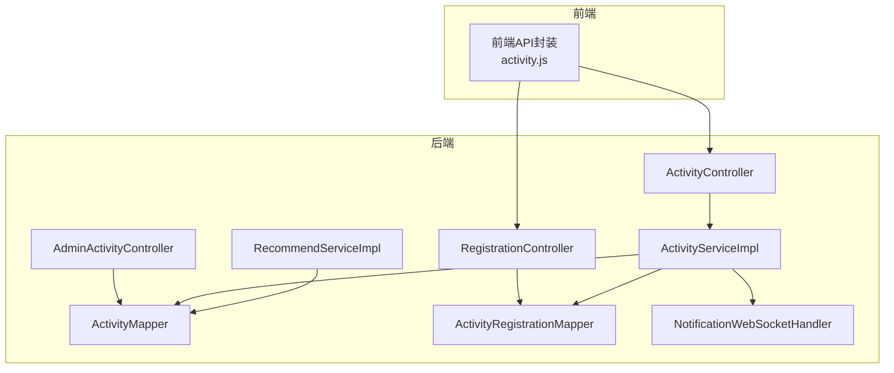
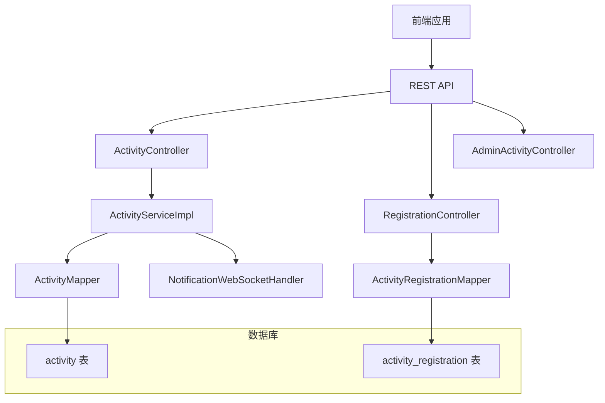
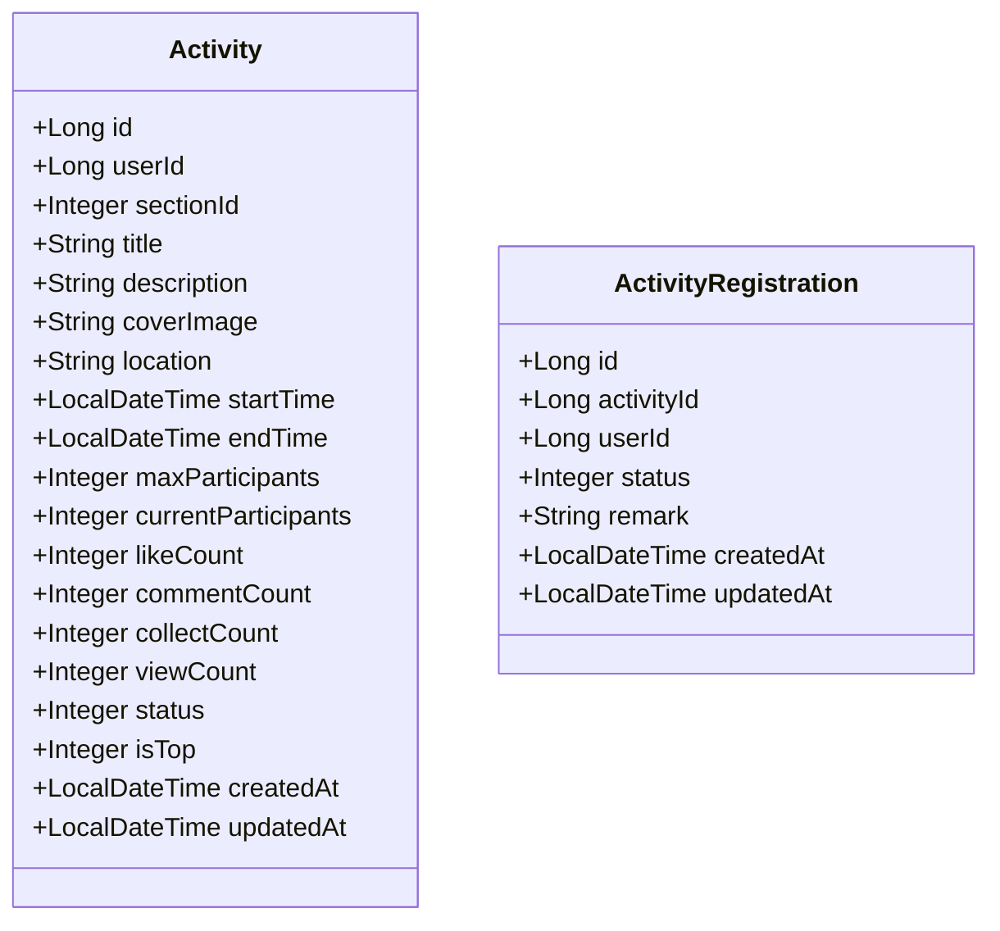
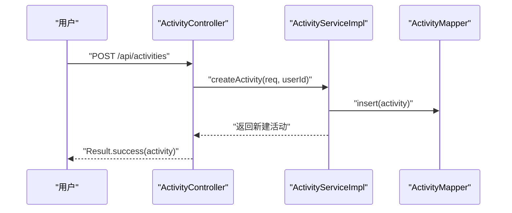
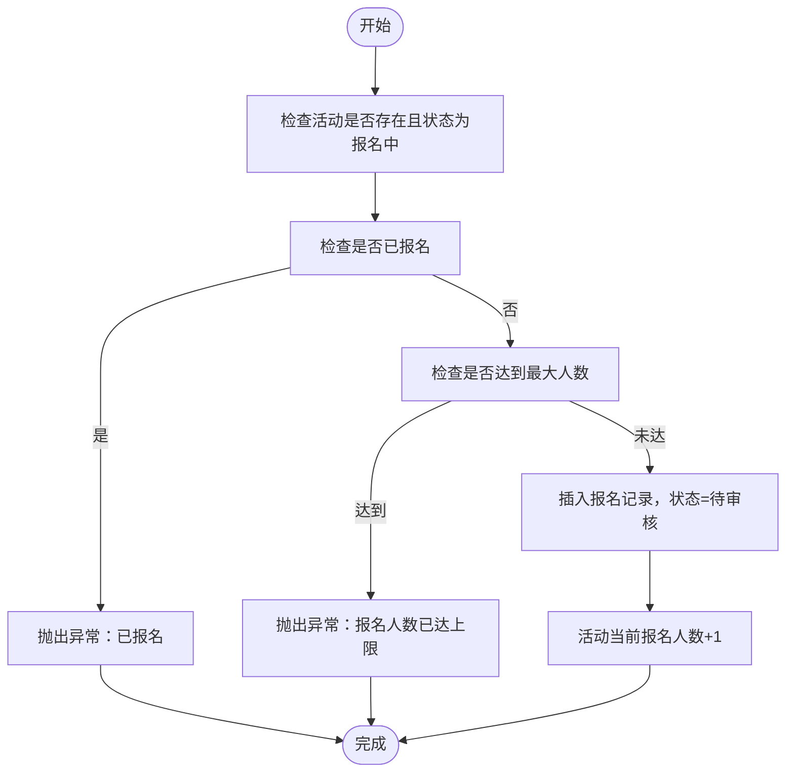
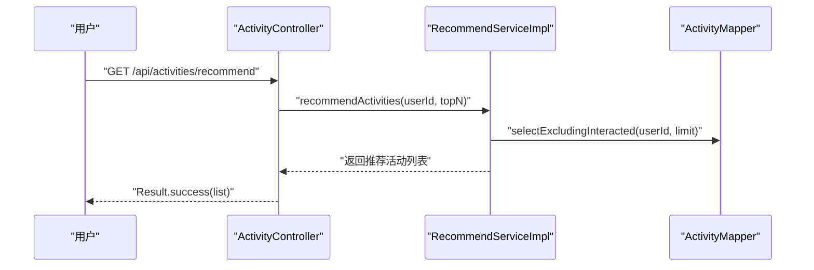
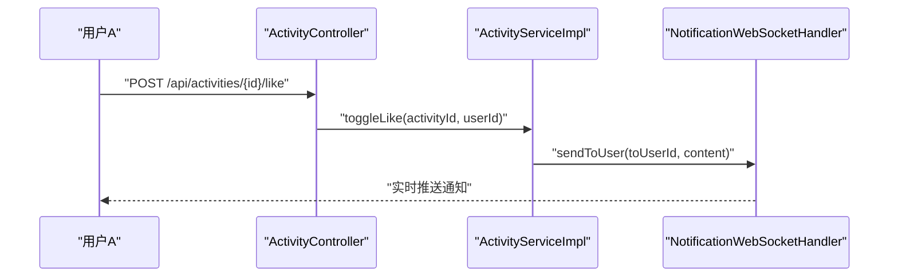
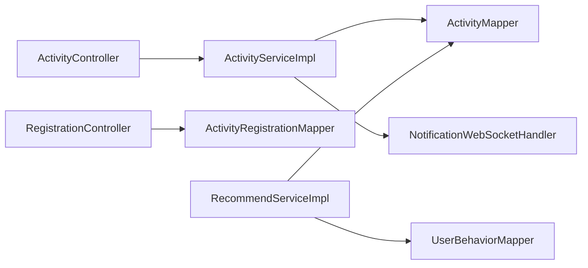

# 活动管理系统

<cite>
**本文引用的文件**
- [Activity.java](file://campus-forum-backend/src/main/java/com/campus/forum/entity/Activity.java)
- [ActivityRegistration.java](file://campus-forum-backend/src/main/java/com/campus/forum/entity/ActivityRegistration.java)
- [ActivityService.java](file://campus-forum-backend/src/main/java/com/campus/forum/service/ActivityService.java)
- [ActivityServiceImpl.java](file://campus-forum-backend/src/main/java/com/campus/forum/service/impl/ActivityServiceImpl.java)
- [ActivityController.java](file://campus-forum-backend/src/main/java/com/campus/forum/controller/ActivityController.java)
- [ActivityCreateRequest.java](file://campus-forum-backend/src/main/java/com/campus/forum/dto/request/ActivityCreateRequest.java)
- [ActivityMapper.java](file://campus-forum-backend/src/main/java/com/campus/forum/mapper/ActivityMapper.java)
- [ActivityRegistrationMapper.java](file://campus-forum-backend/src/main/java/com/campus/forum/mapper/ActivityRegistrationMapper.java)
- [AdminActivityController.java](file://campus-forum-backend/src/main/java/com/campus/forum/controller/admin/AdminActivityController.java)
- [RegistrationController.java](file://campus-forum-backend/src/main/java/com/campus/forum/controller/RegistrationController.java)
- [RecommendService.java](file://campus-forum-backend/src/main/java/com/campus/forum/service/RecommendService.java)
- [RecommendServiceImpl.java](file://campus-forum-backend/src/main/java/com/campus/forum/service/impl/RecommendServiceImpl.java)
- [NotificationService.java](file://campus-forum-backend/src/main/java/com/campus/forum/service/NotificationService.java)
- [NotificationWebSocketHandler.java](file://campus-forum-backend/src/main/java/com/campus/forum/websocket/NotificationWebSocketHandler.java)
- [activity.js](file://campus-forum-frontend/src/api/activity.js)
</cite>

## 目录
1. [简介](#简介)
2. [项目结构](#项目结构)
3. [核心组件](#核心组件)
4. [架构总览](#架构总览)
5. [详细组件分析](#详细组件分析)
6. [依赖分析](#依赖分析)
7. [性能考虑](#性能考虑)
8. [故障排查指南](#故障排查指南)
9. [结论](#结论)
10. [附录](#附录)

## 简介
本文件面向“活动管理系统”，围绕活动发布、报名管理、状态控制与统计、时间与容量管理、报名审核机制、活动与用户/版块的关联与权限控制、通知与提醒、日历集成、API 接口、数据生命周期与归档策略、以及推广与 SEO 等主题进行系统化说明。文档以后端 Java/Spring Boot 代码为依据，结合前端 API 封装，帮助开发者与产品人员快速理解并扩展系统能力。

## 项目结构
后端采用标准分层架构：控制器层负责对外暴露 REST API；服务层封装业务逻辑；持久层使用 MyBatis-Plus Mapper；实体模型映射数据库表；WebSocket 提供实时通知推送；前端通过统一 http 封装调用后端接口。

图表来源
- [ActivityController.java:26-82](file://campus-forum-backend/src/main/java/com/campus/forum/controller/ActivityController.java#L26-L82)
- [RegistrationController.java:26-119](file://campus-forum-backend/src/main/java/com/campus/forum/controller/RegistrationController.java#L26-L119)
- [AdminActivityController.java:20-69](file://campus-forum-backend/src/main/java/com/campus/forum/controller/admin/AdminActivityController.java#L20-L69)
- [ActivityServiceImpl.java:20-148](file://campus-forum-backend/src/main/java/com/campus/forum/service/impl/ActivityServiceImpl.java#L20-L148)
- [RecommendServiceImpl.java:31-111](file://campus-forum-backend/src/main/java/com/campus/forum/service/impl/RecommendServiceImpl.java#L31-L111)
- [ActivityMapper.java:10-21](file://campus-forum-backend/src/main/java/com/campus/forum/mapper/ActivityMapper.java#L10-L21)
- [ActivityRegistrationMapper.java:7-15](file://campus-forum-backend/src/main/java/com/campus/forum/mapper/ActivityRegistrationMapper.java#L7-L15)
- [NotificationWebSocketHandler.java:20-77](file://campus-forum-backend/src/main/java/com/campus/forum/websocket/NotificationWebSocketHandler.java#L20-L77)
- [activity.js:1-9](file://campus-forum-frontend/src/api/activity.js#L1-L9)

章节来源
- [ActivityController.java:26-82](file://campus-forum-backend/src/main/java/com/campus/forum/controller/ActivityController.java#L26-L82)
- [RegistrationController.java:26-119](file://campus-forum-backend/src/main/java/com/campus/forum/controller/RegistrationController.java#L26-L119)
- [AdminActivityController.java:20-69](file://campus-forum-backend/src/main/java/com/campus/forum/controller/admin/AdminActivityController.java#L20-L69)
- [ActivityServiceImpl.java:20-148](file://campus-forum-backend/src/main/java/com/campus/forum/service/impl/ActivityServiceImpl.java#L20-L148)
- [RecommendServiceImpl.java:31-111](file://campus-forum-backend/src/main/java/com/campus/forum/service/impl/RecommendServiceImpl.java#L31-L111)
- [ActivityMapper.java:10-21](file://campus-forum-backend/src/main/java/com/campus/forum/mapper/ActivityMapper.java#L10-L21)
- [ActivityRegistrationMapper.java:7-15](file://campus-forum-backend/src/main/java/com/campus/forum/mapper/ActivityRegistrationMapper.java#L7-L15)
- [NotificationWebSocketHandler.java:20-77](file://campus-forum-backend/src/main/java/com/campus/forum/websocket/NotificationWebSocketHandler.java#L20-L77)
- [activity.js:1-9](file://campus-forum-frontend/src/api/activity.js#L1-L9)

## 核心组件
- 活动实体与报名实体：承载活动基础信息、状态、计数字段与报名状态等。
- 控制器：对外提供活动查询、详情、发布、点赞/收藏、报名、审核、统计等接口。
- 服务层：封装活动业务规则（如浏览量统计、点赞/收藏去重、行为记录）、推荐算法、通知发送。
- 持久层：提供活动与报名的查询、计数、分页等 SQL。
- WebSocket：按用户维度推送实时通知消息。
- 前端 API：封装后端 REST 接口，便于视图层调用。

章节来源
- [Activity.java:12-38](file://campus-forum-backend/src/main/java/com/campus/forum/entity/Activity.java#L12-L38)
- [ActivityRegistration.java:12-26](file://campus-forum-backend/src/main/java/com/campus/forum/entity/ActivityRegistration.java#L12-L26)
- [ActivityController.java:26-82](file://campus-forum-backend/src/main/java/com/campus/forum/controller/ActivityController.java#L26-L82)
- [RegistrationController.java:26-119](file://campus-forum-backend/src/main/java/com/campus/forum/controller/RegistrationController.java#L26-L119)
- [ActivityServiceImpl.java:20-148](file://campus-forum-backend/src/main/java/com/campus/forum/service/impl/ActivityServiceImpl.java#L20-L148)
- [RecommendServiceImpl.java:31-111](file://campus-forum-backend/src/main/java/com/campus/forum/service/impl/RecommendServiceImpl.java#L31-L111)
- [NotificationWebSocketHandler.java:20-77](file://campus-forum-backend/src/main/java/com/campus/forum/websocket/NotificationWebSocketHandler.java#L20-L77)
- [activity.js:1-9](file://campus-forum-frontend/src/api/activity.js#L1-L9)

## 架构总览
系统采用前后端分离模式，后端提供 REST 接口与 WebSocket 通知通道，前端通过统一 http 封装调用。活动主数据与报名数据分别由独立实体与 Mapper 管理，服务层在事务边界内协调多表更新与通知发送。

图表来源
- [ActivityController.java:26-82](file://campus-forum-backend/src/main/java/com/campus/forum/controller/ActivityController.java#L26-L82)
- [RegistrationController.java:26-119](file://campus-forum-backend/src/main/java/com/campus/forum/controller/RegistrationController.java#L26-L119)
- [AdminActivityController.java:20-69](file://campus-forum-backend/src/main/java/com/campus/forum/controller/admin/AdminActivityController.java#L20-L69)
- [ActivityServiceImpl.java:20-148](file://campus-forum-backend/src/main/java/com/campus/forum/service/impl/ActivityServiceImpl.java#L20-L148)
- [ActivityMapper.java:10-21](file://campus-forum-backend/src/main/java/com/campus/forum/mapper/ActivityMapper.java#L10-L21)
- [ActivityRegistrationMapper.java:7-15](file://campus-forum-backend/src/main/java/com/campus/forum/mapper/ActivityRegistrationMapper.java#L7-L15)
- [NotificationWebSocketHandler.java:20-77](file://campus-forum-backend/src/main/java/com/campus/forum/websocket/NotificationWebSocketHandler.java#L20-L77)

## 详细组件分析

### 活动实体与报名实体
- 活动实体包含基础信息、时间范围、容量与状态字段，并维护浏览、点赞、收藏、评论等计数，以及置顶标记与创建/更新时间。
- 报名实体包含活动标识、用户标识、报名状态（待审核/已通过/已拒绝/已取消）与备注、创建/更新时间。

图表来源
- [Activity.java:12-38](file://campus-forum-backend/src/main/java/com/campus/forum/entity/Activity.java#L12-L38)
- [ActivityRegistration.java:12-26](file://campus-forum-backend/src/main/java/com/campus/forum/entity/ActivityRegistration.java#L12-L26)

章节来源
- [Activity.java:12-38](file://campus-forum-backend/src/main/java/com/campus/forum/entity/Activity.java#L12-L38)
- [ActivityRegistration.java:12-26](file://campus-forum-backend/src/main/java/com/campus/forum/entity/ActivityRegistration.java#L12-L26)

### 活动发布与状态控制
- 发布流程：控制器接收请求体，服务层创建活动并设置默认状态为“报名中”，同时初始化各类计数。
- 状态控制：管理端控制器支持更新活动状态（上线/下线/删除），前端通过 REST 接口调用。

图表来源
- [ActivityController.java:50-56](file://campus-forum-backend/src/main/java/com/campus/forum/controller/ActivityController.java#L50-L56)
- [ActivityServiceImpl.java:57-79](file://campus-forum-backend/src/main/java/com/campus/forum/service/impl/ActivityServiceImpl.java#L57-L79)
- [ActivityMapper.java:10-21](file://campus-forum-backend/src/main/java/com/campus/forum/mapper/ActivityMapper.java#L10-L21)

章节来源
- [ActivityController.java:50-56](file://campus-forum-backend/src/main/java/com/campus/forum/controller/ActivityController.java#L50-L56)
- [ActivityServiceImpl.java:57-79](file://campus-forum-backend/src/main/java/com/campus/forum/service/impl/ActivityServiceImpl.java#L57-L79)
- [AdminActivityController.java:40-48](file://campus-forum-backend/src/main/java/com/campus/forum/controller/admin/AdminActivityController.java#L40-L48)

### 报名管理与容量控制
- 报名流程：用户提交报名请求，服务层检查活动状态、是否已报名、是否超过最大人数，满足条件则插入报名记录并更新活动当前报名人数。
- 审核机制：报名状态初始为“待审核”，管理端可更新为“已通过/已拒绝”；用户可取消报名，状态置为“已取消”。

图表来源
- [RegistrationController.java:31-67](file://campus-forum-backend/src/main/java/com/campus/forum/controller/RegistrationController.java#L31-L67)
- [ActivityRegistrationMapper.java:10-11](file://campus-forum-backend/src/main/java/com/campus/forum/mapper/ActivityRegistrationMapper.java#L10-L11)
- [ActivityMapper.java:10-21](file://campus-forum-backend/src/main/java/com/campus/forum/mapper/ActivityMapper.java#L10-L21)

章节来源
- [RegistrationController.java:31-67](file://campus-forum-backend/src/main/java/com/campus/forum/controller/RegistrationController.java#L31-L67)
- [ActivityRegistrationMapper.java:10-11](file://campus-forum-backend/src/main/java/com/campus/forum/mapper/ActivityRegistrationMapper.java#L10-L11)
- [ActivityMapper.java:10-21](file://campus-forum-backend/src/main/java/com/campus/forum/mapper/ActivityMapper.java#L10-L21)

### 活动统计与推荐
- 统计：管理端提供报名人数统计接口；服务层提供热门活动查询与排除已交互活动的候选集。
- 推荐：基于用户行为的协同过滤（Item-based CF），若无行为则兜底热门活动；计算两个活动的余弦相似度作为相似度指标。

图表来源
- [ActivityController.java:74-81](file://campus-forum-backend/src/main/java/com/campus/forum/controller/ActivityController.java#L74-L81)
- [RecommendServiceImpl.java:36-84](file://campus-forum-backend/src/main/java/com/campus/forum/service/impl/RecommendServiceImpl.java#L36-L84)
- [ActivityMapper.java:16-20](file://campus-forum-backend/src/main/java/com/campus/forum/mapper/ActivityMapper.java#L16-L20)

章节来源
- [RecommendServiceImpl.java:36-84](file://campus-forum-backend/src/main/java/com/campus/forum/service/impl/RecommendServiceImpl.java#L36-L84)
- [ActivityMapper.java:13-20](file://campus-forum-backend/src/main/java/com/campus/forum/mapper/ActivityMapper.java#L13-L20)
- [AdminActivityController.java:60-68](file://campus-forum-backend/src/main/java/com/campus/forum/controller/admin/AdminActivityController.java#L60-L68)

### 通知机制与提醒系统
- 通知发送：点赞/收藏等行为触发通知服务，向活动发布者推送通知。
- WebSocket 推送：按用户维度建立连接，向在线用户实时推送通知消息。

图表来源
- [ActivityController.java:58-64](file://campus-forum-backend/src/main/java/com/campus/forum/controller/ActivityController.java#L58-L64)
- [ActivityServiceImpl.java:82-111](file://campus-forum-backend/src/main/java/com/campus/forum/service/impl/ActivityServiceImpl.java#L82-L111)
- [NotificationWebSocketHandler.java:47-57](file://campus-forum-backend/src/main/java/com/campus/forum/websocket/NotificationWebSocketHandler.java#L47-L57)

章节来源
- [ActivityServiceImpl.java:82-111](file://campus-forum-backend/src/main/java/com/campus/forum/service/impl/ActivityServiceImpl.java#L82-L111)
- [NotificationWebSocketHandler.java:47-57](file://campus-forum-backend/src/main/java/com/campus/forum/websocket/NotificationWebSocketHandler.java#L47-L57)

### 权限控制与安全
- 登录态：控制器通过 Spring Security 注解获取当前登录用户标识，所有写操作均需认证。
- 管理端：管理员可对活动进行状态变更与删除（逻辑删除设为草稿状态）。

章节来源
- [ActivityController.java:44-56](file://campus-forum-backend/src/main/java/com/campus/forum/controller/ActivityController.java#L44-L56)
- [RegistrationController.java:37-38](file://campus-forum-backend/src/main/java/com/campus/forum/controller/RegistrationController.java#L37-L38)
- [AdminActivityController.java:42-47](file://campus-forum-backend/src/main/java/com/campus/forum/controller/admin/AdminActivityController.java#L42-L47)

### 日历集成与时间管理
- 时间字段：活动实体包含开始与结束时间，控制器与服务层据此进行状态判断与展示。
- 建议：前端可将活动时间转换为本地时间显示；后端可提供按时间段查询接口以便日历聚合。

章节来源
- [Activity.java:21-22](file://campus-forum-backend/src/main/java/com/campus/forum/entity/Activity.java#L21-L22)
- [ActivityController.java:32-48](file://campus-forum-backend/src/main/java/com/campus/forum/controller/ActivityController.java#L32-L48)

### 数据生命周期与归档策略
- 归档建议：活动结束后（结束时间小于当前时间）可将其状态置为“已结束”，并在管理端提供归档查询；历史数据可定期迁移至离线存储。
- 删除策略：管理端删除操作将活动状态置为草稿，保留数据以便恢复或审计。

章节来源
- [Activity.java:30-32](file://campus-forum-backend/src/main/java/com/campus/forum/entity/Activity.java#L30-L32)
- [AdminActivityController.java:50-58](file://campus-forum-backend/src/main/java/com/campus/forum/controller/admin/AdminActivityController.java#L50-L58)

### 推广、SEO 与社交分享
- SEO 建议：活动详情页可动态生成标题与描述 meta，结合封面图与版块标签提升搜索可见性。
- 社交分享：前端可在详情页提供分享按钮，调用系统分享接口或平台分享能力；后端可提供短链与摘要信息。

章节来源
- [Activity.java:17-19](file://campus-forum-backend/src/main/java/com/campus/forum/entity/Activity.java#L17-L19)
- [ActivityController.java:42-48](file://campus-forum-backend/src/main/java/com/campus/forum/controller/ActivityController.java#L42-L48)

## 依赖分析
- 控制器依赖服务层；服务层依赖 Mapper 与通知服务；推荐服务依赖行为与活动 Mapper。
- 前端通过统一 API 封装调用后端接口，降低耦合。

图表来源
- [ActivityController.java:26-82](file://campus-forum-backend/src/main/java/com/campus/forum/controller/ActivityController.java#L26-L82)
- [RegistrationController.java:26-119](file://campus-forum-backend/src/main/java/com/campus/forum/controller/RegistrationController.java#L26-L119)
- [ActivityServiceImpl.java:20-148](file://campus-forum-backend/src/main/java/com/campus/forum/service/impl/ActivityServiceImpl.java#L20-L148)
- [RecommendServiceImpl.java:31-111](file://campus-forum-backend/src/main/java/com/campus/forum/service/impl/RecommendServiceImpl.java#L31-L111)
- [ActivityMapper.java:10-21](file://campus-forum-backend/src/main/java/com/campus/forum/mapper/ActivityMapper.java#L10-L21)
- [ActivityRegistrationMapper.java:7-15](file://campus-forum-backend/src/main/java/com/campus/forum/mapper/ActivityRegistrationMapper.java#L7-L15)

章节来源
- [ActivityServiceImpl.java:20-148](file://campus-forum-backend/src/main/java/com/campus/forum/service/impl/ActivityServiceImpl.java#L20-L148)
- [RecommendServiceImpl.java:31-111](file://campus-forum-backend/src/main/java/com/campus/forum/service/impl/RecommendServiceImpl.java#L31-L111)

## 性能考虑
- 分页查询：活动列表与报名列表均使用分页包装器，避免一次性加载大量数据。
- 计数字段：活动实体内置浏览、点赞、收藏、评论等计数字段，减少频繁统计查询。
- 推荐算法：候选集扩大再筛选，避免低效遍历；相似度计算加入除零保护。
- 缓存建议：热门活动与推荐结果可引入 Redis 缓存；WebSocket 连接池与心跳检测可提升稳定性。

## 故障排查指南
- 活动不存在：当活动被删除或状态不正确时，服务层会抛出业务异常。
- 报名异常：重复报名、超出容量、活动非报名中状态都会触发异常提示。
- WebSocket 推送失败：处理器记录警告日志，检查连接参数与会话状态。

章节来源
- [ActivityServiceImpl.java:44-46](file://campus-forum-backend/src/main/java/com/campus/forum/service/impl/ActivityServiceImpl.java#L44-L46)
- [RegistrationController.java:40-53](file://campus-forum-backend/src/main/java/com/campus/forum/controller/RegistrationController.java#L40-L53)
- [NotificationWebSocketHandler.java:53-56](file://campus-forum-backend/src/main/java/com/campus/forum/websocket/NotificationWebSocketHandler.java#L53-L56)

## 结论
活动管理系统以清晰的分层设计实现了活动全生命周期管理：从发布、报名、审核到统计与推荐，配合通知与 WebSocket 实时提醒，形成闭环体验。建议后续增强日历导出、社交分享与 SEO 元信息配置，完善数据归档与缓存策略，持续优化推荐算法与性能监控。

## 附录

### API 接口清单（后端）
- 获取活动列表
  - 方法：GET
  - 路径：/api/activities
  - 查询参数：page、size、sectionId、status、keyword
- 获取活动详情
  - 方法：GET
  - 路径：/api/activities/{id}
- 发布活动
  - 方法：POST
  - 路径：/api/activities
  - 请求体：ActivityCreateRequest
- 点赞/取消点赞活动
  - 方法：POST
  - 路径：/api/activities/{id}/like
- 收藏/取消收藏活动
  - 方法：POST
  - 路径：/api/activities/{id}/collect
- 协同过滤推荐活动
  - 方法：GET
  - 路径：/api/activities/recommend
- 报名活动
  - 方法：POST
  - 路径：/api/registrations
  - 参数：activityId、remark
- 取消报名
  - 方法：DELETE
  - 路径：/api/registrations/{activityId}
- 我的报名记录
  - 方法：GET
  - 路径：/api/registrations/my
- 查看某活动的报名人员列表
  - 方法：GET
  - 路径：/api/registrations/activity/{id}
- 审核报名（通过/拒绝）
  - 方法：PUT
  - 路径：/api/registrations/{id}/status
  - 参数：status
- 活动列表（管理端）
  - 方法：GET
  - 路径：/api/admin/activities
  - 参数：page、size、keyword、status
- 审核活动（上线/下线）
  - 方法：PUT
  - 路径：/api/admin/activities/{id}/status
  - 参数：status
- 删除活动
  - 方法：DELETE
  - 路径：/api/admin/activities/{id}
- 活动报名人数统计
  - 方法：GET
  - 路径：/api/admin/activities/{id}/registrations/count

章节来源
- [ActivityController.java:31-81](file://campus-forum-backend/src/main/java/com/campus/forum/controller/ActivityController.java#L31-L81)
- [RegistrationController.java:31-119](file://campus-forum-backend/src/main/java/com/campus/forum/controller/RegistrationController.java#L31-L119)
- [AdminActivityController.java:25-68](file://campus-forum-backend/src/main/java/com/campus/forum/controller/admin/AdminActivityController.java#L25-L68)

### 前端 API 使用示例（路径）
- 获取活动列表：[getActivities](file://campus-forum-frontend/src/api/activity.js#L2)
- 获取活动详情：[getActivity](file://campus-forum-frontend/src/api/activity.js#L3)
- 发布活动：[createActivity](file://campus-forum-frontend/src/api/activity.js#L4)
- 点赞活动：[likeActivity](file://campus-forum-frontend/src/api/activity.js#L7)
- 获取推荐：[getRecommend](file://campus-forum-frontend/src/api/activity.js#L8)

章节来源
- [activity.js:1-9](file://campus-forum-frontend/src/api/activity.js#L1-L9)