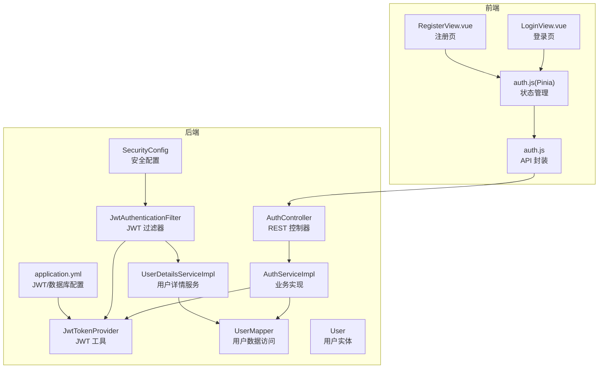
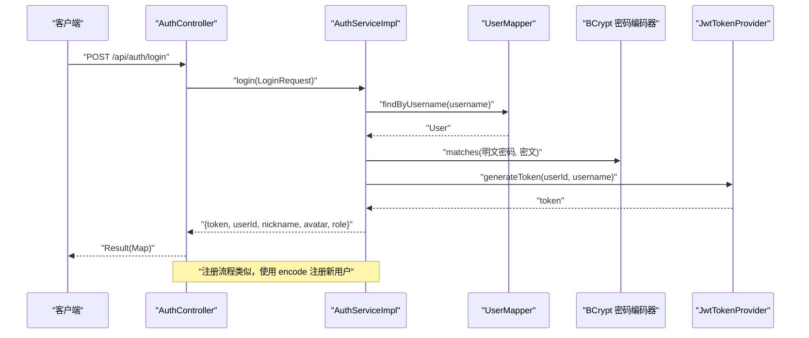
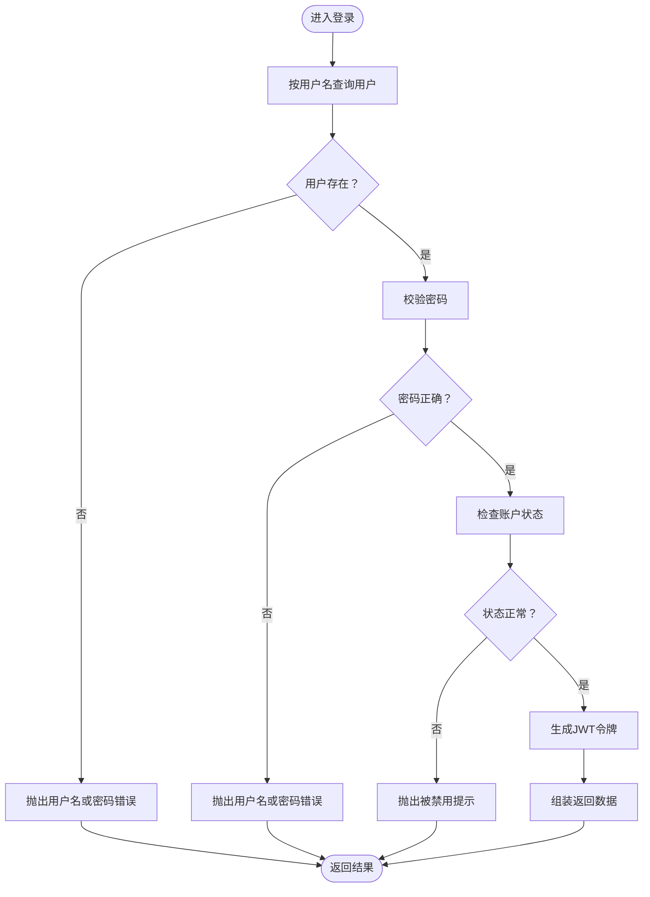
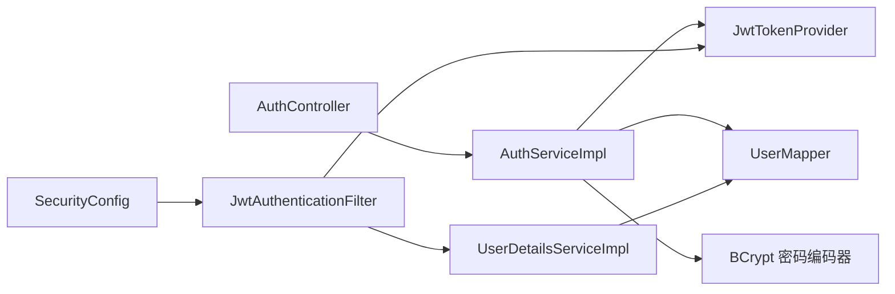

# 用户认证模块

<cite>
**本文引用的文件**
- [AuthController.java](file://campus-forum-backend/src/main/java/com/campus/forum/controller/AuthController.java)
- [AuthServiceImpl.java](file://campus-forum-backend/src/main/java/com/campus/forum/service/impl/AuthServiceImpl.java)
- [RegisterRequest.java](file://campus-forum-backend/src/main/java/com/campus/forum/dto/request/RegisterRequest.java)
- [LoginRequest.java](file://campus-forum-backend/src/main/java/com/campus/forum/dto/request/LoginRequest.java)
- [JwtTokenProvider.java](file://campus-forum-backend/src/main/java/com/campus/forum/security/JwtTokenProvider.java)
- [JwtAuthenticationFilter.java](file://campus-forum-backend/src/main/java/com/campus/forum/security/JwtAuthenticationFilter.java)
- [UserDetailsServiceImpl.java](file://campus-forum-backend/src/main/java/com/campus/forum/security/UserDetailsServiceImpl.java)
- [SecurityConfig.java](file://campus-forum-backend/src/main/java/com/campus/forum/config/SecurityConfig.java)
- [UserMapper.java](file://campus-forum-backend/src/main/java/com/campus/forum/mapper/UserMapper.java)
- [User.java](file://campus-forum-backend/src/main/java/com/campus/forum/entity/User.java)
- [application.yml](file://campus-forum-backend/src/main/resources/application.yml)
- [auth.js](file://campus-forum-frontend/src/api/auth.js)
- [auth.js（Pinia Store）](file://campus-forum-frontend/src/stores/auth.js)
- [LoginView.vue](file://campus-forum-frontend/src/views/LoginView.vue)
- [RegisterView.vue](file://campus-forum-frontend/src/views/RegisterView.vue)
</cite>

## 目录
1. [简介](#简介)
2. [项目结构](#项目结构)
3. [核心组件](#核心组件)
4. [架构总览](#架构总览)
5. [详细组件分析](#详细组件分析)
6. [依赖分析](#依赖分析)
7. [性能考虑](#性能考虑)
8. [故障排查指南](#故障排查指南)
9. [结论](#结论)
10. [附录](#附录)

## 简介
本文件系统性梳理后端认证模块的设计与实现，覆盖用户注册、登录、密码加密、JWT 令牌生成与校验、权限与角色体系、以及前后端集成方式。文档同时给出安全最佳实践与常见问题的解决方案，帮助开发者快速理解并正确使用认证能力。

## 项目结构
认证相关代码主要分布在后端 Spring Boot 工程的 controller、service、security、mapper、entity 与配置层；前端通过 Pinia Store 与 API 模块完成登录态持久化与页面交互。

图表来源
- [AuthController.java:1-39](file://campus-forum-backend/src/main/java/com/campus/forum/controller/AuthController.java#L1-L39)
- [AuthServiceImpl.java:1-69](file://campus-forum-backend/src/main/java/com/campus/forum/service/impl/AuthServiceImpl.java#L1-L69)
- [SecurityConfig.java:1-67](file://campus-forum-backend/src/main/java/com/campus/forum/config/SecurityConfig.java#L1-L67)
- [JwtAuthenticationFilter.java:1-59](file://campus-forum-backend/src/main/java/com/campus/forum/security/JwtAuthenticationFilter.java#L1-L59)
- [JwtTokenProvider.java:1-93](file://campus-forum-backend/src/main/java/com/campus/forum/security/JwtTokenProvider.java#L1-L93)
- [UserDetailsServiceImpl.java:1-35](file://campus-forum-backend/src/main/java/com/campus/forum/security/UserDetailsServiceImpl.java#L1-L35)
- [UserMapper.java:1-39](file://campus-forum-backend/src/main/java/com/campus/forum/mapper/UserMapper.java#L1-L39)
- [User.java:1-33](file://campus-forum-backend/src/main/java/com/campus/forum/entity/User.java#L1-L33)
- [application.yml:30-34](file://campus-forum-backend/src/main/resources/application.yml#L30-L34)
- [auth.js:1-4](file://campus-forum-frontend/src/api/auth.js#L1-L4)
- [auth.js（Pinia Store）:1-37](file://campus-forum-frontend/src/stores/auth.js#L1-L37)
- [LoginView.vue:1-72](file://campus-forum-frontend/src/views/LoginView.vue#L1-L72)
- [RegisterView.vue:1-65](file://campus-forum-frontend/src/views/RegisterView.vue#L1-L65)

章节来源
- [AuthController.java:1-39](file://campus-forum-backend/src/main/java/com/campus/forum/controller/AuthController.java#L1-L39)
- [SecurityConfig.java:1-67](file://campus-forum-backend/src/main/java/com/campus/forum/config/SecurityConfig.java#L1-L67)
- [application.yml:30-34](file://campus-forum-backend/src/main/resources/application.yml#L30-L34)

## 核心组件
- 认证控制器：提供注册与登录接口，返回统一结果包装。
- 认证服务实现：负责注册校验、密码编码、登录鉴权与令牌签发。
- 安全配置：启用无状态会话、开放公开接口、设置方法级权限与过滤链。
- JWT 组件：令牌生成、解析、校验与请求头解析。
- 用户详情服务：基于用户 ID 加载用户信息并映射角色。
- 数据访问层：按用户名/ID 查询用户。
- 前端集成：通过 API 模块与 Pinia Store 管理登录态与本地存储。

章节来源
- [AuthController.java:26-37](file://campus-forum-backend/src/main/java/com/campus/forum/controller/AuthController.java#L26-L37)
- [AuthServiceImpl.java:28-67](file://campus-forum-backend/src/main/java/com/campus/forum/service/impl/AuthServiceImpl.java#L28-L67)
- [SecurityConfig.java:42-62](file://campus-forum-backend/src/main/java/com/campus/forum/config/SecurityConfig.java#L42-L62)
- [JwtTokenProvider.java:33-71](file://campus-forum-backend/src/main/java/com/campus/forum/security/JwtTokenProvider.java#L33-L71)
- [UserDetailsServiceImpl.java:21-33](file://campus-forum-backend/src/main/java/com/campus/forum/security/UserDetailsServiceImpl.java#L21-L33)
- [UserMapper.java:12-16](file://campus-forum-backend/src/main/java/com/campus/forum/mapper/UserMapper.java#L12-L16)
- [auth.js（Pinia Store）:11-28](file://campus-forum-frontend/src/stores/auth.js#L11-L28)

## 架构总览
下图展示认证流程在后端的关键交互：请求进入控制器，调用服务层进行业务处理，服务层使用密码编码器与 JWT 工具完成密码校验与令牌签发；安全配置加载 JWT 过滤器，拦截请求解析令牌并注入认证上下文。

图表来源
- [AuthController.java:33-37](file://campus-forum-backend/src/main/java/com/campus/forum/controller/AuthController.java#L33-L37)
- [AuthServiceImpl.java:47-67](file://campus-forum-backend/src/main/java/com/campus/forum/service/impl/AuthServiceImpl.java#L47-L67)
- [UserMapper.java:12-13](file://campus-forum-backend/src/main/java/com/campus/forum/mapper/UserMapper.java#L12-L13)
- [JwtTokenProvider.java:33-43](file://campus-forum-backend/src/main/java/com/campus/forum/security/JwtTokenProvider.java#L33-L43)

## 详细组件分析

### 认证控制器（AuthController）
- 提供注册与登录两个公开接口，使用统一结果包装返回。
- 登录接口返回令牌及用户基本信息，便于前端初始化会话。

章节来源
- [AuthController.java:26-37](file://campus-forum-backend/src/main/java/com/campus/forum/controller/AuthController.java#L26-L37)

### 认证服务实现（AuthServiceImpl）
- 注册流程
  - 校验用户名唯一性，失败抛业务异常。
  - 使用密码编码器对明文密码进行编码存储。
  - 初始化默认字段（角色、状态、计数等），插入用户表。
- 登录流程
  - 按用户名查询用户，不存在或密码不匹配则抛异常。
  - 校验账户状态（禁用则拒绝登录）。
  - 生成 JWT 令牌，并封装返回数据（token、userId、昵称、头像、角色）。

图表来源
- [AuthServiceImpl.java:47-67](file://campus-forum-backend/src/main/java/com/campus/forum/service/impl/AuthServiceImpl.java#L47-L67)

章节来源
- [AuthServiceImpl.java:28-67](file://campus-forum-backend/src/main/java/com/campus/forum/service/impl/AuthServiceImpl.java#L28-L67)

### 请求数据对象
- 登录请求体：包含用户名与密码，均非空校验。
- 注册请求体：用户名长度与密码长度约束，昵称非空，邮箱可选。

章节来源
- [LoginRequest.java:7-12](file://campus-forum-backend/src/main/java/com/campus/forum/dto/request/LoginRequest.java#L7-L12)
- [RegisterRequest.java:8-21](file://campus-forum-backend/src/main/java/com/campus/forum/dto/request/RegisterRequest.java#L8-L21)

### 安全配置与过滤链（SecurityConfig）
- 无状态会话策略：禁止创建会话，降低会话劫持风险。
- 公开接口放行：认证相关接口与部分只读接口无需登录。
- 方法级权限：管理员接口需 ADMIN 角色。
- 过滤器链：在标准用户名密码过滤器之前加入 JWT 过滤器，解析并注入认证信息。

章节来源
- [SecurityConfig.java:42-62](file://campus-forum-backend/src/main/java/com/campus/forum/config/SecurityConfig.java#L42-L62)

### JWT 令牌组件（JwtTokenProvider）
- 令牌生成：包含用户 ID、用户名、签发时间、过期时间与签名。
- 令牌校验：使用密钥验证签名与有效期，异常时记录告警。
- 请求解析：支持 Authorization 头与 WebSocket URL 参数两种方式提取 token。
- 用户 ID 解析：从有效令牌中提取 subject 作为用户标识。

章节来源
- [JwtTokenProvider.java:33-91](file://campus-forum-backend/src/main/java/com/campus/forum/security/JwtTokenProvider.java#L33-L91)

### JWT 认证过滤器（JwtAuthenticationFilter）
- 在请求到达时尝试从请求头或 URL 参数中提取 token。
- 校验通过后，根据用户 ID 加载用户详情并构建认证对象，注入到安全上下文。

章节来源
- [JwtAuthenticationFilter.java:30-44](file://campus-forum-backend/src/main/java/com/campus/forum/security/JwtAuthenticationFilter.java#L30-L44)

### 用户详情服务（UserDetailsServiceImpl）
- 将用户 ID 作为用户名加载用户信息。
- 将角色值映射为 ROLE_USER 或 ROLE_ADMIN，用于方法级权限控制。

章节来源
- [UserDetailsServiceImpl.java:21-33](file://campus-forum-backend/src/main/java/com/campus/forum/security/UserDetailsServiceImpl.java#L21-L33)

### 数据访问层（UserMapper）
- 提供按用户名与 ID 的查询方法，支撑登录与详情加载。
- 提供关注/取消关注、粉丝统计等扩展查询（与认证流程相关但非必需）。

章节来源
- [UserMapper.java:12-16](file://campus-forum-backend/src/main/java/com/campus/forum/mapper/UserMapper.java#L12-L16)

### 用户实体（User）
- 字段包含角色与状态，支撑角色与封禁控制。
- 默认字段初始化由服务层完成，避免空值。

章节来源
- [User.java:21-24](file://campus-forum-backend/src/main/java/com/campus/forum/entity/User.java#L21-L24)

### 应用配置（application.yml）
- JWT 密钥与过期时间配置。
- 数据源、MyBatis Plus、文件上传等基础配置。

章节来源
- [application.yml:30-34](file://campus-forum-backend/src/main/resources/application.yml#L30-L34)

### 前端集成（Vue + Pinia）
- API 层：封装登录与注册请求。
- Store 层：保存 token 与用户信息至本地存储，提供登录、注册、登出与更新用户信息的方法。
- 页面层：登录页与注册页分别调用 Store 执行认证动作，并在成功后跳转首页。

章节来源
- [auth.js:1-4](file://campus-forum-frontend/src/api/auth.js#L1-L4)
- [auth.js（Pinia Store）:11-28](file://campus-forum-frontend/src/stores/auth.js#L11-L28)
- [LoginView.vue:39-49](file://campus-forum-frontend/src/views/LoginView.vue#L39-L49)
- [RegisterView.vue:43-53](file://campus-forum-frontend/src/views/RegisterView.vue#L43-L53)

## 依赖分析
认证模块内部依赖清晰，职责分离明确：控制器仅负责接口与参数校验；服务层承担业务逻辑与外部依赖（数据库、密码编码器、JWT）；安全配置与过滤器负责全局拦截与认证上下文注入；前端通过 API 与 Store 完成会话管理。

图表来源
- [AuthController.java:24-24](file://campus-forum-backend/src/main/java/com/campus/forum/controller/AuthController.java#L24-L24)
- [AuthServiceImpl.java:24-26](file://campus-forum-backend/src/main/java/com/campus/forum/service/impl/AuthServiceImpl.java#L24-L26)
- [SecurityConfig.java:30-30](file://campus-forum-backend/src/main/java/com/campus/forum/config/SecurityConfig.java#L30-L30)
- [JwtAuthenticationFilter.java:27-28](file://campus-forum-backend/src/main/java/com/campus/forum/security/JwtAuthenticationFilter.java#L27-L28)
- [UserDetailsServiceImpl.java:19-19](file://campus-forum-backend/src/main/java/com/campus/forum/security/UserDetailsServiceImpl.java#L19-L19)
- [UserMapper.java:12-13](file://campus-forum-backend/src/main/java/com/campus/forum/mapper/UserMapper.java#L12-L13)
- [JwtTokenProvider.java:23-27](file://campus-forum-backend/src/main/java/com/campus/forum/security/JwtTokenProvider.java#L23-L27)

章节来源
- [AuthServiceImpl.java:24-26](file://campus-forum-backend/src/main/java/com/campus/forum/service/impl/AuthServiceImpl.java#L24-L26)
- [SecurityConfig.java:30-30](file://campus-forum-backend/src/main/java/com/campus/forum/config/SecurityConfig.java#L30-L30)

## 性能考虑
- 无状态设计：基于 JWT 的无状态认证避免服务器端会话存储，降低内存占用与横向扩展复杂度。
- 密码编码成本：BCrypt 编码与校验为 CPU 密集型操作，建议在高并发场景下评估服务器资源与连接池配置。
- 令牌过期策略：合理设置过期时间以平衡安全性与用户体验；短令牌配合刷新机制可进一步提升安全。
- 数据库查询：按用户名查询用户为单条记录检索，索引优化可确保低延迟。

## 故障排查指南
- 登录失败
  - 用户名或密码错误：服务层针对用户名不存在与密码不匹配抛出业务异常。
  - 账户被禁用：状态检查失败时抛出业务异常。
- 未登录或令牌过期
  - 过滤器解析不到有效令牌或令牌无效时，抛出业务异常。
- 前端无法携带令牌
  - 确认 Authorization 头是否以 Bearer 前缀发送；WebSocket 场景请确认 URL 参数 token 是否正确传递。
- 密码安全
  - 确保生产环境使用强密钥与合理过期时间；避免在日志中输出敏感信息。

章节来源
- [AuthServiceImpl.java:50-58](file://campus-forum-backend/src/main/java/com/campus/forum/service/impl/AuthServiceImpl.java#L50-L58)
- [JwtAuthenticationFilter.java:34-42](file://campus-forum-backend/src/main/java/com/campus/forum/security/JwtAuthenticationFilter.java#L34-L42)
- [JwtTokenProvider.java:64-71](file://campus-forum-backend/src/main/java/com/campus/forum/security/JwtTokenProvider.java#L64-L71)

## 结论
该认证模块采用 Spring Security + JWT 的经典组合，实现了注册、登录、密码加密与权限控制的完整闭环。通过无状态设计与严格的请求放行策略，既保证了易用性也兼顾了安全性。建议在生产环境中强化密钥管理、引入令牌刷新与黑名单机制，并持续监控与审计认证相关日志。

## 附录

### API 接口定义
- 登录
  - 方法与路径：POST /api/auth/login
  - 请求体：用户名、密码（均为必填）
  - 成功响应：令牌、用户 ID、昵称、头像、角色
- 注册
  - 方法与路径：POST /api/auth/register
  - 请求体：用户名（3-20）、密码（6-20）、昵称（必填）、邮箱（可选）
  - 成功响应：无内容

章节来源
- [AuthController.java:26-37](file://campus-forum-backend/src/main/java/com/campus/forum/controller/AuthController.java#L26-L37)
- [LoginRequest.java:7-12](file://campus-forum-backend/src/main/java/com/campus/forum/dto/request/LoginRequest.java#L7-L12)
- [RegisterRequest.java:8-21](file://campus-forum-backend/src/main/java/com/campus/forum/dto/request/RegisterRequest.java#L8-L21)

### 前端集成示例
- 登录页
  - 表单校验通过后调用 Store 的 login 方法，成功后跳转首页。
- 注册页
  - 表单校验通过后调用 Store 的 register 方法，成功后跳转登录页。
- Store
  - 登录成功后将 token 与用户信息存入本地存储；登出时清除。

章节来源
- [LoginView.vue:39-49](file://campus-forum-frontend/src/views/LoginView.vue#L39-L49)
- [RegisterView.vue:43-53](file://campus-forum-frontend/src/views/RegisterView.vue#L43-L53)
- [auth.js（Pinia Store）:11-28](file://campus-forum-frontend/src/stores/auth.js#L11-L28)

### 权限与角色体系
- 角色映射
  - 角色值 0 对应 ROLE_USER
  - 角色值 1 对应 ROLE_ADMIN
- 方法级权限
  - 管理员接口需具备 ADMIN 角色方可访问
- 账户状态
  - 状态为 0 的用户禁止登录

章节来源
- [UserDetailsServiceImpl.java:27-32](file://campus-forum-backend/src/main/java/com/campus/forum/security/UserDetailsServiceImpl.java#L27-L32)
- [SecurityConfig.java:57-60](file://campus-forum-backend/src/main/java/com/campus/forum/config/SecurityConfig.java#L57-L60)
- [User.java:21-24](file://campus-forum-backend/src/main/java/com/campus/forum/entity/User.java#L21-L24)

### 安全最佳实践
- 密钥与配置
  - 生产环境使用强随机密钥，避免硬编码；通过环境变量注入。
- 传输安全
  - 强制 HTTPS，避免令牌在传输中泄露。
- 令牌策略
  - 短令牌 + 刷新机制；必要时引入令牌撤销与黑名单。
- 输入校验
  - 前端与后端双重校验，防止越权与注入。
- 日志与监控
  - 记录认证失败事件，设置阈值告警与审计追踪。