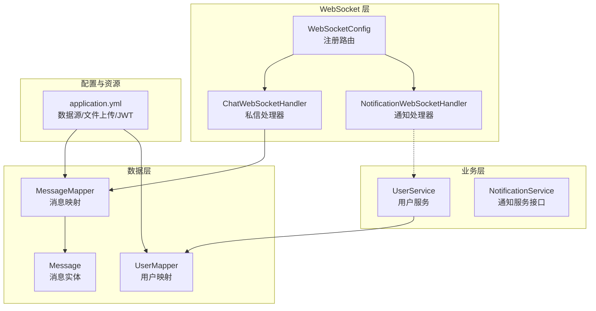
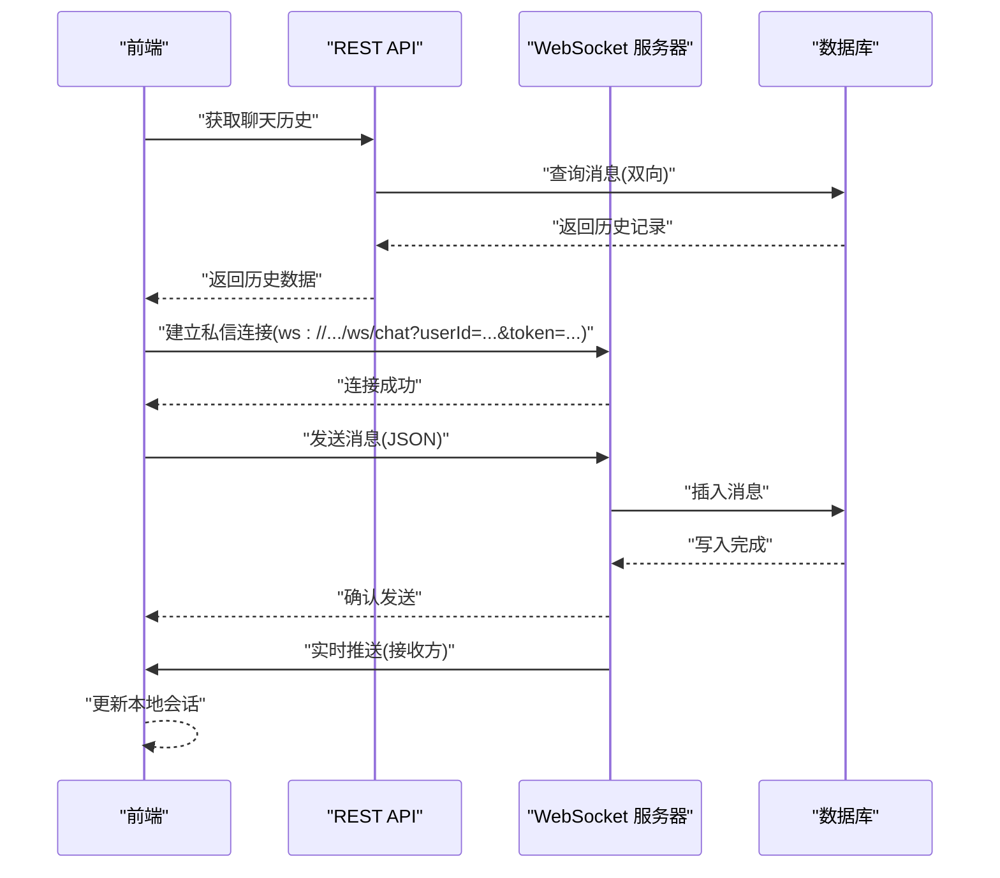
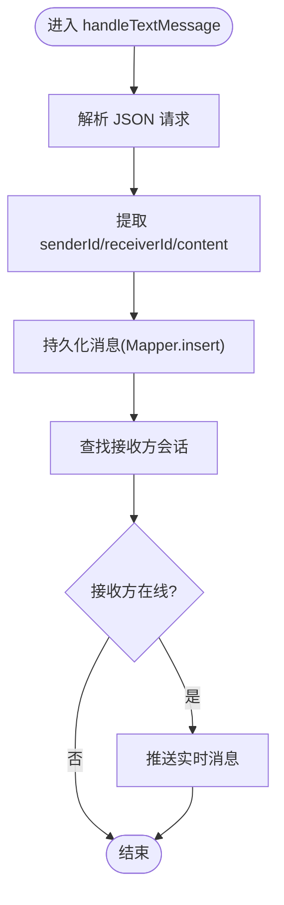
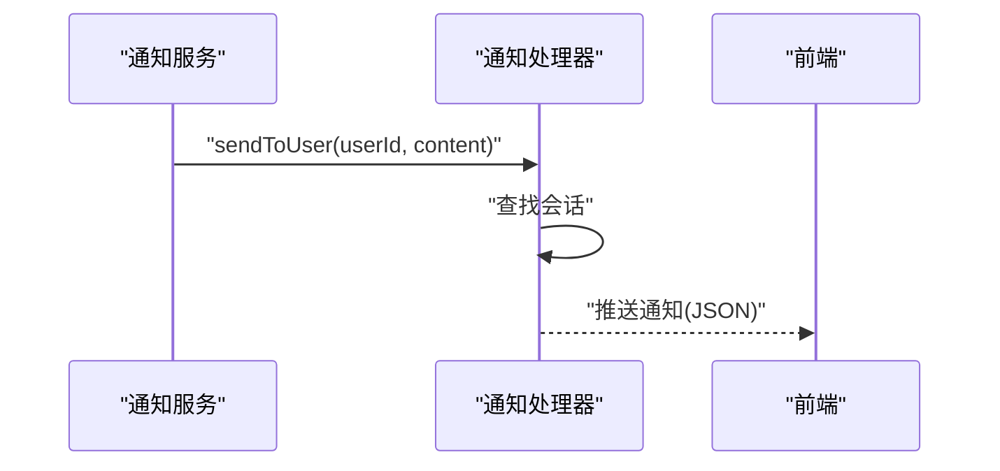
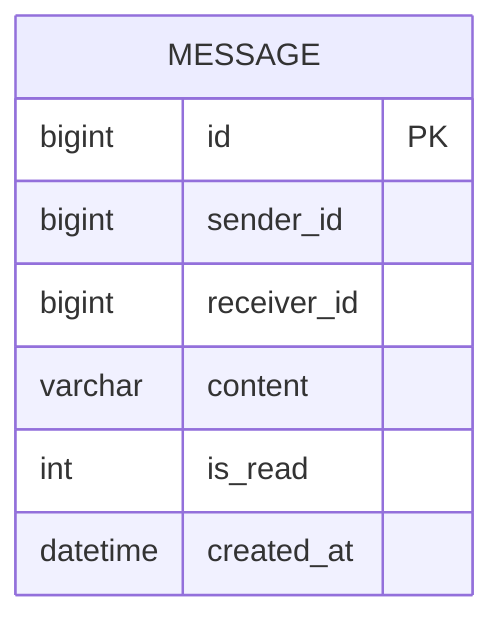
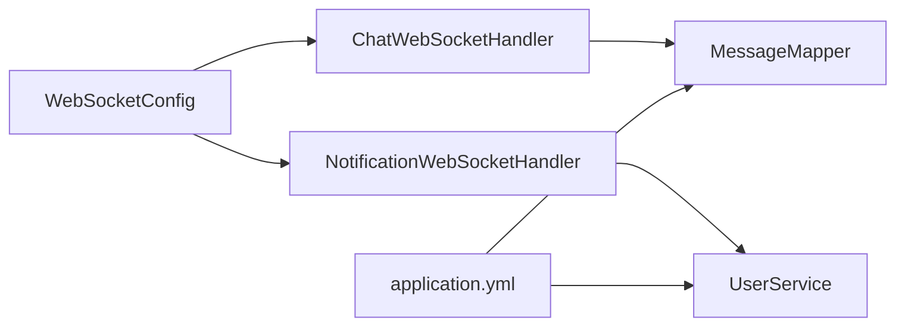

# 私信聊天系统

<cite>
**本文引用的文件**
- [ChatWebSocketHandler.java](file://campus-forum-backend/src/main/java/com/campus/forum/websocket/ChatWebSocketHandler.java)
- [NotificationWebSocketHandler.java](file://campus-forum-backend/src/main/java/com/campus/forum/websocket/NotificationWebSocketHandler.java)
- [WebSocketConfig.java](file://campus-forum-backend/src/main/java/com/campus/forum/config/WebSocketConfig.java)
- [Message.java](file://campus-forum-backend/src/main/java/com/campus/forum/entity/Message.java)
- [MessageMapper.java](file://campus-forum-backend/src/main/java/com/campus/forum/mapper/MessageMapper.java)
- [application.yml](file://campus-forum-backend/src/main/resources/application.yml)
- [UserController.java](file://campus-forum-backend/src/main/java/com/campus/forum/controller/UserController.java)
- [UserServiceImpl.java](file://campus-forum-backend/src/main/java/com/campus/forum/service/impl/UserServiceImpl.java)
- [UserMapper.java](file://campus-forum-backend/src/main/java/com/campus/forum/mapper/UserMapper.java)
- [NotificationService.java](file://campus-forum-backend/src/main/java/com/campus/forum/service/NotificationService.java)
</cite>

## 目录
1. [简介](#简介)
2. [项目结构](#项目结构)
3. [核心组件](#核心组件)
4. [架构总览](#架构总览)
5. [详细组件分析](#详细组件分析)
6. [依赖分析](#依赖分析)
7. [性能考虑](#性能考虑)
8. [故障排查指南](#故障排查指南)
9. [结论](#结论)
10. [附录](#附录)

## 简介
本文件面向私信聊天系统的技术与非技术读者，系统性阐述基于 WebSocket 的实时通信架构设计与实现要点，覆盖消息发送、接收、存储与检索流程；在线状态管理、离线消息处理与消息已读标记机制；消息类型支持与格式规范；WebSocket API 文档（连接建立、消息发送、房间管理、断线重连）；消息持久化策略、数据库设计与查询优化；以及消息加密、隐私保护与垃圾信息过滤建议。

## 项目结构
后端采用 Spring Boot + MyBatis-Plus 架构，WebSocket 相关代码集中在 websocket 包中，消息实体与持久化在 entity 与 mapper 中定义，应用配置在 application.yml 中集中管理。

图表来源
- [ChatWebSocketHandler.java:1-89](file://campus-forum-backend/src/main/java/com/campus/forum/websocket/ChatWebSocketHandler.java#L1-L89)
- [NotificationWebSocketHandler.java:1-78](file://campus-forum-backend/src/main/java/com/campus/forum/websocket/NotificationWebSocketHandler.java#L1-L78)
- [WebSocketConfig.java:1-28](file://campus-forum-backend/src/main/java/com/campus/forum/config/WebSocketConfig.java#L1-L28)
- [Message.java:1-19](file://campus-forum-backend/src/main/java/com/campus/forum/entity/Message.java#L1-L19)
- [MessageMapper.java:1-16](file://campus-forum-backend/src/main/java/com/campus/forum/mapper/MessageMapper.java#L1-L16)
- [application.yml:1-53](file://campus-forum-backend/src/main/resources/application.yml#L1-L53)

章节来源
- [WebSocketConfig.java:1-28](file://campus-forum-backend/src/main/java/com/campus/forum/config/WebSocketConfig.java#L1-L28)
- [application.yml:1-53](file://campus-forum-backend/src/main/resources/application.yml#L1-L53)

## 核心组件
- WebSocket 配置与路由
  - 注册两条 WebSocket 路由：/ws/chat（私信）、/ws/notify（系统通知）
  - 允许跨域访问，便于前端直连
- 私信处理器
  - 基于 userId 维度维护在线会话表
  - 接收消息后持久化至数据库，并向接收方实时推送
  - 从 URL 查询参数解析 userId，不支持自定义 Header（浏览器限制）
- 通知处理器
  - 维护用户到会话的映射，支持按用户推送通知
  - 提供心跳消息处理入口
- 消息实体与映射
  - 实体包含发送方、接收方、内容、已读标志与创建时间
  - 提供双向聊天历史查询 SQL
- 用户与通知服务
  - 用户服务提供关注/取关等能力
  - 通知服务接口定义通知发送、分页查询、未读计数与全部已读标记

章节来源
- [WebSocketConfig.java:15-26](file://campus-forum-backend/src/main/java/com/campus/forum/config/WebSocketConfig.java#L15-L26)
- [ChatWebSocketHandler.java:25-87](file://campus-forum-backend/src/main/java/com/campus/forum/websocket/ChatWebSocketHandler.java#L25-L87)
- [NotificationWebSocketHandler.java:20-76](file://campus-forum-backend/src/main/java/com/campus/forum/websocket/NotificationWebSocketHandler.java#L20-L76)
- [Message.java:9-18](file://campus-forum-backend/src/main/java/com/campus/forum/entity/Message.java#L9-L18)
- [MessageMapper.java:10-15](file://campus-forum-backend/src/main/java/com/campus/forum/mapper/MessageMapper.java#L10-L15)
- [UserController.java:21-82](file://campus-forum-backend/src/main/java/com/campus/forum/controller/UserController.java#L21-L82)
- [NotificationService.java:7-13](file://campus-forum-backend/src/main/java/com/campus/forum/service/NotificationService.java#L7-L13)

## 架构总览
系统采用“请求-响应”与“事件驱动”的混合模式：
- 前端通过 REST API 获取聊天历史与用户信息
- 实时消息通过 WebSocket 双向传输
- 通知通过独立的 WebSocket 管道推送

图表来源
- [ChatWebSocketHandler.java:31-75](file://campus-forum-backend/src/main/java/com/campus/forum/websocket/ChatWebSocketHandler.java#L31-L75)
- [MessageMapper.java:12-14](file://campus-forum-backend/src/main/java/com/campus/forum/mapper/MessageMapper.java#L12-L14)
- [WebSocketConfig.java:21-25](file://campus-forum-backend/src/main/java/com/campus/forum/config/WebSocketConfig.java#L21-L25)

## 详细组件分析

### 私信 WebSocket 处理器
职责与流程
- 连接建立：从 URI 查询参数提取 userId 并登记在线会话
- 消息处理：解析 JSON，构造消息实体，持久化，再向接收方推送
- 断开清理：移除会话映射

图表来源
- [ChatWebSocketHandler.java:48-75](file://campus-forum-backend/src/main/java/com/campus/forum/websocket/ChatWebSocketHandler.java#L48-L75)
- [MessageMapper.java:10-11](file://campus-forum-backend/src/main/java/com/campus/forum/mapper/MessageMapper.java#L10-L11)

章节来源
- [ChatWebSocketHandler.java:25-87](file://campus-forum-backend/src/main/java/com/campus/forum/websocket/ChatWebSocketHandler.java#L25-L87)

### 通知 WebSocket 处理器
职责与流程
- 维护用户到会话的映射
- 提供按用户推送通知的方法
- 心跳消息处理（可扩展）

图表来源
- [NotificationWebSocketHandler.java:47-57](file://campus-forum-backend/src/main/java/com/campus/forum/websocket/NotificationWebSocketHandler.java#L47-L57)

章节来源
- [NotificationWebSocketHandler.java:20-76](file://campus-forum-backend/src/main/java/com/campus/forum/websocket/NotificationWebSocketHandler.java#L20-L76)

### WebSocket 配置
- 注册两条处理器，分别对应私信与通知
- 设置允许所有来源，便于跨域调试与部署

章节来源
- [WebSocketConfig.java:15-26](file://campus-forum-backend/src/main/java/com/campus/forum/config/WebSocketConfig.java#L15-L26)

### 数据模型与持久化
消息实体字段
- id：主键
- senderId：发送方用户 ID
- receiverId：接收方用户 ID
- content：消息内容（当前为纯文本）
- isRead：已读标记（0 未读，1 已读）
- createdAt：创建时间

图表来源
- [Message.java:9-18](file://campus-forum-backend/src/main/java/com/campus/forum/entity/Message.java#L9-L18)

消息查询
- 提供双向聊天历史查询，按时间升序排列
- 用于前端首次加载或回放历史

章节来源
- [MessageMapper.java:12-14](file://campus-forum-backend/src/main/java/com/campus/forum/mapper/MessageMapper.java#L12-L14)

### 在线状态管理与会话映射
- 使用并发映射维护 userId 到 WebSocketSession 的关系
- 连接建立时登记，断开时清理
- 发送消息前检查会话是否仍处于开放状态

章节来源
- [ChatWebSocketHandler.java:27-46](file://campus-forum-backend/src/main/java/com/campus/forum/websocket/ChatWebSocketHandler.java#L27-L46)
- [NotificationWebSocketHandler.java:23-42](file://campus-forum-backend/src/main/java/com/campus/forum/websocket/NotificationWebSocketHandler.java#L23-L42)

### 离线消息处理与已读标记
现状
- 私信处理器未实现离线消息拉取逻辑
- 已读标记字段存在但未在处理器中使用

建议
- 离线消息：在连接建立时，按时间窗口查询最近离线期间的消息并下发
- 已读标记：接收方确认收到消息后，调用后端接口更新 isRead 字段，并广播已读回执

章节来源
- [Message.java:15](file://campus-forum-backend/src/main/java/com/campus/forum/entity/Message.java#L15)
- [ChatWebSocketHandler.java:64-74](file://campus-forum-backend/src/main/java/com/campus/forum/websocket/ChatWebSocketHandler.java#L64-L74)

### 消息类型支持与格式规范
现状
- 当前仅支持文本消息（content 为字符串）
- 未定义富文本、图片、文件等扩展字段

建议
- 扩展消息类型枚举与 JSON 结构，如：
  - type: "text/image/file"
  - payload: { "text": "...", "url": "...", "fileName": "...", "size": ... }
- 对文件类消息，结合后端文件上传配置进行安全校验与存储

章节来源
- [application.yml:43-46](file://campus-forum-backend/src/main/resources/application.yml#L43-L46)

### WebSocket API 文档

- 私信通道
  - 地址：ws://host:port/ws/chat?userId={userId}&token={jwt}
  - 发送消息：JSON 对象包含 receiverId、content
  - 接收消息：JSON 对象包含 type="chat"、senderId、content、time
- 通知通道
  - 地址：ws://host:port/ws/notify?userId={userId}
  - 推送通知：JSON 对象包含 type="notification"、content
- 房间管理
  - 当前未实现房间概念，私信以用户维度直接点对点推送
- 断线重连
  - 建议前端在连接断开后，携带 lastMessageId 或时间戳进行增量拉取

章节来源
- [ChatWebSocketHandler.java:20](file://campus-forum-backend/src/main/java/com/campus/forum/websocket/ChatWebSocketHandler.java#L20)
- [NotificationWebSocketHandler.java:13-16](file://campus-forum-backend/src/main/java/com/campus/forum/websocket/NotificationWebSocketHandler.java#L13-L16)
- [WebSocketConfig.java:21-25](file://campus-forum-backend/src/main/java/com/campus/forum/config/WebSocketConfig.java#L21-L25)

## 依赖分析
组件耦合与外部依赖
- ChatWebSocketHandler 依赖 MessageMapper 进行持久化
- NotificationWebSocketHandler 依赖用户上下文进行定向推送
- 应用配置提供数据源、JWT 密钥与文件上传路径
- 用户服务与映射为关注/取关等场景提供支撑

图表来源
- [ChatWebSocketHandler.java:29](file://campus-forum-backend/src/main/java/com/campus/forum/websocket/ChatWebSocketHandler.java#L29)
- [WebSocketConfig.java:17-25](file://campus-forum-backend/src/main/java/com/campus/forum/config/WebSocketConfig.java#L17-L25)
- [application.yml:9-17](file://campus-forum-backend/src/main/resources/application.yml#L9-L17)

章节来源
- [ChatWebSocketHandler.java:29](file://campus-forum-backend/src/main/java/com/campus/forum/websocket/ChatWebSocketHandler.java#L29)
- [WebSocketConfig.java:17-25](file://campus-forum-backend/src/main/java/com/campus/forum/config/WebSocketConfig.java#L17-L25)
- [application.yml:9-17](file://campus-forum-backend/src/main/resources/application.yml#L9-L17)

## 性能考虑
- 会话映射使用并发容器，避免锁竞争
- 消息持久化与实时推送分离，降低阻塞
- 历史查询按时间排序，建议在 sender_id、receiver_id 上建立联合索引
- 建议引入消息队列异步落库与推送，进一步削峰填谷

## 故障排查指南
常见问题与定位
- 连接失败
  - 检查路由是否正确（/ws/chat 或 /ws/notify）
  - 确认 userId 参数存在且可解析
- 推送失败
  - 检查接收方会话是否仍处于 open 状态
  - 查看日志中的警告信息
- 消息未入库
  - 核对 JSON 结构是否包含 receiverId、content
  - 检查数据库连接与权限
- 通知无法送达
  - 确认通知处理器中 userId 是否正确登记
  - 检查发送方法调用链路

章节来源
- [ChatWebSocketHandler.java:32-37](file://campus-forum-backend/src/main/java/com/campus/forum/websocket/ChatWebSocketHandler.java#L32-L37)
- [NotificationWebSocketHandler.java:27-32](file://campus-forum-backend/src/main/java/com/campus/forum/websocket/NotificationWebSocketHandler.java#L27-L32)
- [ChatWebSocketHandler.java:64-74](file://campus-forum-backend/src/main/java/com/campus/forum/websocket/ChatWebSocketHandler.java#L64-L74)

## 结论
该私信聊天系统以简洁的 WebSocket 架构实现了点对点实时通信，结合 REST API 完成历史拉取与用户信息管理。当前版本聚焦文本消息与基础在线状态管理，建议后续补充离线消息拉取、已读回执、多类型消息与消息加密等能力，以满足更复杂的业务需求与安全要求。

## 附录

### 数据库设计与查询优化
- 表：message
  - 字段：id、sender_id、receiver_id、content、is_read、created_at
  - 建议索引：(sender_id, receiver_id, created_at) 以加速双向历史查询
- 查询：双向聊天历史按 created_at 升序返回，便于前端滚动加载

章节来源
- [Message.java:9-18](file://campus-forum-backend/src/main/java/com/campus/forum/entity/Message.java#L9-L18)
- [MessageMapper.java:12-14](file://campus-forum-backend/src/main/java/com/campus/forum/mapper/MessageMapper.java#L12-L14)

### 隐私保护与安全建议
- 传输安全：建议在生产环境启用 wss（WebSocket Secure）
- 认证：当前通过 URL 参数传递 token，建议改为自定义 Header 或在握手阶段校验
- 内容安全：对 content 进行长度限制与敏感词过滤
- 存储安全：文件上传需限制类型与大小，开启病毒扫描与访问鉴权

章节来源
- [application.yml:31-33](file://campus-forum-backend/src/main/resources/application.yml#L31-L33)
- [application.yml:15-17](file://campus-forum-backend/src/main/resources/application.yml#L15-L17)