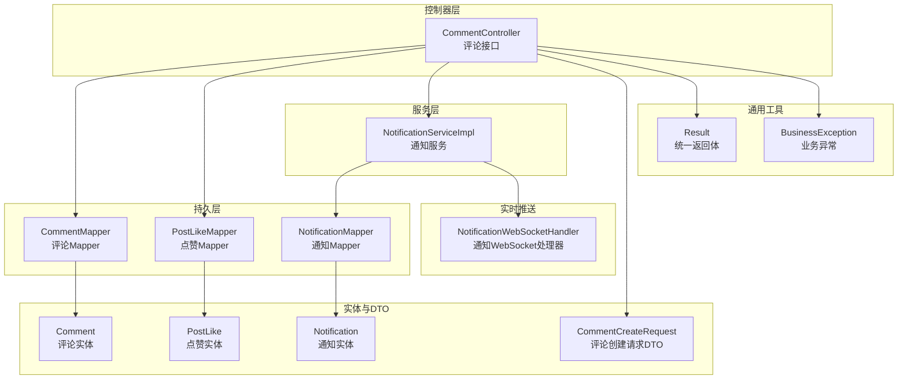
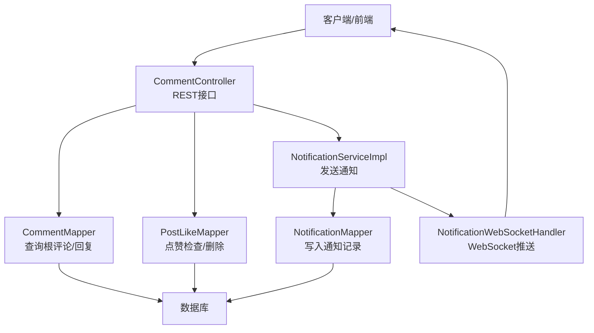
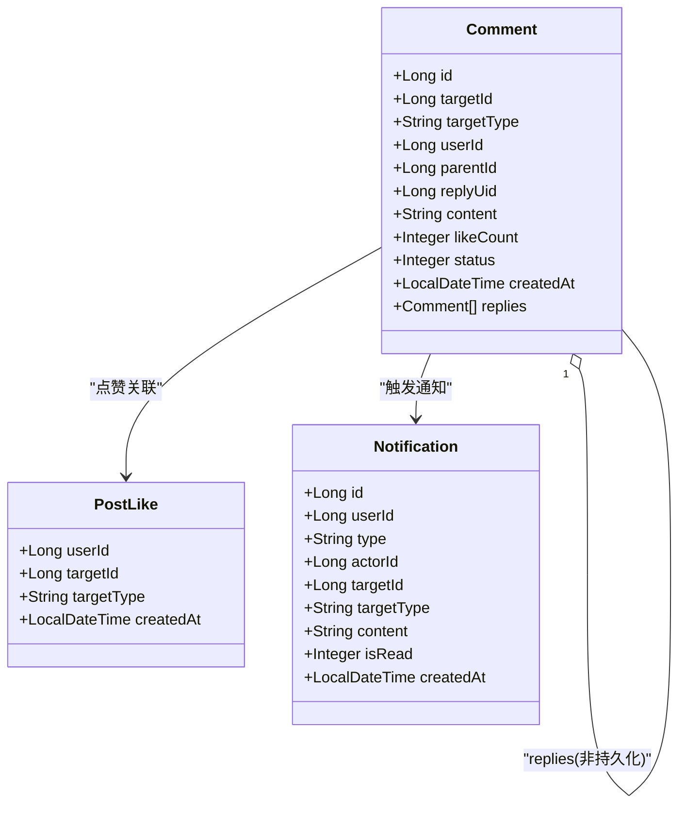
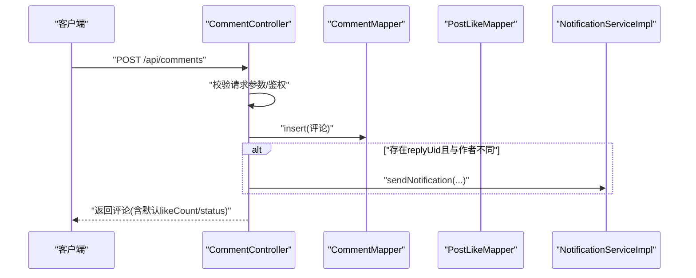
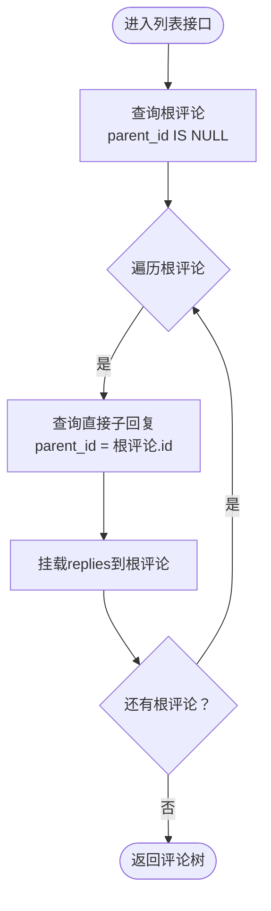
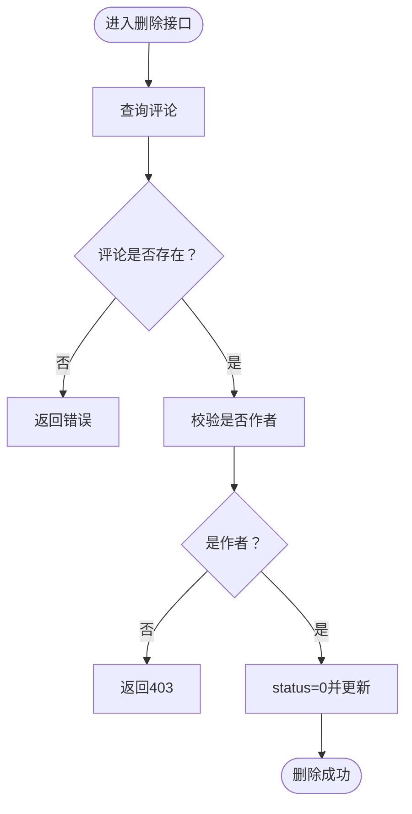
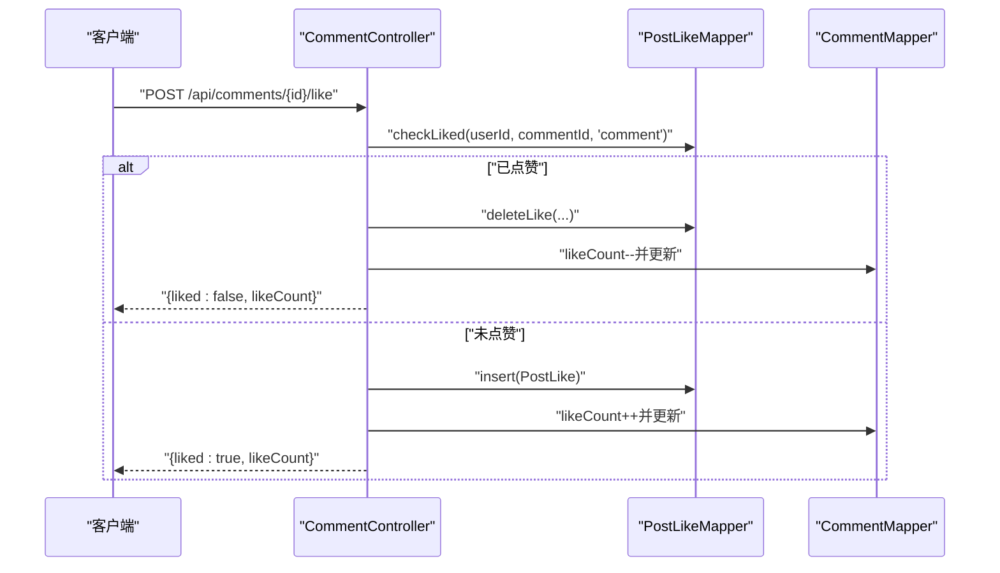
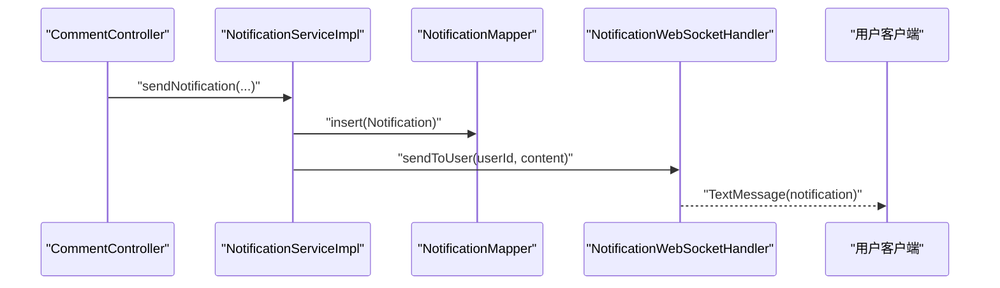
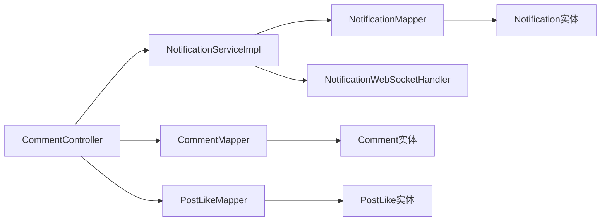
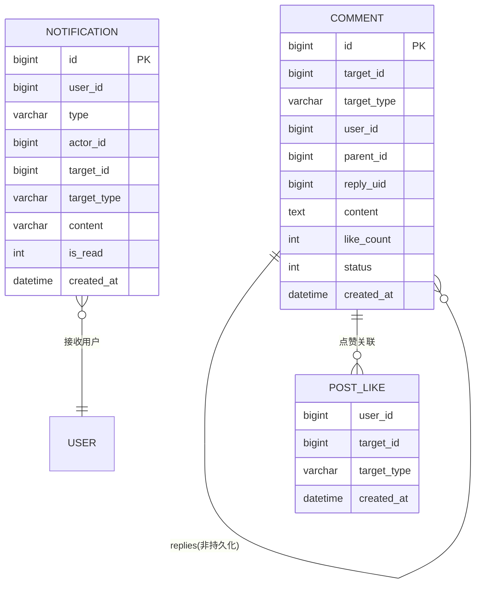

# 评论互动系统

<cite>
**本文引用的文件**
- [CommentController.java](file://campus-forum-backend/src/main/java/com/campus/forum/controller/CommentController.java)
- [Comment.java](file://campus-forum-backend/src/main/java/com/campus/forum/entity/Comment.java)
- [CommentMapper.java](file://campus-forum-backend/src/main/java/com/campus/forum/mapper/CommentMapper.java)
- [CommentCreateRequest.java](file://campus-forum-backend/src/main/java/com/campus/forum/dto/request/CommentCreateRequest.java)
- [NotificationServiceImpl.java](file://campus-forum-backend/src/main/java/com/campus/forum/service/impl/NotificationServiceImpl.java)
- [NotificationWebSocketHandler.java](file://campus-forum-backend/src/main/java/com/campus/forum/websocket/NotificationWebSocketHandler.java)
- [PostLikeMapper.java](file://campus-forum-backend/src/main/java/com/campus/forum/mapper/PostLikeMapper.java)
- [PostLike.java](file://campus-forum-backend/src/main/java/com/campus/forum/entity/PostLike.java)
- [Notification.java](file://campus-forum-backend/src/main/java/com/campus/forum/entity/Notification.java)
- [NotificationMapper.java](file://campus-forum-backend/src/main/java/com/campus/forum/mapper/NotificationMapper.java)
- [Result.java](file://campus-forum-backend/src/main/java/com/campus/forum/common/Result.java)
- [BusinessException.java](file://campus-forum-backend/src/main/java/com/campus/forum/common/exception/BusinessException.java)
</cite>

## 目录
1. [引言](#引言)
2. [项目结构](#项目结构)
3. [核心组件](#核心组件)
4. [架构总览](#架构总览)
5. [详细组件分析](#详细组件分析)
6. [依赖分析](#依赖分析)
7. [性能考虑](#性能考虑)
8. [故障排查指南](#故障排查指南)
9. [结论](#结论)
10. [附录](#附录)

## 引言
本文件面向“评论互动系统”的后端实现，围绕评论的创建、回复、删除与管理，评论树形结构设计与无限级回复支持，评论审核与内容安全，点赞、举报与屏蔽能力，统一返回体与异常体系，以及通知系统与实时推送进行系统化梳理，并给出API接口说明、数据模型与交互流程图示，帮助开发者快速理解与扩展。

## 项目结构
后端采用Spring Boot + MyBatis-Plus标准分层架构：
- 控制器层：对外暴露REST接口，负责参数校验、鉴权与调用服务层
- 服务层：封装业务逻辑，协调持久层与外部组件
- 持久层：基于MyBatis-Plus Mapper接口访问数据库
- 实体与DTO：定义数据模型与请求参数
- 通用工具：统一返回体、全局异常处理等

图表来源
- [CommentController.java:1-115](file://campus-forum-backend/src/main/java/com/campus/forum/controller/CommentController.java#L1-L115)
- [CommentMapper.java:1-19](file://campus-forum-backend/src/main/java/com/campus/forum/mapper/CommentMapper.java#L1-L19)
- [PostLikeMapper.java:1-16](file://campus-forum-backend/src/main/java/com/campus/forum/mapper/PostLikeMapper.java#L1-L16)
- [NotificationServiceImpl.java:1-58](file://campus-forum-backend/src/main/java/com/campus/forum/service/impl/NotificationServiceImpl.java#L1-L58)
- [NotificationWebSocketHandler.java:1-78](file://campus-forum-backend/src/main/java/com/campus/forum/websocket/NotificationWebSocketHandler.java#L1-L78)
- [Comment.java:1-31](file://campus-forum-backend/src/main/java/com/campus/forum/entity/Comment.java#L1-L31)
- [PostLike.java:1-16](file://campus-forum-backend/src/main/java/com/campus/forum/entity/PostLike.java#L1-L16)
- [Notification.java](file://campus-forum-backend/src/main/java/com/campus/forum/entity/Notification.java)
- [CommentCreateRequest.java:1-21](file://campus-forum-backend/src/main/java/com/campus/forum/dto/request/CommentCreateRequest.java#L1-L21)
- [Result.java:1-37](file://campus-forum-backend/src/main/java/com/campus/forum/common/Result.java#L1-L37)
- [BusinessException.java:1-22](file://campus-forum-backend/src/main/java/com/campus/forum/common/exception/BusinessException.java#L1-L22)

章节来源
- [CommentController.java:1-115](file://campus-forum-backend/src/main/java/com/campus/forum/controller/CommentController.java#L1-L115)
- [CommentMapper.java:1-19](file://campus-forum-backend/src/main/java/com/campus/forum/mapper/CommentMapper.java#L1-L19)
- [PostLikeMapper.java:1-16](file://campus-forum-backend/src/main/java/com/campus/forum/mapper/PostLikeMapper.java#L1-L16)
- [NotificationServiceImpl.java:1-58](file://campus-forum-backend/src/main/java/com/campus/forum/service/impl/NotificationServiceImpl.java#L1-L58)
- [NotificationWebSocketHandler.java:1-78](file://campus-forum-backend/src/main/java/com/campus/forum/websocket/NotificationWebSocketHandler.java#L1-L78)
- [Comment.java:1-31](file://campus-forum-backend/src/main/java/com/campus/forum/entity/Comment.java#L1-L31)
- [PostLike.java:1-16](file://campus-forum-backend/src/main/java/com/campus/forum/entity/PostLike.java#L1-L16)
- [Notification.java](file://campus-forum-backend/src/main/java/com/campus/forum/entity/Notification.java)
- [CommentCreateRequest.java:1-21](file://campus-forum-backend/src/main/java/com/campus/forum/dto/request/CommentCreateRequest.java#L1-L21)
- [Result.java:1-37](file://campus-forum-backend/src/main/java/com/campus/forum/common/Result.java#L1-L37)
- [BusinessException.java:1-22](file://campus-forum-backend/src/main/java/com/campus/forum/common/exception/BusinessException.java#L1-L22)

## 核心组件
- 评论控制器：提供评论树查询、评论/回复创建、删除、点赞等接口
- 评论实体：承载评论基础信息、层级关系与非持久化子回复列表
- 评论映射器：提供根评论与回复查询SQL
- 点赞映射器：提供点赞状态检查与删除
- 通知服务与WebSocket：异步写入通知并实时推送
- 统一返回体与业务异常：规范接口响应与错误处理

章节来源
- [CommentController.java:35-114](file://campus-forum-backend/src/main/java/com/campus/forum/controller/CommentController.java#L35-L114)
- [Comment.java:11-30](file://campus-forum-backend/src/main/java/com/campus/forum/entity/Comment.java#L11-L30)
- [CommentMapper.java:10-18](file://campus-forum-backend/src/main/java/com/campus/forum/mapper/CommentMapper.java#L10-L18)
- [PostLikeMapper.java:8-15](file://campus-forum-backend/src/main/java/com/campus/forum/mapper/PostLikeMapper.java#L8-L15)
- [NotificationServiceImpl.java:18-57](file://campus-forum-backend/src/main/java/com/campus/forum/service/impl/NotificationServiceImpl.java#L18-L57)
- [NotificationWebSocketHandler.java:20-77](file://campus-forum-backend/src/main/java/com/campus/forum/websocket/NotificationWebSocketHandler.java#L20-L77)
- [Result.java:8-36](file://campus-forum-backend/src/main/java/com/campus/forum/common/Result.java#L8-L36)
- [BusinessException.java:8-21](file://campus-forum-backend/src/main/java/com/campus/forum/common/exception/BusinessException.java#L8-L21)

## 架构总览
下图展示评论模块在整体系统中的位置与交互关系：

图表来源
- [CommentController.java:25-114](file://campus-forum-backend/src/main/java/com/campus/forum/controller/CommentController.java#L25-L114)
- [CommentMapper.java:10-18](file://campus-forum-backend/src/main/java/com/campus/forum/mapper/CommentMapper.java#L10-L18)
- [PostLikeMapper.java:8-15](file://campus-forum-backend/src/main/java/com/campus/forum/mapper/PostLikeMapper.java#L8-L15)
- [NotificationServiceImpl.java:18-57](file://campus-forum-backend/src/main/java/com/campus/forum/service/impl/NotificationServiceImpl.java#L18-L57)
- [NotificationWebSocketHandler.java:20-77](file://campus-forum-backend/src/main/java/com/campus/forum/websocket/NotificationWebSocketHandler.java#L20-L77)

## 详细组件分析

### 评论树形结构与无限级回复
- 设计要点
  - 评论具备层级关系：根评论parent_id为空；回复的parent_id指向父评论
  - 非持久化字段replies用于承载子回复列表，便于一次查询后组装树
  - 查询策略：先查根评论，再为每个根评论加载其直接子回复
- 数据模型
  - 评论实体包含targetId/targetType标识所属目标（如帖子或活动）、userId、parentId、replyUid（被回复用户）、content、likeCount、status等
  - 根评论按创建时间升序排列，保证展示顺序稳定

图表来源
- [Comment.java:11-30](file://campus-forum-backend/src/main/java/com/campus/forum/entity/Comment.java#L11-L30)
- [PostLike.java:8-15](file://campus-forum-backend/src/main/java/com/campus/forum/entity/PostLike.java#L8-L15)
- [Notification.java:7-22](file://campus-forum-backend/src/main/java/com/campus/forum/entity/Notification.java#L7-L22)

章节来源
- [Comment.java:11-30](file://campus-forum-backend/src/main/java/com/campus/forum/entity/Comment.java#L11-L30)
- [CommentMapper.java:12-17](file://campus-forum-backend/src/main/java/com/campus/forum/mapper/CommentMapper.java#L12-L17)

### 评论创建与回复流程
- 创建入口
  - 接收CommentCreateRequest，包含targetId、targetType、content、parentId、replyUid
  - 设置默认likeCount、status、createdAt
  - 插入数据库后触发通知（当存在replyUid且与当前用户不同）
- 回复流程
  - 当parentId非空时，视为回复；replyUid用于通知被回复者
- 权限控制
  - 删除接口要求评论作者才能删除

图表来源
- [CommentController.java:46-71](file://campus-forum-backend/src/main/java/com/campus/forum/controller/CommentController.java#L46-L71)
- [CommentMapper.java:10-18](file://campus-forum-backend/src/main/java/com/campus/forum/mapper/CommentMapper.java#L10-L18)
- [PostLikeMapper.java:8-15](file://campus-forum-backend/src/main/java/com/campus/forum/mapper/PostLikeMapper.java#L8-L15)
- [NotificationServiceImpl.java:23-37](file://campus-forum-backend/src/main/java/com/campus/forum/service/impl/NotificationServiceImpl.java#L23-L37)

章节来源
- [CommentController.java:46-71](file://campus-forum-backend/src/main/java/com/campus/forum/controller/CommentController.java#L46-L71)
- [CommentCreateRequest.java:8-20](file://campus-forum-backend/src/main/java/com/campus/forum/dto/request/CommentCreateRequest.java#L8-L20)

### 评论树查询与渲染
- 查询策略
  - 先查询根评论：parent_id为空，按创建时间升序
  - 对每个根评论，查询其直接子回复并挂载到replies
- 展示顺序
  - 根评论与子回复均按创建时间升序，确保线性时间内的稳定展示

图表来源
- [CommentController.java:35-44](file://campus-forum-backend/src/main/java/com/campus/forum/controller/CommentController.java#L35-L44)
- [CommentMapper.java:12-17](file://campus-forum-backend/src/main/java/com/campus/forum/mapper/CommentMapper.java#L12-L17)

章节来源
- [CommentController.java:35-44](file://campus-forum-backend/src/main/java/com/campus/forum/controller/CommentController.java#L35-L44)
- [CommentMapper.java:12-17](file://campus-forum-backend/src/main/java/com/campus/forum/mapper/CommentMapper.java#L12-L17)

### 评论删除与权限控制
- 删除条件
  - 仅评论作者可删除；删除时将status置为0（软删除）
- 安全性
  - 接口鉴权基于当前登录用户ID与评论作者ID比对

图表来源
- [CommentController.java:73-86](file://campus-forum-backend/src/main/java/com/campus/forum/controller/CommentController.java#L73-L86)

章节来源
- [CommentController.java:73-86](file://campus-forum-backend/src/main/java/com/campus/forum/controller/CommentController.java#L73-L86)

### 点赞与取消点赞
- 状态检查
  - 使用PostLikeMapper检查当前用户对某条评论是否已点赞
- 事务一致性
  - 点赞/取消点赞与评论likeCount更新在同一事务内完成
- 返回值
  - 返回当前点赞状态与最新点赞数

图表来源
- [CommentController.java:88-113](file://campus-forum-backend/src/main/java/com/campus/forum/controller/CommentController.java#L88-L113)
- [PostLikeMapper.java:10-14](file://campus-forum-backend/src/main/java/com/campus/forum/mapper/PostLikeMapper.java#L10-L14)
- [Comment.java:23](file://campus-forum-backend/src/main/java/com/campus/forum/entity/Comment.java#L23)

章节来源
- [CommentController.java:88-113](file://campus-forum-backend/src/main/java/com/campus/forum/controller/CommentController.java#L88-L113)
- [PostLikeMapper.java:10-14](file://campus-forum-backend/src/main/java/com/campus/forum/mapper/PostLikeMapper.java#L10-L14)

### 通知系统与实时推送
- 通知生成
  - 通知服务写入Notification记录，标记未读
- 实时推送
  - 通过WebSocket向目标用户推送消息
- 用户体验
  - 前端可通过WebSocket接收实时通知

图表来源
- [CommentController.java:64-70](file://campus-forum-backend/src/main/java/com/campus/forum/controller/CommentController.java#L64-L70)
- [NotificationServiceImpl.java:23-37](file://campus-forum-backend/src/main/java/com/campus/forum/service/impl/NotificationServiceImpl.java#L23-L37)
- [NotificationWebSocketHandler.java:47-57](file://campus-forum-backend/src/main/java/com/campus/forum/websocket/NotificationWebSocketHandler.java#L47-L57)
- [Notification.java:9-22](file://campus-forum-backend/src/main/java/com/campus/forum/entity/Notification.java#L9-L22)

章节来源
- [NotificationServiceImpl.java:18-57](file://campus-forum-backend/src/main/java/com/campus/forum/service/impl/NotificationServiceImpl.java#L18-L57)
- [NotificationWebSocketHandler.java:20-77](file://campus-forum-backend/src/main/java/com/campus/forum/websocket/NotificationWebSocketHandler.java#L20-L77)
- [Notification.java:9-22](file://campus-forum-backend/src/main/java/com/campus/forum/entity/Notification.java#L9-L22)

### 统一返回体与异常处理
- 统一返回体Result提供success/error静态方法，规范接口响应
- BusinessException提供业务异常封装，便于控制器抛出与全局异常处理

章节来源
- [Result.java:8-36](file://campus-forum-backend/src/main/java/com/campus/forum/common/Result.java#L8-L36)
- [BusinessException.java:8-21](file://campus-forum-backend/src/main/java/com/campus/forum/common/exception/BusinessException.java#L8-L21)

## 依赖分析
- 控制器依赖
  - CommentController依赖CommentMapper、PostLikeMapper与NotificationService
- 服务依赖
  - NotificationServiceImpl依赖NotificationMapper与WebSocket处理器
- 实体依赖
  - Comment与PostLike、Notification分别对应数据库表
- 查询依赖
  - CommentMapper提供根评论与回复查询
  - PostLikeMapper提供点赞状态检查与删除

图表来源
- [CommentController.java:31-33](file://campus-forum-backend/src/main/java/com/campus/forum/controller/CommentController.java#L31-L33)
- [CommentMapper.java:10-18](file://campus-forum-backend/src/main/java/com/campus/forum/mapper/CommentMapper.java#L10-L18)
- [PostLikeMapper.java:8-15](file://campus-forum-backend/src/main/java/com/campus/forum/mapper/PostLikeMapper.java#L8-L15)
- [NotificationServiceImpl.java:20-21](file://campus-forum-backend/src/main/java/com/campus/forum/service/impl/NotificationServiceImpl.java#L20-L21)
- [NotificationWebSocketHandler.java:22-24](file://campus-forum-backend/src/main/java/com/campus/forum/websocket/NotificationWebSocketHandler.java#L22-L24)
- [Comment.java:13-29](file://campus-forum-backend/src/main/java/com/campus/forum/entity/Comment.java#L13-L29)
- [PostLike.java:8-15](file://campus-forum-backend/src/main/java/com/campus/forum/entity/PostLike.java#L8-L15)
- [Notification.java:7-22](file://campus-forum-backend/src/main/java/com/campus/forum/entity/Notification.java#L7-L22)

章节来源
- [CommentController.java:31-33](file://campus-forum-backend/src/main/java/com/campus/forum/controller/CommentController.java#L31-L33)
- [NotificationServiceImpl.java:20-21](file://campus-forum-backend/src/main/java/com/campus/forum/service/impl/NotificationServiceImpl.java#L20-L21)
- [NotificationWebSocketHandler.java:22-24](file://campus-forum-backend/src/main/java/com/campus/forum/websocket/NotificationWebSocketHandler.java#L22-L24)

## 性能考虑
- 查询优化
  - 根评论与回复查询均按created_at升序，适合线性扫描与分页
  - 可在parent_id与status上建立索引以提升查询效率
- 写入优化
  - 评论创建与通知写入建议保持在同一事务，避免状态不一致
- 实时推送
  - WebSocket连接按userId维护映射，注意连接断开后的清理
- 扩展建议
  - 评论树渲染可在服务层缓存根节点与直接子回复，减少重复查询
  - 点赞统计可引入独立计数表或延迟聚合，降低热点写入压力

## 故障排查指南
- 评论不存在或无权限删除
  - 检查评论ID与作者ID匹配；确认删除接口鉴权逻辑
- 点赞状态异常
  - 核对PostLikeMapper的checkLiked/deleteLike逻辑；确保事务提交
- 通知未送达
  - 检查WebSocket连接是否建立成功；确认userId参数传递正确
- 统一返回体
  - 使用Result.success/error确保前后端契约一致

章节来源
- [CommentController.java:73-86](file://campus-forum-backend/src/main/java/com/campus/forum/controller/CommentController.java#L73-L86)
- [PostLikeMapper.java:10-14](file://campus-forum-backend/src/main/java/com/campus/forum/mapper/PostLikeMapper.java#L10-L14)
- [NotificationWebSocketHandler.java:26-42](file://campus-forum-backend/src/main/java/com/campus/forum/websocket/NotificationWebSocketHandler.java#L26-L42)
- [Result.java:14-35](file://campus-forum-backend/src/main/java/com/campus/forum/common/Result.java#L14-L35)

## 结论
该评论互动系统以简洁的树形结构与清晰的职责划分实现了评论的创建、回复、删除与点赞等核心功能，并通过通知与WebSocket提供了良好的实时反馈。后续可在查询索引、缓存与热点写入优化方面进一步提升性能与可扩展性。

## 附录

### API 接口文档

- 获取评论树（帖子/活动通用）
  - 方法：GET
  - 路径：/api/comments
  - 参数：
    - targetId：目标ID（Long，必填）
    - targetType：目标类型（post/activity，必填）
  - 返回：根评论列表，每个根评论包含replies子回复
  - 章节来源
    - [CommentController.java:35-44](file://campus-forum-backend/src/main/java/com/campus/forum/controller/CommentController.java#L35-L44)
    - [CommentMapper.java:12-17](file://campus-forum-backend/src/main/java/com/campus/forum/mapper/CommentMapper.java#L12-L17)

- 发表评论/回复
  - 方法：POST
  - 路径：/api/comments
  - 请求体：CommentCreateRequest
    - targetId：目标ID（Long，必填）
    - targetType：目标类型（post/activity，必填）
    - content：评论内容（String，必填）
    - parentId：父评论ID（Long，可选）
    - replyUid：被回复用户ID（Long，可选）
  - 返回：新创建的评论
  - 章节来源
    - [CommentController.java:46-71](file://campus-forum-backend/src/main/java/com/campus/forum/controller/CommentController.java#L46-L71)
    - [CommentCreateRequest.java:8-20](file://campus-forum-backend/src/main/java/com/campus/forum/dto/request/CommentCreateRequest.java#L8-L20)

- 删除评论
  - 方法：DELETE
  - 路径：/api/comments/{id}
  - 路径参数：id（Long，必填）
  - 返回：成功/失败
  - 章节来源
    - [CommentController.java:73-86](file://campus-forum-backend/src/main/java/com/campus/forum/controller/CommentController.java#L73-L86)

- 评论点赞
  - 方法：POST
  - 路径：/api/comments/{id}/like
  - 路径参数：id（Long，必填）
  - 返回：{liked: boolean, likeCount: number}
  - 章节来源
    - [CommentController.java:88-113](file://campus-forum-backend/src/main/java/com/campus/forum/controller/CommentController.java#L88-L113)
    - [PostLikeMapper.java:10-14](file://campus-forum-backend/src/main/java/com/campus/forum/mapper/PostLikeMapper.java#L10-L14)

### 数据模型

图表来源
- [Comment.java:13-29](file://campus-forum-backend/src/main/java/com/campus/forum/entity/Comment.java#L13-L29)
- [PostLike.java:8-15](file://campus-forum-backend/src/main/java/com/campus/forum/entity/PostLike.java#L8-L15)
- [Notification.java:7-22](file://campus-forum-backend/src/main/java/com/campus/forum/entity/Notification.java#L7-L22)

### 评论排序与推荐（概念性说明）
- 排序算法
  - 根评论与子回复按创建时间升序，保证线性展示顺序稳定
- 热度计算
  - 可结合点赞数、回复数与时间衰减因子构建简单热度分，作为排序权重
- 推荐机制
  - 基于用户兴趣标签与历史行为，筛选相关目标下的高热度评论进行推荐
- 注意事项
  - 上述为概念性建议，具体实现需评估性能与业务需求