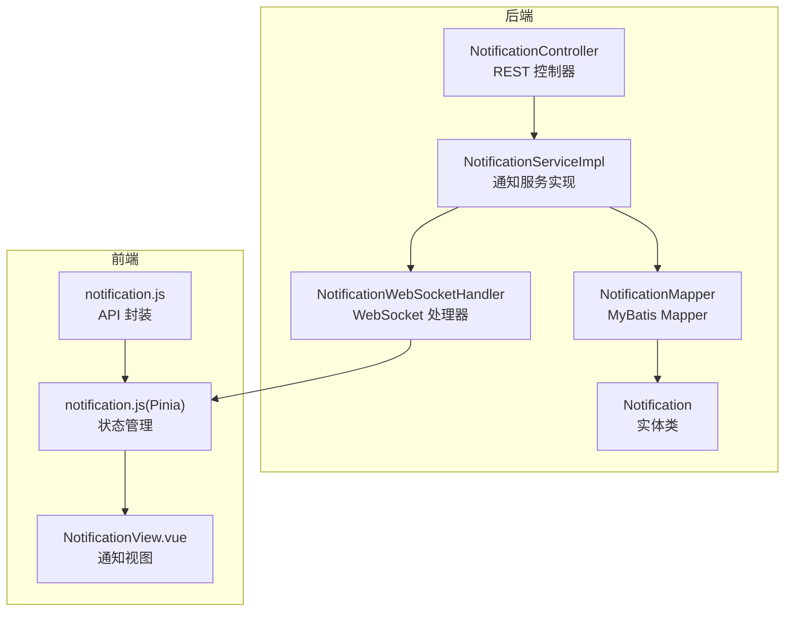
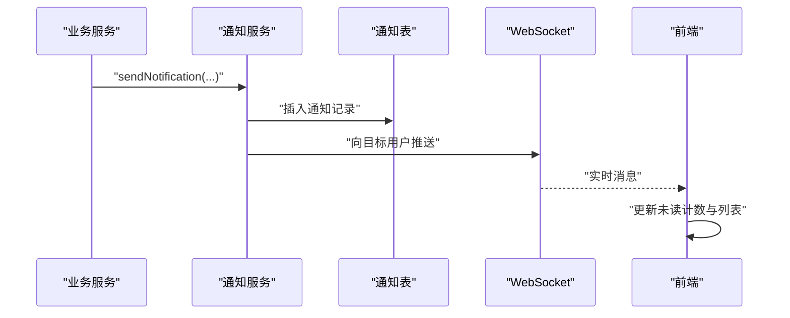
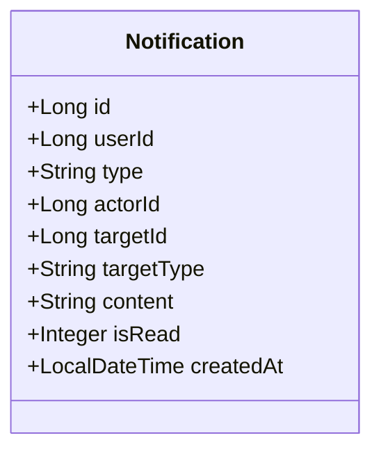
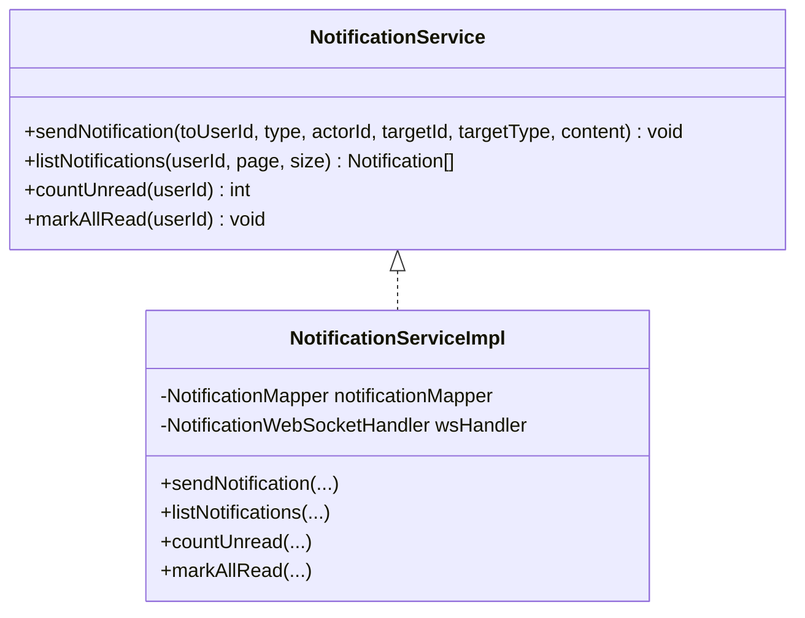
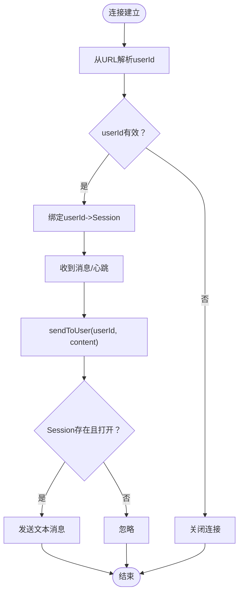
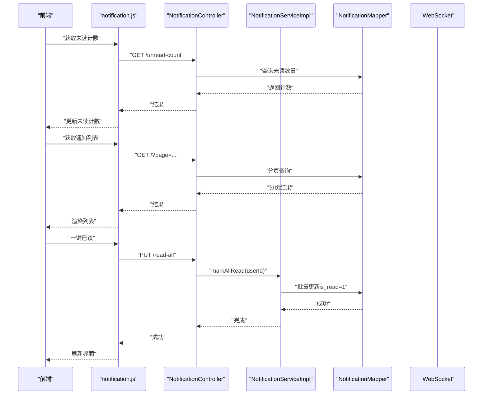
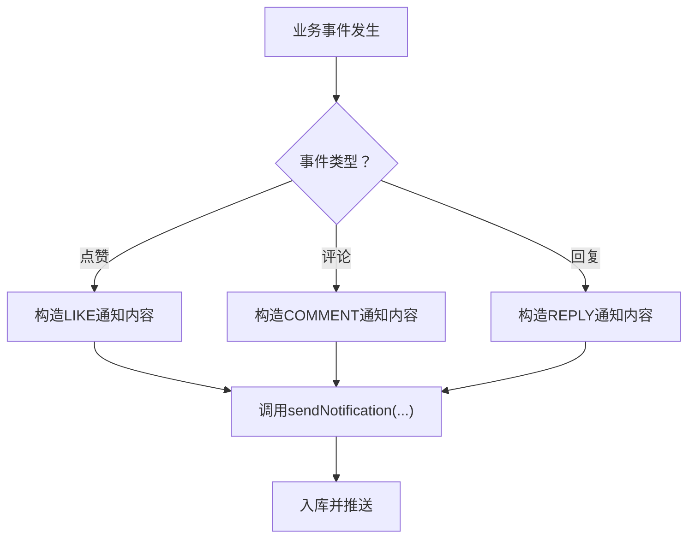
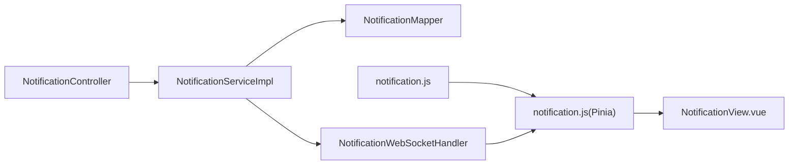

# 通知系统

<cite>
**本文引用的文件**
- [NotificationController.java](file://campus-forum-backend/src/main/java/com/campus/forum/controller/NotificationController.java)
- [NotificationService.java](file://campus-forum-backend/src/main/java/com/campus/forum/service/NotificationService.java)
- [NotificationServiceImpl.java](file://campus-forum-backend/src/main/java/com/campus/forum/service/impl/NotificationServiceImpl.java)
- [Notification.java](file://campus-forum-backend/src/main/java/com/campus/forum/entity/Notification.java)
- [NotificationMapper.java](file://campus-forum-backend/src/main/java/com/campus/forum/mapper/NotificationMapper.java)
- [NotificationWebSocketHandler.java](file://campus-forum-backend/src/main/java/com/campus/forum/websocket/NotificationWebSocketHandler.java)
- [application.yml](file://campus-forum-backend/src/main/resources/application.yml)
- [CommentController.java](file://campus-forum-backend/src/main/java/com/campus/forum/controller/CommentController.java)
- [ActivityServiceImpl.java](file://campus-forum-backend/src/main/java/com/campus/forum/service/impl/ActivityServiceImpl.java)
- [PostServiceImpl.java](file://campus-forum-backend/src/main/java/com/campus/forum/service/impl/PostServiceImpl.java)
- [notification.js](file://campus-forum-frontend/src/api/notification.js)
- [notification.js（Pinia Store）](file://campus-forum-frontend/src/stores/notification.js)
- [NotificationView.vue](file://campus-forum-frontend/src/views/NotificationView.vue)
</cite>

## 目录
1. [简介](#简介)
2. [项目结构](#项目结构)
3. [核心组件](#核心组件)
4. [架构总览](#架构总览)
5. [详细组件分析](#详细组件分析)
6. [依赖分析](#依赖分析)
7. [性能考虑](#性能考虑)
8. [故障排查指南](#故障排查指南)
9. [结论](#结论)
10. [附录](#附录)

## 简介
本通知系统为校园论坛后端与前端协同构建的消息推送与展示模块，覆盖以下能力：
- 通知类型：系统通知、互动通知（点赞、评论、回复）、活动相关通知等
- 通知生成：基于业务事件（如点赞、评论、回复）自动触发
- 实时推送：通过 WebSocket 将新通知推送到对应用户
- 存储与查询：基于数据库的持久化存储、分页查询、未读计数
- 批量操作：一键已读、按条目标记已读
- 前端集成：通知中心页面、未读计数联动、实时消息接收

## 项目结构
通知系统由后端控制器、服务层、数据访问层、WebSocket 处理器以及前端 API 与状态管理组成。

**图表来源**
- [NotificationController.java:1-67](file://campus-forum-backend/src/main/java/com/campus/forum/controller/NotificationController.java#L1-L67)
- [NotificationServiceImpl.java:1-58](file://campus-forum-backend/src/main/java/com/campus/forum/service/impl/NotificationServiceImpl.java#L1-L58)
- [NotificationMapper.java:1-16](file://campus-forum-backend/src/main/java/com/campus/forum/mapper/NotificationMapper.java#L1-L16)
- [Notification.java:1-23](file://campus-forum-backend/src/main/java/com/campus/forum/entity/Notification.java#L1-L23)
- [NotificationWebSocketHandler.java:1-78](file://campus-forum-backend/src/main/java/com/campus/forum/websocket/NotificationWebSocketHandler.java#L1-L78)
- [notification.js:1-6](file://campus-forum-frontend/src/api/notification.js#L1-L6)
- [notification.js（Pinia Store）:1-31](file://campus-forum-frontend/src/stores/notification.js#L1-L31)
- [NotificationView.vue:1-28](file://campus-forum-frontend/src/views/NotificationView.vue#L1-L28)

**章节来源**
- [NotificationController.java:1-67](file://campus-forum-backend/src/main/java/com/campus/forum/controller/NotificationController.java#L1-L67)
- [NotificationServiceImpl.java:1-58](file://campus-forum-backend/src/main/java/com/campus/forum/service/impl/NotificationServiceImpl.java#L1-L58)
- [NotificationMapper.java:1-16](file://campus-forum-backend/src/main/java/com/campus/forum/mapper/NotificationMapper.java#L1-L16)
- [Notification.java:1-23](file://campus-forum-backend/src/main/java/com/campus/forum/entity/Notification.java#L1-L23)
- [NotificationWebSocketHandler.java:1-78](file://campus-forum-backend/src/main/java/com/campus/forum/websocket/NotificationWebSocketHandler.java#L1-L78)
- [notification.js:1-6](file://campus-forum-frontend/src/api/notification.js#L1-L6)
- [notification.js（Pinia Store）:1-31](file://campus-forum-frontend/src/stores/notification.js#L1-L31)
- [NotificationView.vue:1-28](file://campus-forum-frontend/src/views/NotificationView.vue#L1-L28)

## 核心组件
- 控制器层：提供通知列表、未读计数、一键已读、单条已读等接口
- 服务层：封装通知发送、分页查询、未读计数、批量已读
- 数据访问层：基于 MyBatis Plus 的通用 Mapper，补充未读计数与批量已读 SQL
- WebSocket 层：维护用户会话映射，向指定用户推送通知
- 前端层：API 封装、Pinia 状态管理、通知视图渲染与交互

**章节来源**
- [NotificationController.java:26-65](file://campus-forum-backend/src/main/java/com/campus/forum/controller/NotificationController.java#L26-L65)
- [NotificationService.java:7-13](file://campus-forum-backend/src/main/java/com/campus/forum/service/NotificationService.java#L7-L13)
- [NotificationServiceImpl.java:23-56](file://campus-forum-backend/src/main/java/com/campus/forum/service/impl/NotificationServiceImpl.java#L23-L56)
- [NotificationMapper.java:10-14](file://campus-forum-backend/src/main/java/com/campus/forum/mapper/NotificationMapper.java#L10-L14)
- [NotificationWebSocketHandler.java:47-57](file://campus-forum-backend/src/main/java/com/campus/forum/websocket/NotificationWebSocketHandler.java#L47-L57)
- [notification.js:2-5](file://campus-forum-frontend/src/api/notification.js#L2-L5)
- [notification.js（Pinia Store）:9-23](file://campus-forum-frontend/src/stores/notification.js#L9-L23)
- [NotificationView.vue:3-11](file://campus-forum-frontend/src/views/NotificationView.vue#L3-L11)

## 架构总览
通知从“业务事件”出发，经“服务层”写入数据库并触发“WebSocket 推送”，前端通过“API 与状态管理”拉取与展示，并在用户交互时进行“批量或单项已读”。

**图表来源**
- [ActivityServiceImpl.java:106-108](file://campus-forum-backend/src/main/java/com/campus/forum/service/impl/ActivityServiceImpl.java#L106-L108)
- [PostServiceImpl.java:99-101](file://campus-forum-backend/src/main/java/com/campus/forum/service/impl/PostServiceImpl.java#L99-L101)
- [CommentController.java:64-69](file://campus-forum-backend/src/main/java/com/campus/forum/controller/CommentController.java#L64-L69)
- [NotificationServiceImpl.java:24-37](file://campus-forum-backend/src/main/java/com/campus/forum/service/impl/NotificationServiceImpl.java#L24-L37)
- [NotificationWebSocketHandler.java:47-57](file://campus-forum-backend/src/main/java/com/campus/forum/websocket/NotificationWebSocketHandler.java#L47-L57)
- [notification.js（Pinia Store）:9-23](file://campus-forum-frontend/src/stores/notification.js#L9-L23)

## 详细组件分析

### 通知实体与数据模型
- 字段要点：用户 ID、通知类型、动作者 ID、目标 ID、目标类型、内容、是否已读、创建时间
- 通知类型：包含 LIKE、COMMENT、REPLY、FOLLOW、SYSTEM、REGISTER 等
- 时间字段采用自动填充，确保一致性

**图表来源**
- [Notification.java:9-22](file://campus-forum-backend/src/main/java/com/campus/forum/entity/Notification.java#L9-L22)

**章节来源**
- [Notification.java:13-19](file://campus-forum-backend/src/main/java/com/campus/forum/entity/Notification.java#L13-L19)

### 通知服务与业务触发
- 服务接口定义：发送通知、分页查询、未读计数、批量已读
- 具体实现：写库后通过 WebSocket 推送；业务侧在点赞、评论、回复等场景调用发送

**图表来源**
- [NotificationService.java:7-13](file://campus-forum-backend/src/main/java/com/campus/forum/service/NotificationService.java#L7-L13)
- [NotificationServiceImpl.java:18-57](file://campus-forum-backend/src/main/java/com/campus/forum/service/impl/NotificationServiceImpl.java#L18-L57)

**章节来源**
- [NotificationService.java:8-12](file://campus-forum-backend/src/main/java/com/campus/forum/service/NotificationService.java#L8-L12)
- [NotificationServiceImpl.java:23-56](file://campus-forum-backend/src/main/java/com/campus/forum/service/impl/NotificationServiceImpl.java#L23-L56)

### WebSocket 实时推送
- 维护 userId 到 WebSocketSession 的并发映射
- 通过 URL 查询参数携带用户标识（兼容浏览器限制）
- 发送格式统一为 JSON，包含类型与内容键

**图表来源**
- [NotificationWebSocketHandler.java:26-76](file://campus-forum-backend/src/main/java/com/campus/forum/websocket/NotificationWebSocketHandler.java#L26-L76)

**章节来源**
- [NotificationWebSocketHandler.java:47-57](file://campus-forum-backend/src/main/java/com/campus/forum/websocket/NotificationWebSocketHandler.java#L47-L57)

### 控制器与前端对接
- 控制器提供分页列表、未读计数、批量已读、单条已读接口
- 前端通过 API 封装与 Pinia 状态管理完成数据拉取与本地更新
- 通知视图负责渲染与交互

**图表来源**
- [NotificationController.java:26-65](file://campus-forum-backend/src/main/java/com/campus/forum/controller/NotificationController.java#L26-L65)
- [NotificationServiceImpl.java:53-56](file://campus-forum-backend/src/main/java/com/campus/forum/service/impl/NotificationServiceImpl.java#L53-L56)
- [NotificationMapper.java:10-14](file://campus-forum-backend/src/main/java/com/campus/forum/mapper/NotificationMapper.java#L10-L14)
- [notification.js:2-5](file://campus-forum-frontend/src/api/notification.js#L2-L5)
- [notification.js（Pinia Store）:9-23](file://campus-forum-frontend/src/stores/notification.js#L9-L23)

**章节来源**
- [NotificationController.java:26-65](file://campus-forum-backend/src/main/java/com/campus/forum/controller/NotificationController.java#L26-L65)
- [notification.js:2-5](file://campus-forum-frontend/src/api/notification.js#L2-L5)
- [notification.js（Pinia Store）:9-23](file://campus-forum-frontend/src/stores/notification.js#L9-L23)
- [NotificationView.vue:3-11](file://campus-forum-frontend/src/views/NotificationView.vue#L3-L11)

### 通知类型与触发条件
- 类型定义：LIKE、COMMENT、REPLY、FOLLOW、SYSTEM、REGISTER
- 触发示例：
  - 点赞：活动或文章被点赞时，向作者发送“LIKE”通知
  - 评论/回复：评论被回复时，向被回复者发送“REPLY/COMMENT”通知
- 内容：当前以固定文案形式注入，便于演示；实际可扩展为模板与多语言

**图表来源**
- [ActivityServiceImpl.java:106-108](file://campus-forum-backend/src/main/java/com/campus/forum/service/impl/ActivityServiceImpl.java#L106-L108)
- [PostServiceImpl.java:99-101](file://campus-forum-backend/src/main/java/com/campus/forum/service/impl/PostServiceImpl.java#L99-L101)
- [CommentController.java:64-69](file://campus-forum-backend/src/main/java/com/campus/forum/controller/CommentController.java#L64-L69)
- [NotificationServiceImpl.java:24-37](file://campus-forum-backend/src/main/java/com/campus/forum/service/impl/NotificationServiceImpl.java#L24-L37)

**章节来源**
- [Notification.java:13-14](file://campus-forum-backend/src/main/java/com/campus/forum/entity/Notification.java#L13-L14)
- [ActivityServiceImpl.java:106-108](file://campus-forum-backend/src/main/java/com/campus/forum/service/impl/ActivityServiceImpl.java#L106-L108)
- [PostServiceImpl.java:99-101](file://campus-forum-backend/src/main/java/com/campus/forum/service/impl/PostServiceImpl.java#L99-L101)
- [CommentController.java:64-69](file://campus-forum-backend/src/main/java/com/campus/forum/controller/CommentController.java#L64-L69)

### 存储策略、过期与批量处理
- 存储：基于 MySQL 的通知表，使用 MyBatis Plus 持久化
- 分页与排序：按创建时间倒序分页查询
- 未读计数：SQL 直接统计未读数量
- 批量已读：一次更新所有未读标记
- 过期清理：当前代码未实现自动过期清理，建议后续引入 TTL 或定期任务清理历史通知

**章节来源**
- [NotificationMapper.java:10-14](file://campus-forum-backend/src/main/java/com/campus/forum/mapper/NotificationMapper.java#L10-L14)
- [NotificationController.java:28-38](file://campus-forum-backend/src/main/java/com/campus/forum/controller/NotificationController.java#L28-L38)

### 实时推送、延迟通知与重复抑制
- 实时推送：服务层写库后立即通过 WebSocket 推送
- 延迟通知：当前未实现延迟队列或定时任务，可在业务侧扩展
- 重复抑制：当前未实现去重逻辑，可在发送前按用户、目标、类型做幂等判断

**章节来源**
- [NotificationServiceImpl.java:35-36](file://campus-forum-backend/src/main/java/com/campus/forum/service/impl/NotificationServiceImpl.java#L35-L36)
- [NotificationWebSocketHandler.java:47-57](file://campus-forum-backend/src/main/java/com/campus/forum/websocket/NotificationWebSocketHandler.java#L47-L57)

### 通知 API 接口文档
- 获取通知列表（分页）
  - 方法与路径：GET /api/notifications
  - 请求参数：page（默认1）、size（默认20）
  - 返回：分页结果，按创建时间倒序
- 未读数量
  - 方法与路径：GET /api/notifications/unread-count
  - 返回：未读计数
- 标记全部为已读
  - 方法与路径：PUT /api/notifications/read-all
  - 返回：成功
- 标记单条为已读
  - 方法与路径：PUT /api/notifications/{id}/read
  - 返回：成功

**章节来源**
- [NotificationController.java:26-65](file://campus-forum-backend/src/main/java/com/campus/forum/controller/NotificationController.java#L26-L65)

### 通知模板系统、多语言与个性化
- 当前实现：通知内容为硬编码字符串，便于快速演示
- 可扩展方向：
  - 模板引擎：基于占位符与变量替换生成内容
  - 多语言：根据用户语言偏好选择文案
  - 个性化：结合用户订阅偏好与行为画像动态调整内容与样式

[本节为概念性说明，不直接分析具体文件]

### 通知统计分析、效果评估与体验优化
- 统计指标：未读率、点击率、留存影响等
- 评估方法：A/B 实验对比不同通知策略
- 体验优化：减少打扰、提升相关性、提供关闭选项与偏好设置

[本节为概念性说明，不直接分析具体文件]

## 依赖分析
- 控制器依赖服务与 Mapper，服务依赖 WebSocket 处理器与 Mapper
- 前端通过 API 封装与 Pinia Store 调用后端接口
- WebSocket 依赖 Spring WebSocket 容器与用户认证（通过 URL 参数）

**图表来源**
- [NotificationController.java:22-24](file://campus-forum-backend/src/main/java/com/campus/forum/controller/NotificationController.java#L22-L24)
- [NotificationServiceImpl.java:20-21](file://campus-forum-backend/src/main/java/com/campus/forum/service/impl/NotificationServiceImpl.java#L20-L21)
- [NotificationWebSocketHandler.java:23-24](file://campus-forum-backend/src/main/java/com/campus/forum/websocket/NotificationWebSocketHandler.java#L23-L24)
- [notification.js:1-1](file://campus-forum-frontend/src/api/notification.js#L1-L1)
- [notification.js（Pinia Store）:3-3](file://campus-forum-frontend/src/stores/notification.js#L3-L3)
- [NotificationView.vue:16-18](file://campus-forum-frontend/src/views/NotificationView.vue#L16-L18)

**章节来源**
- [NotificationController.java:22-24](file://campus-forum-backend/src/main/java/com/campus/forum/controller/NotificationController.java#L22-L24)
- [NotificationServiceImpl.java:20-21](file://campus-forum-backend/src/main/java/com/campus/forum/service/impl/NotificationServiceImpl.java#L20-L21)
- [NotificationWebSocketHandler.java:23-24](file://campus-forum-backend/src/main/java/com/campus/forum/websocket/NotificationWebSocketHandler.java#L23-L24)
- [notification.js:1-1](file://campus-forum-frontend/src/api/notification.js#L1-L1)
- [notification.js（Pinia Store）:3-3](file://campus-forum-frontend/src/stores/notification.js#L3-L3)
- [NotificationView.vue:16-18](file://campus-forum-frontend/src/views/NotificationView.vue#L16-L18)

## 性能考虑
- 数据库层面：为用户 ID 与创建时间建立索引，优化分页与未读统计
- 缓存策略：对热点用户的未读计数进行缓存，降低数据库压力
- 批处理：批量已读与批量查询应避免 N+1 查询
- WebSocket：控制消息大小与频率，避免频繁推送导致拥塞

[本节提供一般性指导，不直接分析具体文件]

## 故障排查指南
- WebSocket 连接失败
  - 检查 URL 是否包含 userId 参数
  - 查看日志中连接建立与关闭信息
- 无法接收实时通知
  - 确认用户会话是否仍处于打开状态
  - 检查消息发送异常日志
- 未读计数不正确
  - 核对 SQL 未读统计逻辑
  - 确认批量已读是否生效
- 前端显示异常
  - 检查 API 返回结构与 Pinia 状态更新逻辑

**章节来源**
- [NotificationWebSocketHandler.java:27-42](file://campus-forum-backend/src/main/java/com/campus/forum/websocket/NotificationWebSocketHandler.java#L27-L42)
- [NotificationWebSocketHandler.java:53-56](file://campus-forum-backend/src/main/java/com/campus/forum/websocket/NotificationWebSocketHandler.java#L53-L56)
- [NotificationMapper.java:10-14](file://campus-forum-backend/src/main/java/com/campus/forum/mapper/NotificationMapper.java#L10-L14)
- [notification.js（Pinia Store）:19-23](file://campus-forum-frontend/src/stores/notification.js#L19-L23)

## 结论
该通知系统以简洁清晰的方式实现了从“业务事件”到“用户可见”的闭环：服务层负责写库与推送，控制器提供标准接口，前端完成展示与交互。当前版本聚焦基础能力，后续可在模板系统、多语言、延迟与去重策略、过期清理等方面进一步完善，以提升可维护性与用户体验。

## 附录
- 配置参考：JWT 密钥与过期时间、数据库连接、文件上传路径、Knife4j 文档语言等

**章节来源**
- [application.yml:31-52](file://campus-forum-backend/src/main/resources/application.yml#L31-L52)