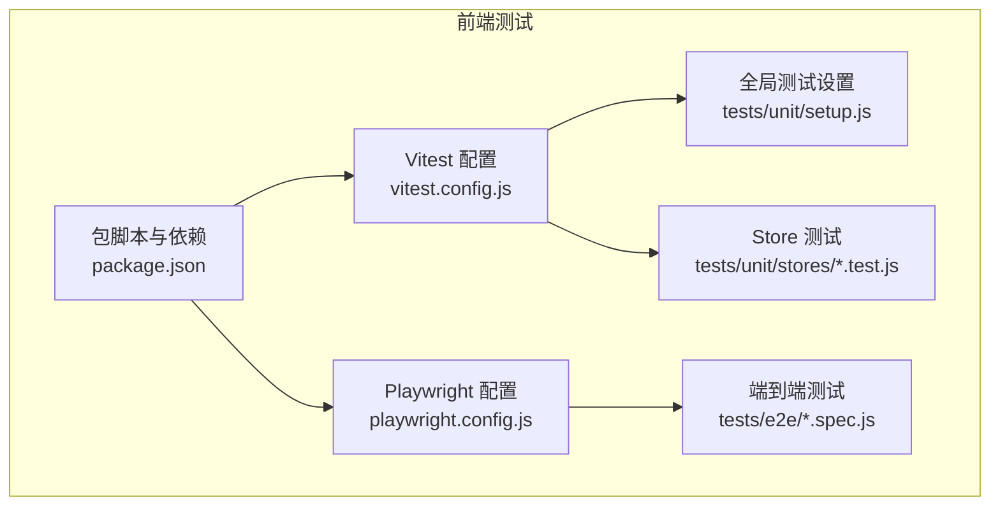
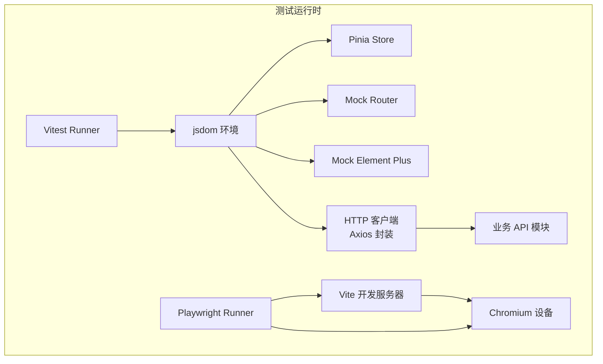
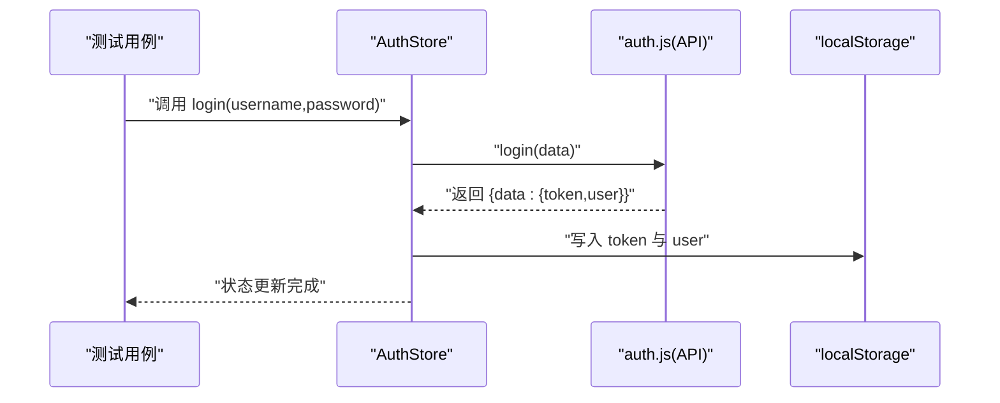
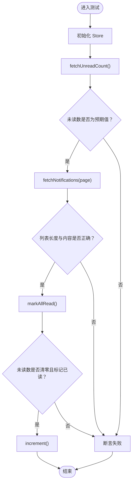
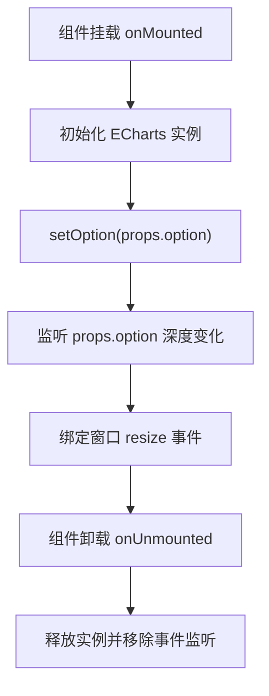
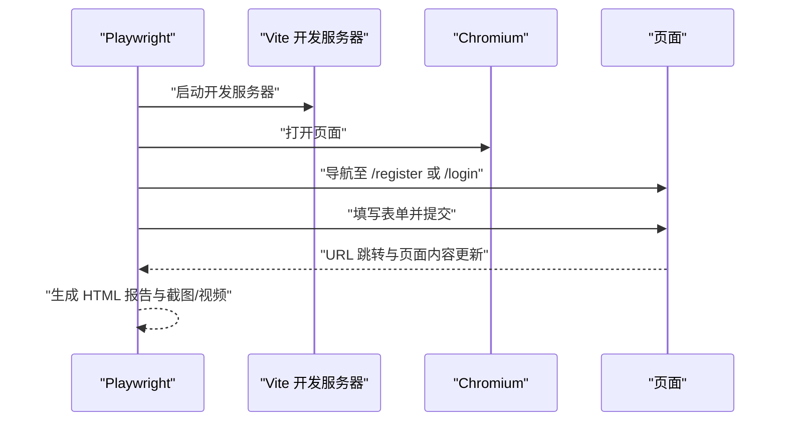
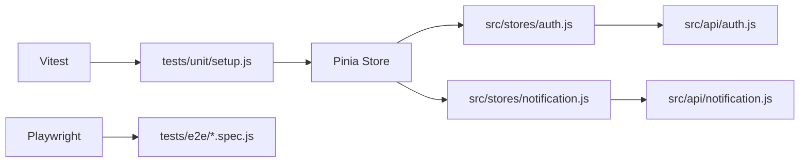

# 前端测试

<cite>
**本文引用的文件**
- [vitest.config.js](file://campus-forum-frontend/vitest.config.js)
- [package.json](file://campus-forum-frontend/package.json)
- [tests/unit/setup.js](file://campus-forum-frontend/tests/unit/setup.js)
- [tests/unit/stores/auth.test.js](file://campus-forum-frontend/tests/unit/stores/auth.test.js)
- [tests/unit/stores/notification.test.js](file://campus-forum-frontend/tests/unit/stores/notification.test.js)
- [src/stores/auth.js](file://campus-forum-frontend/src/stores/auth.js)
- [src/stores/notification.js](file://campus-forum-frontend/src/stores/notification.js)
- [src/api/auth.js](file://campus-forum-frontend/src/api/auth.js)
- [src/api/notification.js](file://campus-forum-frontend/src/api/notification.js)
- [tests/e2e/campus.spec.js](file://campus-forum-frontend/tests/e2e/campus.spec.js)
- [playwright.config.js](file://campus-forum-frontend/playwright.config.js)
- [src/components/charts/BaseChart.vue](file://campus-forum-frontend/src/components/charts/BaseChart.vue)
</cite>

## 目录
1. [引言](#引言)
2. [项目结构](#项目结构)
3. [核心组件](#核心组件)
4. [架构总览](#架构总览)
5. [详细组件分析](#详细组件分析)
6. [依赖分析](#依赖分析)
7. [性能考虑](#性能考虑)
8. [故障排查指南](#故障排查指南)
9. [结论](#结论)
10. [附录](#附录)

## 引言
本文件面向PBL项目的前端测试体系，聚焦以下目标：
- Vue.js 组件测试：基于 Vitest 的单元测试实践与最佳策略
- Store 状态测试：Pinia 状态管理的测试方法与异步状态处理
- API 接口测试：HTTP 客户端模拟与响应数据验证
- 组件渲染、用户交互与路由导航测试：端到端测试与集成测试思路
- 测试用例示例：属性测试、事件处理、生命周期钩子等
- 覆盖率配置、测试报告生成与性能测试实施方案

## 项目结构
前端测试主要分布在以下目录：
- 单元测试：tests/unit 下按功能模块组织，如 stores 子目录
- 端到端测试：tests/e2e 下以场景化命名的 spec 文件
- 配置文件：Vitest 与 Playwright 的配置分别位于根目录

图示来源
- [vitest.config.js:1-23](file://campus-forum-frontend/vitest.config.js#L1-L23)
- [package.json:1-37](file://campus-forum-frontend/package.json#L1-L37)
- [tests/unit/setup.js:1-33](file://campus-forum-frontend/tests/unit/setup.js#L1-L33)
- [tests/unit/stores/auth.test.js:1-54](file://campus-forum-frontend/tests/unit/stores/auth.test.js#L1-L54)
- [tests/unit/stores/notification.test.js:1-52](file://campus-forum-frontend/tests/unit/stores/notification.test.js#L1-L52)
- [tests/e2e/campus.spec.js:1-141](file://campus-forum-frontend/tests/e2e/campus.spec.js#L1-L141)
- [playwright.config.js:1-35](file://campus-forum-frontend/playwright.config.js#L1-L35)

章节来源
- [vitest.config.js:1-23](file://campus-forum-frontend/vitest.config.js#L1-L23)
- [package.json:1-37](file://campus-forum-frontend/package.json#L1-L37)
- [playwright.config.js:1-35](file://campus-forum-frontend/playwright.config.js#L1-L35)

## 核心组件
- Vitest 配置：启用 jsdom 环境、全局测试 API、覆盖率与别名解析
- Playwright 配置：浏览器设备、报告输出、Web 服务启动与追踪
- 全局设置：Pinia 初始化、Element Plus 与 Vue Router 的 Mock
- Store 测试：认证与通知 Store 的行为验证与异步流程覆盖
- 端到端测试：注册登录、活动与帖子发布、收藏、AI 助手、管理后台等场景

章节来源
- [vitest.config.js:1-23](file://campus-forum-frontend/vitest.config.js#L1-L23)
- [tests/unit/setup.js:1-33](file://campus-forum-frontend/tests/unit/setup.js#L1-L33)
- [tests/unit/stores/auth.test.js:1-54](file://campus-forum-frontend/tests/unit/stores/auth.test.js#L1-L54)
- [tests/unit/stores/notification.test.js:1-52](file://campus-forum-frontend/tests/unit/stores/notification.test.js#L1-L52)
- [tests/e2e/campus.spec.js:1-141](file://campus-forum-frontend/tests/e2e/campus.spec.js#L1-L141)

## 架构总览
下图展示了测试运行时的关键交互：Vitest 执行单元测试，Playwright 启动本地开发服务器后执行端到端测试。

图示来源
- [vitest.config.js:1-23](file://campus-forum-frontend/vitest.config.js#L1-L23)
- [tests/unit/setup.js:1-33](file://campus-forum-frontend/tests/unit/setup.js#L1-L33)
- [src/api/auth.js:1-4](file://campus-forum-frontend/src/api/auth.js#L1-L4)
- [src/api/notification.js:1-6](file://campus-forum-frontend/src/api/notification.js#L1-L6)
- [playwright.config.js:1-35](file://campus-forum-frontend/playwright.config.js#L1-L35)

## 详细组件分析

### Vitest 配置与运行环境
- 插件与环境：启用 @vitejs/plugin-vue，使用 jsdom 作为 DOM 环境，便于在 Node 中渲染 Vue 组件
- 全局 API：开启 globals，允许直接使用 describe、it、expect 等
- 设置文件：通过 setupFiles 注入全局 Mock 与 Pinia 初始化
- 包含范围与覆盖率：仅对 src 目标进行覆盖率统计，排除静态资源与入口文件
- 别名解析：@ 指向 src，便于统一导入路径

章节来源
- [vitest.config.js:1-23](file://campus-forum-frontend/vitest.config.js#L1-L23)

### 全局测试设置（Mock 与 Pinia）
- Pinia 重置：每个测试前创建新的 Pinia 实例并激活，避免跨测试污染
- Element Plus Mock：对 ElMessage 与 ElNotification 进行函数级 Mock，避免真实 UI 干扰
- Vue Router Mock：对 useRouter/useRoute 进行轻量 Mock，返回常用方法与默认路由对象

章节来源
- [tests/unit/setup.js:1-33](file://campus-forum-frontend/tests/unit/setup.js#L1-L33)

### 认证 Store（Pinia）测试策略
- 初始状态断言：未登录时 token 为空、用户为空、计算属性 isLoggedIn 为 false
- 登出流程：清理 token 与用户信息，并同步清除本地存储
- 用户信息合并更新：部分字段更新，其他字段保留
- 登录/注册：通过 API 函数发起请求，更新内存状态与本地存储；注意此处对 API 的 Mock 在测试中定义

图示来源
- [tests/unit/stores/auth.test.js:1-54](file://campus-forum-frontend/tests/unit/stores/auth.test.js#L1-L54)
- [src/stores/auth.js:1-37](file://campus-forum-frontend/src/stores/auth.js#L1-L37)
- [src/api/auth.js:1-4](file://campus-forum-frontend/src/api/auth.js#L1-L4)

章节来源
- [tests/unit/stores/auth.test.js:1-54](file://campus-forum-frontend/tests/unit/stores/auth.test.js#L1-L54)
- [src/stores/auth.js:1-37](file://campus-forum-frontend/src/stores/auth.js#L1-L37)
- [src/api/auth.js:1-4](file://campus-forum-frontend/src/api/auth.js#L1-L4)

### 通知 Store（Pinia）测试策略
- 初始状态：未读计数为 0，通知列表为空
- 获取未读数：调用 API 后更新未读计数
- 加载通知列表：分页参数传入 API，解析 records 更新列表
- 全部已读：调用 readAll 后清零未读计数并将列表标记为已读
- 未读计数自增：本地自增逻辑验证

图示来源
- [tests/unit/stores/notification.test.js:1-52](file://campus-forum-frontend/tests/unit/stores/notification.test.js#L1-L52)
- [src/stores/notification.js:1-31](file://campus-forum-frontend/src/stores/notification.js#L1-L31)
- [src/api/notification.js:1-6](file://campus-forum-frontend/src/api/notification.js#L1-L6)

章节来源
- [tests/unit/stores/notification.test.js:1-52](file://campus-forum-frontend/tests/unit/stores/notification.test.js#L1-L52)
- [src/stores/notification.js:1-31](file://campus-forum-frontend/src/stores/notification.js#L1-L31)
- [src/api/notification.js:1-6](file://campus-forum-frontend/src/api/notification.js#L1-L6)

### API 接口测试（HTTP 客户端模拟与响应验证）
- 认证 API：login 与 register 两个导出函数，内部通过 http 模块发起请求
- 通知 API：getNotifications、getUnreadCount、readAll、readOne 四个导出函数
- 测试中的 Mock：在 Store 测试中对上述 API 进行函数级 Mock，返回结构化的响应数据，便于断言 Store 行为

章节来源
- [src/api/auth.js:1-4](file://campus-forum-frontend/src/api/auth.js#L1-L4)
- [src/api/notification.js:1-6](file://campus-forum-frontend/src/api/notification.js#L1-L6)
- [tests/unit/stores/auth.test.js:1-54](file://campus-forum-frontend/tests/unit/stores/auth.test.js#L1-L54)
- [tests/unit/stores/notification.test.js:1-52](file://campus-forum-frontend/tests/unit/stores/notification.test.js#L1-L52)

### 组件渲染测试与用户交互测试
- 图表组件 BaseChart：接收 option、width、height 属性，在挂载时初始化 ECharts，监听窗口 resize 并在卸载时释放实例
- 渲染测试建议：使用 jsdom 环境挂载组件，断言 DOM 结构与属性；对 props 变化使用 watch 触发 setOption
- 交互测试建议：模拟用户输入、点击与滚动，断言状态变化与副作用（如本地存储）

图示来源
- [src/components/charts/BaseChart.vue:1-31](file://campus-forum-frontend/src/components/charts/BaseChart.vue#L1-L31)

章节来源
- [src/components/charts/BaseChart.vue:1-31](file://campus-forum-frontend/src/components/charts/BaseChart.vue#L1-L31)

### 路由导航测试
- Mock 路由：在全局设置中对 useRouter/useRoute 进行 Mock，提供 push/replace/go 与默认路由对象
- 使用建议：在需要导航的组件或组合式函数测试中，断言路由方法被调用次数与参数；对路由守卫场景可在更高层的端到端测试中验证

章节来源
- [tests/unit/setup.js:1-33](file://campus-forum-frontend/tests/unit/setup.js#L1-L33)

### 端到端测试（E2E）
- 场景覆盖：注册登录、活动发布、评论发表、帖子发布、收藏、AI 助手、管理后台（仪表盘、用户、帖子、公告）
- 运行方式：Playwright 配置启动 Vite 开发服务器，使用 Chromium 设备执行测试，支持 HTML 报告与失败截图/视频
- 断言策略：页面跳转后的 URL 匹配、元素可见性与文本断言、表格与图表容器渲染验证

图示来源
- [playwright.config.js:1-35](file://campus-forum-frontend/playwright.config.js#L1-L35)
- [tests/e2e/campus.spec.js:1-141](file://campus-forum-frontend/tests/e2e/campus.spec.js#L1-L141)

章节来源
- [playwright.config.js:1-35](file://campus-forum-frontend/playwright.config.js#L1-L35)
- [tests/e2e/campus.spec.js:1-141](file://campus-forum-frontend/tests/e2e/campus.spec.js#L1-L141)

## 依赖分析
- 测试工具链：Vitest 提供单元测试能力，Playwright 提供端到端测试能力
- 依赖注入：通过 setupFiles 注入 Mock 与 Pinia，隔离外部依赖
- API 依赖：Store 通过 API 模块发起请求，测试中对 API 进行函数级 Mock

图示来源
- [tests/unit/setup.js:1-33](file://campus-forum-frontend/tests/unit/setup.js#L1-L33)
- [src/stores/auth.js:1-37](file://campus-forum-frontend/src/stores/auth.js#L1-L37)
- [src/stores/notification.js:1-31](file://campus-forum-frontend/src/stores/notification.js#L1-L31)
- [src/api/auth.js:1-4](file://campus-forum-frontend/src/api/auth.js#L1-L4)
- [src/api/notification.js:1-6](file://campus-forum-frontend/src/api/notification.js#L1-L6)
- [tests/e2e/campus.spec.js:1-141](file://campus-forum-frontend/tests/e2e/campus.spec.js#L1-L141)

章节来源
- [tests/unit/setup.js:1-33](file://campus-forum-frontend/tests/unit/setup.js#L1-L33)
- [src/stores/auth.js:1-37](file://campus-forum-frontend/src/stores/auth.js#L1-L37)
- [src/stores/notification.js:1-31](file://campus-forum-frontend/src/stores/notification.js#L1-L31)
- [src/api/auth.js:1-4](file://campus-forum-frontend/src/api/auth.js#L1-L4)
- [src/api/notification.js:1-6](file://campus-forum-frontend/src/api/notification.js#L1-L6)
- [tests/e2e/campus.spec.js:1-141](file://campus-forum-frontend/tests/e2e/campus.spec.js#L1-L141)

## 性能考虑
- 单元测试：优先使用 Mock 与 jsdom，避免真实网络与 DOM 渲染开销
- 端到端测试：限制并发 worker 数量，合理使用 trace/screenshot/video 以平衡性能与可观测性
- 覆盖率：仅对业务代码统计覆盖率，排除静态资源与入口文件，减少无关统计

## 故障排查指南
- 测试间状态污染：确认每个测试前调用 Pinia 初始化与清理
- Mock 失效：检查 setupFiles 是否正确加载，确保 Mock 作用域在测试前执行
- 端到端超时：调整 webServer 超时时间或在 CI 环境复用现有服务器
- 路由断言失败：确认 useRouter/useRoute 的 Mock 返回值与期望一致

章节来源
- [tests/unit/setup.js:1-33](file://campus-forum-frontend/tests/unit/setup.js#L1-L33)
- [playwright.config.js:1-35](file://campus-forum-frontend/playwright.config.js#L1-L35)

## 结论
本测试体系以 Vitest 为核心构建单元测试，结合 Pinia 的可测试性与 API 的函数级 Mock，有效覆盖 Store 状态与异步流程；同时通过 Playwright 的端到端测试保障关键业务流程的可用性。建议持续完善组件渲染与交互测试，扩展性能与稳定性指标，提升整体质量保障水平。

## 附录
- 脚本与命令
  - 单元测试：通过脚本运行 Vitest
  - 端到端测试：通过脚本运行 Playwright
- 覆盖率与报告
  - Vitest 覆盖率：v8 提供器，输出文本、HTML 与 LCOV
  - Playwright 报告：HTML 报告输出目录可配置

章节来源
- [package.json:1-37](file://campus-forum-frontend/package.json#L1-L37)
- [vitest.config.js:1-23](file://campus-forum-frontend/vitest.config.js#L1-L23)
- [playwright.config.js:1-35](file://campus-forum-frontend/playwright.config.js#L1-L35)