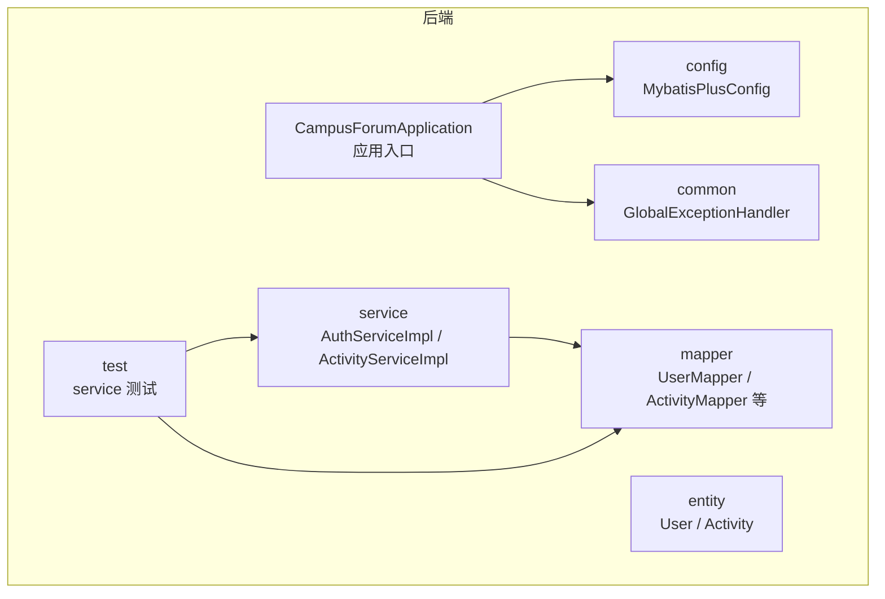
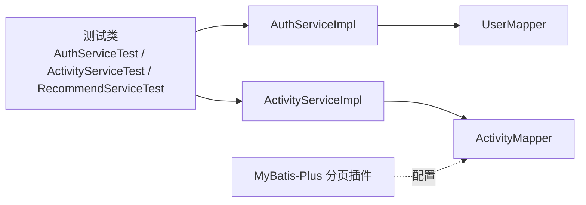
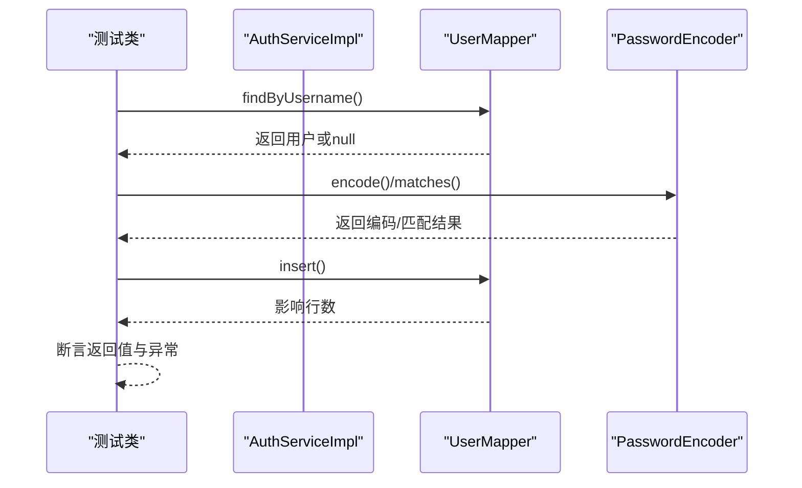
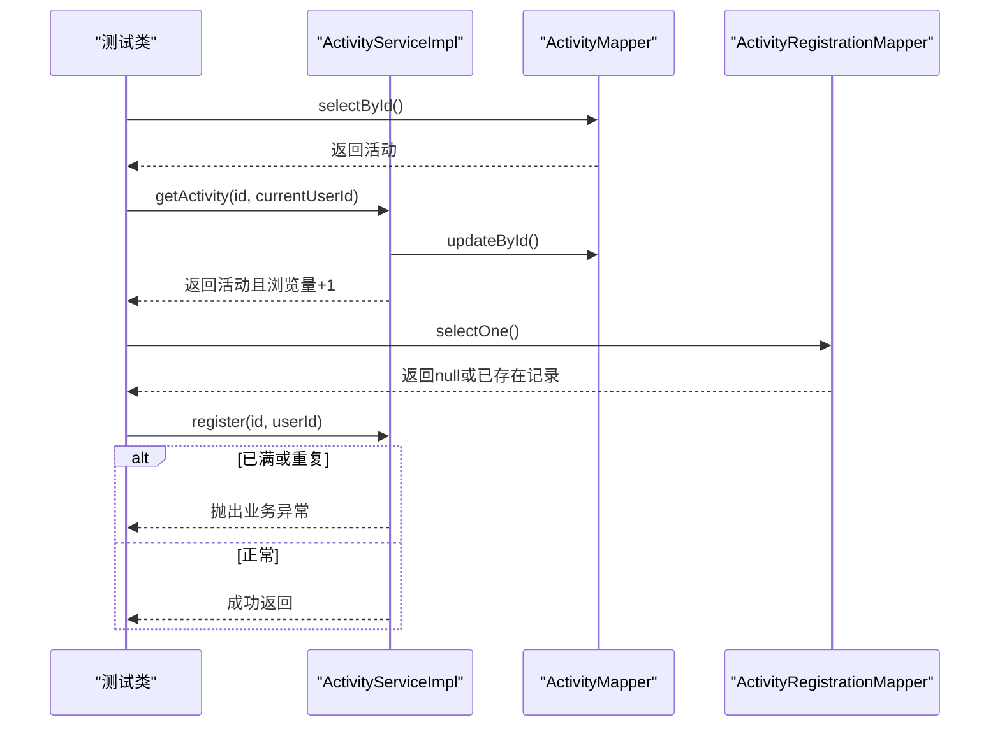
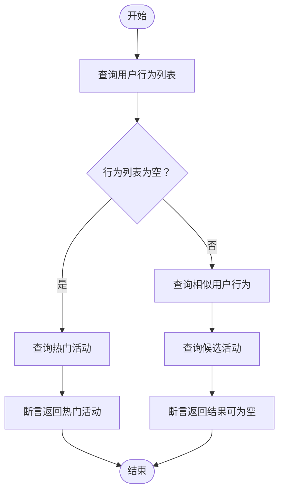
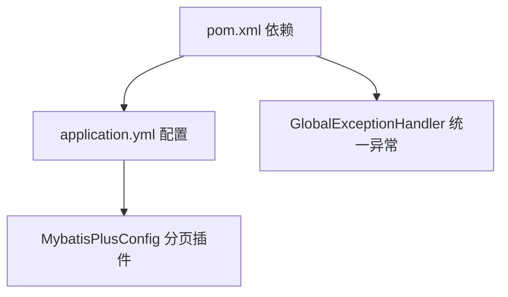

# 单元测试

<cite>
**本文引用的文件**
- [pom.xml](file://campus-forum-backend/pom.xml)
- [application.yml](file://campus-forum-backend/src/main/resources/application.yml)
- [CampusForumApplication.java](file://campus-forum-backend/src/main/java/com/campus/forum/CampusForumApplication.java)
- [MybatisPlusConfig.java](file://campus-forum-backend/src/main/java/com/campus/forum/config/MybatisPlusConfig.java)
- [GlobalExceptionHandler.java](file://campus-forum-backend/src/main/java/com/campus/forum/common/GlobalExceptionHandler.java)
- [BusinessException.java](file://campus-forum-backend/src/main/java/com/campus/forum/common/exception/BusinessException.java)
- [AuthServiceImpl.java](file://campus-forum-backend/src/main/java/com/campus/forum/service/impl/AuthServiceImpl.java)
- [ActivityServiceImpl.java](file://campus-forum-backend/src/main/java/com/campus/forum/service/impl/ActivityServiceImpl.java)
- [User.java](file://campus-forum-backend/src/main/java/com/campus/forum/entity/User.java)
- [Activity.java](file://campus-forum-backend/src/main/java/com/campus/forum/entity/Activity.java)
- [AuthServiceTest.java](file://campus-forum-backend/src/test/java/com/campus/forum/service/AuthServiceTest.java)
- [ActivityServiceTest.java](file://campus-forum-backend/src/test/java/com/campus/forum/service/ActivityServiceTest.java)
- [RecommendServiceTest.java](file://campus-forum-backend/src/test/java/com/campus/forum/service/RecommendServiceTest.java)
</cite>

## 目录
1. [引言](#引言)
2. [项目结构](#项目结构)
3. [核心组件](#核心组件)
4. [架构总览](#架构总览)
5. [详细组件分析](#详细组件分析)
6. [依赖分析](#依赖分析)
7. [性能考虑](#性能考虑)
8. [故障排查指南](#故障排查指南)
9. [结论](#结论)
10. [附录](#附录)

## 引言
本文件面向PBL项目的单元测试实践，聚焦于Spring Boot测试框架在后端的使用方式与最佳实践，包括：
- 使用JUnit 5与Mockito进行Service层单元测试的方法
- 使用@SpringBootTest、@MockBean与@TestConfiguration的集成测试思路
- 控制器层测试的请求模拟、响应断言与异常处理验证
- MyBatis-Plus在测试中的数据库操作模拟与事务回滚策略
- 测试命名规范、断言方法与测试报告生成建议
- 针对成功场景、边界条件与异常场景的测试覆盖策略

## 项目结构
后端采用Spring Boot标准目录结构，测试位于src/test/java下，按功能模块划分（如service、controller）。核心应用入口、配置与实体均位于src/main/java。

图表来源
- [CampusForumApplication.java:1-17](file://campus-forum-backend/src/main/java/com/campus/forum/CampusForumApplication.java#L1-L17)
- [MybatisPlusConfig.java:1-24](file://campus-forum-backend/src/main/java/com/campus/forum/config/MybatisPlusConfig.java#L1-L24)
- [GlobalExceptionHandler.java:1-57](file://campus-forum-backend/src/main/java/com/campus/forum/common/GlobalExceptionHandler.java#L1-L57)
- [User.java:1-33](file://campus-forum-backend/src/main/java/com/campus/forum/entity/User.java#L1-L33)
- [Activity.java:1-39](file://campus-forum-backend/src/main/java/com/campus/forum/entity/Activity.java#L1-L39)
- [AuthServiceImpl.java:1-69](file://campus-forum-backend/src/main/java/com/campus/forum/service/impl/AuthServiceImpl.java#L1-L69)
- [ActivityServiceImpl.java:1-149](file://campus-forum-backend/src/main/java/com/campus/forum/service/impl/ActivityServiceImpl.java#L1-L149)

章节来源
- [pom.xml:1-136](file://campus-forum-backend/pom.xml#L1-L136)
- [application.yml:1-53](file://campus-forum-backend/src/main/resources/application.yml#L1-L53)

## 核心组件
- 应用入口与扫描：应用入口标注@SpringBootApplication与@MapperScan，确保MyBatis Mapper自动扫描与组件发现。
- MyBatis-Plus配置：启用分页插件，保证分页查询在测试中行为一致。
- 全局异常处理：统一捕获业务异常并返回标准化结果，便于测试断言。
- 实体模型：User与Activity等实体定义字段与注解，支撑Service层逻辑与Mapper交互。
- 服务实现：AuthServiceImpl与ActivityServiceImpl包含业务规则、事务控制与外部依赖调用，是单元测试的重点目标。

章节来源
- [CampusForumApplication.java:1-17](file://campus-forum-backend/src/main/java/com/campus/forum/CampusForumApplication.java#L1-L17)
- [MybatisPlusConfig.java:1-24](file://campus-forum-backend/src/main/java/com/campus/forum/config/MybatisPlusConfig.java#L1-L24)
- [GlobalExceptionHandler.java:1-57](file://campus-forum-backend/src/main/java/com/campus/forum/common/GlobalExceptionHandler.java#L1-L57)
- [User.java:1-33](file://campus-forum-backend/src/main/java/com/campus/forum/entity/User.java#L1-L33)
- [Activity.java:1-39](file://campus-forum-backend/src/main/java/com/campus/forum/entity/Activity.java#L1-L39)
- [AuthServiceImpl.java:1-69](file://campus-forum-backend/src/main/java/com/campus/forum/service/impl/AuthServiceImpl.java#L1-L69)
- [ActivityServiceImpl.java:1-149](file://campus-forum-backend/src/main/java/com/campus/forum/service/impl/ActivityServiceImpl.java#L1-L149)

## 架构总览
下图展示从测试到服务与数据层的调用关系，体现单元测试中对Service层的隔离与对Mapper层的Mock策略。

图表来源
- [AuthServiceTest.java:1-124](file://campus-forum-backend/src/test/java/com/campus/forum/service/AuthServiceTest.java#L1-L124)
- [ActivityServiceTest.java:1-95](file://campus-forum-backend/src/test/java/com/campus/forum/service/ActivityServiceTest.java#L1-L95)
- [RecommendServiceTest.java:1-81](file://campus-forum-backend/src/test/java/com/campus/forum/service/RecommendServiceTest.java#L1-L81)
- [AuthServiceImpl.java:1-69](file://campus-forum-backend/src/main/java/com/campus/forum/service/impl/AuthServiceImpl.java#L1-L69)
- [ActivityServiceImpl.java:1-149](file://campus-forum-backend/src/main/java/com/campus/forum/service/impl/ActivityServiceImpl.java#L1-L149)
- [MybatisPlusConfig.java:1-24](file://campus-forum-backend/src/main/java/com/campus/forum/config/MybatisPlusConfig.java#L1-L24)

## 详细组件分析

### Service层单元测试：认证服务（AuthService）
- 测试目标：注册、登录、账户状态校验与密码匹配。
- Mock策略：使用@Mock对UserMapper与PasswordEncoder进行Mock；@InjectMocks注入到AuthServiceImpl。
- 断言要点：返回值字段校验、异常类型与消息断言、以及Mapper插入调用次数验证。
- 边界与异常：重复用户名、错误密码、禁用账户等场景均通过断言业务异常实现。

图表来源
- [AuthServiceTest.java:50-66](file://campus-forum-backend/src/test/java/com/campus/forum/service/AuthServiceTest.java#L50-L66)
- [AuthServiceTest.java:84-94](file://campus-forum-backend/src/test/java/com/campus/forum/service/AuthServiceTest.java#L84-L94)
- [AuthServiceTest.java:101-107](file://campus-forum-backend/src/test/java/com/campus/forum/service/AuthServiceTest.java#L101-L107)
- [AuthServiceTest.java:114-122](file://campus-forum-backend/src/test/java/com/campus/forum/service/AuthServiceTest.java#L114-L122)
- [AuthServiceImpl.java:28-45](file://campus-forum-backend/src/main/java/com/campus/forum/service/impl/AuthServiceImpl.java#L28-L45)
- [AuthServiceImpl.java:47-67](file://campus-forum-backend/src/main/java/com/campus/forum/service/impl/AuthServiceImpl.java#L47-L67)

章节来源
- [AuthServiceTest.java:1-124](file://campus-forum-backend/src/test/java/com/campus/forum/service/AuthServiceTest.java#L1-L124)
- [AuthServiceImpl.java:1-69](file://campus-forum-backend/src/main/java/com/campus/forum/service/impl/AuthServiceImpl.java#L1-L69)

### Service层单元测试：活动服务（ActivityService）
- 测试目标：活动详情浏览量自增、报名人数上限控制、重复报名拦截。
- Mock策略：对ActivityMapper、ActivityRegistrationMapper、PostLikeMapper、UserBehaviorMapper进行Mock。
- 断言要点：浏览量字段变化、异常抛出与消息校验、更新与插入调用验证。
- 事务特性：Service方法标注@Transactional，测试中通过Mock避免真实事务与数据库副作用。

图表来源
- [ActivityServiceTest.java:55-64](file://campus-forum-backend/src/test/java/com/campus/forum/service/ActivityServiceTest.java#L55-L64)
- [ActivityServiceTest.java:71-79](file://campus-forum-backend/src/test/java/com/campus/forum/service/ActivityServiceTest.java#L71-L79)
- [ActivityServiceTest.java:86-93](file://campus-forum-backend/src/test/java/com/campus/forum/service/ActivityServiceTest.java#L86-L93)
- [ActivityServiceImpl.java:42-55](file://campus-forum-backend/src/main/java/com/campus/forum/service/impl/ActivityServiceImpl.java#L42-L55)
- [ActivityServiceImpl.java:113-137](file://campus-forum-backend/src/main/java/com/campus/forum/service/impl/ActivityServiceImpl.java#L113-L137)

章节来源
- [ActivityServiceTest.java:1-95](file://campus-forum-backend/src/test/java/com/campus/forum/service/ActivityServiceTest.java#L1-L95)
- [ActivityServiceImpl.java:1-149](file://campus-forum-backend/src/main/java/com/campus/forum/service/impl/ActivityServiceImpl.java#L1-L149)

### Service层单元测试：推荐服务（RecommendService）
- 测试目标：冷启动兜底（无行为数据时返回热门活动）、有行为数据时正常推荐。
- Mock策略：对UserBehaviorMapper与ActivityMapper进行Mock，构造空列表与候选结果。
- 断言要点：结果非空性、标题一致性、热门兜底调用验证。

图表来源
- [RecommendServiceTest.java:41-53](file://campus-forum-backend/src/test/java/com/campus/forum/service/RecommendServiceTest.java#L41-L53)
- [RecommendServiceTest.java:60-79](file://campus-forum-backend/src/test/java/com/campus/forum/service/RecommendServiceTest.java#L60-L79)
- [ActivityServiceImpl.java:139-147](file://campus-forum-backend/src/main/java/com/campus/forum/service/impl/ActivityServiceImpl.java#L139-L147)

章节来源
- [RecommendServiceTest.java:1-81](file://campus-forum-backend/src/test/java/com/campus/forum/service/RecommendServiceTest.java#L1-L81)
- [ActivityServiceImpl.java:1-149](file://campus-forum-backend/src/main/java/com/campus/forum/service/impl/ActivityServiceImpl.java#L1-L149)

### 控制器层测试（概念性指导）
- 测试思路：使用Spring Boot Test与Mock Bean模拟服务层，通过WebTestClient或MockMvc发起HTTP请求，断言响应状态、头信息与JSON体。
- 关键点：@SpringBootTest加载完整上下文；@MockBean替换真实服务；@TestConfiguration可注入测试专用配置。
- 异常处理：结合全局异常处理器，断言业务异常返回码与消息格式。

（本节为通用指导，不直接分析具体源码文件）

### MyBatis-Plus测试与事务回滚
- 数据库模拟：在Service层测试中通过Mock Mapper避免真实数据库写入，保证测试独立性与可重复性。
- 分页行为：MyBatis-Plus配置中启用分页插件，测试中可验证分页查询返回结构与条目数量。
- 事务回滚：对于需要真实数据库交互的场景，可在集成测试中使用@Commit/@Rollback或测试容器配合事务管理器实现回滚。

（本节为通用指导，不直接分析具体源码文件）

## 依赖分析
- 测试依赖：spring-boot-starter-test与spring-security-test提供测试运行时与安全测试支持。
- 数据源与MyBatis-Plus：application.yml配置MySQL连接与MyBatis-Plus逻辑删除、映射规则；MybatisPlusConfig启用分页插件。
- 全局异常：GlobalExceptionHandler统一处理业务异常，测试中可断言Result封装的错误码与消息。

图表来源
- [pom.xml:106-116](file://campus-forum-backend/pom.xml#L106-L116)
- [application.yml:9-29](file://campus-forum-backend/src/main/resources/application.yml#L9-L29)
- [MybatisPlusConfig.java:16-22](file://campus-forum-backend/src/main/java/com/campus/forum/config/MybatisPlusConfig.java#L16-L22)
- [GlobalExceptionHandler.java:19-23](file://campus-forum-backend/src/main/java/com/campus/forum/common/GlobalExceptionHandler.java#L19-L23)

章节来源
- [pom.xml:1-136](file://campus-forum-backend/pom.xml#L1-L136)
- [application.yml:1-53](file://campus-forum-backend/src/main/resources/application.yml#L1-L53)
- [GlobalExceptionHandler.java:1-57](file://campus-forum-backend/src/main/java/com/campus/forum/common/GlobalExceptionHandler.java#L1-L57)

## 性能考虑
- 测试隔离：优先使用Mock减少I/O与网络开销，提升执行速度。
- 并行执行：合理组织测试用例，避免共享状态导致的竞态。
- 数据准备：使用最小化、稳定的测试数据集，避免复杂初始化。
- 日志与输出：在测试环境中关闭冗余日志，提高可读性与执行效率。

（本节为通用指导，不直接分析具体源码文件）

## 故障排查指南
- 断言失败：检查Mock返回值与期望参数匹配（使用ArgumentMatchers.any/eq等）。
- 业务异常：确认异常类型与消息是否符合BusinessException约定，必要时查看全局异常处理器返回结构。
- 事务问题：若需真实数据库交互，确认事务传播与回滚策略，或改用Mock避免副作用。
- 配置差异：核对application.yml中的数据源与MyBatis-Plus配置，确保测试环境一致。

章节来源
- [BusinessException.java:1-22](file://campus-forum-backend/src/main/java/com/campus/forum/common/exception/BusinessException.java#L1-L22)
- [GlobalExceptionHandler.java:19-23](file://campus-forum-backend/src/main/java/com/campus/forum/common/GlobalExceptionHandler.java#L19-L23)

## 结论
通过Mockito与JUnit 5的组合，项目实现了对Service层的高覆盖率单元测试，覆盖成功、边界与异常三大场景。配合全局异常处理与MyBatis-Plus配置，测试具备良好的稳定性与可维护性。对于控制器与集成测试，建议在现有基础上引入@SpringBootTest与@MockBean，以实现端到端验证与异常处理校验。

## 附录

### 测试命名规范与断言方法
- 命名规范：采用“用例编号_模块_场景”的命名风格，如UT-001、UT-011等，便于追溯与统计。
- 断言方法：
  - 对象断言：assertNotNull、assertEquals、assertTrue等
  - 异常断言：assertThrows并校验异常消息或状态码
  - 行为断言：verify验证方法调用次数与参数
- 测试数据准备：在@BeforeEach中构造最小化实体对象，设置关键字段值，避免跨用例耦合。

章节来源
- [AuthServiceTest.java:50-66](file://campus-forum-backend/src/test/java/com/campus/forum/service/AuthServiceTest.java#L50-L66)
- [ActivityServiceTest.java:55-64](file://campus-forum-backend/src/test/java/com/campus/forum/service/ActivityServiceTest.java#L55-L64)
- [RecommendServiceTest.java:41-53](file://campus-forum-backend/src/test/java/com/campus/forum/service/RecommendServiceTest.java#L41-L53)

### 测试报告生成
- Maven Surefire：默认生成XML与文本报告，可在CI中收集。
- Jacoco：可选集成覆盖率报告，辅助定位未覆盖分支与路径。
- 建议：在CI流水线中聚合测试与覆盖率报告，形成质量门禁依据。

（本节为通用指导，不直接分析具体源码文件）