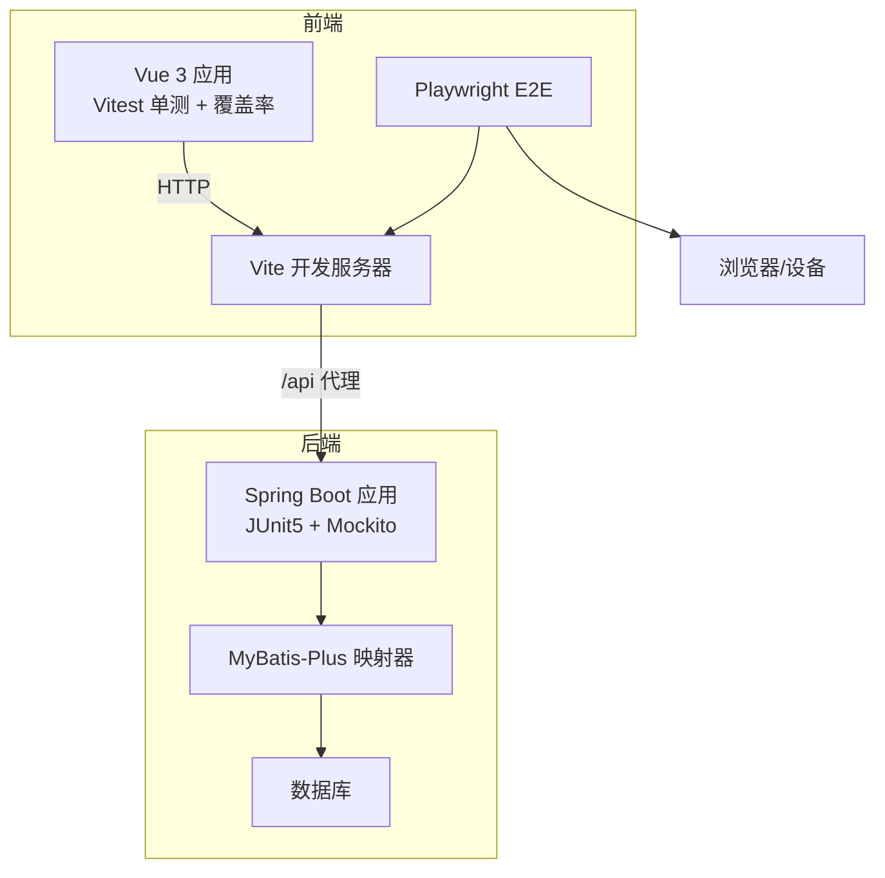
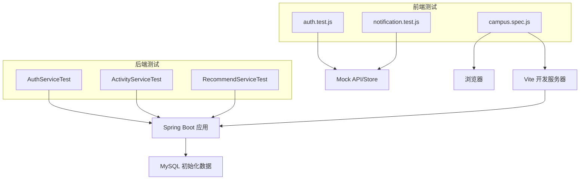
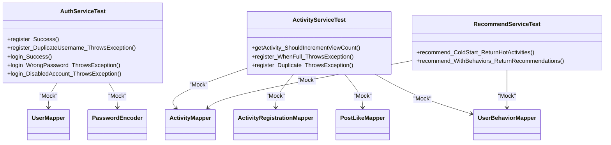
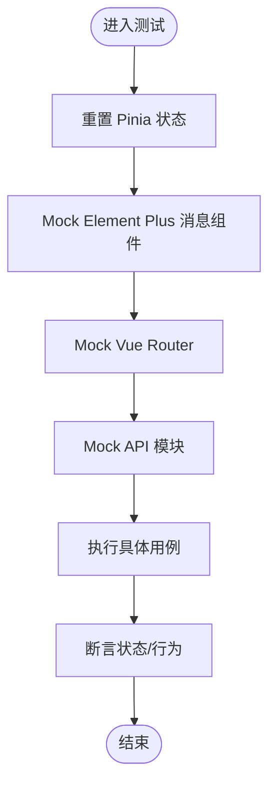
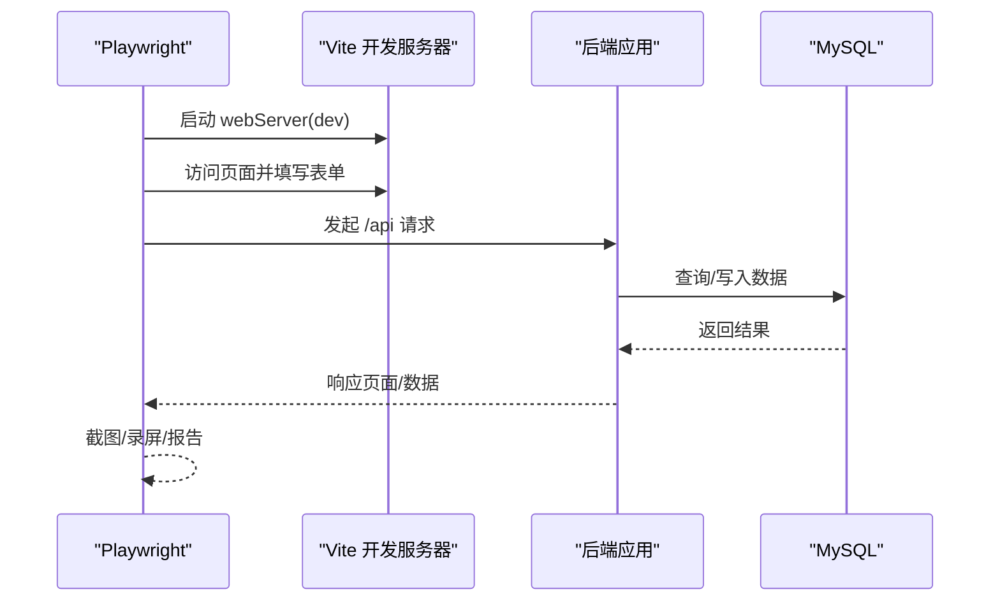
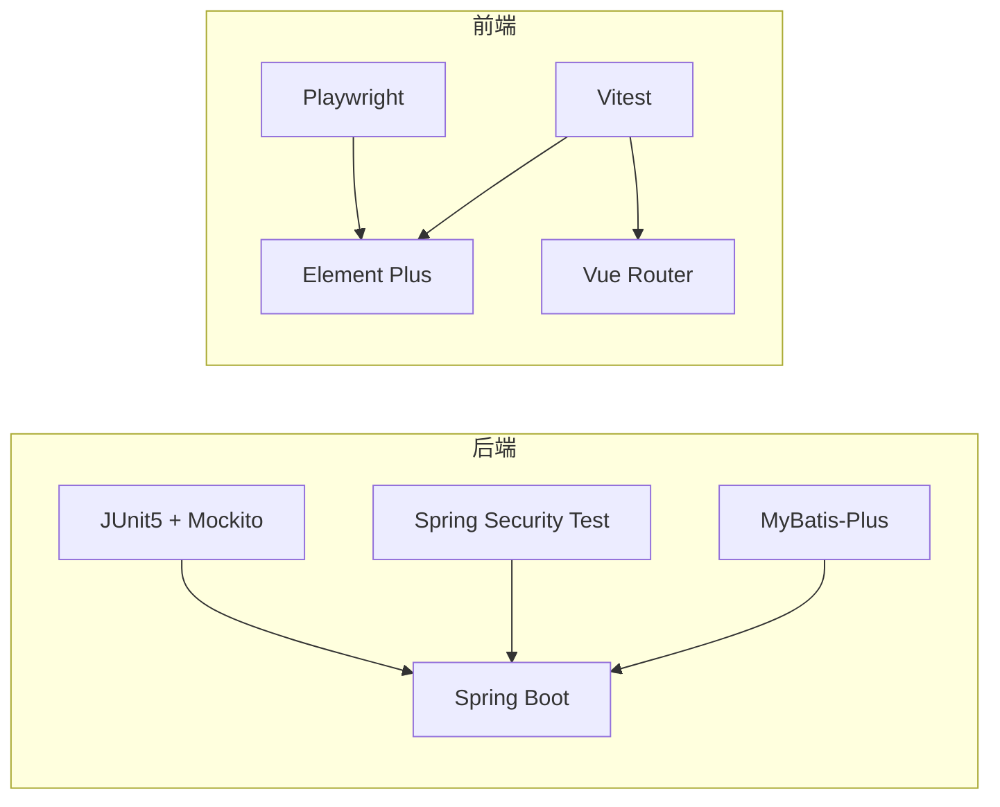

# 测试策略

<cite>
**本文引用的文件**
- [pom.xml](file://campus-forum-backend/pom.xml)
- [application.yml](file://campus-forum-backend/src/main/resources/application.yml)
- [init.sql](file://campus-forum-backend/docs/db/init.sql)
- [AuthServiceTest.java](file://campus-forum-backend/src/test/java/com/campus/forum/service/AuthServiceTest.java)
- [ActivityServiceTest.java](file://campus-forum-backend/src/test/java/com/campus/forum/service/ActivityServiceTest.java)
- [RecommendServiceTest.java](file://campus-forum-backend/src/test/java/com/campus/forum/service/RecommendServiceTest.java)
- [package.json](file://campus-forum-frontend/package.json)
- [playwright.config.js](file://campus-forum-frontend/playwright.config.js)
- [vitest.config.js](file://campus-forum-frontend/vitest.config.js)
- [vite.config.js](file://campus-forum-frontend/vite.config.js)
- [setup.js](file://campus-forum-frontend/tests/unit/setup.js)
- [auth.test.js](file://campus-forum-frontend/tests/unit/stores/auth.test.js)
- [notification.test.js](file://campus-forum-frontend/tests/unit/stores/notification.test.js)
- [campus.spec.js](file://campus-forum-frontend/tests/e2e/campus.spec.js)
</cite>

## 目录
1. 引言
2. 项目结构
3. 核心组件
4. 架构总览
5. 详细组件分析
6. 依赖分析
7. 性能考虑
8. 故障排查指南
9. 结论
10. 附录

## 引言
本测试策略文档面向 PBL 项目，覆盖后端 Spring Boot 与前端 Vue.js 的完整测试体系，包括单元测试、集成测试与端到端测试（E2E）。文档明确测试框架使用、Mock 对象配置、测试数据准备策略、覆盖率与报告生成、性能与压力测试方案、CI 集成流程以及调试技巧，帮助团队建立高质量、可维护、可回归的测试体系。

## 项目结构
- 后端采用 Spring Boot 3 + MyBatis-Plus，测试使用 JUnit 5 + Mockito；数据库连接与 MyBatis-Plus 配置位于应用配置文件中；测试用例集中在后端模块的 test 目录。
- 前端采用 Vue 3 + Vite + Vitest + Playwright；Vitest 负责单元测试与覆盖率，Playwright 负责 E2E 自动化；路由与 API 代理在 Vite 中配置，Playwright 通过本地开发服务器运行。

**章节来源**
- [pom.xml:1-136](file://campus-forum-backend/pom.xml#L1-L136)
- [application.yml:1-53](file://campus-forum-backend/src/main/resources/application.yml#L1-L53)
- [package.json:1-37](file://campus-forum-frontend/package.json#L1-L37)
- [vite.config.js:1-27](file://campus-forum-frontend/vite.config.js#L1-L27)
- [playwright.config.js:1-35](file://campus-forum-frontend/playwright.config.js#L1-L35)

## 核心组件
- 后端测试核心：基于 JUnit 5 + Mockito 的单元测试，覆盖认证、活动、推荐等服务层逻辑；通过 Mock Mapper 与 PasswordEncoder 隔离外部依赖，确保测试稳定与可重复。
- 前端测试核心：Vitest 单测 + Pinia Store 测试；通过 vi.mock 模拟第三方 UI 组件与 API 请求；Playwright E2E 覆盖用户登录、活动发布、评论、收藏、管理后台等关键业务链路。
- 测试数据：后端使用初始化 SQL 快速构建基础数据（管理员、测试用户、版块等）；前端通过 Mock API 返回结构化数据，避免真实网络请求。

**章节来源**
- [AuthServiceTest.java:1-124](file://campus-forum-backend/src/test/java/com/campus/forum/service/AuthServiceTest.java#L1-L124)
- [ActivityServiceTest.java:1-95](file://campus-forum-backend/src/test/java/com/campus/forum/service/ActivityServiceTest.java#L1-L95)
- [RecommendServiceTest.java:1-81](file://campus-forum-backend/src/test/java/com/campus/forum/service/RecommendServiceTest.java#L1-L81)
- [auth.test.js:1-54](file://campus-forum-frontend/tests/unit/stores/auth.test.js#L1-L54)
- [notification.test.js:1-52](file://campus-forum-frontend/tests/unit/stores/notification.test.js#L1-L52)
- [campus.spec.js:1-141](file://campus-forum-frontend/tests/e2e/campus.spec.js#L1-L141)

## 架构总览
下图展示测试架构与各组件交互：后端服务由单元测试直接驱动；前端单测通过 Mock API 与 Store 行为验证；E2E 使用 Playwright 控制浏览器与本地开发服务器交互。

**图示来源**
- [AuthServiceTest.java:1-124](file://campus-forum-backend/src/test/java/com/campus/forum/service/AuthServiceTest.java#L1-L124)
- [ActivityServiceTest.java:1-95](file://campus-forum-backend/src/test/java/com/campus/forum/service/ActivityServiceTest.java#L1-L95)
- [RecommendServiceTest.java:1-81](file://campus-forum-backend/src/test/java/com/campus/forum/service/RecommendServiceTest.java#L1-L81)
- [auth.test.js:1-54](file://campus-forum-frontend/tests/unit/stores/auth.test.js#L1-L54)
- [notification.test.js:1-52](file://campus-forum-frontend/tests/unit/stores/notification.test.js#L1-L52)
- [campus.spec.js:1-141](file://campus-forum-frontend/tests/e2e/campus.spec.js#L1-L141)
- [application.yml:1-53](file://campus-forum-backend/src/main/resources/application.yml#L1-L53)

## 详细组件分析

### 后端单元测试策略（Spring Boot）
- 测试框架：JUnit 5 + Mockito 扩展，使用 @ExtendWith(MockitoExtension.class) 注入 Mock 与 InjectMocks 实例化被测服务。
- Mock 策略：对 Mapper 接口与 PasswordEncoder 进行 Mock，模拟数据库查询与密码校验；通过 verify 断言调用次数与参数。
- 关键用例：
  - 认证服务：用户名重复注册、正确/错误密码登录、禁用账户拦截。
  - 活动服务：获取详情自动增加浏览量、超员拦截、重复报名拦截。
  - 推荐服务：冷启动兜底（无行为数据时返回热门）、有行为数据时正常推荐。
- 数据准备：使用初始化 SQL 提供管理员与测试用户，便于登录与权限相关测试。

**图示来源**
- [AuthServiceTest.java:1-124](file://campus-forum-backend/src/test/java/com/campus/forum/service/AuthServiceTest.java#L1-L124)
- [ActivityServiceTest.java:1-95](file://campus-forum-backend/src/test/java/com/campus/forum/service/ActivityServiceTest.java#L1-L95)
- [RecommendServiceTest.java:1-81](file://campus-forum-backend/src/test/java/com/campus/forum/service/RecommendServiceTest.java#L1-L81)

**章节来源**
- [AuthServiceTest.java:1-124](file://campus-forum-backend/src/test/java/com/campus/forum/service/AuthServiceTest.java#L1-L124)
- [ActivityServiceTest.java:1-95](file://campus-forum-backend/src/test/java/com/campus/forum/service/ActivityServiceTest.java#L1-L95)
- [RecommendServiceTest.java:1-81](file://campus-forum-backend/src/test/java/com/campus/forum/service/RecommendServiceTest.java#L1-L81)
- [application.yml:1-53](file://campus-forum-backend/src/main/resources/application.yml#L1-L53)
- [init.sql:1-257](file://campus-forum-backend/docs/db/init.sql#L1-L257)

### 前端单元测试策略（Vue + Vitest + Pinia）
- 测试框架：Vitest + jsdom 环境，全局启用测试工具函数；通过 setup.js 在每个测试前重置 Pinia 状态。
- Mock 策略：对 Element Plus 消息组件与 Vue Router 进行 vi.mock，避免真实 DOM 与路由副作用；对 API 模块进行 vi.mock 并返回结构化响应。
- 关键用例：
  - 认证 Store：初始状态、登出清理、用户信息合并更新、登录态判断。
  - 通知 Store：未读计数拉取、通知列表加载、全部已读、未读计数自增。
- 覆盖率：Vitest 配置开启 v8 覆盖率，输出文本、HTML 与 LCOV 报告，排除静态资源与入口文件。

**图示来源**
- [setup.js:1-33](file://campus-forum-frontend/tests/unit/setup.js#L1-L33)
- [auth.test.js:1-54](file://campus-forum-frontend/tests/unit/stores/auth.test.js#L1-L54)
- [notification.test.js:1-52](file://campus-forum-frontend/tests/unit/stores/notification.test.js#L1-L52)

**章节来源**
- [vitest.config.js:1-23](file://campus-forum-frontend/vitest.config.js#L1-L23)
- [setup.js:1-33](file://campus-forum-frontend/tests/unit/setup.js#L1-L33)
- [auth.test.js:1-54](file://campus-forum-frontend/tests/unit/stores/auth.test.js#L1-L54)
- [notification.test.js:1-52](file://campus-forum-frontend/tests/unit/stores/notification.test.js#L1-L52)

### 前端端到端测试策略（Playwright）
- 配置要点：测试目录 tests/e2e；并行关闭以避免状态干扰；CI 下启用重试与 HTML 报告；设置 baseURL 为本地开发服务器；webServer 自动启动 dev 服务。
- 场景设计：覆盖用户注册/登录、活动发布/评论、帖子发布、收藏、AI 助手、管理后台（仪表盘、用户/帖子列表、发布公告）等主流程。
- 截图/视频：失败时自动截图与录制视频，便于定位问题。

**图示来源**
- [playwright.config.js:1-35](file://campus-forum-frontend/playwright.config.js#L1-L35)
- [campus.spec.js:1-141](file://campus-forum-frontend/tests/e2e/campus.spec.js#L1-L141)
- [vite.config.js:1-27](file://campus-forum-frontend/vite.config.js#L1-L27)
- [application.yml:1-53](file://campus-forum-backend/src/main/resources/application.yml#L1-L53)

**章节来源**
- [playwright.config.js:1-35](file://campus-forum-frontend/playwright.config.js#L1-L35)
- [campus.spec.js:1-141](file://campus-forum-frontend/tests/e2e/campus.spec.js#L1-L141)
- [vite.config.js:1-27](file://campus-forum-frontend/vite.config.js#L1-L27)

## 依赖分析
- 后端依赖：spring-boot-starter-test、spring-security-test 提供测试能力；MyBatis-Plus 与 MySQL 驱动用于持久层；JWT 与 Knife4j 用于安全与接口文档。
- 前端依赖：Vitest、@vitest/coverage-v8、Playwright；Vite 提供开发与代理；Element Plus 组件库与路由生态。

**图示来源**
- [pom.xml:1-136](file://campus-forum-backend/pom.xml#L1-L136)
- [package.json:1-37](file://campus-forum-frontend/package.json#L1-L37)

**章节来源**
- [pom.xml:1-136](file://campus-forum-backend/pom.xml#L1-L136)
- [package.json:1-37](file://campus-forum-frontend/package.json#L1-L37)

## 性能考虑
- 单元测试：保持无外部依赖，使用 Mock 与内存态（如 Pinia）；避免长耗时操作，必要时使用定时器 Mock。
- E2E 测试：减少并发 worker 数量，避免共享状态；仅在 CI 环境启用重试；合理使用 trace/screenshot/video 降低开销。
- 数据库：使用初始化 SQL 构建最小可用数据集；在测试前清理或回滚事务（如需）。
- 前端代理：Vite 代理将 /api 指向后端，避免跨域与真实网络抖动影响测试稳定性。

[本节为通用指导，无需特定文件引用]

## 故障排查指南
- 后端测试常见问题
  - Mock 未生效：确认 @Mock 字段与被测类注入方式一致；verify 断言参数匹配。
  - 密码校验失败：确保 PasswordEncoder 的 matches 行为与实际编码策略一致。
  - 业务异常断言：使用 assertThrows 捕获 BusinessException，并断言消息内容。
- 前端测试常见问题
  - Pinia 状态污染：在 setup.js 中重置 setActivePinia(createPinia())。
  - UI 组件报错：对 Element Plus 消息组件进行 vi.mock，避免真实 DOM。
  - 路由跳转：对 useRouter/useRoute 进行 vi.mock，返回期望值。
- E2E 常见问题
  - 页面元素选择器不稳定：优先使用语义化文案选择器；必要时添加等待与断言。
  - 服务未启动：确认 playwright.config.js 的 webServer 命令与端口；CI 环境复用已有服务。
  - 截图/视频过大：调整策略为失败时录制，或仅在 CI 开启。

**章节来源**
- [setup.js:1-33](file://campus-forum-frontend/tests/unit/setup.js#L1-L33)
- [auth.test.js:1-54](file://campus-forum-frontend/tests/unit/stores/auth.test.js#L1-L54)
- [notification.test.js:1-52](file://campus-forum-frontend/tests/unit/stores/notification.test.js#L1-L52)
- [playwright.config.js:1-35](file://campus-forum-frontend/playwright.config.js#L1-L35)

## 结论
本测试策略以“单元测试为基础、E2E 保障关键路径”为核心，结合 Mock 与初始化数据，确保测试的稳定性与可重复性。建议在 CI 中强制覆盖率阈值、生成报告并与质量门禁联动，持续优化测试用例与覆盖率，逐步扩展性能与压力测试场景。

[本节为总结，无需特定文件引用]

## 附录

### 测试覆盖率与报告
- 前端：Vitest 使用 v8 提供文本、HTML 与 LCOV 报告，输出目录可在配置中指定。
- 后端：可通过 JaCoCo 或其他覆盖率插件在 CI 中生成报告（建议在 Maven 插件中配置）。

**章节来源**
- [vitest.config.js:1-23](file://campus-forum-frontend/vitest.config.js#L1-L23)

### 测试环境配置
- 后端：application.yml 提供数据库连接、MyBatis-Plus 配置、JWT 与 AI 配置；测试可复用该配置或通过测试专用配置覆盖。
- 前端：Vite 将 /api 代理至后端，Playwright 使用本地开发服务器作为 baseURL。

**章节来源**
- [application.yml:1-53](file://campus-forum-backend/src/main/resources/application.yml#L1-L53)
- [vite.config.js:1-27](file://campus-forum-frontend/vite.config.js#L1-L27)

### 测试用例编写规范
- 命名规范：按 UT-编号/场景命名，清晰表达前置条件与预期结果。
- 断言策略：优先断言业务结果与副作用（如数据库更新、状态变更），辅以 verify/Mock 回调断言。
- 前端 Store：每个用例聚焦单一行为，避免过度耦合多个 API；使用 Mock API 返回结构化数据。

**章节来源**
- [AuthServiceTest.java:1-124](file://campus-forum-backend/src/test/java/com/campus/forum/service/AuthServiceTest.java#L1-L124)
- [ActivityServiceTest.java:1-95](file://campus-forum-backend/src/test/java/com/campus/forum/service/ActivityServiceTest.java#L1-L95)
- [RecommendServiceTest.java:1-81](file://campus-forum-backend/src/test/java/com/campus/forum/service/RecommendServiceTest.java#L1-L81)
- [auth.test.js:1-54](file://campus-forum-frontend/tests/unit/stores/auth.test.js#L1-L54)
- [notification.test.js:1-52](file://campus-forum-frontend/tests/unit/stores/notification.test.js#L1-L52)

### 持续集成与自动化
- Playwright：在 CI 中启用 retries 与 HTML 报告；根据环境变量控制并发与重试策略。
- Vitest：在 CI 中收集覆盖率并在质量门禁中设置阈值。
- 后端：建议在 Maven 中集成覆盖率插件与静态分析工具，统一生成报告。

**章节来源**
- [playwright.config.js:1-35](file://campus-forum-frontend/playwright.config.js#L1-L35)
- [package.json:1-37](file://campus-forum-frontend/package.json#L1-L37)
- [pom.xml:1-136](file://campus-forum-backend/pom.xml#L1-L136)

### 性能测试与压力测试实施方案
- 单元测试阶段：通过 Mock 减少 IO 与网络延迟，保证测试执行速度。
- E2E 阶段：在 CI 中限制并发与重试次数，避免资源争用；仅对关键路径进行压力验证。
- 后端性能：建议引入 JMeter 或 Gatling，在隔离环境对热点接口进行压测；结合日志与指标监控评估吞吐与延迟。

[本节为通用指导，无需特定文件引用]