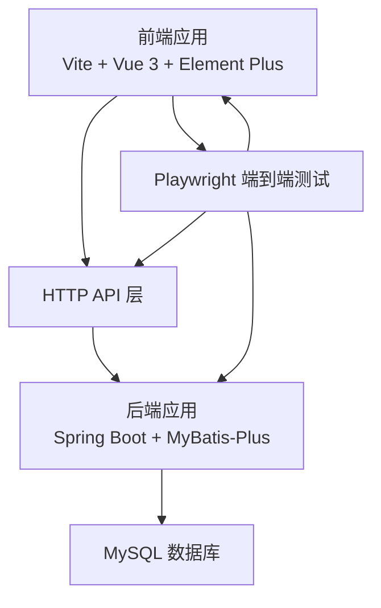
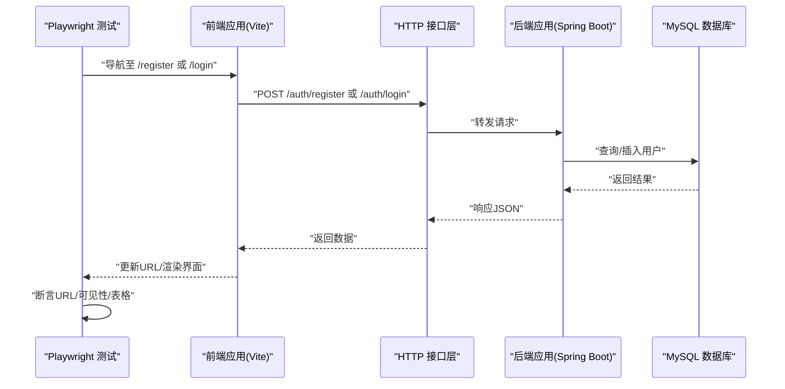
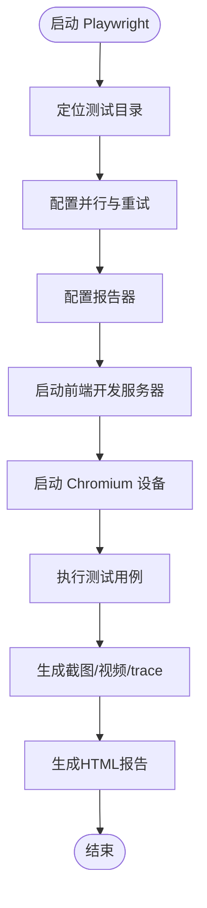
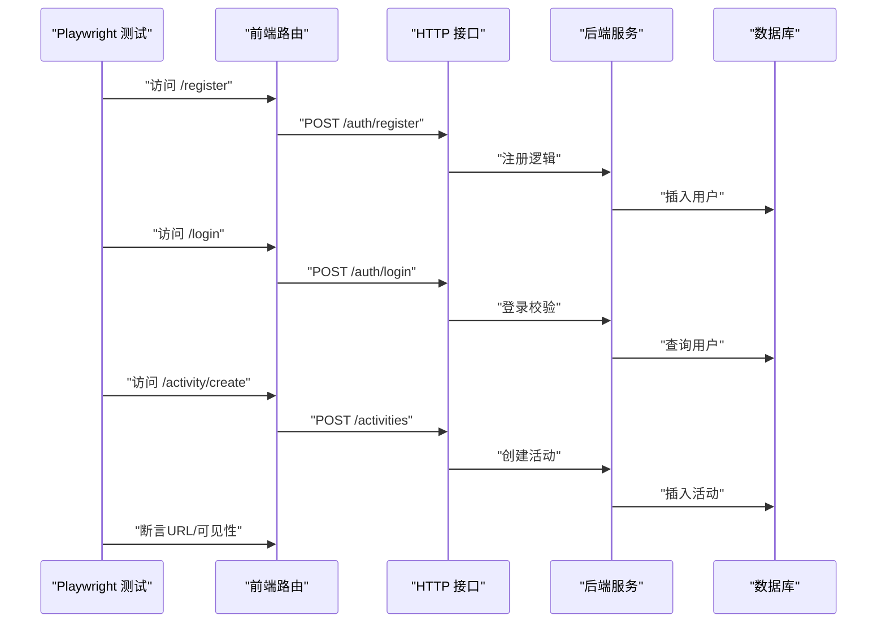
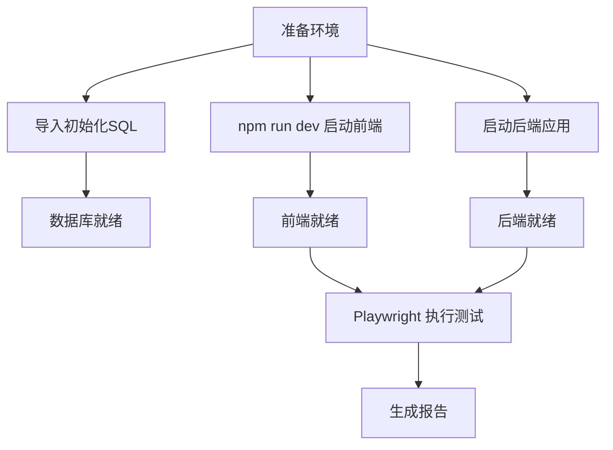
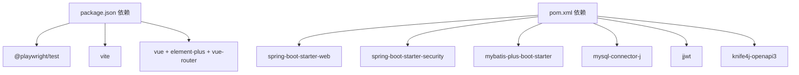

# 集成测试

<cite>
**本文引用的文件**
- [campus-forum-frontend/playwright.config.js](file://campus-forum-frontend/playwright.config.js)
- [campus-forum-frontend/tests/e2e/campus.spec.js](file://campus-forum-frontend/tests/e2e/campus.spec.js)
- [campus-forum-frontend/package.json](file://campus-forum-frontend/package.json)
- [campus-forum-frontend/src/api/auth.js](file://campus-forum-frontend/src/api/auth.js)
- [campus-forum-frontend/src/api/post.js](file://campus-forum-frontend/src/api/post.js)
- [campus-forum-frontend/src/api/activity.js](file://campus-forum-frontend/src/api/activity.js)
- [campus-forum-backend/pom.xml](file://campus-forum-backend/pom.xml)
- [campus-forum-backend/src/main/resources/application.yml](file://campus-forum-backend/src/main/resources/application.yml)
- [campus-forum-backend/docs/db/init.sql](file://campus-forum-backend/docs/db/init.sql)
- [campus-forum-backend/src/main/java/com/campus/forum/CampusForumApplication.java](file://campus-forum-backend/src/main/java/com/campus/forum/CampusForumApplication.java)
- [campus-forum-backend/src/test/java/com/campus/forum/service/AuthServiceTest.java](file://campus-forum-backend/src/test/java/com/campus/forum/service/AuthServiceTest.java)
- [campus-forum-backend/src/test/java/com/campus/forum/service/ActivityServiceTest.java](file://campus-forum-backend/src/test/java/com/campus/forum/service/ActivityServiceTest.java)
- [campus-forum-backend/src/test/java/com/campus/forum/service/RecommendServiceTest.java](file://campus-forum-backend/src/test/java/com/campus/forum/service/RecommendServiceTest.java)
</cite>

## 目录
1. [引言](#引言)
2. [项目结构](#项目结构)
3. [核心组件](#核心组件)
4. [架构总览](#架构总览)
5. [详细组件分析](#详细组件分析)
6. [依赖分析](#依赖分析)
7. [性能考虑](#性能考虑)
8. [故障排查指南](#故障排查指南)
9. [结论](#结论)
10. [附录](#附录)

## 引言
本文件面向PBL项目的集成测试实践，围绕端到端测试展开，重点覆盖以下方面：
- Playwright框架的配置与使用策略
- 用户场景测试设计思路与测试流程编排
- 页面交互测试的实现方法（元素定位、事件触发、状态验证）
- 测试环境搭建与配置（测试数据库准备、API服务启动）
- 具体测试场景示例（用户登录、帖子发布、活动报名等）
- 测试数据管理、测试结果分析与持续集成中的执行策略

## 项目结构
前端采用Vite + Vue 3 + Element Plus + Vue Router，后端采用Spring Boot + MyBatis-Plus + Spring Security + JWT。测试体系由前端Playwright端到端测试与后端单元测试构成。

**图表来源**
- [campus-forum-frontend/package.json:1-37](file://campus-forum-frontend/package.json#L1-L37)
- [campus-forum-backend/pom.xml:1-136](file://campus-forum-backend/pom.xml#L1-L136)
- [campus-forum-backend/src/main/resources/application.yml:1-53](file://campus-forum-backend/src/main/resources/application.yml#L1-L53)

**章节来源**
- [campus-forum-frontend/package.json:1-37](file://campus-forum-frontend/package.json#L1-L37)
- [campus-forum-backend/pom.xml:1-136](file://campus-forum-backend/pom.xml#L1-L136)
- [campus-forum-backend/src/main/resources/application.yml:1-53](file://campus-forum-backend/src/main/resources/application.yml#L1-L53)

## 核心组件
- 前端Playwright配置与测试套件
  - 配置项：测试目录、并行策略、重试次数、报告器、浏览器设备、webServer启动命令与端口、截图/视频/trace策略
  - 测试套件：按用户场景划分的测试描述块，覆盖注册登录、活动发布/评论、帖子发布、收藏、AI助手、管理后台等
- 后端Spring Boot应用与数据库
  - 应用入口、MyBatis-Plus扫描、数据库连接、JWT与AI配置、Knife4j文档
  - 初始化SQL脚本：用户、版块、活动、报名、帖子、评论、点赞、收藏、关注、私信、通知、行为、公告、AI历史等表及管理员/测试用户初始化

**章节来源**
- [campus-forum-frontend/playwright.config.js:1-35](file://campus-forum-frontend/playwright.config.js#L1-L35)
- [campus-forum-frontend/tests/e2e/campus.spec.js:1-141](file://campus-forum-frontend/tests/e2e/campus.spec.js#L1-L141)
- [campus-forum-backend/src/main/java/com/campus/forum/CampusForumApplication.java:1-17](file://campus-forum-backend/src/main/java/com/campus/forum/CampusForumApplication.java#L1-L17)
- [campus-forum-backend/src/main/resources/application.yml:1-53](file://campus-forum-backend/src/main/resources/application.yml#L1-L53)
- [campus-forum-backend/docs/db/init.sql:1-257](file://campus-forum-backend/docs/db/init.sql#L1-L257)

## 架构总览
下图展示端到端测试的系统交互：Playwright驱动浏览器访问前端路由，前端通过Axios调用后端REST接口，后端经MyBatis-Plus访问MySQL数据库；测试通过断言URL变化、可见性、表格渲染等进行状态验证。

**图表来源**
- [campus-forum-frontend/tests/e2e/campus.spec.js:10-19](file://campus-forum-frontend/tests/e2e/campus.spec.js#L10-L19)
- [campus-forum-frontend/src/api/auth.js:1-4](file://campus-forum-frontend/src/api/auth.js#L1-L4)
- [campus-forum-backend/src/main/resources/application.yml:1-53](file://campus-forum-backend/src/main/resources/application.yml#L1-L53)

## 详细组件分析

### Playwright配置与运行策略
- 测试目录与并行：指定测试目录，CI环境下启用重试，工作进程限制为1以避免并发资源竞争
- 报告器：生成HTML报告与控制台列表，便于CI与本地复盘
- 测试环境：baseURL指向前端开发服务器，webServer自动启动前端，超时设置合理
- 截图/视频/Trace：失败时保留视频与截图，首次重试时开启trace，便于定位问题
- 设备：默认使用桌面Chrome设备

**图表来源**
- [campus-forum-frontend/playwright.config.js:1-35](file://campus-forum-frontend/playwright.config.js#L1-L35)

**章节来源**
- [campus-forum-frontend/playwright.config.js:1-35](file://campus-forum-frontend/playwright.config.js#L1-L35)

### 用户场景测试设计与实现
- 场景一：用户注册与登录
  - 步骤：访问注册页，填写用户名/昵称/密码，点击注册按钮，断言跳转到登录页
  - 断言：URL正则匹配、输入框占位符选择器、按钮文本选择器
- 场景二：活动发布与评论
  - 步骤：登录后访问活动创建页，填写标题/地点/描述，点击发布；进入活动列表后点击第一条，填写评论并提交
  - 断言：URL跳转、评论文本可见性
- 场景三：帖子发布
  - 步骤：登录后访问发帖页，选择版块，填写标题与内容，点击发布
  - 断言：跳转到发现页
- 场景四：收藏功能
  - 步骤：登录后访问活动页，点击第一条卡片，点击收藏按钮
  - 断言：收藏按钮显示“已收藏”
- 场景五：AI助手对话
  - 步骤：登录后访问AI助手页，点击快捷问题，断言消息容器可见
- 场景六：管理后台
  - 步骤：登录管理员账号，访问后台仪表盘、用户列表、帖子列表，发布公告
  - 断言：页面标题/表格/成功提示可见

**图表来源**
- [campus-forum-frontend/tests/e2e/campus.spec.js:10-47](file://campus-forum-frontend/tests/e2e/campus.spec.js#L10-L47)
- [campus-forum-frontend/src/api/activity.js:1-9](file://campus-forum-frontend/src/api/activity.js#L1-L9)

**章节来源**
- [campus-forum-frontend/tests/e2e/campus.spec.js:10-141](file://campus-forum-frontend/tests/e2e/campus.spec.js#L10-L141)

### 页面交互测试实现方法
- 元素定位
  - 使用占位符选择器与按钮文本选择器，确保对UI变更具备一定鲁棒性
  - 列表/卡片场景使用nth索引或hover类选择器
- 事件触发
  - fill用于输入，click用于按钮与下拉选择
  - 表单提交后等待URL变化或页面元素出现
- 状态验证
  - URL断言：toHaveURL正则匹配
  - 可见性断言：toBeVisible
  - 表格/卡片断言：定位到.el-table/.card-hover等容器

**章节来源**
- [campus-forum-frontend/tests/e2e/campus.spec.js:10-141](file://campus-forum-frontend/tests/e2e/campus.spec.js#L10-L141)

### 测试环境搭建与配置
- 前端
  - 安装依赖后通过npm run dev启动Vite开发服务器，默认监听5173端口
  - Playwright通过webServer自动启动前端，避免手动管理
- 后端
  - Spring Boot应用默认端口8080，数据库连接配置在application.yml中
  - 使用初始化SQL脚本创建数据库与表，并预置管理员与测试用户
- 数据库
  - 初始化脚本包含用户、版块、活动、报名、帖子、评论、点赞、收藏、关注、私信、通知、行为、公告、AI历史等表
  - 管理员账号与测试账号已在脚本中初始化，便于测试直接使用

**图表来源**
- [campus-forum-backend/docs/db/init.sql:1-257](file://campus-forum-backend/docs/db/init.sql#L1-L257)
- [campus-forum-backend/src/main/resources/application.yml:1-53](file://campus-forum-backend/src/main/resources/application.yml#L1-L53)
- [campus-forum-frontend/playwright.config.js:28-33](file://campus-forum-frontend/playwright.config.js#L28-L33)

**章节来源**
- [campus-forum-backend/docs/db/init.sql:1-257](file://campus-forum-backend/docs/db/init.sql#L1-L257)
- [campus-forum-backend/src/main/resources/application.yml:1-53](file://campus-forum-backend/src/main/resources/application.yml#L1-L53)
- [campus-forum-frontend/playwright.config.js:28-33](file://campus-forum-frontend/playwright.config.js#L28-L33)

### 具体测试场景示例

#### 用户登录流程
- 步骤：访问登录页，输入用户名/密码，点击登录，等待跳转首页
- 断言：URL跳转到根路径
- 失败处理：开启trace，失败时保留视频与截图

**章节来源**
- [campus-forum-frontend/tests/e2e/campus.spec.js:21-29](file://campus-forum-frontend/tests/e2e/campus.spec.js#L21-L29)

#### 帖子发布流程
- 步骤：登录后访问发帖页，选择版块，填写标题与内容，点击发布
- 断言：跳转到发现页

**章节来源**
- [campus-forum-frontend/tests/e2e/campus.spec.js:49-68](file://campus-forum-frontend/tests/e2e/campus.spec.js#L49-L68)

#### 活动报名流程
- 步骤：登录后访问活动详情，点击报名按钮
- 断言：报名成功提示可见（需结合后端报名接口与前端提示）

**章节来源**
- [campus-forum-frontend/tests/e2e/campus.spec.js:21-47](file://campus-forum-frontend/tests/e2e/campus.spec.js#L21-L47)

### 测试数据管理
- 初始化数据：通过初始化SQL脚本预置管理员与测试用户，便于直接登录测试
- 测试隔离：建议在CI中使用独立数据库实例或迁移脚本清理/回滚
- 前端API封装：通过统一的API模块封装HTTP请求，便于替换baseURL或mock

**章节来源**
- [campus-forum-backend/docs/db/init.sql:252-257](file://campus-forum-backend/docs/db/init.sql#L252-L257)
- [campus-forum-frontend/src/api/auth.js:1-4](file://campus-forum-frontend/src/api/auth.js#L1-L4)
- [campus-forum-frontend/src/api/post.js:1-7](file://campus-forum-frontend/src/api/post.js#L1-L7)
- [campus-forum-frontend/src/api/activity.js:1-9](file://campus-forum-frontend/src/api/activity.js#L1-L9)

### 测试结果分析与持续集成
- 报告器：HTML报告输出到playwright-report目录，便于CI查看
- CI策略：在CI环境中启用重试与trace，失败时保留视频/截图，提升可诊断性
- 并发与稳定性：工作进程设为1，避免并发导致的不稳定

**章节来源**
- [campus-forum-frontend/playwright.config.js:9-12](file://campus-forum-frontend/playwright.config.js#L9-L12)
- [campus-forum-frontend/playwright.config.js:7-8](file://campus-forum-frontend/playwright.config.js#L7-L8)
- [campus-forum-frontend/playwright.config.js:8](file://campus-forum-frontend/playwright.config.js#L8)

## 依赖分析
- 前端依赖
  - Playwright作为端到端测试框架，Vite提供开发服务器，Vue生态组件(Element Plus)与路由(Vue Router)构成前端基础
- 后端依赖
  - Spring Boot + Spring Security + MyBatis-Plus + MySQL + JWT + Knife4j
- 测试依赖
  - 前端Playwright测试与后端JUnit/Mockito单元测试

**图表来源**
- [campus-forum-frontend/package.json:27-35](file://campus-forum-frontend/package.json#L27-L35)
- [campus-forum-backend/pom.xml:27-116](file://campus-forum-backend/pom.xml#L27-L116)

**章节来源**
- [campus-forum-frontend/package.json:1-37](file://campus-forum-frontend/package.json#L1-L37)
- [campus-forum-backend/pom.xml:1-136](file://campus-forum-backend/pom.xml#L1-L136)

## 性能考虑
- 测试执行速度
  - 串行执行（工作进程=1）保证稳定性，但耗时较长；可在CI中评估并行化策略
- 网络与数据库
  - 前端与后端在同一主机部署时延迟较低；数据库连接池与慢查询日志有助于定位瓶颈
- 资源占用
  - 截图/视频/trace在失败时才启用，减少常规执行开销

## 故障排查指南
- 测试不稳定
  - 提升重试次数，开启trace，检查网络与数据库连通性
- 页面元素找不到
  - 检查选择器是否过时，确认页面加载完成后再进行交互
- 登录失败
  - 核对初始化用户是否存在，确认密码是否正确，检查JWT签名与过期配置
- 数据库异常
  - 确认初始化SQL执行成功，数据库字符集与时区配置一致

**章节来源**
- [campus-forum-frontend/playwright.config.js:6-20](file://campus-forum-frontend/playwright.config.js#L6-L20)
- [campus-forum-backend/src/main/resources/application.yml:10-13](file://campus-forum-backend/src/main/resources/application.yml#L10-L13)
- [campus-forum-backend/docs/db/init.sql:252-257](file://campus-forum-backend/docs/db/init.sql#L252-L257)

## 结论
本集成测试方案基于Playwright与Spring Boot，覆盖用户注册登录、活动与帖子发布、收藏、AI助手以及管理后台等关键业务流程。通过合理的环境配置、稳定的断言策略与CI报告机制，能够有效保障端到端质量。后续可扩展更多场景与并行策略，在保证稳定性的前提下提升执行效率。

## 附录
- 后端单元测试参考
  - 认证服务测试：覆盖注册/登录成功与异常分支
  - 活动服务测试：覆盖浏览量+1、超员拦截、重复报名拦截
  - 推荐服务测试：覆盖冷启动兜底与有行为数据时的推荐

**章节来源**
- [campus-forum-backend/src/test/java/com/campus/forum/service/AuthServiceTest.java:1-124](file://campus-forum-backend/src/test/java/com/campus/forum/service/AuthServiceTest.java#L1-L124)
- [campus-forum-backend/src/test/java/com/campus/forum/service/ActivityServiceTest.java:1-95](file://campus-forum-backend/src/test/java/com/campus/forum/service/ActivityServiceTest.java#L1-L95)
- [campus-forum-backend/src/test/java/com/campus/forum/service/RecommendServiceTest.java:1-81](file://campus-forum-backend/src/test/java/com/campus/forum/service/RecommendServiceTest.java#L1-L81)