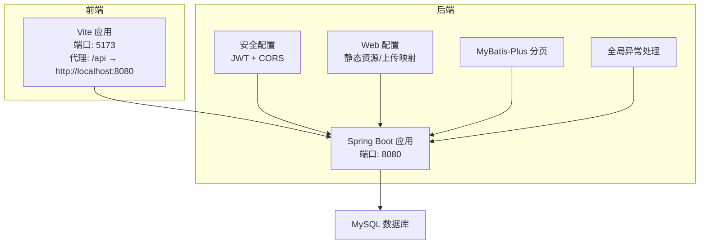
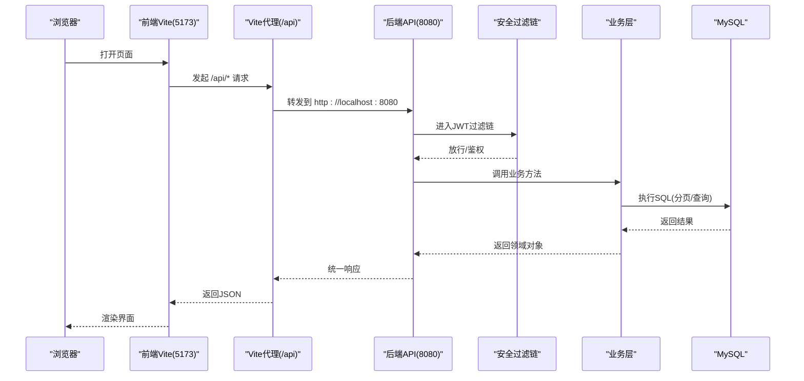
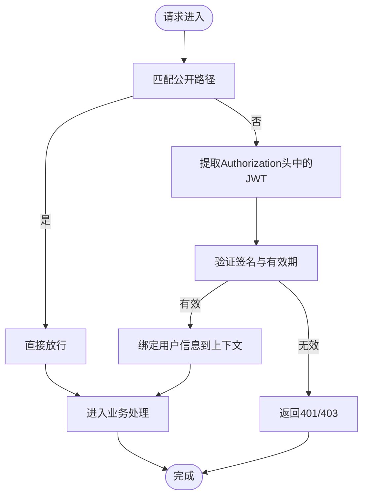
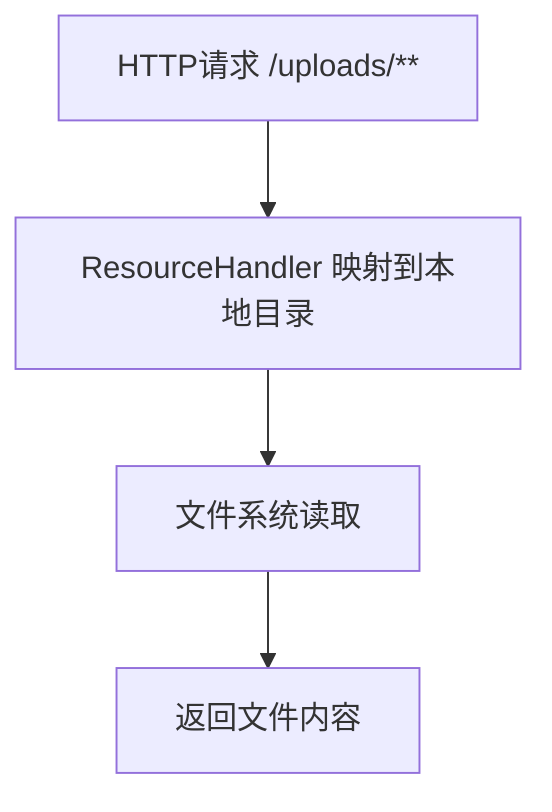
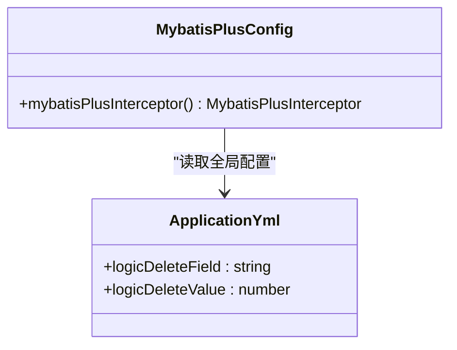
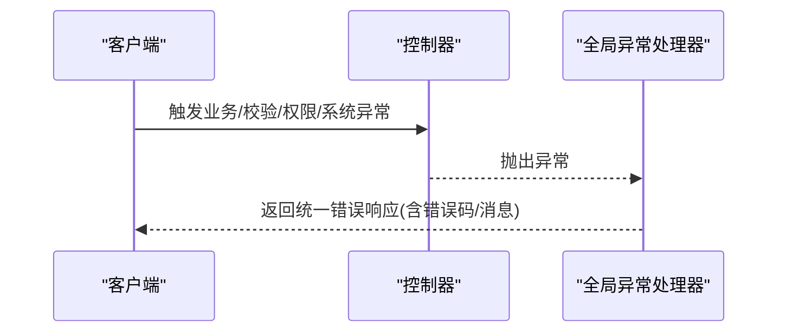
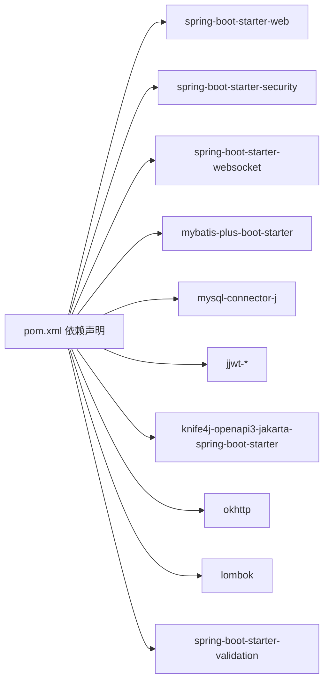

# 部署与运维

<cite>
**本文引用的文件**
- [application.yml](file://campus-forum-backend/src/main/resources/application.yml)
- [pom.xml](file://campus-forum-backend/pom.xml)
- [CampusForumApplication.java](file://campus-forum-backend/src/main/java/com/campus/forum/CampusForumApplication.java)
- [SecurityConfig.java](file://campus-forum-backend/src/main/java/com/campus/forum/config/SecurityConfig.java)
- [WebMvcConfig.java](file://campus-forum-backend/src/main/java/com/campus/forum/config/WebMvcConfig.java)
- [MybatisPlusConfig.java](file://campus-forum-backend/src/main/java/com/campus/forum/config/MybatisPlusConfig.java)
- [CorsConfig.java](file://campus-forum-backend/src/main/java/com/campus/forum/config/CorsConfig.java)
- [GlobalExceptionHandler.java](file://campus-forum-backend/src/main/java/com/campus/forum/common/GlobalExceptionHandler.java)
- [AuthController.java](file://campus-forum-backend/src/main/java/com/campus/forum/controller/AuthController.java)
- [UserServiceImpl.java](file://campus-forum-backend/src/main/java/com/campus/forum/service/impl/UserServiceImpl.java)
- [vite.config.js](file://campus-forum-frontend/vite.config.js)
- [package.json](file://campus-forum-frontend/package.json)
- [init.sql](file://campus-forum-backend/docs/db/init.sql)
</cite>

## 目录
1. [引言](#引言)
2. [项目结构](#项目结构)
3. [核心组件](#核心组件)
4. [架构总览](#架构总览)
5. [详细组件分析](#详细组件分析)
6. [依赖关系分析](#依赖关系分析)
7. [性能考虑](#性能考虑)
8. [故障排查指南](#故障排查指南)
9. [结论](#结论)
10. [附录](#附录)

## 引言
本指南面向PBL项目的部署与运维团队，覆盖开发与生产环境的部署配置、容器化与反向代理、SSL证书部署、环境变量与数据库连接池、缓存策略、监控与日志、错误追踪、性能优化、备份恢复与灾备、安全加固以及CI/CD流水线与自动化部署。文档以仓库现有代码与配置为基础，结合最佳实践给出可落地的实施方案。

## 项目结构
后端采用Spring Boot 3.2 + MyBatis-Plus，前端采用Vite+Vue3。整体为前后端分离架构，后端提供REST API与WebSocket，前端通过代理访问后端服务。

图表来源
- [vite.config.js:17-25](file://campus-forum-frontend/vite.config.js#L17-L25)
- [application.yml:1-53](file://campus-forum-backend/src/main/resources/application.yml#L1-L53)
- [SecurityConfig.java:42-65](file://campus-forum-backend/src/main/java/com/campus/forum/config/SecurityConfig.java#L42-L65)
- [WebMvcConfig.java:17-22](file://campus-forum-backend/src/main/java/com/campus/forum/config/WebMvcConfig.java#L17-L22)
- [MybatisPlusConfig.java:16-22](file://campus-forum-backend/src/main/java/com/campus/forum/config/MybatisPlusConfig.java#L16-L22)
- [GlobalExceptionHandler.java:15-56](file://campus-forum-backend/src/main/java/com/campus/forum/common/GlobalExceptionHandler.java#L15-L56)

章节来源
- [vite.config.js:1-27](file://campus-forum-frontend/vite.config.js#L1-L27)
- [application.yml:1-53](file://campus-forum-backend/src/main/resources/application.yml#L1-L53)
- [pom.xml:1-136](file://campus-forum-backend/pom.xml#L1-L136)

## 核心组件
- 应用启动器：负责扫描Mapper与启动Spring Boot应用。
- 安全与认证：基于JWT的无状态认证，CORS跨域放行，公开接口白名单。
- Web配置：静态资源与上传目录映射，支持文件上传大小限制。
- ORM与分页：MyBatis-Plus分页插件，逻辑删除配置。
- 全局异常处理：统一封装业务异常、参数校验异常与系统异常响应。
- 数据库初始化：提供完整建表与初始化数据脚本。

章节来源
- [CampusForumApplication.java:10-16](file://campus-forum-backend/src/main/java/com/campus/forum/CampusForumApplication.java#L10-L16)
- [SecurityConfig.java:24-66](file://campus-forum-backend/src/main/java/com/campus/forum/config/SecurityConfig.java#L24-L66)
- [WebMvcConfig.java:11-23](file://campus-forum-backend/src/main/java/com/campus/forum/config/WebMvcConfig.java#L11-L23)
- [MybatisPlusConfig.java:13-23](file://campus-forum-backend/src/main/java/com/campus/forum/config/MybatisPlusConfig.java#L13-L23)
- [GlobalExceptionHandler.java:15-56](file://campus-forum-backend/src/main/java/com/campus/forum/common/GlobalExceptionHandler.java#L15-L56)
- [init.sql:1-257](file://campus-forum-backend/docs/db/init.sql#L1-L257)

## 架构总览
后端服务通过Spring Security进行鉴权，JWT用于无状态认证；MyBatis-Plus提供ORM与分页能力；全局异常处理器统一输出错误码与消息；前端通过Vite代理访问后端API。

图表来源
- [vite.config.js:19-24](file://campus-forum-frontend/vite.config.js#L19-L24)
- [SecurityConfig.java:42-65](file://campus-forum-backend/src/main/java/com/campus/forum/config/SecurityConfig.java#L42-L65)
- [AuthController.java:26-37](file://campus-forum-backend/src/main/java/com/campus/forum/controller/AuthController.java#L26-L37)
- [UserServiceImpl.java:19-78](file://campus-forum-backend/src/main/java/com/campus/forum/service/impl/UserServiceImpl.java#L19-L78)

## 详细组件分析

### 安全与认证配置
- 无状态会话：禁用Cookie，使用JWT令牌。
- 接口白名单：认证、公开读取、Swagger/Knife4j、WebSocket等接口免鉴权。
- CORS：允许任意源、凭证、常用方法与头部，预检缓存1小时。
- 密码编码：BCrypt。

图表来源
- [SecurityConfig.java:49-62](file://campus-forum-backend/src/main/java/com/campus/forum/config/SecurityConfig.java#L49-L62)

章节来源
- [SecurityConfig.java:24-66](file://campus-forum-backend/src/main/java/com/campus/forum/config/SecurityConfig.java#L24-L66)
- [CorsConfig.java:15-31](file://campus-forum-backend/src/main/java/com/campus/forum/config/CorsConfig.java#L15-L31)

### 文件上传与静态资源
- 上传目录与URL前缀由配置文件控制，WebMvc将/uploads/** 映射到本地文件系统。
- 上传大小限制在配置文件中定义，避免过大文件占用带宽与磁盘。

图表来源
- [WebMvcConfig.java:17-22](file://campus-forum-backend/src/main/java/com/campus/forum/config/WebMvcConfig.java#L17-L22)
- [application.yml:43-46](file://campus-forum-backend/src/main/resources/application.yml#L43-L46)

章节来源
- [WebMvcConfig.java:11-23](file://campus-forum-backend/src/main/java/com/campus/forum/config/WebMvcConfig.java#L11-L23)
- [application.yml:14-17](file://campus-forum-backend/src/main/resources/application.yml#L14-L17)

### MyBatis-Plus分页与逻辑删除
- 分页插件：必须配置PaginationInnerInterceptor，否则分页不生效。
- 逻辑删除字段与值在全局配置中定义，Mapper层无需感知。

图表来源
- [MybatisPlusConfig.java:16-22](file://campus-forum-backend/src/main/java/com/campus/forum/config/MybatisPlusConfig.java#L16-L22)
- [application.yml:23-25](file://campus-forum-backend/src/main/resources/application.yml#L23-L25)

章节来源
- [MybatisPlusConfig.java:13-23](file://campus-forum-backend/src/main/java/com/campus/forum/config/MybatisPlusConfig.java#L13-L23)
- [application.yml:19-28](file://campus-forum-backend/src/main/resources/application.yml#L19-L28)

### 全局异常处理
- 统一包装响应体，区分业务异常、参数校验异常、权限不足与系统异常。
- 日志记录：业务异常与系统异常分别记录warn与error级别。

图表来源
- [GlobalExceptionHandler.java:19-55](file://campus-forum-backend/src/main/java/com/campus/forum/common/GlobalExceptionHandler.java#L19-L55)

章节来源
- [GlobalExceptionHandler.java:15-56](file://campus-forum-backend/src/main/java/com/campus/forum/common/GlobalExceptionHandler.java#L15-L56)

### 数据库初始化与表结构
- 提供完整的DDL与初始化数据，包含用户、版块、活动、帖子、评论、点赞、收藏、关注、私信、通知、行为日志、公告、AI对话历史等。
- 建议生产环境使用独立的初始化脚本与迁移工具管理版本。

章节来源
- [init.sql:1-257](file://campus-forum-backend/docs/db/init.sql#L1-L257)

## 依赖关系分析
后端依赖Spring Boot Web、Security、WebSocket、MyBatis-Plus、MySQL驱动、JWT、Knife4j、OkHttp3等。前端依赖Vue3、路由、状态管理、UI库、图表库与编辑器等。

图表来源
- [pom.xml:27-117](file://campus-forum-backend/pom.xml#L27-L117)

章节来源
- [pom.xml:1-136](file://campus-forum-backend/pom.xml#L1-L136)

## 性能考虑
- JVM调优
  - 建议在容器运行时设置堆内存初始与最大值，并开启G1GC；根据QPS与RT调整新生代比例。
  - 开启JFR与GC日志采集，便于定位停顿与内存问题。
- 数据库查询优化
  - 使用MyBatis-Plus分页插件，避免一次性加载全量数据。
  - 为高频查询字段建立索引（如用户、版块、活动、评论相关索引）。
  - 对热点表启用连接池与慢查询日志，定期审查执行计划。
- 前端资源压缩
  - 生产构建启用代码分割、Tree-Shaking与CSS/JS压缩。
  - 使用CDN加速静态资源，开启HTTP/2与持久连接。
- 缓存策略
  - 对热点读取（如版块列表、热门帖子）引入Redis缓存，设置合理过期时间与淘汰策略。
  - 对写操作采用“先更新数据库再失效缓存”策略，保证一致性。
- 并发与限流
  - 在网关或应用层对敏感接口（登录、注册、AI调用）做限流与熔断。
- 监控与日志
  - 后端接入APM（如SkyWalking/OpenTelemetry），采集指标、链路追踪与日志。
  - 前端埋点上报关键事件与错误，结合后端日志聚合分析。

## 故障排查指南
- 认证失败
  - 检查JWT密钥与过期时间配置，确认请求头携带正确令牌。
  - 查看安全过滤链是否正确放行公开接口。
- 跨域问题
  - 确认CORS配置允许的源、方法与头部，检查预检请求是否命中。
- 文件上传失败
  - 检查上传目录权限与磁盘空间，核对配置文件中的上传大小限制。
- 数据库连接异常
  - 检查数据库地址、端口、账号密码与网络连通性；核对连接池参数。
- 全局异常
  - 查看统一异常处理器的日志输出，定位具体异常类型与堆栈。

章节来源
- [SecurityConfig.java:49-62](file://campus-forum-backend/src/main/java/com/campus/forum/config/SecurityConfig.java#L49-L62)
- [CorsConfig.java:18-30](file://campus-forum-backend/src/main/java/com/campus/forum/config/CorsConfig.java#L18-L30)
- [WebMvcConfig.java:17-22](file://campus-forum-backend/src/main/java/com/campus/forum/config/WebMvcConfig.java#L17-L22)
- [application.yml:9-17](file://campus-forum-backend/src/main/resources/application.yml#L9-L17)
- [GlobalExceptionHandler.java:19-55](file://campus-forum-backend/src/main/java/com/campus/forum/common/GlobalExceptionHandler.java#L19-L55)

## 结论
本指南基于现有代码与配置，给出了从开发到生产的部署与运维要点。建议在生产环境中补充容器编排、反向代理、SSL证书、监控日志、备份恢复与安全加固，并通过CI/CD实现自动化交付。

## 附录

### 开发环境与生产环境部署配置
- 开发环境
  - 后端：本地运行，端口8080；前端：Vite本地开发服务器5173，代理到后端。
  - 数据库：本地MySQL，初始化脚本导入。
- 生产环境
  - 反向代理：Nginx监听443，转发至后端8080；静态资源走CDN。
  - SSL：申请并部署证书，强制HTTPS重定向。
  - 容器化：打包为镜像，使用Docker Compose或Kubernetes编排。
  - 环境变量：数据库连接、JWT密钥、AI API密钥、上传路径等通过环境注入。

章节来源
- [application.yml:1-53](file://campus-forum-backend/src/main/resources/application.yml#L1-L53)
- [vite.config.js:17-25](file://campus-forum-frontend/vite.config.js#L17-L25)

### 环境变量与数据库连接池
- 环境变量示例
  - 数据库：DB_URL、DB_USER、DB_PASSWORD
  - JWT：JWT_SECRET、JWT_EXPIRATION
  - AI：AI_API_KEY、AI_SECRET_KEY、AI_PROVIDER、AI_MODEL、AI_BASE_URL
  - 上传：UPLOAD_PATH、UPLOAD_URL_PREFIX
- 连接池建议
  - HikariCP：设置最小空闲、最大池大小、连接超时、空闲超时、生命周期等。
  - 监控：启用池内统计与慢查询检测。

章节来源
- [application.yml:9-17](file://campus-forum-backend/src/main/resources/application.yml#L9-L17)
- [application.yml:31-41](file://campus-forum-backend/src/main/resources/application.yml#L31-L41)

### 缓存策略优化
- 读多写少场景：热点数据放入Redis，设置TTL与过期策略。
- 写一致性：先写数据库，再异步/同步失效缓存。
- 缓存穿透：对空结果也缓存短时间。
- 缓存雪崩：为TTL增加抖动，避免同时过期。

### 应用监控与日志
- 指标：QPS、响应时间、错误率、连接池状态、JVM GC与堆内存。
- 日志：按天切割、保留周期、脱敏处理；集中存储与检索。
- 错误追踪：统一异常捕获与上报，结合链路ID定位问题。

### 备份恢复与灾备
- 数据库备份：定时全量+增量备份，异地存放；定期演练恢复。
- 文件备份：上传目录纳入备份范围。
- 灾难恢复：多机房部署，自动切换与回切策略。

### 安全加固
- 传输安全：强制HTTPS、HSTS、TLS1.3。
- 认证授权：强密码策略、令牌刷新、黑名单、IP白名单。
- 输入校验：严格参数校验与长度限制，防注入与XSS。
- 权限控制：RBAC最小权限、接口鉴权与审计日志。

### CI/CD流水线与自动化部署
- 流水线阶段
  - 代码检出、依赖安装、单元测试、E2E测试、构建镜像、推送仓库、滚动部署。
- 自动化
  - Docker镜像版本标签、蓝绿/金丝雀发布、健康检查与自动回滚。
- 前端
  - Vite构建产物部署至Nginx或CDN，配合版本号缓存策略。

章节来源
- [pom.xml:119-134](file://campus-forum-backend/pom.xml#L119-L134)
- [package.json:6-12](file://campus-forum-frontend/package.json#L6-L12)