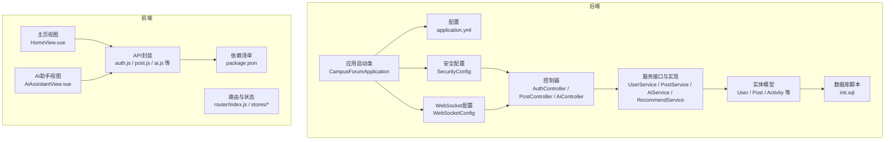
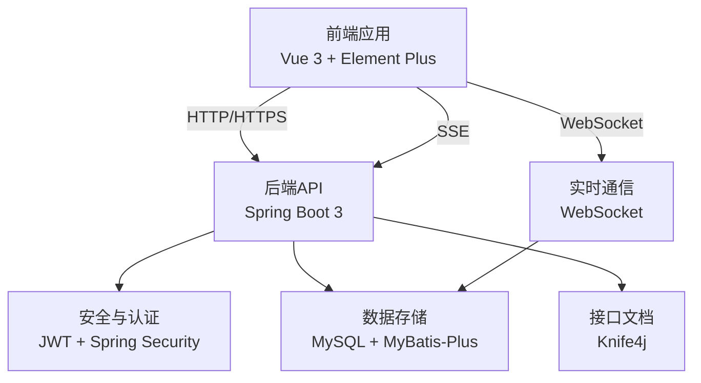
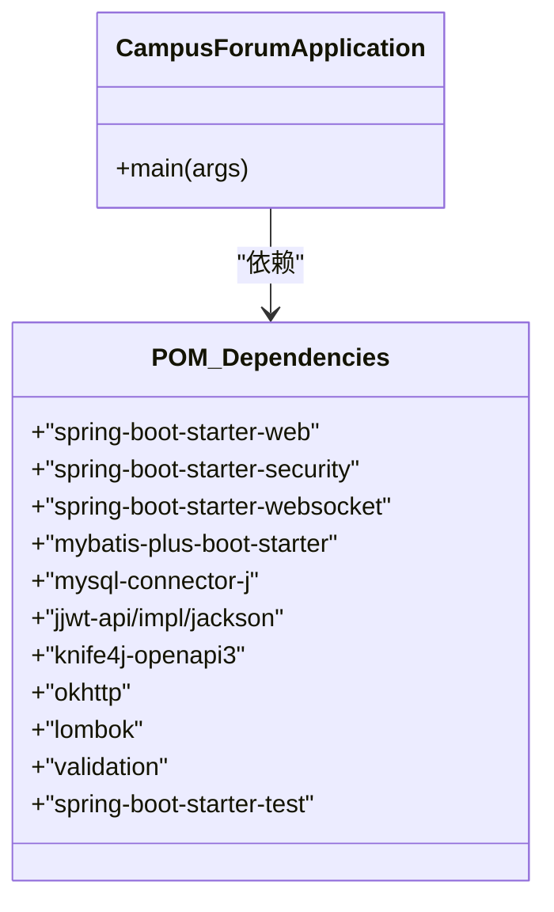
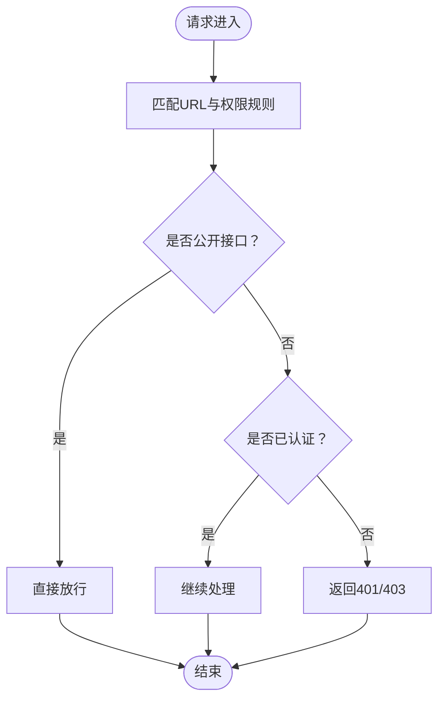
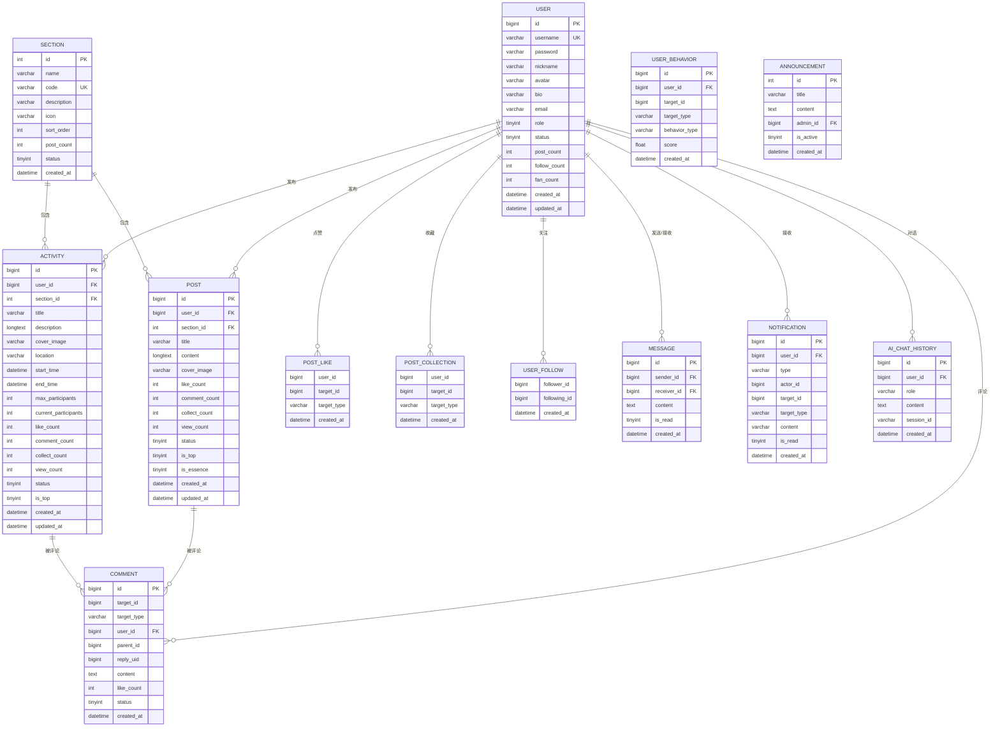
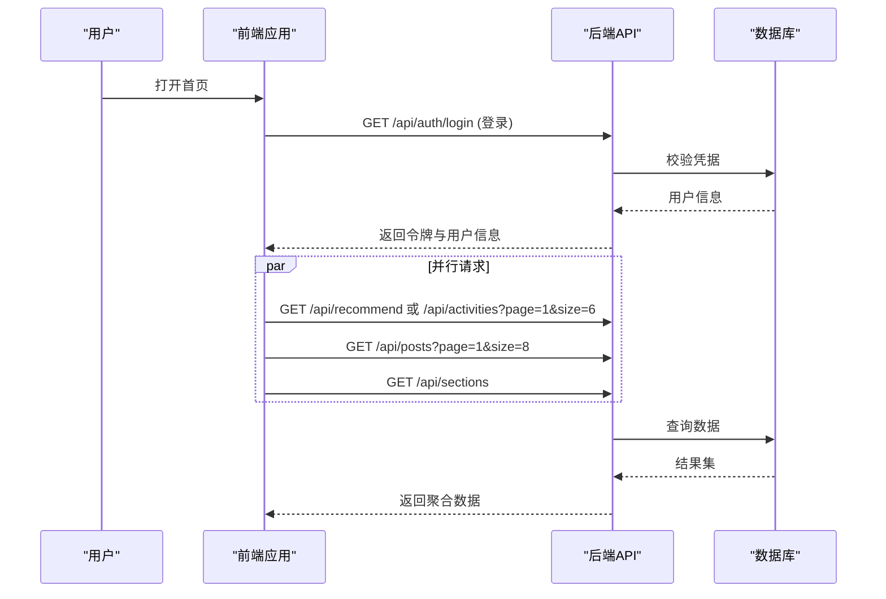
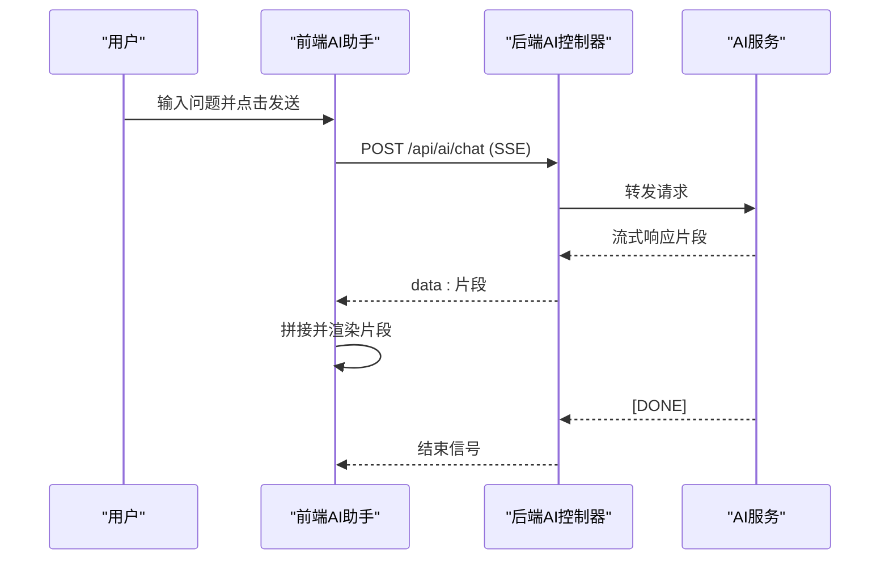
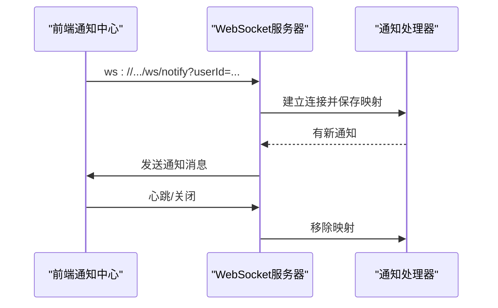
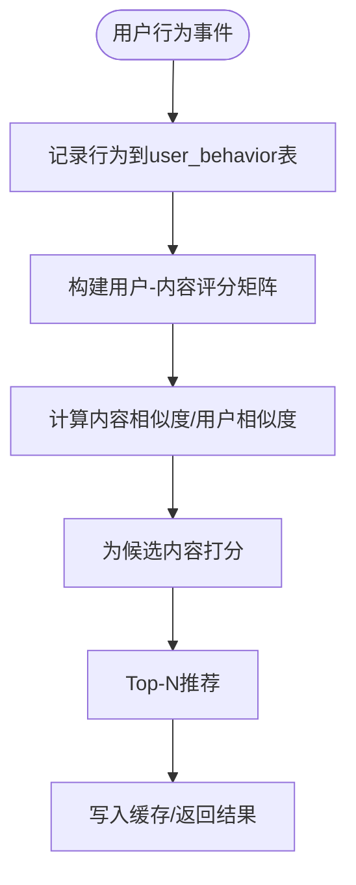
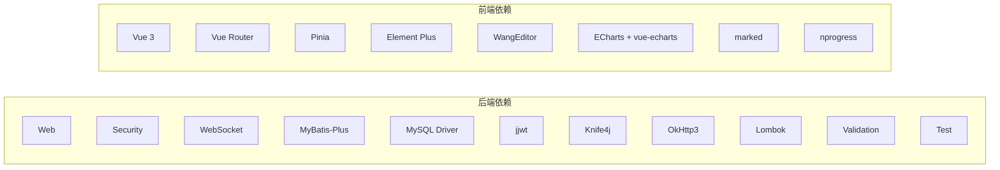

# 项目概述

<cite>
**本文引用的文件**
- [CampusForumApplication.java](file://campus-forum-backend/src/main/java/com/campus/forum/CampusForumApplication.java)
- [pom.xml](file://campus-forum-backend/pom.xml)
- [application.yml](file://campus-forum-backend/src/main/resources/application.yml)
- [init.sql](file://campus-forum-backend/docs/db/init.sql)
- [AuthController.java](file://campus-forum-backend/src/main/java/com/campus/forum/controller/AuthController.java)
- [PostController.java](file://campus-forum-backend/src/main/java/com/campus/forum/controller/PostController.java)
- [AiController.java](file://campus-forum-backend/src/main/java/com/campus/forum/controller/AiController.java)
- [SecurityConfig.java](file://campus-forum-backend/src/main/java/com/campus/forum/config/SecurityConfig.java)
- [WebSocketConfig.java](file://campus-forum-backend/src/main/java/com/campus/forum/config/WebSocketConfig.java)
- [NotificationWebSocketHandler.java](file://campus-forum-backend/src/main/java/com/campus/forum/websocket/NotificationWebSocketHandler.java)
- [User.java](file://campus-forum-backend/src/main/java/com/campus/forum/entity/User.java)
- [UserService.java](file://campus-forum-backend/src/main/java/com/campus/forum/service/UserService.java)
- [RecommendService.java](file://campus-forum-backend/src/main/java/com/campus/forum/service/RecommendService.java)
- [HomeView.vue](file://campus-forum-frontend/src/views/HomeView.vue)
- [AiAssistantView.vue](file://campus-forum-frontend/src/views/AiAssistantView.vue)
- [package.json](file://campus-forum-frontend/package.json)
- [contribution.md](file://docs/contribution.md)
</cite>

## 目录
1. [引言](#引言)
2. [项目结构](#项目结构)
3. [核心组件](#核心组件)
4. [架构总览](#架构总览)
5. [详细组件分析](#详细组件分析)
6. [依赖分析](#依赖分析)
7. [性能考虑](#性能考虑)
8. [故障排查指南](#故障排查指南)
9. [结论](#结论)
10. [附录](#附录)

## 引言
本项目是一个面向校园社区的社交论坛平台，围绕“活动发布+论坛讨论+智能助手+实时通知”的核心业务展开，旨在为学生与教师提供便捷的信息发布、互动交流与智能化服务体验。系统采用前后端分离架构，后端基于 Spring Boot 3 + MyBatis-Plus，前端基于 Vue 3 + Element Plus，集成 JWT 认证、WebSocket 实时通知、SSE 流式对话与 AI 大模型能力，覆盖从用户认证、内容管理、社交互动到智能推荐与内容审核的完整闭环。

## 项目结构
- 后端工程（campus-forum-backend）
  - 应用启动类、配置、控制器、服务层、数据访问层、安全与WebSocket配置、实体与DTO、WebSocket处理器
  - 资源文件包含数据库连接、MyBatis-Plus配置、JWT与AI配置、Knife4j文档配置
  - 数据库初始化脚本包含完整的表结构与预置数据
- 前端工程（campus-forum-frontend）
  - 页面视图、API封装、路由与状态管理、UI组件与图表组件
  - 包含单元测试与端到端测试配置

**图表来源**
- [CampusForumApplication.java:10-16](file://campus-forum-backend/src/main/java/com/campus/forum/CampusForumApplication.java#L10-L16)
- [application.yml:1-53](file://campus-forum-backend/src/main/resources/application.yml#L1-L53)
- [SecurityConfig.java:24-66](file://campus-forum-backend/src/main/java/com/campus/forum/config/SecurityConfig.java#L24-L66)
- [WebSocketConfig.java:12-27](file://campus-forum-backend/src/main/java/com/campus/forum/config/WebSocketConfig.java#L12-L27)
- [AuthController.java:18-38](file://campus-forum-backend/src/main/java/com/campus/forum/controller/AuthController.java#L18-L38)
- [PostController.java:16-64](file://campus-forum-backend/src/main/java/com/campus/forum/controller/PostController.java#L16-L64)
- [AiController.java:27-73](file://campus-forum-backend/src/main/java/com/campus/forum/controller/AiController.java#L27-L73)
- [User.java:10-32](file://campus-forum-backend/src/main/java/com/campus/forum/entity/User.java#L10-L32)
- [init.sql:1-257](file://campus-forum-backend/docs/db/init.sql#L1-L257)
- [HomeView.vue:1-135](file://campus-forum-frontend/src/views/HomeView.vue#L1-L135)
- [AiAssistantView.vue:1-133](file://campus-forum-frontend/src/views/AiAssistantView.vue#L1-L133)
- [package.json:1-37](file://campus-forum-frontend/package.json#L1-L37)

**章节来源**
- [CampusForumApplication.java:10-16](file://campus-forum-backend/src/main/java/com/campus/forum/CampusForumApplication.java#L10-L16)
- [application.yml:1-53](file://campus-forum-backend/src/main/resources/application.yml#L1-L53)
- [init.sql:1-257](file://campus-forum-backend/docs/db/init.sql#L1-L257)
- [package.json:1-37](file://campus-forum-frontend/package.json#L1-L37)

## 核心组件
- 应用启动类：负责扫描Mapper与启动Spring Boot容器
- 控制器层：提供认证、帖子、活动、评论、收藏、通知、用户、AI等REST接口
- 服务层：封装业务逻辑，如用户资料、帖子增删改查、AI对话与内容审核、推荐算法等
- 安全与认证：基于JWT的无状态认证，结合Spring Security进行权限控制
- 实时通信：WebSocket用于通知推送与私信聊天
- 数据持久化：MyBatis-Plus + MySQL，支持逻辑删除、驼峰映射与分页
- 文档与调试：Knife4j OpenAPI集成，便于接口联调与测试
- 前端视图：主页聚合活动与帖子、AI助手流式对话、通知中心等

**章节来源**
- [CampusForumApplication.java:10-16](file://campus-forum-backend/src/main/java/com/campus/forum/CampusForumApplication.java#L10-L16)
- [AuthController.java:18-38](file://campus-forum-backend/src/main/java/com/campus/forum/controller/AuthController.java#L18-L38)
- [PostController.java:16-64](file://campus-forum-backend/src/main/java/com/campus/forum/controller/PostController.java#L16-L64)
- [AiController.java:27-73](file://campus-forum-backend/src/main/java/com/campus/forum/controller/AiController.java#L27-L73)
- [SecurityConfig.java:24-66](file://campus-forum-backend/src/main/java/com/campus/forum/config/SecurityConfig.java#L24-L66)
- [WebSocketConfig.java:12-27](file://campus-forum-backend/src/main/java/com/campus/forum/config/WebSocketConfig.java#L12-L27)
- [application.yml:19-53](file://campus-forum-backend/src/main/resources/application.yml#L19-L53)

## 架构总览
系统采用前后端分离架构，后端提供REST API与WebSocket服务，前端通过Axios与Fetch进行HTTP交互，Vue Router与Pinia管理路由与状态。JWT用于认证授权，Spring Security配置细粒度控制公开与受保护接口；WebSocket用于实时通知；SSE用于AI流式对话；Knife4j提供在线接口文档。

**图表来源**
- [package.json:13-26](file://campus-forum-frontend/package.json#L13-L26)
- [application.yml:1-53](file://campus-forum-backend/src/main/resources/application.yml#L1-L53)
- [SecurityConfig.java:43-65](file://campus-forum-backend/src/main/java/com/campus/forum/config/SecurityConfig.java#L43-L65)
- [WebSocketConfig.java:20-26](file://campus-forum-backend/src/main/java/com/campus/forum/config/WebSocketConfig.java#L20-L26)
- [pom.xml:27-117](file://campus-forum-backend/pom.xml#L27-L117)

## 详细组件分析

### 应用启动类与核心依赖
- 启动类启用Spring Boot自动装配与Mapper扫描，作为整个应用入口
- 核心依赖包括Web、Security、WebSocket、MyBatis-Plus、MySQL驱动、JWT、Knife4j、OkHttp3、Lombok、校验与测试等

**图表来源**
- [CampusForumApplication.java:10-16](file://campus-forum-backend/src/main/java/com/campus/forum/CampusForumApplication.java#L10-L16)
- [pom.xml:27-117](file://campus-forum-backend/pom.xml#L27-L117)

**章节来源**
- [CampusForumApplication.java:10-16](file://campus-forum-backend/src/main/java/com/campus/forum/CampusForumApplication.java#L10-L16)
- [pom.xml:20-25](file://campus-forum-backend/pom.xml#L20-L25)
- [pom.xml:27-117](file://campus-forum-backend/pom.xml#L27-L117)

### 认证与安全配置
- 基于Spring Security 6的SecurityFilterChain，禁用CSRF，开启跨域，无状态Session
- 公开接口（认证、静态资源、Swagger、WebSocket）与受保护接口（管理员/登录后）区分授权
- 密码编码采用BCrypt，认证管理器通过配置注入

**图表来源**
- [SecurityConfig.java:43-65](file://campus-forum-backend/src/main/java/com/campus/forum/config/SecurityConfig.java#L43-L65)

**章节来源**
- [SecurityConfig.java:24-66](file://campus-forum-backend/src/main/java/com/campus/forum/config/SecurityConfig.java#L24-L66)

### 数据库与实体模型
- 数据库初始化脚本包含用户、版块、活动、报名、帖子、评论、点赞、收藏、关注、私信、通知、用户行为、公告、AI对话历史等表
- 实体类遵循MyBatis-Plus注解规范，支持自动填充、逻辑删除字段与驼峰映射

**图表来源**
- [init.sql:10-249](file://campus-forum-backend/docs/db/init.sql#L10-L249)
- [User.java:10-32](file://campus-forum-backend/src/main/java/com/campus/forum/entity/User.java#L10-L32)

**章节来源**
- [init.sql:1-257](file://campus-forum-backend/docs/db/init.sql#L1-L257)
- [User.java:10-32](file://campus-forum-backend/src/main/java/com/campus/forum/entity/User.java#L10-L32)

### 前后端协作流程示例

#### 用户登录与主页加载
- 前端调用后端认证接口获取令牌
- 首页同时拉取推荐活动/帖子、版块导航与公告
- 前端根据登录态决定推荐策略

**图表来源**
- [AuthController.java:26-37](file://campus-forum-backend/src/main/java/com/campus/forum/controller/AuthController.java#L26-L37)
- [HomeView.vue:98-112](file://campus-forum-frontend/src/views/HomeView.vue#L98-L112)

**章节来源**
- [AuthController.java:18-38](file://campus-forum-backend/src/main/java/com/campus/forum/controller/AuthController.java#L18-L38)
- [HomeView.vue:82-112](file://campus-forum-frontend/src/views/HomeView.vue#L82-L112)

#### AI助手流式对话（SSE）
- 前端使用原生fetch + ReadableStream接收SSE流
- 后端通过SSE发射器返回增量数据，前端拼接显示

**图表来源**
- [AiController.java:43-51](file://campus-forum-backend/src/main/java/com/campus/forum/controller/AiController.java#L43-L51)
- [AiAssistantView.vue:67-108](file://campus-forum-frontend/src/views/AiAssistantView.vue#L67-L108)

**章节来源**
- [AiController.java:27-73](file://campus-forum-backend/src/main/java/com/campus/forum/controller/AiController.java#L27-L73)
- [AiAssistantView.vue:39-113](file://campus-forum-frontend/src/views/AiAssistantView.vue#L39-L113)

### 实时通知（WebSocket）
- 通知WebSocket通过URL参数携带用户标识，建立与用户的长连接
- 后端维护用户到Session的映射，按需推送通知消息

**图表来源**
- [WebSocketConfig.java:20-26](file://campus-forum-backend/src/main/java/com/campus/forum/config/WebSocketConfig.java#L20-L26)
- [NotificationWebSocketHandler.java:26-57](file://campus-forum-backend/src/main/java/com/campus/forum/websocket/NotificationWebSocketHandler.java#L26-L57)

**章节来源**
- [WebSocketConfig.java:12-27](file://campus-forum-backend/src/main/java/com/campus/forum/config/WebSocketConfig.java#L12-L27)
- [NotificationWebSocketHandler.java:13-77](file://campus-forum-backend/src/main/java/com/campus/forum/websocket/NotificationWebSocketHandler.java#L13-L77)

### 推荐系统与用户画像
- 推荐服务接口定义基于用户行为的协同过滤推荐
- 用户行为表记录浏览、点赞、收藏、评论等行为，支撑相似度计算与缓存策略

**图表来源**
- [RecommendService.java:6-8](file://campus-forum-backend/src/main/java/com/campus/forum/service/RecommendService.java#L6-L8)
- [init.sql:211-221](file://campus-forum-backend/docs/db/init.sql#L211-L221)

**章节来源**
- [RecommendService.java:1-9](file://campus-forum-backend/src/main/java/com/campus/forum/service/RecommendService.java#L1-L9)
- [init.sql:208-221](file://campus-forum-backend/docs/db/init.sql#L208-L221)

## 依赖分析
- 后端依赖
  - Web：spring-boot-starter-web
  - 安全：spring-boot-starter-security + jjwt
  - 实时：spring-boot-starter-websocket
  - ORM：mybatis-plus-boot-starter + mysql-connector-j
  - 文档：knife4j-openapi3
  - 工具：lombok + okhttp3（AI调用）
  - 校验与测试：spring-boot-starter-validation + spring-boot-starter-test
- 前端依赖
  - 框架：vue + vue-router + pinia
  - UI：element-plus + icons
  - 编辑器：@wangeditor/editor
  - 可视化：echarts + vue-echarts
  - 工具：marked（Markdown解析）、nprogress（进度条）

**图表来源**
- [pom.xml:27-117](file://campus-forum-backend/pom.xml#L27-L117)
- [package.json:13-26](file://campus-forum-frontend/package.json#L13-L26)

**章节来源**
- [pom.xml:27-117](file://campus-forum-backend/pom.xml#L27-L117)
- [package.json:13-26](file://campus-forum-frontend/package.json#L13-L26)

## 性能考虑
- 数据访问
  - MyBatis-Plus逻辑删除字段与驼峰映射减少SQL样板代码，提升开发效率
  - 分页查询与索引设计（如活动起始时间、用户主键等）降低查询成本
- 缓存策略
  - 推荐系统建议引入热点内容缓存与失效策略，避免重复计算
- 网络与I/O
  - SSE与WebSocket均适合长连接场景，注意连接池与背压处理
  - 文件上传大小限制与存储路径配置需结合实际容量规划
- 安全与认证
  - JWT过期时间与密钥强度应结合业务风险评估调整
  - Spring Security无状态策略降低会话开销，但需确保CORS与跨域配置正确

## 故障排查指南
- 认证失败
  - 检查JWT密钥与过期配置是否一致，确认请求头携带Bearer Token
  - 核对SecurityFilterChain中的放行路径与角色权限
- SSE流式对话异常
  - 确认前端使用原生fetch + ReadableStream接收，而非axios
  - 检查后端SSE编码与前端SSE数据行解析逻辑
- WebSocket通知不达
  - 确认URL参数包含userId且类型正确
  - 检查后端会话映射与连接生命周期
- 数据库连接问题
  - 校验application.yml中的数据库URL、用户名与密码
  - 确认初始化脚本执行成功，表结构与索引存在

**章节来源**
- [SecurityConfig.java:49-62](file://campus-forum-backend/src/main/java/com/campus/forum/config/SecurityConfig.java#L49-L62)
- [AiController.java:35-51](file://campus-forum-backend/src/main/java/com/campus/forum/controller/AiController.java#L35-L51)
- [AiAssistantView.vue:67-108](file://campus-forum-frontend/src/views/AiAssistantView.vue#L67-L108)
- [NotificationWebSocketHandler.java:26-57](file://campus-forum-backend/src/main/java/com/campus/forum/websocket/NotificationWebSocketHandler.java#L26-L57)
- [application.yml:9-17](file://campus-forum-backend/src/main/resources/application.yml#L9-L17)

## 结论
本项目以“活动发布+论坛讨论+智能助手+实时通知”为核心，构建了完整的校园社交生态。后端采用Spring Boot 3 + MyBatis-Plus + JWT + WebSocket + SSE的技术组合，前端以Vue 3为基础，配合Element Plus与可视化组件，形成高内聚、低耦合的前后端协作模式。通过数据库初始化脚本与清晰的模块划分，项目具备良好的扩展性与可维护性，适合在教学实践与团队协作中推广使用。

## 附录
- 运行环境要求
  - Java：17+
  - Maven：3.6+
  - Node.js：16+（前端）
  - MySQL：8.0+（本地或远程）
- 开发与测试
  - 后端：Spring Boot DevTools与JUnit/Mock测试
  - 前端：Vitest单元测试与Playwright端到端测试
- 团队贡献与分工
  - 项目团队成员在架构设计、核心功能、算法与UI文档等方面各有侧重，贡献值分配体现代码行数、Issue完成质量与架构贡献的综合评估

**章节来源**
- [contribution.md:1-168](file://docs/contribution.md#L1-L168)